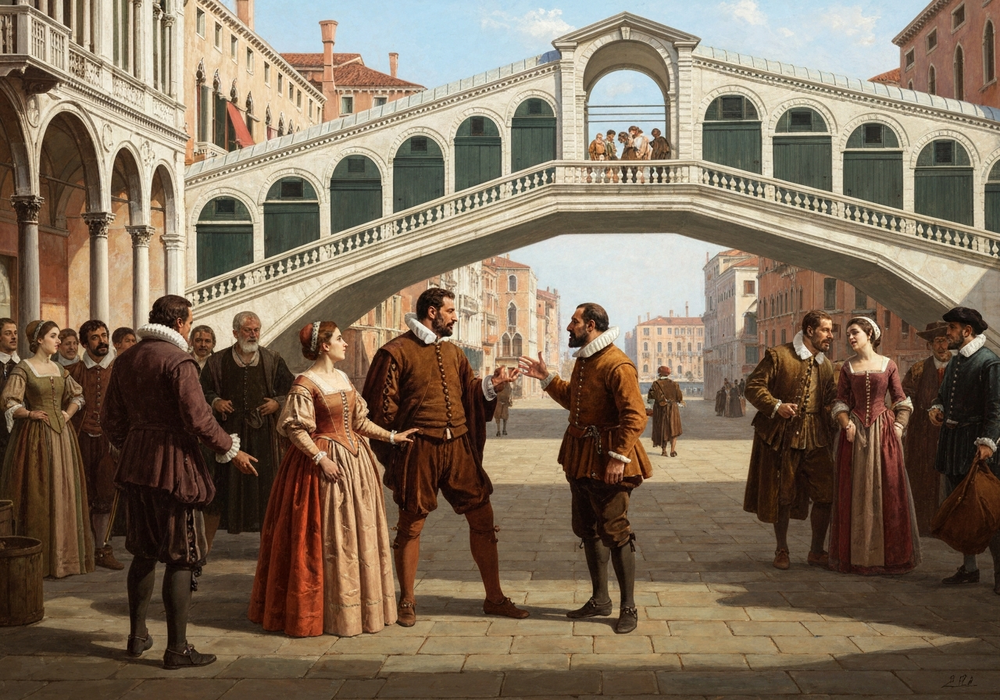
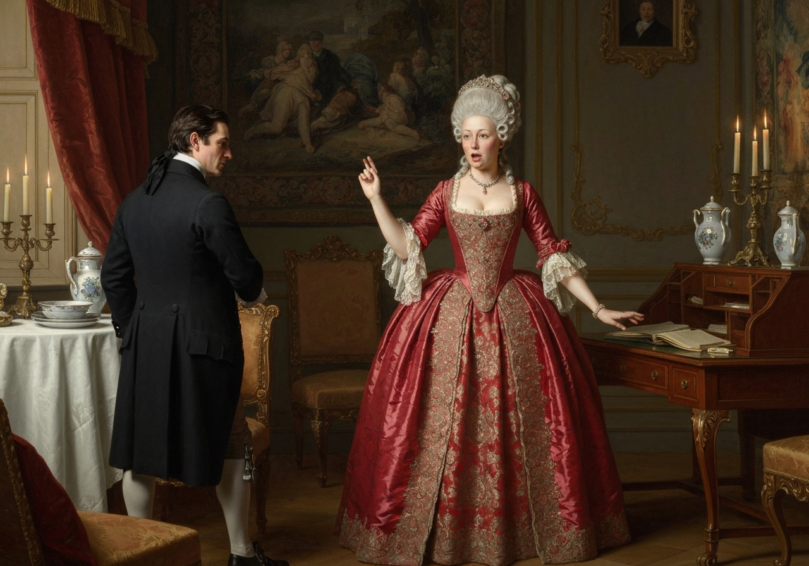
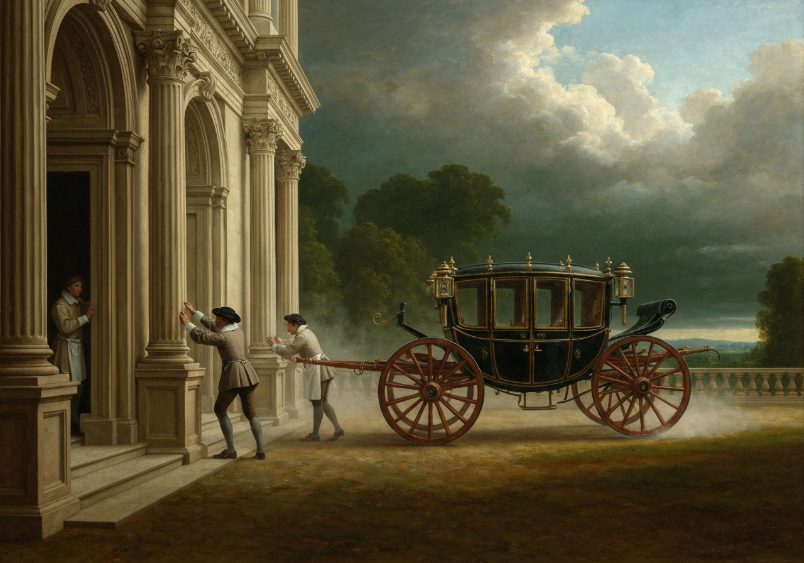
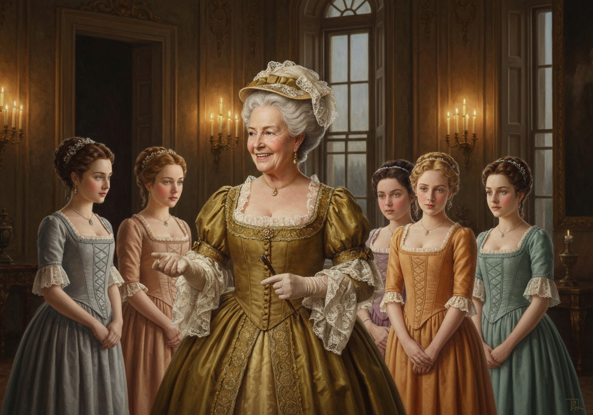
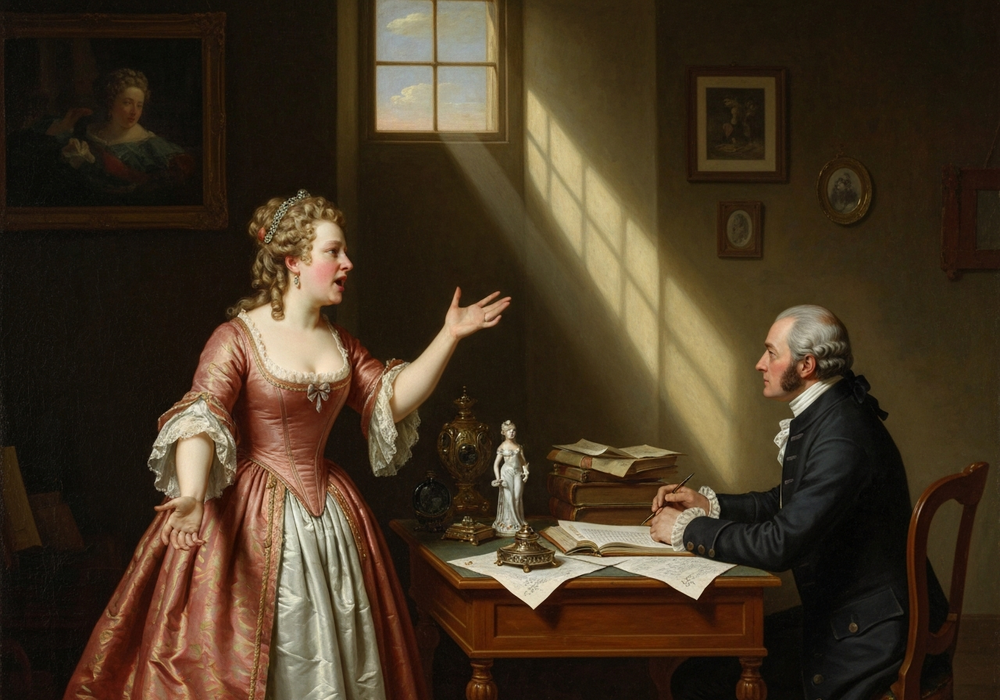

import Callout from '@/components/Callout.astro'

<Callout title="Memorable Quote" variant="note">
إنها حقيقة معترف بها عالميًا، وهي أن رجلاً أعزب يمتلك ثروة كبيرة لابد وأن يكون في حاجة إلى زوجة.
</Callout>

<Callout title="Analysis [1]" variant="explanation">
تبدأ أوستن بعبارة تبدو موضوعية ولكنها في الواقع سخرية اجتماعية. تكشف العبارة "حقيقة معترف بها عالميًا" عن كيفية تقديم النميمة حول الزواج على أنها أمر بديهي. من خلال البدء بهذه الطريقة، تؤطر هذه الفقرة فكرة المغازلة على أنها اقتصاد عام بدلاً من عاطفة خاصة.
</Callout>

على الرغم من أن مشاعر أو آراء هذا الرجل قد تكون غير معروفة، إلا أن هذه الحقيقة راسخة في أذهان العائلات المحيطة، بحيث يُعتبر الرجل ملكًا مشروعًا لإحدى بناته.

<Callout title="Analysis [2]" variant="explanation">
تنتقل الفقرة الثانية من المبدأ العام إلى المراقبة الاجتماعية في الحي. يوصف رجل أعزب ثري بأنه "ملكية مشروعة"، مما يحول الشخص إلى جائزة. تستخدم أوستن هذه اللغة لانتقاد نظام تتنافس فيه البنات للحصول على الأمن تحت سيطرة ثروة الذكور.
</Callout>

"يا عزيزي السيد بينيت"، قالت زوجته له ذات يوم، "هل سمعت أن قصر نيذر فيلد قد تم تأجيره أخيرًا؟"

رد السيد بينيت بأنه لم يسمع بذلك.

"ولكنه كذلك"، أجابت، "فقد حضرت السيدة لونغ للتو، وأخبرتني بكل شيء."

<Callout title="Analysis [3]" variant="explanation">
يثبت الخطاب الأول للسيدة بينيت الإلحاح والتكرار والشائعات الاجتماعية كعوامل دافعة للأحداث. يجيب السيد بينيت بضبط النفس، مما يخلق الكوميديا من خلال التباين. يمثل حوارهما التوتر الأساسي في الرواية بين القلق العملي والمسافة الساخرة.
</Callout>

لم يعطِ السيد بينيت أي رد.

"ألا تريد أن تعرف من استأجره؟" صاحت زوجته، على نحو غير صبور.

<Callout title="Memorable Quote" variant="note">
أنت تريد أن تخبرني، وليس لدي اعتراض على الاستماع إليها.
</Callout>

كان هذا بمثابة دعوة كافية.

"حسنًا، يا عزيزي، يجب أن تعرف أن السيدة لونغ تقول أن قصر نيذر فيلد قد استأجره شاب ثري من شمال إنجلترا؛ لقد جاء يوم الاثنين في عربة يجرها أربعة خيول ليرى المكان، وأعجب به كثيرًا لدرجة أنه وافق على الفور مع السيد موريس؛ وأنه سيستلم المكان قبل عيد ميخائيل، وسيكون بعض خدمه في المنزل بحلول نهاية الأسبوع القادم."

"ما اسمه؟"

"بينغلي."

"هل هو متزوج أم أعزب؟"

"أوه، أعزب، يا عزيزي، بالتأكيد!"

<Callout title="Memorable Quote" variant="tip">
رجل أعزب ثري؛ يمتلك أربعة أو خمسة آلاف جنيه إسترليني سنويًا. يا له من شيء رائع لبناتنا!
</Callout>

<Callout title="Analysis [4]" variant="explanation">
يُظهر الدخل الذي يُقال إن بينجلي يحققه على الفور مكانته في سوق الزواج. يُظهر تعجب السيدة بينيت بشأن "بناتنا" أن الرومانسية تأتي في المرتبة الثانية بعد الاستقرار المالي. يتناول الفصل المال ليس كعنصر ثانوي، بل كمقياس يحرك كل قرار.
</Callout>

"كيف ذلك؟ كيف يمكن أن يؤثر ذلك عليهن؟"

"عزيزي السيد بينيت،" أجابت زوجته، "كيف يمكنك أن تكون مصدر إزعاج لهذه الدرجة؟ يجب أن تعرف أنني أفكر في أن يتزوج إحداهن."

"هل هذا هو تصميمه في الاستقرار هنا؟"

"تصميم؟ هراء، كيف يمكنك أن تتحدث بهذه الطريقة! لكن من المرجح جدًا أن يقع في حب إحداهن، لذلك يجب أن تزوره بمجرد وصوله."

<Callout title="Analysis [5]" variant="explanation">
تكشف المناقشة حول القيام بالزيارة الأولى عن القواعد الإجرائية للمجتمع في عصر الانحدار. تدرك السيدة بينيت أنه بدون تقديم رسمي، يُحرم العائلة من الفرصة. تحول أوستن قواعد الإتيكيت إلى آلية للحبكة، حيث تحدد زيارة واحدة إمكانية الوصول.
</Callout>

"لا أرى أي داعٍ لذلك. يمكنك أنت والفتيات الذهاب - أو يمكنك إرسالهن بمفردهن، وهو ما قد يكون أفضل؛ لأنكِ جميلة مثل أي منهن، فقد يحب السيد بينجلي أنتِ أكثر من أي شخص آخر."

"عزيزتي، أنتِ تبالغين في الإطراء. بالتأكيد، لقد كانت لدي حصتي من الجمال، لكنني لا أدعي أنني أمتلك أي شيء استثنائي الآن."

<Callout title="Memorable Quote" variant="definition">
عندما يكون لدى المرأة خمس بنات بالغات، يجب أن تتوقف عن التفكير في جمالها الخاص.
</Callout>

"في مثل هذه الحالات، لا تمتلك المرأة في كثير من الأحيان الكثير من الجمال لتفكر فيه."

"لكن يا عزيزتي، يجب أن تذهبي لزيارة السيد بينجلي عندما يأتي إلى الحي."

"إنه أكثر مما أعد به، أؤكد لكِ."

"لكن فكري في بناتك. فكري فقط في مدى الإمكانات التي سيوفرها ذلك لإحداهن. لقد قرر السير ويليام والسيدة لوكاس الذهاب، لمجرد ذلك السبب؛ لأنهما بشكل عام، كما تعلمين، لا يزوران أي شخص جديد."

<Callout title="Memorable Quote" variant="explanation">
في الواقع، يجب أن تذهبي، لأنه سيكون من المستحيل علينا زيارته إذا لم تفعلي ذلك.
</Callout>

"أنتِ شديدة الحرص بالتأكيد. أجرؤ على القول بأن السيد بينجلي سيكون سعيدًا جدًا برؤيتكِ؛ وسأرسل بضع كلمات معكِ لأطمئنه إلى موافقتي الصادقة على زواجه من أي من الفتيات التي يختارها - على الرغم من أنني يجب أن أقول كلمة طيبة عن ليزي الصغيرة."

"أطلب منكِ ألا تفعلي ذلك. ليزي ليست أفضل من الأخريات: وأنا متأكدة أنها ليست نصف جمال جين، ولا نصف طيبة قلب ليديا."

<Callout title="Memorable Quote" variant="note">
إنهن جميعًا غبيات وغير مثقفات مثل الفتيات الأخريات؛ ولكن ليزي لديها شيء أكثر من الذكاء مقارنة بشقيقاتها.
</Callout>

أجاب: "جميعهن سخيفات وجهلات مثل بقية الفتيات؛ ولكن لدى ليزي شيء إضافي من الذكاء والبديهة أكثر من أخواتها".

"يا سيد بينيت، كيف يمكنك أن تعامل أطفالك بهذه الطريقة؟ أنت تستمتع بإزعاجي. ليس لديك أي شفقة على أعصابي الضعيفة".

<Callout title="Analysis [6]" variant="explanation">
تبادل "أعصاب السيدة بينيت الضعيفة" مضحك، ولكنه يكشف أيضًا عن عدم التوافق العاطفي في الزواج. فهو يستخدم الذكاء لتجنب الانخراط المباشر، بينما تزيد السيدة بينيت من حدة الموقف من خلال إظهار ضيقها بشكل مبالغ فيه. لذلك، يصبح الفكاهة بمثابة تشخيص للشخصية.
</Callout>

[صورة: السيدة بينيت تشتكي من أعصابها بينما يرد عليها السيد بينيت بهدوء مع بعض الدعابة]. (../metadata/pride-and-prejudice/chapter-1/scene-6a.png)

"أنت تسيء فهمي يا عزيزتي. لدي احترام كبير لأعصابك. إنها أصدقائي القدامى. لقد سمعتك تذكرينها باحترام على الأقل خلال العشرين عامًا الماضية".

"آه، أنت لا تعرف ما أعانيه".

"ولكنني آمل أن تتجاوزي هذا، وتعيشي لترى العديد من الشباب الذين يملكون أربعة آلاف جنيه إسترليني في السنة، ويأتون إلى الحي".

"لن يكون لذلك أي فائدة بالنسبة لنا، حتى لو جاء عشرون منهم، لأنك لن تزورينهم".

"اعتمدي على ذلك، يا عزيزتي، عندما يكون هناك عشرون منهم، سأزورهم جميعًا".

كان السيد بينيت مزيجًا غريبًا من الذكاء الحاد، والفكاهة الساخرة، والانطواء، والتقلب، لدرجة أن تجربة ثلاثة وعشرين عامًا لم تكن كافية لجعل زوجته تفهم شخصيته. كان عقلها أقل صعوبة في فهمه. كانت امرأة ذات فهم محدود، ومعلومات قليلة، ومزاج غير مستقر. عندما كانت غير راضية، كانت تتخيل أنها تعاني من مشاكل في الأعصاب.

<Callout title="Memorable Quote" variant="summary">
كان هدف حياتها هو تزويج بناتها: وكانت عزاءها زيارة الآخرين والاستماع إلى الأخبار.
</Callout>

<Callout title="Analysis [7]" variant="explanation">
ملخص الراوي الختامي صارم وفعال، حيث يختزل الزواج إلى طبائع غير متوافقة. يحدد هدف السيدة بينيت وعزائها حياة تضيق بسبب الضغط الاجتماعي والقدرة المحدودة. يحول هذا الختام الدردشة العائلية إلى نقد هيكلي للتوقعات القائمة على النوع الاجتماعي.
</Callout>

[صورة: صورة ختامية لمنزل عائلة بينيت تظهر انطواء السيد بينيت واهتمام السيدة بينيت بالحياة الاجتماعية]. (../metadata/pride-and-prejudice/chapter-1/scene-7b.png)
