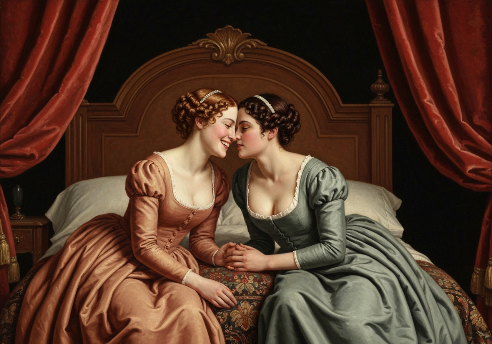
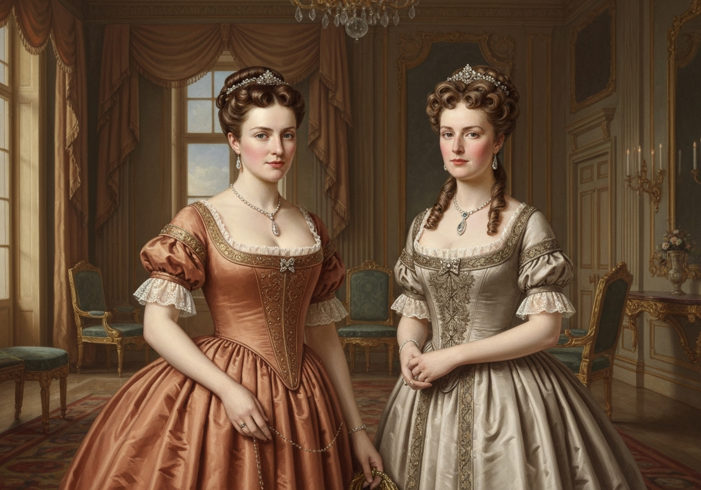
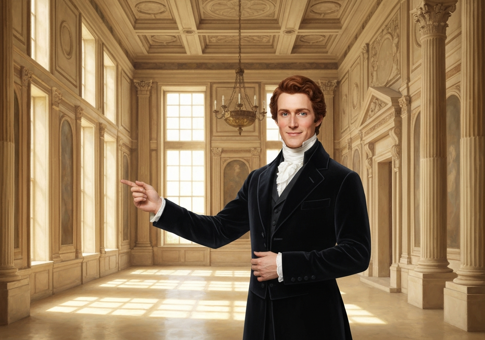
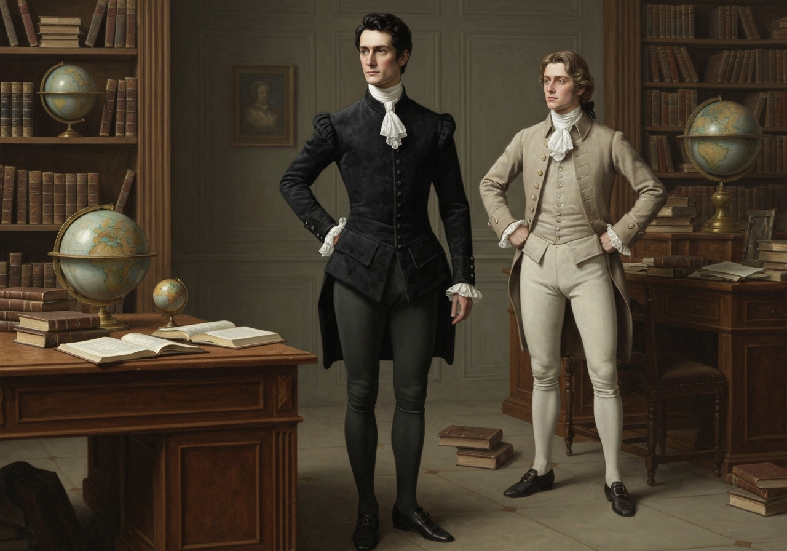
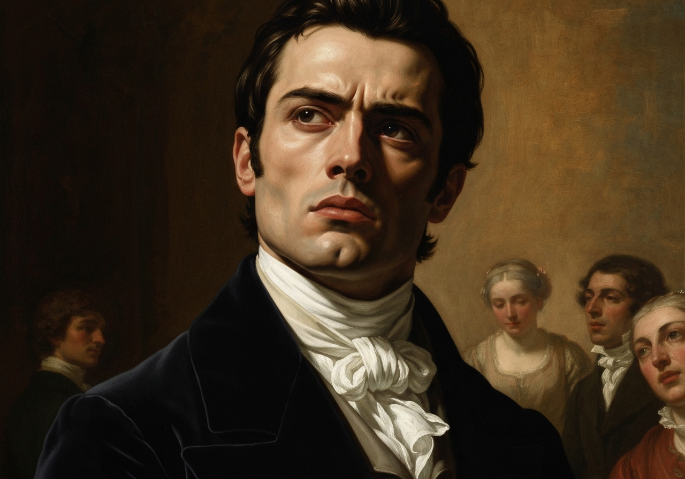
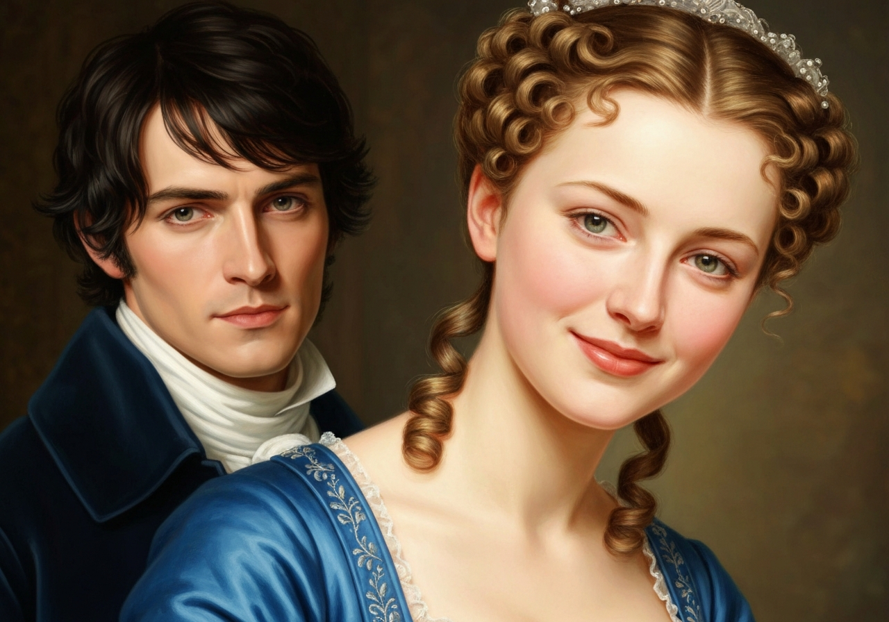
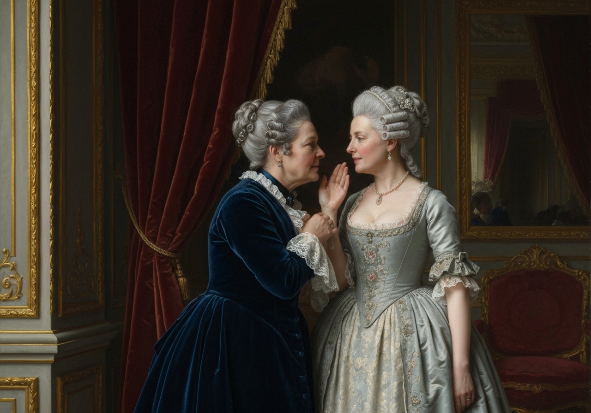

import Callout from '@/components/Callout.astro'

Lorsque Jane et Elizabeth se retrouvèrent seules, la première, qui avait été prudente dans ses éloges envers M. Bingley auparavant, exprima à sa sœur combien elle l’admirait.

<Callout title="Memorable Quote" variant="note">
Il est exactement ce qu’un jeune homme devrait être : sensé, de bonne humeur, vif ; et je n’ai jamais vu de manières aussi agréables ! Il est si à l’aise, avec une si parfaite politesse !
</Callout>

« Il est aussi beau », répondit Elizabeth, « ce qu’un jeune homme devrait également être, si possible. Son caractère est ainsi complet. »

« J’ai été très flattée qu’il me demande de danser une deuxième fois. Je ne m’attendais pas à un tel compliment. »

« Pas vous ? Moi, oui, pour vous. Mais c’est là une grande différence entre nous.

<Callout title="Memorable Quote" variant="note">
Les compliments vous surprennent toujours, mais jamais moi. Qu’y a-t-il de plus naturel que le fait qu’il vous demande de danser à nouveau ?
</Callout>

Il ne pouvait s’empêcher de voir que vous étiez environ cinq fois plus belle que toutes les autres femmes de la pièce. Il n’a pas besoin de sa galanterie pour cela. Eh bien, il est certainement très agréable, et je vous autorise à l’aimer. Vous avez aimé bien des personnes moins intelligentes. »

« Ma chère Lizzy ! »

« Oh, vous avez vraiment trop tendance à aimer les gens en général. Vous ne voyez jamais de défaut chez personne. Tout le monde est bon et agréable à vos yeux. Je ne vous ai jamais entendu parler en mal d’un être humain de votre vie. »

<Callout title="Analysis [1]" variant="explanation">
L’hésitation de Jane à parler en mal de qui que ce soit, même après une réception froide, souligne son tempérament exceptionnellement doux. Elle a une tendance naturelle à trouver le bien dans chaque personne tout en ignorant ses défauts évidents. Cette qualité la rend à la fois admirable aux yeux d’Elizabeth et vulnérable à la manipulation sociale.
</Callout>

« Je voudrais ne pas me précipiter à critiquer qui que ce soit ; mais je dis toujours ce que je pense. »

« Je sais que vous le faites, et c’est cela qui est étonnant. Avec votre bon sens, comment pouvez-vous être si honnêtement aveugle aux folies et aux absurdités des autres !

<Callout title="Memorable Quote" variant="note">
L’affectation de la franchise est assez courante ; on la rencontre partout. Mais être franc sans ostentation ni dessein, tirer le meilleur parti du caractère de chacun et l’améliorer encore, cela vous appartient seule.
</Callout>

Et donc, vous aimez aussi les sœurs de cet homme, n’est-ce pas ? Leurs manières ne sont pas aussi bonnes que les siennes. »

« Certainement pas, au début ; mais ce sont des femmes très agréables quand on converse avec elles. Mlle Bingley va vivre avec son frère et s’occuper de sa maison, et je me trompe fort si nous ne trouverons pas une voisine très charmante en elle. »

Elizabeth écouta en silence, mais n’était pas convaincue : leur comportement lors de l’assemblée n’avait pas été de nature à plaire en général ; et avec plus de perspicacité et moins de souplesse de caractère que sa sœur, et
Faisant preuve d’un jugement objectif, sans se laisser influencer par ses propres sentiments, elle était peu encline à les approuver.

<Callout title="Analysis [2]" variant="explanation">
Élisabeth incarne un contrepoint pragmatique à l’idéalisme de Jane, utilisant son sens aigu de l’observation pour analyser les comportements sociaux. Elle perçoit l’orgueil et la vanité des sœurs Bingley, alors que Jane ne voit que leurs manières agréables. Son jugement est affûté par le fait qu’elle n’a aucun intérêt personnel à obtenir l’approbation du cercle des Bingley.
</Callout>

<Callout title="Memorable Quote" variant="note">
En réalité, ce sont de très bonnes jeunes femmes ; elles ne manquent pas d’humour lorsqu’elles sont de bonne humeur, ni de la capacité d’être agréables lorsqu’elles le souhaitent ; mais elles sont fières et vaniteuses.
</Callout>

Elles sont plutôt belles ; elles ont fait leurs études dans l’un des meilleurs établissements privés de la ville ; elles ont une fortune de vingt mille livres ; elles ont l’habitude de dépenser plus qu’elles ne le devraient et de fréquenter des personnes de qualité ; et, par conséquent, elles ont toutes les raisons de bien penser d’elles-mêmes et de mal penser des autres.

Elles sont issues d’une famille respectable du nord de l’Angleterre ; un fait qui a laissé une empreinte plus profonde dans leur mémoire que le fait que la fortune de leur frère et la leur ait été acquise grâce au commerce.

<Callout title="Analysis [3]" variant="explanation">
L’origine de la fortune des Bingley, issue du commerce, est un détail important qui influence leur statut social et leurs angoisses intérieures. Les sœurs se soucient davantage de leurs relations avec des personnes de qualité que de l’histoire récente du succès de leur famille. Cette dynamique illustre les frontières de classe fluides, mais toujours rigides, de l’Angleterre de la Régence.
</Callout>

M. Bingley a hérité d’un patrimoine d’environ cent mille livres de son père, qui avait l’intention d’acheter un domaine, mais n’a pas eu le temps de le faire.

<Callout title="Analysis [4]" variant="explanation">
La décision de M. Bingley de louer Netherfield House plutôt que d’acheter un domaine reflète la « facilité » de son tempérament. Il est satisfait de la situation actuelle et ne ressent pas le besoin urgent d’établir un héritage foncier permanent. Cette souplesse fait de lui un compagnon idéal pour le Darcy, plus décisif et exigeant.
</Callout>

M. Bingley avait également cette intention, et il choisissait parfois le comté où il voulait s’installer ; mais, comme il disposait maintenant d’une bonne maison et de la liberté d’un manoir, beaucoup de ceux qui connaissaient le mieux la facilité de son tempérament doutaient qu’il ne passe le reste de ses jours à Netherfield et laisse à la génération suivante le soin d’acheter.

Ses sœurs étaient très désireuses qu’il possède son propre domaine ; mais, bien qu’il ne soit établi que comme locataire, Miss Bingley n’était en aucun cas réticente à présider à sa table ; et Mme Hurst, qui avait épousé un homme plus élégant que riche, n’était pas moins disposée à considérer.
Il considérait sa maison comme son foyer quand cela lui convenait. M. Bingley n’avait pas deux ans lorsqu’il fut incité, par une recommandation fortuite, à visiter Netherfield House. Il l’examina, de l’extérieur et de l’intérieur, pendant une demi-heure ; il fut séduit par l’emplacement et les pièces principales, satisfait de ce que le propriétaire disait à son sujet, et il la loua immédiatement.

Entre lui et Darcy, il existait une amitié très solide, malgré une grande différence de caractère.

<Callout title="Analysis [5]" variant="explanation">
L’amitié entre Darcy et Bingley repose sur une estime mutuelle constante, malgré leurs tempéraments opposés. Darcy respecte l’ouverture d’esprit de Bingley, tandis que Bingley s’appuie fortement sur la compréhension et le jugement supérieurs de Darcy. Leur lien montre que la compatibilité intellectuelle peut souvent surpasser les différences de comportement social.
</Callout>

Bingley était cher à Darcy en raison de la facilité, de l’ouverture et de la souplesse de son caractère, bien qu’aucun tempérament ne puisse offrir un contraste plus grand avec le sien, et bien que, avec le sien, il ne se soit jamais senti insatisfait. Fort de l’estime de Darcy, Bingley avait une confiance inébranlable et une haute opinion de son jugement.

<Callout title="Memorable Quote" variant="note">
En matière de compréhension, Darcy était supérieur. Bingley n’était pas du tout dépourvu de qualités, mais Darcy était intelligent.
</Callout>

Il était à la fois hautain, réservé et difficile ; et ses manières, bien qu’élégantes, n’étaient pas engageantes. À cet égard, son ami avait un avantage considérable.

<Callout title="Memorable Quote" variant="note">
Bingley était sûr d’être apprécié partout où il se présentait ; Darcy offensait continuellement.
</Callout>

<Callout title="Analysis [6]" variant="explanation">
Le contraste dans leur succès social est directement lié à leur volonté de se laisser plaire par leur environnement. Bingley trouve tout le monde charmant et est sûr d’être apprécié, tandis que Darcy trouve tout le monde décevant et offense continuellement. Cette différence prépare le terrain pour leurs rôles contrastés dans le cercle social de Meryton.
</Callout>

La manière dont ils parlaient de l’assemblée de Meryton était suffisamment révélatrice. Bingley n’avait jamais rencontré de personnes plus agréables ni de filles plus jolies de sa vie ; tout le monde avait été très aimable et attentionné envers lui ; il n’y avait eu aucune formalité, aucune rigidité ; il s’était rapidement senti à l’aise avec tous ceux qui étaient présents ; et quant à Miss Bennet, il ne pouvait imaginer un ange plus beau. Darcy, au contraire, avait vu un groupe de personnes dans lesquelles il y avait peu de beauté et pas de raffinement, pour aucune desquelles il n’avait ressenti le moindre intérêt, et de laquelle il n’avait reçu ni attention ni plaisir.

<Callout title="Memorable Quote" variant="note">
Il admit que Miss Bennet est jolie, mais elle sourit trop.
</Callout>

Mme Hurst et sa sœur étaient d’accord avec cette opinion, mais elles continuaient à l’admirer et à l’apprécier, et la qualifiaient de jeune fille charmante, une jeune fille qu’elles seraient heureuses de mieux connaître. Miss Bennet était donc considérée comme une jeune fille charmante.

et leur frère se sentit autorisé, grâce à cet éloge, à penser à elle comme il le souhaitait.

<Callout title="Analysis [7]" variant="explanation">
L’approbation de Jane par les sœurs Bingley, en tant que « jeune fille charmante », donne à Bingley l’autorisation sociale de poursuivre son intérêt. Cette étiquette est une approbation superficielle qui manque de la profondeur d’une véritable compréhension du caractère. Elle met en évidence la façon dont les groupes sociaux utilisent des catégorisations étroites pour gérer leurs relations internes et externes.
</Callout>

