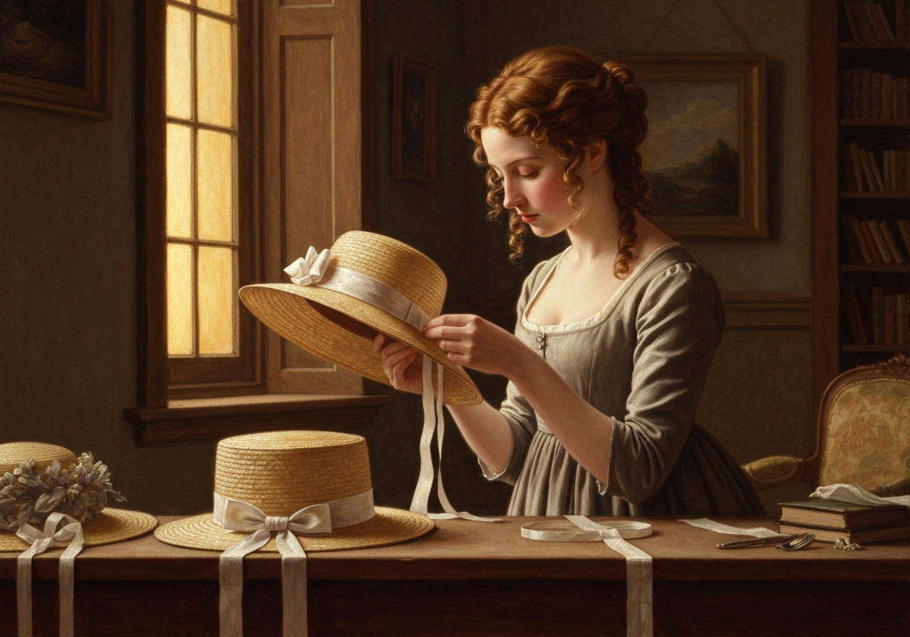
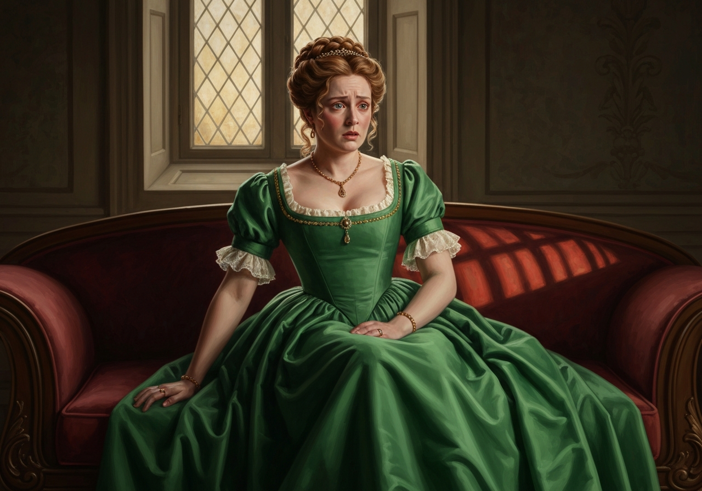
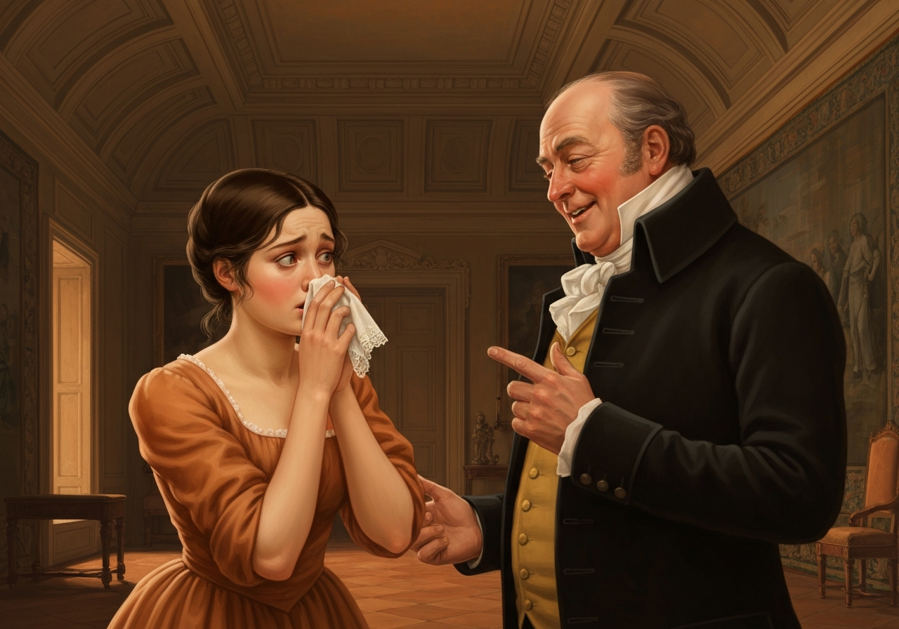
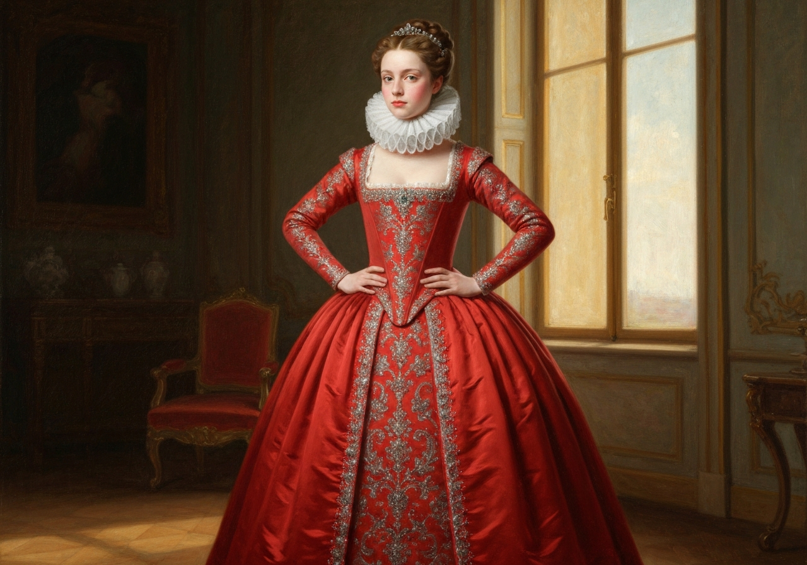

import Callout from '@/components/Callout.astro'

Malam Bennet yana cikin waɗanda suka jiran zuwan Malam Bingley.

<Callout title="Analysis [1]" variant="explanation">
Ziyarar da Malam Bennet ya yi a ɓoye ta nuna cewa yana da himma wajen kula da makomar 'ya'yansa. Wannan maganar da yake yi na nuna cewa yana son ya kare matarsa daga ƙoƙarar da take yi wajen neman matsayi a al'umma. Halayyar da yake yi tana nuna cewa yana kula da 'ya'yansa, duk da cewa yana ɓoye wannan ainihin.
</Callout>

Ya yi niyyar zuwa ziyarar, amma a ƙarshe ya tabbatar wa matarsa cewa ba zai tafi ba; har zuwa dare bayan ziyarar, ba ta san komai game da hakan ba. Daga nan ne aka bayyana hakan a hanya mai zuwa.

Da yake kallon 'yar sa ta biyu tana aiki a kan gyara hula, sai ya ce mata:

<Callout title="Memorable Quote" variant="note">
I na yi tsammanin Malam Bingley zai so hakan, Lizzy.
</Callout>

"Ba mu san abin da Malam Bingley yake so ba," in ji mahaifiyarta, cikin takaici, "domin ba za mu je ziyarar ba."
"Amma kin manta, mama," in ji Elizabeth, "za mu hadu da shi a wajen taron, kuma Mrs. Long ta yi alkawarin cewa za ta gabatar da shi."
"Ba na da imani Mrs. Long za ta yi hakan. Tana da 'ya'ya mata biyu. Ita ce mace mai son kai, kuma ba na da wata ra'ayi a kanta."

<Callout title="Analysis [2]" variant="explanation">
Kin amince da Mrs. Long da Malam Bennet ya yi ya nuna yadda ake neman aure a wannan zamanin. A wannan yanayi, ana kallon makwabta ne a matsayin masu fafatawa don neman maza masu dacewa. Wannan ya nuna yadda ake neman matsayi a al'umma a zamanin Regency na Ingila.
</Callout>

"Ni ma ba na da wata ra'ayi a kanta," in ji Malam Bennet; "kuma ina farin ciki da na ga ba ki dogara a kan taimakon ta ba."
Mrs. Bennet ba ta yi wani amsa ba; amma, saboda ba ta iya hakuri, sai ta fara zagin daya daga cikin 'ya'yanta.

<Callout title="Memorable Quote" variant="note">
"Kiya daina yin tari, Kitty, saboda Allah! Ki ji ƙasaita a kan jikina. Kina cutar da su."
</Callout>

<Callout title="Memorable Quote" variant="note">
Kitty ba ta da hankali a kan tari; tana yin tari a lokacin da ba ya dace.
</Callout>

<Callout title="Analysis [3]" variant="explanation">
Tarin Kitty yana nuna yadda ake damuwa a gida. Malam Bennet yana kallon wannan halayyar da 'ya'yansa ke yi a matsayin wani abu da yake nuna wasa. Yana amfani da rashin lafiyarta a matsayin wata hanya da za ta sa ya yi dariya a kan matarsa.
</Callout>

"Ba na yin tari ne saboda nuna wa kaina nishaɗi," in ji Kitty, cikin damuwa. "Wanne ne lokacin da za a yi wani taron, Lizzy?"
"Goɓe."
"E, haka ne," in ji mahaifiyarta, "amma ba za ta je ba, don haka ba za ta iya gabatar da shi ba, domin ba za ta san shi ba."

“To, abin kaɗai, za ka iya samun amfani da abin da abokanka ya yi, kuma ka gabatar da
Mista Bingley ga _ita_.”

“Ba zai yuwu ba, Mista Bennet, ba zai yuwu ba, idan ban san shi ba; ta yaya za ka iya yin irin wannan maganar?”

“Ina godiya da hankalinka.”

<Callout title="Analysis [4]" variant="explanation">
Yabon da Mista Bennet ya yi wa matarsa game da ‘hankalinta’ yana nuna tsaurin ka’idojin zamantakewar da ake da su a wancan lokaci. Ya nuna cewa ‘sanin’ zamantakewa yawanci yana da ƙarancin ma’ana kuma ana yin shi ne don nuna wani abu. Wannan abin da ya faru yana nuna rashin ma’anar tsammanin da makwabtansu ke da su.
</Callout>

Tabbas, haɗin gwiwa na tsawon makonni biyu ba ya da yawa. Ba za a iya sanin abin da mutum yake a ƙarshen makonni biyu ba. Amma idan _mu_ ba za mu yi ƙoƙari ba, wani zai yi; kuma bayan duka, Mrs. Long da 'ya'yanta za su yi ƙoƙari; kuma, don haka, idan ta yi tunanin cewa wannan abu ne mai kyau, idan ka ƙi yin hakan, zan yi shi da kaina.”

'Yan mata sun kalli ubansu. Mrs. Bennet ta ce kawai, “Ban gane ba, ban gane ba!”

“Menene ma’anar wannan maganar?” ya ce. “Shin kuna ganin yadda ake gabatar da mutum, da kuma mahimmancin da ake ba wa hakan, a matsayin ban gane ba? Ba zan iya yarda da ku a wannan ba. Me kike faɗa, Mary? Saboda ni na san cewa kai 'yar ƙasa ce mai tunani, kuma kin karanta manyan littattafai, kuma kin yi rubutu.”

<Callout title="Analysis [5]" variant="explanation">
An bayyana Mary ne ta hanyar sha’awarta na samun matsayi a fannin ilimi, amma ba ta da ‘saurin’ Elizabeth. Rashin ikon ta na samun wani abu ‘mai ma’ana’ da za ta faɗa yana nuna rawar da take takawa a matsayin wani abu mai ban dariya a cikin iyalin. Ta zama wani abin tunatarwa game da yin ƙoƙari don samun hikima ba tare da gaskiya ba.
</Callout>

Mary ta so ta faɗa wani abu mai ma’ana, amma ba ta san yadda za ta yi ba.

“Yayin da Mary take daidaita ra’ayoyinta,” ya ci gaba, “bari mu koma ga Mista Bingley.”

<Callout title="Memorable Quote" variant="note">
Ina da gajiya da Mista Bingley.
</Callout>

“Na yi takaici da jin hakan; amma me ya sa ba ka faɗa mani ba a baya? Idan na san hakan a yau, da ba zan je wurinsa ba. Abin ba ya da kyau; amma…

<Callout title="Memorable Quote" variant="note">
Yanzu da na je wurinsa, ba za mu iya guje wa haɗin gwiwa ba.
</Callout>

Sha'awar 'yan mata ya kasance abin da ya so - wanda na Mrs. Bennet ya fi duka; duk da cewa bayan da farin cikin ya ƙare, ta fara bayyana cewa shi ne abin da ta yi tsammani.

<Callout title="Analysis [6]" variant="explanation">
Canjin da Mrs. Bennet ta yi, inda ta nuna farin ciki, yana nuna yadda take da sauƙin canzawa da kuma yadda take da sha'awa. Bayyanar da ta yi cewa ta "yi tsammani" wannan labari yana aiki a matsayin wani tsari na kare martabarta.

"Yaya kake da kyau, Mista Bennet, abokina! Amma na san cewa a ƙarshe zan iya sa ka yarda. Na tabbata cewa kana son 'ya'yanku sosai, don haka ba za ka bar wani abu ba. To, ina farin ciki! Kuma wannan abun dariya ne, cewa ka tafi da safe, kuma ba ka faɗa komai har zuwa yanzu."

<Callout title="Memorable Quote" variant="note">Yanzu, Kitty, za ki iya yin tari da yawa kamar yadda kike so.
</Callout>

Kuma, yayin da yake faɗa, ya bar ɗakinka, yana jin gajiya da farin cikin matarsa.

"Ya kyakun uba kike da shi, 'ya'ya," ta ce, lokacin da an rufe kofa. "Ba na san yadda za ku iya godiya masa da kyawunsa; ko ni ma, saboda wannan. A wannan lokacin rayuwarmu, ba abu ne mai daɗi ba, kamar yadda zan faɗa muku, don yin sabbin abokai kowace rana; amma don ku, za mu yi komai."

<Callout title="Memorable Quote" variant="note">
Lydia, abokiyata, duk da cewa ke ce ƙarama, ina da tabbacin cewa Mista Bingley zai yi muku rawa a wajen da za a yi.
</Callout>

"Oh," Lydia ta ce, da ƙarfi, "Ba na tsoro; saboda duk da cewa ni ce ƙarama, ni ce mafi tsayi."

<Callout title="Analysis [7]" variant="explanation">
Maganar Lydia game da tsawonta ta nuna cewa tana da halin da ba ta yi tunani ba kuma ba ta kula da abubuwa. Tana kallon al'umma da ƙarfin jiki, wanda ba shi da ɗan kaɗan daga cikin hikima ko hankali na Elizabeth. Wannan tattaunawa ta farko ta nuna wani abu da zai sa ta yi abubuwa a baya.
</Callout>

Sauran dare an sha wajen tunanin lokacin da Mista Bennet zai dawo, kuma lokacin da za su ce masa ya zo cin abinci.
