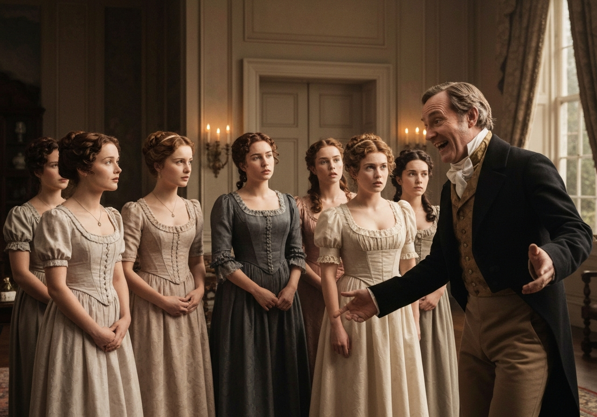

import Callout from '@/components/Callout.astro'

ベネット氏は、ビングリー氏を訪問する人々の中で、最初の方だった。

<Callout title="Analysis [1]" variant="explanation">

ベネット氏の秘密の訪問は、彼が娘たちの将来について積極的に関心を持っていることを示している。これは、妻の過剰な社交への関心を抑制するための、一種の防衛手段となっている。彼の行動は、無関心な態度を装いながら、内に秘めた父親としての愛情を示している。

</Callout>

彼は以前からビングリー氏を訪問するつもりだったが、いつも妻に「行くべきではない」と説得していた。そして、訪問が終わった後の夜まで、妻はそれについて何も知らなかった。その後、以下のようにして明らかにされた。
[太陽の光が差し込む部屋で、麦わら帽子を飾るエリザベス・ベネットを描いたルネサンス様式の油絵。] (../metadata/pride-and-prejudice/chapter-2/scene-1b.png)
彼は、2番目の娘が帽子を飾っているのを見て、突然彼女に話しかけた。

<Callout title="Memorable Quote" variant="note">

「ビングリー氏が気に入ってくれるといいな、リジー。」

</Callout>

「私たちは、ビングリー氏が何を好むのかを知る立場にはないわ」と母親は不機嫌そうに言った。「私たちは訪問しないことになっているから。」

「でも、ママ、忘れてるのね」とエリザベスは言った。「私たちは社交場で彼に会うし、ロング夫人は彼を紹介してくれるって約束してくれたわ。」

「ロング夫人がそんなことをするとは思えないわ。彼女には2人の姪がいるのよ。彼女は利己的で偽善的な女性で、私は彼女のことを何も思っていないわ。」

<Callout title="Analysis [2]" variant="explanation">

ベネット夫人がロング夫人を軽視する態度は、競争の激しい結婚市場を露わにしている。この時代、隣人は主に、結婚適齢期の独身男性を巡る競争相手として見なされていた。これは、摂政時代のイギリスにおける社会的な地位向上は、ゼロサムゲームであるということを示している。

</Callout>

「私もそうは思わない」とベネット氏は言った。「そして、あなたが彼女に頼っていないことを知って安心したよ。」

ベネット夫人は、何も答えようとしなかったが、堪えきれずに娘の一人を叱り始めた。

<Callout title="Memorable Quote" variant="important">

「キーティ、お願いだから、もう咳をするのをやめて！私の神経を考えなさい。あなたは私の神経をボロボロにしているのよ！」

</Callout>

[苦悩しているベネット夫人を、ハンカチを握りしめて描いた、劇的なルネサンス様式の肖像画。] (../metadata/pride-and-prejudice/chapter-2/scene-2b.png)

<Callout title="Memorable Quote" variant="tip">

「キーティの咳は、彼女自身ではコントロールできない。タイミングも悪い。」

</Callout>

<Callout title="Analysis [3]" variant="explanation">

キーティの咳は、根底にある家庭内の緊張を反映している。ベネット氏は、この一般的な家族の行動を、一種の演劇的なパフォーマンスとして扱っている。彼は、娘の病気を、妻の苛立ちをからかうための道具として利用している。

</Callout>

[レースのハンカチで咳をするキーティ・ベネットと、それを冷静に見つめる父親を描いたルネサンス様式の油絵。] (../metadata/pride-and-prejudice/chapter-2/scene-3b.png)

「私は自分のためだけに咳をしているわけではないのよ」とキーティは不満そうに答えた。「リジー、次の舞踏会はいつ？」

「明後日。」

「そうね、その通り」と母親は言った。「そして、ロング夫人はその日の前日まで帰ってこないわ。だから、彼女が彼を紹介することは不可能よ。なぜなら、彼女自身も彼を知らないから。」

「それなら、愛しの娘よ、あなたの友人のおかげで、ビングリー氏を彼女に紹介できるかもしれないわ」

「無理です、ベネットさん、絶対に無理です。私が彼について何も知らないのに、どうしてそんなことを言うんですか？」

「奥様の慎重な判断には敬意を表します。」

<Callout title="Analysis [4]" variant="explanation">

ベネット氏が妻の「慎重さ」を皮肉って褒めることは、当時の厳格な社交儀礼を際立たせている。彼は、社交における「知識」はしばしば表面的で、見せかけに過ぎないと示唆している。この皮肉は、彼らの近隣の人々が抱く社交的な期待の不条理さを強調するのに役立っている。

</Callout>

2週間程度の知り合いでは、やはり短い。2週間で、その人が本当にどんな人物なのかを知ることはできない。しかし、もし私たちが行動しなければ、他の誰かがするだろう。結局のところ、ロング夫人は、彼女の姪たちも、チャンスを掴まなければならない。だから、もしあなたがこの申し出を断ると、彼女はそれを親切な行いだと考えるだろうから、私が代わりに引き受けよう。

娘たちは父親を見つめた。ベネット夫人はただ、「ばかげているわ、ばかげている！」と言った。

「一体、その強い言葉にどんな意味があるんだ？」彼は叫んだ。「紹介の手続きや、それにかけられる重要性を、ばかげていると思うのか？私は、そこには同意できない。メアリー、あなたはどう思う？あなたは思慮深く、立派な本を読み、メモを取る若い女性だからね。」

<Callout title="Analysis [5]" variant="explanation">

メアリーは、知的な地位を求めることで定義されているが、エリザベスの持つ「機転」は持ち合わせていない。彼女が何か「理にかなった」ことを言うことができないのは、家族の中で彼女が果たすコミカルな役割を強調している。彼女は、真の洞察力がないまま、知恵を装うことに対する警告として存在する。

</Callout>

メアリーは何か理にかなったことを言いたいと思ったが、どうすればいいのか分からなかった。

「メアリーが考えをまとめている間に、ビングリー氏に戻りましょう」彼は続けた。

<Callout title="Memorable Quote" variant="summary">

「ビングリー氏にはもううんざりだ。」

</Callout>

「それを聞いて残念だ。でも、なぜもっと早く言ってくれなかったんだ？もし私が朝、それを知っていたら、間違いなく彼を訪問しなかっただろう。本当に運が悪い。でも…」

<Callout title="Memorable Quote" variant="important">

「実際に訪問してしまったのだから、もう彼との関係を避けることはできない。」

</Callout>

女性たちの驚きは、彼が期待したとおりだった。特にベネット夫人の驚きは、他の人たちを上回っていたかもしれない。しかし、最初の喜びが過ぎ去ると、彼女は、それがずっと前から予想していたことだと主張し始めた。

<Callout title="Analysis [6]" variant="explanation">

ベネット夫人の態度の変化が、歓喜に満ちたものになるのは、彼女の不安定で浅薄な性格を反映している。彼女が「ずっと前から予想していた」とすぐに主張することは、彼女のプライドを守るための防衛機制として機能している。この不安定さは、オースティンの彼女のキャラクター描写における中心的なテーマである。

</Callout>

「ベンネットさん、あなたは本当に素晴らしいわ！でも、最後にはあなたを説得できるとわかっていたの。あなたは娘たちをとても愛しているから、こんな素晴らしい出会いを逃すはずがないと確信していたの。まあ、本当に嬉しいわ！それに、あなたが今日、何も言わずに家を出て、今になって初めてそのことを話すなんて、とても面白いわ。」

「さて、キティ、好きなだけ咳をしてなさい。」

そして、彼は妻の興奮に疲れ果て、部屋を出て行った。

[妻の興奮で疲れ切った様子で部屋を出ていくベンネットさんのルネサンス風の油絵]

「娘たち、あなたたちには本当に素晴らしいお父さんがいるわ」と彼女は、ドアが閉まると言った。「彼があなたたちにどれだけ親切にしてくれたのか、どうやってお返しすればいいのか、私にもわからないわ。私たちの年齢になると、毎日新しい人と知り合うのは、あまり楽しいことではないけど、あなたたちのために、何でもするわ。」

「リディア、愛しいわ。あなたは一番年下だけど、次の舞踏会でビングリーさんがあなたと踊ってくれると思うわ。」

「あら」とリディアは毅然と答えた。「私は怖くないわ。だって、私は一番年下だけど、一番背が高いんだから。」

リディアが自分の身長について自慢するのは、彼女の衝動的で無謀な性格を予感させる。彼女は、エリザベスのような繊細さや慎重さとは無縁の、肉体的な自信を持って社会界を眺めている。この初期の会話は、後に彼女の物語を動かすことになる、若さゆえの軽率さを確立している。

[背が高く自信に満ちた様子で立つ若いリディア・ベンネットのルネサンス様式の肖像画]

残りの時間は、ベンネットさんがいつ戻ってくるのか、いつ彼を夕食に招待するべきかを推測して過ごした。
