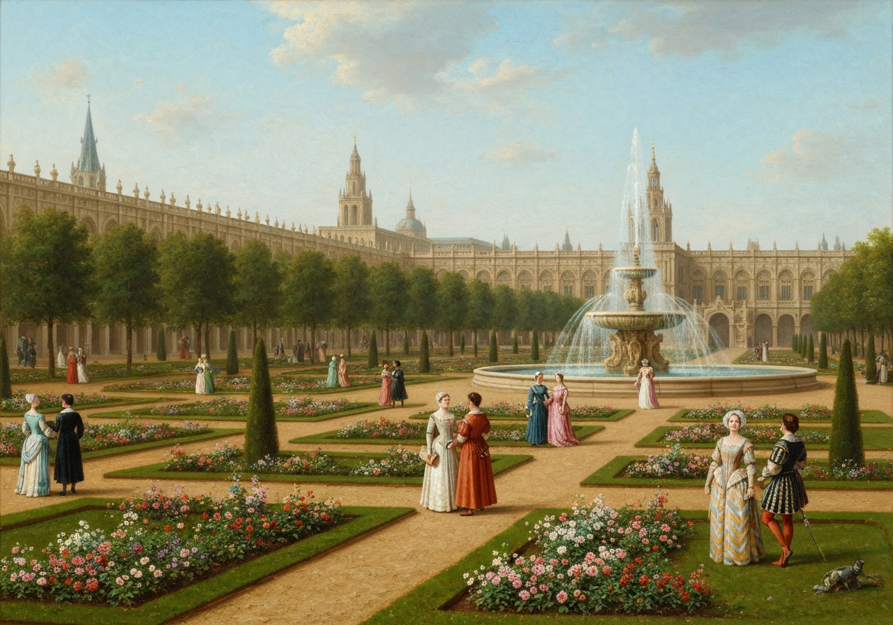
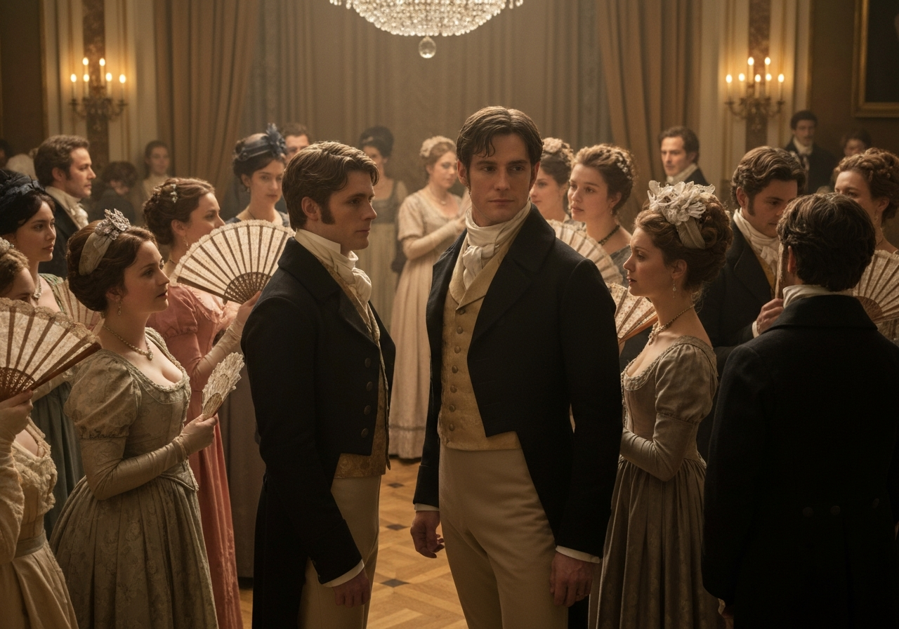
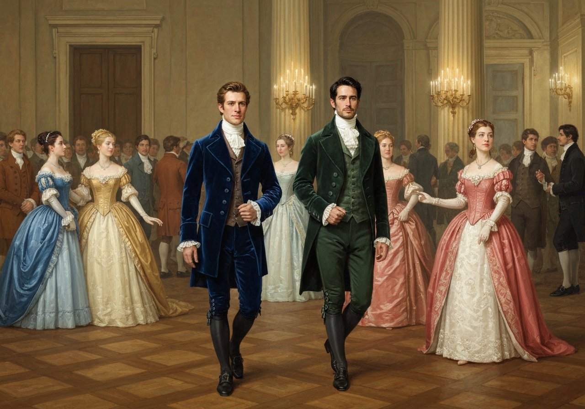
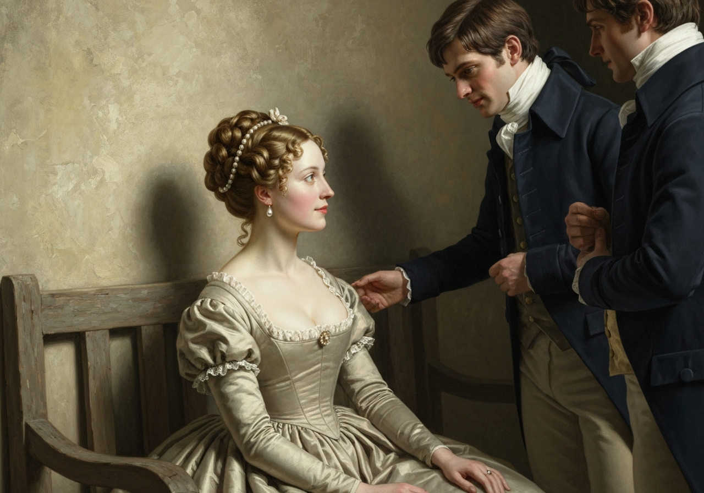
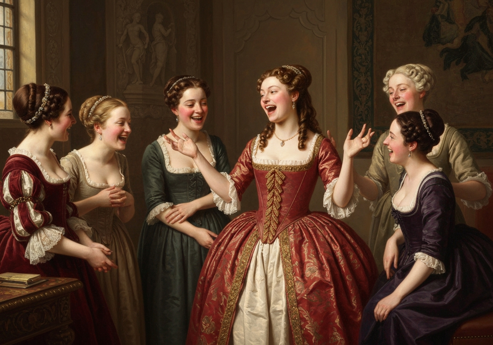
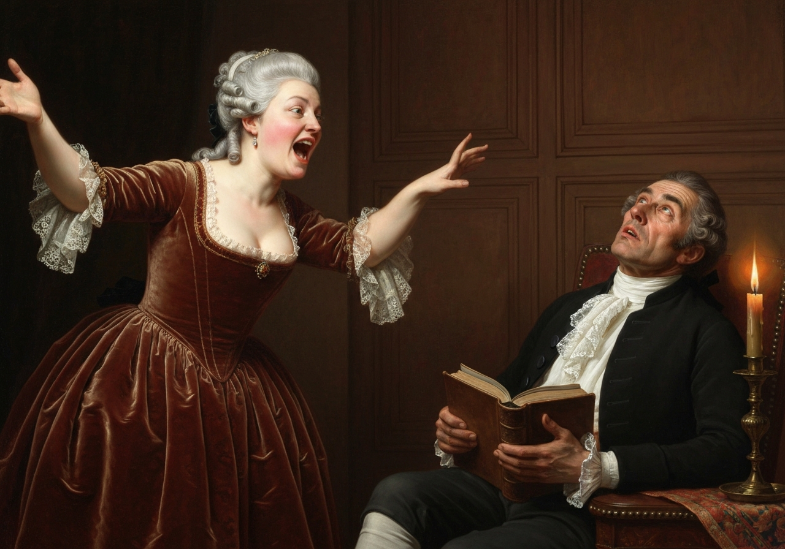

import Callout from '@/components/Callout.astro'

베넷 부인은 다섯 딸의 도움을 받아 빙리 씨에 대해 질문했지만, 남편은 만족스러운 설명을 해주지 않았습니다. 그들은 노골적인 질문, 기발한 추측, 그리고 간접적인 추론 등 다양한 방법으로 그를 압박했지만, 그는 그들의 모든 시도를 교묘하게 피했습니다.

<Callout title="Analysis [1]" variant="explanation">
베넷 씨는 가족의 호기심을 자극하지 않기 위해 빙리 씨를 방문한 것에 대해 의도적으로 모호하게 말합니다. 그는 가정 내에서 정보를 숨김으로써 얻는 지적인 힘을 즐깁니다. 이러한 장난기 넘치는 대립은 그의 아내 및 딸들과의 관계를 초반부 내내 정의합니다.
</Callout>

결국 그들은 이웃인 루커스 부인의 간접적인 정보를 받아들일 수밖에 없었습니다.

<Callout title="Analysis [2]" variant="explanation">
베넷 씨가 정보를 제공하지 않을 때 루커스 부인은 사회적 정보의 주요 전달자 역할을 합니다. 그녀가 빙리 씨의 잘생긴 외모와 훌륭한 태도에 대해 긍정적으로 보고하자, 이웃 사람들의 추측은 더욱 활발해집니다. 이 사회에서 정보는 사회적 지위와 결혼 가능성을 결정하는 일종의 화폐 역할을 합니다.
</Callout>

그녀의 보고는 매우 긍정적이었습니다. 윌리엄 경은 그에게 매우 만족했습니다. 그는 매우 젊고, 매우 잘생겼으며, 매우 훌륭했고, 게다가 다음 모임에 많은 사람들과 함께 참석할 예정이었습니다. 이보다 더 기쁜 일은 없을 것입니다! 춤추는 것을 좋아한다는 것은 사랑에 빠지는 확실한 방법이었고, 빙리 씨의 마음을 얻을 수 있다는 희망이 컸습니다.

<Callout title="Memorable Quote" variant="note">
내가 딸 중 한 명이라도 네더필드에서 행복하게 정착하고, 나머지 딸들도 모두 훌륭한 배우자를 만나게 된다면, 더 이상 바랄 것이 없을 것입니다.
</Callout>

며칠 후 빙리 씨는 베넷 씨의 방문에 답례로 그의 서재에서 약 10분 동안 함께 시간을 보냈습니다. 그는 아름다운 것으로 알려진 젊은 아가씨들을 만날 수 있기를 희망했지만, 그의 눈에 들어온 것은 아버지뿐이었습니다. 아가씨들은 다소 운이 좋았는데, 2층 창문에서 그가 파란색 코트를 입고 검은 말을 타고 있는 것을 확인할 수 있었기 때문입니다.

<Callout title="Analysis [3]" variant="explanation">
빙리 씨의 서재 방문은 10분밖에 지속되지 않았고, 베넷 자매들은 완전히 제외되었습니다. 짧은 시간이었지만, 아가씨들은 2층 창문에서 그를 관찰하며 호기심을 충족시키는 방법을 찾았습니다. 그들이 주목한 구체적인 세부 사항, 즉 파란색 코트와 검은 말은 모든 세부 사항이 사회적 의미를 위해 면밀히 조사되는 방식을 보여줍니다.
</Callout>

곧 저녁 식사 초대장이 발송되었고, 이미...
베넷 부인은 자신의 살림 솜씨를 뽐낼 만한 만찬을 계획했지만, 뜻밖의 소식이 전해지면서 모든 계획이 무산되었습니다. 빙리 씨는 다음 날 도시로 가야 했고, 따라서 그들의 초대에 응할 수 없었습니다. 베넷 부인은 매우 당황했습니다. 헌츠퍼드셔에 도착한 지 얼마 되지 않아 그가 도시에서 무슨 볼일이 있을지 상상할 수 없었고, 그가 계속해서 이곳저곳을 돌아다니며 네더필드에 정착하지 않을까 봐 걱정하기 시작했습니다. 루커스 부인은 그가 단지 무도회를 위한 많은 사람들을 모으기 위해 런던에 갔을 것이라는 생각을 제시하며 그녀의 불안감을 다소 해소해 주었습니다. 얼마 지나지 않아 빙리 씨가 열두 명의 여성과 일곱 명의 남성을 데리고 무도회에 올 것이라는 소문이 돌았습니다. 소녀들은 너무 많은 여성들이 온다는 사실에 슬퍼했지만, 무도회 전날 그가 런던에서 단지 여섯 명, 즉 그의 다섯 자매와 사촌 한 명을 데려왔다는 소식을 듣고 위안을 받았습니다. 그리고 그들이 무도회장에 들어섰을 때, 그들은 빙리 씨, 그의 두 자매, 장녀의 남편, 그리고 또 다른 젊은이, 총 다섯 명으로 구성되어 있었습니다.

빙리 씨는 잘생기고 신사적인 사람이었습니다. 그는 쾌활한 인상과 편안하고 꾸밈없는 태도를 가지고 있었습니다. 그의 자매들은 세련된 분위기를 풍기는 아름다운 여성들이었습니다. 그의 처남인 허스트 씨는 그저 신사처럼 보였을 뿐이었지만, 그의 친구인 대시 씨는 곧 훌륭한 체격, 잘생긴 얼굴, 고귀한 태도로 무도회장의 모든 사람들의 시선을 사로잡았습니다. 또한 그가 연간 1만 파운드를 가지고 있다는 소문이 그의 등장 후 5분 이내에 빠르게 퍼져나갔습니다.

<Callout title="Analysis [4]" variant="explanation">
대시 씨가 연간 1만 파운드를 가지고 있다는 소문은 그를 즉시 무도회장에서 가장 매력적인 남자로 만들었습니다. 그의 고귀한 태도나 잘생긴 얼굴보다 이 금액이 손님들에게 더 중요했습니다. 이는 부가 종종 섭정 시대의 사회적 환경에서 사람의 성격에 대한 판단을 좌우한다는 냉혹한 현실을 보여줍니다.
</Callout>

 신사들은 그가 훌륭한 외모를 가진 남자라고 칭찬했고, 여성들은 그가 빙리 씨보다 훨씬 더 잘생겼다고 말했습니다. 그는 저녁의 절반 동안 큰 감탄을 받으며 주목을 받았지만, 그의 거만하고 냉담한 태도가 드러나면서 인기가 급격히 떨어졌습니다.

<Callout title="Analysis [5]" variant="explanation">
대시 씨의 거만하고 냉담한 태도가 드러나면서 대중의 평가는 감탄에서 혐오감으로 빠르게 바뀌었습니다. 그가 지역 사회에 대한 호감을 보이지 않는 것은 용납할 수 없는 모욕으로 여겨졌습니다. 이러한 집단적인 판단은 이야기의 중심이 되는 로맨스를 복잡하게 만들 '자존심'과 '편견'을 확립합니다.
</Callout>

 그는 거만하고, 다른 사람보다 우월하다고 생각하며, 기뻐하는 것을 싫어하는 것으로 밝혀졌습니다. 그리고 그의 더비셔에 있는 광대한 재산은 그를 구원할 수 없었습니다.

그는 매우 냉담하고 불쾌한 인상을 풍겼으며, 그의 친구와 비교될 가치조차 없었습니다.

빙리 씨는 곧 방 안의 모든 주요 인물들과 친분을 쌓았습니다. 그는 활기차고 솔직했으며, 모든 춤에 참여했고, 무도회가 너무 일찍 끝나는 것에 불만을 느꼈으며, 네더필드에서 직접 무도회를 열 계획이라고 말했습니다. 이러한 훌륭한 자질은 그 자체로 충분히 설명해 줍니다. 그와 그의 친구 사이의 얼마나 큰 차이입니까! 다아시 씨는 허스트 부인과 빙리 양과 각각 한 번씩 춤을 추고, 다른 여성과 소개받는 것을 거절했으며, 남은 시간 동안 방 안을 돌아다니며 가끔 자신의 무리 중 한 사람과 이야기를 나누었습니다. 그의 성격은 분명했습니다. 그는 세상에서 가장 오만하고 불쾌한 사람이었고, 모든 사람은 그가 다시는 그곳에 오지 않기를 바랐습니다. 그를 가장 싫어하는 사람들 중에는 베넷 부인이 있었는데, 그녀는 그의 전반적인 행동에 대한 반감을 더욱 심화시켜, 그가 자신의 딸 중 한 명을 무시한 것에 대해 특별한 불만을 품게 되었습니다.

엘리자베스 베넷은 신사들의 부족으로 인해 두 번의 춤 동안 자리에 앉아 있어야 했습니다. 그리고 그 시간 동안 다아시 씨는 그녀가 그와 빙리 씨의 대화를 엿들을 수 있을 정도로 가까이에 서 있었습니다. 빙리 씨는 잠시 춤에서 벗어나 친구에게 함께 춤을 추도록 설득했습니다.

<Callout title="Memorable Quote" variant="note">
자, 다아시, 자네가 춤을 춰야 해. 자네가 이렇게 혼자서 멍하니 서 있는 모습을 보는 것은 정말 싫어.
</Callout>

<Callout title="Memorable Quote" variant="note">
나는 분명히 춤을 추지 않을 거야. 나는 파트너와 특별히 친하지 않은 한, 춤추는 것을 얼마나 싫어하는지 알고 있잖아.
</Callout>

"이런 모임에서는 춤을 추는 것이 견딜 수 없을 거야. 자네 자매들은 이미 춤을 추고 있고, 이 방 안에는 나와 춤을 추는 것이 벌이 될 만한 다른 여자는 없어."

"나는 자네만큼 까다롭지는 않을 거야," 빙리 씨가 소리쳤다. "나라를 준다고 해도 말이야! 진심으로, 오늘 밤 내가 만난 이렇게 즐거운 소녀들이 많았던 적은 없었어. 그리고 자네도 알겠지만, 그중 몇몇은 매우 예쁘지."

"자네는 방 안에서 유일하게 예쁜 소녀와 춤을 추고 있네," 다아시 씨가 가장 나이가 많은 베넷 양을 바라보며 말했다.

"오, 그녀는 내가 본 것 중에 가장 아름다운 존재야! 하지만 자네 바로 뒤에 앉아 있는 그녀의 자매 중 한 명이 매우 예쁘고, 분명히 매력적일 거야. 내가 파트너에게 자네를 소개해 달라고 부탁하게 해 줄까?"

"어떤 사람을 말하는 거지?" 그는 몸을 돌려 엘리자베스를 잠시 바라보다가, 그녀의 눈을 마주치자 시선을 피했습니다.

그리고 그는 차갑게 말했다.

<Callout title="Memorable Quote" variant="note">
그녀는 그럭저럭 괜찮지만, 나를 유혹할 만큼 매력적이진 않습니다. 게다가 지금 저는 다른 남자들에게 무시당하는 젊은 여성들에게 관심을 보일 기분이 아닙니다.
</Callout>

<Callout title="Analysis [6]" variant="explanation">
다아시 씨가 엘리자베스를 단순히 ‘그럭저럭 괜찮다’고 평가하며 냉정하게 거절한 것은 그녀의 오랜 편견의 촉매제가 됩니다. 그는 다른 사람들에게 무시당한다고 생각하는 여성에게 ‘관심을 보일’ 의향이 없다고 분명히 말합니다. 이러한 거절의 순간은 엘리자베스가 그의 성격을 처음으로 판단하게 되는 중요한 계기가 됩니다.
</Callout>

“당신은 파트너에게 돌아가서 그녀의 미소를 즐기는 것이 좋을 겁니다. 왜냐하면 당신은 나와 함께 시간을 낭비하고 있으니까요.”

빙리 씨는 그의 조언을 따랐습니다. 다아시 씨는 자리를 떠났고, 엘리자베스는 그에게 그다지 호의적인 감정을 느끼지 못한 채 남았습니다. 그러나 그녀는 친구들 앞에서 그 이야기를 매우 생생하게 들려주었습니다. 왜냐하면 그녀는 활기차고 장난기 넘치는 성격이었고, 어떠한 우스꽝스러운 일에도 즐거움을 느꼈기 때문입니다.

전반적으로 저녁은 가족 모두에게 즐거운 시간으로 흘러갔습니다. 베넷 부인은 그녀의 장녀가 네더필드 사람들에게 많은 관심을 받고 있는 것을 보았습니다. 빙리 씨는 그녀와 두 번 춤을 추었고, 그녀는 그의 자매들에게서 특별한 관심을 받았습니다. 제인은 어머니만큼은 아니지만, 이 일에 매우 만족했습니다. 엘리자베스는 제인의 기쁨을 느꼈습니다. 메리는 빙리 양에게 이웃에서 가장 재능 있는 소녀로 언급되는 것을 들었고, 캐서린과 리디아는 파트너 없이 있는 시간이 거의 없어서 무도회에서 가장 중요하게 생각하는 것을 깨달았습니다. 따라서 그들은 기분 좋게 롱본으로 돌아왔습니다. 롱본은 그들이 살고 있는 마을이자, 그들이 주요 거주민인 곳입니다. 그들은 베넷 씨가 여전히 깨어 있는 것을 발견했습니다. 그는 책을 읽으며 시간에 개의치 않았고, 훌륭한 기대를 불러일으킨 저녁의 결과에 대해 매우 궁금해했습니다. 그는 그의 아내가 낯선 사람에 대해 품고 있던 모든 희망이 실망될 것이라고 생각했지만, 곧 그는 전혀 다른 이야기를 듣게 될 것이라는 것을 알게 되었습니다.

“오, 사랑하는 베넷 씨,” 그녀가 방으로 들어오며 말했습니다. “정말 멋진 저녁이었어요. 정말 훌륭한 무도회였어요. 당신도 함께 왔더라면 좋았을 텐데요. 제인이 너무나 많은 관심을 받았어요. 정말 대단했어요. 모두 그녀가 얼마나 아름답게 보이는지 칭찬했고, 빙리 씨는 그녀가 매우 아름답다고 생각하며 두 번이나 춤을 췄어요. 한번 생각해보세요. 그는 실제로 그녀와 두 번이나 춤을 췄어요. 그리고 그는 그녀에게 두 번째로 춤을 신청한 유일한 사람이었어요. 처음에 그는 루카스 양에게 춤을 신청했어요. 그가 그녀와 춤을 추는 것을 보고 너무 짜증이 났지만, 그는 그녀를 그다지 좋아하지 않았어요. 사실, 아무도 그녀를 좋아하지 않았어요.”
“그럴 수 있지, 그렇지? 그리고 그는 제인이 춤을 추러 가는 모습을 보고 꽤나 감탄한 것 같았어. 그래서 그는 제인이 누구인지 물었고, 소개를 받았고, 다음 두 곡을 함께 춤추자고 청했지. 그리고 그 다음 두 곡은 킹 양과, 그 다음 두 곡은 마리아 루카스와, 그 다음 두 곡은 다시 제인과, 그 다음 두 곡은 리지와, 그리고 _불랑제_와 함께 춤을 췄어.”

<Callout title="Memorable Quote" variant="note">
그가 나에게 조금이라도 연민을 느꼈다면, 그렇게 많이 춤을 추지는 않았을 거야! 제발, 그의 춤 파트너에 대해 더 이상 말하지 마.
</Callout>

<Callout title="Memorable Quote" variant="note">
오, 내 사랑, 나는 그에게 완전히 매료되었어. 그는 너무나 잘생겼잖아! 그리고 그의 자매들은 매력적인 여성들이야.
</Callout>

나는 그들의 옷보다 더 우아한 옷을 본 적이 없어. 허스트 부인의 드레스에 있는 레이스만 봐도...

여기서 그녀는 다시 말을 끊겼다. 베넷 씨는 화려한 것에 대한 어떤 묘사에도 반대했다. 따라서 그녀는 다른 주제를 찾아야 했고, 매우 분개하며, 약간 과장하여, 다아시 씨의 끔찍한 무례함을 이야기했다.

<Callout title="Analysis [7]" variant="explanation">
베넷 부인이 그날 밤에 대해 이야기하는 방식은 딸들의 성공을 바라는 마음과 다아시에게 느끼는 반감을 반영한다. 그녀는 제인의 성공을 과장하고, 다아시를 '끔찍하고' '불쾌한' 사람으로 묘사한다. 그녀의 이야기는 개인적인 편견이 어떻게 사회적 사건에 대한 기억을 도덕적인 드라마로 바꾸는지를 보여준다.
</Callout>

<Callout title="Memorable Quote" variant="note">
나는 리지가 그를 만족시키지 못한다고 해서 크게 손해를 보지는 않을 것이라고 확신할 수 있어. 왜냐하면 그는 매우 불쾌하고 끔찍한 사람이어서, 그를 기쁘게 할 가치가 전혀 없거든.
</Callout>

너무 거만하고 오만해서, 그를 견딜 수가 없어! 그는 여기저기 걸어 다니면서, 자신이 매우 위대하다고 생각하는 것 같았어! 춤을 출 만큼 잘생기지도 않았으면서! 네가 그곳에 있었더라면 좋았을 텐데, 그에게 한마디 해 줄 수 있었을 텐데. 나는 그 남자를 정말 싫어해."
