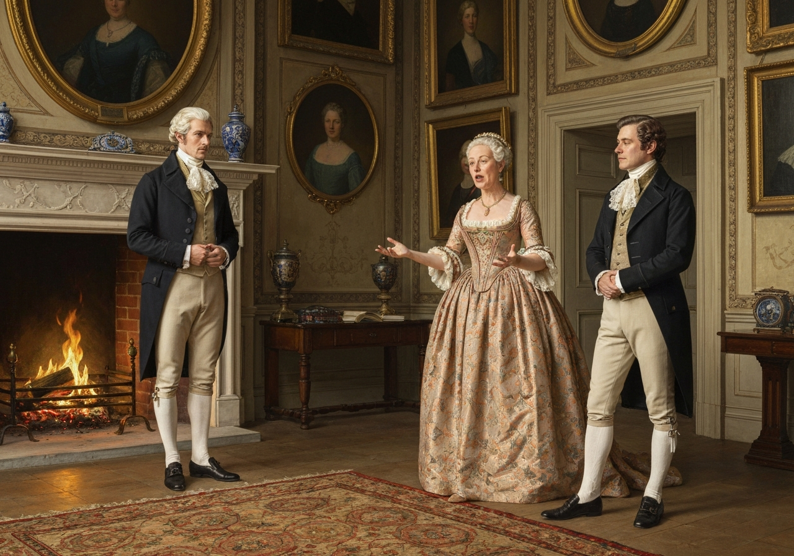
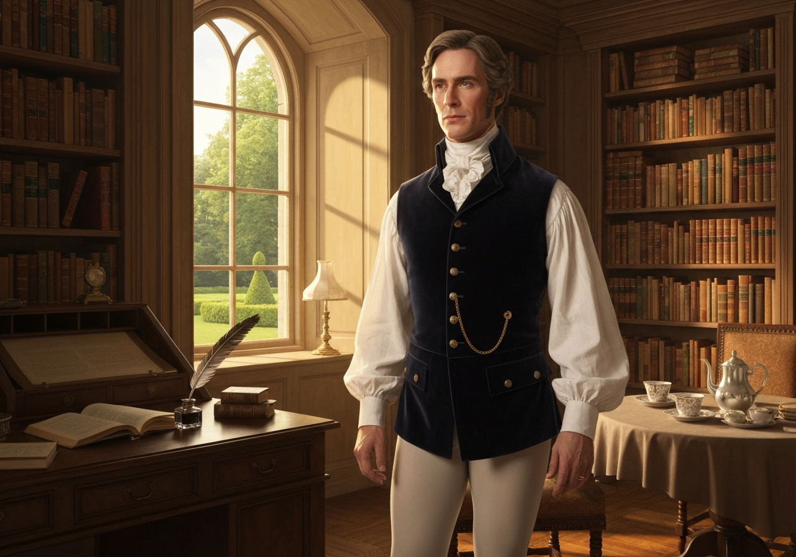
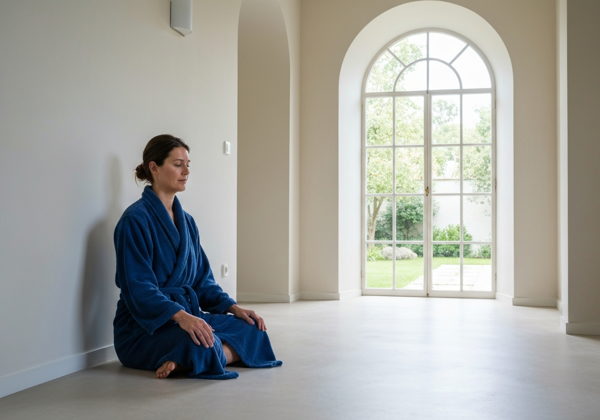
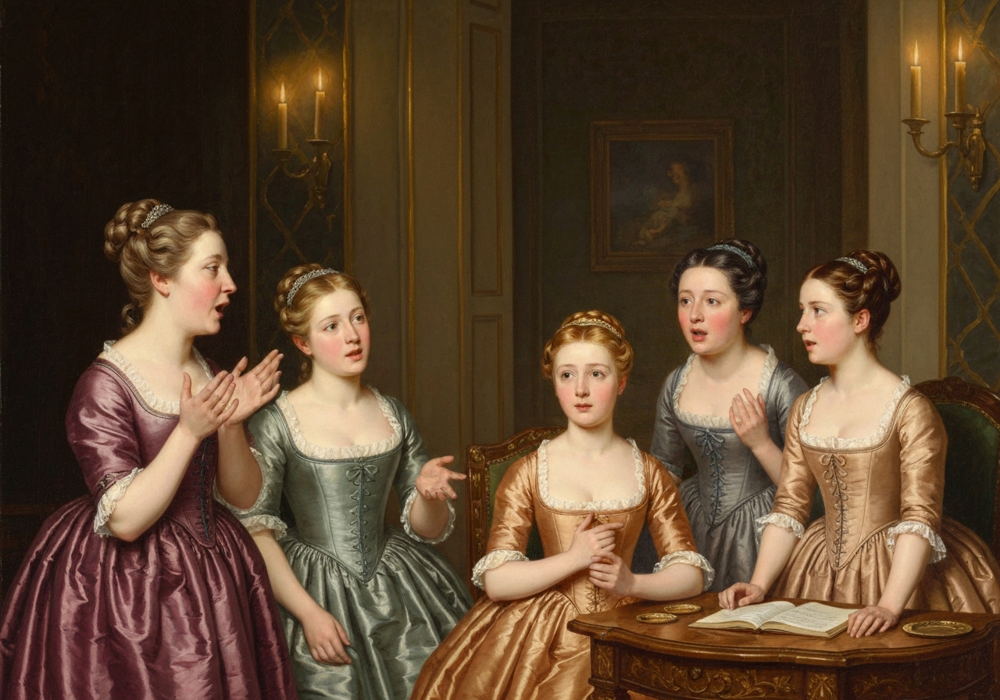
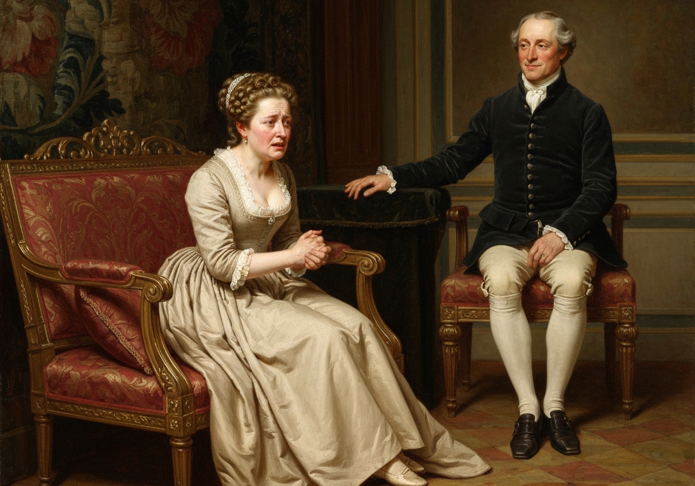
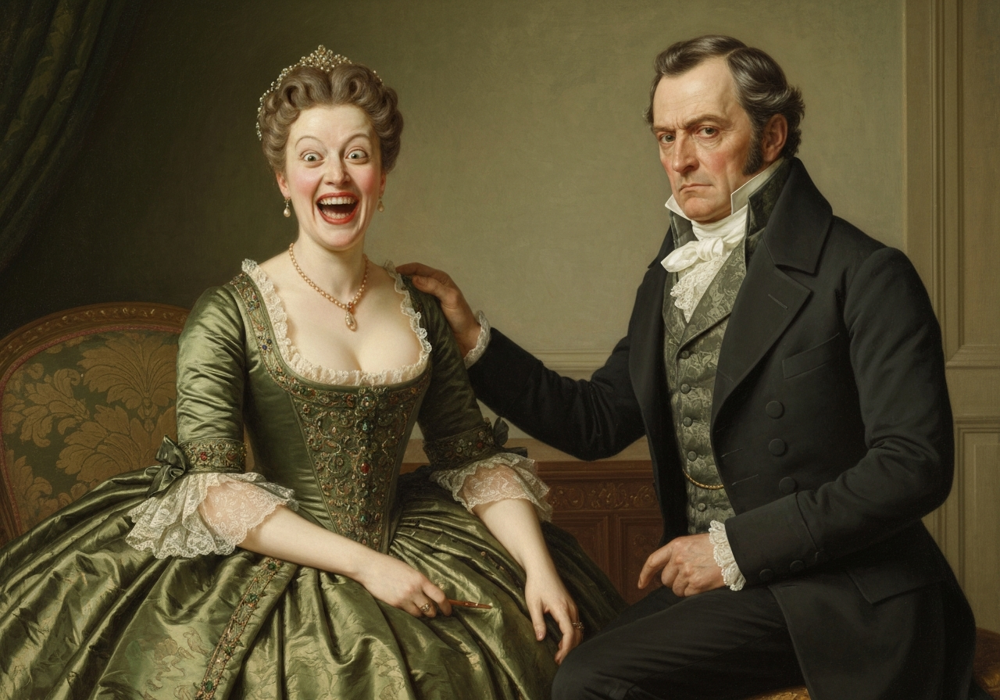
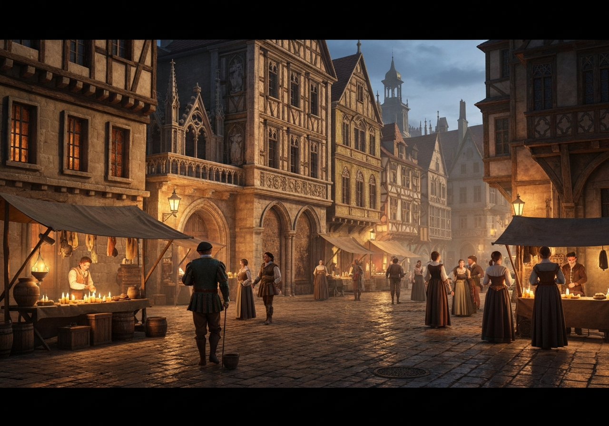
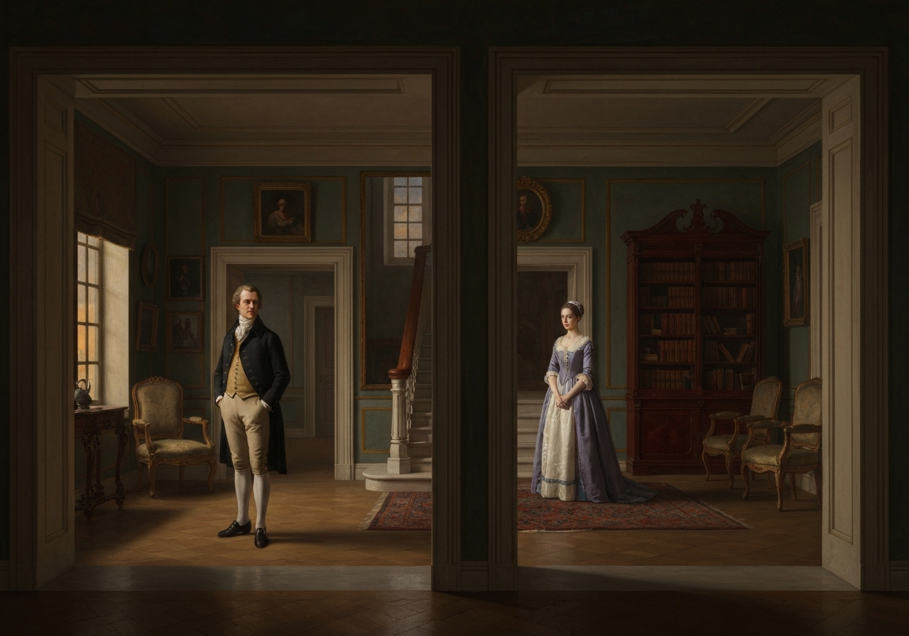

import Callout from '@/components/Callout.astro'

<!-- metadata:quote-1:start -->
<Callout title="Memorable Quote" variant="important">\n  It is a truth universally acknowledged, that a single man in possession of a good fortune must be in want of a wife.\n</Callout>
<!-- metadata:quote-1:end -->

<!-- metadata:analysis-1:start -->
<Callout title="Analysis [1]" variant="explanation">
Austen opens with a statement that sounds objective but is actually social satire. The phrase 'truth universally acknowledged' exposes how marriage gossip gets presented as common sense. By starting this way, the chapter frames courtship as public economics rather than private affection.
</Callout>
<!-- metadata:analysis-1:end -->

However little known the feelings or views of such a man may be on his
first entering a neighbourhood, this truth is so well fixed in the minds
of the surrounding families, that he is considered as the rightful
property of some one or other of their daughters.

<!-- metadata:analysis-2:start -->
<Callout title="Analysis [2]" variant="explanation">
The second paragraph shifts from maxim to neighborhood surveillance. A wealthy bachelor is described as 'rightful property,' which converts a person into a prize. Austen uses that language to critique a system where daughters compete for security under male-controlled wealth.
</Callout>
<!-- metadata:analysis-2:end -->

“My dear Mr. Bennet,” said his lady to him one day, “have you heard that
Netherfield Park is let at last?

<!-- metadata:image-1:start -->
<Callout title="Image [1] News at Longbourn" variant="example">

</Callout>
<!-- metadata:image-1:end -->”

Mr. Bennet replied that he had not.

“But it is,” returned she; “for Mrs. Long has just been here, and she
told me all about it.

<!-- metadata:analysis-3:start -->
<Callout title="Analysis [3]" variant="explanation">
Mrs Bennet's first speech establishes urgency, repetition, and social rumor as engines of the plot. Mr Bennet answers with deliberate restraint, creating comedy through contrast. Their dialogue models the novel's core tension between practical anxiety and ironic distance.
</Callout>
<!-- metadata:analysis-3:end -->”

Mr. Bennet made no answer.

“Do not you want to know who has taken it?” cried his wife, impatiently.

<!-- metadata:quote-2:start -->
<Callout title="Memorable Quote" variant="note">\n  You want to tell me, and I have no objection to hearing it.\n</Callout>
<!-- metadata:quote-2:end -->

<!-- metadata:image-2:start -->
<Callout title="Image [2] Dry Wit in the Parlour" variant="example">

</Callout>
<!-- metadata:image-2:end -->

[Illustration:

“He came down to see the place”

[_Copyright 1894 by George Allen._]]

This was invitation enough.

“Why, my dear, you must know, Mrs. Long says that Netherfield is taken
by a young man of large fortune from the north of England; that he came
down on Monday in a chaise and four to see the place, and was so much
delighted with it that he agreed with Mr. Morris immediately; that he is
to take possession before Michaelmas, and some of his servants are to be
in the house by the end of next week.

<!-- metadata:image-3:start -->
<Callout title="Image [3] Arrival at Netherfield" variant="example">

</Callout>
<!-- metadata:image-3:end -->”

“What is his name?”

“Bingley.”

“Is he married or single?”

“Oh, single, my dear, to be sure! <!-- metadata:quote-3:start -->
<Callout title="Memorable Quote" variant="tip">\n  A single man of large fortune; four or five thousand a year. What a fine thing for our girls!\n</Callout>
<!-- metadata:quote-3:end -->

<!-- metadata:analysis-4:start -->
<Callout title="Analysis [4]" variant="explanation">
Bingley's reported income immediately sets his rank in the marriage market. Mrs Bennet's exclamation about 'our girls' shows that romance is secondary to financial establishment. The chapter treats money not as background detail but as the metric that drives every decision.
</Callout>
<!-- metadata:analysis-4:end -->

<!-- metadata:image-4:start -->
<Callout title="Image [4] What a Fine Thing" variant="example">

</Callout>
<!-- metadata:image-4:end -->”

“How so? how can it affect them?”

“My dear Mr. Bennet,” replied his wife, “how can you be so tiresome? You
must know that I am thinking of his marrying one of them.”

“Is that his design in settling here?”

“Design? Nonsense, how can you talk so! But it is very likely that he
_may_ fall in love with one of them, and therefore you must visit him as
soon as he comes.

<!-- metadata:analysis-5:start -->
<Callout title="Analysis [5]" variant="explanation">
The argument over making the first visit reveals the procedural rules of Regency sociability. Mrs Bennet understands that without formal introduction, the family is blocked from opportunity. Austen turns etiquette into plot machinery, where a single call determines access.
</Callout>
<!-- metadata:analysis-5:end -->

<!-- metadata:image-5:start -->
<Callout title="Image [5] The Visit Debate" variant="example">

</Callout>
<!-- metadata:image-5:end -->”

“I see no occasion for that. You and the girls may go--or you may send
them by themselves, which perhaps will be still better; for as you are
as handsome as any of them, Mr. Bingley might like you the best of the
party.”

“My dear, you flatter me. I certainly _have_ had my share of beauty, but
I do not pretend to be anything extraordinary now. <!-- metadata:quote-4:start -->
<Callout title="Memorable Quote" variant="definition">\n  When a woman has five grown-up daughters, she ought to give over thinking of her own beauty.\n</Callout>
<!-- metadata:quote-4:end -->”

“In such cases, a woman has not often much beauty to think of.”

“But, my dear, you must indeed go and see Mr. Bingley when he comes into
the neighbourhood.”

“It is more than I engage for, I assure you.”

“But consider your daughters. Only think what an establishment it would
be for one of them. Sir William and Lady Lucas are determined to go,
merely on that account; for in general, you know, they visit no new
comers. <!-- metadata:quote-5:start -->
<Callout title="Memorable Quote" variant="explanation">\n  Indeed you must go, for it will be impossible for us to visit him, if you do not.\n</Callout>
<!-- metadata:quote-5:end -->”

“You are over scrupulous, surely. I dare say Mr. Bingley will be very
glad to see you; and I will send a few lines by you to assure him of my
hearty consent to his marrying whichever he chooses of the girls--though
I must throw in a good word for my little Lizzy.”

“I desire you will do no such thing. Lizzy is not a bit better than the
others: and I am sure she is not half so handsome as Jane, nor half so
good-humoured as Lydia. <!-- metadata:quote-6:start -->
<Callout title="Memorable Quote" variant="note">\n  They are all silly and ignorant like other girls; but Lizzy has something more of quickness than her sisters.\n</Callout>
<!-- metadata:quote-6:end --> replied he: “they are
all silly and ignorant like other girls; but Lizzy has something more of
quickness than her sisters.”

“Mr. Bennet, how can you abuse your own children in such a way? You take
delight in vexing me. You have no compassion on my poor nerves.

<!-- metadata:analysis-6:start -->
<Callout title="Analysis [6]" variant="explanation">
Mr Bennet's 'poor nerves' exchange is funny, but it also reveals emotional mismatch in the marriage. He performs wit to avoid direct engagement, while Mrs Bennet escalates through theatrical distress. The humor therefore doubles as character diagnosis.
</Callout>
<!-- metadata:analysis-6:end -->

<!-- metadata:image-6:start -->
<Callout title="Image [6] Poor Nerves" variant="example">

</Callout>
<!-- metadata:image-6:end -->”

“You mistake me, my dear. I have a high respect for your nerves. They
are my old friends. I have heard you mention them with consideration
these twenty years at least.”

“Ah, you do not know what I suffer.”

“But I hope you will get over it, and live to see many young men of four
thousand a year come into the neighbourhood.”

“It will be no use to us, if twenty such should come, since you will not
visit them.”

“Depend upon it, my dear, that when there are twenty, I will visit them
all.”

Mr. Bennet was so odd a mixture of quick parts, sarcastic humour,
reserve, and caprice, that the experience of three-and-twenty years had
been insufficient to make his wife understand his character. _Her_ mind
was less difficult to develope. She was a woman of mean understanding,
little information, and uncertain temper. When she was discontented, she
fancied herself nervous. <!-- metadata:quote-7:start -->
<Callout title="Memorable Quote" variant="summary">\n  The business of her life was to get her daughters married: its solace was visiting and news.\n</Callout>
<!-- metadata:quote-7:end -->

<!-- metadata:analysis-7:start -->
<Callout title="Analysis [7]" variant="explanation">
The closing narrator summary is severe and efficient, reducing the marriage to incompatible temperaments. Mrs Bennet's purpose and solace define a life narrowed by social pressure and limited agency. This ending converts domestic banter into structural critique of gendered expectation.
</Callout>
<!-- metadata:analysis-7:end -->

<!-- metadata:image-7:start -->
<Callout title="Image [7] Closing Household Portrait" variant="example">

</Callout>
<!-- metadata:image-7:end -->

[Illustration: Mr. & Mrs. Bennet

[_Copyright 1894 by George Allen._]]

[Illustration:

“I hope Mr. Bingley will like it”

[_Copyright 1894 by George Allen._]]
