import Callout from '@/components/Callout.astro'

[Illustration]

The day passed much as the day before had done. Mrs. Hurst and Miss
Bingley had spent some hours of the morning with the invalid, who
continued, though slowly, to mend; and, in the evening, Elizabeth joined
their party in the drawing-room. The loo table, however, did not appear.
Mr. Darcy was writing, and Miss Bingley, seated near him, was watching
the progress of his letter, and repeatedly calling off his attention by
messages to his sister. Mr. Hurst and Mr. Bingley were at piquet, and
Mrs. Hurst was observing their game.

Elizabeth took up some needlework, and was sufficiently amused in
attending to what passed between Darcy and his companion. {/* metadata:quote-unknown:start */}
<Callout title="Memorable Quote" variant="note">The perpetual commendations of the lady either on his hand-writing, or on the evenness of his lines, or on the length of his letter, with the perfect unconcern with which her praises were received, formed a curious dialogue.</Callout>
{/* metadata:quote-unknown:end */}

{/* metadata:image-unknown:start */}
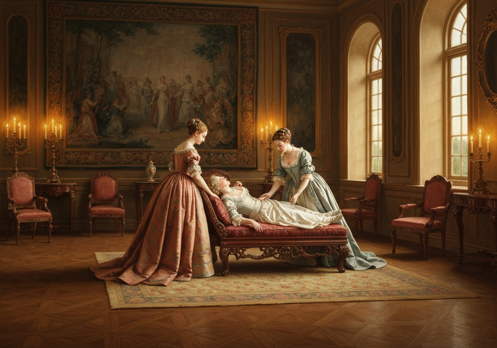

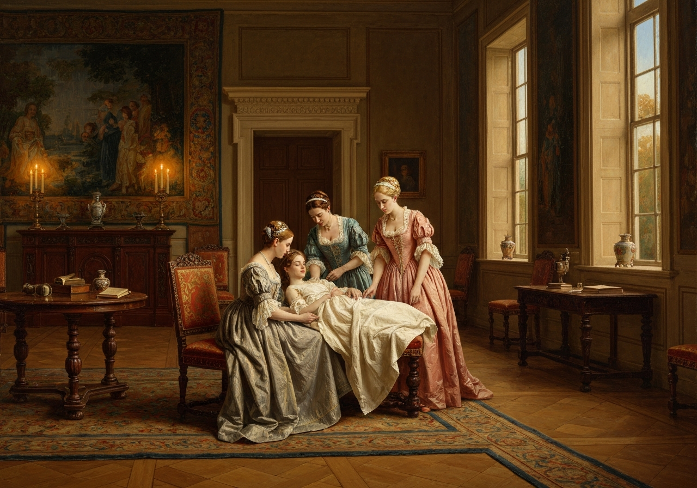
{/* metadata:image-unknown:end */}

{/* metadata:analysis-unknown:start */}
<Callout title="Analysis [1]" variant="explanation">
Elizabeth's role as a silent observer highlights the performative nature of Miss Bingley's affection for Darcy. By watching the 'curious dialogue' regarding the handwriting and length of Darcy's letter, Elizabeth identifies the transparency of social climbing. Austen uses this detachment to establish Elizabeth as a critic of the very society she is currently inhabiting.
</Callout>
{/* metadata:analysis-unknown:end */}

“How delighted Miss Darcy will be to receive such a letter!”

He made no answer.

“You write uncommonly fast.”

“You are mistaken. I write rather slowly.”

“How many letters you must have occasion to write in the course of a
year! Letters of business, too! How odious I should think them!”

“It is fortunate, then, that they fall to my lot instead of to yours.”

“Pray tell your sister that I long to see her.”

“I have already told her so once, by your desire.”

“I am afraid you do not like your pen. Let me mend it for you. I mend
pens remarkably well.”

“Thank you--but I always mend my own.”

“How can you contrive to write so even?”

He was silent.

“Tell your sister I am delighted to hear of her improvement on the harp,
and pray let her know that I am quite in raptures with her beautiful
little design for a table, and I think it infinitely superior to Miss
Grantley’s.”

“Will you give me leave to defer your raptures till I write again? At
present I have not room to do them justice.”

“Oh, it is of no consequence. I shall see her in January. But do you
always write such charming long letters to her, Mr. Darcy?”

“They are generally long; but whether always charming, it is not for me
to determine.”

“It is a rule with me, that a person who can write a long letter with
ease cannot write ill.”

“That will not do for a compliment to Darcy, Caroline,” cried her
brother, “because he does _not_ write with ease. He studies too much
for words of four syllables. Do not you, Darcy?”

“My style of writing is very different from yours.”

{/* metadata:image-unknown:start */}
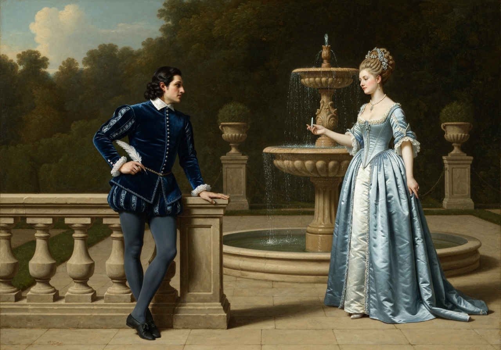

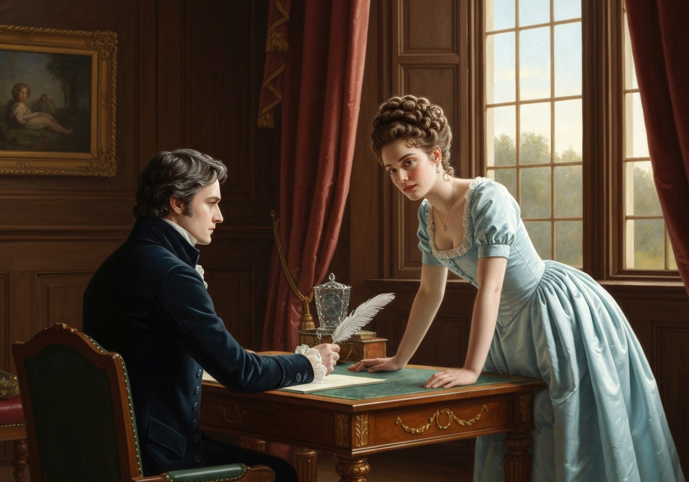
{/* metadata:image-unknown:end */}

{/* metadata:analysis-unknown:start */}
<Callout title="Analysis [2]" variant="explanation">
The discussion of writing speed and style serves as a metaphor for the gentlemen's differing temperaments. Darcy's studied precision and Bingley's careless rapidity reflect their broader approaches to social and moral obligations. Elizabeth's interjection regarding Bingley's humility allows Darcy to pivot the conversation toward a deeper psychological critique.
</Callout>
{/* metadata:analysis-unknown:end */}

“Oh,” cried Miss Bingley, “Charles writes in the most careless way
imaginable. He leaves out half his words, and blots the rest.”

“My ideas flow so rapidly that I have not time to express them; by which
means my letters sometimes convey no ideas at all to my correspondents.”

“Your humility, Mr. Bingley,” said Elizabeth, “must disarm reproof.”

{/* metadata:quote-unknown:start */}
<Callout title="Memorable Quote" variant="note">Nothing is more deceitful than the appearance of humility. It is often only carelessness of opinion, and sometimes an indirect boast.</Callout>
{/* metadata:quote-unknown:end */}

“And which of the two do you call _my_ little recent piece of modesty?”

“The indirect boast; for you are really proud of your defects in
writing, because you consider them as proceeding from a rapidity of
thought and carelessness of execution, which, if not estimable, you
think at least highly interesting. {/* metadata:quote-unknown:start */}
<Callout title="Memorable Quote" variant="note">The power of doing anything with quickness is always much prized by the possessor, and often without any attention to the imperfection of the performance.</Callout>
{/* metadata:quote-unknown:end */} When you told Mrs.
Bennet this morning, that if you ever resolved on quitting Netherfield
you should be gone in five minutes, you meant it to be a sort of
panegyric, of compliment to yourself; and yet what is there so very
laudable in a precipitance which must leave very necessary business
undone, and can be of no real advantage to yourself or anyone else?”

{/* metadata:image-unknown:start */}
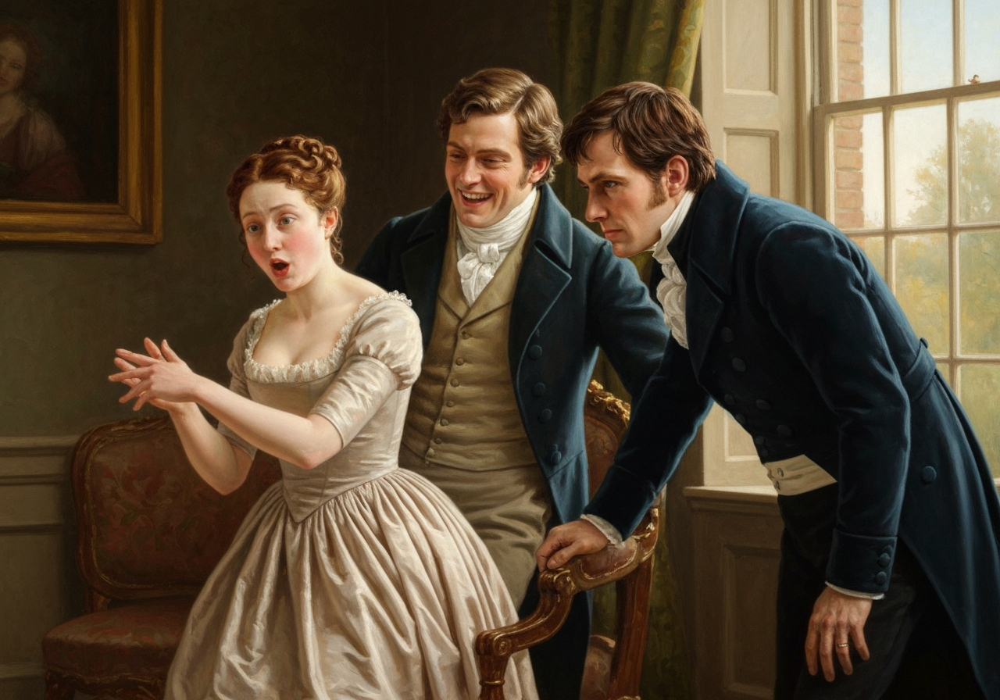

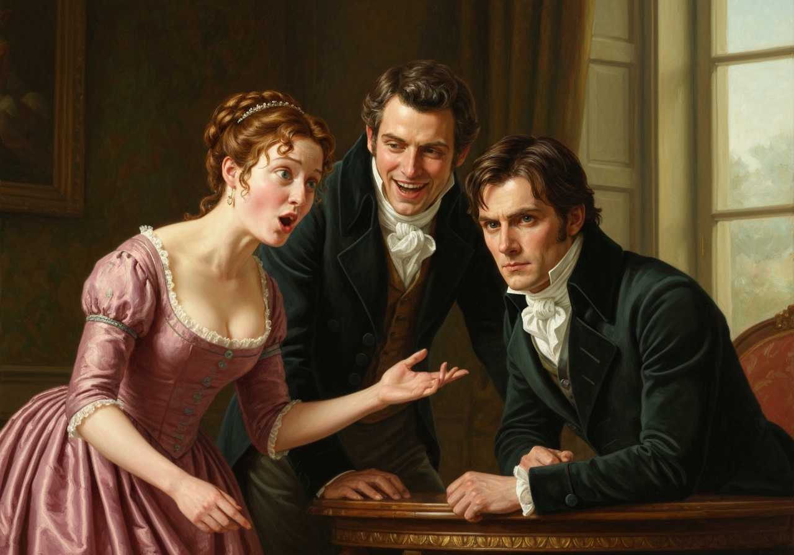
{/* metadata:image-unknown:end */}

{/* metadata:analysis-unknown:start */}
<Callout title="Analysis [3]" variant="explanation">
Darcy's definition of the 'indirect boast' provides a sharp analysis of how people leverage their own flaws to seem more interesting. He argues that Bingley's pride in his own 'carelessness of execution' is actually a vanity in disguise. This moment highlights Darcy's relentless intellectualism and his refusal to accept social platitudes at face value.
</Callout>
{/* metadata:analysis-unknown:end */}

“Nay,” cried Bingley, “this is too much, to remember at night all the
foolish things that were said in the morning. And yet, upon my honour, I
believed what I said of myself to be true, and I believe it at this
moment. At least, therefore, I did not assume the character of needless
precipitance merely to show off before the ladies.”

“I daresay you believed it; but I am by no means convinced that you
would be gone with such celerity. Your conduct would be quite as
dependent on chance as that of any man I know; and if, as you were
mounting your horse, a friend were to say, ‘Bingley, you had better stay
till next week,’ you would probably do it--you would probably not
go--and, at another word, might stay a month.”

“You have only proved by this,” cried Elizabeth, “that Mr. Bingley did
not do justice to his own disposition. You have shown him off now much
more than he did himself.”

“I am exceedingly gratified,” said Bingley, “by your converting what my
friend says into a compliment on the sweetness of my temper. But I am
afraid you are giving it a turn which that gentleman did by no means
intend; for he would certainly think the better of me if, under such a
circumstance, I were to give a flat denial, and ride off as fast as I
could.”

“Would Mr. Darcy then consider the rashness of your original intention
as atoned for by your obstinacy in adhering to it?”

“Upon my word, I cannot exactly explain the matter--Darcy must speak for
himself.”

“You expect me to account for opinions which you choose to call mine,
but which I have never acknowledged. Allowing the case, however, to
stand according to your representation, you must remember, Miss Bennet,
that the friend who is supposed to desire his return to the house, and
the delay of his plan, has merely desired it, asked it without offering
one argument in favour of its propriety.”

“To yield readily--easily--to the _persuasion_ of a friend is no merit
with you.”

{/* metadata:quote-unknown:start */}
<Callout title="Memorable Quote" variant="note">To yield without conviction is no compliment to the understanding of either.</Callout>
{/* metadata:quote-unknown:end */}

“You appear to me, Mr. Darcy, to allow nothing for the influence of
friendship and affection. A regard for the requester would often make
one readily yield to a request, without waiting for arguments to reason
one into it. I am not particularly speaking of such a case as you have
supposed about Mr. Bingley. We may as well wait, perhaps, till the
circumstance occurs, before we discuss the discretion of his behaviour
thereupon. But in general and ordinary cases, between friend and friend,
where one of them is desired by the other to change a resolution of no
very great moment, should you think ill of that person for complying
with the desire, without waiting to be argued into it?”

{/* metadata:image-unknown:start */}
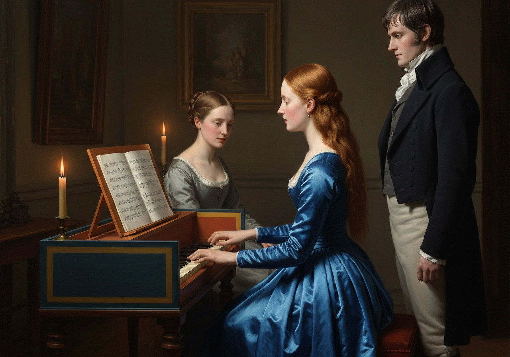

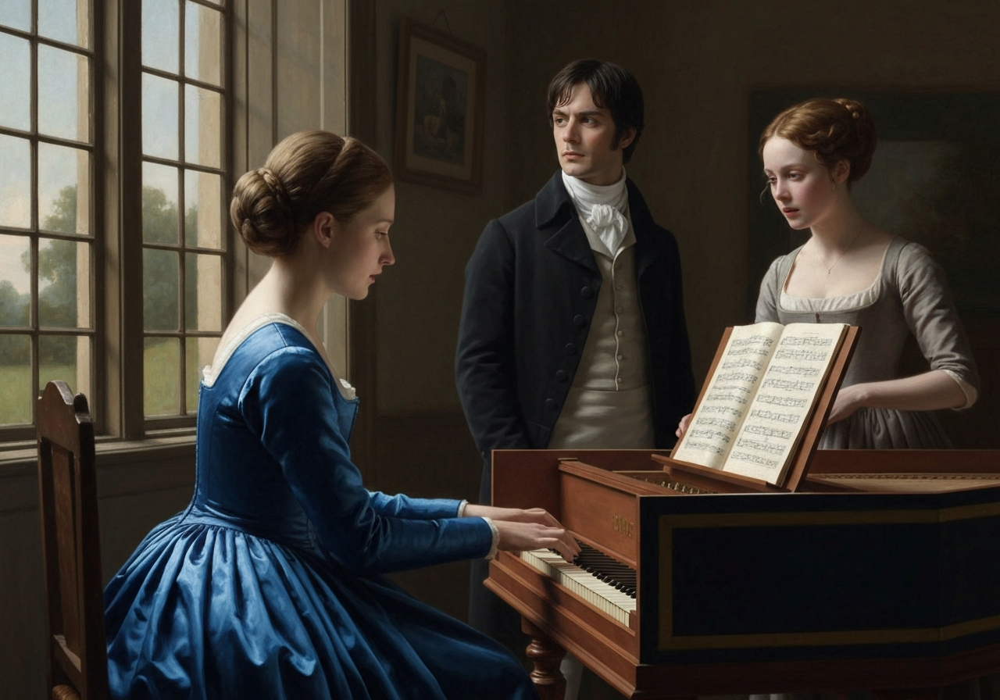
{/* metadata:image-unknown:end */}

{/* metadata:analysis-unknown:start */}
<Callout title="Analysis [4]" variant="explanation">
The debate over yielding to a friend's persuasion reveals a fundamental philosophical divide between Darcy and Elizabeth. While Darcy values intellectual conviction above all, Elizabeth argues for the merit of yielding to affection and social harmony. This exchange foreshadows their future conflicts regarding the balance of logic and feeling in human relationships.
</Callout>
{/* metadata:analysis-unknown:end */}

“Will it not be advisable, before we proceed on this subject, to arrange
with rather more precision the degree of importance which is to
appertain to this request, as well as the degree of intimacy subsisting
between the parties?”

“By all means,” cried Bingley; “let us hear all the particulars, not
forgetting their comparative height and size, for that will have more
weight in the argument, Miss Bennet, than you may be aware of. I assure
you that if Darcy were not such a great tall fellow, in comparison with
myself, I should not pay him half so much deference. I declare I do not
know a more awful object than Darcy on particular occasions, and in
particular places; at his own house especially, and of a Sunday evening,
when he has nothing to do.”

Mr. Darcy smiled; but Elizabeth thought she could perceive that he was
rather offended, and therefore checked her laugh. Miss Bingley warmly
resented the indignity he had received, in an expostulation with her
brother for talking such nonsense.

“I see your design, Bingley,” said his friend. “You dislike an argument,
and want to silence this.”

“Perhaps I do. Arguments are too much like disputes. If you and Miss
Bennet will defer yours till I am out of the room, I shall be very
thankful; and then you may say whatever you like of me.”

“What you ask,” said Elizabeth, “is no sacrifice on my side; and Mr.
Darcy had much better finish his letter.”

Mr. Darcy took her advice, and did finish his letter.

When that business was over, he applied to Miss Bingley and Elizabeth
for the indulgence of some music. Miss Bingley moved with alacrity to
the pianoforte, and after a polite request that Elizabeth would lead the
way, which the other as politely and more earnestly negatived, she
seated herself.

Mrs. Hurst sang with her sister; and while they were thus employed,
Elizabeth could not help observing, as she turned over some music-books
that lay on the instrument, how frequently Mr. Darcy’s eyes were fixed
on her. She hardly knew how to suppose that she could be an object of
admiration to so great a man, and yet that he should look at her because
he disliked her was still more strange. She could only imagine, however,
at last, that she drew his notice because there was something about her
more wrong and reprehensible, according to his ideas of right, than in
any other person present. The supposition did not pain her. She liked
him too little to care for his approbation.

{/* metadata:image-unknown:start */}
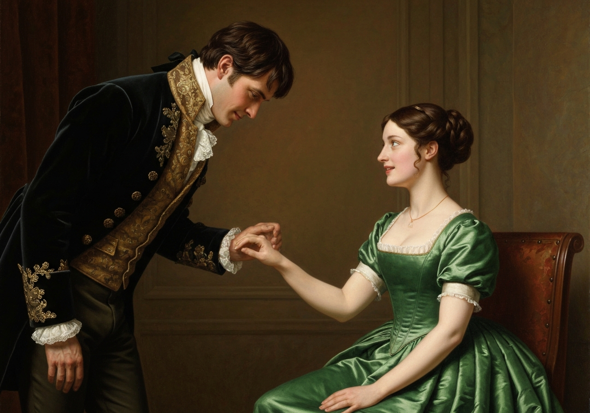

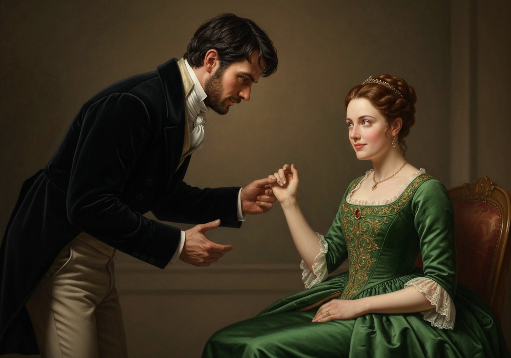
{/* metadata:image-unknown:end */}

{/* metadata:analysis-unknown:start */}
<Callout title="Analysis [5]" variant="explanation">
As Miss Bingley plays the piano, Darcy's frequent glances at Elizabeth signal a shift from critical observation to genuine fascination. Elizabeth's inability to believe she is an object of admiration underscores the depth of her own prejudice against him. She interprets his attention as search for fault, creating a dramatic irony that drives the chapter's tension.
</Callout>
{/* metadata:analysis-unknown:end */}

After playing some Italian songs, Miss Bingley varied the charm by a
lively Scotch air; and soon afterwards Mr. Darcy, drawing near
Elizabeth, said to her,--

“Do you not feel a great inclination, Miss Bennet, to seize such an
opportunity of dancing a reel?”

She smiled, but made no answer. He repeated the question, with some
surprise at her silence.

“Oh,” said she, “I heard you before; but I could not immediately
determine what to say in reply. You wanted me, I know, to say ‘Yes,’
that you might have the pleasure of despising my taste; but I always
delight in overthrowing those kind of schemes, and cheating a person of
their premeditated contempt. {/* metadata:quote-unknown:start */}
<Callout title="Memorable Quote" variant="note">I have, therefore, made up my mind to tell you that I do not want to dance a reel at all; and now despise me if you dare.</Callout>
{/* metadata:quote-unknown:end */}

{/* metadata:image-unknown:start */}
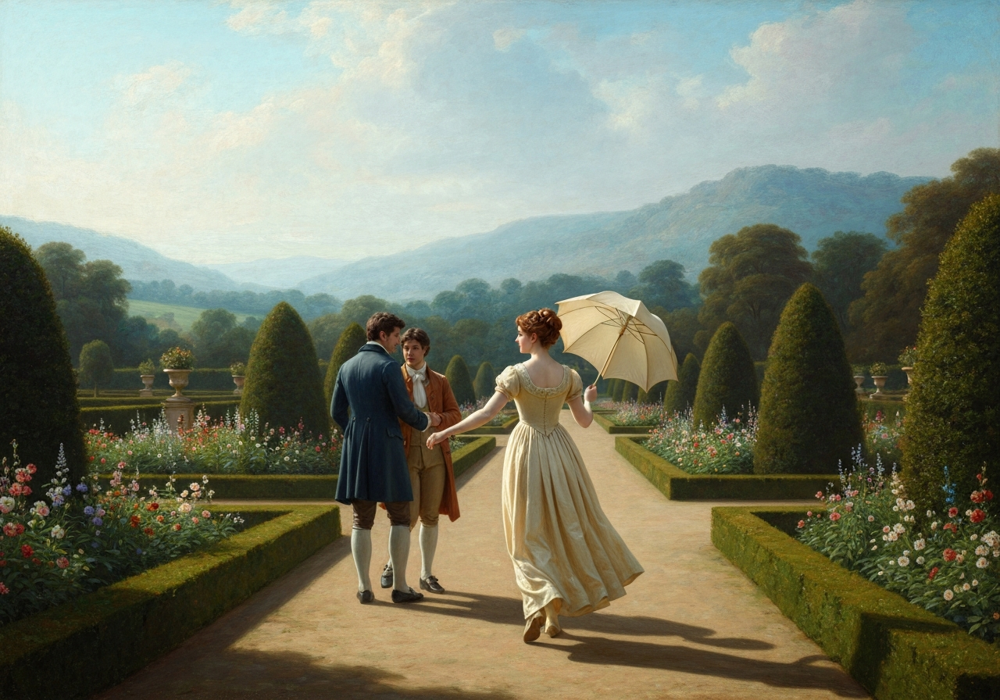

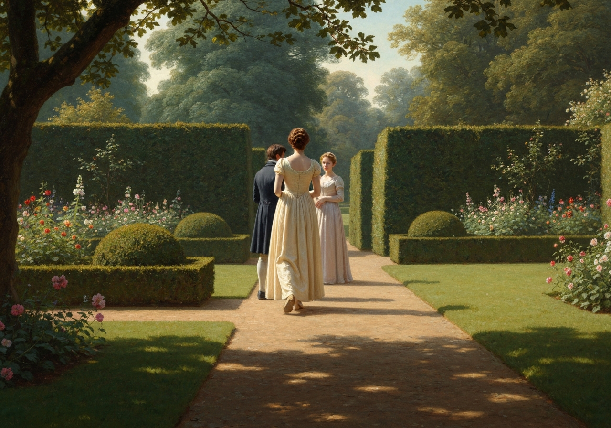
{/* metadata:image-unknown:end */}

{/* metadata:analysis-unknown:start */}
<Callout title="Analysis [6]" variant="explanation">
Elizabeth's refusal to dance a reel is a masterful stroke of social subversion. By acknowledging Darcy's expected 'pleasure of despising' her, she denies him the opportunity to look down on her. Her arch manner and intellectual 'cheating' of his contempt actually serve to deepen his bewitchment, proving her unique power over him.
</Callout>
{/* metadata:analysis-unknown:end */}

“Indeed I do not dare.”

Elizabeth, having rather expected to affront him, was amazed at his
gallantry; but there was a mixture of sweetness and archness in her
manner which made it difficult for her to affront anybody, and {/* metadata:quote-unknown:start */}
<Callout title="Memorable Quote" variant="note">Darcy had never been so bewitched by any woman as he was by her. He really believed that, were it not for the inferiority of her connections, he should be in some danger.</Callout>
{/* metadata:quote-unknown:end */}

Miss Bingley saw, or suspected, enough to be jealous; and her great
anxiety for the recovery of her dear friend Jane received some
assistance from her desire of getting rid of Elizabeth.

She often tried to provoke Darcy into disliking her guest, by talking of
their supposed marriage, and planning his happiness in such an alliance.

“I hope,” said she, as they were walking together in the shrubbery the
next day, “you will give your mother-in-law a few hints, when this
desirable event takes place, as to the advantage of holding her tongue;
and if you can compass it, to cure the younger girls of running after
the officers. And, if I may mention so delicate a subject, endeavour to
check that little something, bordering on conceit and impertinence,
which your lady possesses.”

[Illustration:

     “No, no; stay where you are”

[_Copyright 1894 by George Allen._]]

“Have you anything else to propose for my domestic felicity?”

“Oh yes. Do let the portraits of your uncle and aunt Philips be placed
in the gallery at Pemberley. Put them next to your great-uncle the
judge. They are in the same profession, you know, only in different
lines. As for your Elizabeth’s picture, you must not attempt to have it
taken, for what painter could do justice to those beautiful eyes?”

“It would not be easy, indeed, to catch their expression; but their
colour and shape, and the eyelashes, so remarkably fine, might be
copied.”

At that moment they were met from another walk by Mrs. Hurst and
Elizabeth herself.

“I did not know that you intended to walk,” said Miss Bingley, in some
confusion, lest they had been overheard.

“You used us abominably ill,” answered Mrs. Hurst, “running away without
telling us that you were coming out.”

Then taking the disengaged arm of Mr. Darcy, she left Elizabeth to walk
by herself. The path just admitted three. Mr. Darcy felt their rudeness,
and immediately said,--

“This walk is not wide enough for our party. We had better go into the
avenue.”

But Elizabeth, who had not the least inclination to remain with them,
laughingly answered,--

“No, no; stay where you are. You are charmingly grouped, and appear to
uncommon advantage. {/* metadata:quote-unknown:start */}
<Callout title="Memorable Quote" variant="note">You are charmingly grouped, and appear to uncommon advantage. The picturesque would be spoilt by admitting a fourth.</Callout>
{/* metadata:quote-unknown:end */}
fourth.

{/* metadata:image-unknown:start */}
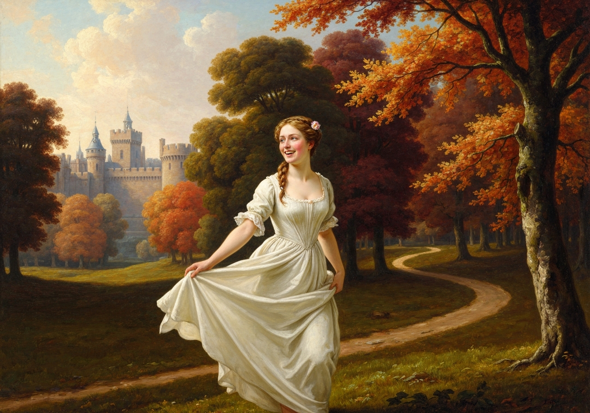

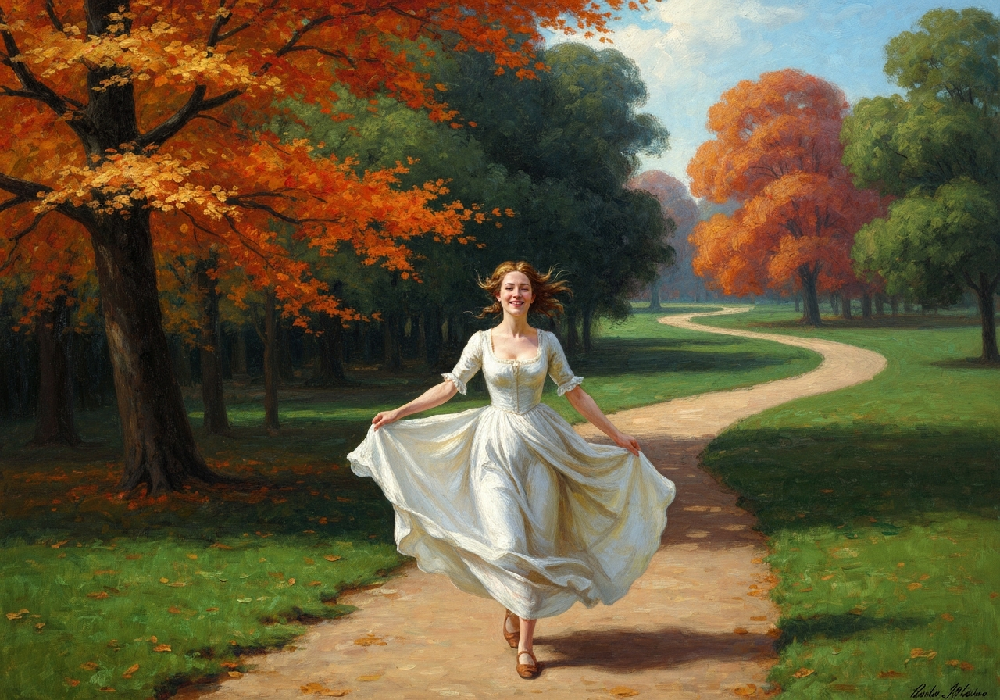
{/* metadata:image-unknown:end */}

{/* metadata:analysis-unknown:start */}
<Callout title="Analysis [7]" variant="explanation">
Elizabeth's final interaction in the shrubbery demonstrates her ability to turn social exclusion into personal triumph. When Miss Bingley and Mrs. Hurst crowd her off the path, Elizabeth reframes their rudeness as a 'charming group' that she would only spoil. Her gay departure signals her preference for the freedom of her own thoughts over the cramped etiquette of Netherfield.
</Callout>
{/* metadata:analysis-unknown:end */}

 Good-bye.”

She then ran gaily off, rejoicing, as she rambled about, in the hope of
being at home again in a day or two. Jane was already so much recovered
as to intend leaving her room for a couple of hours that evening.

[Illustration:

     “Piling up the fire”

[_Copyright 1894 by George Allen._]]
