import Callout from '@/components/Callout.astro'

[Illustration]

When the ladies removed after dinner Elizabeth ran up to her sister, and
seeing her well guarded from cold, attended her into the drawing-room,
where she was welcomed by her two friends with many professions of
pleasure; and Elizabeth had never seen them so agreeable as they were
during the hour which passed before the gentlemen appeared. Their powers
of conversation were considerable. They could describe an entertainment
with accuracy, relate an anecdote with humour, and laugh at their
acquaintance with spirit.

{/* metadata:analysis-1:start */}
<Callout title="Analysis [1]" variant="explanation">
Elizabeth's observation of the Bingley sisters reveals their social dexterity; they are 'agreeable' only in the absence of the gentlemen. Their ability to describe entertainments with humor and spirit highlights a performative elegance that lacks genuine depth. Austen suggests that their social graces are tools for status rather than reflections of character.
</Callout>
{/* metadata:analysis-1:end */}

But when the gentlemen entered, Jane was no longer the first object;
Miss Bingley’s eyes were instantly turned towards Darcy, and she had
something to say to him before he had advanced many steps. He addressed
himself directly to Miss Bennet with a polite congratulation; Mr. Hurst
also made her a slight bow, and said he was “very glad;” but diffuseness
and warmth remained for Bingley’s salutation. He was full of joy and
attention. The first half hour was spent in piling up the fire, lest she
should suffer from the change of room; and she removed, at his desire,
to the other side of the fireplace, that she might be farther from the
door. He then sat down by her, and talked scarcely to anyone else.

{/* metadata:image-1:start */}
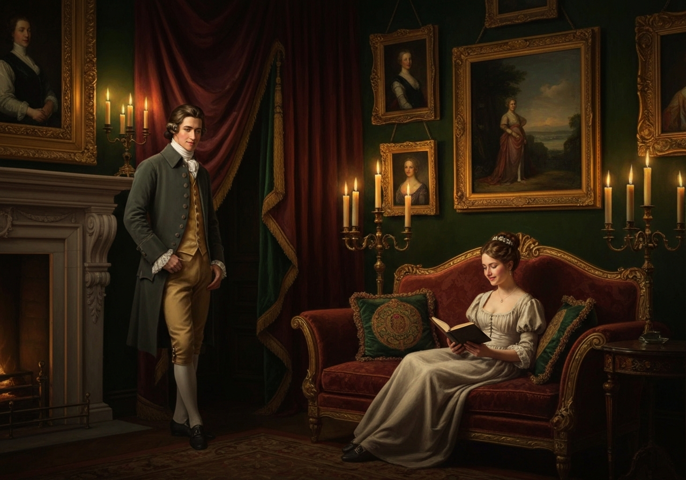

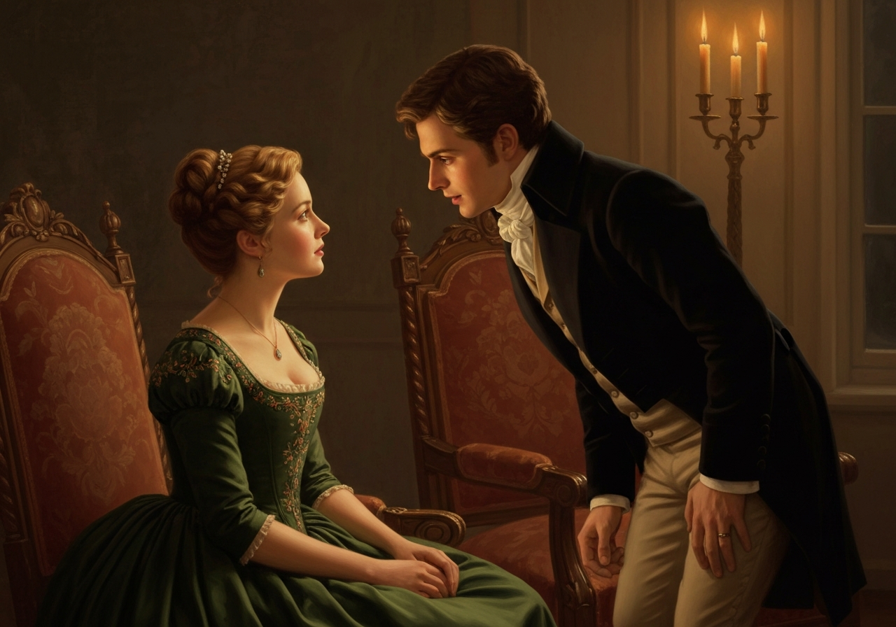
{/* metadata:image-1:end */}

{/* metadata:analysis-2:start */}
<Callout title="Analysis [2]" variant="explanation">
Bingley's immediate and exclusive focus on Jane upon the gentlemen's entry confirms his romantic preference. His concern for her comfort, from the piling of the fire to his choice of seat, creates a private sphere within the public drawing-room. This singular attention stands in stark contrast to the performative social maneuvers occurring around them.
</Callout>
{/* metadata:analysis-2:end */}

Elizabeth, at work in the opposite corner, saw it all with great
delight.

When tea was over Mr. Hurst reminded his sister-in-law of the
card-table--but in vain. She had obtained private intelligence that Mr.
Darcy did not wish for cards, and Mr. Hurst soon found even his open
petition rejected. She assured him that no one intended to play, and the
silence of the whole party on the subject seemed to justify her. Mr.
Hurst had, therefore, nothing to do but to stretch himself on one of the
sofas and go to sleep. Darcy took up a book. Miss Bingley did the same;
and Mrs. Hurst, principally occupied in playing with her bracelets and
rings, joined now and then in her brother’s conversation with Miss
Bennet.

Miss Bingley’s attention was quite as much engaged in watching Mr.
Darcy’s progress through _his_ book, as in reading her own; and she was
perpetually either making some inquiry, or looking at his page. She
could not win him, however, to any conversation; he merely answered her
question and read on. At length, quite exhausted by the attempt to be
amused with her own book, which she had only chosen because it was the
second volume of his, she gave a great yawn and said, {/* metadata:quote-1:start */}
<Callout title="Memorable Quote" variant="note">“How pleasant it is to spend an evening in this way! I declare, after all, there is no enjoyment like reading! How much sooner one tires of anything than of a book!”</Callout>
{/* metadata:quote-1:end */} When I have a house of my own, I shall be miserable if I have not
an excellent library.”

{/* metadata:analysis-3:start */}
<Callout title="Analysis [3]" variant="explanation">
Miss Bingley's choice of a book solely because it is the second volume of Darcy's is a transparent attempt at intellectual mimicry. Her subsequent yawns and performative declarations about the 'enjoyment like reading' expose the emptiness of her social pursuits. Austen uses this irony to demonstrate how social ambition can lead to comical levels of self-betrayal.
</Callout>
{/* metadata:analysis-3:end */}

No one made any reply. She then yawned again, threw aside her book, and
cast her eyes round the room in quest of some amusement;

{/* metadata:image-2:start */}
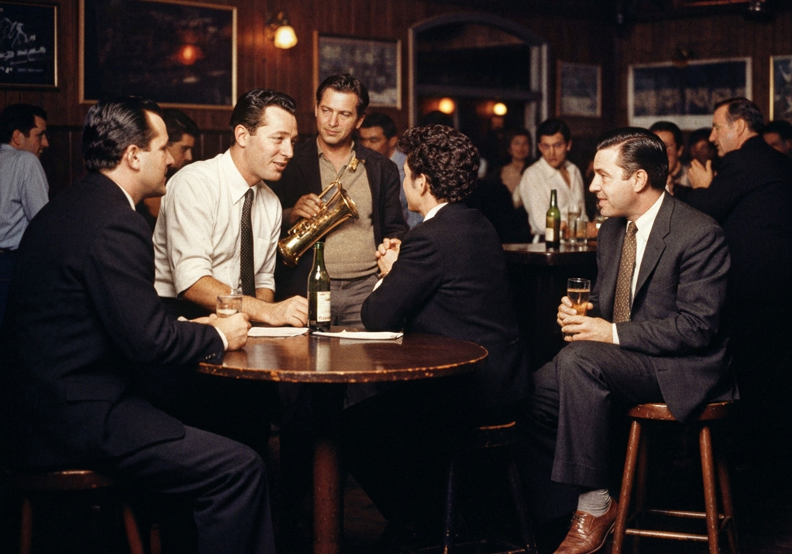

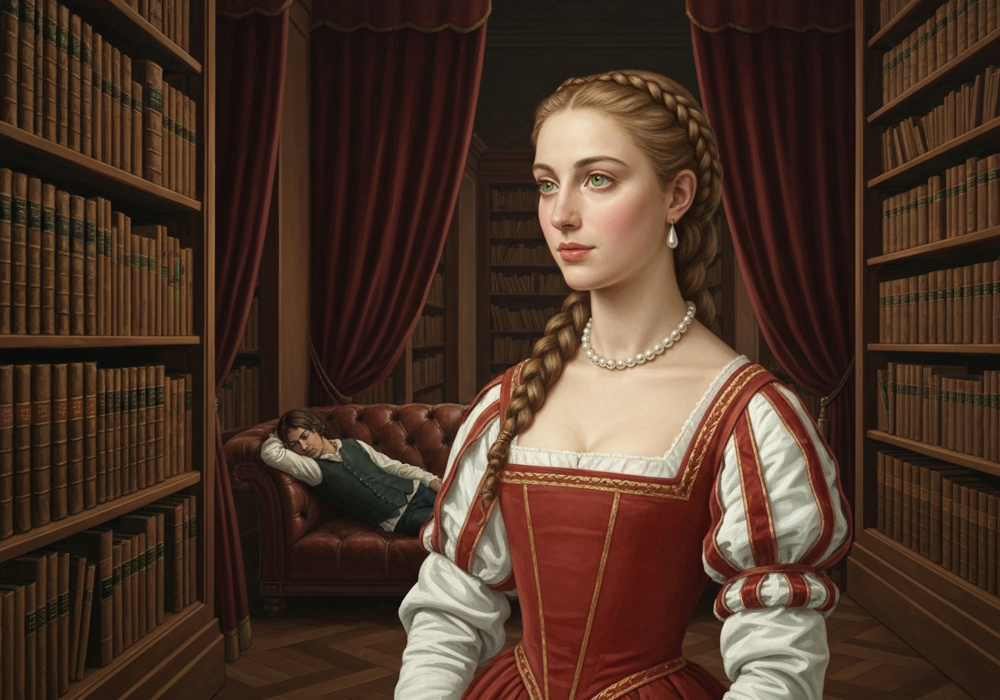
{/* metadata:image-2:end */}

 when, hearing
her brother mentioning a ball to Miss Bennet, she turned suddenly
towards him and said,--

“By the bye Charles, are you really serious in meditating a dance at
Netherfield? I would advise you, before you determine on it, to consult
the wishes of the present party; I am much mistaken if there are not
some among us to whom a ball would be rather a punishment than a
pleasure.”

“If you mean Darcy,” cried her brother, “he may go to bed, if he
chooses, before it begins; but as for the ball, it is quite a settled
thing, and as soon as Nicholls has made white soup enough I shall send
round my cards.”

“I should like balls infinitely better,” she replied, “if they were
carried on in a different manner; but there is something insufferably
tedious in the usual process of such a meeting. It would surely be much
more rational if conversation instead of dancing made the order of the
day.”

{/* metadata:quote-2:start */}
<Callout title="Memorable Quote" variant="note">“Much more rational, my dear Caroline, I dare say; but it would not be near so much like a ball.”</Callout>
{/* metadata:quote-2:end */}

Miss Bingley made no answer, and soon afterwards got up and walked about
the room. Her figure was elegant, and she walked well; but Darcy, at
whom it was all aimed, was still inflexibly studious. In the
desperation of her feelings, she resolved on one effort more; and,
turning to Elizabeth, said,--

“Miss Eliza Bennet, let me persuade you to follow my example, and take a
turn about the room. I assure you it is very refreshing after sitting so
long in one attitude.”

{/* metadata:image-3:start */}
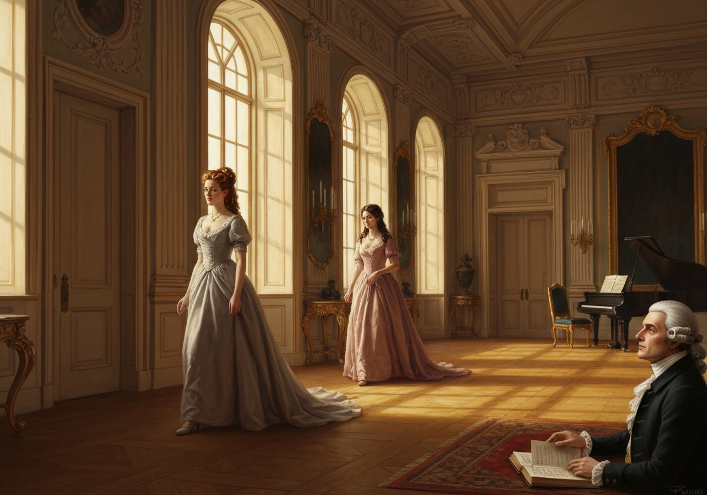

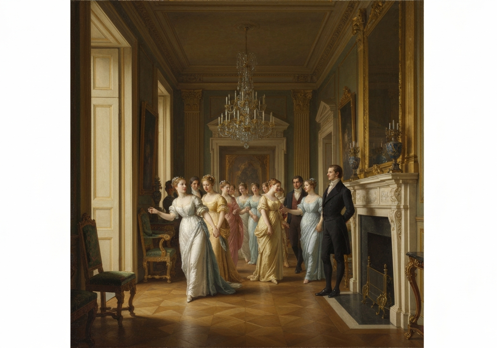
{/* metadata:image-3:end */}

Elizabeth was surprised, but agreed to it immediately. Miss Bingley
succeeded no less in the real object of her civility: Mr. Darcy looked
up. He was as much awake to the novelty of attention in that quarter as
Elizabeth herself could be, and unconsciously closed his book. He was
directly invited to join their party, but he declined it, observing that
he could imagine but two motives for their choosing to walk up and down
the room together, with either of which motives his joining them would
interfere. What could he mean? She was dying to know what could be his
meaning--and asked Elizabeth whether she could at all understand him.

“Not at all,” was her answer; “but, depend upon it, he means to be
severe on us, and our surest way of disappointing him will be to ask
nothing about it.”

Miss Bingley, however, was incapable of disappointing Mr. Darcy in
anything, and persevered, therefore, in requiring an explanation of his
two motives.

“I have not the smallest objection to explaining them,” said he, as soon
as she allowed him to speak. {/* metadata:quote-3:start */}
<Callout title="Memorable Quote" variant="note">“You either choose this method of passing the evening because you are in each other’s confidence, and have secret affairs to discuss, or because you are conscious that your figures appear to the greatest advantage in walking.”</Callout>
{/* metadata:quote-3:end */} if the first, I should be
completely in your way; and if the second, I can admire you much better
as I sit by the fire.”

{/* metadata:analysis-4:start */}
<Callout title="Analysis [4]" variant="explanation">
The 'turn about the room' initiated by Miss Bingley is a calculated move to display her figure and draw Darcy's gaze. Darcy's clinical analysis of their motives—either secret-sharing or vanity—strips the gesture of its intended elegance. This moment illustrates Darcy's refusal to participate in the standard social games of the era.
</Callout>
{/* metadata:analysis-4:end */}

“Oh, shocking!” cried Miss Bingley. “I never heard anything so
abominable. How shall we punish him for such a speech?”

“Nothing so easy, if you have but the inclination,” said Elizabeth. “We
can all plague and punish one another. Tease him--laugh at him. Intimate
as you are, you must know how it is to be done.”

“But upon my honour I do _not_. I do assure you that my intimacy has not
yet taught me _that_. Tease calmness of temper and presence of mind! No,
no; I feel he may defy us there. And as to laughter, we will not expose
ourselves, if you please, by attempting to laugh without a subject. Mr.
Darcy may hug himself.”

“Mr. Darcy is not to be laughed at!” cried Elizabeth. “That is an
uncommon advantage, and uncommon I hope it will continue, for it would
be a great loss to _me_ to have many such acquaintance. I dearly love a
laugh.”

“Miss Bingley,” said he, “has given me credit for more than can be. {/* metadata:quote-4:start */}
<Callout title="Memorable Quote" variant="note">“The wisest and best of men,--nay, the wisest and best of their actions,--may be rendered ridiculous by a person whose first object in life is a joke.”</Callout>
{/* metadata:quote-4:end */}

“Certainly,” replied Elizabeth, “there are such people, but I hope I am
not one of _them_. I hope I never ridicule what is wise or good. {/* metadata:quote-5:start */}
<Callout title="Memorable Quote" variant="note">“Follies and nonsense, whims and inconsistencies, _do_ divert me, I own, and I laugh at them whenever I can. But these, I suppose, are precisely what you are without.”</Callout>
{/* metadata:quote-5:end */}

“Perhaps that is not possible for anyone. But it has been the study of
my life to avoid those weaknesses which often expose a strong
understanding to ridicule.”

“Such as vanity and pride.”

“Yes, vanity is a weakness indeed. But pride--where there is a real
superiority of mind--pride will be always under good regulation.”

Elizabeth turned away to hide a smile.

{/* metadata:image-4:start */}
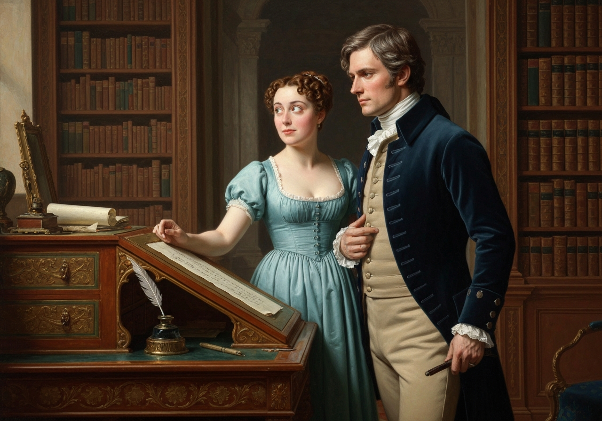

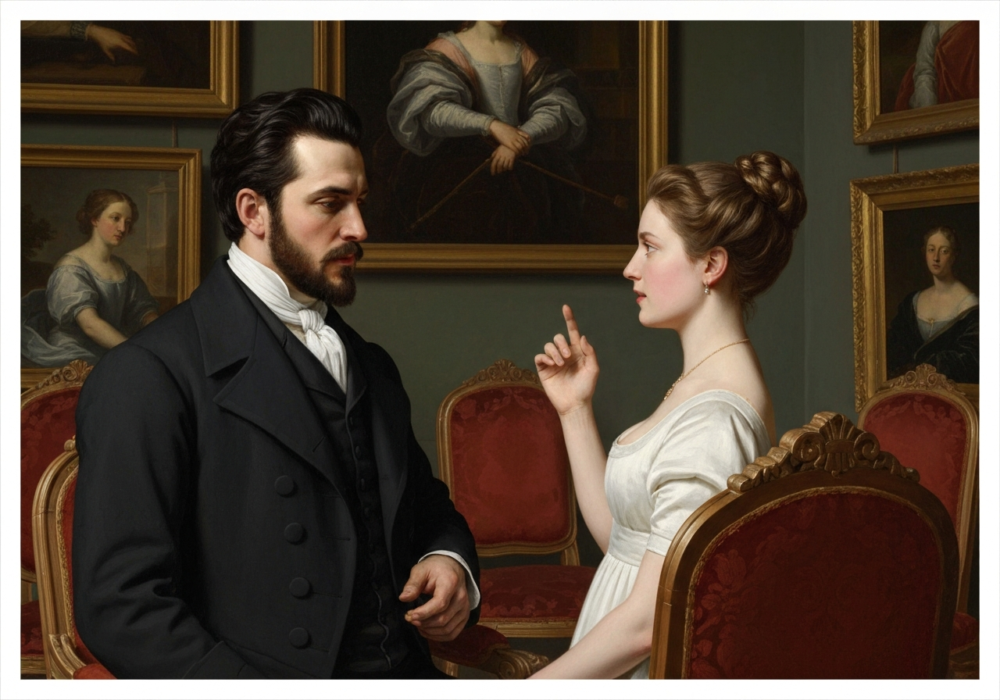
{/* metadata:image-4:end */}

{/* metadata:analysis-5:start */}
<Callout title="Analysis [5]" variant="explanation">
The debate on pride and vanity serves as the intellectual heart of the chapter. Darcy's defense of pride as 'under good regulation' for a superior mind reveals his own self-conception and moral framework. Elizabeth's skeptical smile indicates her rejection of this hierarchy, marking the fundamental clash between their worldviews.
</Callout>
{/* metadata:analysis-5:end */}

“Your examination of Mr. Darcy is over, I presume,” said Miss Bingley;
“and pray what is the result?”

“I am perfectly convinced by it that Mr. Darcy has no defect. He owns it
himself without disguise.”

“No,” said Darcy, “I have made no such pretension. I have faults enough,
but they are not, I hope, of understanding. My temper I dare not vouch
for. It is, I believe, too little yielding; certainly too little for the
convenience of the world. I cannot forget the follies and vices of
others so soon as I ought, nor their offences against myself. My
feelings are not puffed about with every attempt to move them. {/* metadata:quote-6:start */}
<Callout title="Memorable Quote" variant="note">“My temper would perhaps be called resentful. My good opinion once lost is lost for ever.”</Callout>
{/* metadata:quote-6:end */}

{/* metadata:image-5:start */}
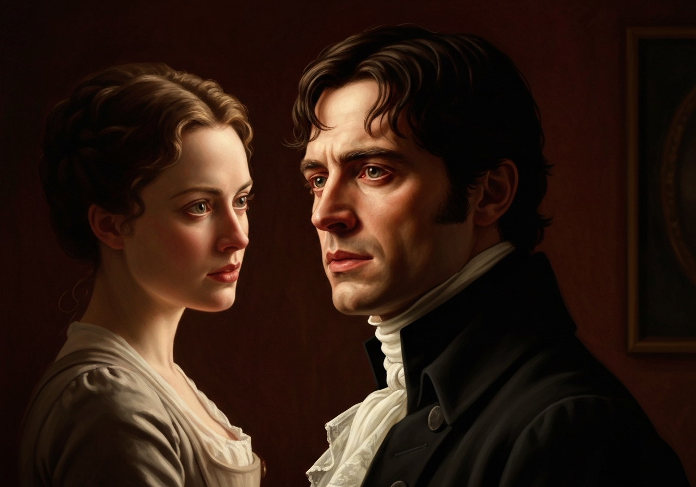

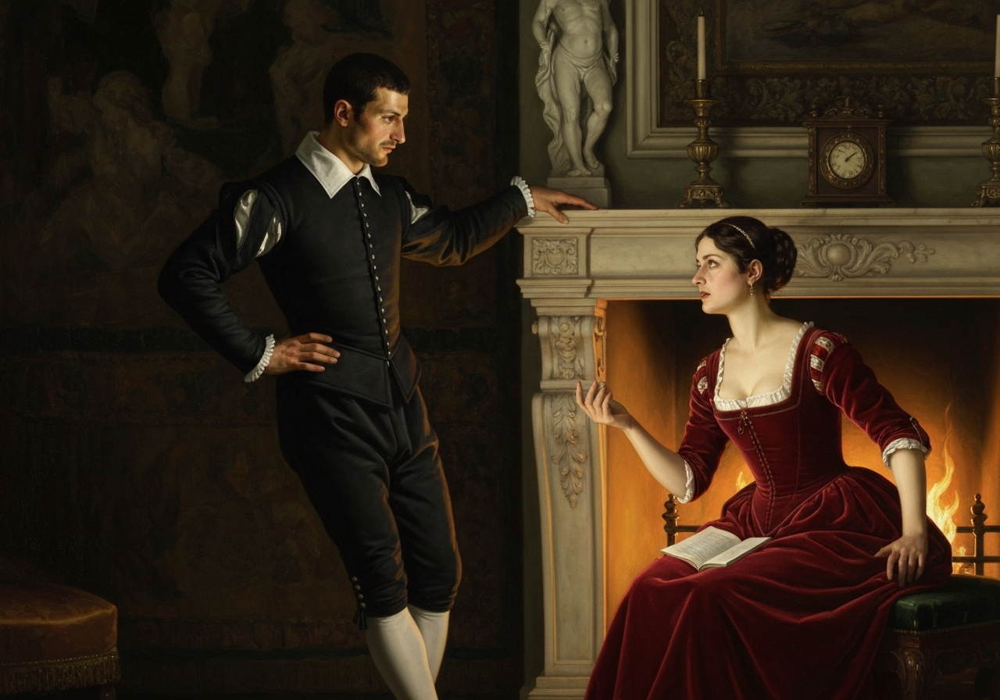
{/* metadata:image-5:end */}

{/* metadata:analysis-6:start */}
<Callout title="Analysis [6]" variant="explanation">
Darcy's admission of an 'implacable resentment'—where his good opinion, once lost, is lost forever—is a crucial character revelation. Elizabeth correctly identifies this as a 'shade in a character,' highlighting the danger of his rigid judgment. This moment defines the 'prejudice' Elizabeth will soon harbor against him based on his own admissions.
</Callout>
{/* metadata:analysis-6:end */}

“_That_ is a failing, indeed!” cried Elizabeth. “Implacable resentment
_is_ a shade in a character. But you have chosen your fault well. I
really cannot _laugh_ at it. You are safe from me.”

{/* metadata:quote-7:start */}
<Callout title="Memorable Quote" variant="note">“There is, I believe, in every disposition a tendency to some particular evil, a natural defect, which not even the best education can overcome.”</Callout>
{/* metadata:quote-7:end */}

“And _your_ defect is a propensity to hate everybody.”

“And yours,” he replied, with a smile, “is wilfully to misunderstand
them.”

“Do let us have a little music,” cried Miss Bingley, tired of a
conversation in which she had no share. “Louisa, you will not mind my
waking Mr. Hurst.”

Her sister made not the smallest objection, and the pianoforte was
opened; and Darcy, after a few moments’ recollection, was not sorry for
it.

{/* metadata:image-6:start */}
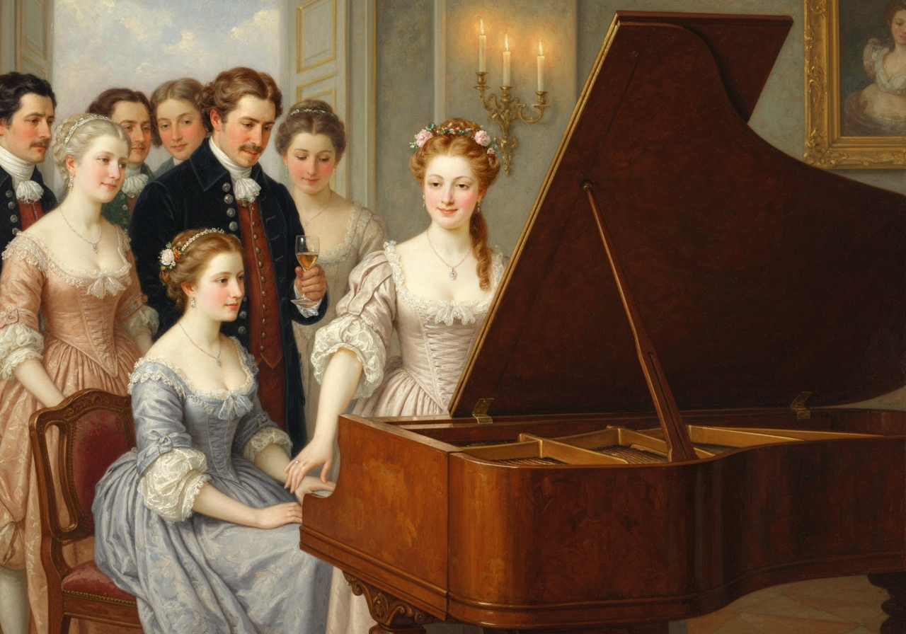

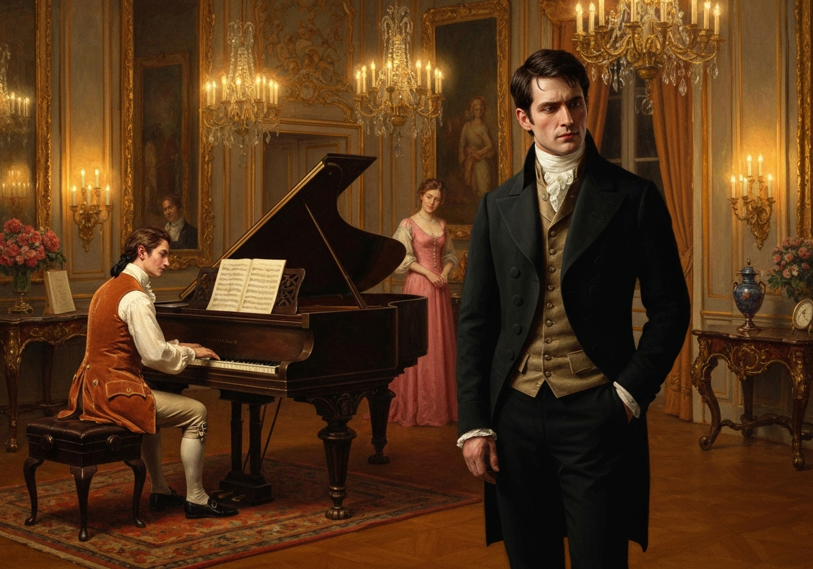
{/* metadata:image-6:end */}

 He began to feel the danger of paying Elizabeth too much attention.

{/* metadata:image-7:start */}
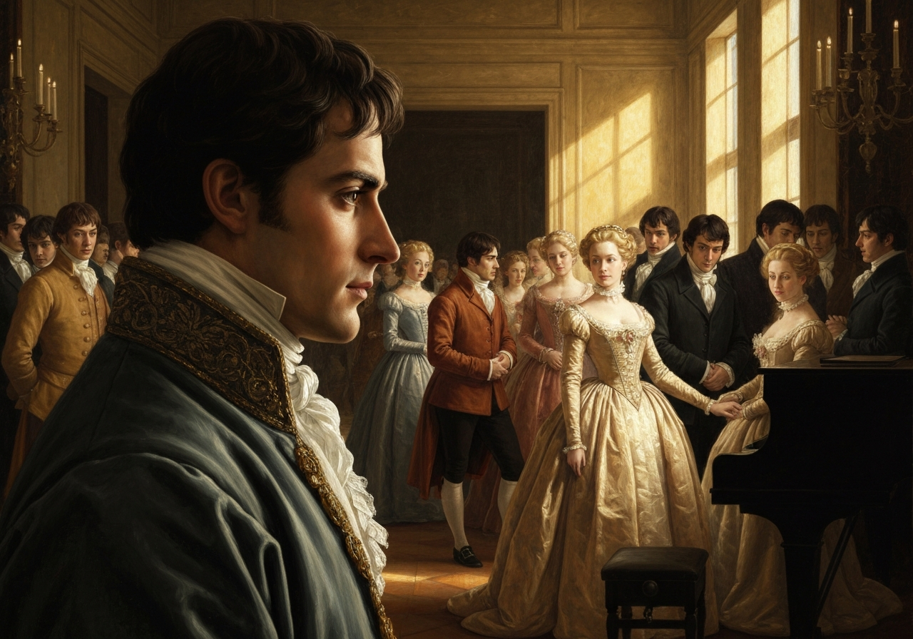

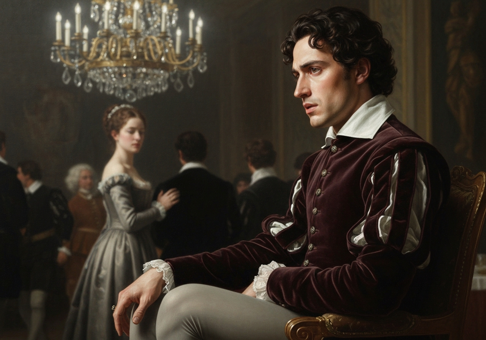
{/* metadata:image-7:end */}

{/* metadata:analysis-7:start */}
<Callout title="Analysis [7]" variant="explanation">
Darcy's sudden desire for music at the chapter's end stems from a self-protective realization. He recognizes the 'danger' of paying Elizabeth too much attention, indicating that his intellectual interest is evolving into something more profound. The music serves as a necessary distraction from a growing attraction that threatens his social and personal order.
</Callout>
{/* metadata:analysis-7:end */}

[Illustration]
