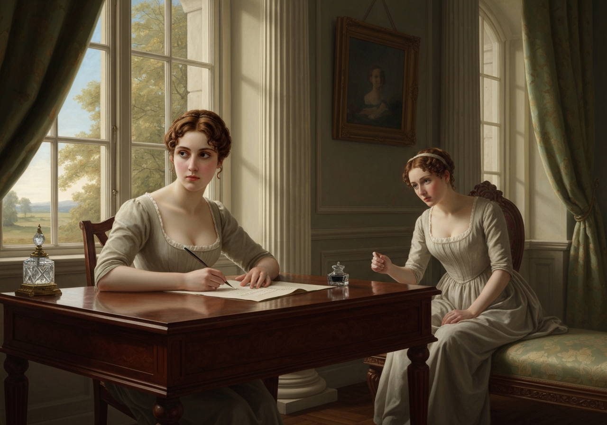
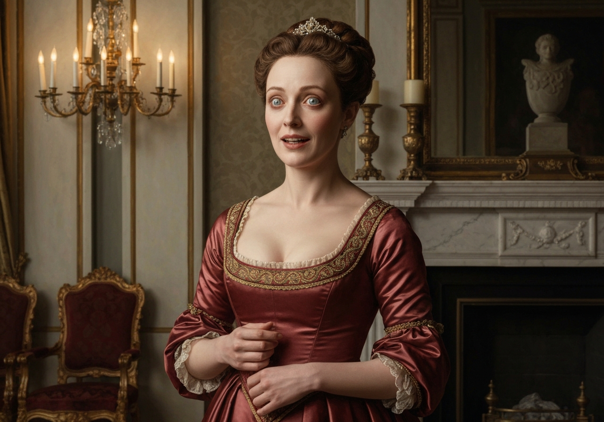
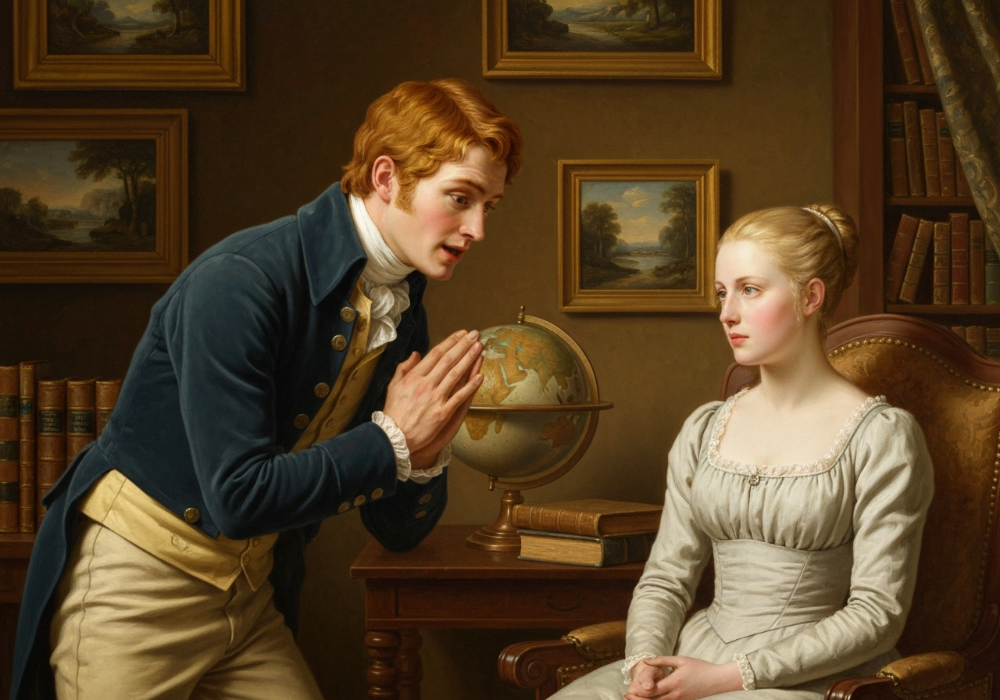
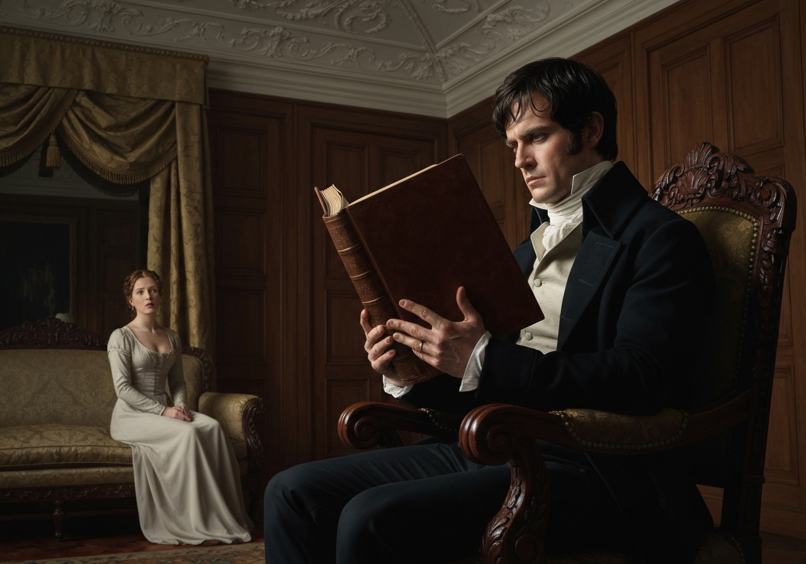
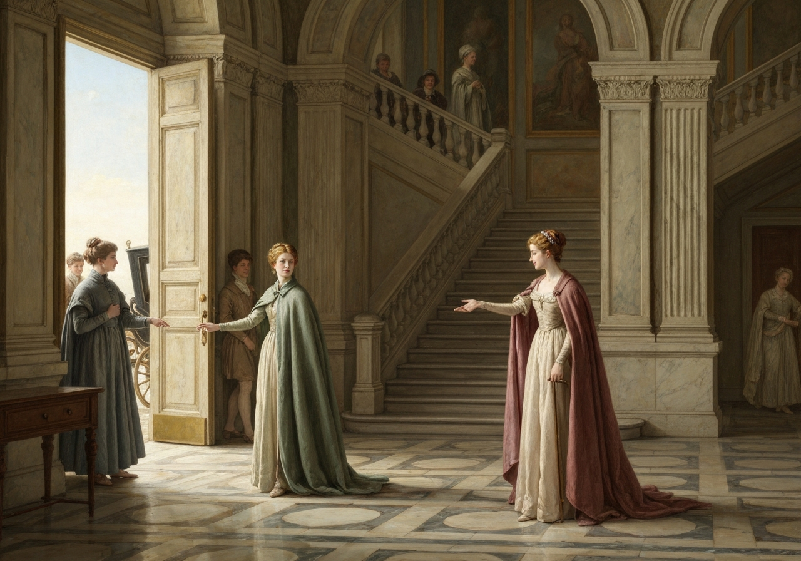
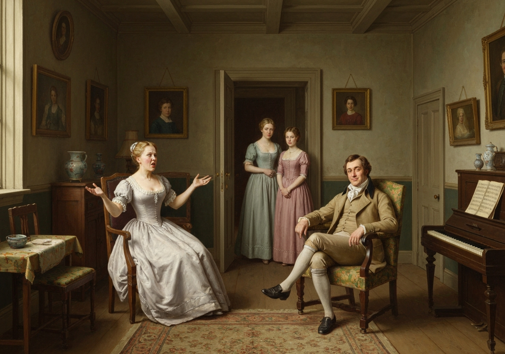
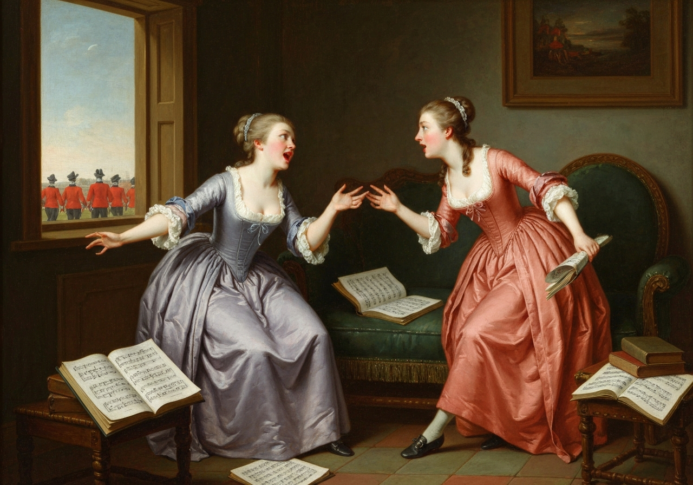

import Callout from '@/components/Callout.astro'

In consequence of an agreement between the sisters, Elizabeth wrote the
next morning to her mother, to beg that the carriage might be sent for
them in the course of the day. But Mrs. Bennet, who had calculated on
her daughters remaining at Netherfield till the following Tuesday, which
would exactly finish Jane’s week, could not bring herself to receive
them with pleasure before. Her answer, therefore, was not propitious, at
least not to Elizabeth’s wishes, for she was impatient to get home.

<Callout title="Memorable Quote" variant="note">Mrs. Bennet sent them word that they could not possibly have the carriage before Tuesday; and in her postscript it was added, that if Mr. Bingley and his sister pressed them to stay longer, she could spare them very well.</Callout>

Against staying longer, however, Elizabeth was positively
resolved--nor did she much expect it would be asked; and fearful, on the
contrary, of being conside as intruding themselves needlessly long, she urged Jane to borrow Mr. Bingley's carriage immediately,
and at length it was settled that their original design of leaving Netherfield
that morning should be mentioned, and the request made.

{/* metadata:image_001:start */}

{/* metadata:image_001:end */}

{/* metadata:analysis_001:start */}
<Callout title="Analysis" variant="explanation">
This opening paragraph establishes the tension between Elizabeth's desire for independence and Mrs. Bennet's social calculations. The mother's manipulation of the carriage availability reveals her desire to prolong her daughters' proximity to Mr. Bingley, prioritizing social advancement over her daughters' comfort and wishes. Elizabeth's proactive resolution to borrow Bingley's carriage demonstrates her assertive character and her awareness of social propriety—she fears being seen as intruding 'needlessly long,' and so the design of leaving that very morning is settled and the request made.
</Callout>
{/* metadata:analysis_001:end */}

The communication excited many professions of concern; and enough was
said of wishing them to stay at least till the following day to work on
Jane; and till the morrow their going was deferred.
<Callout title="Memorable Quote" variant="note">Miss Bingley was then sorry that she had proposed the delay; for her jealousy and dislike of one sister much exceeded her affection for the other.</Callout>

{/* metadata:analysis_002:start */}
<Callout title="Analysis" variant="explanation">
Austen masterfully exposes Miss Bingley's duplicity in this brief passage. Her 'professions of concern' are immediately undermined by the author's omniscient insight into her true motivations: jealousy toward Elizabeth and calculated preference for Jane. The paradox of being 'sorry that she had proposed the delay' illustrates the self-defeating nature of performative politeness when it conflicts with genuine emotion, for her jealousy and dislike of one sister much exceeded her affection for the other.
</Callout>
{/* metadata:analysis_002:end */}

The master of the house heard with real sorrow that they were to go so
soon, and repeatedly tried to persuade Miss Bennet that it would not be
safe for her--that she was not enough recovered; but Jane was firm where
she felt herself to be right.

{/* metadata:image_003:start */}

{/* metadata:image_003:end */}

{/* metadata:analysis_003:start */}
<Callout title="Analysis" variant="explanation">
Bingley's character emerges through genuine contrast with his sister's artifice. His 'real sorrow' and repeated entreaties for Jane to stay reveal authentic feeling untainted by social maneuvering. Jane's firmness in her decision underscores her moral principle—she will not overstay her welcome despite personal inclination or romantic possibility—and the narrative affirms this resolve by noting that Jane was firm where she felt herself to be right.
</Callout>
{/* metadata:analysis_003:end */}

<Callout title="Memorable Quote" variant="note">To Mr. Darcy it was welcome intelligence: Elizabeth had been at Netherfield long enough. She attracted him more than he liked; and Miss Bingley was uncivil to _her_ and more teasing than usual to himself.</Callout>
He wisely resolved to be particularly careful that no sign of admiration
should _now_ escape him--nothing that could elevate her with the hope of
influencing his felicity; sensible that, if such an idea had been
suggested, his behaviour during the last day must have material weight
in confirming or crushing it.

<Callout title="Memorable Quote" variant="note">Steady to his purpose, he scarcely spoke ten words to her through the whole of Saturday: and though they were at one time left by themselves for half an hour, he adhered most conscientiously to his book, and would not even look at her.</Callout>

{/* metadata:image_004:start */}

{/* metadata:image_004:end */}

{/* metadata:analysis_004:start */}
<Callout title="Analysis" variant="explanation">
This pivotal revelation marks Darcy's internal conflict becoming conscious strategy. His attraction to Elizabeth 'more than he liked' signals dangerous emotional vulnerability from his perspective. His resolution to suppress all 'sign of admiration' represents the defining tension of their relationship: authentic feeling versus social prudence. The extended silence and book-reading during their half-hour alone constitute a performative withdrawal that ironically reveals rather than conceals his interest, as he adhered most conscientiously to his book, and would not even look at her.
</Callout>
{/* metadata:analysis_004:end */}

On Sunday, after morning service, the separation, so agreeable to almost
all, took place.
<Callout title="Memorable Quote" variant="note">Miss Bingley's civility to Elizabeth increased at last very rapidly, as well as her affection for Jane; and when they parted, after assuring the latter of the pleasure it would always give her to see her either at Longbourn or Netherfield, and embracing her most tenderly, she even shook hands with the former.</Callout>
Elizabeth took leave of the whole party in the liveliest spirits.

{/* metadata:analysis_005:start */}
<Callout title="Analysis" variant="explanation">
The departure scene operates through layers of irony. 'Separation, so agreeable to almost all' encompasses Miss Bingley's relief, Darcy's self-preservation, and Elizabeth's oblivious cheerfulness. Miss Bingley's sudden civility—culminating in the condescension of a handshake—reveals the hollow performance of good breeding. Elizabeth took leave of the whole party in the liveliest spirits, a detail that contrasts sharply with Darcy's internal turmoil and establishes the dramatic irony that structures their relationship.
</Callout>
{/* metadata:analysis_005:end */}

They were not welcomed home very cordially by their mother. Mrs. Bennet
wondered at their coming, and thought them very wrong to give so much
trouble, and was sure Jane would have caught cold again. But their
father, though very laconic in his expressions of pleasure, was really
glad to see them; he had felt their importance in the family circle. The
evening conversation, when they were all assembled, had lost much of its
animation, and almost all its sense, by the absence of Jane and
Elizabeth.

{/* metadata:image_006:start */}

{/* metadata:image_006:end */}

{/* metadata:analysis_006:start */}
<Callout title="Analysis" variant="explanation">
The return to Longbourn presents a stark comparative study of family dynamics. Mrs. Bennet's lack of 'cordial' welcome prioritizes her own inconvenience and social schemes over maternal affection. Mr. Bennet's laconic but genuine pleasure provides emotional authenticity through economic expression. The observation that the evening conversation had lost much of its animation, and almost all its sense, by the absence of Jane and Elizabeth implicitly values the two elder sisters' contribution while critiquing the remaining household's intellectual poverty.
</Callout>
{/* metadata:analysis_006:end */}

<Callout title="Memorable Quote" variant="note">They found Mary, as usual, deep in the study of thorough bass and human nature; and had some new extracts to admire and some new observations of threadbare morality to listen to.</Callout>
Catherine and Lydia had information
for them of a different sort. Much had been done, and much had been said
in the regiment since the preceding Wednesday; several of the officers
had dined lately with their uncle; a private had been flogged; and it
had actually been hinted that Colonel Forster was going to be married.

{/* metadata:image_007:start */}

{/* metadata:image_007:end */}

{/* metadata:analysis_007:start */}
<Callout title="Analysis" variant="explanation">
The closing tableau establishes the thematic chasm between Netherfield and Longbourn. Mary's pedantic pursuits—thorough bass and human nature studied as equivalent academic subjects—represent failed intellectual aspiration. The 'information' from Kitty and Lydia reduces military affairs to gossip and romance: a flogging and a potential marriage carry equal weight in their shallow social calculus. The chapter ends on the hint that Colonel Forster was going to be married, foreshadowing future developments while emphasizing the younger sisters' preoccupation with officers.
</Callout>
{/* metadata:analysis_007:end */}
