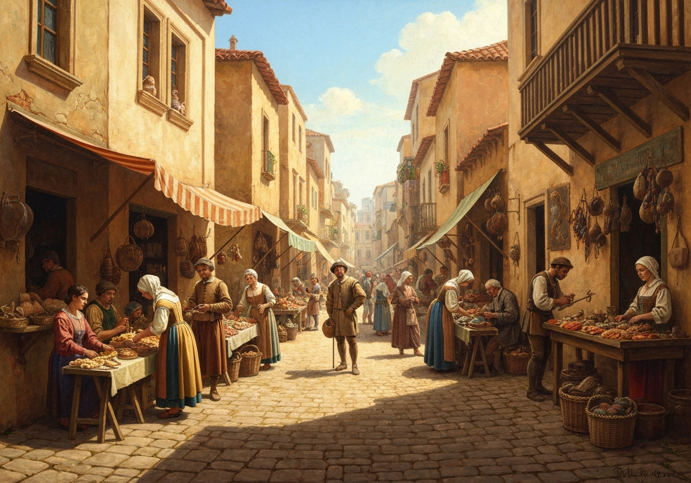
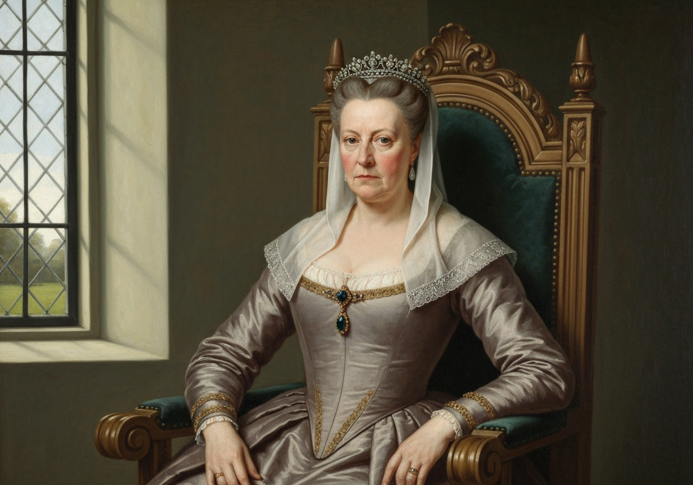
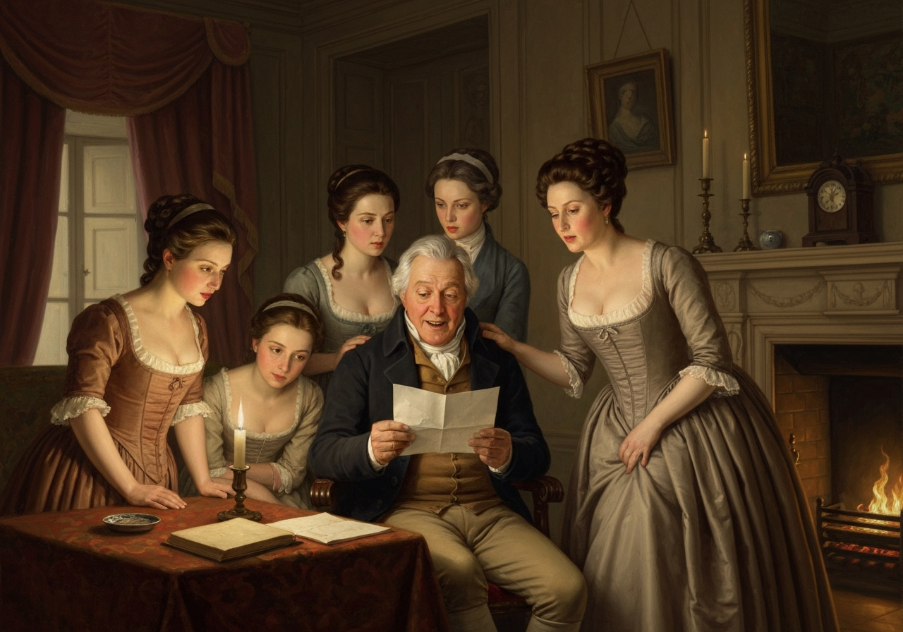
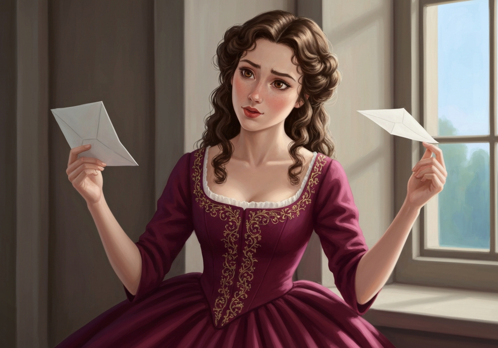
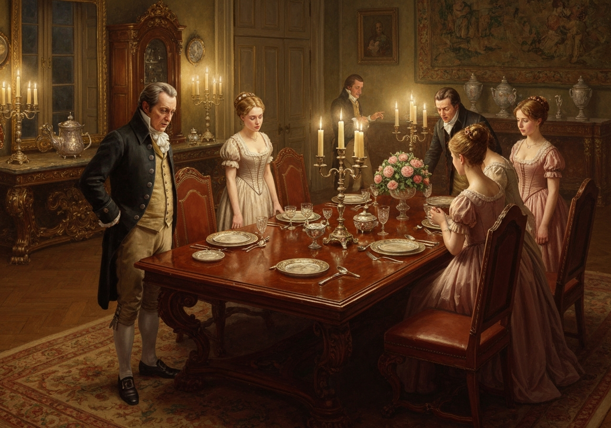
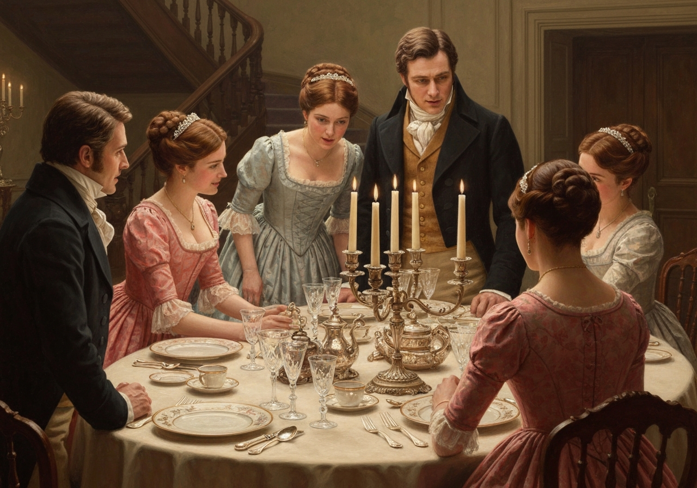

import Callout from '@/components/Callout.astro'

“I hope, my dear,” said Mr. Bennet to his wife, as they were at
breakfast the next morning, “that you have ordered a good dinner to-day,
because I have reason to expect an addition to our family party.”

“Who do you mean, my dear? I know of nobody that is coming, I am sure,
unless Charlotte Lucas should happen to call in; and I hope _my_ dinners
are good enough for her. I do not believe she often sees such at home.”

“The person of whom I speak is a gentleman and a stranger.”

Mrs. Bennet’s eyes sparkled.
<Callout title="Memorable Quote" variant="note">A gentleman and a stranger! It is Mr. Bingley, I am sure.</Callout>
“Why, Jane--you never dropped a word of this--you sly
thing! Well, I am sure I shall be extremely glad to see Mr. Bingley.
But--good Lord! how unlucky! there is not a bit of fish to be got
to-day. Lydia, my love, ring the bell. I must speak to Hill this
moment.”

{/* metadata:img_001:start */}

{/* metadata:img_001:end */}

“It is _not_ Mr. Bingley,” said her husband; “it is a person whom I
never saw in the whole course of my life.”

This roused a general astonishment; and he had the pleasure of being
eagerly questioned by his wife and five daughters at once.

After amusing himself some time with their curiosity, he thus
explained:--“About a month ago I received this letter, and about a
fortnight ago I answered it; for I thought it a case of some delicacy,
and requiring early attention.
{/* metadata:quote_003:start */}
<Callout title="Memorable Quote" variant="note">It is from my cousin, Mr. Collins, who, when I am dead, may turn you all out of this house as soon as he pleases.</Callout>
{/* metadata:quote_003:end */}

{/* metadata:analysis_001:start */}
<Callout title="Analysis" variant="explanation">
Mr. Bennet's teasing announcement at breakfast establishes his characteristic humor—deliberately tantalizing his wife and daughters with news of a male visitor, only to reveal it is not the hoped-for Mr. Bingley but the dreaded Mr. Collins. His playful withholding of information ('After amusing himself some time with their curiosity') is a form of domestic theater, casting himself as director of the family's emotional responses. This opener demonstrates Austen's mastery of domestic comedy and dramatic irony, using the breakfast table as a stage for the novel's central tensions.
</Callout>
{/* metadata:analysis_001:end */}

“Oh, my dear,” cried his wife, “I cannot bear to hear that mentioned.
Pray do not talk of that odious man. I do think it is the hardest thing
in the world, that your estate should be entailed away from your own
children; and I am sure, if I had been you, I should have tried long ago
to do something or other about it.”

Jane and Elizabeth attempted to explain to her the nature of an entail.
They had often attempted it before: but it was a subject on which Mrs.
Bennet was beyond the reach of reason; and she continued to rail
bitterly against the cruelty of settling an estate away from a family of
five daughters, in favour of a man whom nobody cared anything about.

{/* metadata:analysis_002:start */}
<Callout title="Analysis" variant="explanation">
The introduction of the entailment conflict is central to the novel's premise—the five Bennet daughters face disinheritance because the estate is entailed to the male line. Mrs. Bennet's passionate but irrational response ('I should have tried long ago to do something or other about it') reveals her helplessness within legal systems she cannot comprehend. That Jane and Elizabeth have 'often attempted' to explain the entail before underscores how thoroughly this legal injustice has shaped the family's daily consciousness.
</Callout>
{/* metadata:analysis_002:end */}

“It certainly is a most iniquitous affair,” said Mr. Bennet; “and
nothing can clear Mr. Collins from the guilt of inheriting Longbourn.
But if you will listen to his letter, you may, perhaps, be a little
softened by his manner of expressing himself.”

“No, that I am sure I shall not: and I think it was very impertinent of
him to write to you at all, and very hypocritical. I hate such false
friends. Why could not he keep on quarrelling with you, as his father
did before him?”

“Why, indeed, he does seem to have had some filial scruples on that
head, as you will hear.”

“Dear Sir,

     “The disagreement subsisting between yourself and my late honoured
     father always gave me much uneasiness; and, since I have had the
     misfortune to lose him, I have frequently wished to heal the
     breach: but, for some time, I was kept back by my own doubts,
     fearing lest it might seem disrespectful to his memory for me to be
     on good terms with anyone with whom it had always pleased him to be
     at variance.”--‘There, Mrs. Bennet.’--“My mind, however, is now
     made up on the subject; for, having received ordination at Easter,
     I have been so fortunate as to be distinguished by the patronage of
     the Right Honourable Lady Catherine de Bourgh, widow of Sir Lewis
     de Bourgh, whose bounty and beneficence has preferred me to the
     valuable rectory of this parish, where it shall be my earnest
     endeavour to demean myself with grateful respect towards her
     Ladyship, and be ever ready to perform those rites and ceremonies
     which are instituted by the Church of England.

{/* metadata:img_003:start */}

{/* metadata:img_003:end */}

 As a clergyman,
     moreover, I feel it my duty to promote and establish the blessing
     of peace in all families within the reach of my influence; and on
     these grounds I flatter myself that my present overtures of
     good-will are highly commendable, and that the circumstance of my
     being next in the entail of Longbourn estate will be kindly
     overlooked on your side, and not lead you to reject the offered olive branch.
<Callout title="Memorable Quote" variant="note">I cannot be otherwise than concerned at being the means of injuring your amiable daughters, and beg leave to apologize for it, as well as to assure you of my readiness to make them every possible amends; but of this hereafter.</Callout>
     If you should have no objection to receive me into your house, I propose myself
     the satisfaction of waiting on you and your family, Monday,
     November 18th, by four o’clock, and shall probably trespass on your
     hospitality till the Saturday se’nnight following, which I can do
     without any inconvenience, as Lady Catherine is far from objecting
     to my occasional absence on a Sunday, provided that some other
     clergyman is engaged to do the duty of the day. I remain, dear sir,
     with respectful compliments to your lady and daughters, your
     well-wisher and friend,

“WILLIAM COLLINS.”

{/* metadata:img_002:start */}

{/* metadata:img_002:end */}

{/* metadata:analysis_003:start */}
<Callout title="Analysis" variant="explanation">
Mr. Collins's letter is a masterpiece of Austenian satire, exposing a character simultaneously self-important and self-abasing. His groveling deference to Lady Catherine de Bourgh ('grateful respect towards her Ladyship') combined with his pomposity creates a study in social climbing and obsequiousness. The letter's elaborate syntax and self-congratulatory reasoning—framing his inheritance of Longbourn as a burden he nobly bears—reveals a man entirely without self-awareness.
</Callout>
{/* metadata:analysis_003:end */}

“At four o’clock, therefore, we may expect this peace-making gentleman,”
said Mr. Bennet, as he folded up the letter. “He seems to be a most
conscientious and polite young man, upon my word; and, I doubt not, will
prove a valuable acquaintance, especially if Lady Catherine should be so
indulgent as to let him come to us again.”

“There is some sense in what he says about the girls, however; and, if
he is disposed to make them any amends, I shall not be the person to
discourage him.”

“Though it is difficult,” said Jane, “to guess in what way he can mean
to make us the atonement he thinks our due, the wish is certainly to his
credit.”

Elizabeth was chiefly struck with his extraordinary deference for Lady
Catherine, and his kind intention of christening, marrying, and burying
his parishioners whenever it were required.

“He must be an oddity, I think,” said she. “I cannot make him out. There
is something very pompous in his style. And what can he mean by
apologizing for being next in the entail? We cannot suppose he would
help it, if he could. Can he be a sensible man, sir?”

{/* metadata:img_004:start */}

{/* metadata:img_004:end */}

“No, my dear; I think not. I have great hopes of finding him quite the
reverse. {/* metadata:quote_005:start */}
<Callout title="Memorable Quote" variant="note">There is a mixture of servility and self-importance in his letter which promises well. I am impatient to see him.</Callout>
{/* metadata:quote_005:end */}

{/* metadata:analysis_005:start */}
<Callout title="Analysis" variant="explanation">
Mr. Bennet's anticipation of Mr. Collins's absurdity ('There is a mixture of servility and self-importance in his letter which promises well') establishes the father-daughter bond between him and Elizabeth, united in their appreciation of the ridiculous. His declaration 'I am impatient to see him' frames the coming visit as entertainment rather than threat, a coping strategy that reveals both his wit and his emotional detachment from the family's precarious situation. This shared ironic sensibility between father and second daughter is one of the novel's most affectionate relationships.
</Callout>
{/* metadata:analysis_005:end */}

“In point of composition,” said Mary, “his letter does not seem
defective. The idea of the olive branch perhaps is not wholly new, yet I
think it is well expressed.”

To Catherine and Lydia neither the letter nor its writer were in any
degree interesting. It was next to impossible that their cousin should
come in a scarlet coat, and it was now some weeks since they had
received pleasure from the society of a man in any other colour. As for
their mother, Mr. Collins’s letter had done away much of her ill-will,
and she was preparing to see him with a degree of composure which
astonished her husband and daughters.

Mr. Collins was punctual to his time, and was received with great
politeness by the whole family. Mr. Bennet indeed said little; but the
ladies were ready enough to talk, and Mr. Collins seemed neither in need
of encouragement, nor inclined to be silent himself.

{/* metadata:analysis_004:start */}
<Callout title="Analysis" variant="explanation">
The Bennet daughters' varied reactions to the letter reveal their distinct personalities: Jane sees good intentions; Elizabeth critiques his servility; Mary evaluates composition; Kitty and Lydia focus only on whether he wears a red coat. This showcases Austen's skill in characterization through response, using a single document as a lens that refracts each character's values and preoccupations. The contrast between Elizabeth's sharp critical reading and Mary's pedantic praise of the letter's 'composition' is particularly pointed.
</Callout>
{/* metadata:analysis_004:end */}

 {/* metadata:quote_006:start */}
<Callout title="Memorable Quote" variant="note">He was a tall, heavy-looking young man of five-and-twenty. His air was grave and stately, and his manners were very formal.</Callout>
{/* metadata:quote_006:end */} He had not been long seated
before he complimented Mrs. Bennet on having so fine a family of
daughters, said he had heard much of their beauty, but that, in this
instance, fame had fallen short of the truth; and added, that he did not
doubt her seeing them all in due time well disposed of in marriage. This
gallantry was not much to the taste of some of his hearers; but Mrs.
Bennet, who quarrelled with no compliments, answered most readily,--

“You are very kind, sir, I am sure; and I wish with all my heart it may
prove so; for else they will be destitute enough. Things are settled so
oddly.”

“You allude, perhaps, to the entail of this estate.”

“Ah, sir, I do indeed. It is a grievous affair to my poor girls, you
must confess. Not that I mean to find fault with _you_, for such things,
I know, are all chance in this world. There is no knowing how estates
will go when once they come to be entailed.”

“I am very sensible, madam, of the hardship to my fair cousins, and
could say much on the subject, but that I am cautious of appearing
forward and precipitate. But I can assure the young ladies that I come
prepared to admire them. At present I will not say more, but, perhaps,
when we are better acquainted----”

He was interrupted by a summons to dinner; and the girls smiled on each
other. They were not the only objects of Mr. Collins’s admiration. {/* metadata:quote_007:start */}
<Callout title="Memorable Quote" variant="note">The hall, the dining-room, and all its furniture, were examined and praised; and his commendation of everything would have touched Mrs. Bennet's heart, but for the mortifying supposition of his viewing it all as his own future property.</Callout>

{/* metadata:img_006:start */}

{/* metadata:img_006:end */}

{/* metadata:analysis_007:start */}
<Callout title="Analysis" variant="explanation">
The chapter culminates in Collins's inspection of Longbourn with 'mortifying' proprietorial interest—admiring the rooms, furniture, and dinner as if inheriting them already. His apology for suggesting the Bennet daughters cook the dinner exposes class assumptions and his deep insensitivity, as he spends a full quarter-hour in performative contrition that serves his own self-image more than it soothes Mrs. Bennet. The word 'mortifying' is carefully chosen: Collins's admiration is genuine, yet it wounds precisely because it reveals how thoroughly he has already mentally possessed what the Bennets still call home.
</Callout>
{/* metadata:analysis_007:end */}

The dinner, too, in its turn, was highly admired;
and he begged to know to which of his fair cousins the excellence of its
cookery was owing. But here he was set right by Mrs. Bennet, who assured
him, with some asperity, that they were very well able to keep a good
cook, and that her daughters had nothing to do in the kitchen. He begged
pardon for having displeased her. In a softened tone she declared
herself not at all offended; but he continued to apologize for about a
quarter of an hour.

{/* metadata:img_007:start */}

{/* metadata:img_007:end */}

{/* metadata:analysis_006:start */}
<Callout title="Analysis" variant="explanation">
Mr. Collins's egotistical compliment to Mrs. Bennet—praising her daughters' beauty while noting the entail will displace them—demonstrates his complete lack of tact and social grace. His inability to perceive offense reveals profound self-absorption, as he moves seamlessly from flattery to the reminder of dispossession without registering the cruelty of the juxtaposition. The dinner scene compounds this when he implies the daughters might have cooked the meal, a class insult that Mrs. Bennet corrects 'with some asperity.'
</Callout>
{/* metadata:analysis_006:end */}
