import Callout from '@/components/Callout.astro'

[Illustration]

During dinner, Mr. {/* metadata:quote_001:start */}
<Callout title="Memorable Quote" variant="note">Mr. Bennet scarcely spoke at all; but when the servants were withdrawn, he thought it time to have some conversation with his guest, and therefore started a subject in which he expected him to shine, by observing that he seemed very fortunate in his patroness.</Callout>
{/* metadata:quote_001:end */} Lady
Catherine de Bourgh’s attention to his wishes, and consideration for his
comfort, appeared very remarkable. Mr. Bennet could not have chosen
better. Mr. Collins was eloquent in her praise.

{/* metadata:img_001:start */}
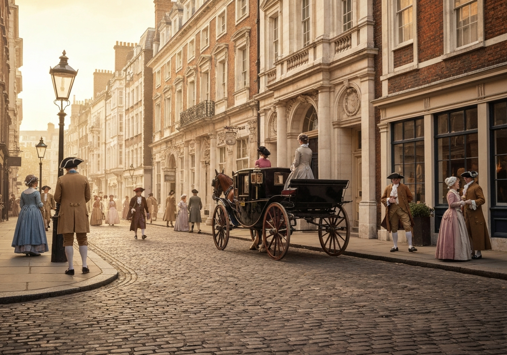

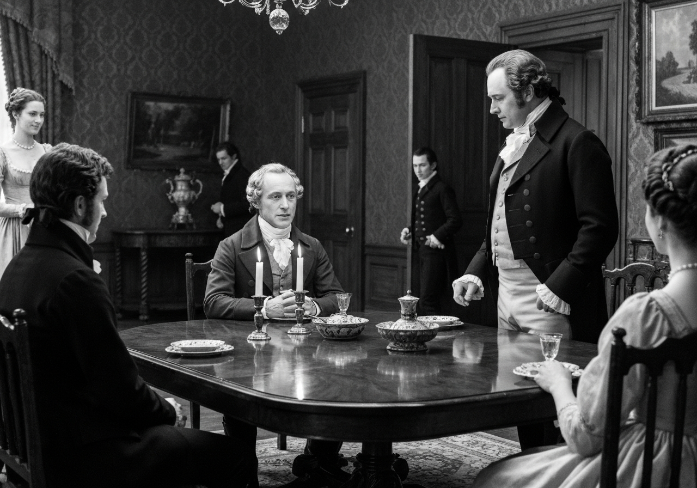
{/* metadata:img_001:end */}

{/* metadata:analysis_001:start */}
<Callout title="Analysis" variant="explanation">
Mr. Bennet's strategic silence during dinner reveals his characteristically manipulative approach to social interactions. By waiting until the servants withdraw, he creates an intimate setting designed to expose his guest's absurdity. His calculated choice of subject matter—Lady Catherine de Bourgh—demonstrates his understanding that sycophants cannot resist opportunities for elaborate self-congratulation disguised as praise of their patrons.
</Callout>
{/* metadata:analysis_001:end */}

 The subject elevated him
to {/* metadata:quote_002:start */}
<Callout title="Memorable Quote" variant="note">The subject elevated him to more than usual solemnity of manner; and with a most important aspect he protested that he had never in his life witnessed such behaviour in a person of rank.</Callout>
{/* metadata:quote_002:end */} and with a most important aspect
he protested that he had never in his life witnessed such behaviour in a
person of rank--such affability and condescension, as he had himself
experienced from Lady Catherine. She had been graciously pleased to
approve of both the discourses which he had already had the honour of
preaching before her. She had also asked him twice to dine at Rosings,
and had sent for him only the Saturday before, to make up her pool of
quadrille in the evening. Lady Catherine was reckoned proud by many
people, he knew, but _he_ had {/* metadata:quote_003:start */}
<Callout title="Memorable Quote" variant="note">Lady Catherine was reckoned proud by many people, he knew, but he had never seen anything but affability in her.</Callout>
{/* metadata:quote_003:end */} in her.
She had always spoken to him as she would to any other gentleman; she
made not the smallest objection to his joining in the society of the
neighbourhood, nor to his leaving his parish occasionally for a week or
two to visit his relations. She had even condescended to advise him to
marry as soon as he could, provided he chose with discretion; and had
once paid him a visit in his humble parsonage, where she had perfectly
approved all the alterations he had been making, and had even vouchsafed
to suggest some herself,--some shelves in the closets upstairs.

{/* metadata:img_002:start */}
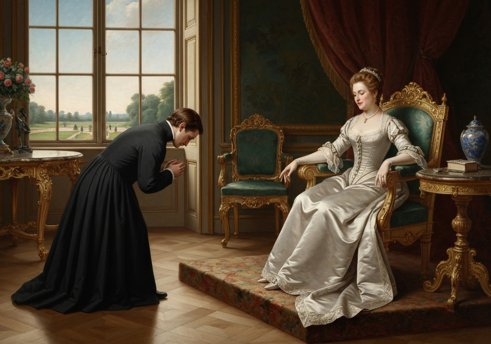

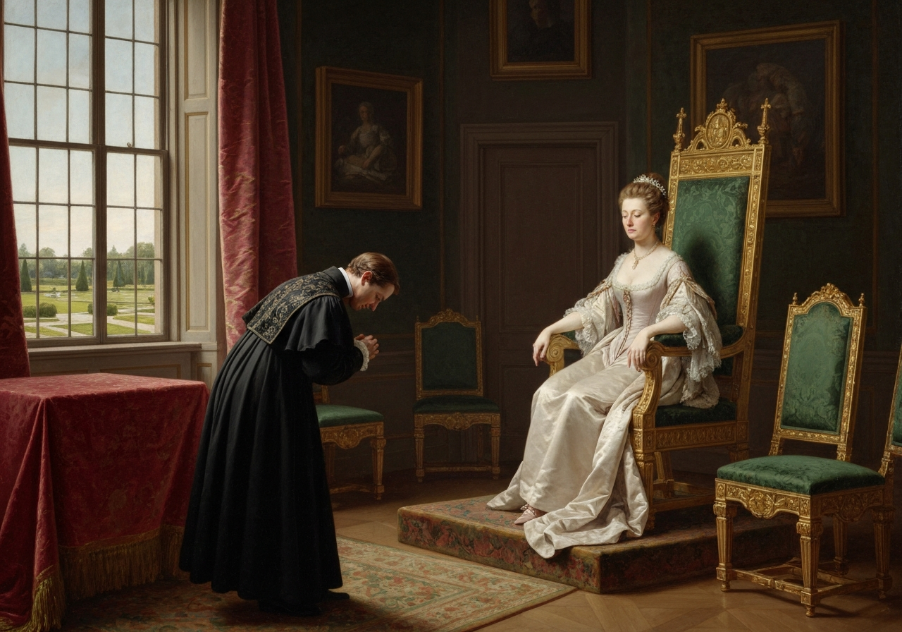
{/* metadata:img_002:end */}

{/* metadata:analysis_002:start */}
<Callout title="Analysis" variant="explanation">
Mr. Collins's excessive deference illustrates Austen's critique of the clergyman class and their obsequious relationships with aristocratic patrons. His description of Lady Catherine's 'affability'—which includes approving his sermons, inviting him to dine, and allowing him to play quadrille—reveals how desperately the lower gentry cling to any attention from their social superiors. The irony that others find her proud while he sees only kindness exposes his pathetic need for validation.
</Callout>
{/* metadata:analysis_002:end */}

“That is all very proper and civil, I am sure,” said Mrs. Bennet, “and I
dare say she is a very agreeable woman. It is a pity that great ladies
in general are not more like her. Does she live near you, sir?”

“The garden in which stands my humble abode is separated only by a lane
from Rosings Park, her Ladyship’s residence.”

“I think you said she was a widow, sir? has she any family?”

“She has one only daughter, the heiress of Rosings, and of very
extensive property.”

“Ah,” cried Mrs. Bennet, shaking her head, “then she is better off than
many girls.

{/* metadata:img_003:start */}
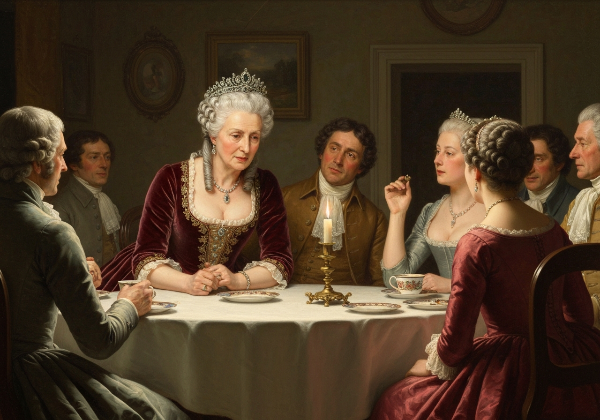

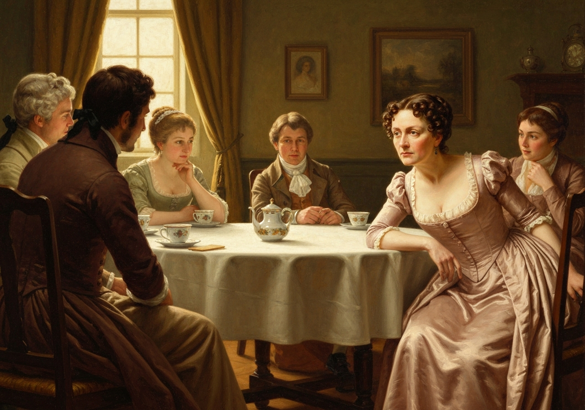
{/* metadata:img_003:end */}

{/* metadata:analysis_003:start */}
<Callout title="Analysis" variant="explanation">
Mrs. Bennet's mercenary interest in Lady Catherine transforms the conversation toward matrimonial opportunities. Her immediate pivot from the widow's character to questions about distance, family, and the daughter's eligibility demonstrates the obsession with advantageous marriages that drives the novel's plot. Her exclamation upon learning Miss de Bourgh is the sole heiress of Rosings—'then she is better off than many girls'—reveals her own aspirations and the transactional lens through which she views all female prospects.
</Callout>
{/* metadata:analysis_003:end */}

 And what sort of young lady is she? Is she handsome?”

“She is a most charming young lady, indeed. {/* metadata:quote_004:start */}
<Callout title="Memorable Quote" variant="note">Lady Catherine herself says that, in point of true beauty, Miss de Bourgh is far superior to the handsomest of her sex; because there is that in her features which marks the young woman of distinguished birth.</Callout>
{/* metadata:quote_004:end */} She is unfortunately of a sickly
constitution, which has prevented her making that progress in many
accomplishments which she could not otherwise have failed of, as I am
informed by the lady who superintended her education, and who still
resides with them. But she is perfectly amiable, and often condescends
to drive by my humble abode in her little phaeton and ponies.”

{/* metadata:img_004:start */}
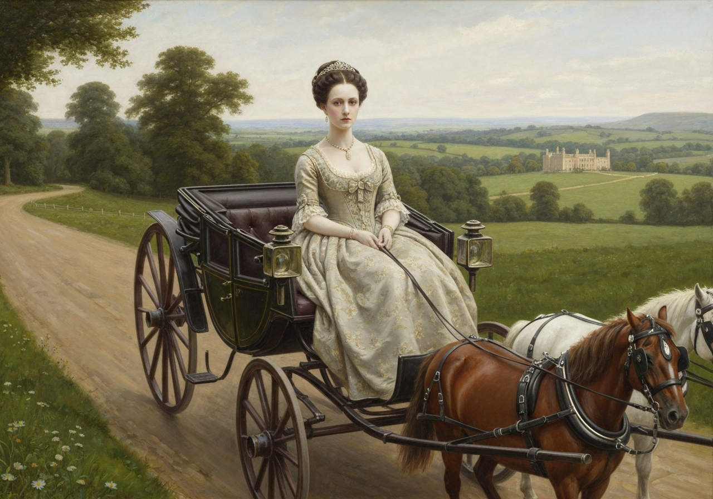

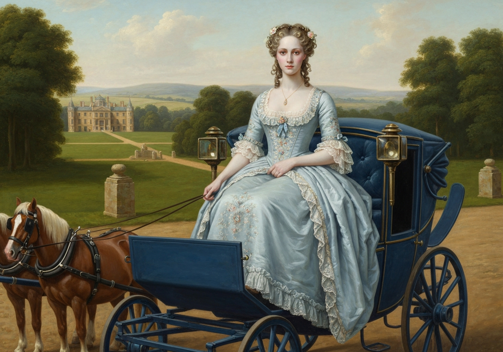
{/* metadata:img_004:end */}

{/* metadata:analysis_004:start */}
<Callout title="Analysis" variant="explanation">
The description of Miss de Bourgh as 'far superior to the handsomest of her sex' through the lens of 'true beauty' associated with 'distinguished birth' satirizes the aristocratic mythology of innate superiority. Mr. Collins's unthinking repetition of Lady Catherine's propaganda about her daughter—combined with the reality of the girl's sickly constitution and limited accomplishments—exposes the gap between aristocratic pretension and actual merit. That Miss de Bourgh's chief social appearance is to condescend to drive past his humble abode in her little phaeton and ponies only deepens the comedy of his reverence.
</Callout>
{/* metadata:analysis_004:end */}

“Has she been presented? I do not remember her name among the ladies at
court.”

“Her indifferent state of health unhappily prevents her being in town;
and by that means, as I told Lady Catherine myself one day, has deprived
the British Court of its brightest ornament. Her Ladyship seemed pleased
with the idea; and you may imagine that I am happy on every occasion to
offer those little delicate compliments which are always acceptable to
ladies. I have more than once observed to Lady Catherine, that her
charming daughter seemed born to be a duchess; and that the most
elevated rank, instead of giving her consequence, would be adorned by
her. These are the kind of little things which please her Ladyship, and
it is a sort of attention which I conceive myself peculiarly bound to
pay.”

“You judge very properly,” said Mr. Bennet; “and it is happy for you
that you possess the {/* metadata:quote_005:start */}
<Callout title="Memorable Quote" variant="note">You judge very properly, said Mr. Bennet; and it is happy for you that you possess the talent of flattering with delicacy.</Callout>
{/* metadata:quote_005:end */} May I ask
whether these pleasing attentions proceed from the impulse of the
moment, or are the result of previous study?”

“They arise chiefly from what is passing at the time; and though I
sometimes amuse myself with suggesting and arranging such little elegant
compliments as may be adapted to ordinary occasions, I always wish to
give them as unstudied an air as possible.”

{/* metadata:img_005:start */}
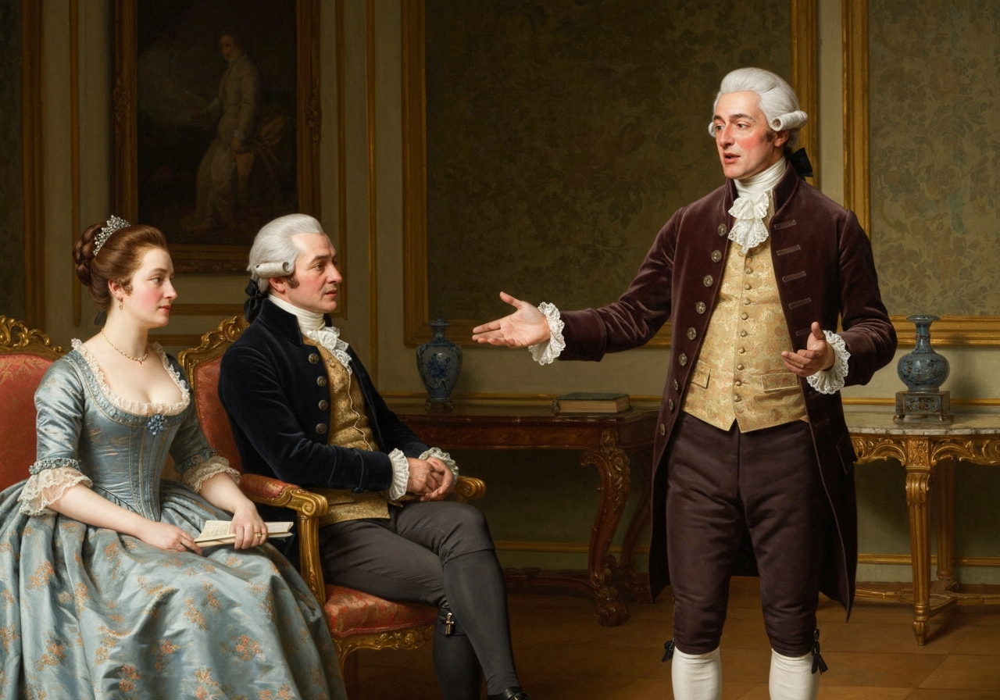

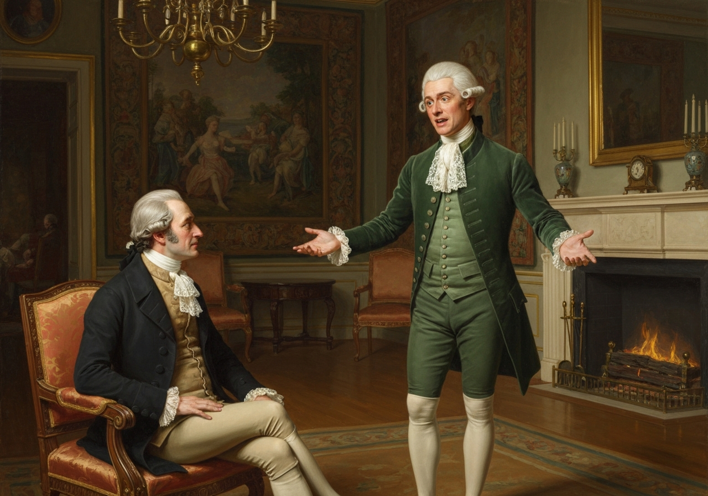
{/* metadata:img_005:end */}

{/* metadata:analysis_005:start */}
<Callout title="Analysis" variant="explanation">
Mr. Collins's mastery of 'delicate compliments' represents Austen's commentary on the art of flattery among the aspiring classes. His admission that he prepares compliments while attempting to give them 'an unstudied air' reveals the calculated nature of social climbing. Mr. Bennet's dry question about whether these attentions proceed from 'the impulse of the moment' or 'previous study' demonstrates his appreciation of the performance while maintaining his characteristic ironic detachment.
</Callout>
{/* metadata:analysis_005:end */}

Mr. Bennet’s expectations were fully answered. His cousin was as absurd
as he had hoped; and he listened to him with the keenest enjoyment,
maintaining at the same time the most resolute composure of countenance,
and, except in an occasional glance at Elizabeth, requiring no partner
in his pleasure.

By tea-time, however, the dose had been enough, and Mr. Bennet was glad
to take his guest into the drawing-room again, and when tea was over,
glad to invite him

[Illustration:

“Protested
that {/* metadata:quote_006:start */}
<Callout title="Memorable Quote" variant="note">On beholding it (for everything announced it to be from a circulating library) he started back, and, begging pardon, protested that he never read novels.</Callout>
{/* metadata:quote_006:end */}

{/* metadata:img_006:start */}
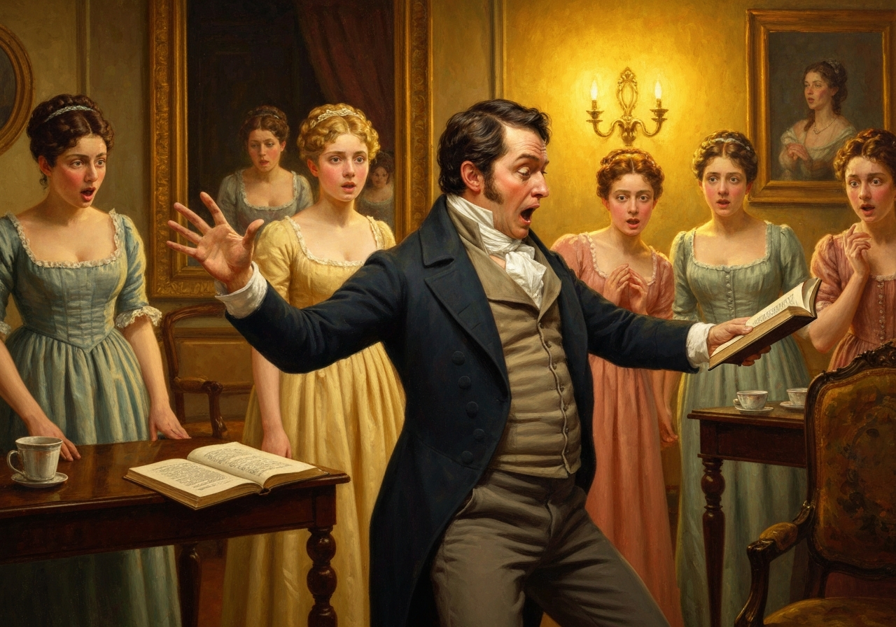

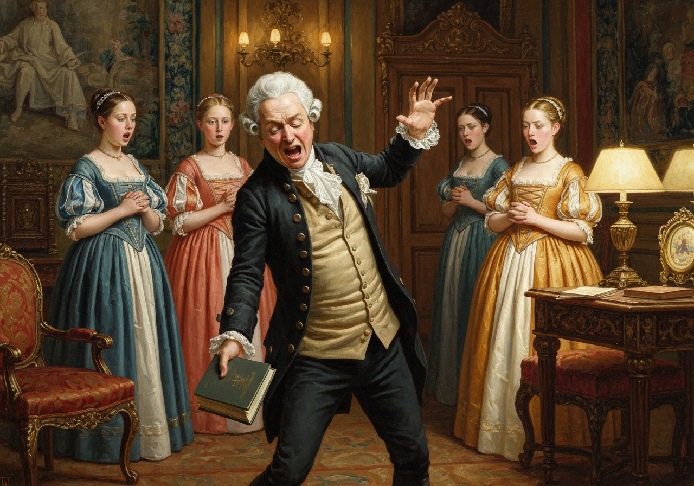
{/* metadata:img_006:end */}

{/* metadata:analysis_006:start */}
<Callout title="Analysis" variant="explanation">
The novel-reading scene serves as a pivotal moment of character revelation and social commentary. Mr. Collins's visible recoil from the circulating library book—symbol of popular, feminized, and potentially subversive literature—exposes his pretentious disdain for entertainment he deems beneath his clerical dignity. His substitution of Fordyce's Sermons, with their notoriously misogynistic advice to women, demonstrates his alignment with patriarchal control masked as moral instruction.
</Callout>
{/* metadata:analysis_006:end */}

      H.T Feb 94
]

to read aloud to the ladies. Mr. Collins readily assented, and a book
was produced; but on beholding it (for everything announced it to be
from a circulating library) he started back, and, begging pardon,
protested that he never read novels. Kitty stared at him, and Lydia
exclaimed. Other books were produced, and after some deliberation he
chose “Fordyce’s Sermons.” Lydia gaped as he opened the volume; and
before he had, with very monotonous solemnity, read three pages, she
interrupted him with,--

“Do you know, mamma, that my uncle Philips talks of turning away
Richard? and if he does, Colonel Forster will hire him. My aunt told me
so herself on Saturday. I shall walk to Meryton to-morrow to hear more
about it, and to ask when Mr. Denny comes back from town.”

Lydia was bid by her two eldest sisters to hold her tongue; but Mr.
Collins, much offended, laid aside his book, and said,--

“I have often observed how little young ladies are interested by books
of a serious stamp, though written solely for their benefit. {/* metadata:quote_007:start */}
<Callout title="Memorable Quote" variant="note">I have often observed how little young ladies are interested by books of a serious stamp, though written solely for their benefit. It amazes me, I confess; for certainly there can be nothing so advantageous to them as instruction.</Callout>
{/* metadata:quote_007:end */} But I will no longer importune my young cousin.”

Then, turning to Mr. Bennet, he offered himself as his antagonist at
backgammon. Mr. Bennet accepted the challenge, observing that he acted
very wisely in leaving the girls to their own trifling amusements. Mrs.
Bennet and her daughters apologized most civilly for Lydia’s
interruption, and promised that it should not occur again, if he would
resume his book; but Mr. Collins, after assuring them that he bore his
young cousin no ill-will, and should never resent her behaviour as any
affront, seated himself at another table with Mr. Bennet, and prepared
for backgammon.

{/* metadata:img_007:start */}
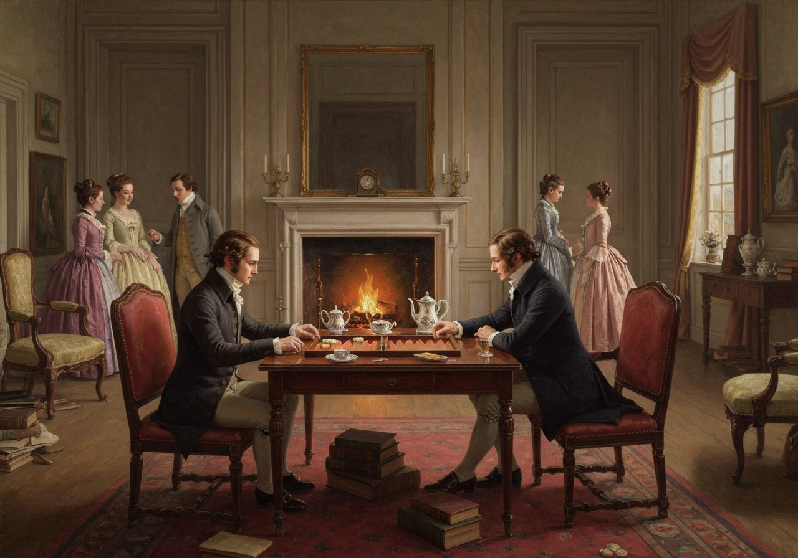

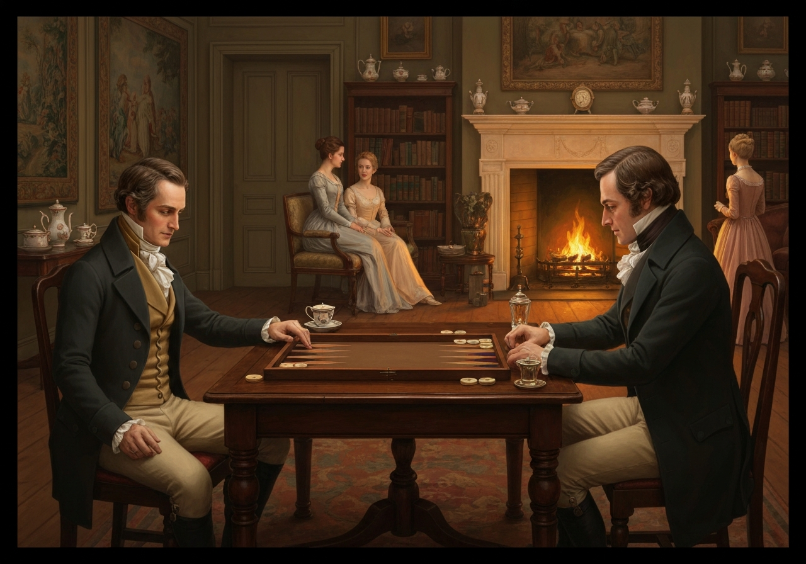
{/* metadata:img_007:end */}

{/* metadata:analysis_007:start */}
<Callout title="Analysis" variant="explanation">
Lydia Bennet's interruption epitomizes the generational and temperamental conflict between solemn propriety and youthful irreverence. Her complete indifference to Mr. Collins's moral instruction—focused instead on soldiers, gossip, and Meryton excursions—represents the failure of traditional authority to engage the younger generation. The chapter closes with Mr. Collins seating himself at another table with Mr. Bennet and preparing for backgammon, a retreat into masculine strategic games that signals his final abandonment of any pretense to civilizing influence.
</Callout>
{/* metadata:analysis_007:end */}

[Illustration]
