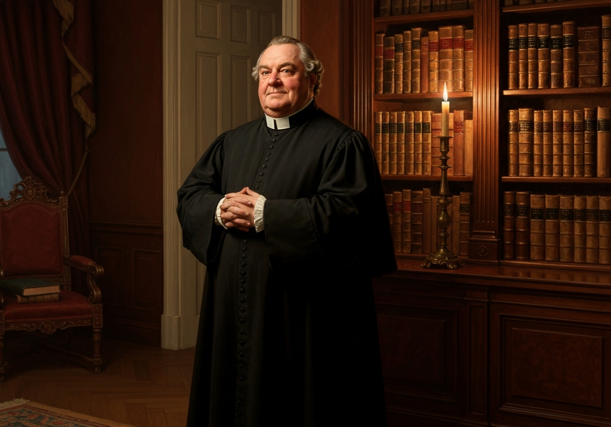
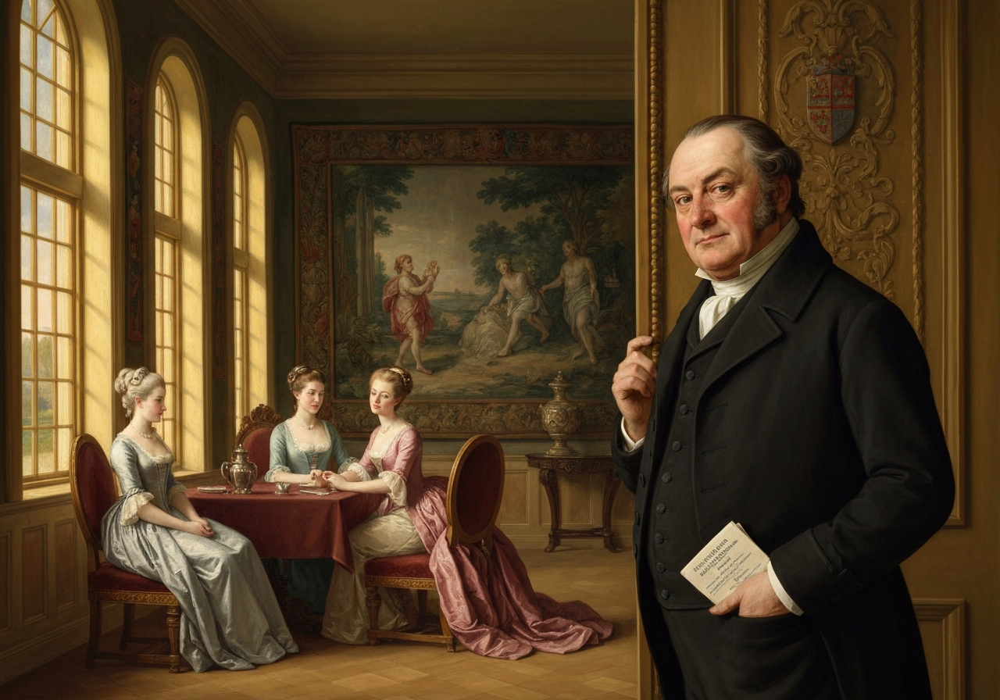
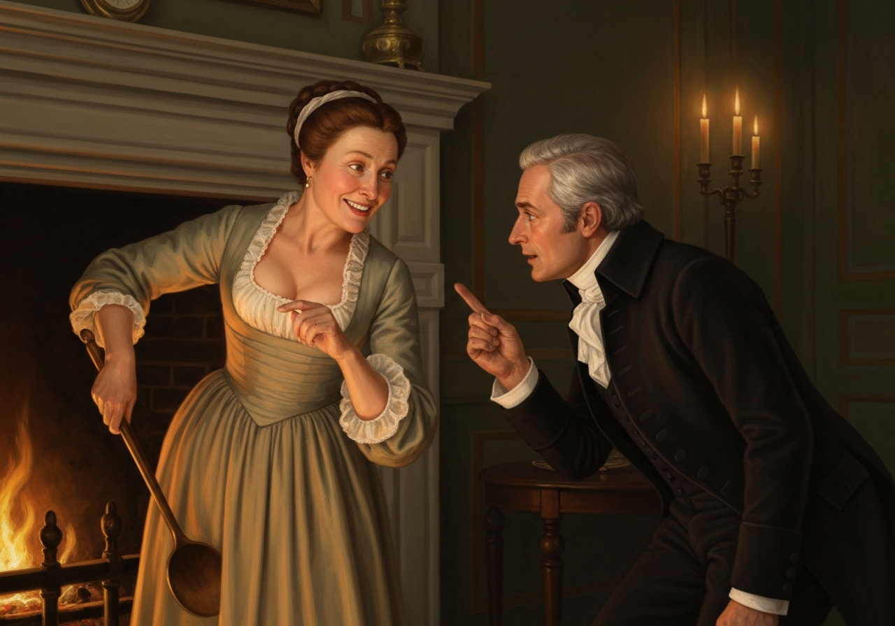
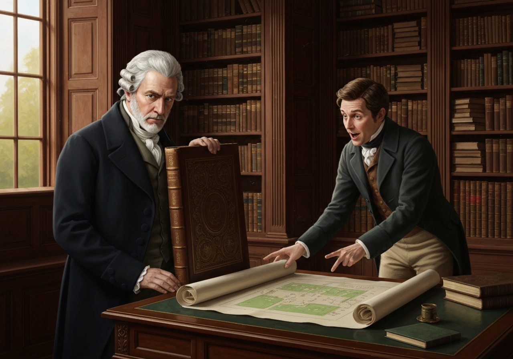
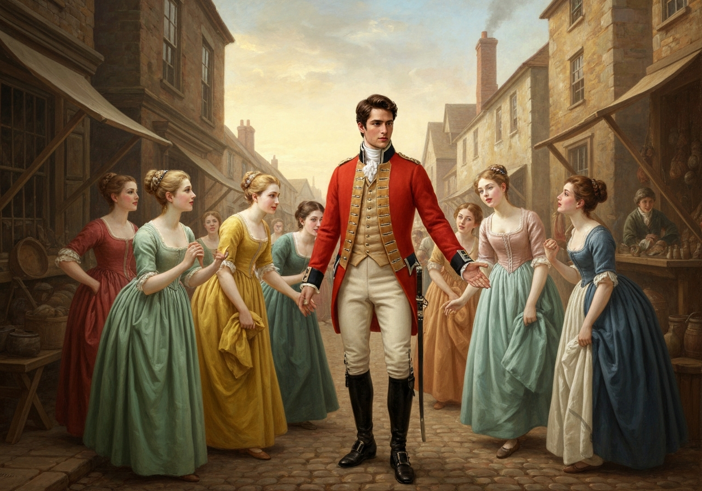
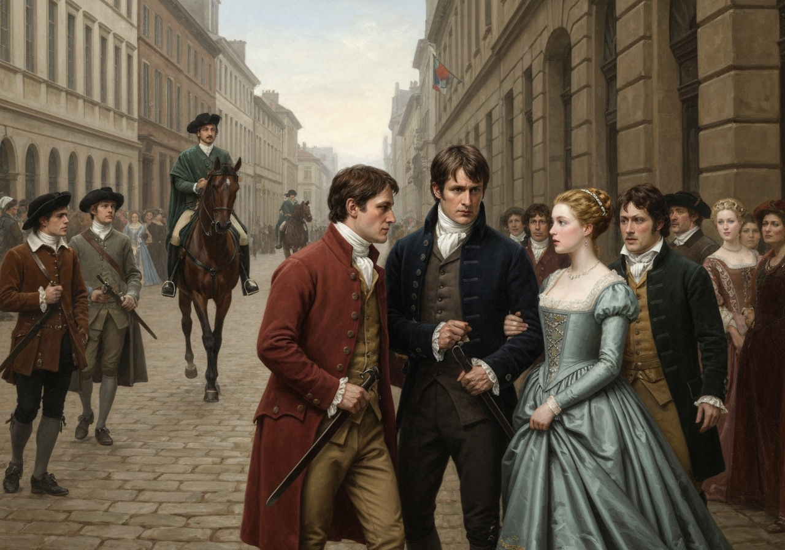
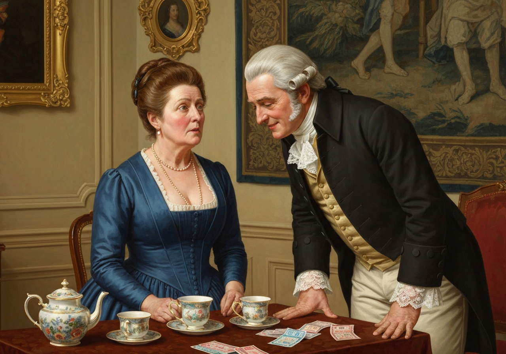

import Callout from '@/components/Callout.astro'

{/* metadata:quote_001:start */}
<Callout title="Memorable Quote" variant="note">Mr. Collins was not a sensible man, and the deficiency of nature had been but little assisted by education or society;</Callout>
{/* metadata:quote_001:end */}
the greatest part of
his life having been spent under the guidance of an illiterate and
miserly father; and though he belonged to one of the universities, he
had merely kept the necessary terms without forming at it any useful
acquaintance.
<Callout title="Memorable Quote" variant="note">
    The subjection in which his father had brought him up had given him originally great humility of manner;
    but it was now a good deal counteracted by the self-conceit of a weak head, living in retirement, and the consequential feelings of early and unexpected prosperity.
</Callout>
A fortunate chance had recommended him to Lady Catherine de
Bourgh when the living of Hunsford was vacant; and the respect which he
felt for her high rank, and his veneration for her as his patroness,
mingling with a very good opinion of himself, of his authority as a
clergyman, and his right as a rector, made him altogether a mixture of
pride and obsequiousness, self-importance and humility.

{/* metadata:img_001:start */}

{/* metadata:img_001:end */}

{/* metadata:an_001:start */}
<Callout title="Analysis" variant="explanation">
The chapter opens with a devastating character sketch of Mr. Collins, establishing him as a man whose character has been shaped by contradictory forces: the original humility imposed by his miserable upbringing now counteracted by self-conceit from his unexpected prosperity as a clergyman with a good living. Austen masterfully captures the oxymoronic nature of his personality in the phrase 'a mixture of pride and obsequiousness, self-importance and humility,' making him simultaneously ridiculous and believable. The precision of this four-part formulation—two pairs of antonyms—enacts in syntax the very incoherence it describes.
</Callout>
{/* metadata:an_001:end */}

Having now a good house and a very sufficient income, he intended to
marry; and in seeking a reconciliation with the Longbourn family he had
a wife in view, as he meant to choose one of the daughters, if he found
them as handsome and amiable as they were represented by common report.
<Callout title="Memorable Quote" variant="note">This was his plan of amends--of atonement--for inheriting their father’s estate;</Callout>
and he thought it an excellent one, full of eligibility and
suitableness, and excessively generous and disinterested on his own part.

{/* metadata:img_002:start */}

{/* metadata:img_002:end */}

{/* metadata:an_002:start */}
<Callout title="Analysis" variant="explanation">
Mr. Collins's matrimonial scheme reveals the economic and social pragmatism that underlies marriage in Austen's world. His plan to marry one of the Bennet daughters serves as 'amends' for inheriting their estate—a solution he views as 'full of eligibility and suitableness, and excessively generous and disinterested on his own part.' This passage brilliantly satirizes self-delusion, as Collins believes himself magnanimous for offering to solve a problem he himself represents. The accumulation of approving adjectives—eligibility, suitableness, generous, disinterested—exposes the gap between his self-image and reality.
</Callout>
{/* metadata:an_002:end */}

His plan did not vary on seeing them. Miss Bennet’s lovely face
confirmed his views, and established all his strictest notions of what
was due to seniority; and for the first evening _she_ was his settled
choice. The next morning, however, made an alteration; for in a quarter
of an hour’s _tête-à-tête_ with Mrs. Bennet before breakfast, a
conversation beginning with his parsonage-house, and leading naturally
to the avowal of his hopes, that a mistress for it might be found at
Longbourn, produced from her, amid very complaisant smiles and general
encouragement, a caution against the very Jane he had fixed on. “As to
her _younger_ daughters, she could not take upon her to say--she could
not positively answer--but she did not _know_ of any prepossession;--her
_eldest_ daughter she must just mention--she felt it incumbent on her to
hint, was likely to be very soon engaged.”

<Callout title="Memorable Quote" variant="note">
Mr. Collins had only to change from Jane to Elizabeth
</Callout>
--and it was soon done--done while Mrs. Bennet was stirring the fire.
Elizabeth, equally next to Jane in birth and beauty, succeeded her of course.

{/* metadata:img_003:start */}

{/* metadata:img_003:end */}

{/* metadata:an_003:start */}
<Callout title="Analysis" variant="explanation">
Mrs. Bennet's manipulation dramatically shifts the romantic target within minutes. Her subtle undermining of Jane—hinting at an impending engagement—while remaining noncommittal about her younger daughters demonstrates her calculated social maneuvering. The comedic understatement 'done while Mrs. Bennet was stirring the fire' highlights how easily Collins changes his mind, and by extension, how superficial his affections truly are. That Elizabeth 'equally next to Jane in birth and beauty, succeeded her of course' reduces the heroine to a mere slot in Collins's scheme, underscoring the chapter's satirical treatment of courtship.
</Callout>
{/* metadata:an_003:end */}

Mrs. Bennet treasured up the hint, and trusted that she might soon have
two daughters married; and the man whom she could not bear to speak of
the day before, was now high in her good graces.

Lydia’s intention of walking to Meryton was not forgotten: every sister
except Mary agreed to go with her; and Mr. Collins was to attend them,
at the request of Mr. Bennet, who was most anxious to get rid of him,
and have his library to himself; for thither Mr. Collins had followed
him after breakfast, and there he would continue, nominally engaged with
one of the largest folios in the collection, but really talking to Mr.
Bennet, with little cessation, of his house and garden at Hunsford. Such
doings discomposed Mr. Bennet exceedingly. In his library he had been
always sure of leisure and tranquillity; and though prepared, as he told
Elizabeth, to meet with folly and conceit in every other room in the
house, he was used to be free from them there: his civility, therefore,
was most prompt in inviting Mr. Collins to join his daughters in their
walk; and Mr. Collins, being in fact much better fitted for a walker
than a reader, was extremely well pleased to close his large book, and
go.

{/* metadata:img_004:start */}

{/* metadata:img_004:end */}

{/* metadata:an_004:start */}
<Callout title="Analysis" variant="explanation">
Mr. Bennet's barely concealed desperation to rid himself of Collins provides delightful comedy while revealing their contrasting temperaments. The library, traditionally a sanctuary of 'leisure and tranquillity,' has been invaded by Collins's ceaseless prattle about his house and garden at Hunsford. Bennet's strategic suggestion—sending Collins with the daughters—exemplifies his characteristic passive-aggressive problem-solving, and the narrator's aside that Collins was 'in fact much better fitted for a walker than a reader' delivers a quietly devastating verdict on his intellectual pretensions.
</Callout>
{/* metadata:an_004:end */}

In pompous nothings on his side, and civil assents on that of his
cousins, their time passed till they entered Meryton. The attention of
the younger ones was then no longer to be gained by _him_. Their eyes
were immediately wandering up the street in quest of the officers, and
nothing less than a very smart bonnet, indeed, or a really new muslin in
a shop window, could recall them.

But the attention of every lady was soon caught by a young man, whom
they had never seen before, of most gentlemanlike appearance, walking
with an officer on the other side of the way.
<Callout title="Memorable Quote" variant="note">The officer was the very Mr. Denny concerning whose return from London Lydia came to inquire, and he bowed as they passed.</Callout>
All were struck with the stranger’s air, all
wondered who he could be; and Kitty and Lydia, determined if possible
to find out, led the way across the street, under pretence of wanting
something in an opposite shop, and fortunately had just gained the
pavement, when the two gentlemen, turning back, had reached the same
spot. Mr. Denny addressed them directly, and entreated permission to
introduce his friend, Mr. Wickham, who had returned with him the day
before from town, and, he was happy to say, had accepted a commission in
their corps. This was exactly as it should be; for the young man wanted
only regimentals to make him completely charming. His appearance was
greatly in his favour: he had all the best parts of beauty, a fine
countenance, a good figure, and very pleasing address. The introduction
was followed up on his side by a happy readiness of conversation--a
readiness at the same time perfectly correct and unassuming; and the
whole party were still standing and talking together very agreeably,
when the sound of horses drew their notice, and Darcy and Bingley were
seen riding down the street.

{/* metadata:img_005:start */}

{/* metadata:img_005:end */}

{/* metadata:an_005:start */}
<Callout title="Analysis" variant="explanation">
The introduction of Mr. Wickham marks a pivotal moment in the novel. Described with almost excessive charm—'he had all the best parts of beauty, a fine countenance, a good figure, and very pleasing address'—he immediately captivates the Bennet sisters. His 'happy readiness of conversation' that is 'perfectly correct and unassuming' presents a deliberate contrast to Darcy's earlier stiffness, inviting both the characters and readers to prefer him. The scene's sociable ease is then shattered by the arrival of Darcy and Bingley, whose appearance transforms the pleasant street encounter into something charged with unspoken history.
</Callout>
{/* metadata:an_005:end */}

On distinguishing the ladies of the group
the two gentlemen came directly towards them, and began the usual
civilities. Bingley was the principal spokesman, and Miss Bennet the
principal object. He was then, he said, on his way to Longbourn on
purpose to inquire after her. Mr. Darcy corroborated it with a bow, and
was beginning to determine not to fix his eyes on Elizabeth, when they
were suddenly arrested by the sight of the stranger; and Elizabeth
happening to see the countenance of both as they looked at each other,
was all astonishment at the effect of the meeting.
<Callout title="Memorable Quote" variant="note">Both changed colour, one looked white, the other red.</Callout>
{/* metadata:quote_006:end */}
Mr. Wickham, after a few moments, touched his hat--a salutation which Mr. Darcy just deigned to return. What could be the meaning of it?
{/* metadata:quote_007:start */}
<Callout title="Memorable Quote" variant="note">It was impossible to imagine; it was impossible not to long to know.</Callout>
{/* metadata:quote_007:end */}

{/* metadata:img_006:start */}

{/* metadata:img_006:end */}

{/* metadata:an_006:start */}
<Callout title="Analysis" variant="explanation">
The fateful encounter between Darcy and Wickham constitutes the chapter's dramatic climax. The charged silence and mutual recognition—'Both changed colour, one looked white, the other red'—introduce a mystery that will drive the novel's central conflict. The minimal acknowledgment—a touch of the hat barely returned—loaded with unspoken history, exemplifies Austen's ability to convey volumes through subtle physical gestures and restraint. Elizabeth's bewilderment is rendered in two parallel exclamations that capture both the impossibility of explanation and the irresistibility of curiosity: 'It was impossible to imagine; it was impossible not to long to know.'
</Callout>
{/* metadata:an_006:end */}

In another minute Mr. Bingley, but without seeming to have noticed what
passed, took leave and rode on with his friend.

Mr. Denny and Mr. Wickham walked with the young ladies to the door of
Mr. Philips’s house, and then made their bows, in spite of Miss Lydia’s
pressing entreaties that they would come in, and even in spite of Mrs.
Philips’s throwing up the parlour window, and loudly seconding the
invitation.

Mrs. Philips was always glad to see her nieces; and the two eldest, from
their recent absence, were particularly welcome; and she was eagerly
expressing her surprise at their sudden return home, which, as their own
carriage had not fetched them, she should have known nothing about, if
she had not happened to see Mr. Jones’s shopboy in the street, who had
told her that they were not to send any more draughts to Netherfield,
because the Miss Bennets were come away, when her civility was claimed
towards Mr. Collins by Jane’s introduction of him. She received him with
her very best politeness, which he returned with as much more,
apologizing for his intrusion, without any previous acquaintance with
her, which he could not help flattering himself, however, might be
justified by his relationship to the young ladies who introduced him to
her notice. Mrs. Philips was quite awed by such an excess of good
breeding; but her contemplation of one stranger was soon put an end to
by exclamations and inquiries about the other, of whom, however, she
could only tell her nieces what they already knew, that Mr. Denny had
brought him from London, and that he was to have a lieutenant’s
commission in the ----shire. She had been watching him the last hour,
she said, as he walked up and down the street,--and had Mr. Wickham
appeared, Kitty and Lydia would certainly have continued the occupation;
but unluckily no one passed the windows now except a few of the
officers, who, in comparison with the stranger, were become “stupid,
disagreeable fellows.” Some of them were to dine with the Philipses the
next day, and their aunt promised to make her husband call on Mr.
Wickham, and give him an invitation also, if the family from Longbourn
would come in the evening. This was agreed to; and Mrs. Philips
protested that they would have a nice comfortable noisy game of lottery
tickets, and a little bit of hot supper afterwards. The prospect of such
delights was very cheering, and they parted in mutual good spirits. Mr.
Collins repeated his apologies in quitting the room, and was assured,
with unwearying civility, that they were perfectly needless.

As they walked home, Elizabeth related to Jane what she had seen pass
between the two gentlemen; but though Jane would have defended either or
both, had they appeared to be wrong, she could no more explain such
behaviour than her sister.

Mr. Collins on his return highly gratified Mrs. Bennet by admiring Mrs.
Philips’s manners and politeness. He protested that, except Lady
Catherine and her daughter, he had never seen a more elegant woman; for
she had not only received him with the utmost civility, but had even
pointedly included him in her invitation for the next evening, although
utterly unknown to her before. Something, he supposed, might be
attributed to his connection with them, but yet he had never met with so
much attention in the whole course of his life.

{/* metadata:img_007:start */}

{/* metadata:img_007:end */}

{/* metadata:an_007:start */}
<Callout title="Analysis" variant="explanation">
The narrative returns to comedy with Mr. Collins's inflated sense of his own consequence at Mrs. Philips's house. His comparison of her to 'Lady Catherine and her daughter' as the acme of elegance demonstrates his inability to distinguish genuine quality from mere politeness. His concluding reflection—that 'he had never met with so much attention in the whole course of his life'—serves as pathetic commentary on his isolation and self-importance, while also reminding the reader how little it takes to satisfy a man of his vanity. The chapter thus ends on a note of gentle mockery that balances the genuine dramatic tension introduced by the Darcy–Wickham encounter.
</Callout>
{/* metadata:an_007:end */}
