import Callout from '@/components/Callout.astro'

[Illustration]

Elizabeth related to Jane, the next day, what had passed between {/* metadata:quote_003:start */}
<Callout title="Memorable Quote" variant="note">I can much more easily believe Mr. Bingley's being imposed on than that Mr. Wickham should invent such a history of himself as he gave me last night; names, facts, everything mentioned without ceremony. If it be not so, let Mr. Darcy contradict it. Besides, there was truth in his looks.</Callout>
{/* metadata:quote_003:end */}
Wickham and herself. {/* metadata:quote_001:start */}
<Callout title="Memorable Quote" variant="note">Jane listened with astonishment and concern: she knew not how to believe that Mr. Darcy could be so unworthy of Mr. Bingley's regard; and yet it was not in her nature to question the veracity of a young man of such amiable appearance as Wickham.</Callout>
{/* metadata:quote_001:end */} she
knew not how to believe that Mr.

{/* metadata:img_001:start */}
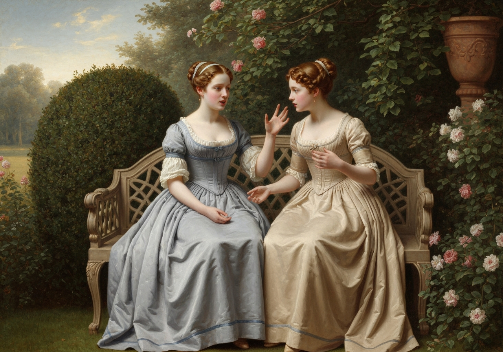

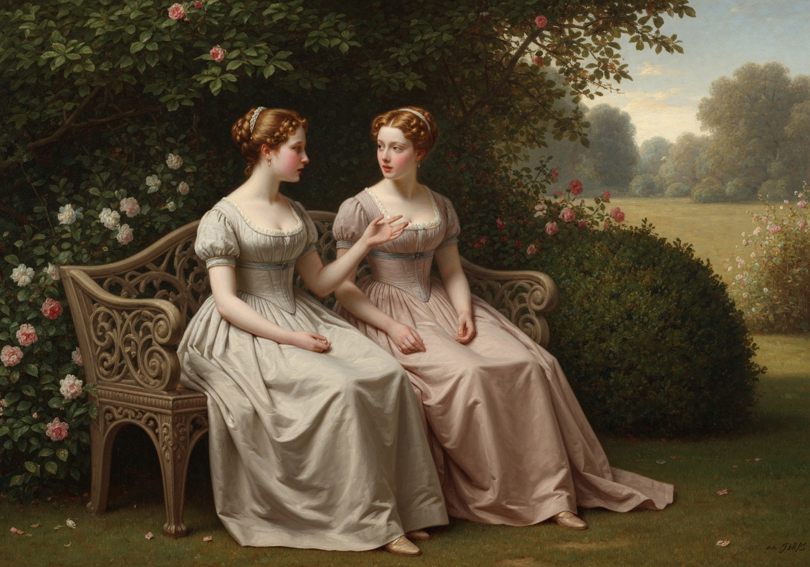
{/* metadata:img_001:end */}

 Darcy could be so unworthy of Mr.
Bingley’s regard; and yet it was not in her nature to question the
veracity of a young man of such amiable appearance as Wickham. The
possibility of his having really endured such unkindness was enough to
interest all her tender feelings; and nothing therefore remained to be
done but to think well of them both, to defend the conduct of each, and
throw into the account of accident or mistake whatever could not be
otherwise explained.

{/* metadata:analysis_001:start */}
<Callout title="Analysis" variant="explanation">
This chapter opens with Elizabeth confiding in Jane about her conversation with Mr. Wickham, revealing the sisters' contrasting natures. While Jane seeks to believe the best of everyone and finds explanations that absolve both Darcy and Wickham, Elizabeth demonstrates her sharp critical faculties and willingness to accept Wickham's version of events based on his apparent sincerity and 'truth in his looks.' This dichotomy between the sisters' approaches to judgment—Jane's charitable reluctance to condemn versus Elizabeth's confident discernment—establishes a tension that will resonate throughout the novel.
</Callout>
{/* metadata:analysis_001:end */}

“They have both,” said she, “been deceived, I dare say, in some way or
other, of which we can form no idea. Interested people have perhaps
misrepresented each to the other. It is, in short, impossible for us to
conjecture the causes or circumstances which may have alienated them,
without actual blame on either side.”

“Very true, indeed; and now, my dear Jane, what have you got to say in
behalf of the interested people who have probably been concerned in the
business? Do clear _them_, too, or we shall be obliged to think ill of
somebody.”

{/* metadata:quote_002:start */}
<Callout title="Memorable Quote" variant="note">Laugh as much as you choose, but you will not laugh me out of my opinion.</Callout>
{/* metadata:quote_002:end */} but you will not laugh me out of my
opinion.

{/* metadata:img_002:start */}
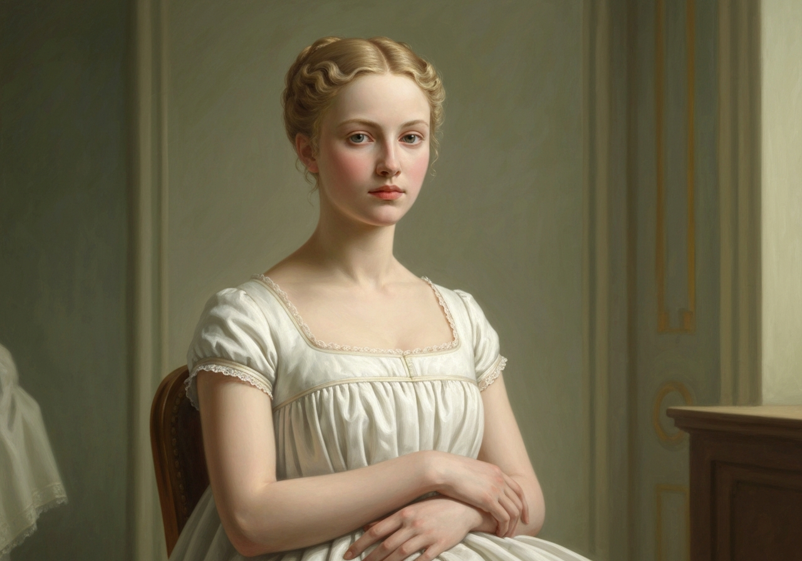

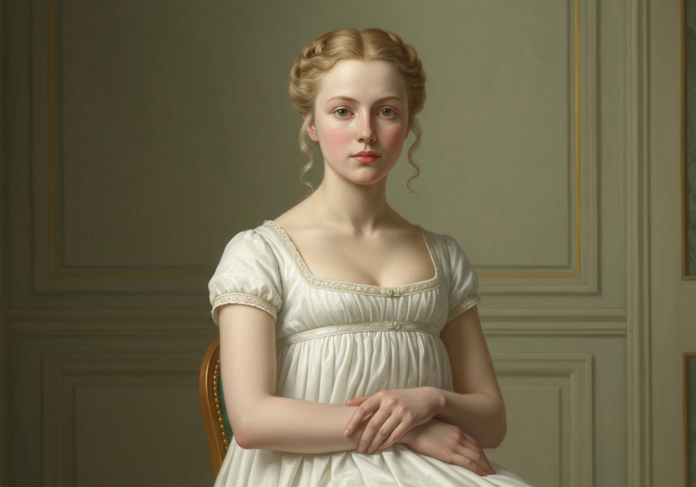
{/* metadata:img_002:end */}

 My dearest Lizzy, do but consider in what a disgraceful light
it places Mr. Darcy, to be treating his father’s favourite in such a
manner,--one whom his father had promised to provide for. It is
impossible. No man of common humanity, no man who had any value for his
character, could be capable of it. Can his most intimate friends be so
excessively deceived in him?

{/* metadata:analysis_002:start */}
<Callout title="Analysis" variant="explanation">
Jane's line 'Laugh as much as you choose, but you will not laugh me out of my opinion' captures her quiet but firm resolve. Despite Elizabeth's teasing, Jane remains committed to her charitable interpretation of events. This moment reveals that Jane is not merely naive but possesses a strong moral conviction—a faith in human goodness that she will not abandon lightly. Austen presents Jane's optimism not as weakness but as a deliberate ethical stance that contrasts productively with Elizabeth's more skeptical worldview.
</Callout>
{/* metadata:analysis_002:end */}

 Oh no.”

“I can much more easily believe Mr. Bingley’s being imposed on than that
Mr. Wickham should invent such a history of himself as he gave me last
night; names, facts, everything mentioned without ceremony. If it be not
so, let Mr. Darcy contradict it. Besides, there was truth in his looks.”

“It is difficult, indeed--it is distressing. One does not know what to
think.”

“I beg your pardon;--one knows exactly what to think.”

{/* metadata:img_003:start */}
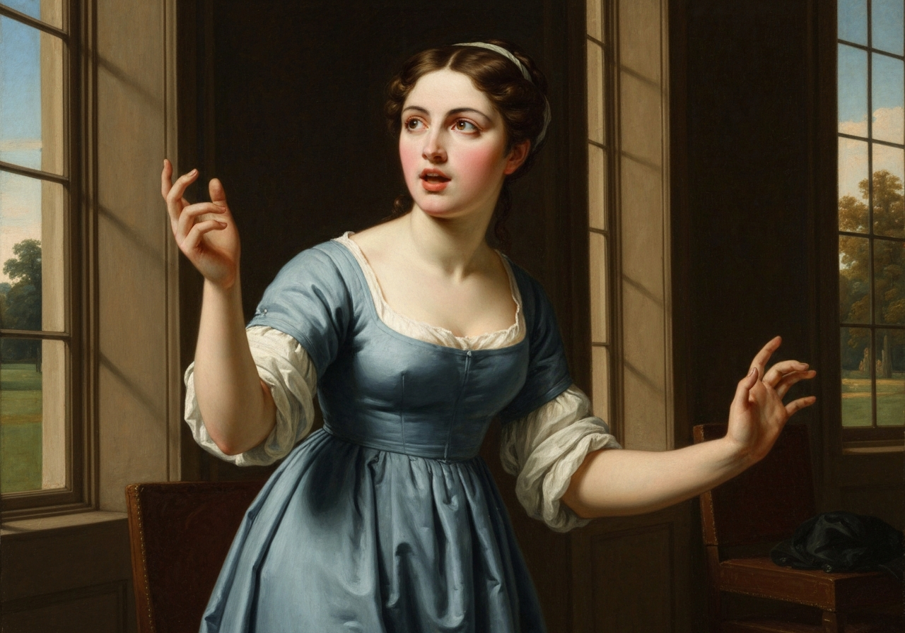

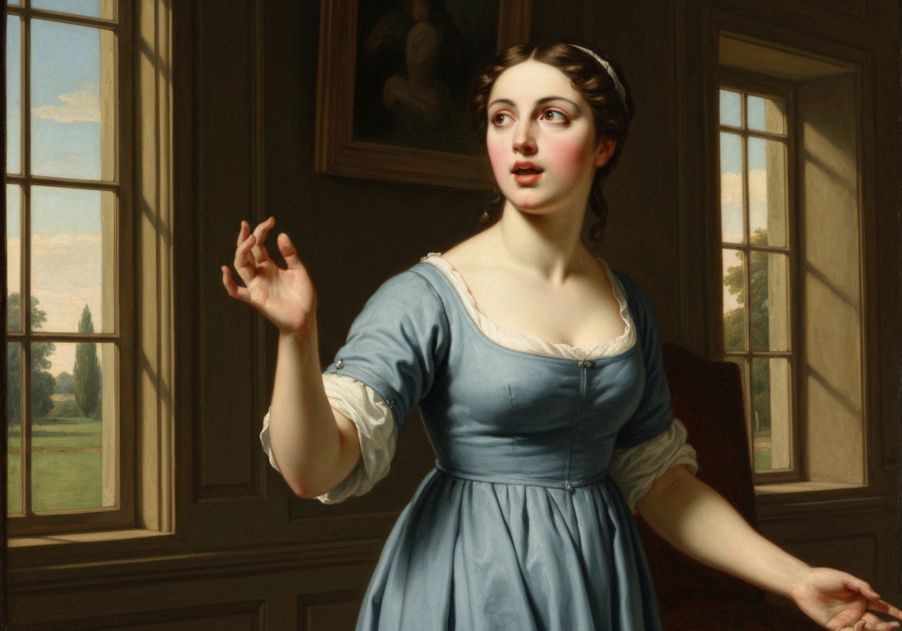
{/* metadata:img_003:end */}

{/* metadata:analysis_003:start */}
<Callout title="Analysis" variant="explanation">
Elizabeth's assertion that 'one knows exactly what to think' reveals her characteristic confidence in her own judgment, which the novel will later interrogate. Her willingness to accept Wickham's account wholesale, based on his agreeable appearance and apparent candor, demonstrates the power of first impressions—a central theme of the novel's original title. Elizabeth believes herself to be exercising discernment, but she is in fact being swayed by the same superficial qualities she criticizes in others who judge by appearances.
</Callout>
{/* metadata:analysis_003:end */}

But Jane could think with certainty on only one point,--that Mr.
Bingley, if he _had been_ imposed on, would have much to suffer when
the affair became public.

The two young ladies were summoned from the shrubbery, where this
conversation passed, by the arrival of some of the very persons of whom
they had been speaking; Mr. Bingley and his sisters came to give their
personal invitation for the long expected ball at Netherfield, which was
fixed for the following Tuesday.

{/* metadata:img_004:start */}
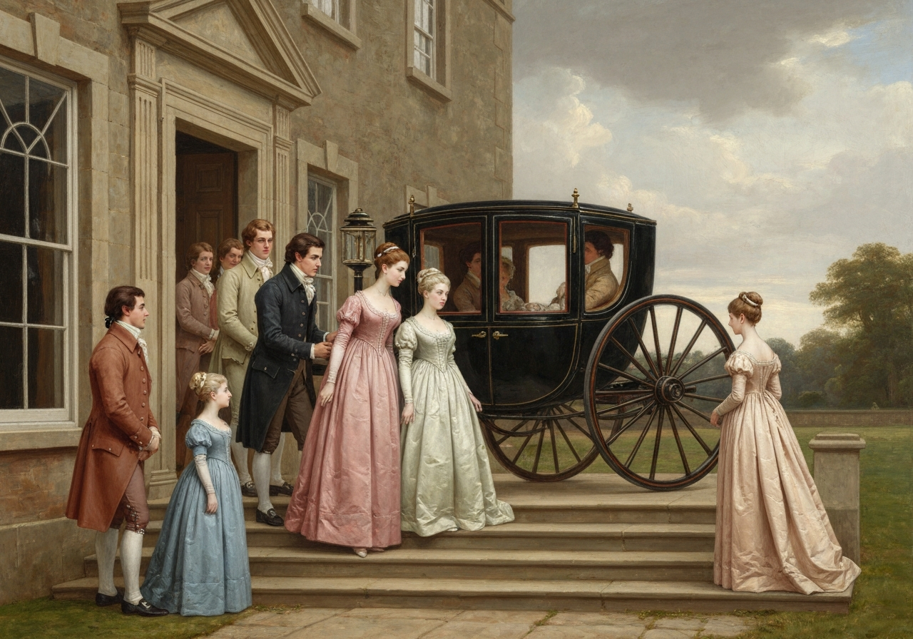

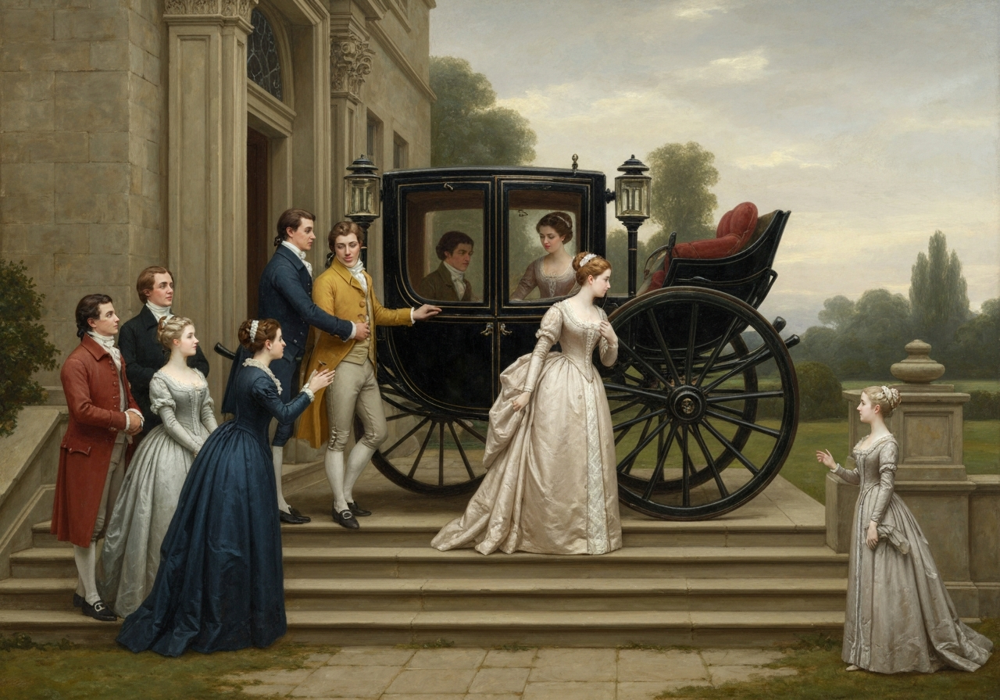
{/* metadata:img_004:end */}

 The two ladies were delighted to see
their dear friend again, called it an age since they had met, and
repeatedly asked what she had been doing with herself since their
separation. To the rest of the family they paid little attention;
avoiding Mrs. Bennet as much as possible, saying not much to Elizabeth,
and nothing at all to the others. {/* metadata:quote_004:start */}
<Callout title="Memorable Quote" variant="note">They were soon gone again, rising from their seats with an activity which took their brother by surprise, and hurrying off as if eager to escape from Mrs. Bennet's civilities.</Callout>
{/* metadata:quote_004:end */} Bennet’s civilities.

{/* metadata:img_005:start */}
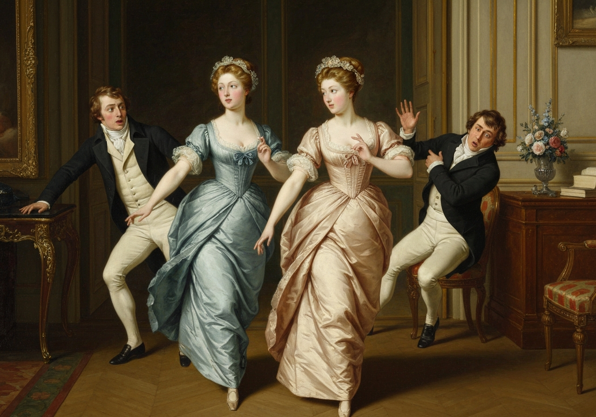

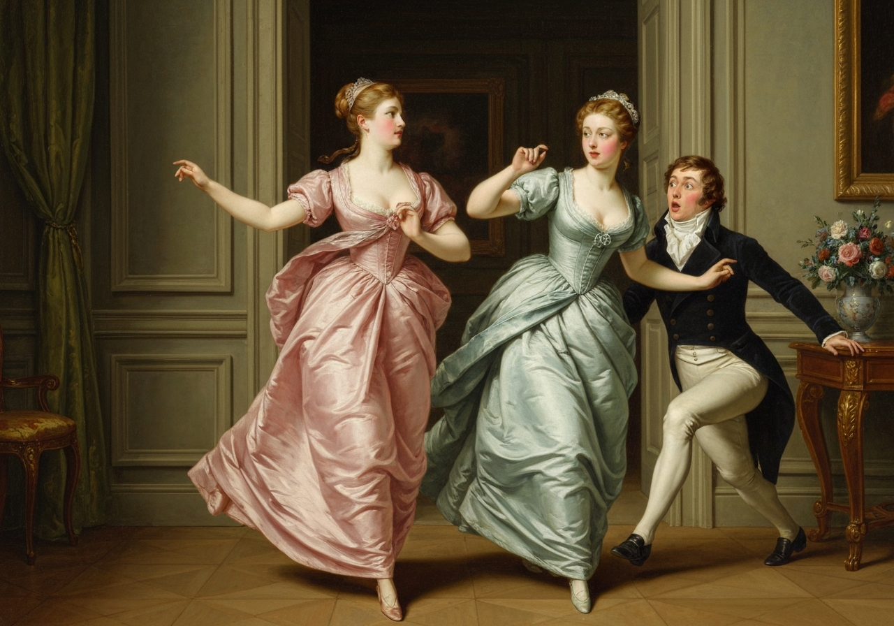
{/* metadata:img_005:end */}

{/* metadata:analysis_004:start */}
<Callout title="Analysis" variant="explanation">
The arrival of the Bingley party marks a narrative shift from the sisters' private conversation to social performance. The description of Bingley's sisters—delighted to see Jane but avoiding Mrs. Bennet and barely acknowledging Elizabeth—reveals the social stratification that governs their interactions. Their abrupt departure, rising from their seats with an activity which took their brother by surprise, underscores the tension between their politeness to Jane and their disdain for the Bennet family's less refined members. This scene economically establishes the obstacles to any potential match between Jane and Bingley.
</Callout>
{/* metadata:analysis_004:end */}

The prospect of the Netherfield ball was extremely agreeable to every
female of the family. Mrs. Bennet chose to consider it as given in
compliment to her eldest daughter, and was particularly flattered by
receiving the invitation from Mr. Bingley himself, instead of a
ceremonious card. Jane pictured to herself a happy evening in the
society of her two friends, and the attentions of their brother; and
Elizabeth thought with pleasure of dancing a great deal with Mr.
Wickham, and of seeing a confirmation of everything in Mr. Darcy’s look
and behaviour. The happiness anticipated by Catherine and Lydia depended
less on any single event, or any particular person; for though they
each, like Elizabeth, meant to dance half the evening with Mr. Wickham,
he was by no means the only partner who could satisfy them, and a ball
was, at any rate, a ball. And even Mary could assure her family that she
had no disinclination for it.

“While I can have my mornings to myself,” said she, “it is enough. I
think it is no sacrifice to join occasionally in evening engagements.
{/* metadata:quote_005:start */}
<Callout title="Memorable Quote" variant="note">Society has claims on us all; and I profess myself one of those who consider intervals of recreation and amusement as desirable for everybody.</Callout>
{/* metadata:quote_005:end */} and I profess myself one of those who
consider intervals of recreation and amusement as desirable for
everybody.”

{/* metadata:analysis_005:start */}
<Callout title="Analysis" variant="explanation">
Mrs. Bennet's interpretation of the ball invitation as a compliment specifically to Jane reveals her maternal priorities and her capacity for self-deception. The narrative voice presents her perspective before moving through each daughter's anticipation of the event, creating a chorus of expectations that illuminates their distinct personalities. Mary's intellectual posturing about leisure and society's claims provides comic relief while reinforcing her awkward position among her sisters—neither as romantic as Jane nor as frivolous as Kitty and Lydia.
</Callout>
{/* metadata:analysis_005:end */}

Elizabeth’s spirits were so high on the occasion, that though she did
not often speak unnecessarily to Mr. Collins, she could not help asking
him whether he intended to accept Mr. Bingley’s invitation, and if he
did, whether he would think it proper to join in the evening’s
amusement; and she was rather surprised to find that he entertained no
scruple whatever on that head, and was very far from dreading a rebuke,
either from the Archbishop or Lady Catherine de Bourgh, by venturing to
dance.

“I am by no means of opinion, I assure you,” said he, “that a ball of
this kind, given by a young man of character, to respectable people, can
have any evil tendency; and I am so far from objecting to dancing
myself, that I shall hope to be honoured with the hands of all my fair
cousins in the course of the evening; and I take this opportunity of
soliciting yours, Miss Elizabeth, for the two first dances especially; a
preference which I trust my cousin Jane will attribute to the right
cause, and not to any disrespect for her.”

{/* metadata:quote_006:start */}
<Callout title="Memorable Quote" variant="note">Elizabeth felt herself completely taken in. She had fully proposed being engaged by Wickham for those very dances; and to have Mr. Collins instead!--her liveliness had been never worse timed.</Callout>
{/* metadata:quote_006:end */} She had fully proposed being
engaged by Wickham for those very dances; and to have Mr. Collins
instead!--her liveliness had been never worse timed.

{/* metadata:img_006:start */}
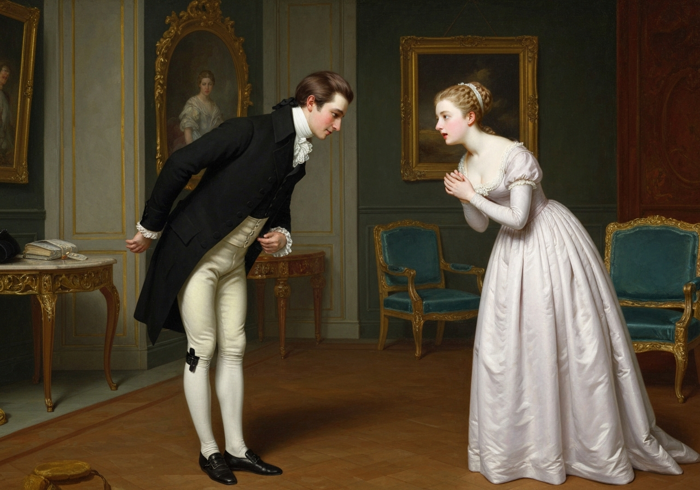

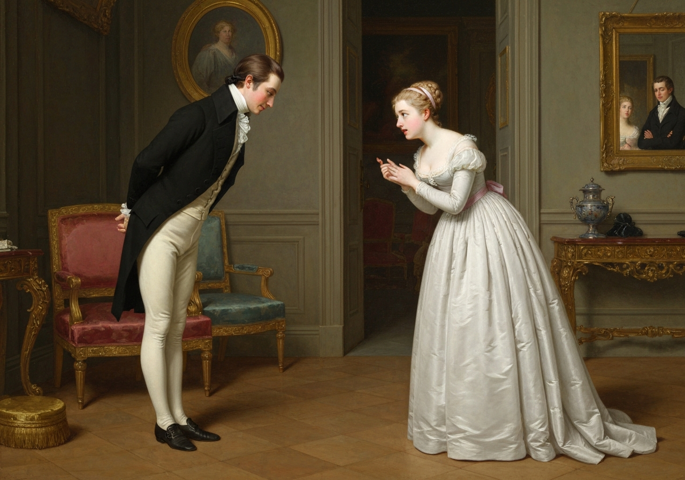
{/* metadata:img_006:end */}

{/* metadata:analysis_006:start */}
<Callout title="Analysis" variant="explanation">
Mr. Collins's request for Elizabeth's hand for the first two dances serves as the chapter's comic climax and narrative turning point. Elizabeth's shock—'completely taken in'—highlights the gap between her plans and reality, and the irony that she, who prides herself on perceptiveness, failed to anticipate this development emphasizes the limitations of her understanding. Mr. Collins's assumption that he has the right to reserve her dances, coupled with his pompous justification involving Lady Catherine, demonstrates his combination of obsequiousness and presumption that characterizes his courtship.
</Callout>
{/* metadata:analysis_006:end */}

 There was no help
for it, however. Mr. Wickham’s happiness and her own was perforce
delayed a little longer, and Mr. Collins’s proposal accepted with as
good a grace as she could. She was not the better pleased with his
gallantry, from the idea it suggested of something more. It now first
struck her, that _she_ was selected from among her sisters as worthy of
being the mistress of Hunsford Parsonage, and of assisting to form a
quadrille table at Rosings, in the absence of more eligible visitors.
The idea soon reached to conviction, as she observed his increasing
civilities towards herself, and heard his frequent attempt at a
compliment on her wit and vivacity; and though more astonished than
gratified herself by this effect of her charms, it was not long before
her mother gave her to understand that the probability of their marriage
was exceedingly agreeable to _her_. Elizabeth, however, did not choose
to take the hint, being well aware that a serious dispute must be the
consequence of any reply. Mr. Collins might never make the offer, and,
till he did, it was useless to quarrel about him.

If there had not been a Netherfield ball to prepare for and talk of, the
younger Miss Bennets would have been in a pitiable state at this time;
for, from the day of the invitation to the day of the ball, there was
such a succession of rain as prevented their walking to Meryton once.

{/* metadata:img_007:start */}
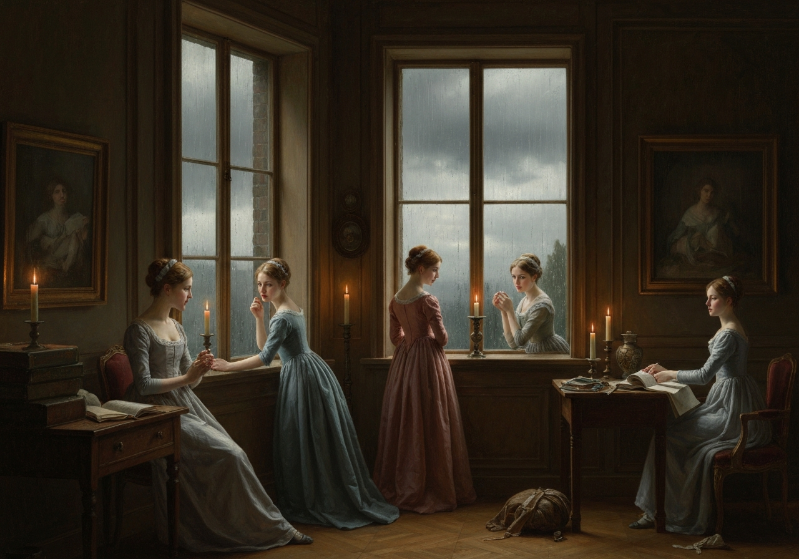

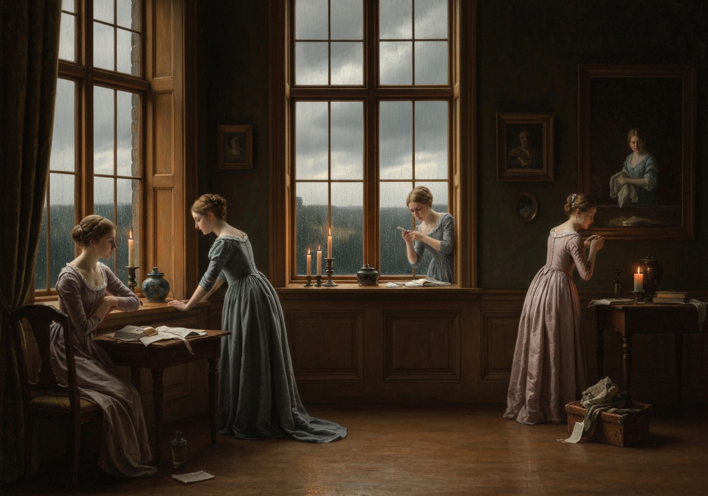
{/* metadata:img_007:end */}

 {/* metadata:quote_007:start */}
<Callout title="Memorable Quote" variant="note">the very shoe-roses for Netherfield were got by proxy.</Callout>
{/* metadata:quote_007:end */} Even Elizabeth might have found some
trial of her patience in weather which totally suspended the improvement
of her acquaintance with Mr. Wickham; and nothing less than a dance on
Tuesday could have made such a Friday, Saturday, Sunday, and Monday
endurable to Kitty and Lydia.

{/* metadata:analysis_007:start */}
<Callout title="Analysis" variant="explanation">
The chapter concludes with a deft handling of narrative time, compressing four rainy days into a few sentences. The reference to shoe-roses for Netherfield being 'got by proxy' captures the era's material culture while emphasizing how thoroughly weather has disrupted the usual social routines. The final observation that nothing less than a dance on Tuesday could have made such a Friday, Saturday, Sunday, and Monday endurable to Kitty and Lydia returns the focus to the youngest sisters' restless energy and underscores the ball's significance as a social event that promises to break the monotony of country life.
</Callout>
{/* metadata:analysis_007:end */}

[Illustration]
