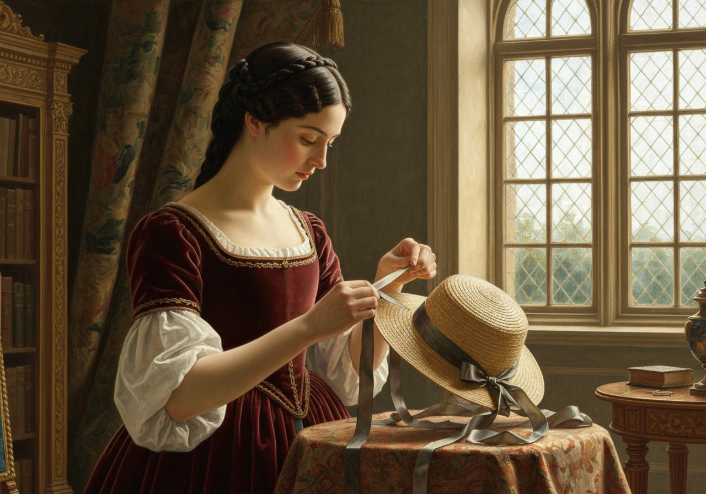
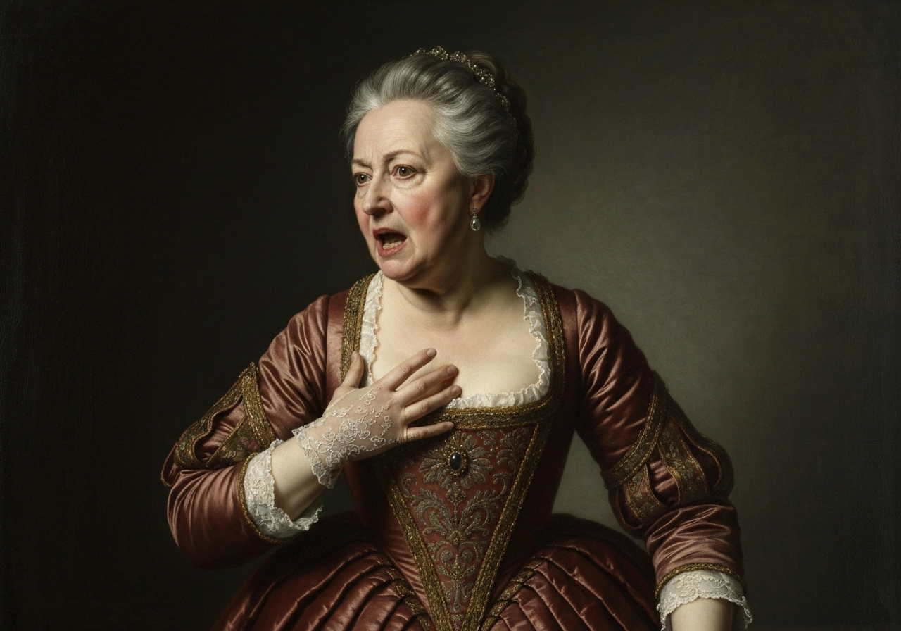
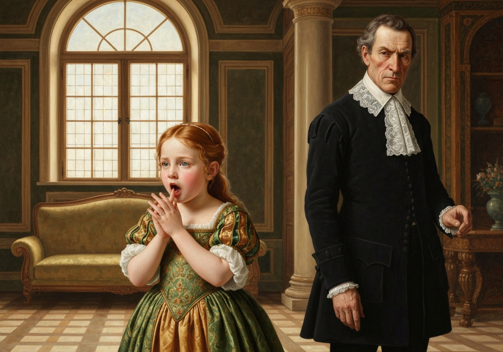
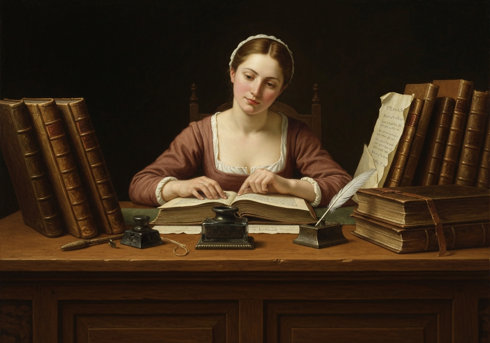
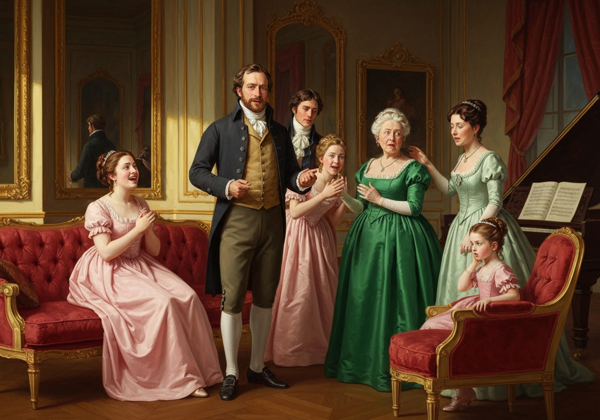
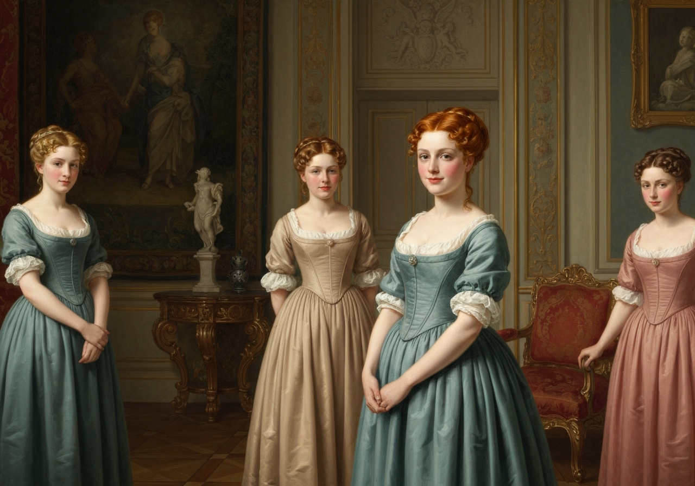

import Callout from '@/components/Callout.astro'

[Illustration]

Mr. Bennet was among the earliest of those who waited on Mr. Bingley.

<!-- metadata:analysis-1:start -->
<Callout title="Analysis [1]" variant="explanation">
Mr. Bennet's secret visit reveals that he is actively engaged in his daughters' future. This teasing serves as a shield against his wife's frantic social climbing. His behavior demonstrates a paternal care hidden behind a facade of indifference.
</Callout>
<!-- metadata:analysis-1:end --> He
had always intended to visit him, though to the last always assuring his
wife that he should not go; and till the evening after the visit was
paid she had no knowledge of it. It was then disclosed in the following
manner. Observing his second daughter employed in trimming a hat

<!-- metadata:image-1:start -->
<Callout title="Image [1] Elizabeth Trimming a Hat" variant="example">

</Callout>
<!-- metadata:image-1:end -->, he
suddenly addressed her with,--

<!-- metadata:quote-1:start -->
<Callout title="Memorable Quote" variant="note">\n  I hope Mr. Bingley will like it, Lizzy.\n</Callout>
<!-- metadata:quote-1:end -->

“We are not in a way to know _what_ Mr. Bingley likes,” said her mother,
resentfully, “since we are not to visit.”

“But you forget, mamma,” said Elizabeth, “that we shall meet him at the
assemblies, and that Mrs. Long has promised to introduce him.”

“I do not believe Mrs. Long will do any such thing. She has two nieces
of her own. She is a selfish, hypocritical woman, and I have no opinion
of her.”

<!-- metadata:analysis-2:start -->
<Callout title="Analysis [2]" variant="explanation">
Mrs. Bennet's dismissal of Mrs. Long exposes the competitive marriage market. Neighbors are viewed primarily as rivals for eligible bachelors in this environment. This reveals the zero-sum nature of social advancement in Regency England.
</Callout>
<!-- metadata:analysis-2:end -->

“No more have I,” said Mr. Bennet; “and I am glad to find that you do
not depend on her serving you.”

Mrs. Bennet deigned not to make any reply; but, unable to contain
herself, began scolding one of her daughters.

<!-- metadata:quote-2:start -->
<Callout title="Memorable Quote" variant="important">\n  Don’t keep coughing so, Kitty, for heaven’s sake! Have a little compassion on my nerves. You tear them to pieces.\n</Callout>
<!-- metadata:quote-2:end -->

<!-- metadata:image-2:start -->
<Callout title="Image [2] The Nerves of Mrs. Bennet" variant="example">

</Callout>
<!-- metadata:image-2:end -->

<!-- metadata:quote-3:start -->
<Callout title="Memorable Quote" variant="tip">\n  Kitty has no discretion in her coughs; she times them ill.\n</Callout>
<!-- metadata:quote-3:end -->

<!-- metadata:analysis-3:start -->
<Callout title="Analysis [3]" variant="explanation">
Kitty’s coughing acts as a manifestation of the underlying domestic tension. Mr. Bennet treats this common family behavior as a piece of theatrical performance. He uses her illness as a tool to poke fun at his wife's agitation.
</Callout>
<!-- metadata:analysis-3:end -->

<!-- metadata:image-3:start -->
<Callout title="Image [3] Kitty's Discretion" variant="example">

</Callout>
<!-- metadata:image-3:end -->

“I do not cough for my own amusement,” replied Kitty, fretfully. “When
is your next ball to be, Lizzy?”

“To-morrow fortnight.”

“Ay, so it is,” cried her mother, “and Mrs. Long does not come back till
the day before; so, it will be impossible for her to introduce him, for
she will not know him herself.”

“Then, my dear, you may have the advantage of your friend, and introduce
Mr. Bingley to _her_.”

“Impossible, Mr. Bennet, impossible, when I am not acquainted with him
myself; how can you be so teasing?”

“I honour your circumspection.

<!-- metadata:analysis-4:start -->
<Callout title="Analysis [4]" variant="explanation">
Mr. Bennet's mock-praise of his wife's 'circumspection' highlights the rigid social rites of the time. He implies that social 'knowing' is often superficial and performative. This irony serves to underscore the absurdity of their neighbors' social expectations.
</Callout>
<!-- metadata:analysis-4:end --> A fortnight’s acquaintance is certainly
very little. One cannot know what a man really is by the end of a
fortnight. But if _we_ do not venture, somebody else will; and after
all, Mrs. Long and her nieces must stand their chance; and, therefore,
as she will think it an act of kindness, if you decline the office, I
will take it on myself.”

The girls stared at their father. Mrs. Bennet said only, “Nonsense,
nonsense!”

“What can be the meaning of that emphatic exclamation?” cried he. “Do
you consider the forms of introduction, and the stress that is laid on
them, as nonsense? I cannot quite agree with you _there_. What say you,
Mary? For you are a young lady of deep reflection, I know, and read
great books, and make extracts.”

<!-- metadata:image-4:start -->
<Callout title="Image [4] Mary's Deep Reflection" variant="example">

</Callout>
<!-- metadata:image-4:end -->

<!-- metadata:analysis-5:start -->
<Callout title="Analysis [5]" variant="explanation">
Mary is defined by her desire for intellectual status, yet she lacks the 'quickness' of Elizabeth. Her inability to find something 'sensible' to say emphasizes her role as a comic foil in the family. She stands as a warning against the affectation of wisdom without true insight.
</Callout>
<!-- metadata:analysis-5:end -->

Mary wished to say something very sensible, but knew not how.

“While Mary is adjusting her ideas,” he continued, “let us return to Mr.
Bingley.”

<!-- metadata:quote-4:start -->
<Callout title="Memorable Quote" variant="summary">\n  I am sick of Mr. Bingley.\n</Callout>
<!-- metadata:quote-4:end -->

“I am sorry to hear _that_; but why did you not tell me so before? If I
had known as much this morning, I certainly would not have called on
him. It is very unlucky; but <!-- metadata:quote-5:start -->
<Callout title="Memorable Quote" variant="important">\n  As I have actually paid the visit, we cannot escape the acquaintance now.\n</Callout>
<!-- metadata:quote-5:end -->

<!-- metadata:image-5:start -->
<Callout title="Image [5] The Revelation of the Visit" variant="example">

</Callout>
<!-- metadata:image-5:end -->

The astonishment of the ladies was just what he wished--that of Mrs.
Bennet perhaps surpassing the rest; though when the first tumult of joy
was over, she began to declare that it was what she had expected all the
while.

<!-- metadata:analysis-6:start -->
<Callout title="Analysis [6]" variant="explanation">
The shift in Mrs. Bennet's attitude to rapturous joy illustrates her volatile and shallow focus. Her immediate claim that she 'expected' the news all along acts as a defense mechanism for her pride. This volatility is a central theme in Austen's depiction of her character.
</Callout>
<!-- metadata:analysis-6:end -->

“How good it was in you, my dear Mr. Bennet! But I knew I should
persuade you at last. I was sure you loved your girls too well to
neglect such an acquaintance. Well, how pleased I am! And it is such a
good joke, too, that you should have gone this morning, and never said a
word about it till now.”

<!-- metadata:quote-6:start -->
<Callout title="Memorable Quote" variant="note">\n  Now, Kitty, you may cough as much as you choose.\n</Callout>
<!-- metadata:quote-6:end --> and,
as he spoke, he left the room, fatigued with the raptures of his wife.

<!-- metadata:image-6:start -->
<Callout title="Image [6] Mr. Bennet's Fatigue" variant="example">

</Callout>
<!-- metadata:image-6:end -->

“What an excellent father you have, girls,” said she, when the door was
shut. “I do not know how you will ever make him amends for his kindness;
or me either, for that matter. At our time of life, it is not so
pleasant, I can tell you, to be making new acquaintances every day; but
for your sakes we would do anything. <!-- metadata:quote-7:start -->
<Callout title="Memorable Quote" variant="tip">\n  Lydia, my love, though you are the youngest, I dare say Mr. Bingley will dance with you at the next ball.\n</Callout>
<!-- metadata:quote-7:end -->

“Oh,” said Lydia, stoutly, “I am not afraid; for though I _am_ the
youngest, I’m the tallest.”

<!-- metadata:analysis-7:start -->
<Callout title="Analysis [7]" variant="explanation">
Lydia’s boast about her height foreshadows her impulsive and reckless nature. She views the social world with a physical confidence that lacks any of Elizabeth's nuance or caution. This early dialogue establishes the youthful folly that will drive her later plot line.
</Callout>
<!-- metadata:analysis-7:end -->

<!-- metadata:image-7:start -->
<Callout title="Image [7] Lydia the Tallest" variant="example">

</Callout>
<!-- metadata:image-7:end -->

The rest of the evening was spent in conjecturing how soon he would
return Mr. Bennet’s visit, and determining when they should ask him to
dinner.

[Illustration: “I’m the tallest”]

[Illustration:

     “He rode a black horse”
]
