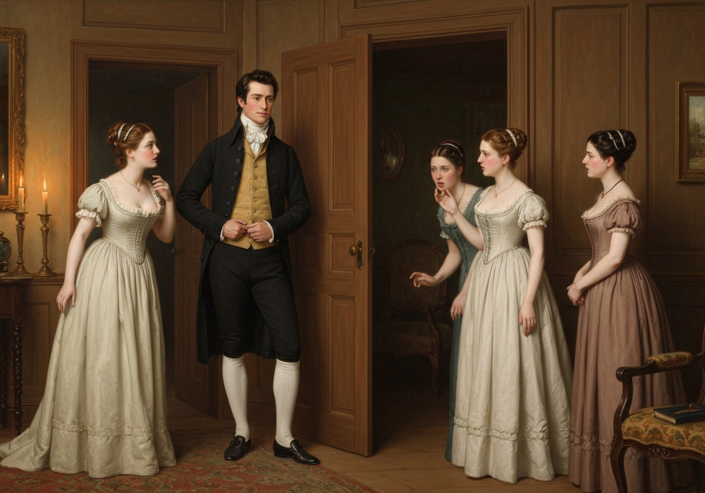
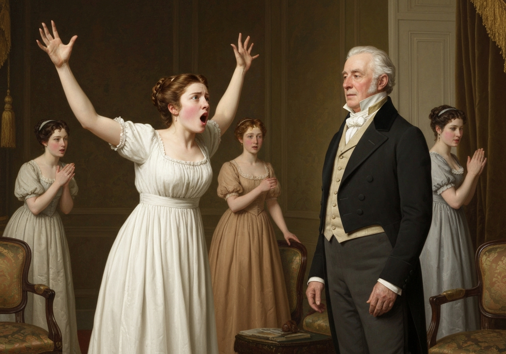
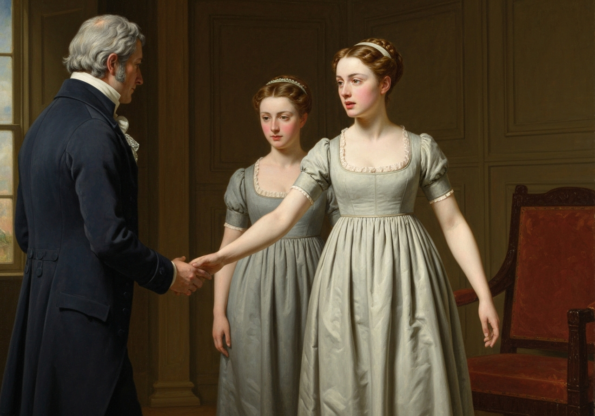
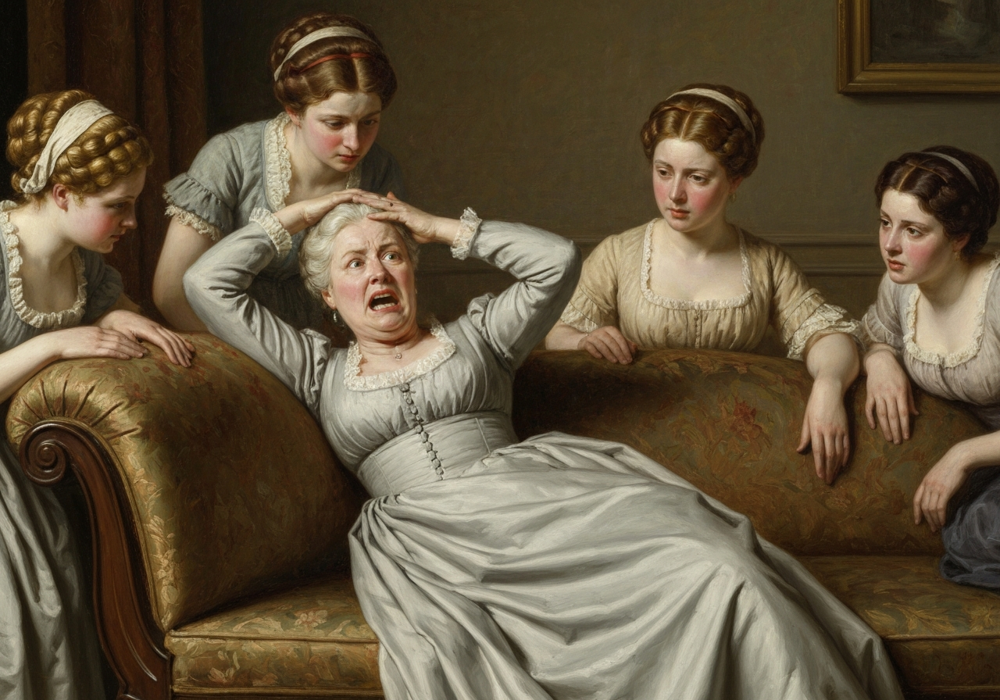
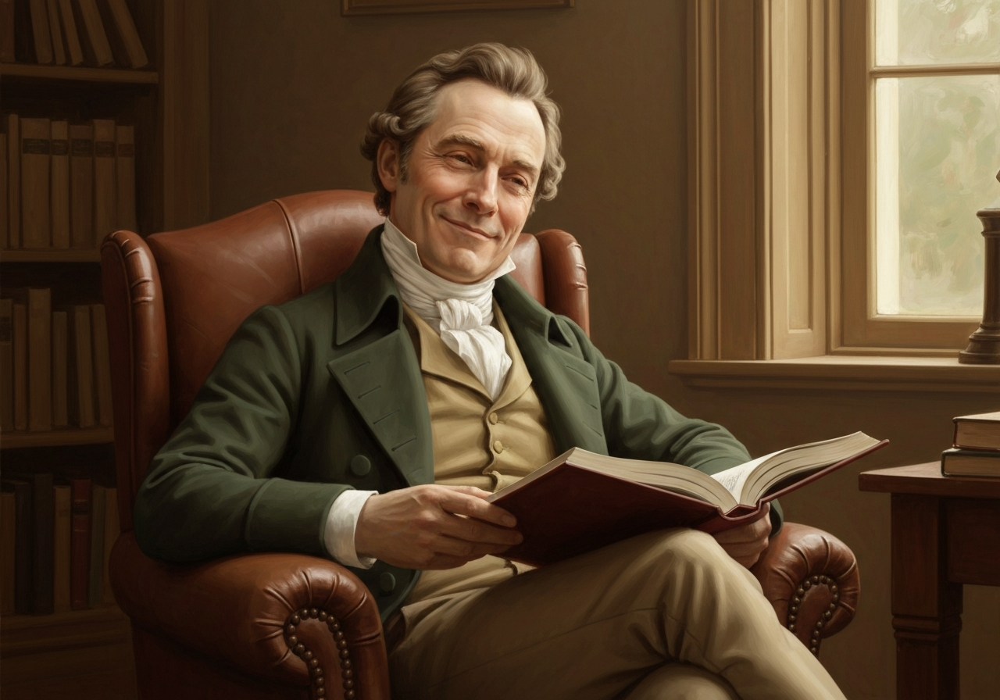
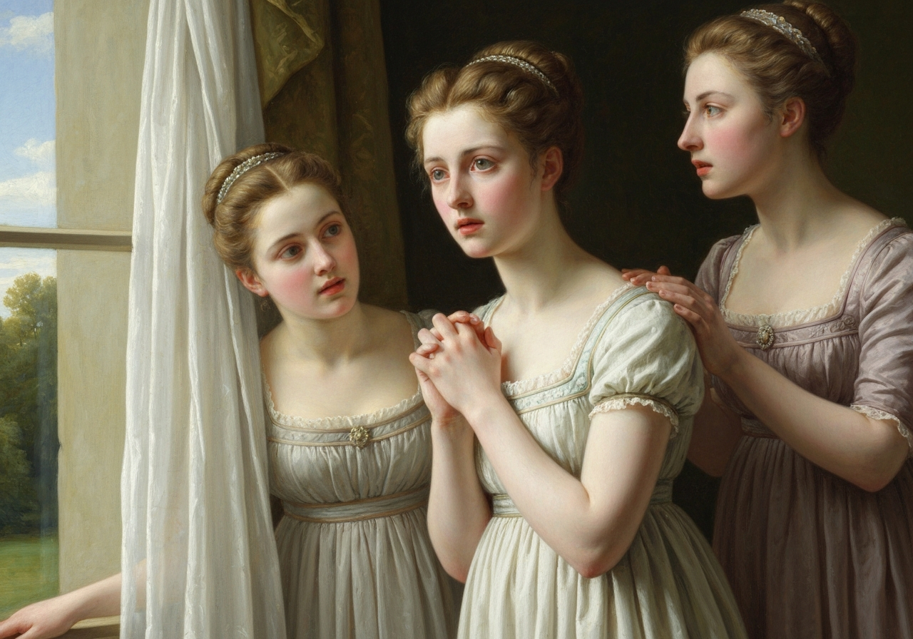
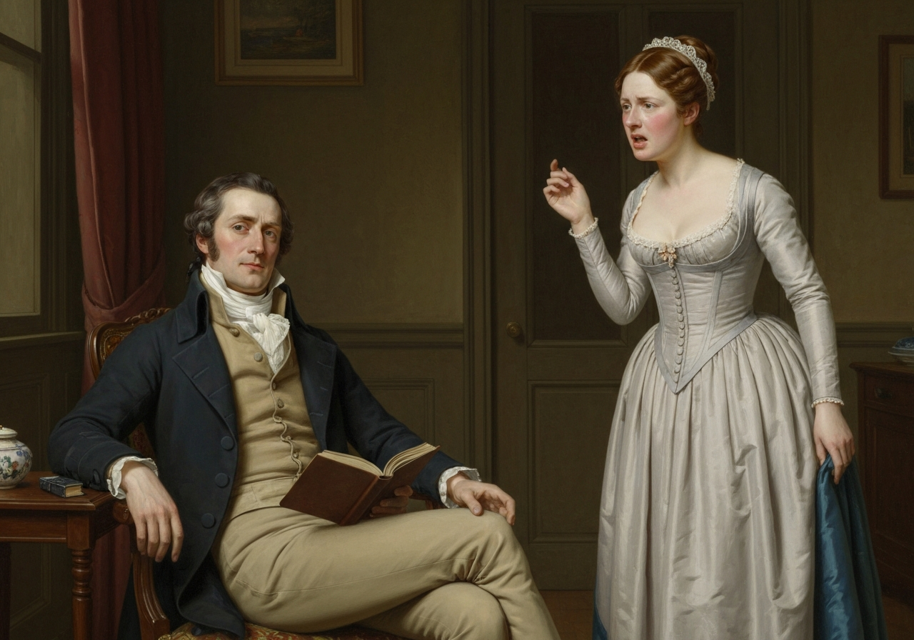

import Callout from '@/components/Callout.astro'

Elizabeth was sitting with her mother and sisters, reflecting on what
she had heard, and doubting whether she was authorized to mention it,
when Sir William Lucas himself appeared, sent by his daughter to
announce her engagement to the family.

<Callout title="Analysis" variant="explanation">
This chapter serves as a crucial turning point in the novel's social dynamic, as Charlotte Lucas's acceptance of Mr. Collins's proposal dismantles the careful social structure that Elizabeth believed existed between herself and her closest friend. Austen masterfully demonstrates how economic necessity overrides romantic ideals, particularly for women of limited means. Charlotte's pragmatic choice forces Elizabeth to confront the uncomfortable truth that her own privilege of refusing Collins was not universally available, a reality crystallized in the narrator's observation that Elizabeth felt persuaded that no real confidence could ever subsist between them again.
</Callout>

{/* metadata:IMG-001:start */}

{/* metadata:IMG-001:end */}

With many compliments to them,
and much self-gratulation on the prospect of a connection between the
houses, he unfolded the matter,--to an audience not merely wondering,
but incredulous; for Mrs. Bennet, with more perseverance than
politeness, protested he must be entirely mistaken; and Lydia, always
unguarded and often uncivil, boisterously exclaimed,--

{/* metadata:QT-001:start */}
<Callout title="Memorable Quote" variant="note">Good Lord! Sir William, how can you tell such a story? Do not you know that Mr. Collins wants to marry Lizzy?</Callout>
{/* metadata:QT-001:end */}

{/* metadata:IMG-002:start */}

{/* metadata:IMG-002:end */}

{/* metadata:QT-002:start */}
<Callout title="Memorable Quote" variant="note">Nothing less than the complaisance of a courtier could have borne without anger such treatment:</Callout>
{/* metadata:QT-002:end */}

but Sir William’s good-breeding carried
him through it all; and though he begged leave to be positive as to the
truth of his information, he listened to all their impertinence with the
most forbearing courtesy.

Elizabeth, feeling it incumbent on her to relieve him from so unpleasant
a situation, now put herself forward to confirm his account, by
mentioning her prior knowledge of it from Charlotte herself; and
endeavoured to put a stop to the exclamations of her mother and sisters,
by the earnestness of her congratulations to Sir William, in which she
was readily joined by Jane, and by making a variety of remarks on the
happiness that might be expected from the match, the excellent character
of Mr. Collins, and the convenient distance of Hunsford from London.

{/* metadata:IMG-003:start */}

{/* metadata:IMG-003:end */}

{/* metadata:AN-002:start */}
<Callout title="Analysis" variant="explanation">
Sir William Lucas's announcement scene exemplifies Austen's genius for dramatic irony and social comedy. The contrast between his courtly self-satisfaction and the Bennet family's incredulous reactions—particularly Lydia's boisterous outburst—creates a moment of pure theatrical comedy. Yet beneath the humor lies genuine pathos: Mrs. Bennet's perseverance in disbelief reveals her inability to accept that her carefully constructed matrimonial plans have collapsed, while Elizabeth steps forward to relieve the situation, feeling it incumbent on her to relieve him from so unpleasant a situation.
</Callout>
{/* metadata:AN-002:end */}

Mrs. Bennet was, in fact, too much overpowered to say a great deal while
Sir William remained; but no sooner had he left them than her feelings
found a rapid vent. In the first place, she persisted in disbelieving
the whole of the matter; secondly, she was very sure that Mr. Collins
had been taken in; thirdly, she trusted that they would never be happy
together; and, fourthly, that the match might be broken off. Two
inferences, however, were plainly deduced from the whole: one, that
Elizabeth was the real cause of all the mischief; and the other, that
she herself had been barbarously used by them all; and on these two
points she principally dwelt during the rest of the day. Nothing could
console and nothing appease her. Nor did that day wear out her
resentment.

{/* metadata:IMG-004:start */}

{/* metadata:IMG-004:end */}

{/* metadata:QT-003:start */}
<Callout title="Memorable Quote" variant="note">A week elapsed before she could see Elizabeth without scolding her: a month passed away before she could speak to Sir William or Lady Lucas without being rude; and many months were gone before she could at all forgive their daughter.</Callout>
{/* metadata:QT-003:end */}

<Callout title="Analysis" variant="explanation">
    The psychological deterioration of Mrs. Bennet throughout this chapter represents one of Austen's most acute studies of anxiety and social humiliation. Her systematic rejection strategies—disbelief, blame, hope of broken engagement, and finally resentment directed at Elizabeth—mirror the stages of grief. The detail that a week elapsed before she could see Elizabeth without scolding her and many months were gone before she could at all forgive their daughter transforms domestic comedy into something genuinely unsettling, exposing how maternal affection in this household is conditional upon social advancement.
</Callout>

Mr. Bennet’s emotions were much more tranquil on the occasion, and such
as he did experience he pronounced to be of a most agreeable sort; for
it gratified him, he said, to discover that
{/* metadata:QT-004:start */}
<Callout title="Memorable Quote" variant="note">
    Charlotte Lucas, whom he had been used to think tolerably sensible, was as foolish as his wife, and more foolish than his daughter!
</Callout>
{/* metadata:QT-004:end */}

{/* metadata:AN-003:start */}
<Callout title="Analysis" variant="explanation">
Mr. Bennet's response to the engagement provides devastating commentary on both his wife and his neighbor. His declaration that Charlotte is as foolish as his wife, and more foolish than his daughter operates on multiple levels: it validates Elizabeth's intelligence while simultaneously revealing Mr. Bennet's own failings as a parent who prizes wit over practical wisdom. His tranquil amusement at others' misfortunes reflects his characteristic emotional detachment, suggesting that his fondness for Elizabeth is partly self-serving—she validates his intellectual superiority over the rest of the household.
</Callout>
{/* metadata:AN-003:end */}

{/* metadata:IMG-005:start */}

{/* metadata:IMG-005:end */}

Jane confessed herself a little surprised at the match: but she said
less of her astonishment than of her earnest desire for their happiness;
nor could Elizabeth persuade her to consider it as improbable. Kitty and
Lydia were far from envying Miss Lucas, for Mr. Collins was only a
clergyman; and it affected them in no other way than as a piece of news
to spread at Meryton.

Lady Lucas could not be insensible of triumph on being able to retort on
Mrs. Bennet the comfort of having a daughter well married; and she
called at Longbourn rather oftener than usual to say how happy she was,
though Mrs. Bennet’s sour looks and ill-natured remarks might have been
enough to drive happiness away.

Between Elizabeth and Charlotte there was a restraint which kept them
mutually silent on the subject; and Elizabeth felt persuaded that no
real confidence could ever subsist between them again.

{/* metadata:AN-006:start */}
<Callout title="Analysis" variant="explanation">
The strained friendship between Elizabeth and Charlotte contains some of Austen's most nuanced writing about female relationships. The restraint which kept them mutually silent on the subject suggests that both women recognize the unspoken contract of their friendship has been violated: Charlotte has chosen security over the shared values Elizabeth assumed they held, while Elizabeth must confront her own presumption of superiority in judging Charlotte's decision. The statement that no real confidence could ever subsist between them again marks a genuine tragedy within the comic framework of the chapter.
</Callout>
{/* metadata:AN-006:end */}

{/* metadata:QT-005:start */}
<Callout title="Memorable Quote" variant="note">Her disappointment in Charlotte made her turn with fonder regard to her sister, of whose rectitude and delicacy she was sure her opinion could never be shaken.</Callout>
{/* metadata:QT-005:end */}

Jane had sent Caroline an early answer to her letter, and was counting
the days till she might reasonably hope to hear again. The promised
letter of thanks from Mr. Collins arrived on Tuesday, addressed to their
father, and written with all the solemnity of gratitude which a
twelve-month’s abode in the family might have prompted.

{/* metadata:IMG-006:start */}

{/* metadata:IMG-006:end */}

After discharging his conscience on that head, he proceeded to inform them,
with many rapturous expressions, of his happiness in having obtained the
affection of their amiable neighbour, Miss Lucas, and then explained
that it was merely with the view of enjoying her society that he had
been so ready to close with their kind wish of seeing him again at
Longbourn, whither he hoped to be able to return on Monday fortnight;
for Lady Catherine, he added, so heartily approved his marriage, that
she wished it to take place as soon as possible, which he trusted would
be an unanswerable argument with his amiable Charlotte to name an early
day for making him the happiest of men.

Mr. Collins’s return into Hertfordshire was no longer a matter of
pleasure to Mrs. Bennet. On the contrary, she was as much disposed to
complain of it as her husband. It was very strange that he should come
to Longbourn instead of to Lucas Lodge; it was also very inconvenient
and exceedingly troublesome. She hated having visitors in the house
while her health was so indifferent, and lovers were of all people the
most disagreeable. Such were the gentle murmurs of Mrs. Bennet, and they
gave way only to the greater distress of Mr. Bingley’s continued
absence.

{/* metadata:AN-005:start */}
<Callout title="Analysis" variant="explanation">
The parallel narratives of Collins's engagement and Bingley's absence create a sophisticated interlacing of social plots. Jane's silent suffering—whatever she felt she was desirous of concealing—provides a foil to Mrs. Bennet's ostentatious distress. Elizabeth's growing suspicion that his sisters would be successful in keeping him away introduces the novel's secondary antagonist—social manipulation and class consciousness—while her acknowledgment that Jane's lover might prove unstable foreshadows the revelation of Darcy's interference later in the novel.
</Callout>
{/* metadata:AN-005:end */}

Neither Jane nor Elizabeth were comfortable on this subject. Day after
day passed away without bringing any other tidings of him than the
report which shortly prevailed in Meryton of his coming no more to
Netherfield the whole winter; a report which highly incensed Mrs.
Bennet, and which she never failed to contradict as a most scandalous
falsehood.

Even Elizabeth began to fear--not that Bingley was indifferent--but that
his sisters would be successful in keeping him away. Unwilling as she
was to admit an idea so destructive to Jane’s happiness, and so
dishonourable to the stability of her lover, she could not prevent its
frequently recurring.
{/* metadata:QT-006:start */}
<Callout title="Memorable Quote" variant="note">
    The united efforts of his two unfeeling sisters, and of his overpowering friend, assisted by the attractions of Miss Darcy and the amusements of London, might be too much, she feared, for the strength of his attachment.
</Callout>
{/* metadata:QT-006:end */}

As for Jane, _her_ anxiety under this suspense was, of course, more
painful than Elizabeth’s: but whatever she felt she was desirous of
concealing; and between herself and Elizabeth, therefore, the subject
was never alluded to. But as no such delicacy restrained her mother, an
hour seldom passed in which she did not talk of Bingley, express her
impatience for his arrival, or even require Jane to confess that if he
did not come back she should think herself very ill-used. It needed all
Jane’s steady mildness to bear these attacks with tolerable
tranquillity.

Mr. Collins returned most punctually on the Monday fortnight, but his
reception at Longbourn was not quite so gracious as it had been on his
first introduction. He was too happy, however, to need much attention;
and, luckily for the others, the business of love-making relieved them
from a great deal of his company. The chief of every day was spent by
him at Lucas Lodge, and he sometimes returned to Longbourn only in time
to make an apology for his absence before the family went to bed.

Mrs. Bennet was really in a most pitiable state. The very mention of
anything concerning the match threw her into an agony of ill-humour, and
wherever she went she was sure of hearing it talked of. The sight of
Miss Lucas was odious to her. As her successor in that house, she
regarded her with jealous abhorrence. Whenever Charlotte came to see
them, she concluded her to be anticipating the hour of possession; and
whenever she spoke in a low voice to Mr. Collins, was convinced that
they were talking of the Longbourn estate, and resolving to turn herself
and her daughters out of the house as soon as Mr. Bennet was dead. She
complained bitterly of all this to her husband.

“Indeed, Mr. Bennet,” said she, “it is very hard to think that Charlotte
Lucas should ever be mistress of this house, that _I_ should be forced
to make way for _her_, and live to see her take my place in it!”

{/* metadata:QT-007:start */}
<Callout title="Memorable Quote" variant="note">“My dear, do not give way to such gloomy thoughts. Let us hope for better things. Let us flatter ourselves that _I_ may be the survivor.”</Callout>
{/* metadata:QT-007:end */}

{/* metadata:IMG-007:start */}

{/* metadata:IMG-007:end */}

This was not very consoling to Mrs. Bennet; and, therefore, instead of
making any answer, she went on as before.

“I cannot bear to think that they should have all this estate. If it was
not for the entail, I should not mind it.”

“What should not you mind?”

“I should not mind anything at all.”

“Let us be thankful that you are preserved from a state of such
insensibility.”

“I never can be thankful, Mr. Bennet, for anything about the entail. How
anyone could have the conscience to entail away an estate from one’s own
daughters I cannot understand; and all for the sake of Mr. Collins, too!
Why should _he_ have it more than anybody else?”

“I leave it to yourself to determine,” said Mr. Bennet.

{/* metadata:AN-007:start */}
<Callout title="Analysis" variant="explanation">
Mr. Bennet's final exchange with his wife regarding the entail demonstrates the nuances of their relationship. Mrs. Bennet's fixation on the material loss—the estate, her position, Charlotte as usurper—contrasts with Mr. Bennet's macabre dry humor at her expense about hoping to outlive her. His declaration 'Let us flatter ourselves that I may be the survivor' is simultaneously a jest, a threat, and an admission of marital misery, and the chapter ends on this unresolved bitterness with his cryptic 'I leave it to yourself to determine' suggesting both abdication of responsibility and weary contempt.
</Callout>
{/* metadata:AN-007:end */}
