import Callout from '@/components/Callout.astro'

[Illustration]

Miss Bingley’s letter arrived,

{/* metadata:image_001:start */}
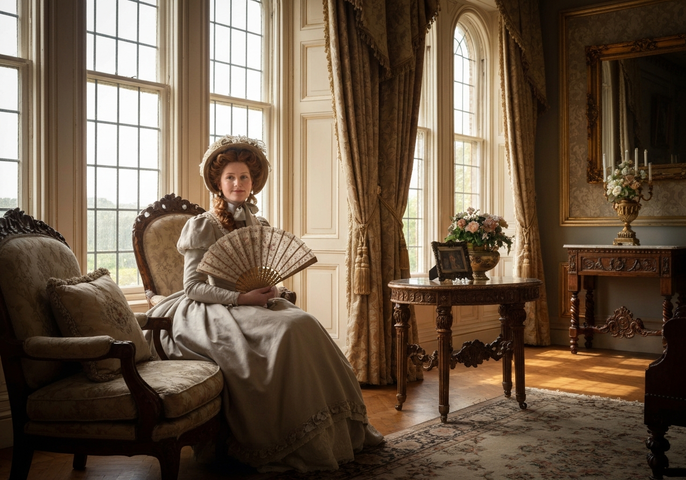

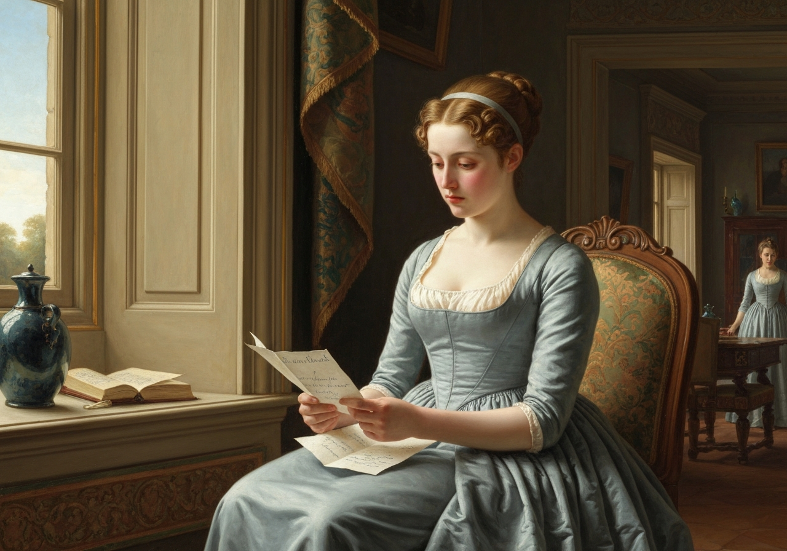
{/* metadata:image_001:end */}

 and put an end to doubt. The very first
sentence conveyed the assurance of their being all settled in London for
the winter, and concluded with her brother’s regret at not having had
time to pay his respects to his friends in Hertfordshire before he left
the country.

{/* metadata:analysis_001:start */}
<Callout title="Analysis" variant="explanation">
The letter's devastating impact is immediately established through its opening, which efficiently communicates multiple layers of disappointment: physical removal to London, temporal permanence ('for the winter'), and social indifference. Miss Bingley's calculated framing—mentioning her brother's 'regret' without substance—reveals her manipulative courtesy while maintaining plausible deniability. The letter's true purpose, however, is to promote Miss Darcy as Bingley's future bride, and Austen exposes this design through Elizabeth's clear-eyed reading of Caroline's motives.
</Callout>
{/* metadata:analysis_001:end */}

{/* metadata:quote_001:start */}
<Callout title="Memorable Quote" variant="note">Hope was over, entirely over;</Callout>
{/* metadata:quote_001:end */} and when Jane could attend to the rest of
the letter, she found little, except the professed affection of the
writer, that could give her any comfort. Miss Darcy’s praise occupied
the chief of it. Her many attractions were again dwelt on; and Caroline
boasted joyfully of their increasing intimacy, and ventured to predict
the accomplishment of the wishes which had been unfolded in her former
letter. She wrote also with great pleasure of her brother’s being an
inmate of Mr. Darcy’s house, and mentioned with raptures some plans of
the latter with regar

{/* metadata:image_002:start */}
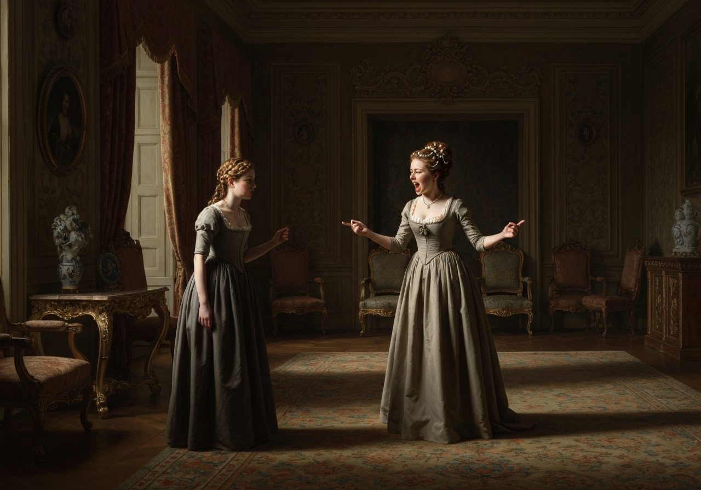

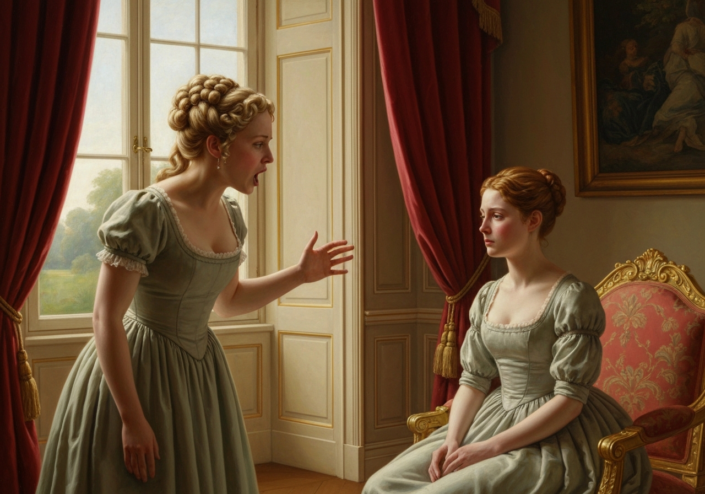
{/* metadata:image_002:end */}

d to new furniture.

Elizabeth, to whom Jane very soon communicated the chief of all this,
heard it in silent indignation. {/* metadata:quote_002:start */}
<Callout title="Memorable Quote" variant="note">Her heart was divided between concern for her sister and resentment against all others.</Callout>
{/* metadata:quote_002:end */} To Caroline’s
assertion of her brother’s being partial to Miss Darcy, she paid no
credit. That he was really fond of Jane, she doubted no more than she
had ever done; and much as she had always been disposed to like him, she
could not think without anger, hardly without contempt, on that easiness
of temper, that want of proper resolution, which now made him the slave
of his designing friends, and led him to sacrifice his own happiness to
the caprice of their inclinations. Had his own happiness, however, been
the only sacrifice, he might have been allowed to sport with it in
whatever manner he thought best; but her sister’s was involved in it, as
she thought he must be sensible himself. It was a subject, in short, on
which reflection would be long indulged, and must be unavailing. She
could think of nothing else; and yet, whether Bingley’s regard had
really died away, or were suppressed by his friends’ interference;
whether he had been aware of Jane’s attachment, or whether it had
escaped his observation; whichever were the case, though her opinion of
him must be materially affected by the difference, her sister’s
situation remained the same, her peace equally wounded.

A day or two passed before Jane had courage to speak of her feelings to
Elizabeth; but at last, on Mrs. Bennet’s leaving them together, after a
longer irritation than usual about Netherfield and its master, she could
not help saying,--

“O that my dear mother had more command over herself! she can have no
idea of the pain she gives me by her continual reflec

{/* metadata:image_003:start */}
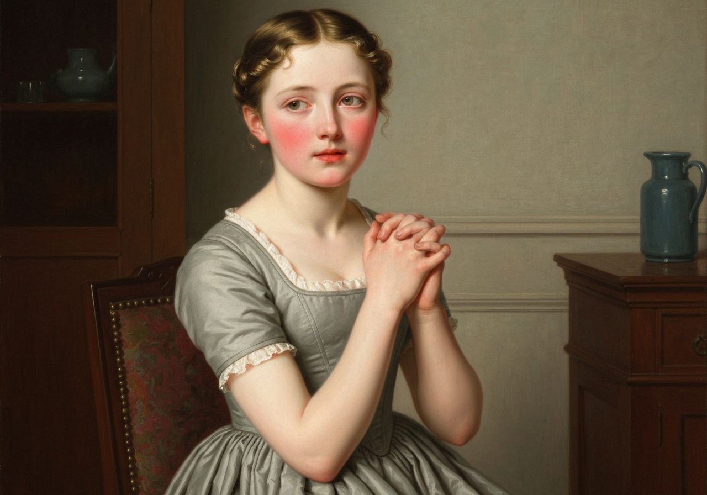

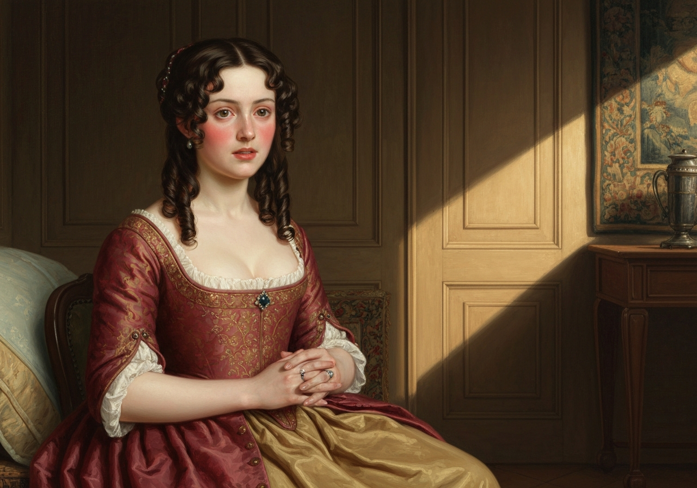
{/* metadata:image_003:end */}

tions on him. But I
will not repine. It cannot last long. He will be forgot, and we shall
all be as we were before.”

Elizabeth looked at her sister with incredulous solicitude, but said
nothing.

“You doubt me,” cried Jane, slightly colouring; “indeed, you have no
reason. He may live in my memory as the most amiable man of my
acquaintance but that is all. I have nothing either to hope or fear, and
nothing to reproach him with. Thank God I have not _that_ pain. A little
tim

{/* metadata:analysis_002:start */}
<Callout title="Analysis" variant="explanation">
Jane's stoic response to emotional devastation demonstrates her characteristic 'angelic' virtue, but Elizabeth's perspective reveals the psychological cost of such passivity. Jane's attempt to minimize her feelings ('It cannot last long') and recast the experience as 'an error of fancy on my side' represents a coping mechanism that Elizabeth recognizes as potentially self-erasing. The slight colouring that betrays Jane as she speaks underscores the gap between her professed composure and her genuine suffering.
</Callout>
{/* metadata:analysis_002:end */}

e, therefore--I shall certainly try to get the better----”

With a stronger voice she soon added, “I have this comfort immediately,
that it has not been more than an error of fancy on my side, and that it
has done no harm to anyone but myself.”

“My dear Jane,” exclaimed Elizabeth, “you are too good. {/* metadata:quote_003:start */}
<Callout title="Memorable Quote" variant="note">Your sweetness and disinterestedness are really angelic; I do not know what to say to you.</Callout>
{/* metadata:quote_003:end */} I feel as if I had never done you justice, or loved you as you
deserve.”

Miss Bennet eagerly disclaimed all extraordinary merit, and threw back
the praise on her sister’s warm affection.

“Nay,” said Elizabeth, “this is not fair. _You_ wish to think all the
world respectable, and are hurt if I speak ill of anybody. _I_ only want
to think _you_ perfect, and you set yourself against it. Do not be
afraid of my running into any excess, of my encroaching on your
privilege of universal good-will. You need not. There are few people
whom I really love, and still fewer of whom I think well. {/* metadata:quote_004

{/* metadata:analysis_003:start */}
<Callout title="Analysis" variant="explanation">
The dialogue between Elizabeth and Jane crystallizes their opposing worldviews: Jane's universal charity versus Elizabeth's discriminating judgment. Elizabeth's declaration—'The more I see of the world the more am I dissatisfied with it'—signals her philosophical maturation and establishes the thematic tension between idealism and cynicism that runs through the novel. Her identification of two recent instances of disillusionment—Charlotte's marriage and Bingley's conduct—links the personal and the moral in a single sweeping indictment.
</Callout>
{/* metadata:analysis_003:end */}

{/* metadata:image_004:start */}
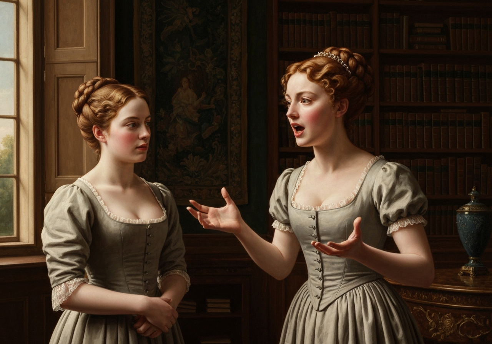

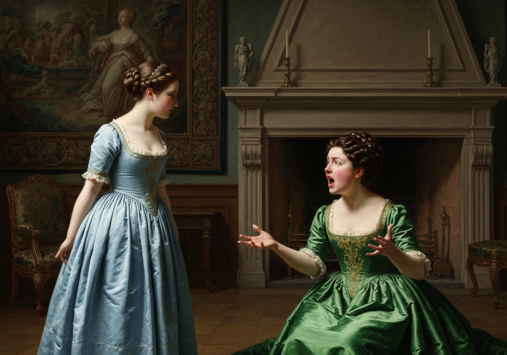
{/* metadata:image_004:end */}

:start */}
<Callout title="Memorable Quote" variant="note">The more I see of the world the more am I dissatisfied with it;</Callout>
{/* metadata:quote_004:end */} I have met with two instances lately: one I will not mention,
the other is Charlotte’s marriage. It is unaccountable! in every view it
is unaccountable!”

“My dear Lizzy, do not give way to such feelings as these. They will
ruin your happiness. You do not make allowance enough for difference of
situation and temper. Consider Mr. Collins’s respectability, and
Charlotte’s prudent, steady character. Remember that she is one of a
large family; that as to fortune it is a most eligible match; and be
ready to believe, for everybody’s sake, that she may feel something like
regard and esteem for our cousin.”

“To oblige you, I would try to believe almost anything, but no one else
could be benefited by such a belief as this; for were I persuaded that
Charlotte had any regard for him, I should only think worse of her
understanding than I now do of her heart. My dear Jane, Mr. Collins is a
conceited, pompous, narrow-minded, silly man: you know he is, as well as
I do; and you must feel, as well as I do, that the woman who marries him
cannot have a proper way of thinking. You shall not defend her, though
it is Charlotte Lucas. {/* metadata:quote_005:start */}
<Callout title="Memorable Quote" variant="note">You shall not, for the sake of one individual, change the meaning of principle and integrity,</Callout>
{/* metadata:quote_005:end */}

{/* metadata:analysis_004:start */}
<Callout title="Analysis" variant="explanation">
Elizabeth's critique of Charlotte's marriage represents a profound moment of moral disillusionment. Her refusal to accept Jane's charitable interpretation demonstrates her unwillingness to compromise on principles, rejecting the equation of 'selfishness' with 'prudence' that would sanitize pragmatic marriages. The force of her language—'conceited, pompous, narrow-minded, silly man'—reveals how deeply the betrayal of a friend's integrity wounds her, beyond any mere social disappointment.
</Callout>
{/* metadata:analysis_004:end */}

“I must think your language too strong in speaking of both,” replied
Jane; “and I hope you will be convinced of it, by seeing them happy
together. But enough of this. You alluded to something else. You
mentioned _two_ instances. I cannot misunderstand you, but I entreat
you, dear Lizzy, not to pain me by thinking _that person_ to blame, and
saying your opinion of him is sunk. We must not be so ready to fancy
ourselves intentionally injured. We must not expect a lively young man
to be always so guarded and circumspect. It is very often nothing but
our own vanity that deceives us. Women fancy admiration means more than
it does.”

“And men take care that they should.”

“If it is designedly done, they cannot be justified; but I have no idea
of there being so much design in the world as some persons imagine.”

“I am far from attributing any part of Mr. Bingley’s conduct to design,”
said Elizabeth; “but, without scheming to do wrong, or to make others
unhappy, there may be error and there may be misery. Thoughtlessness,
want of attention to other people’s feelings, and want of resolution,
will do the business.”

“And do you impute it to either of those?”

“Yes; to the last. But if I go on I shall displease you by saying what I
think of persons you esteem. Stop me, whilst you can.”

“You persist, then, in supposing his sisters influence him?”

“Yes, in conjunction with his friend.”

“I cannot believe it. Why should they try to influence him? They can
only wish his happiness; and if he is attached to me no other woman can
secure it.”

“Your first position is false. They may wish many things besides his
happiness: they may wish his increase of wealth and consequence; they
may wish him to marry a girl who has all the importance of mon

{/* metadata:analysis_005:start */}
<Callout title="Analysis" variant="explanation">
Jane's defense of Bingley's sisters introduces the novel's examination of sibling loyalty and class prejudice. Her argument that 'whatever may be their own wishes, it is very unlikely they should have opposed their brother's' reveals her inability to comprehend calculated interference in affairs of the heart, contrasting sharply with Elizabeth's more cynical understanding of familial manipulation. Jane's insistence on taking the matter 'in the light in which it may be understood' is both her greatest virtue and her most dangerous blind spot.
</Callout>
{/* metadata:analysis_005:end */}

{/* metadata:image_005:start */}
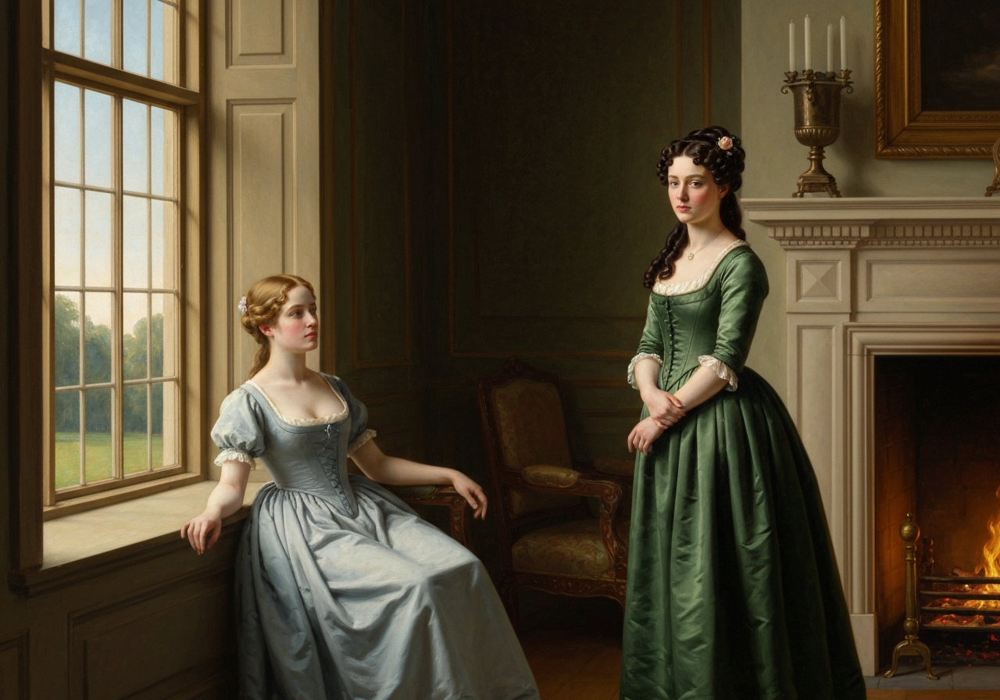

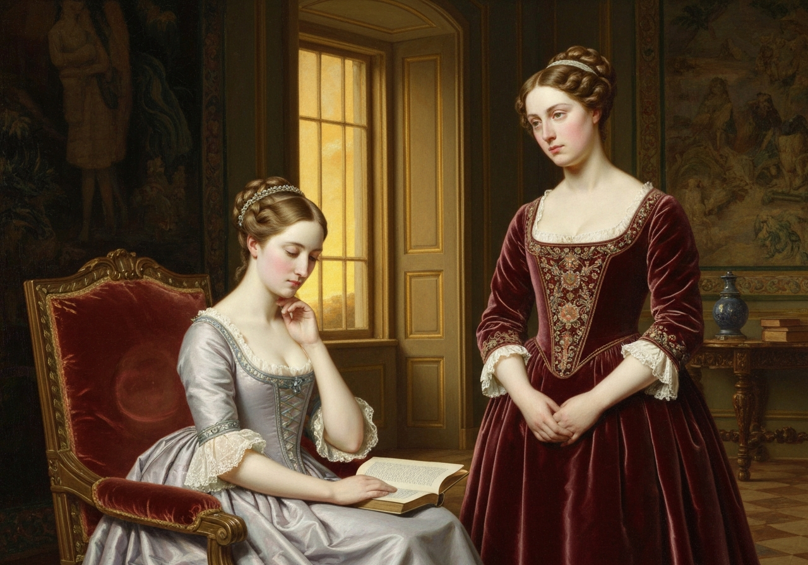
{/* metadata:image_005:end */}

ey, great
connections, and pride.”

“Beyond a doubt they do wish him to choose Miss Darcy,” replied Jane;
“but this may be from better feelings than you are supposing. They have
known her much longer than they have known me; no wonder if they love
her better. But, whatever may be their own wishes, it is very unlikely
they should have opposed their brother’s. What sister would think
herself at liberty to do it, unless there were something very
objectionable? If they believed him attached to me they would not try to
part us; if he were so, they could not succeed. By supposing such an
affection, you make everybody acting unnaturally and wrong, and me most
unhappy. Do not distress me by the idea. I am not ashamed of having been
mistaken--or, at least, it is slight, it is nothing in comparison of
what I should feel in thinking ill of him or his sisters. Let me take it
in the best light, in the light in which it may be understood.”

Elizabeth could not oppose such a wish; and from this time Mr. Bingley’s
name was scarcely ever mentioned between them.

Mrs. Bennet still continued to wonder and repine at his returning no
more; and though a day seldom passed in which Elizabeth did not account
for it clearly, there seemed little chance of her ever considering it
with less perplexity. Her daughter endeavoured to c

{/* metadata:analysis_006:start */}
<Callout title="Analysis" variant="explanation">
Mr. Bennet's sardonic response to Jane's disappointment exemplifies his characteristic irony and emotional withdrawal. His observation that being 'crossed in love' gives a girl 'a sort of distinction among her companions' provides bitter commentary on the limited scope of women's experiences and his own inability to address genuine suffering. The suggestion that Wickham would 'jilt you creditably' is darkly prophetic, foreshadowing the very real danger Wickham will later pose to the Bennet family.
</Callout>
{/* metadata:analysis_006:end */}

{/* metadata:image_006:start */}
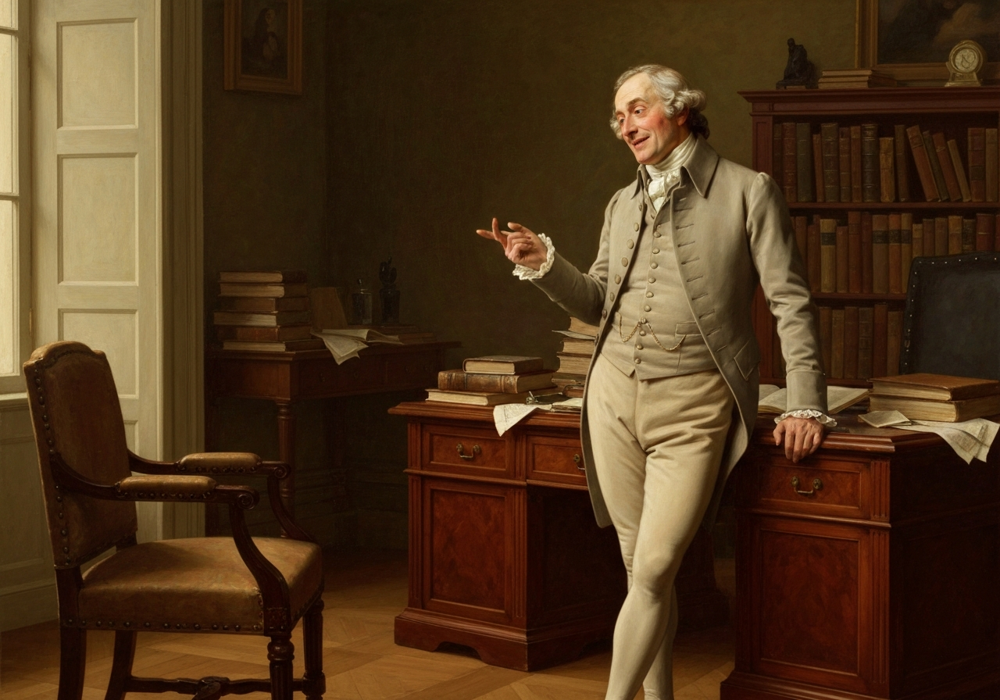

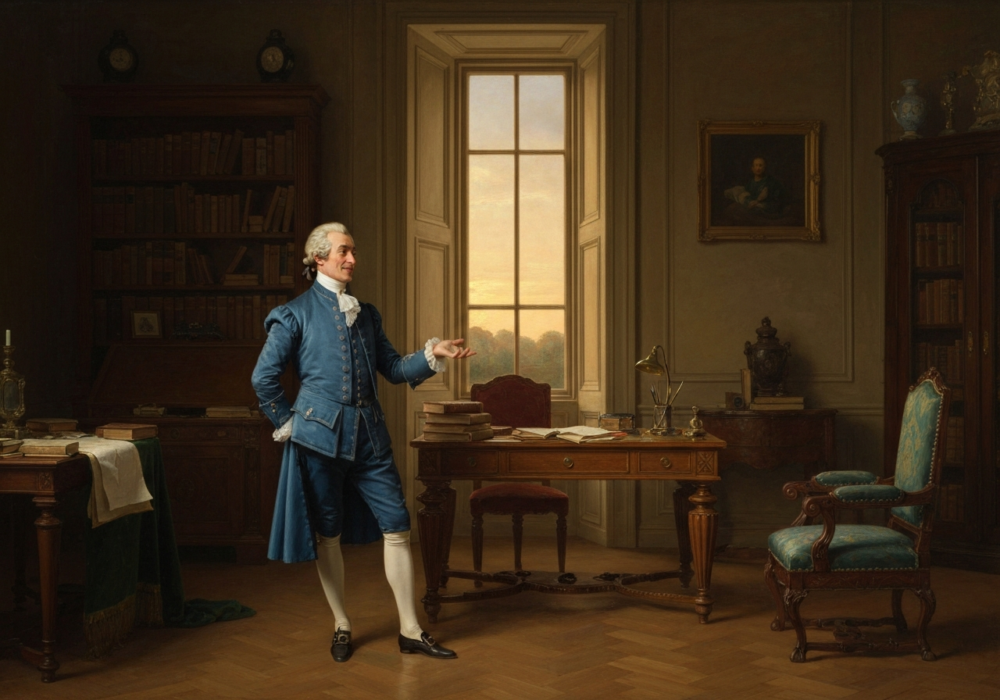
{/* metadata:image_006:end */}

onvince her of what
she did not believe herself, that his attentions to Jane had been merely
the effect of a common and transient liking, which ceased when he saw
her no more; but though the probability of the statement was admitted at
the time, she had the same story to repeat every day. Mrs. Bennet’s best
comfort was, that Mr. Bingley must be down again in the summer.

Mr. Bennet treated the matter differently. “So, Lizzy,” said he, one
day, “your sister is crossed in love, I find. I congratulate her. {/* metadata:quote_006:start */}
<Callout title="Memorable Quote" variant="note">Next to being married, a girl likes to be crossed in love a little now and then.</Callout>
{/* metadata:quote_006:end */} It is something to think of, and gives her a sort of distinction
among her companions. When is your turn to come? You will hardly bear to
be long outdone by Jane. Now is your time. Here are officers enough at
Meryton to disappoint all the young ladies in the country. Let Wickham
be your man. He is a pleasant fellow, and would jilt you creditably.”

“Thank you, sir, but a less agreeable man would satisfy me. We

{/* metadata:analysis_007:start */}
<Callout title="Analysis" variant="explanation">
The chapter concludes by positioning Wickham as the beneficiary of Darcy's vilification, while isolating Jane as the sole voice of charitable doubt. This narrative development establishes the growing social dimensions of the Bingley-Darcy conflict and foreshadows the complications Elizabeth's prejudice will create. Jane's mild candour, which 'always pleaded for allowances,' stands as a quiet moral counterweight to the community's eager condemnation of Darcy as the worst of men.
</Callout>
{/* metadata:analysis_007:end */}

{/* metadata:image_007:start */}
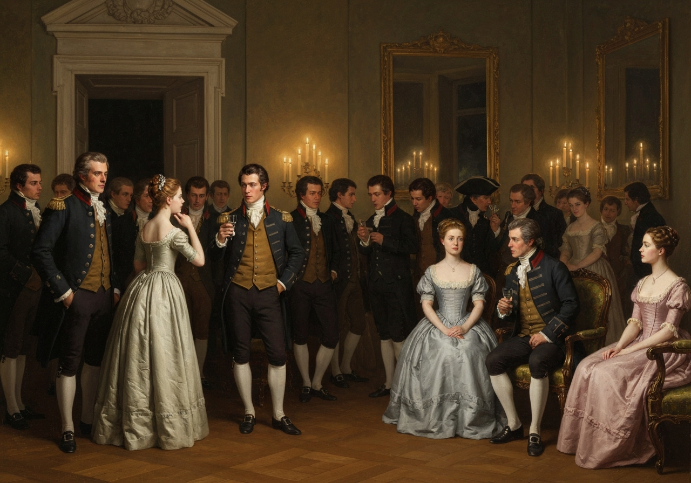

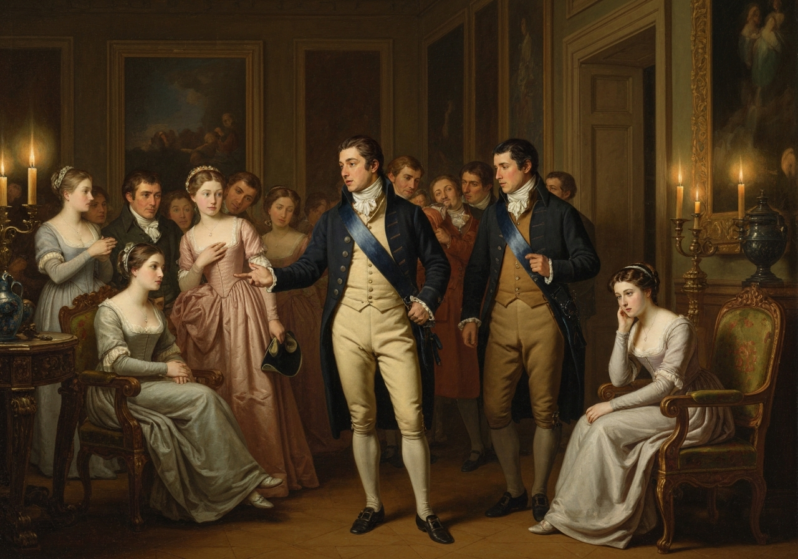
{/* metadata:image_007:end */}

 must not
all expect Jane’s good fortune.”

“True,” said Mr. Bennet; “but it is a comfort to think that, whatever of
that kind may befall you, you have an affectionate mother who will
always make the most of it.”

Mr. Wickham’s society was of material service in dispelling the gloom
which the late perverse occurrences had thrown on many of the Longbourn
family. They saw him often, and to his other recommendations was now
added that of general unreserve. The whole of what Elizabeth had already
heard, his claims on Mr. Darcy, and all that he had suffered from him,
was now openly acknowledged and publicly canvassed; and {/* metadata:quote_007:start */}
<Callout title="Memorable Quote" variant="note">everybody was pleased to think how much they had always disliked Mr. Darcy before they had known anything of the matter.</Callout>
{/* metadata:quote_007:end */}

Miss Bennet was the only creature who could suppose there might be any
extenuating circumstances in the case unknown to the society of
Hertfordshire: her mild and steady candour always pleaded for
allowances, and urged the possibility of mistakes; but by everybody else
Mr. Darcy was condemned as the worst of men.

[Illustration]
