import Callout from '@/components/Callout.astro'

[Illustration]

{/* metadata:quote_001:start */}
<Callout title="Memorable Quote" variant="note">After a week spent in professions of love and schemes of felicity, Mr. Collins was called from his amiable Charlotte by the arrival of Saturday.</Callout>
{/* metadata:quote_001:end */}

{/* metadata:analysis_007:start */}
<Callout title="Analysis" variant="explanation">
The chapter concludes with a revelation that appears to confirm Elizabeth's prejudice against Darcy while also establishing Mrs. Gardiner's credibility as a source. Her recollection of young Darcy as a 'very proud, ill-natured boy' 

{/* metadata:analysis_001:start */}
<Callout title="Analysis" variant="explanation">
This chapter opens with Mr. Collins's departure, characterized by Austen's characteristic irony. His 'professions of love and schemes of felicity' for Charlotte contrast starkly with his previous declarations to Elizabeth, revealing his fickle nature and the comedy of his romantic posturing. The solemnity of his leave-taking is rendered absurd by our knowledge of his recent transfer of affections.
</Callout>
{/* metadata:analysis_001:end */}

{/* metadata:image_001:start */}
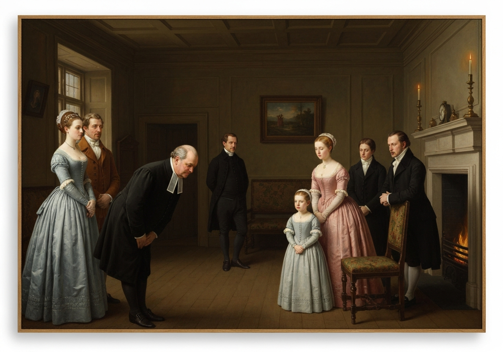

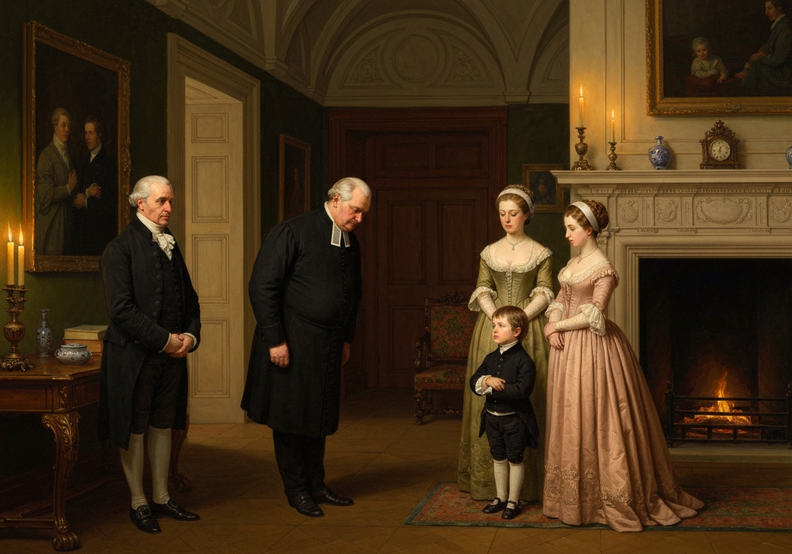
{/* metadata:image_001:end */}

seems to validate Wickham's account, yet the careful reader notes this is childhood hearsay filtered through decades of memory. This positioning of information creates complex layers of reliability and bias that drive the narrative forward.
</Callout>
{/* metadata:analysis_007:end */}

{/* metadata:image_007:start */}
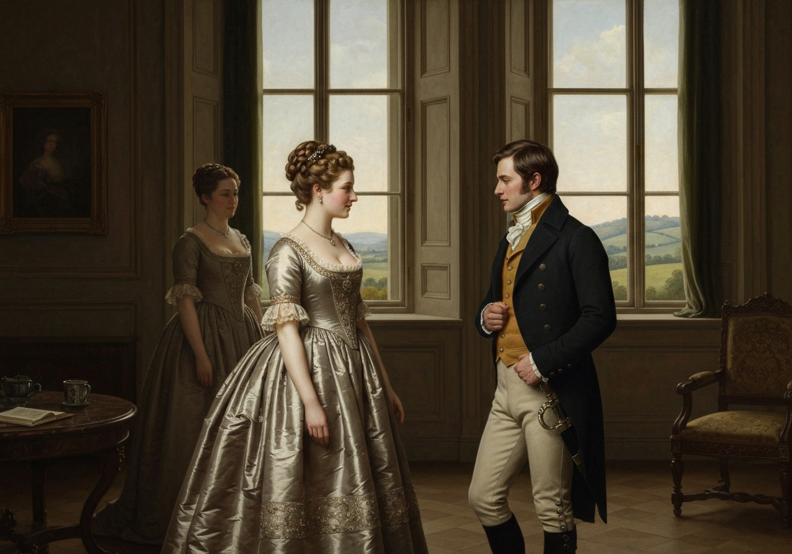

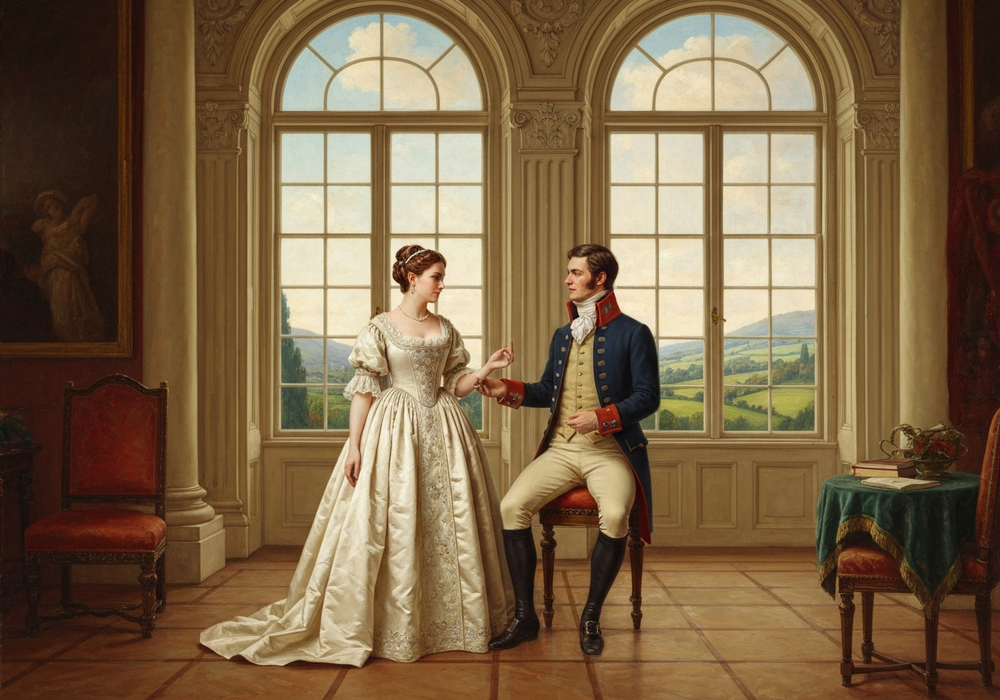
{/* metadata:image_007:end */}

 The pain of separation, however, might be alleviated on his
side by preparations for the reception of his bride, as he had reason to
hope, that shortly after his next return into Hertfordshire, the day
would be fixed that was to make him the happiest of men. He took leave
of his relations at Longbourn with as much solemnity as before; wished
his fair cousins health and happiness again, and promised their father
another letter of thanks.

On the following Monday, Mrs. Bennet had the pleasure of receiving her
brother and his wife, who came, as usual, to spend the Christmas at
Longbourn. {/* metadata:quote_002:start */}
<Callout title="Memorable Quote" variant="note">Mr. Gardiner was a sensible, gentlemanlike man, greatly superior to his sister, as well by nature as education.</Callout>
{/* metadata:quote_002:end */} The Netherfield
ladies would have had difficulty in believing that a man who lived by
trade, and within view of his own warehouses, could have been so
well-bred and agreeable. Mrs. Gardiner, who was several years younger
than Mrs. Bennet and Mrs. Philips, was an amiable, intelligent, elegant
woman, and a great favourite with her Longbourn nieces. Between the two
eldest and herself especially, there subsisted a very particular regard.
They had frequently been staying with her in town.

The first part of Mrs. Gardiner’s busines

{/* metadata:analysis_003:start */}
<Callout title="Analysis" variant="explanation">
Mrs. Bennet's complaint to her sister reveals the depths of her mercenary worldview and her inability to understand her daughters' emotions. Her grievances focus entirely on social competition with the Lucases rather than any genuine concern for Elizabeth's happiness. The phrase 'Two of her girls had been on the point of marriage, and after all there was nothing in it' encapsulates her reduction of romantic relationships to social transactions.
</Callout>
{/* metadata:analysis_003:end */}

{/* metadata:image_003:start */}

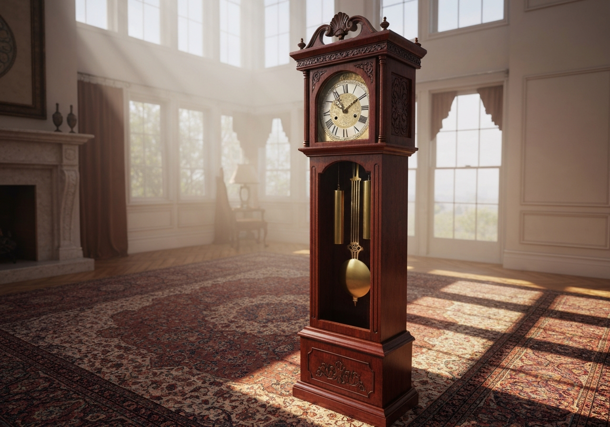
{/* metadata:image_003:end */}

s, on her arrival, was to
distribute her presents and describe the newest fashions. When this was
done, she had a less active part to play. It became her turn to listen.
Mrs. Bennet had many grievances to relate, and much to complain of. They
had all been very ill-used since she last saw her sister. {/* metadata:quote_003:start */}
<Callout title="Memorable Quote" variant="note">Two of her girls had been on the point of

{/* metadata:image_004:start */}
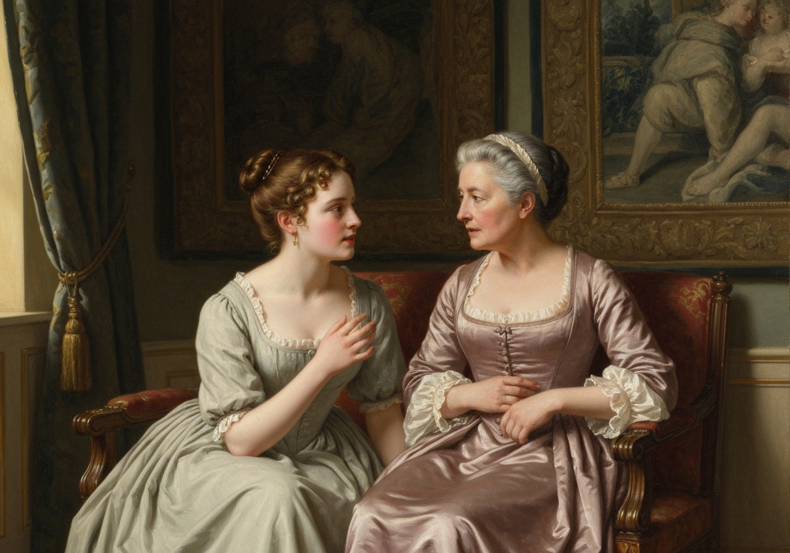

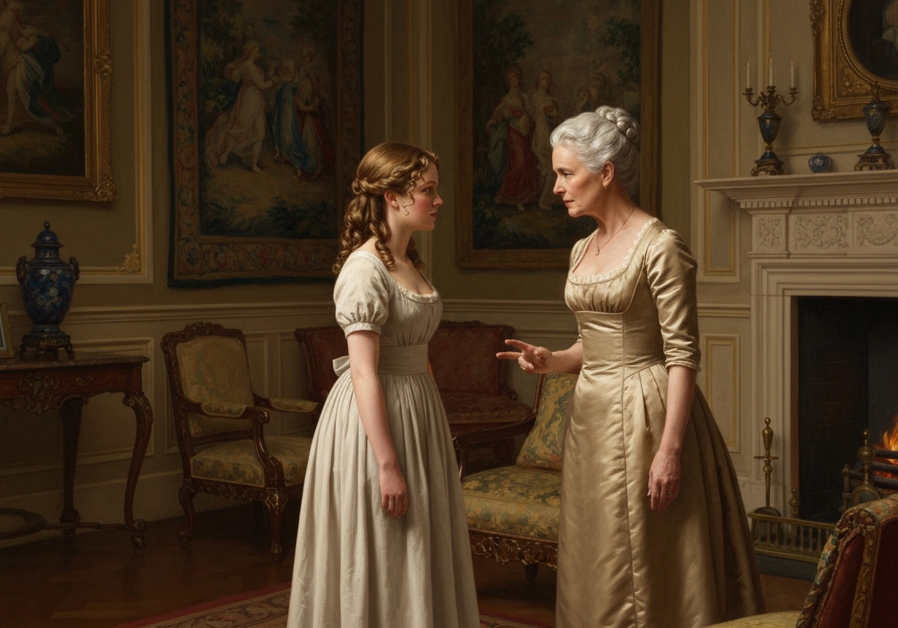
{/* metadata:image_004:end */}

 marriage, and after all there was nothing in it.</Callout>
{/* metadata:quote_003:end */}

“I do not blame Jane,” she continued, “for Jane would have got Mr.
Bingley if she could. But, Lizzy! Oh, sister! it is very hard to think
that she might have been Mr. Collins’s wife by this time, had not it
been for her own perverseness. He made her an offer in this very room,
and she refused him. The consequence of it is, that Lady Lucas will have
a daughter married before I have, and that Longbourn estate is just as
much entailed as ever. The Lucases are very artful people, indeed,
sister. They are all for what they can get. 

{/* metadata:analysis_004:start */}
<Callout title="Analysis" variant="explanation">
The conversation between Mrs. Gardiner and Elizabeth regarding Jane's disappointment introduces one of the novel's central philosophical tensions: the nature of romantic attachment. Mrs. Gardiner presents a cynical view of young men's inconstancy, while Elizabeth counters with a more nuanced understanding of Bingley's specific situation, revealing her growing insight into human character and social machinations. Elizabeth's insistence that 'we do not suffer by accident' marks her refusal to accept a comfortable but false explanation for Jane's pain.
</Callout>
{/* metadata:analysis_004:end */}

I am sorry to say it of
them, but so it is. It makes me very nervous and poorly, to be thwarted
so in my own family, and to have neighbours who think of themselves
before anybody else. However, your coming just at this time is the
greatest of comforts, and I am very glad to hear what you tell us of
long sleeves.”

Mrs. Gardiner, to whom the chief of this news had been given before, in
the course of Jane and Elizabeth’s correspondence with her, made her
sister a slight answer, and, in compassion to her nieces, turned the
conversation.

When alone with Elizabeth afterwards, she spoke more on the subject.
“I

{/* metadata:image_005:start */}
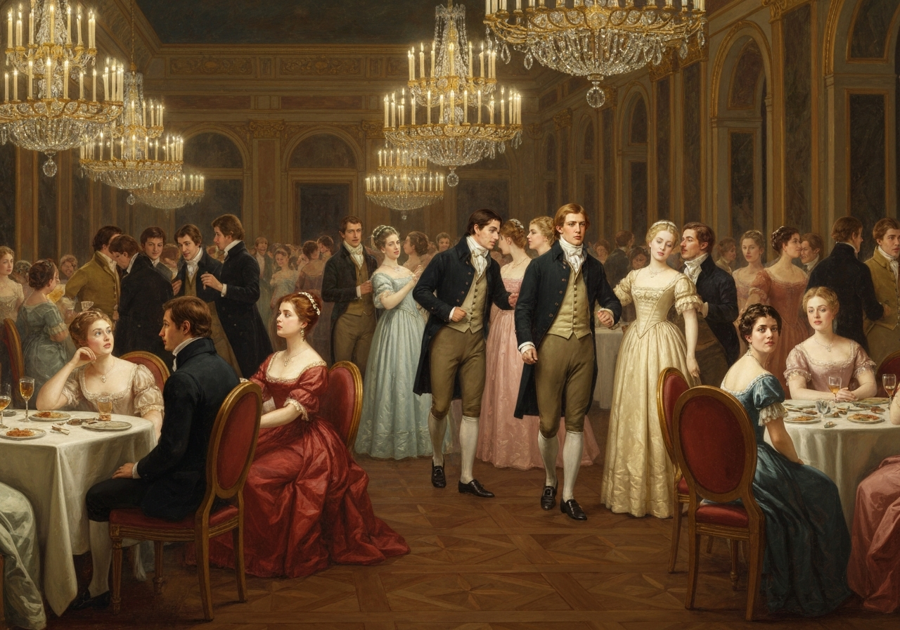

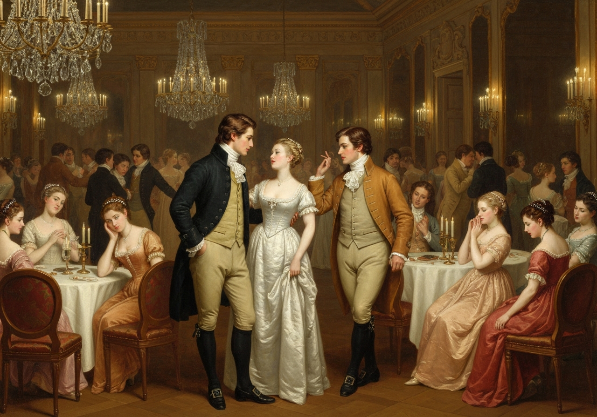
{/* metadata:image_005:end */}

t seems likely to have been a desirable match for Jane,” said she. “I
am sorry it went off. But these things happen so often! A young man,
such as you describe Mr. Bingley, so easily falls in love with a pretty
girl for a few weeks, and, when accident separates them, so easily
forgets her, that these sort of inconstancies are very frequent.”

[Illustration:

     “Offended two or three young ladies”

[_Copyright 1894 by George Allen._]]

{/* metadata:quote_004:start */}
<Callout title="Memorable Quote" variant="note">An excellent consolation in its way, said Elizabeth; but it will not do for us.</Callout>
{/* metadata:quote_004:end */} We do not suffer by accident. It does not often happen
that the interference of friends will persuade a young man of
independent fortune to think no more of a girl whom he was violently in
love with only a few days before.”

“But that expression of ‘violently in love’ is so hackneyed, so
doubtful, so indefinite, that it gives me very little idea. It is as
often applied to feelings which arise only from a half hour’s
acquaintance, as to a real, strong attachment. Pray, how _violent was_
Mr. Bingley’s love?”

“I never saw a more promising inclination; he was growing quite
inattentive to other people, and wholly engrossed by her. Every time
they met, it was more decided and remarkable. At his own ball he
offended two or three young ladies by not asking them to dance; and I
spoke to him twice myself without receiving an answer. Could there be
finer symptoms? {/* metadata:quote_005:start */}
<Callout title="Memorable Quote" variant="note">Is not general incivility the very essence of love?</Callout>
{/* metadata:quote_005:end */}

{/* metadata:analysis_005:start */}
<Callout title="Analysis" variant="explanation">
Elizabeth's wit shines through her description of Bingley's symptoms of love—'general incivility' as 'the very essence of love.' This humorous observation, while playful, also demonstrates her perceptiveness regarding social behavior. Her description of Bingley offending young ladies by not asking them to dance and ignoring her own attempts at conversation provides concrete evidence of his distraction.
</Callout>
{/* metadata:analysis_005:end */}

“Oh, yes! of that kind of love which I suppose him to have felt. Poor
Jane! I am sorry for her, because, with her disposition, she may not get
over it immediately. It had better have happened to _you_, Lizzy; you
would have laughed yourself out of it sooner. But do you think she would
be prevailed on to go back with us? Change of scene might be of
service--and perhaps a little relief from home may be as useful as
anything.”

Elizabeth was exceedingly pleased with this proposal, and felt persuaded
of her sister’s ready acquiescence.

“I hope,” added Mrs. Gardiner, “that no consideration with regard to
this young man will influence her. We live in so different a part of
t

{/* metadata:analysis_006:start */}
<Callout title="Analysis" variant="explanation">
The chapter introduces Mrs. Gardiner's suspicions about Wickham through her observation of his interactions with Elizabeth. This represents another layer of surveillance in the novel—Mrs. Gardiner's 'narrow observation' parallels Elizabeth's earlier observation of Jane and Bingley. Wickham's connection to Derbyshire, specifically Pemberley, creates dramatic irony as he discusses the estate with someone who has personal knowledge of the Darcy family.
</Callout>
{/* metadata:analysis_006:end */}

{/* metadata:image_006:start */}
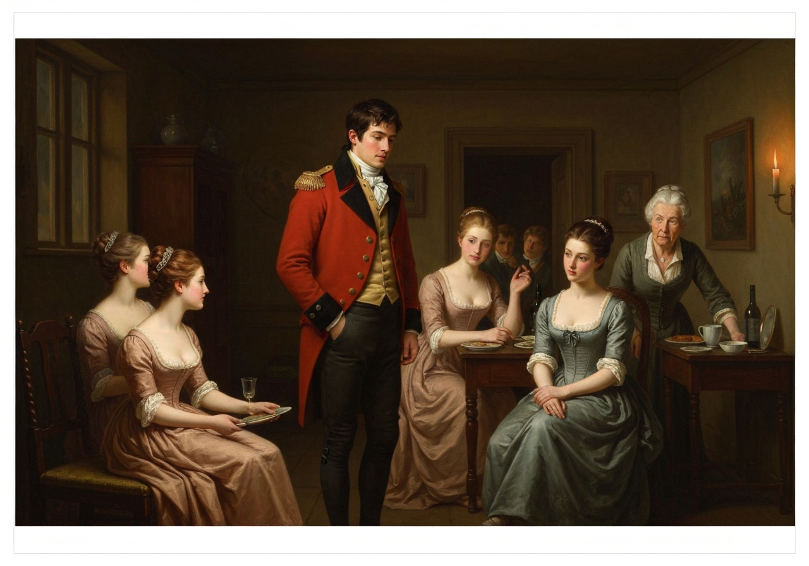

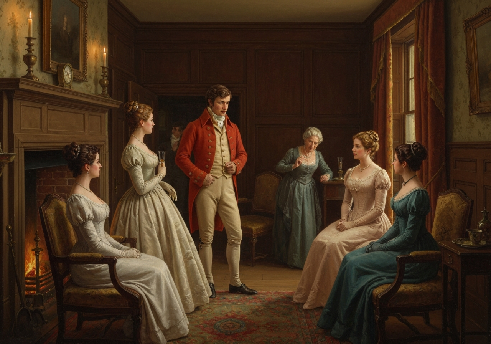
{/* metadata:image_006:end */}

own, all our connections are so different, and, as you well know, we go
out so little, that it is very improbable they should meet at all,
unless he really comes to see her.”

“And _that_ is quite impossible; for he is now in the custody of his
friend, and {/* metadata:quote_006:start */}
<Callout title="Memorable Quote" variant="note">Mr. Darcy would no more suffer him to call on Jane in such a part of London!</Callout>
{/* metadata:quote_006:end */} My dear aunt, how could you think of it? Mr. Darcy may,
perhaps, have _heard_ of such a place as Gracechurch Street, but he
would hardly think a month’s ablution enough to cleanse him from its
impurities, were he once to enter it; and, depend upon it, Mr. Bingley
never stirs without him.”

“So much the better. I hope they will not meet at all. But does not Jane
correspond with his sister? _She_ will not be able to help calling.”

“She will drop the acquaintance entirely.”

But, in spite of the certainty in which Elizabeth affected to place this
point, as well as the still more interesting one of Bingley’s being
withheld from seeing Jane, she felt a solicitude on the subject which
convinced her, on examination, that she did not consider it entirely
hopeless. It was possible, and sometimes she thought it probable, that
his affection might be re-animated, and the influence of his friends
successfully combated by the more natural influence of Jane’s
attractions.

Miss Bennet accepted her aunt’s invitation with pleasure; and the
Bingleys were no otherwise in her thoughts at the same time than as she
hoped, by Caroline’s not living in the same house with her brother, she
might occasionally spend a morning with her, without any danger of
seeing him.

The Gardiners stayed a week at Longbourn; and what with the Philipses,
the Lucases, and the officers, there was not a day without its
engagement. Mrs. Bennet had so carefully provided for the entertainment
of her brother and sister, that they did not once sit down to a family
dinner. When the engagement was for home, some of the officers always
made part of it, of which officers Mr. Wickham was sure to be one; and
on these occasions Mrs. Gardiner, rendered suspicious by Elizabeth’s
warm commendation of him, narrowly observed them both. Without supposing
them, from what she saw, to be very seriously in love, their preference
of each other was plain enough to make her a little uneasy; and she
resolved to speak to Elizabeth on the subject before she left
Hertfordshire, and represent to her the imprudence of encouraging such
an attachment.

To Mrs. Gardiner, Wickham had one means of affording pleasure,
unconnected with his general powers. About ten or a dozen years ago,
before her marriage, she had spent a considerable time in that very part
of Derbyshire to which he belonged. They had, therefore, many
acquaintance in common; and, though Wickham had been little there since
the death of Darcy’s father, five years before, it was yet in his power
to give her fresher intelligence of her former friends than she had been
in the way of procuring.

Mrs. Gardiner had seen Pemberley, and known the late Mr. Darcy by
character perfectly well. Here, consequently, was an inexhaustible
subject of discourse. In comparing her recollection of Pemberley with
the minute description which Wickham could give, and in bestowing her
tribute of praise on the character of its late possessor, she was
delighting both him and herself. On being made acquainted with the
present Mr. Darcy’s treatment of him, she tried to remember something of
that gentleman’s reputed disposition, when quite a lad, which might
agree with it; {/* metadata:quote_007:start */}
<Callout title="Memorable Quote" variant="note">and was confident, at last, that she recollected having heard Mr. Fitzwilliam Darcy formerly spoken of as a very proud, ill-natured boy.</Callout>
{/* metadata:quote_007:end */}

[Illustration:

     “Will you come and see me?”
]
