import Callout from '@/components/Callout.astro'

[Illustration]

Mr

{/* metadata:7:start */}
<Callout title="Analysis" variant="explanation">
Elizabeth's hope that Bingley might marry Darcy's sister as punishment for his abandonment of Jane reveals the complex interplay of revenge fantasy and social realism in her worldview, while simultaneously foreshadowing future developments in the narrative. Her reasoning that such a marriage would make him 'abundantly regret what he had thrown away' shows how she channels emotional pain into strategic thinking. The chapter thus closes by establishing patterns of deception, emotional management, and quiet disillusionment that will continue to shape the novel's trajectory toward its eventual reversals.
</Callout>
{/* metadata:7:end */}

s. Gardiner’s caution to Elizabeth was punctually and kindly given on
the first favourable opportunity of speaking to her alone: after
honestly telling her what she thought, she thus went on:--

{/* metadata:1:start */}
<Callout title="Memorable Quote" variant="note">You are too sensible a girl, Lizzy, to fall in love merely because you are warned against it; and, therefore, I am not afraid of speaking openly.</Callout>
{/* metadata:1:end */} Seriously, I would have you be on your guard. Do not involve
yourself, or endeavour to involve him, in an affection which the want of
fortune would make so very imprudent. I have nothing to say against
_him_: he is a most interesting young man; and if he had the fortune he
ought to have, I should think you could not do better. But as it is--you
must not let your fancy run away with you. You have sense, and we all
expect you to use it. Your father would depend on _your_ resolution and
good conduct, I am sure. You must not disappoint your father.”

“My dear aunt, this is being serious indeed.”

“Yes, and I hope to engage you to be serious likewise.”

“Well, then, you need not be under any alarm. I will take care of
myself, and of Mr. Wickham too. He shall not be in love with me, if I
can prevent it.”

“Elizabeth, you are not serious now.”

“I beg your pardon. I will try again. At present I am not in love with
Mr. Wickham; no, I certainly am not. But he is, beyond all comparison,
the most agreeable man I ever saw--and if he becomes really attached to
me--I believe it will be better that he should not. I see the imprudence
of it. {/* metadata:2:start */}
<Callout title="Memorable Quote" variant="note">Oh, _that_ abominable Mr. Darcy! My father's opinion of me does me the greatest honour; and I should be miserable to forfeit it.</Callout>
{/* metadata:2:end */} My
father, however, is partial to Mr. Wickham. In short, my dear aunt, I
should be very sorry to be the means of making any of you unhappy; but
since we see, every day, that where there is affection young people are
seldom withheld, by immediate want of fortune, from entering into
engagements with each other, {/* metadata:3:start */}
<Callout title="Memorable Quote

{/* metadata:2:start */}
<Callout title="Analysis" variant="explanation">
Elizabeth's response to her aunt's warning reveals her characteristic wit and self-awareness, acknowledging the imprudence of attachment to Wickham while simultaneously admitting her own vulnerability to romantic temptation. She promises only 'not to be in a hurry,' a carefully hedged commitment that satisfies social expectation without surrendering her autonomy. This measured compliance demonstrates how Elizabeth navigates the tension between personal desire and familial duty with ironic intelligence.
</Callout>
{/* metadata:2:end */}

{/* metadata:2:start */}
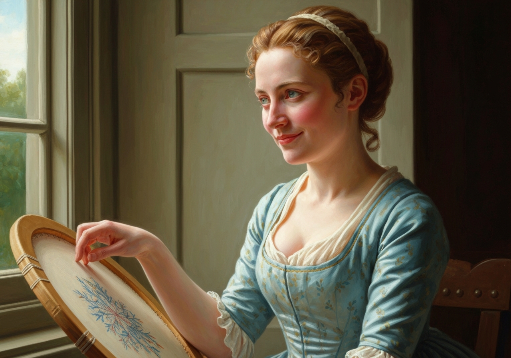

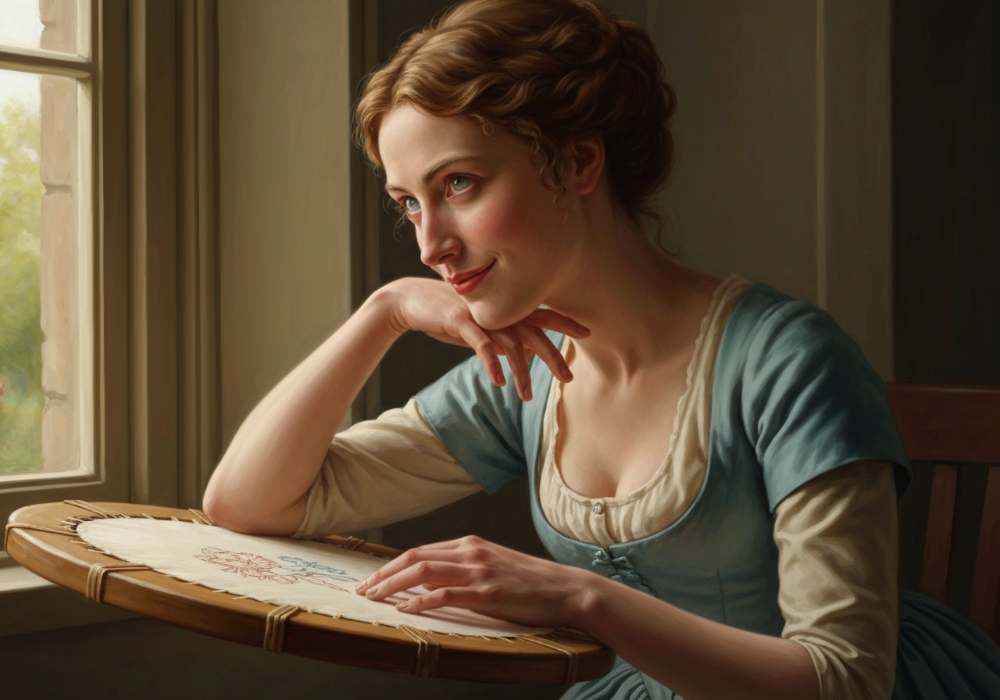
{/* metadata:2:end */}

" variant="note">How can I promise to be wiser than so many of my fellow-creatures, if I am tempted, or how am I even to know that it would be wiser to resist?</Callout>
{/* metadata:3:end */} All that I can promise you, therefore, is
not to be in a hurry. I will not be in a hurry to believe myself his
first object. When I am in company with him, I will not be wishing. In
short, I will do my best.”

“Perhaps it will be as well if you discourage his coming here so very
often. At least you should not _remind_ your mother of inviting him.”

“As I did the other day,” said Elizabeth, with a conscious smile; “very
true, it will be wise in me to refrain from _that_. But do not imagine
that he is always here so often. It is on your account that he has been
so frequently invited this week. You know my mother’s ideas as to the
necessity of constant company for her 

{/* metadata:1:start */}
<Callout title="Analysis" variant="explanation">
Mrs. Gardiner's intervention exemplifies the role of female mentorship in Austen's novels, where an older, wiser woman attempts to guide a younger relation through the treacherous waters of courtship and social expectation. Her caution is delivered with both honesty and affection, acknowledging Elizabeth's intelligence rather than simply issuing commands. The exchange is described as 'a wonderful instance of advice being given on such a point without being resented,' marking it as an unusually successful act of familial guidance.
</Callout>
{/* metadata:1:end */}

{/* metadata:1:start */}
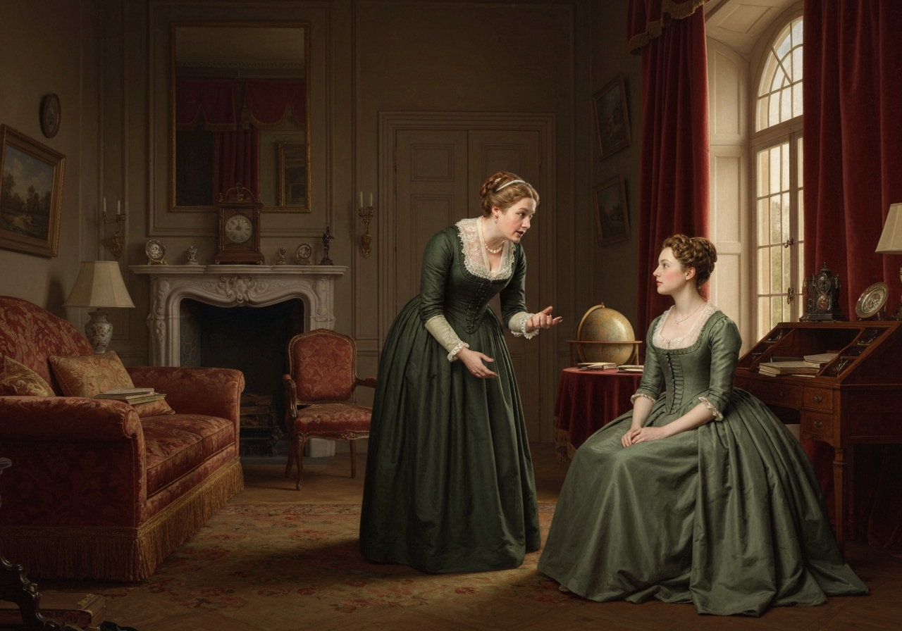

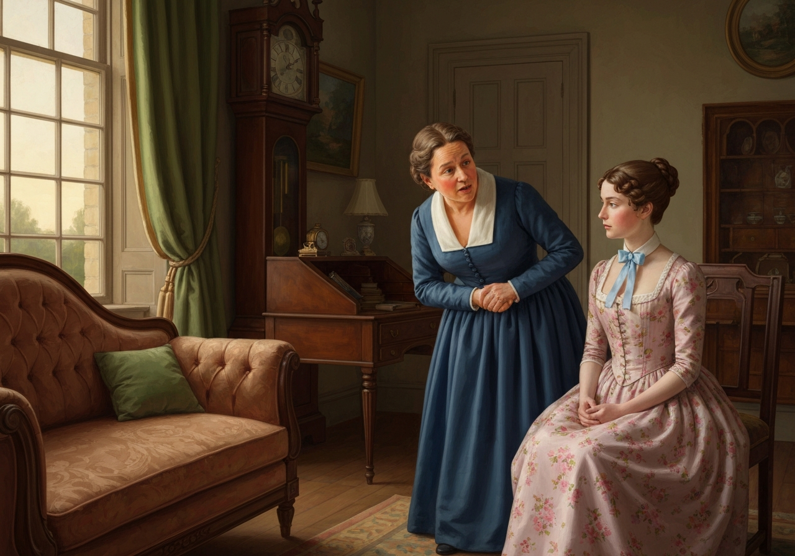
{/* metadata:1:end */}

friends. But really, and upon my
honour, I will try to do what I think to be wisest; and now I hope you
are satisfied.”

Her aunt assured her that she was; and Elizabeth, having thanked her for
the kindness of her hints, they parted,--a wonderful instance of advice
being given on such a point without being resented.

Mr. Collins returned into Hertfordshire soon after it had been quitted
by the Gardiners and Jane; but, as he took up his abode with the
Lucases, his arrival was no great inconvenience to Mrs. Bennet. His
marriage was now fast approaching; and she was at length so far resigned
as to think it inevitable, and even repeatedly to say, in an i

{/* metadata:3:start */}
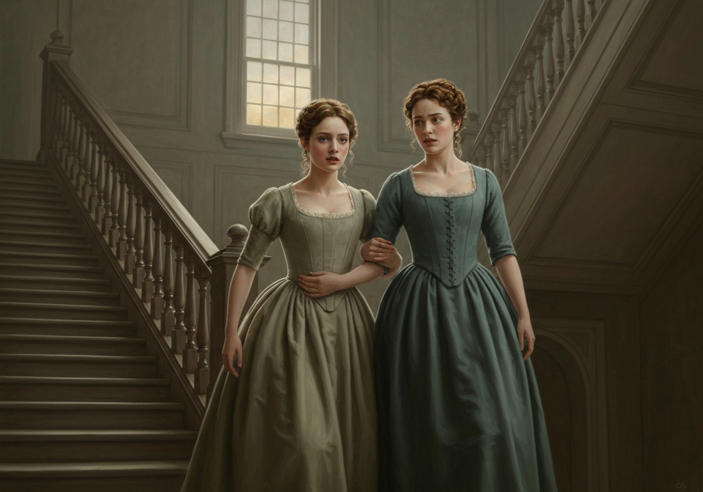

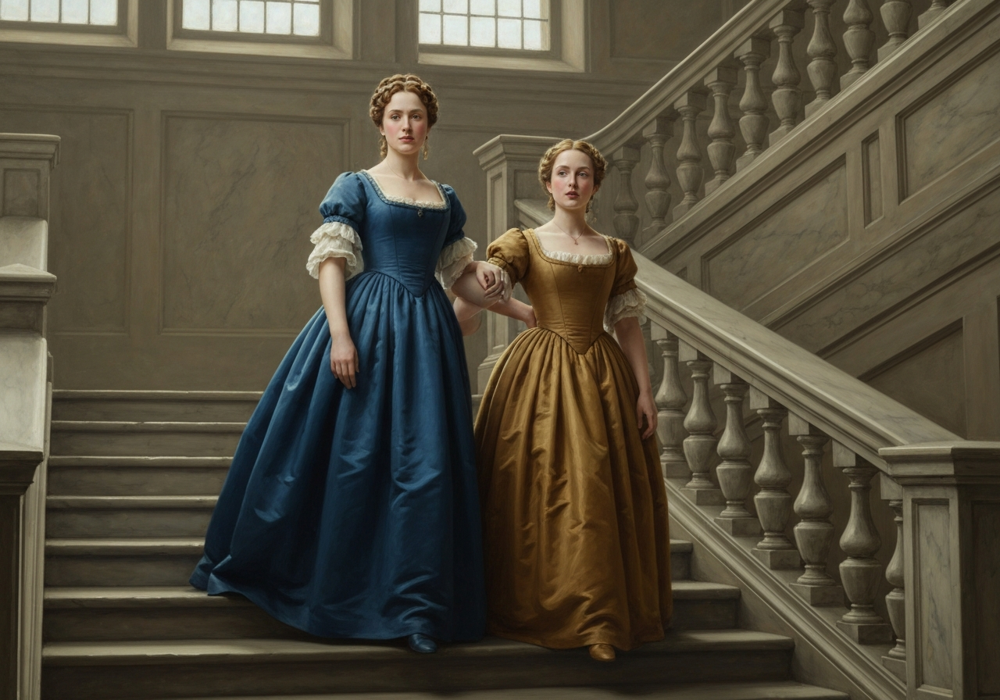
{/* metadata:3:end */}

ll-natured
tone, that she “_wished_ they might be happy.” Thursday was to be the
wedding-day, and on Wednesday Miss Lucas paid her farewell visit; and
when she rose to take leave, Elizabeth, ashamed of her mother’s
ungracious and reluctant good wishes, and sincerely affected herself,
accompanied her out of the room. As they went down stairs together,
Charlotte said,--

“I shall depend on hearing from you very often, Eliza.”

“_That_ you certainly shall.”

“And I have another favour to ask. Will you come and see me?”

“We shall often meet, I hope, in Hertfordshire.”

“I am not likely to leave Kent for some time. Promise me, therefore, to
come to Hunsford.”

Elizabeth could not refuse, though she foresaw little pleasure in the
visit.

“My father and Maria

{/* metadata:4:start */}
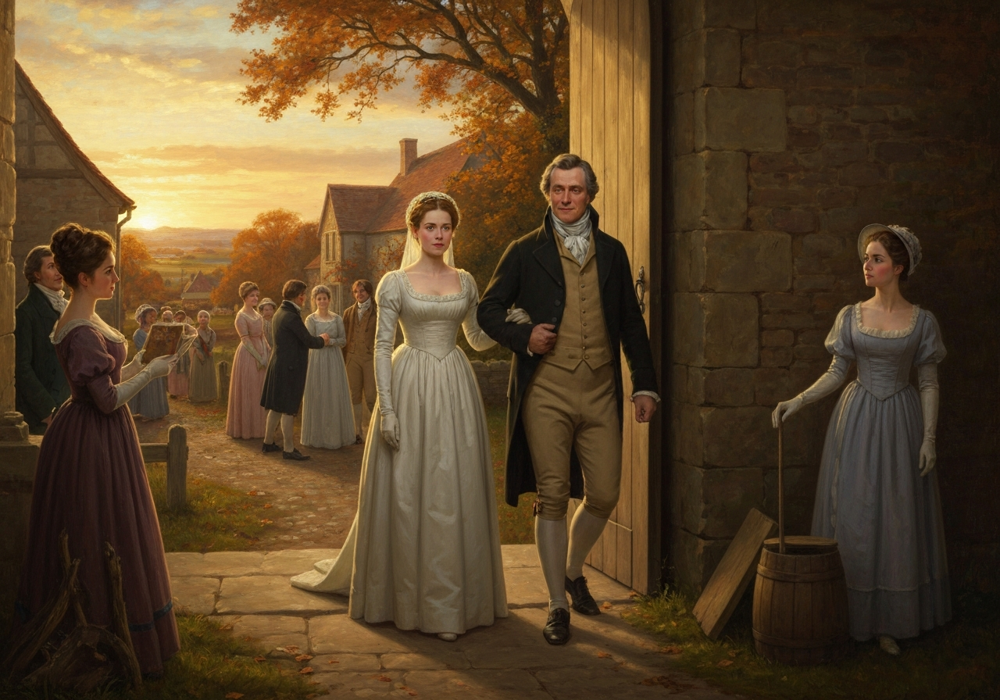

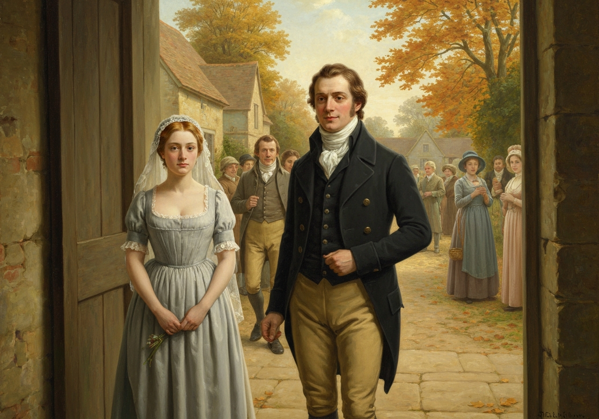
{/* metadata:4:end */}

 are to come to me in March,” added Charlotte, “and
I hope you will consent to be of the party. Indeed, Eliza, you will be
as welcome to me as either of them.”

The wedding took place: the bride and bridegroom set off for Kent from
the church door, and everybody had as much to say or to hear on the
subject as usual. Elizabeth soon heard from her friend, and their
correspondence was as regular and frequent as it ever had been: that it
should be equally unreserved was impossible. {/* metadata:4:start */}
<Callout title="Memorable Quote" variant="note">Elizabeth could never address her without feeling that all the comfort of intimacy was over; and, though determined not to slacken as a correspondent, it was for the sake of what had been rather than what was.</Callout>
{/* metadata:4:end */}

{/* metadata:3:start */}
<Callout title="Analysis" variant="explanation">
The marriage of Charlotte Lucas to Mr. Collins marks a pivotal moment in the narrative, representing the economic realities faced by women of limited fortune and the compromises required for social security. Elizabeth's sense of loss is captured in the observation that she 'could never address her without feeling that all the comfort of intimacy was over,' signaling how marriage can dissolve the bonds of female friendship. Charlotte's cheerful letters from Hunsford, carefully praising everything without revealing genuine feeling, further underscore the performance required to sustain a pragmatic union.
</Callout>
{/* metadata:3:end */}

 Charlotte’s first letters
were received with a good deal of eagerness: there could not but be
curiosity to know how she would speak of her new home, how she would
like Lady Catherine, and how happy she would dare pronounce herself to
be; though, when the letters were read, Elizabeth felt that Charlotte
expressed herself on every point exactly as she might have foreseen. She
wrote cheerfully, seemed surrounded with comforts, and mentioned nothing
which she could not praise. The house, furniture, neighbourhood, and
roads, were all to her taste, and Lady Catherine’s behaviour was most
friendly and obliging. It was Mr. Collins’s picture of Hunsford and
Rosings rationally softened; and Elizabeth perceived that she must wait
for her own visit there, to know the rest.

Jane had already written a few lines to her sister, to announce their
safe arrival in London; and when she wrote again, Elizabeth hoped it
would be in her power to say something of the Bingleys.

Her impatience for this second letter was as well rewarded as impatience
generally is. Jane had been a week in town, without either seeing or
hearing from Caroline. She accounted for it, however, by supposing that
her last letter to her friend from Longbourn had by some accident been
lost.

“My aunt,” she continued, “is going to-morrow into that part of the
town, and I shall take the opportunity of calling in Grosvenor Street.”

She wrote again when the vi

{/* metadata:6:start */}
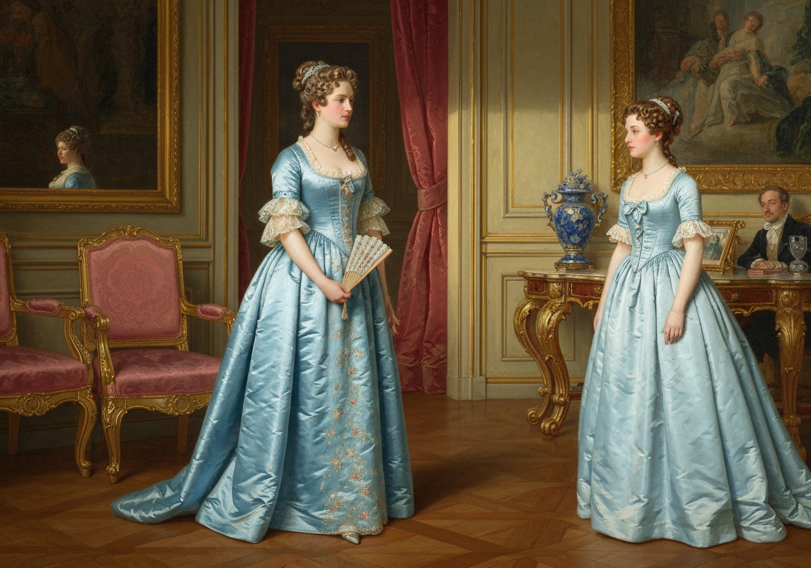

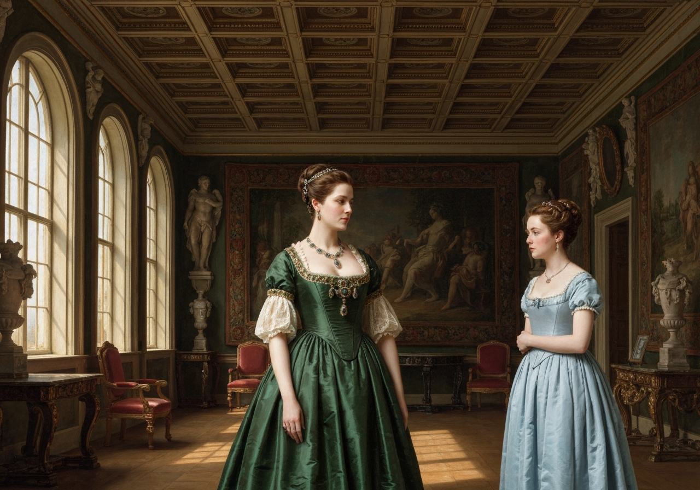
{/* metadata:6:end */}

sit was paid, and she had seen Miss Bingley.
“I did not think Caroline in spirits,” were her words, “but she was very
glad to see me, and reproached me for giving her no notice of my coming
to London. I was right, therefore; my last letter had never reached her.
I inquired after their brother, of course. He was well, but so much
engaged with Mr. Darcy that they scarcely ever saw him. I found that
Miss Darcy was expected to dinner: I wish I could see her. My visit was
not long, as Caroline and Mrs. Hurst were going out. I dare say I shall
soon see them here.”

Elizabeth shook her head over this letter. It convinced her that
accident only could discover to Mr. Bingley her sister’s being in town.

Four weeks passed away, and Jane saw nothing of him. She endeavoured to
persuade herself that she did not regret it; but she could no longer be
blind to Miss Bingley’s inattention. After waiting at home every morning
for a fortnight, and inventing every evening a fresh excuse for her, the
visitor did at last appear; but the shortness of her stay, and, yet
more, the alteration of her manner, would allow Jane to deceive he

{/* metadata:6:start */}
<Callout title="Analysis" variant="explanation">
Jane's discovery of Miss Bingley's duplicity serves as a crucial turning point in her character development, forcing her to abandon her natural inclination to think well of everyone and confront the reality of calculated social maneuvering. Her letter to Elizabeth is a careful document of dawning disillusionment, acknowledging that Caroline 'was, in every respect, so altered a creature' that Jane resolved to continue the acquaintance no longer. This resolution marks a significant growth in Jane's ability to protect herself from emotional manipulation, even as she continues to extend charitable interpretations of Miss Bingley's motives.
</Callout>
{/* metadata:6:end */}

{/* metadata:5:start */}
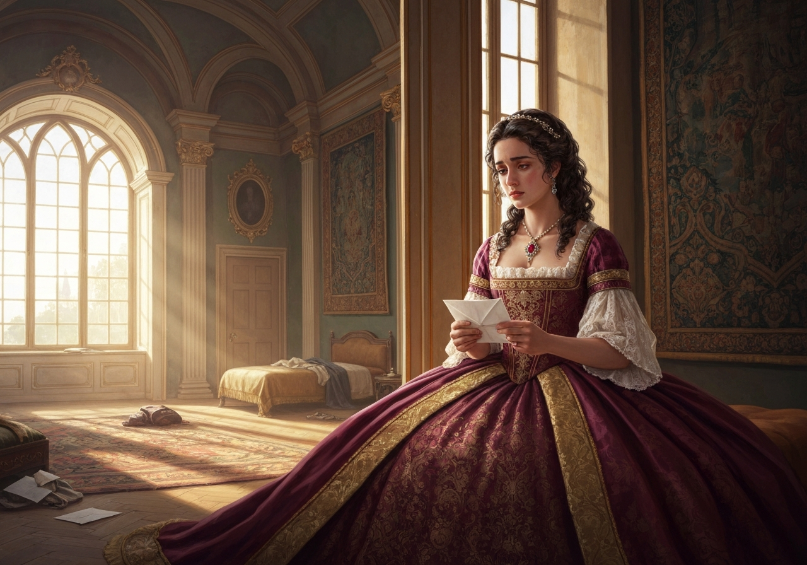

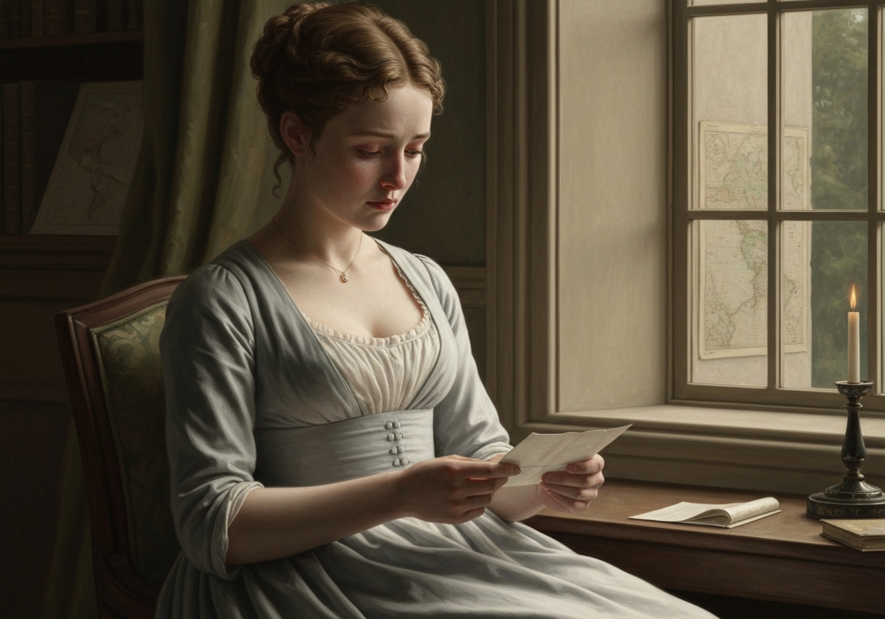
{/* metadata:5:end */}

rself
no longer. The letter which she wrote on this occasion to her sister
will prove what she felt:--

     “My dearest Lizzy will, I am sure, be incapable of triumphing in
     her better judgment, at my expense, when I confess myself to have
     been entirely deceived in Miss Bingley’s regard for me. But, my
     dear sister, though the event has proved you right, do not think me
     obstinate if I still assert that, considering what her behaviour
     was, my confidence was as natural as your suspicion. I do not at
     all comprehend her reason for wishing to be intimate with me; but,
     if the same circumstances were to happen again, I am sure I should
     be deceived again. Caroline did not return my visit till yesterday;
     and not a note, not a line, did I receive in the meantime. When she
     did come, it was very evident that she had no pleasure in it; she
     made a slight, formal apology for not calling before, said not a
     word of wishing to see me again, and was, in every respect, so
     altered a creature, that when she went away I was perfectly
     resolved to continue the acquaintance no longer. I pity, though I
     cannot help blaming, her. She was very wrong in singling me out as
     she did; I can safely say, that every advance to intimacy began on
     her side. But I pity her, because she must feel that she has been
     acting wrong, and because I am very sure that anxiety for her
     brother is the cause of it. I need not explain myself farther; and
     though _we_ know this anxiety to be quite needless, yet if she
     feels it, it will easily account for her behaviour to me; and so
     deservedly dear as he is to his sister, whatever anxiety she may
     feel on his behalf is natural and amiable. I cannot but wonder,
     however, at her having any such fears now, because if he had at all
     cared about me, we must have met long, long ago. He knows of my
     being in town, I am certain, from something she said herself; and
     yet it would seem, by her manner of talking, as if she wanted to
     persuade herself that he is really partial to Miss Darcy. I cannot
     understand it. If I were not afraid of judging harshly, I should be
     almost tempted to say, that there is a strong appearance of
     duplicity in all this. I will endeavour to banish every painful
     thought, and think only of what will make me happy, your affection,
     and the invariable kindness of my dear uncle and aunt. Let me hear
     from you very soon. {/* metadata:5:start */}
<Callout title="Memorable Quote" variant="note">Miss Bingley said something of his never returning to Netherfield again, of giving up the house, but not with any certainty.</Callout>
{/* metadata:5:end */} We had better not mention it. I am extremely
     glad that you have such pleasant accounts from our friends at
     Hunsford. Pray go to see them, with Sir William and Maria. I am
     sure you will be very comfortable there.

“Yours, etc.”

This letter gave Elizabeth some pain; but her spirits returned, as she
considered that Jane would no longer be duped, by the sister at least.
All expectation from the brother was now absolutely over. She would not
even wish for any renewal of his attentions. {/* metadata:6:start */}
<Callout title="Memorable Quote" variant="note">His character sunk on every review of it; and, as a punishment for him, as well as a possible advantage to Jane, she seriously hoped he might really soon marry Mr. Darcy's sister.</Callout>
{/* metadata:6:end */} as, by Wickham’s account, she would make him abundantly
regret what he had thrown away.

Mrs. Gardiner about this time reminded Elizabeth of her promise
concerning that gentleman, and required information; and Elizabeth had
such to send as might rather give contentment to her aunt than to
herself. His apparent partiality had subsided, his attentions were over,
he was the admirer of some one else. Elizabeth was watchful enough to
see it all, but she could see it and write of it without material pain.
Her heart had been but slightly touched, and her vanity was satisfied
with believing that _she_ would have been his only choice, had fortu

{/* metadata:4:start */}
<Callout title="Analysis" variant="explanation">
Elizabeth's realization that she was never truly in love with Wickham introduces a sophisticated understanding of authentic emotion versus social performance, questioning what constitutes genuine romantic attachment. Her self-diagnosis is characteristically witty: she reasons that real passion would have made her 'detest his very name,' and the absence of such hatred proves the shallowness of her feeling. Her further observation that 'Importance may sometimes be purchased too dearly' offers a pointed critique of the social visibility that accompanies romantic drama, suggesting she values self-possession over spectacle.
</Callout>
{/* metadata:4:end */}

{/* metadata:7:start */}
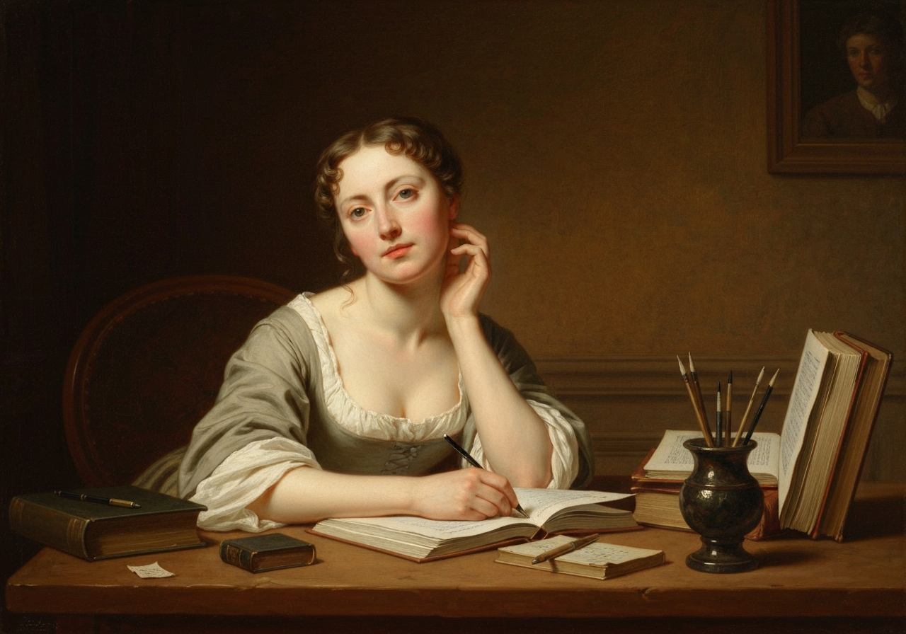

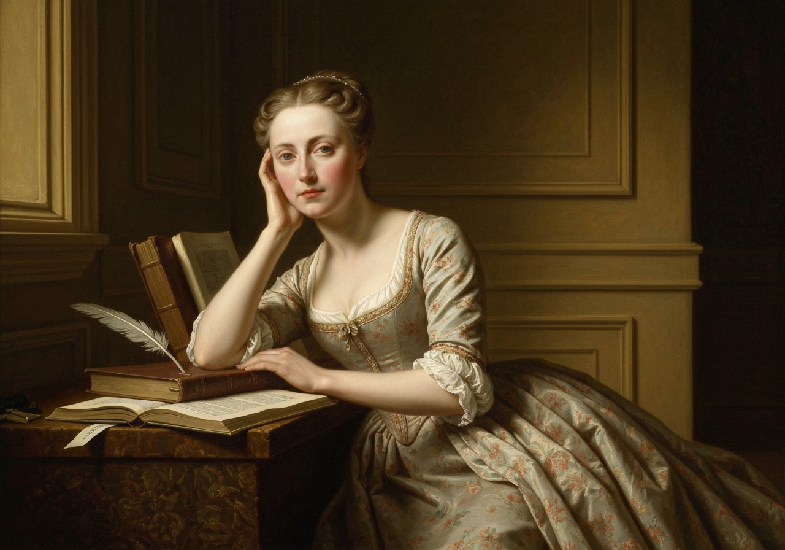
{/* metadata:7:end */}

ne
permitted it. The sudden acquisition of ten thousand pounds wa

{/* metadata:5:start */}
<Callout title="Analysis" variant="explanation">
The contrast between Kitty and Lydia's romantic enthusiasm and Elizabeth's measured restraint demonstrates varying levels of social maturity within the Bennet household. Elizabeth notes that her younger sisters 'take his defection much more to heart than I do,' attributing their distress to being 'young in the ways of the world.' This generational contrast reinforces Mrs. Gardiner's role as a stabilising confidante who bridges the gap between youthful emotional turbulence and the practical wisdom Elizabeth is in the process of acquiring.
</Callout>
{/* metadata:5:end */}

s the most
remarkable charm of the young lady to whom he was now rendering himself
agreeable; but Elizabeth, less clear-sighted perhaps in this case than
in Charlotte’s, did not quarrel with him for his wish of independence.
Nothing, on the contrary, could be more natural; and, while able to
suppose that it cost him a few struggles to relinquish her, she was
ready to allow it a wise and desirable measure for both, and could very
sincerely wish him happy.

All this was acknowledged to Mrs. Gardiner; and, after relating the
circumstances, she thus went on{/* metadata:7:start */}
<Callout title="Memorable Quote" variant="note">I am now convinced, my dear aunt, that I have never been much in love; for had I really experienced that pure and elevating passion, I should at present detest his very name, and wish him all manner of evil.</Callout>
{/* metadata:7:end */} But my feelings are not only cordial
towards _him_, they are even impartial towards Miss King. I cannot find
out that I hate her at all, or that I am in the least unwilling to think
her a very good sort of girl. There can be no love in all this. My
watchfulness has been effectual; and though I should certainly be a more
interesting object to all my acquaintance, were I distractedly in love
with him, I cannot say that I regret my comparative insignificance.
Importance may sometimes be purchased too dearly. Kitty and Lydia take
his defection much more to heart than I do. They are young in the ways
of the world, and not yet open to the mortifying conviction that
handsome young men must have something to live on as well as the
plain.”
