import Callout from '@/components/Callout.astro'

[Illustration]

With no greater events than these in the Longbourn family, and otherwise
diversified by little beyond the walks to Meryton, sometimes dirty and
sometimes cold, did January and February pass away. March was to take
Elizabeth to Hunsford. She had not at first thought very seriously of
going thither; but Charlotte, she soon found, was depending on the
plan, and she gradually learned to consider it herself with greater
pleasure as well as greater certainty. {/* metadata:quote_001:start */}
<Callout title="Memorable Quote" variant="note">Absence had increased her desire of seeing Charlotte again, and weakened her disgust of Mr. Collins.</Callout>
{/* metadata:quote_001:end */}

{/* metadata:analysis_001:start */}
<Callout title="Analysis" variant="explanation">
Elizabeth's initial hesitation about visiting Hunsford evolves into genuine anticipation, demonstrating her deep friendship with Charlotte Lucas despite Charlotte's controversial marriage choice. This transformation underscores Elizabeth's capacity to separate per

{/* metadata:image_001:start */}
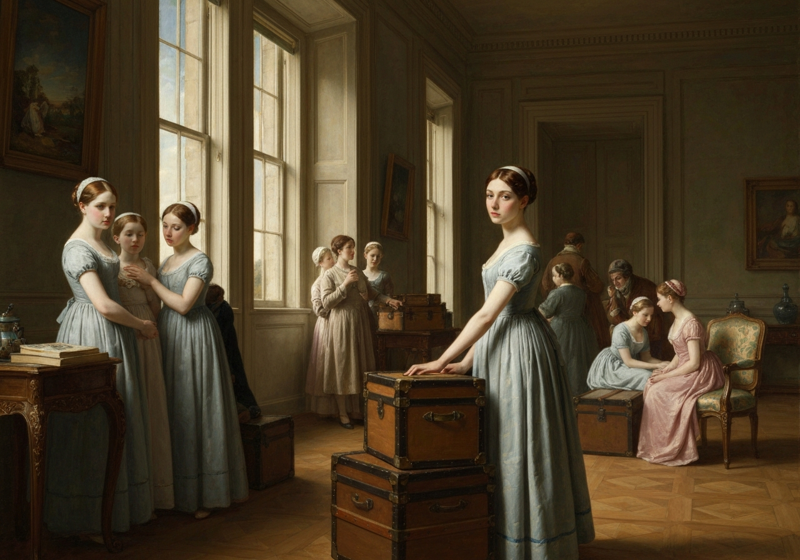

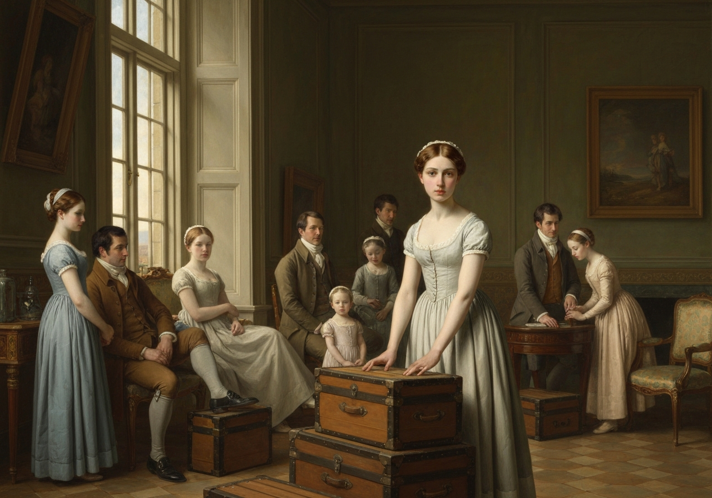
{/* metadata:image_001:end */}

sonal affection from moral judgment, though her feelings about Mr. Collins remain complicated by her loyalty to her friend. Austen frames this shift with characteristic economy, noting that time and distance have softened Elizabeth's objections even as her principles remain intact.
</Callout>
{/* metadata:analysis_001:end */}

There was novelty in the scheme; and as, with such a mother and such
uncompanionable sisters, home could not be faultless, a little change
was not unwelcome for its own sake. The journey would, moreover, give
her a peep at Jane; and, in short, as the time drew near, she would have
been very sorry for any delay. Everything, however, went on smoothly,
and was finally settled according to Charlotte’s first sketch. She was
to accompany Sir William and his second daughter. The improvement of
spending a night in London was added in time, and the plan became as
perfect as plan could be.

The only pain was in leaving her father, who would certainly miss her,
and who, when it came to the point, so little liked her going, that he
told her to write to him, and almost promised to answer her letter.

The farewell between herself and Mr. Wickham was perfectly friendly; on
his side even more. His present pursuit could not make him forget that
Elizabeth had been the first to excite and to deserve his attention, the
first to listen and to pity, the first to be admired; and in his manner
of bidding her adieu, wishing her every enjoyment, reminding her of what
she was to expect in Lady Catherine de Bourgh, and trusting their
opinion of her--their opinion of everybody--would always coincide, there
was a solicitude, an interest, which she felt must ever attach her to
him with a most sincere regard; and {/* metadata:quote_002:start */}
<Callout title="Memorable Quote" variant="note">She parted from him convinced, that, whether married or single, he must always be her model of the amiable and pleasing.</Callout>
{/* metadata:quote_002:end */}

{/* metadata:analysis_002:start */}
<Callout title="Analysis" variant="explanation">
The farewell between Elizabeth and Mr. Wickham reveals the calculated charm of his character and Elizabeth's susceptibility to flattery. Wickham masterfully maintains Elizabeth's admiration through solicitous attention and shared criticism of Lady Catherine, ensuring his continued favorable position in her esteem even as he moves toward mercenary pursuits with Miss King. The irony is sharp: his very attentiveness in parting is a performance designed to preserve his social credit with Elizabeth rather than an expression of genuine feeling.
</Callout>
{/* metadata:analysis_002:end */}

{/* metadata:image_002:start */}
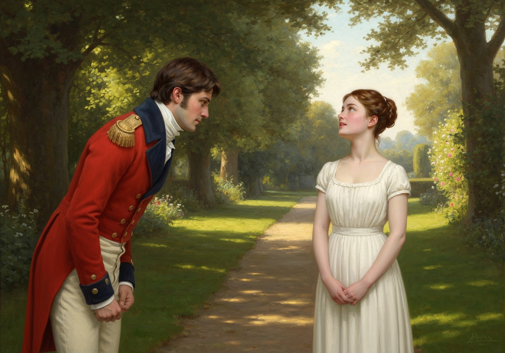

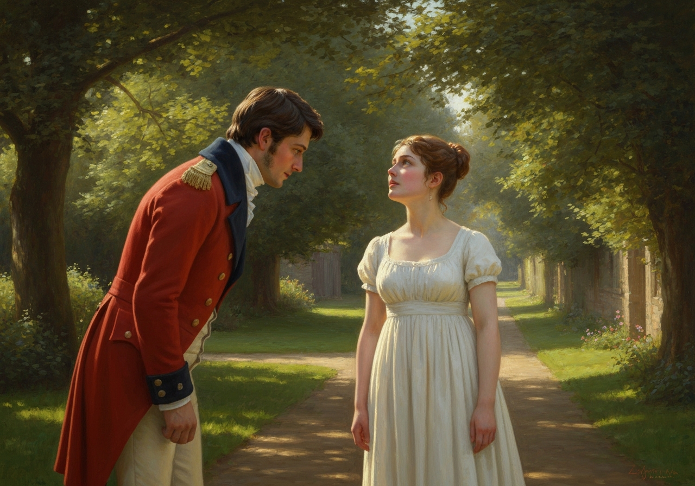
{/* metadata:image_002:end */}

Her fellow-travellers the next day were not of a kind to make her think
him less agreeable. Sir William Lucas, and his daughter Maria, a
good-humoured girl, but as empty-headed as himself, had nothing to say
that could be worth hearing, and were listened to with about as much
delight as the rattle of the chaise. {/* metadata:quote_003:start */}
<Callout title="Memorable Quote" variant="note">Elizabeth loved absurdities, but she had known Sir William's too long.</Callout>
{/* metadata:quote_003:end */}

{/* metadata:analysis_003:start */}
<Callout title="Analysis" variant="explanation">
Elizabeth's dismissive attitude toward Sir William Lucas and Maria exposes her intellectual pride and impatience with superficial conversation. Her comparison of their dialogue to the rattle of a chaise carriage demonstrates her critical nature and growing sense of superiority toward those she perceives as empty-headed. Yet Austen subtly complicates this portrait: Elizabeth's very sharpness here is a form of self-protection, a way of filling the emotional vacancy left by Wickham's defection.
</Callout>
{/* metadata:analysis_003:end */}

{/* metadata:image_003:start */}
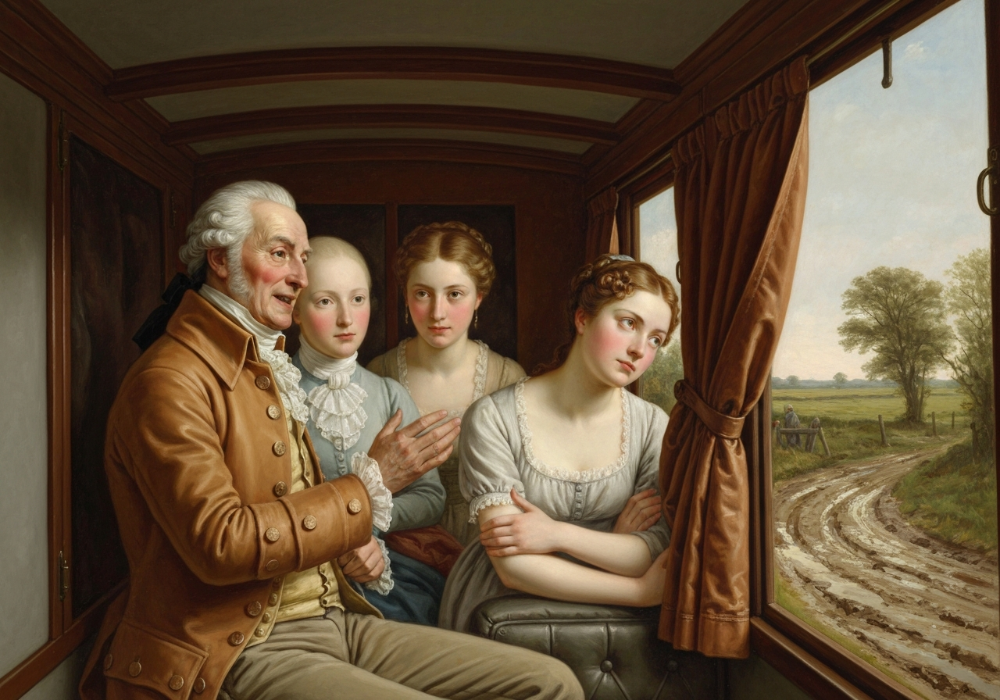

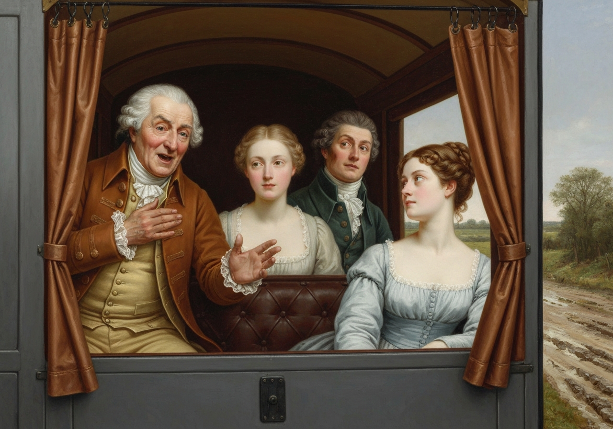
{/* metadata:image_003:end */}

 He could tell her nothing new of
the wonders of his presentation and knighthood; and his civilities were
worn out, like his in

{/* metadata:image_005:start */}
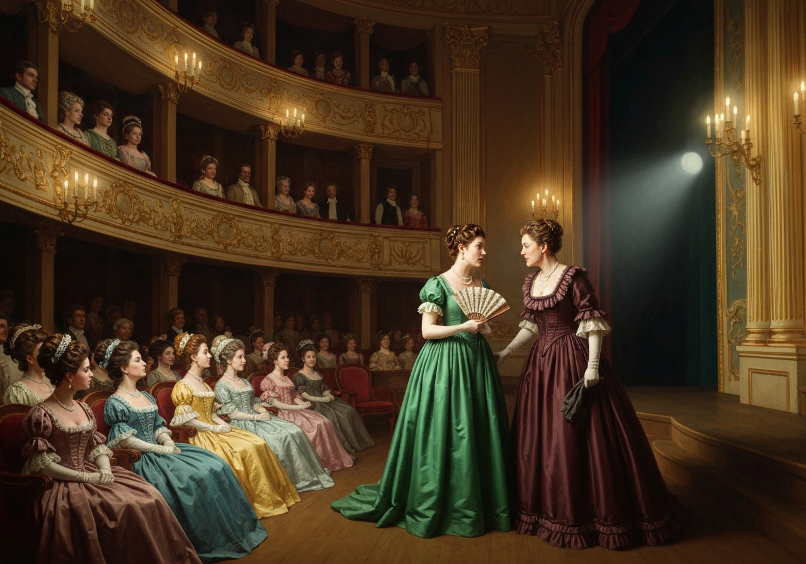

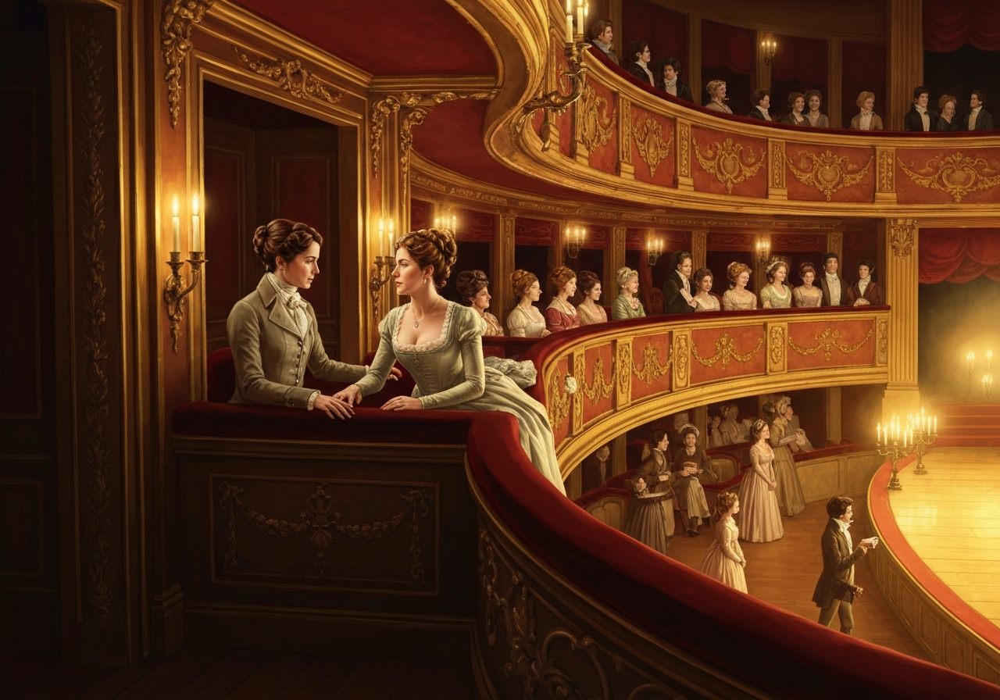
{/* metadata:image_005:end */}

formation.

It was a journey of only twenty-four miles, and they began it so early
as to be in Gracechurch Street by noon. As they drove to Mr. Gardiner’s
door, Jane was at a drawing-room window watching their arrival: when
they entered the passage, she was there to welcome them, and {/* metadata:quote_004:start */}
<Callout title="Memorable Quote" variant="note">Elizabeth, looking earnestly in her face, was pleased to see it healthful and lovely as ever.</Callout>
{/* metadata:quote_004:end */}

{/* metadata:analysis_004:start */}
<Callout title="Analysis" variant="explanation">
The reunion with Jane reveals the deep sisterly bond between the Bennet sisters and Elizabeth's genuine concern for Jane's emotional wellbeing. The physical description of Jane's countenance provides visual confirmation that she maintains her composure despite her heartbreak over Mr. Bingley, though Mrs. Gardiner's account of Jane's private periods of dejection complicates this surface impression. Austen uses Elizabeth's searching gaze as a narrative device to register both relief and lingering anxiety about her sister's state.
</Callout>
{/* metadata:analysis_004:end */}

{/* metadata:image_004:start */}
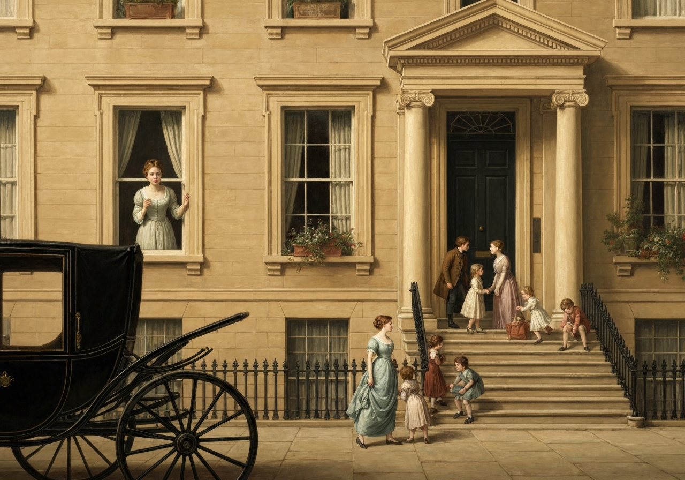

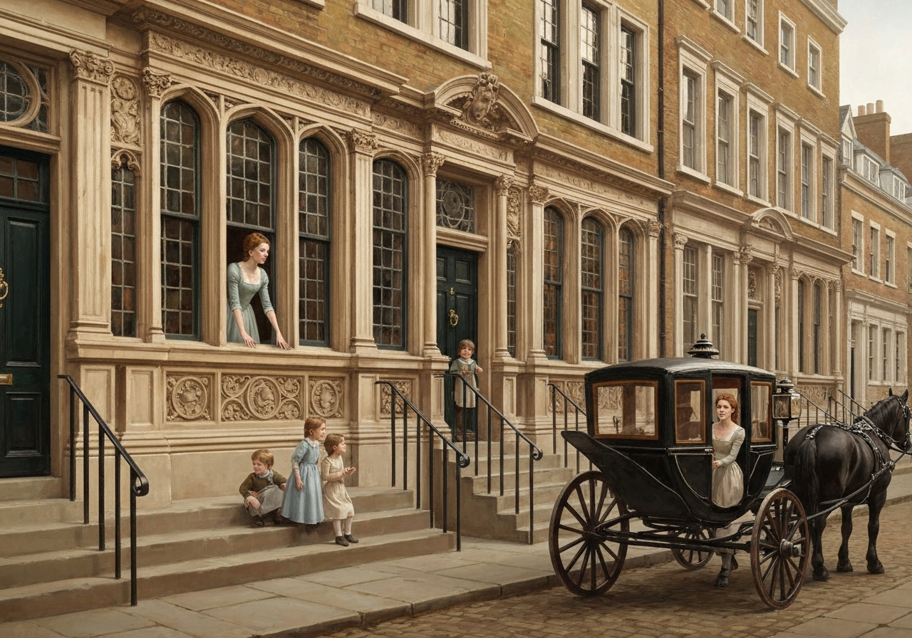
{/* metadata:image_004:end */}

 On the stairs were a troop of little boys and girls,
whose eagerness for their cousin’s appearance would not allow them to
wait in the drawing-room, and whose shyness, as they had not seen her
for a twelvemonth, prevented their coming lower. All was joy and
kindness. The day passed most pleasantly away; the morning in bustle and
shopping, and the evening at one of the theatres.

Elizabeth then contrived to sit by her aunt. Their first subject was her
sister; and she was more grieved than astonished to hear, in reply to
her minute inquiries, that though Jane always struggled to support her
spirits, there were periods of dejection. It was reasonable, however, to
hope that they would not continue long. Mrs. Gardiner gave her the
particulars also of Miss Bingley’s visit in Gracechurch Street, and
repeated conversations occurring at different times between Jane and
herself, which proved that the former had, from her heart, given up the
acquaintance.

Mrs. Gardiner then rallied her niece on Wickham’s desertion, and
complimented her on bearing it so well.

“But, my dear Elizabeth,” she added, “what sort of girl is Miss King? I
should be sorry to think our friend mercenary.”

{/* metadata:quote_005:start */}
<Callout title="Memorable Quote" variant="note">Pray, my dear aunt, what is the difference in matrimonial affairs, between the mercenary and the prudent motive? Where does discretion end, and avarice begin?</Callout>
{/* metadata:quote_005:end */} Last Christmas you were afraid of his marrying me,
because it would be imprudent; and now, because he is trying to get a
girl with only ten thousand pounds, you want to find out that he is
mercenary.”

“If you will only tell me what sort of girl Miss King is, I shall know
what to think.”

“She is a very good kind of girl, I believe. I know no harm of her.”

“But he paid her not the smallest attention till her grandfather’s death
made her mistress of this fortune?”

“No--why should he? If it were not allowable for him to gain _my_
affections, because I had no money, what occasion could there be for
making love to a girl whom he did not care about, and who was equally
poor?”

“But there seems indelicacy in directing his attentions towards her so
soon after this event.”

“A man in distressed circumstances has not time for all those elegant
decorums which other people may observe. If _she_ does not object to it,
why should _we_?”

“_Her_ not objecting does not justify _him_. It only shows her being
deficient in something herself--sense or feeling.”

{/* metadata:quote_006:start */}
<Callout title="Memorable Quote" variant="note">Well, cried Elizabeth, have it as you choose. He shall be mercenary, and she shall be foolish.</Callout>
{/* metadata:quote_006:end */}

{/* metadata:analysis_005:start */}
<Callout title="Analysis" variant="explanation">
The conversation between Elizabeth and her aunt Mrs. Gardiner about Mr. Wickham's transfer of affections to Miss King exemplifies Austen's exploration of the fine line between prudence and mercenary motives in marriage. Elizabeth's spirited defense of Wickham, despite her own bruised pride, reveals both her intellectual agility in argument and her continued blindness to his true character. Her rhetorical question—where discretion ends and avarice begins—is genuinely penetrating, yet it is deployed in service of a conclusion she has reached for emotional rather than rational reasons.
</Callout>
{/* metadata:analysis_005:end */}

“No, Lizzy, that is what I do _not_ choose. I should be sorry, you know,
to think ill of a young man who has lived so long in Derbyshire.”

“Oh, if that is all, I have a very poor opinion of young men who live in
Derbyshire; and their intimate friends who live in Hertfordshire are not
much better. I am sick of them all. Thank heaven! I am going to-morrow
where I shall find a man who has not one agreeable quality, who has
neither manners nor sense to recommend him. Stupid men are the only ones
worth knowing, after all.”

“Take care, Lizzy; that speech savours strongly of disappointment.”

Before they were separated by the conclusion of the play, she had the
unexpected happiness of an invitation to accompany her uncle and aunt in
a tour of pleasure which they proposed taking in the summer.

“We have not quite determined how far it shall carry us,” said Mrs.
Gardiner; “but perhaps, to the Lakes.”

No scheme could have been more agreeable to Elizabeth, and her
acceptance of the invitation was most ready and grateful. “My dear, dear
aunt,” she rapturously cried, “what delight! what felicity! You give me
fresh life and vigour. Adieu to disappointment and spleen. {/* metadata:quote_007:start */}
<Callout title="Memorable Quote" variant="note">What are men to rocks and mountains? Oh, what hours of transport we shall spend!</Callout>
{/* metadata:quote_007:end */}

{/* metadata:analysis_007:start */}
<Callout title="Analysis" variant="explanation">
Elizabeth's rapturous response to the invitation for the Lakes tour represents a romantic escape from the disappointments of the marriage market into the sublime pleasures of nature. Her declaration that 'What are men to rocks and mountains?' ironically juxtaposes her professed desire to abandon romantic pursuits with the narrative necessity of her continued personal growth through social and romantic encounters. The speech also reveals Elizabeth's characteristic wit and self-awareness: even in her enthusiasm she promises a more disciplined, attentive mode of travel than the generality of travellers, asserting intellectual seriousness as a counterweight to emotional vulnerability.
</Callout>
{/* metadata:analysis_007:end */}

{/* metadata:image_007:start */}
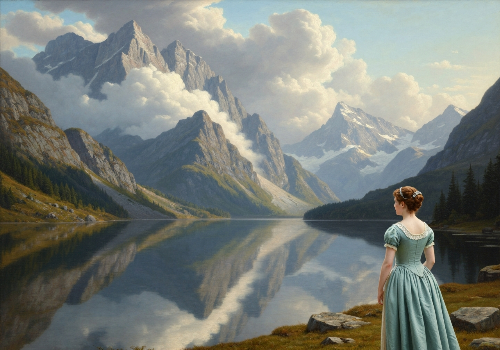

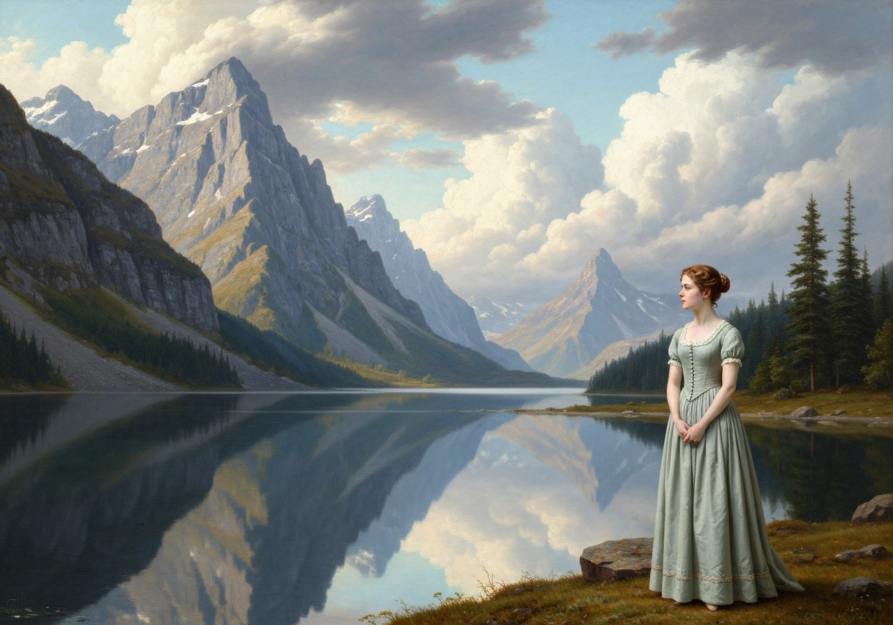
{/* metadata:image_007:end */}

 And
when we _do_ return, it shall not be like other travellers, without
being able to give one accurate idea of anything. We _will_ know where
we have gone--we _will_ recollect what we have seen. Lakes, mountains,
and rivers, shall not be jumbled together in our imaginations; nor, when
we attempt to describe any particular scene, will we begin quarrelling
about its relative situation. Let _our_ first effusions be less
insupportable than those of the generality of travellers.”

[Illustration:

     “At the door”
]
