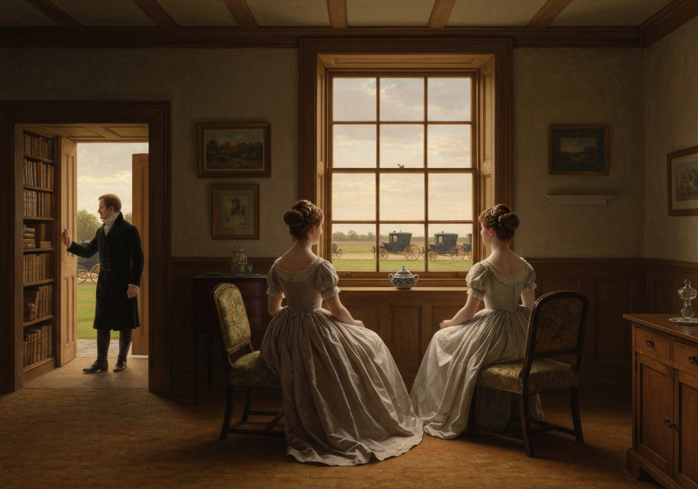
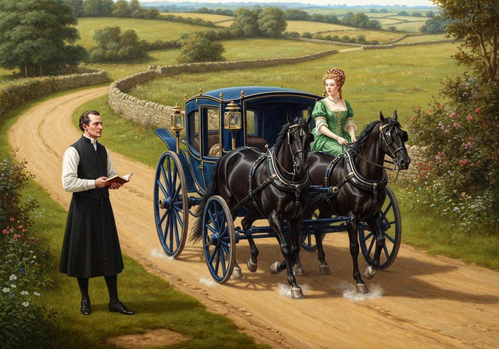
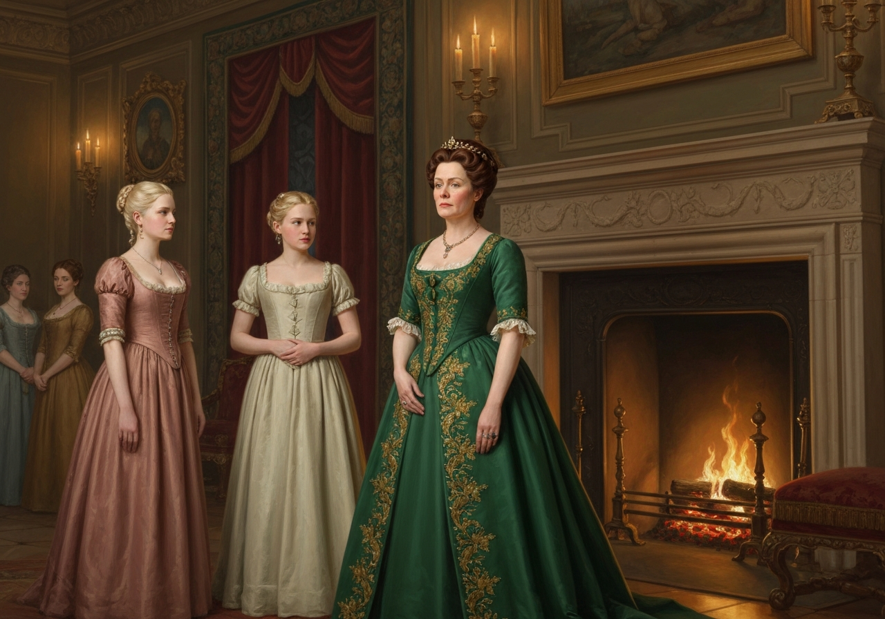
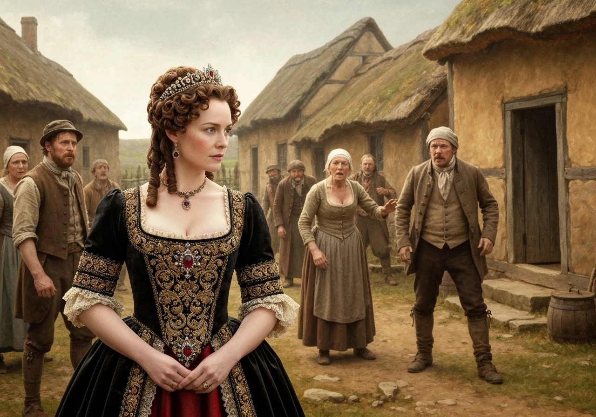
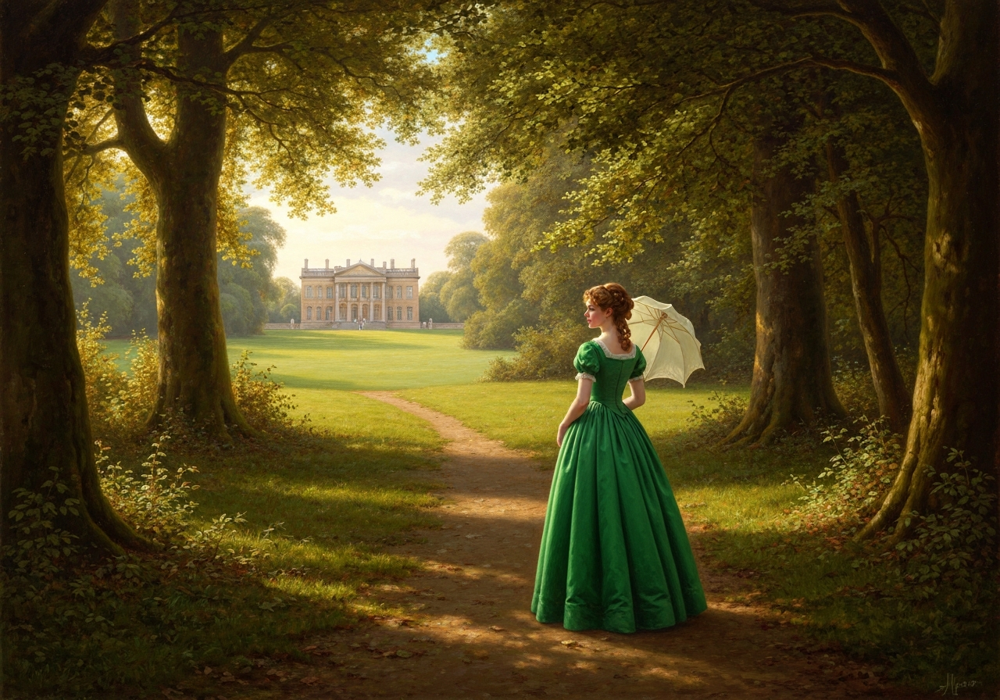
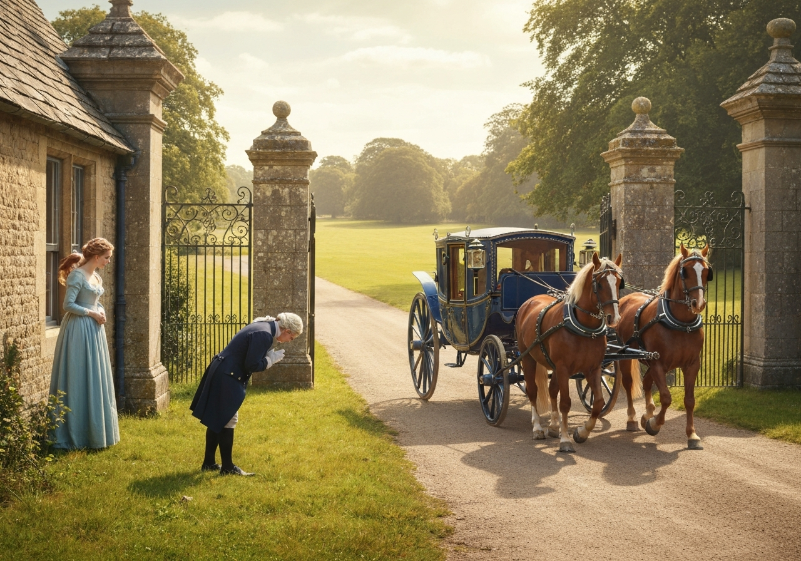
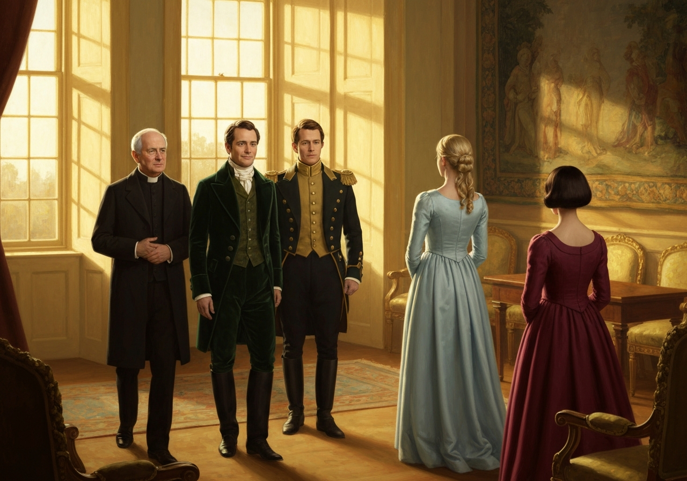

import Callout from '@/components/Callout.astro'

Sir William stayed only a week at Hunsford; but his visit was long
enough to convince him of his daughter’s being most comfortably settled,
and of her possessing such a husband and such a neighbour as were not
often met with. While Sir William was with them, Mr. Collins devoted his
mornings to driving him out in his gig, and showing him the country: but
when he went away, the whole family returned to their usual employments,
and Elizabeth was thankful to find that they did not see more of her
cousin by the alteration; for the chief of the time between breakfast
and dinner was now passed by him either at work in the garden, or in
reading and writing, and looking out of window in his own book room,
which fronted the road. The room in which the ladies sat was backwards.

{/* metadata:Q001_charlotte_arrangement:start */}
<Callout title="Memorable Quote" variant="note">Elizabeth at first had rather wondered that Charlotte should not prefer the dining parlour for common use; it was a better sized room, and had a pleasanter aspect: but she soon saw that her friend had an excellent reason for what she did, for Mr. Collins would undoubtedly have been much less in his own apartment had they sat in one equally lively; and she gave Charlotte credit for the arrangement.</Callout>
{/* metadata:Q001_charlotte_arrangement:end */}

{/* metadata:A001_parsonage_layout:start */}
<Callout title="Analysis" variant="explanation">
Elizabeth's perception of the Parsonage layout reveals Charlotte's strategic domestic management. By choosing the backwards drawing-room, Charlotte ensures Mr. Collins spends less time with company, exposing the practical compromises required in her marriage. This arrangement demonstrates Elizabeth's growing recognition that Charlotte has made peace with a life of calculated avoidance rather than companionship.
</Callout>
{/* metadata:A001_parsonage_layout:end */}

{/* metadata:I001_parsonage_drawing_room:start */}

{/* metadata:I001_parsonage_drawing_room:end */}

{/* metadata:Q002_collins_carriage_news:start */}
<Callout title="Memorable Quote" variant="note">From the drawing-room they could distinguish nothing in the lane, and were indebted to Mr. Collins for the knowledge of what carriages went along, and how often especially Miss De Bourgh drove by in her phaeton, which he never failed coming to inform them of, though it happened almost every day.</Callout>
{/* metadata:Q002_collins_carriage_news:end */}

She not unfrequently stopped at the Parsonage, and had
a few minutes’ conversation with Charlotte, but was scarcely ever
prevailed on to get out.

{/* metadata:A003_mr_collins_obsequiousness:start */}
<Callout title="Analysis" variant="explanation">
Mr. Collins' vigilance for Miss de Bourgh's phaeton and his compulsion to report every passing of her carriage illustrate the relentless performance of deference required by his position at Hunsford. His daily walks to Rosings and his morning-long vigil at the lodge gates reveal both his ridiculousness and the crushing social machinery that governs his existence. The narrator's dry observation that this happened 'almost every day' underscores the comic monotony of his devotion to his patroness.
</Callout>
{/* metadata:A003_mr_collins_obsequiousness:end */}

{/* metadata:I002_lady_catherine_carriage:start */}

{/* metadata:I002_lady_catherine_carriage:end */}

Very few days passed in which Mr. Collins did not walk to Rosings, and
not many in which his wife did not think it necessary to go likewise;
and till Elizabeth recollected that there might be other family livings
to be disposed of, she could not understand the sacrifice of so many
hours.

{/* metadata:Q003_lady_catherine_inspection:start */}
<Callout title="Memorable Quote" variant="note">Now and then they were honoured with a call from her Ladyship, and nothing escaped her observation that was passing in the room during these visits. She examined into their employments, looked at their work, and advised them to do it differently; found fault with the arrangement of the furniture, or detected the housemaid in negligence; and if she accepted any refreshment, seemed to do it only for the sake of finding out that Mrs. Collins’s joints of meat were too large for her family.</Callout>
{/* metadata:Q003_lady_catherine_inspection:end */}

{/* metadata:I003_lady_catherine_inspection:start */}

{/* metadata:I003_lady_catherine_inspection:end */}

{/* metadata:Q004_lady_catherine_magistrate:start */}
<Callout title="Memorable Quote" variant="note">Elizabeth soon perceived, that though this great lady was not in the commission of the peace for the county, she was a most active magistrate in her own parish, the minutest concerns of which were carried to her by Mr. Collins; and whenever any of the cottagers were disposed to be quarrelsome, discontented, or too poor, she sallied forth into the village to settle their differences, silence their complaints, and scold them into harmony and plenty.</Callout>
{/* metadata:Q004_lady_catherine_magistrate:end */}

{/* metadata:A002_lady_catherine_magistrate:start */}
<Callout title="Analysis" variant="explanation">
Lady Catherine's self-appointed role as magistrate of her parish exposes the absurdity of aristocratic interference in common matters. Her tendency to sally forth into the village to settle disputes and silence complaints reveals the patronizing approach of the upper class toward those they consider beneath them. This behavior demonstrates how unchecked power allows her to disguise meddling as benevolence, imposing order through sheer force of social authority.
</Callout>
{/* metadata:A002_lady_catherine_magistrate:end */}

{/* metadata:I004_cottagers_quarrel:start */}

{/* metadata:I004_cottagers_quarrel:end */}

The entertainment of dining at Rosings was repeated about twice a week;
and, allowing for the loss of Sir William, and there being only one
card-table in the evening, every such entertainment was the counterpart
of the first. Their other engagements were few, as the style of living
of the neighbourhood in general was beyond the Collinses’ reach. This,
however, was no evil to Elizabeth, and upon the whole she spent her time
comfortably enough: there were half hours of pleasant conversation with
Charlotte, and the weather was so fine for the time of year, that she
had often great enjoyment out of doors.

{/* metadata:Q005_elizabeth_beyond_reach:start */}
<Callout title="Memorable Quote" variant="note">Her favourite walk, and where she frequently went while the others were calling on Lady Catherine, was along the open grove which edged that side of the park, where there was a nice sheltered path, which no one seemed to value but herself, and where she felt beyond the reach of Lady Catherine’s curiosity.</Callout>
{/* metadata:Q005_elizabeth_beyond_reach:end */}

{/* metadata:A004_elizabeth_solitude:start */}
<Callout title="Analysis" variant="explanation">
Elizabeth's discovery of the sheltered grove path represents her need for psychological refuge from the oppressive attention of Lady Catherine. This private space, valued by no one else, becomes vital to her comfort and symbolizes her resistance to the stifling scrutiny that pervades the Parsonage existence. Her retreat to the grove while others call on Lady Catherine is a quiet act of self-preservation, carving out an interior freedom that social obligation cannot reach.
</Callout>
{/* metadata:A004_elizabeth_solitude:end */}

{/* metadata:I005_elizabeth_grove_walk:start */}

{/* metadata:I005_elizabeth_grove_walk:end */}

In this quiet way the first fortnight of her visit soon passed away.
Easter was approaching, and the week preceding it was to bring an
addition to the family at Rosings, which in so small a circle must be
important. Elizabeth had heard, soon after her arrival, that Mr. Darcy
was expected there in the course of a few weeks; and though there were
not many of her acquaintance whom she did not prefer, his coming would
furnish one comparatively new to look at in their Rosings parties, and
she might be amused in seeing how hopeless Miss Bingley’s designs on him
were, by his behaviour to his cousin, for whom he was evidently destined
by Lady Catherine, who talked of his coming with the greatest
satisfaction, spoke of him in terms of the highest admiration, and
seemed almost angry to find that he had already been frequently seen by
Miss Lucas and herself.

{/* metadata:A005_darcy_anticipation:start */}
<Callout title="Analysis" variant="explanation">
Elizabeth's mixed feelings about Darcy's arrival demonstrate her internal conflict regarding his character. While professing indifference, she admits his presence will provide novelty to the Rosings circle and reveals her secret interest in observing his behaviour toward his cousin, whom Lady Catherine evidently intends for him. This ambivalence—framed as detached amusement—foreshadows her continued preoccupation with Darcy and the emotional entanglement she has not yet acknowledged.
</Callout>
{/* metadata:A005_darcy_anticipation:end */}

His arrival was soon known at the Parsonage; for Mr. Collins was walking
the whole morning within view of the lodges opening into Hunsford Lane,
in order to have the earliest assurance of it; and, after making his bow as the carriage
turned into the park,

{/* metadata:Q006_darcy_early_intelligence:start */}
<Callout title="Memorable Quote" variant="note">hurried home with the great intelligence.</Callout>
{/* metadata:Q006_darcy_early_intelligence:end */}

{/* metadata:I006_darcy_arrival:start */}

{/* metadata:I006_darcy_arrival:end */}

On the
following morning he hastened to Rosings to pay his respects. There were
two nephews of Lady Catherine to require them, for Mr. Darcy had brought
with him a Colonel Fitzwilliam, the younger son of his uncle, Lord ----;
and, to the great surprise of all the party, when Mr. Collins returned,
the gentlemen accompanied him. Charlotte had seen them from her
husband’s room, crossing the road, and immediately running into the
other, told the girls what an honour they might expect, adding,--

“I may thank you, Eliza, for this piece of civility. Mr. Darcy would
never have come so soon to wait upon me.”

Elizabeth had scarcely time to disclaim all right to the compliment
before their approach was announced by the door-bell, and shortly
afterwards the three gentlemen entered the room. Colonel Fitzwilliam,
who led the way, was about thirty, not handsome, but in person and
address most truly the gentleman. Mr. Darcy looked just as he had been
used to look in Hertfordshire, paid his compliments, with his usual
reserve, to Mrs. Collins; and whatever might be his feelings towards her
friend, met her with every appearance of composure. Elizabeth merely
courtesied to him, without saying a word.

{/* metadata:I007_three_gentlemen_call:start */}

{/* metadata:I007_three_gentlemen_call:end */}

Colonel Fitzwilliam entered into conversation directly, with the
readiness and ease of a well-bred man, and talked very pleasantly; but
his cousin, after having addressed a slight observation on the house and
garden to Mrs. Collins, sat for some time without speaking to anybody.
At length, however, his civility was so far awakened as to inquire of
Elizabeth after the health of her family. She answered him in the usual
way; and, after a moment’s pause, added,--

“My eldest sister has been in town these three months. Have you never
happened to see her there?”

{/* metadata:A006_colonel_fitzwilliam_introduction:start */}
<Callout title="Analysis" variant="explanation">
The introduction of Colonel Fitzwilliam provides crucial contrast to Mr. Darcy's reserved demeanor. His readiness and ease in conversation immediately establish him as a genuinely well-bred gentleman, unlike Darcy's affected reserve, which the narrator pointedly distinguishes from true good breeding. This juxtaposition allows Elizabeth and the reader to recognize that Darcy's silence is a choice rather than an inevitable consequence of his elevated station.
</Callout>
{/* metadata:A006_colonel_fitzwilliam_introduction:end */}

{/* metadata:Q007_elizabeth_suspicion_confirmed:start */}
<Callout title="Memorable Quote" variant="note">She was perfectly sensible that he never had: but she wished to see whether he would betray any consciousness of what had passed between the Bingleys and Jane; and she thought he looked a little confused as he answered that he had never been so fortunate as to meet Miss Bennet.</Callout>
{/* metadata:Q007_elizabeth_suspicion_confirmed:end */}

{/* metadata:A007_elizabeth_test_darcy:start */}
<Callout title="Analysis" variant="explanation">
Elizabeth's calculated inquiry about Jane's presence in London serves as a deliberate test of Mr. Darcy's conscience and self-possession. By observing his confusion, she confirms her suspicion of his awareness of his interference in Bingley and Jane's relationship. This moment reveals Elizabeth's analytical nature and her growing conviction that Darcy bears responsibility for her sister's unhappiness, a conviction that will fuel the confrontation to come.
</Callout>
{/* metadata:A007_elizabeth_test_darcy:end */}

The subject was pursued no further, and the gentlemen soon afterwards went away.
