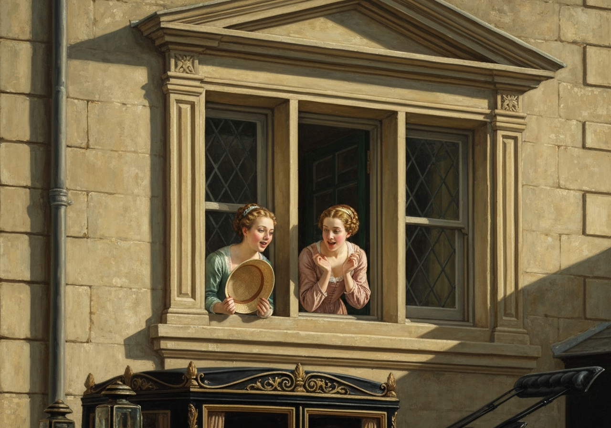
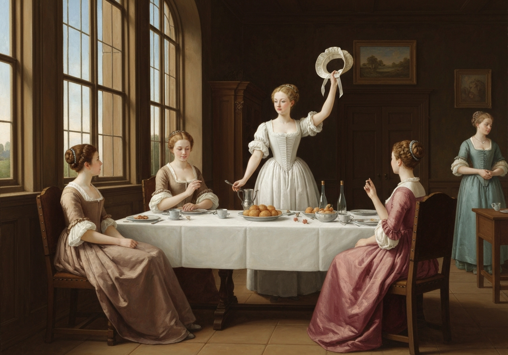
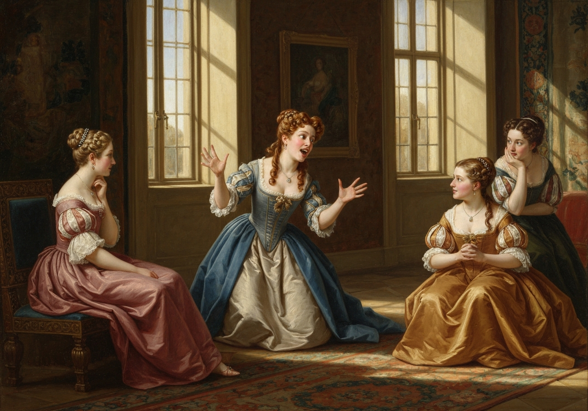
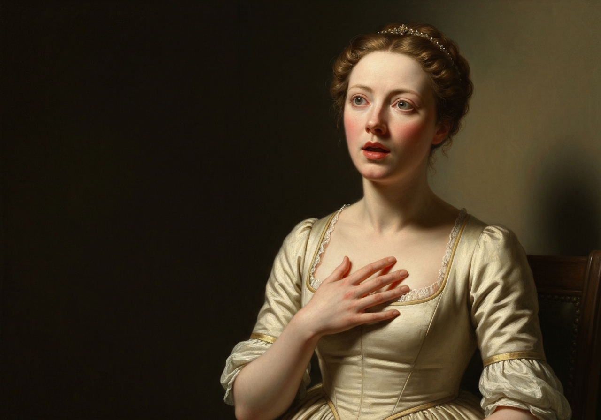
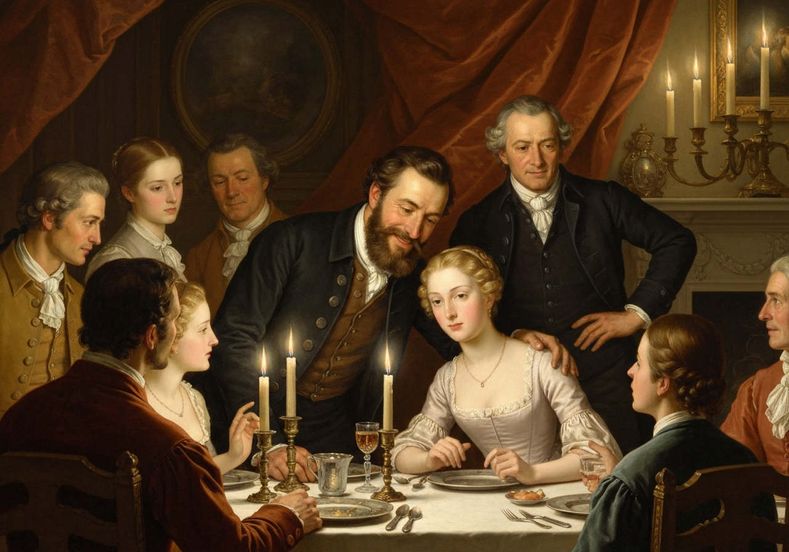
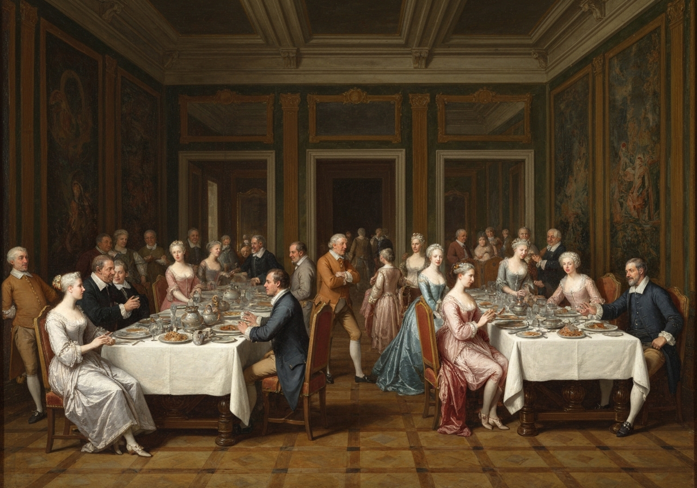

import Callout from '@/components/Callout.astro'

It was the second week in May, in which the three young ladies set out
together from Gracechurch Street for the town of ----, in Hertfordshire;
and, as they drew near the appointed inn where Mr. Bennet’s carriage was
to meet them, they quickly perceived, in token of the coachman’s
punctuality, both Kitty and Lydia looking out of a dining-room upstairs.

{/* metadata:image_001:start */}

{/* metadata:image_001:end */}

These two girls had been above an hour in the place, happily employed
in visiting an opposite milliner, watching the sentinel on guard, and
dressing a salad and cucumber.

{/* metadata:analysis_001:start */}
<Callout title="Analysis" variant="explanation">
The chapter opens with the reunion of the Bennet sisters at the inn, revealing Austen's skill in exposing social pretensions through Lydia and Kitty's shallow behaviors. Their arrival an hour early, spent frivolously on millinery and spectating, contrasts sharply with Elizabeth and Jane's more composed nature, establishing the tension between propriety and imprudence. The detail of the sisters 'dressing a salad and cucumber' while awaiting their kin encapsulates Austen's comic precision: trivial domestic activity rendered as the height of Lydia's ambition.
</Callout>
{/* metadata:analysis_001:end */}

After welcoming their sisters, they triumphantly displayed a table set
out with such cold meat as an inn larder usually affords, exclaiming,
“Is not this nice? is not this an agreeable surprise?”

“And we mean to treat you all,” added Lydia; “but you must lend us the
money, for we have just spent ours at the shop out there.”

{/* metadata:quote_001:start */}
<Callout title="Memorable Quote" variant="note">Then showing her purchases,--“Look here, I have bought this bonnet. I do not think it is very pretty; but I thought I might as well buy it as not.</Callout>
{/* metadata:quote_001:end */}

{/* metadata:quote_002:start */}
<Callout title="Memorable Quote" variant="note">I shall pull it to pieces as soon as I get home, and see if I can make it up any better.”</Callout>
{/* metadata:quote_002:end */}

{/* metadata:analysis_002:start */}
<Callout title="Analysis" variant="explanation">
Lydia's impulsive purchasing of the bonnet she finds ugly exemplifies her thoughtless consumerism and frivolous attitude toward possessions and money. Her declared intention to pull it to pieces and reassemble it mirrors her destructive approach to life itself--breaking apart what exists without creating anything of lasting value, a foreshadowing of the chaos she will bring to the family. The casual admission that she and Kitty have already spent their money and must borrow from their sisters further underscores her complete indifference to consequence or economy.
</Callout>
{/* metadata:analysis_002:end */}

{/* metadata:image_002:start */}

{/* metadata:image_002:end */}

And when her sisters abused it as ugly, she added, with perfect
unconcern, “Oh, but there were two or three much uglier in the shop; and
when I have bought some prettier-coloured satin to trim it with fresh, I
think it will be very tolerable. Besides, it will not much signify what
one wears this summer, after the ----shire have left Meryton, and they
are going in a fortnight.”

“Are they, indeed?” cried Elizabeth, with the greatest satisfaction.

“They are going to be encamped near Brighton; and I do so want papa to
take us all there for the summer! It would be such a delicious scheme,
and I dare say would hardly cost anything at all. Mamma would like to
go, too, of all things! Only think what a miserable summer else we shall
have!”

{/* metadata:quote_003:start */}
<Callout title="Memorable Quote" variant="note">“Yes,” thought Elizabeth; “_that_ would be a delightful scheme, indeed, and completely do for us at once.</Callout>
{/* metadata:quote_003:end */}

Good Heaven! Brighton and a whole
campful of soldiers, to us, who have been overset already by one poor
regiment of militia, and the monthly balls of Meryton!”

{/* metadata:analysis_003:start */}
<Callout title="Analysis" variant="explanation">
Austen employs Elizabeth's internal monologue to deliver biting irony about the Brighton scheme. The sarcastic observation that Brighton and 'a whole campful of soldiers' would 'completely do for us at once' reveals Elizabeth's awareness of the moral dangers her sisters face, even as she underestimates the true extent of that danger. The reference to the family having been 'overset already by one poor regiment of militia' and the monthly balls of Meryton sharpens the irony, measuring the household's vulnerability against the far greater temptations Brighton would offer.
</Callout>
{/* metadata:analysis_003:end */}

{/* metadata:image_003:start */}

{/* metadata:image_003:end */}

“Now I have got some news for you,” said Lydia, as they sat down to
table. “What do you think? It is excellent news, capital news, and about
a certain person that we all like.”

Jane and Elizabeth looked at each other, and the waiter was told that he
need not stay. Lydia laughed, and said,--

“Ay, that is just like your formality and discretion. You thought the
waiter must not hear, as if he cared! I dare say he often hears worse
things said than I am going to say. But he is an ugly fellow! I am glad
he is gone. I never saw such a long chin in my life. Well, but now for
my news: it is about dear Wickham; too good for the waiter, is not it?
There is no danger of Wickham’s marrying Mary King--there’s for you! She
is gone down to her uncle at Liverpool; gone to stay. Wickham is safe.”

“And Mary King is safe!” added Elizabeth; “safe from a connection
imprudent as to fortune.”

“She is a great fool for going away, if she liked him.”

“But I hope there is no strong attachment on either side,” said Jane.

“I am sure there is not on _his_. I will answer for it, he never cared
three straws about her. Who _could_ about such a nasty little freckled
thing?”

{/* metadata:quote_004:start */}
<Callout title="Memorable Quote" variant="note">Elizabeth was shocked to think that, however incapable of such coarseness of _expression_ herself, the coarseness of the _sentiment_ was little other than her own breast had formerly harboured and fancied liberal!</Callout>
{/* metadata:quote_004:end */}

{/* metadata:analysis_004:start */}
<Callout title="Analysis" variant="explanation">
The revelation about Wickham and Mary King marks Elizabeth's crucial moment of self-recognition. Her shock at Lydia's coarseness becomes a mirror, forcing her to confront that her former admiration for Wickham was essentially the same sentiment wrapped in more elegant expression. Austen renders this epiphany with characteristic economy: Elizabeth is 'shocked to think' that the sentiment itself was little different from one she had formerly harboured and fancied liberal, making the moral turning point both precise and devastating.
</Callout>
{/* metadata:analysis_004:end */}

{/* metadata:image_004:start */}

{/* metadata:image_004:end */}

As soon as all had ate, and the elder ones paid, the carriage was
ordered; and, after some contrivance, the whole party, with all their
boxes, workbags, and parcels, and the unwelcome addition of Kitty’s and
Lydia’s purchases, were seated in it.

{/* metadata:quote_005:start */}
<Callout title="Memorable Quote" variant="note">“How nicely we are crammed in!” cried Lydia. “I am glad I brought my bonnet, if it is only for the fun of having another band-box!</Callout>
{/* metadata:quote_005:end */}

Well, now
let us be quite comfortable and snug, and talk and laugh all the way
home. And in the first place, let us hear what has happened to you all
since you went away. Have you seen any pleasant men? Have you had any
flirting? I was in great hopes that one of you would have got a husband
before you came back. Jane will be quite an old maid soon, I declare.
She is almost three-and-twenty! Lord! how ashamed I should be of not
being married before three-and-twenty! My aunt Philips wants you so to
get husbands you can’t think. She says Lizzy had better have taken Mr.
Collins; but _I_ do not think there would have been any fun in it. Lord!
how I should like to be married before any of you! and then I would
_chaperon_ you about to all the balls. Dear me! we had such a good piece
of fun the other day at Colonel Forster’s! Kitty and me were to spend
the day there, and Mrs. Forster promised to have a little dance in the
evening; (by-the-bye, Mrs. Forster and me are _such_ friends!) and so
she asked the two Harringtons to come: but Harriet was ill, and so Pen
was forced to come by herself; and then, what do you think we did? We
dressed up Chamberlayne in woman’s clothes, on purpose to pass for a
lady,--only think what fun! Not a soul knew of it, but Colonel and Mrs.
Forster, and Kitty and me, except my aunt, for we were forced to borrow
one of her gowns; and you cannot imagine how well he looked! When Denny,
and Wickham, and Pratt, and two or three more of the men came in, they
did not know him in the least. Lord! how I laughed! and so did Mrs.
Forster. I thought I should have died. And _that_ made the men suspect
something, and then they soon found out what was the matter.”

With such kind of histories of their parties and good jokes did Lydia,
assisted by Kitty’s hints and additions, endeavour to amuse her
companions all the way to Longbourn. Elizabeth listened as little as she
could, but there was no escaping the frequent mention of Wickham’s name.

{/* metadata:analysis_005:start */}
<Callout title="Analysis" variant="explanation">
The carriage scene reveals Lydia's character at its most undisciplined: seeking attention through vulgarity, cruelty in mocking others' appearances, reckless social behavior in dressing Chamberlayne, and complete obliviousness to decorum. The 'band-box' joke epitomizes her obsession with trivialities during a moment that foreshadows the coming scandal. Elizabeth's passive endurance--listening 'as little as she could'--underscores the exhausting social labor required of the more perceptive sisters simply to survive Lydia's company, a dynamic that will intensify as the novel progresses.
</Callout>
{/* metadata:analysis_005:end */}

Their reception at home was most kind. Mrs. Bennet rejoiced to see Jane
in undiminished beauty; and more than once during dinner did Mr. Bennet
say voluntarily to Elizabeth,----

{/* metadata:quote_007:start */}
<Callout title="Memorable Quote" variant="note">“I am glad you are come back, Lizzy.”</Callout>
{/* metadata:quote_007:end */}

{/* metadata:image_007:start */}

{/* metadata:image_007:end */}

Their party in the dining-room was large, for almost all the Lucases
came to meet Maria and hear the news; and various were the subjects
which occupied them: Lady Lucas was inquiring of Maria, across the
table, after the welfare and poultry of her eldest daughter; Mrs. Bennet
was doubly engaged, on one hand collecting an account of the present
fashions from Jane, who sat some way below her, and on the other,
retailing them all to the younger Miss Lucases; and Lydia, in a voice
rather louder than any other person’s, was enumerating the various
pleasures of the morning to anybody who would hear her.

“Oh, Mary,” said she, “I wish you had gone with us, for we had such fun!
as we went along Kitty and me drew up all the blinds, and pretended
there was nobody in the coach; and I should have gone so all the way, if
Kitty had not been sick; and when we got to the George, I do think we
behaved very handsomely, for we treated the other three with the nicest
cold luncheon in the world, and if you would have gone, we would have
treated you too. And then when we came away it was such fun! I thought
we never should have got into the coach. I was ready to die of laughter.
And then we were so merry all the way home! we talked and laughed so
loud, that anybody might have heard us ten miles off!”

To this, Mary very gravely replied,

{/* metadata:quote_006:start */}
<Callout title="Memorable Quote" variant="note">“Far be it from me, my dear sister, to depreciate such pleasures. They would doubtless be congenial with the generality of female minds. But I confess they would have no charms for _me_. I should infinitely prefer a book.”</Callout>
{/* metadata:quote_006:end */}

But of this answer Lydia heard not a word. She seldom listened to
anybody for more than half a minute, and never attended to Mary at all.

{/* metadata:analysis_006:start */}
<Callout title="Analysis" variant="explanation">
The dinner scene presents a masterful tableau of provincial social life, with Austen weaving multiple conversations simultaneously--Lady Lucas's poultry inquiries, Mrs. Bennet's fashion obsessions, and Lydia's boisterous recounting--all illustrating the limited horizons of their social sphere. Mr. Bennet's quiet, repeated welcome to Elizabeth contrasts with the general chaos, revealing their special bond amid the noise. Mary's pedantic rejoinder that she would 'infinitely prefer a book' adds a further comic layer, her affectation of superiority as hollow in its own way as Lydia's vulgarity.
</Callout>
{/* metadata:analysis_006:end */}

{/* metadata:image_006:start */}

{/* metadata:image_006:end */}

In the afternoon Lydia was urgent with the rest of the girls to walk to
Meryton, and see how everybody went on; but Elizabeth steadily opposed
the scheme. It should not be said, that the Miss Bennets could not be at
home half a day before they were in pursuit of the officers. There was
another reason, too, for her opposition. She dreaded seeing Wickham
again, and was resolved to avoid it as long as possible. The comfort to
_her_, of the regiment’s approaching removal, was indeed beyond
expression. In a fortnight they were to go, and once gone, she hoped
there could be nothing more to plague her on his account.

She had not been many hours at home, before she found that the Brighton
scheme, of which Lydia had given them a hint at the inn, was under
frequent discussion between her parents. Elizabeth saw directly that her
father had not the smallest intention of yielding; but his answers were
at the same time so vague and equivocal, that her mother, though often
disheartened, had never yet despaired of succeeding at last.

{/* metadata:analysis_007:start */}
<Callout title="Analysis" variant="explanation">
The chapter closes with Elizabeth's private dread and strategic opposition to the Meryton walk, revealing her as the only sister with true foresight. Her desire to avoid seeing Wickham demonstrates her psychological distance from her former attachment. The final revelation of Mr. Bennet's evasive tactics regarding Brighton foreshadows his fatal indecision that will enable the coming catastrophe, his answers 'so vague and equivocal, that her mother, though often disheartened, had never yet despaired of succeeding at last.'
</Callout>
{/* metadata:analysis_007:end */}
