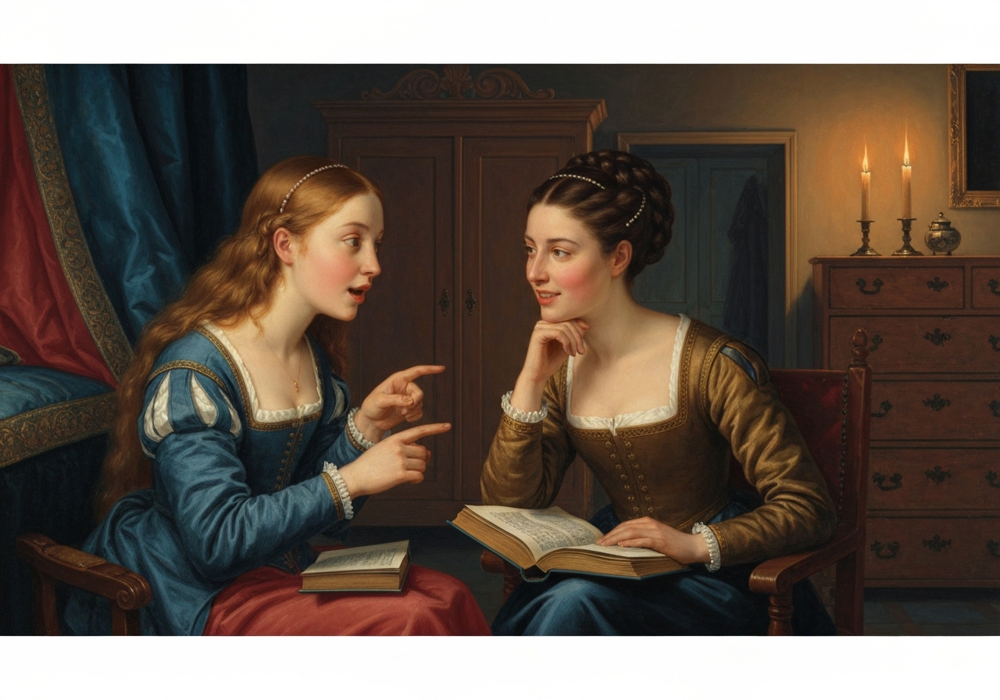
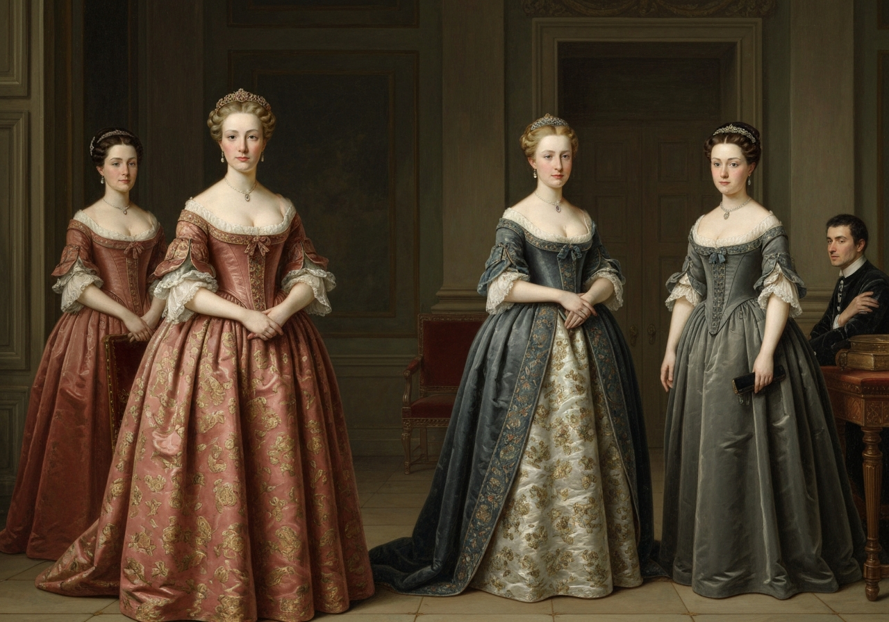
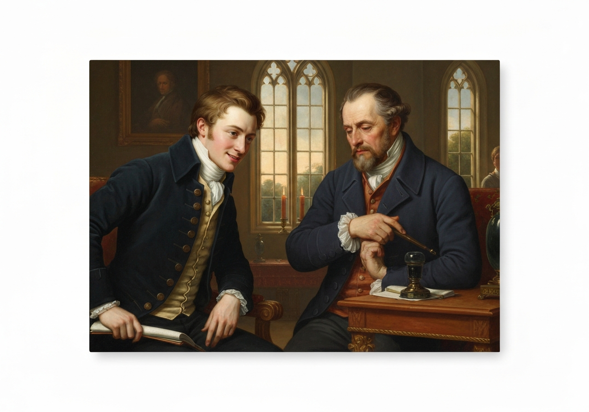
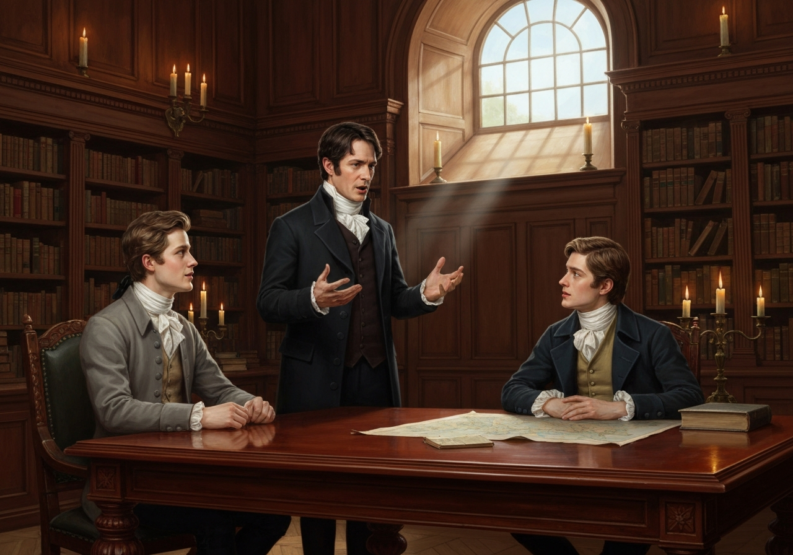
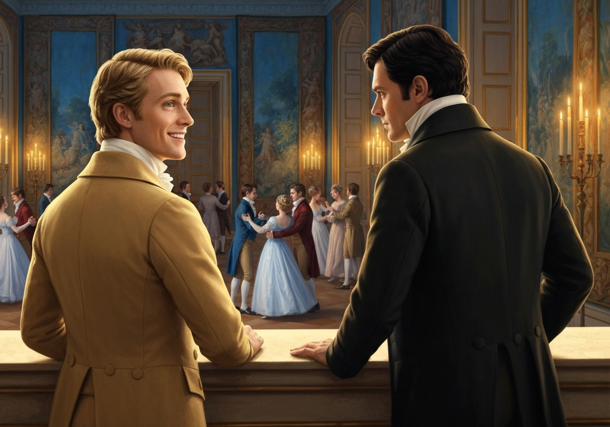
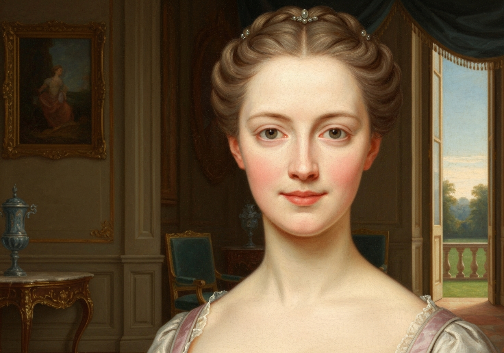
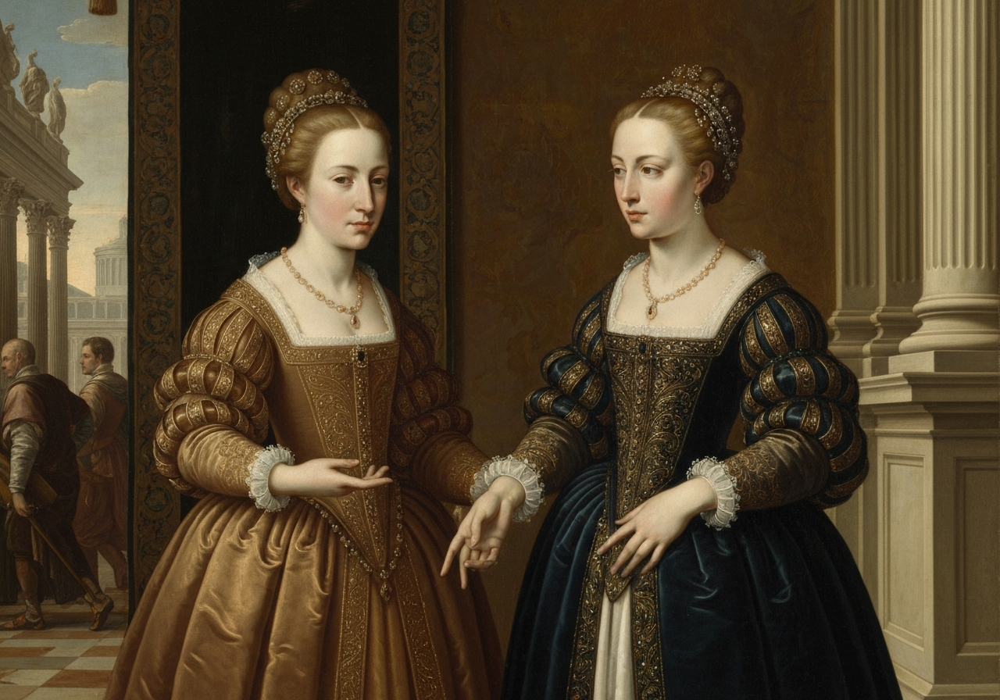

import Callout from '@/components/Callout.astro'

[Illustration]

When Jane and Elizabeth were alone, the former, who had been cautious in
her praise of Mr. Bingley before, expressed to her sister how very much
she admired him.

<!-- metadata:image-1:start -->
<Callout title="Image [1] The Sisters' Private Talk" variant="example">

</Callout>
<!-- metadata:image-1:end -->

<!-- metadata:quote-1:start -->
<Callout title="Memorable Quote" variant="note">\n  He is just what a young man ought to be—sensible, good-humoured, lively; and I never saw such happy manners! so much ease, with such perfect good breeding!\n</Callout>
<!-- metadata:quote-1:end -->

“He is also handsome,” replied Elizabeth, “which a young man ought
likewise to be if he possibly can. His character is thereby complete.”

“I was very much flattered by his asking me to dance a second time. I
did not expect such a compliment.”

“Did not you? _I_ did for you. But that is one great difference between
us. <!-- metadata:quote-2:start -->
<Callout title="Memorable Quote" variant="tip">\n  Compliments always take you by surprise, and me never. What could be more natural than his asking you again?\n</Callout>
<!-- metadata:quote-2:end --> He could not help
seeing that you were about five times as pretty as every other woman in
the room. No thanks to his gallantry for that. Well, he certainly is
very agreeable, and I give you leave to like him. You have liked many a
stupider person.”

“Dear Lizzy!”

“Oh, you are a great deal too apt, you know, to like people in general.
You never see a fault in anybody. All the world are good and agreeable
in your eyes. I never heard you speak ill of a human being in my life.”

<!-- metadata:analysis-1:start -->
<Callout title="Analysis [1]" variant="explanation">
Jane’s reluctance to speak ill of anyone, even after a cold reception, highlights her uniquely gentle disposition. She possesses a natural tendency to find the good in every character while overlooking their obvious flaws. This quality makes her both admirable to Elizabeth and vulnerable to social manipulation.
</Callout>
<!-- metadata:analysis-1:end -->

“I would wish not to be hasty in censuring anyone; but I always speak
what I think.”

“I know you do: and it is _that_ which makes the wonder. With _your_
good sense, to be so honestly blind to the follies and nonsense of
others! <!-- metadata:quote-3:start -->
<Callout title="Memorable Quote" variant="important">\n  Affectation of candour is common enough; one meets with it everywhere. But to be candid without ostentation or design—to take the good of everybody’s character and make it still better—belongs to you alone.\n</Callout>
<!-- metadata:quote-3:end --> And so, you like this man’s sisters,
too, do you? Their manners are not equal to his.”

“Certainly not, at first; but they are very pleasing women when you
converse with them. Miss Bingley is to live with her brother, and keep
his house; and I am much mistaken if we shall not find a very charming
neighbour in her.”

Elizabeth listened in silence, but was not convinced: their behaviour at
the assembly had not been calculated to please in general; and with more
quickness of observation and less pliancy of temper than her sister, and
with a judgment, too, unassailed by any attention to herself, she was
very little disposed to approve them.

<!-- metadata:analysis-2:start -->
<Callout title="Analysis [2]" variant="explanation">
Elizabeth serves as the pragmatic counterpoint to Jane’s idealism, using her quick observation to dissect social behavior. She recognizes the pride and conceit of the Bingley sisters where Jane only sees pleasing manners. Her judgment is sharpened by her lack of personal investment in the Bingley party's approval.
</Callout>
<!-- metadata:analysis-2:end --> <!-- metadata:quote-4:start -->
<Callout title="Memorable Quote" variant="summary">\n  They were, in fact, very fine ladies; not deficient in good-humour when they were pleased, nor in the power of being agreeable where they chose it; but proud and conceited.\n</Callout>
<!-- metadata:quote-4:end -->
They were rather handsome; had been educated in one of the first private
seminaries in town; had a fortune of twenty thousand pounds; were in the
habit of spending more than they ought, and of associating with people
of rank; and were, therefore, in every respect entitled to think well of
themselves and meanly of others.

<!-- metadata:image-2:start -->
<Callout title="Image [2] The Bingley Sisters in Town" variant="example">

</Callout>
<!-- metadata:image-2:end --> They were of a respectable family in
the north of England; a circumstance more deeply impressed on their
memories than that their brother’s fortune and their own had been
acquired by trade.

<!-- metadata:analysis-3:start -->
<Callout title="Analysis [3]" variant="explanation">
The Bingley fortune’s origin in trade is a significant detail that influences their social standing and internal anxieties. The sisters are more concerned with their association with people of rank than the recent history of their family’s success. This dynamic illustrates the fluid but still rigid class boundaries of Regency England.
</Callout>
<!-- metadata:analysis-3:end -->

Mr. Bingley inherited property to the amount of nearly a hundred
thousand pounds from his father, who had intended to purchase an estate,
but did not live to do it.

<!-- metadata:analysis-4:start -->
<Callout title="Analysis [4]" variant="explanation">
Mr. Bingley's decision to rent Netherfield House rather than buy an estate reflects the 'easiness' of his temper. He is satisfied with the immediate situation and feels no pressing need to establish a permanent landed legacy. This ductility makes him a perfect companion for the more decisive and demanding Darcy.
</Callout>
<!-- metadata:analysis-4:end --> Mr. Bingley intended it likewise, and
sometimes made choice of his county; but, as he was now provided with a
good house and the liberty of a manor, it was doubtful to many of those
who best knew the easiness of his temper, whether he might not spend the
remainder of his days at Netherfield, and leave the next generation to
purchase.

His sisters were very anxious for his having an estate of his own; but
though he was now established only as a tenant, Miss Bingley was by no
means unwilling to preside at his table; nor was Mrs. Hurst, who had
married a man of more fashion than fortune, less disposed to consider
his house as her home when it suited her. Mr. Bingley had not been of
age two years when he was tempted, by an accidental recommendation, to
look at Netherfield House. He did look at it, and into it, for half an
hour; was pleased with the situation and the principal rooms, satisfied
with what the owner said in its praise, and took it immediately.

<!-- metadata:image-3:start -->
<Callout title="Image [3] Netherfield House Inspection" variant="example">

</Callout>
<!-- metadata:image-3:end -->

Between him and Darcy there was a very steady friendship, in spite of a
great opposition of character.

<!-- metadata:analysis-5:start -->
<Callout title="Analysis [5]" variant="explanation">
The friendship between Darcy and Bingley is built on a steady mutual regard despite their opposing temperaments. Darcy respects Bingley's openness, while Bingley relies heavily on Darcy's superior understanding and judgment. Their bond shows that intellectual compatibility can often override differences in social behavior.
</Callout>
<!-- metadata:analysis-5:end --> Bingley was endeared to Darcy by the
easiness, openness, and ductility of his temper, though no disposition
could offer a greater contrast to his own, and though with his own he
never appeared dissatisfied. On the strength of Darcy’s regard, Bingley
had the firmest reliance, and of his judgment the highest opinion. <!-- metadata:quote-5:start -->
<Callout title="Memorable Quote" variant="important">\n  In understanding, Darcy was the superior. Bingley was by no means deficient; but Darcy was clever.\n</Callout>
<!-- metadata:quote-5:end -->

<!-- metadata:image-4:start -->
<Callout title="Image [4] The Intellectual Bond" variant="example">

</Callout>
<!-- metadata:image-4:end --> He was at the same time haughty,
reserved, and fastidious; and his manners, though well bred, were not
inviting. In that respect his friend had greatly the advantage. <!-- metadata:quote-6:start -->
<Callout title="Memorable Quote" variant="note">\n  Bingley was sure of being liked wherever he appeared; Darcy was continually giving offence.\n</Callout>
<!-- metadata:quote-6:end -->

<!-- metadata:analysis-6:start -->
<Callout title="Analysis [6]" variant="explanation">
The contrast in their social success is directly tied to their willingness to be pleased by their surroundings. Bingley finds everyone delightful and is sure of being liked, whereas Darcy finds everyone lacking and continually gives offense. This difference sets the stage for their contrasting roles in the Meryton social circle.
</Callout>
<!-- metadata:analysis-6:end -->

The manner in which they spoke of the Meryton assembly was sufficiently
characteristic. Bingley had never met with pleasanter people or prettier
girls in his life; everybody had been most kind and attentive to him;
there had been no formality, no stiffness; he had soon felt acquainted
with all the room; and as to Miss Bennet, he could not conceive an angel
more beautiful. Darcy, on the contrary, had seen a collection of people
in whom there was little beauty and no fashion, for none of whom he had
felt the smallest interest, and from none received either attention or
pleasure.

<!-- metadata:image-5:start -->
<Callout title="Image [5] Comparing the Assembly" variant="example">

</Callout>
<!-- metadata:image-5:end --> <!-- metadata:quote-7:start -->
<Callout title="Memorable Quote" variant="tip">\n  Miss Bennet he acknowledged to be pretty; but she smiled too much.\n</Callout>
<!-- metadata:quote-7:end -->

<!-- metadata:image-6:start -->
<Callout title="Image [6] The Smiling Miss Bennet" variant="example">

</Callout>
<!-- metadata:image-6:end -->

Mrs. Hurst and her sister allowed it to be so; but still they admired
her and liked her, and pronounced her to be a sweet girl, and one whom
they should not object to know more of. Miss Bennet was therefore
established as a sweet girl;

<!-- metadata:image-7:start -->
<Callout title="Image [7] The Sweet Girl Designation" variant="example">

</Callout>
<!-- metadata:image-7:end --> and their brother felt authorized by such
commendation to think of her as he chose.

<!-- metadata:analysis-7:start -->
<Callout title="Analysis [7]" variant="explanation">
The Bingley sisters' approval of Jane as a 'sweet girl' provides Bingley with the social authorization to pursue his interest. This label is a superficial endorsement that lacks the depth of true character understanding. It highlights how social groups use narrow categorizations to manage their internal and external associations.
</Callout>
<!-- metadata:analysis-7:end -->

[Illustration: [_Copyright 1894 by George Allen._]]
