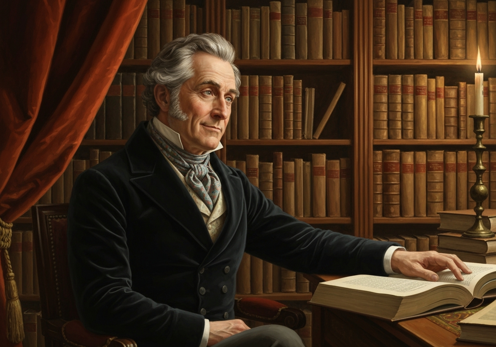
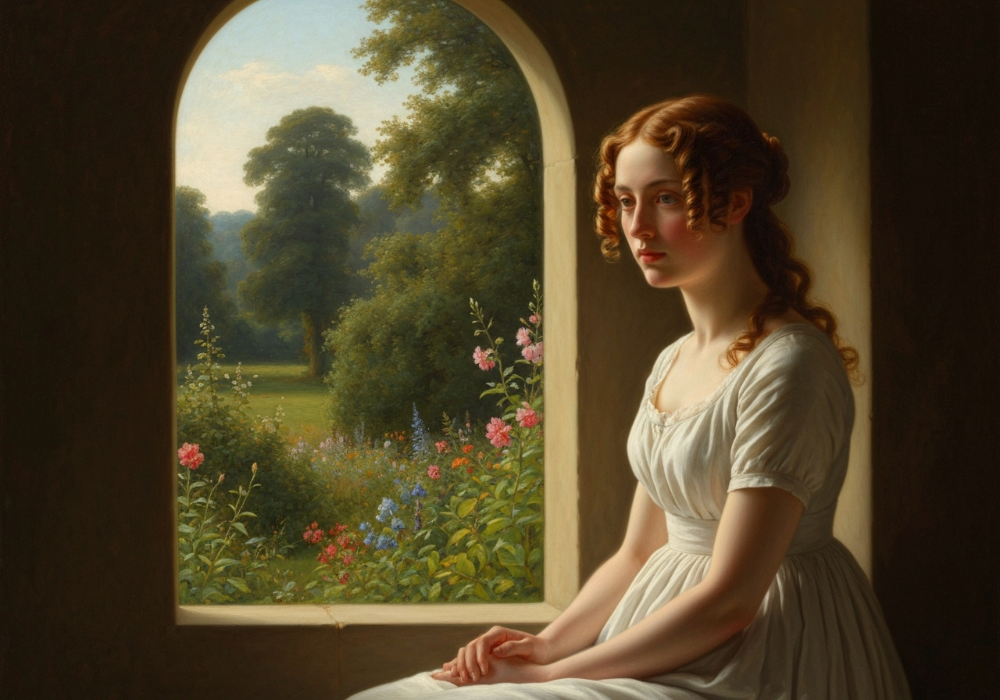
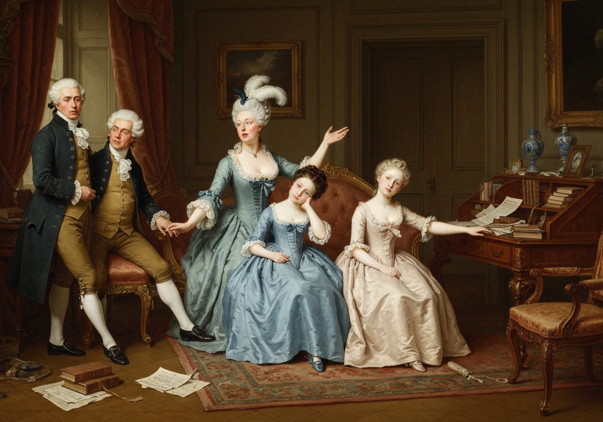
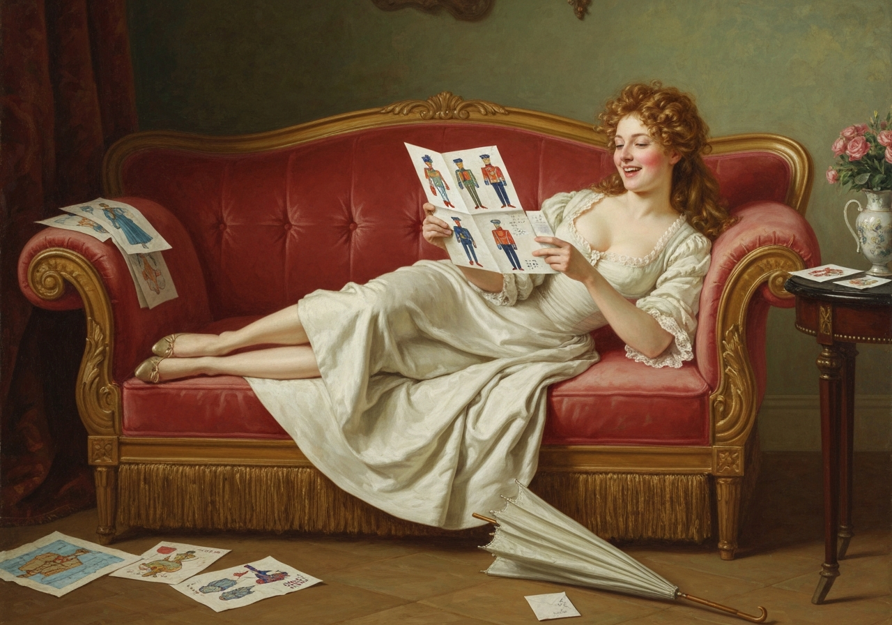
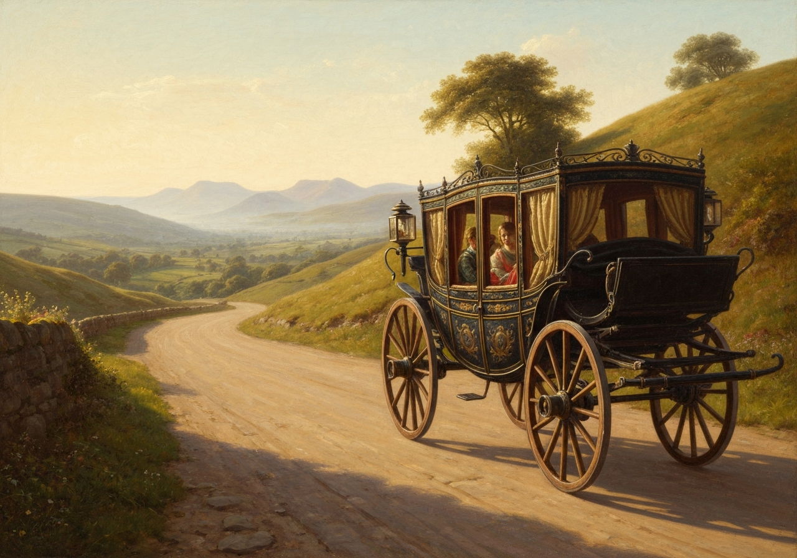
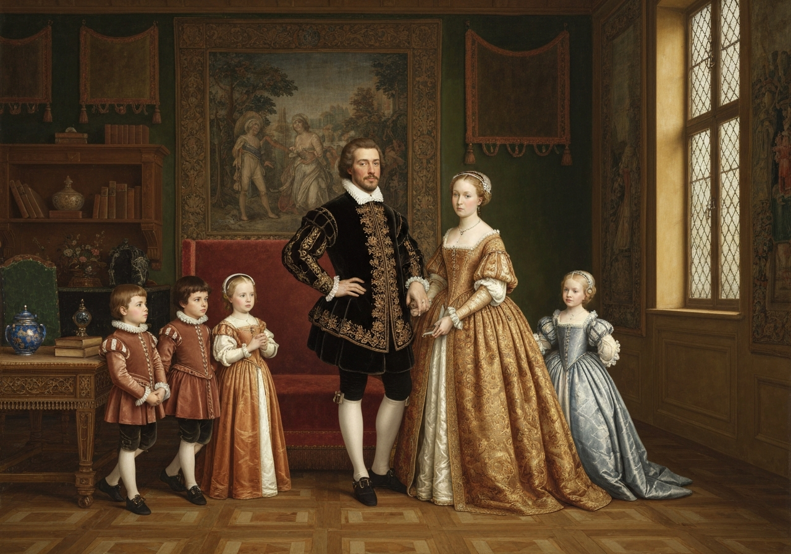
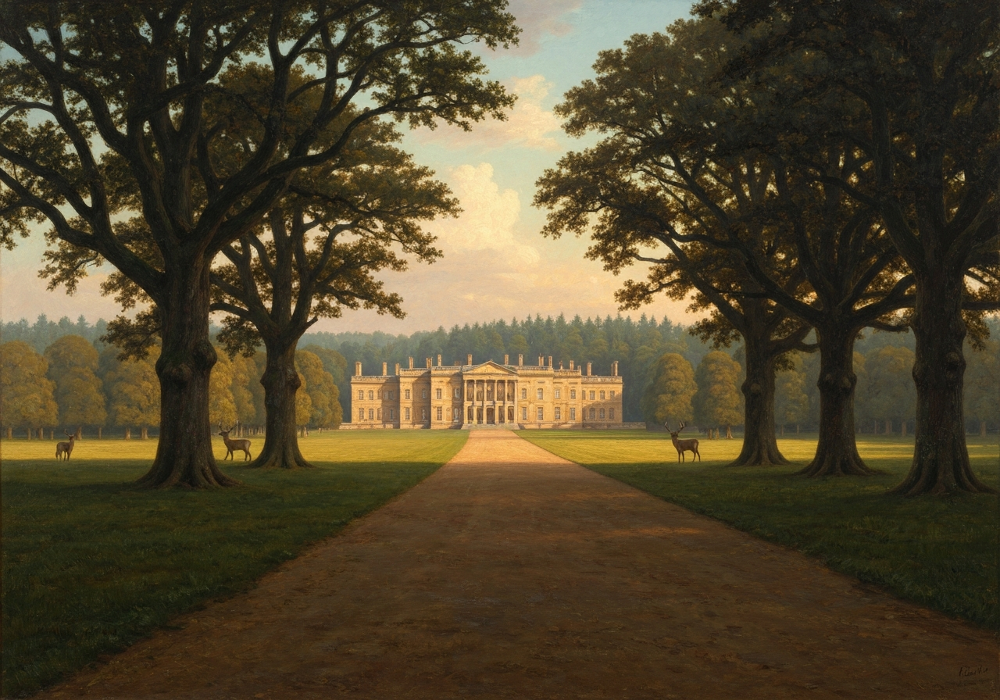

import Callout from '@/components/Callout.astro'

Had Elizabeth’s opinion been all drawn from her own family, she could
not have formed a very pleasing picture of conjugal felicity or domestic
comfort. {/* metadata:quote_001:start */}
<Callout title="Memorable Quote" variant="note">Her father, captivated by youth and beauty, and that appearance of good-humour which youth and beauty generally give, had married a woman whose weak understanding and illiberal mind had very early in their marriage put an end to all real affection for her.</Callout>
{/* metadata:quote_001:end */} {/* metadata:quote_002:start */}
<Callout title="Memorable Quote" variant="note">Respect, esteem, and confidence had vanished for ever; and all his views of domestic happiness were overthrown.</Callout>
{/* metadata:quote_002:end */} But Mr. Bennet was not of a
disposition to seek comfort for the disappointment which his own
imprudence had brought on in any of those pleasures which too often
console the unfortunate for their folly or their vice. He was fond of
the country and of books; and from these tastes had arisen his principal
enjoyments. To his wife he was very little otherwise indebted than as
her ignorance and folly had contributed to his amusement. This is not
the sort of happiness which a man would in general wish to owe to his
wife; but where other powers of entertainment are wanting, the true
philosopher will derive benefit from such as are given.

{/* metadata:analysis_001:start */}
<Callout title="Analysis" variant="explanation">
This chapter opens with Elizabeth's contemplation of her parents' ill-suited marriage, revealing Mr. Bennet's imprudence in marrying for superficial qualities while Mrs. Bennet's weak understanding destroyed any real affection. Austen explores how incompatible temperaments poison domestic life and how Mr. Bennet retreats into country life and books rather than improving his situation. Elizabeth's acute awareness of her father's failings as a husband demonstrates her moral maturity and her understanding that talents misdirected can cause substantial harm to a family.
</Callout>
{/* metadata:analysis_001:end */}

{/* metadata:image_001:start */}

{/* metadata:image_001:end */}

{/* metadata:quote_003:start */}
<Callout title="Memorable Quote" variant="note">Elizabeth, however, had never been blind to the impropriety of her father’s behaviour as a husband. She had always seen it with pain; but respecting his abilities, and grateful for his affectionate treatment of herself, she endeavoured to forget what she could not overlook, and to banish from her thoughts that continual breach of conjugal obligation and decorum which, in exposing his wife to the contempt of her own children, was so highly reprehensible.</Callout>
{/* metadata:quote_003:end */} But she had never felt so
strongly as now the disadvantages which must attend the children of so
unsuitable a marriage, nor ever been so fully aware of the evils arising
from so ill-judged a direction of talents--talents which, rightly used,
might at least have preserved the respectability of his daughters, even
if incapable of enlarging the mind of his wife.

{/* metadata:analysis_002:start */}
<Callout title="Analysis" variant="explanation">
Austen portrays Elizabeth's internal conflict between filial duty and moral clarity regarding her father's conduct. While grateful for his affectionate treatment of herself, Elizabeth recognizes his 'continual breach of conjugal obligation and decorum' as reprehensible. This passage reveals the novel's sophisticated understanding of how witnessing parental dysfunction shapes a child's worldview. Elizabeth's heightened awareness of the 'evils arising from so ill-judged a direction of talents' reflects her growing understanding of how her father's mocking withdrawal from family responsibility has compromised her sisters' respectability.
</Callout>
{/* metadata:analysis_002:end */}

{/* metadata:image_002:start */}

{/* metadata:image_002:end */}

When Elizabeth had rejoiced over Wickham’s departure, she found little
other cause for satisfaction in the loss of the regiment. Their parties
abroad were less varied than before; and at home she had a mother and
sister, whose constant repinings at the dulness of everything around
them threw a real gloom over their domestic circle; and, though Kitty
might in time regain her natural degree of sense, since the disturbers
of her brain were removed, her other sister, from whose disposition
greater evil might be apprehended, was likely to be hardened in all her
folly and assurance, by a situation of such double danger as a
watering-place and a camp. Upon the whole, therefore, she found, what
has been sometimes found before, that an event to which she had looked
forward with impatient desire, did not, in taking place, bring all the
satisfaction she had promised herself. It was consequently necessary to
name some other period for the commencement of actual felicity; to have
some other point on which her wishes and hopes might be fixed, and by
again enjoying the pleasure of anticipation, console herself for the
present, and prepare for another disappointment. Her tour to the Lakes
was now the object of her happiest thoughts: it was her best consolation
for all the uncomfortable hours which the discontentedness of her mother
and Kitty made inevitable; and could she have included Jane in the
scheme, every part of it would have been perfect.

“But it is fortunate,” thought she, “that I have something to wish for.
Were the whole arrangement complete, my disappointment would be certain.
But here, by carrying with me one ceaseless source of regret in my
sister’s absence, I may reasonably hope to have all my expectations of
pleasure realized. {/* metadata:quote_004:start */}
<Callout title="Memorable Quote" variant="note">A scheme of which every part promises delight can never be successful; and general disappointment is only warded off by the defence of some little peculiar vexation.”</Callout>
{/* metadata:quote_004:end */}

{/* metadata:analysis_003:start */}
<Callout title="Analysis" variant="explanation">
Elizabeth's muted relief at Wickham's departure demonstrates the complexity of her emotional journey. While she had anticipated satisfaction, the reality disappoints—revealing Austen's keen insight into human psychology through Elizabeth's realization that anticipation often exceeds fulfillment. The chapter introduces Elizabeth's philosophical defense mechanism: preserving some small vexation to prevent greater disappointment. This character trait establishes her self-awareness and protective pragmatism regarding hope and expectation.
</Callout>
{/* metadata:analysis_003:end */}

{/* metadata:image_003:start */}

{/* metadata:image_003:end */}

When Lydia went away she promised to write very often and very minutely
to her mother and Kitty; but her letters were always long expected, and
always very short. Those to her mother contained little else than that
they were just returned from the library, where such and such officers
had attended them, and where she had seen such beautiful ornaments as
made her quite wild; that she had a new gown, or a new parasol, which
she would have described more fully, but was obliged to leave off in a
violent hurry, as Mrs. Forster called her, and they were going to the
camp; and from her correspondence with her sister there was still less
to be learnt, for her letters to Kitty, though rather longer, were much
too full of lines under the words to be made public.

After the first fortnight or three weeks of her absence, health,
good-humour, and cheerfulness began to reappear at Longbourn. Everything
wore a happier aspect. The families who had been in town for the winter
came back again, and summer finery and summer engagements arose. Mrs.
Bennet was restored to her usual querulous serenity; and by the middle
of June Kitty was so much recovered as to be able to enter Meryton
without tears,--an event of such happy promise as to make Elizabeth
hope, that by the following Christmas she might be so tolerably
reasonable as not to mention an officer above once a day, unless, by
some cruel and malicious arrangement at the War Office, another regiment
should be quartered in Meryton.

{/* metadata:analysis_004:start */}
<Callout title="Analysis" variant="explanation">
Lydia's correspondence from Brighton provides comic relief while underscoring her character's unchanging shallowness. Her letters—always long expected but always very short, filled with references to officers and finery, and containing provocative omissions through 'lines under the words'—function as a narrative device showing her continued unsuitability for proper society. The return of domestic tranquility at Longbourn following the regiment's departure frames this episode as restoration of social order, with Kitty's gradual improvement suggesting that Lydia's corrupting influence was at least partially circumstantial.
</Callout>
{/* metadata:analysis_004:end */}

{/* metadata:image_004:start */}

{/* metadata:image_004:end */}

The time fixed for the beginning of their northern tour was now fast
approaching; and a fortnight only was wanting of it, when a letter
arrived from Mrs. Gardiner, which at once delayed its commencement and
curtailed its extent. Mr. Gardiner would be prevented by business from
setting out till a fortnight later in July, and must be in London again
within a month; and as that left too short a period for them to go so
far, and see so much as they had proposed, or at least to see it with
the leisure and comfort they had built on, they were obliged to give up
the Lakes, and substitute a more contracted tour; and, according to the
present plan, were to go no farther northward than Derbyshire. In that
county there was enough to be seen to occupy the chief of their three
weeks; and to Mrs. Gardiner it had a peculiarly strong attraction. The
town where she had formerly passed some years of her life, and where
they were now to spend a few days, was probably as great an object of
her curiosity as all the celebrated beauties of Matlock, Chatsworth,
Dovedale, or the Peak.

Elizabeth was excessively disappointed: she had set her heart on seeing
the Lakes; and still thought there might have been time enough. {/* metadata:quote_005:start */}
<Callout title="Memorable Quote" variant="note">But it was her business to be satisfied--and certainly her temper to be happy; and all was soon right again.</Callout>
{/* metadata:quote_005:end */}

{/* metadata:analysis_005:start */}
<Callout title="Analysis" variant="explanation">
The disappointing modification of the Gardiners' travel plans—from the Lake District to Derbyshire—represents one of Austen's masterful examples of narrative irony and foreshadowing. What appears to be a frustrating limitation becomes the catalyst for the novel's pivotal development. Mrs. Gardiner's connection to Lambton provides geographical coincidence that will facilitate Elizabeth's encounter with Darcy. This structural device demonstrates how apparent obstacles in life frequently open unexpected doors.
</Callout>
{/* metadata:analysis_005:end */}

{/* metadata:image_005:start */}

{/* metadata:image_005:end */}

With the mention of Derbyshire, there were many ideas connected. {/* metadata:quote_006:start */}
<Callout title="Memorable Quote" variant="note">It was impossible for her to see the word without thinking of Pemberley and its owner.</Callout>
{/* metadata:quote_006:end */} {/* metadata:quote_007:start */}
<Callout title="Memorable Quote" variant="note">“But surely,” said she, “I may enter his county with impunity, and rob it of a few petrified spars, without his perceiving me.”</Callout>
{/* metadata:quote_007:end */}

{/* metadata:analysis_006:start */}
<Callout title="Analysis" variant="explanation">
Elizabeth's involuntary association of Derbyshire with Pemberley and Mr. Darcy reveals her unconscious preoccupation with Darcy despite her rational rejection of him. Her attempt to rationalize entering his territory—comparing herself to a harmless visitor collecting geological specimens—demonstrates both her wit and her psychological self-deception. The fact that she finds it necessary to justify this innocent curiosity to herself indicates that Darcy occupies more of her emotional landscape than she is willing to acknowledge consciously.
</Callout>
{/* metadata:analysis_006:end */}

The period of expectation was now doubled. Four weeks were to pass away
before her uncle and aunt’s arrival. But they did pass away, and Mr. and
Mrs. Gardiner, with their four children, did at length appear at
Longbourn. The children, two girls of six and eight years old, and two
younger boys, were to be left under the particular care of their cousin
Jane, who was the general favourite, and whose steady sense and
sweetness of temper exactly adapted her for attending to them in every
way--teaching them, playing with them, and loving them.

{/* metadata:image_006:start */}

{/* metadata:image_006:end */}

The Gardiners stayed only one night at Longbourn, and set off the next
morning with Elizabeth in pursuit of novelty and amusement. One
enjoyment was certain--that of suitableness as companions; a
suitableness which comprehended health and temper to bear
inconveniences--cheerfulness to enhance every pleasure--and affection
and intelligence, which might supply it among themselves if there were
disappointments abroad.

It is not the object of this work to give a description of Derbyshire,
nor of any of the remarkable places through which their route thither
lay--Oxford, Blenheim, Warwick, Kenilworth, Birmingham, etc., are
sufficiently known. A small part of Derbyshire is all the present
concern. To the little town of Lambton, the scene of Mrs. Gardiner’s
former residence, and where she had lately learned that some
acquaintance still remained, they bent their steps, after having seen
all the principal wonders of the country; and within five miles of
Lambton, Elizabeth found, from her aunt, that Pemberley was situated. It
was not in their direct road; nor more than a mile or two out of it. In
talking over their route the evening before, Mrs. Gardiner expressed an
inclination to see the place again. Mr. Gardiner declared his
willingness, and Elizabeth was applied to for her approbation.

“My love, should not you like to see a place of which you have heard so
much?” said her aunt. “A place, too, with which so many of your
acquaintance are connected. Wickham passed all his youth there, you
know.”

Elizabeth was distressed. She felt that she had no business at
Pemberley, and was obliged to assume a disinclination for seeing it. She
must own that she was tired of great houses: after going over so many,
she really had no pleasure in fine carpets or satin curtains.

Mrs. Gardiner abused her stupidity. “If it were merely a fine house
richly furnished,” said she, “I should not care about it myself; but the
grounds are delightful. They have some of the finest woods in the
country.”

Elizabeth said no more; but her mind could not acquiesce. The
possibility of meeting Mr. Darcy, while viewing the place, instantly
occurred. It would be dreadful! She blushed at the very idea; and
thought it would be better to speak openly to her aunt, than to run such
a risk. But against this there were objections; and she finally resolved
that it could be the last resource, if her private inquiries as to the
absence of the family were unfavourably answered.

Accordingly, when she retired at night, she asked the chambermaid
whether Pemberley were not a very fine place, what was the name of its
proprietor, and, with no little alarm, whether the family were down for
the summer? A most welcome negative followed the last question; and her
alarms being now removed, she was at leisure to feel a great deal of
curiosity to see the house herself; and when the subject was revived the
next morning, and she was again applied to, could readily answer, and
with a proper air of indifference, that she had not really any dislike
to the scheme.

To Pemberley, therefore, they were to go.

{/* metadata:analysis_007:start */}
<Callout title="Analysis" variant="explanation">
The chapter concludes with Elizabeth's anxious deliberation about visiting Pemberley and her secret inquiry regarding Darcy's presence. Her relief upon learning of his absence, followed by her willingness to visit, traces a sophisticated emotional arc—the simultaneous desire and fear of encounter. The Gardiners' proposal to tour Pemberley draws upon multiple narrative threads: Elizabeth's connection to Wickham, her aunt's genuine appreciation of landscape, and Elizabeth's hidden curiosity. The chapter's closing—'To Pemberley, therefore, they were to go'—functions as a cliffhanger, with the house itself becoming a symbol of both social distance and romantic possibility.
</Callout>
{/* metadata:analysis_007:end */}

{/* metadata:image_007:start */}

{/* metadata:image_007:end */}
