import Callout from '@/components/Callout.astro'

[Illustration]

Elizabeth had settled it that Mr. Darcy would bring his sister to visit
her the very day after her reaching Pemberley; and was, consequently,
resolved not to be out of sight of the inn the whole of that morning.
But her conclusion was false; for on the very morning after their own
arrival at Lambton these visitors came. They had been walking about the
place with some of their new friends, and were just returned to the inn
to dress themselves for dining with the same family, when the sound of a
carriage drew them to a window, and they saw a gentleman and lady in a
curricle driving up the street.

{/* metadata:img-001:start */}
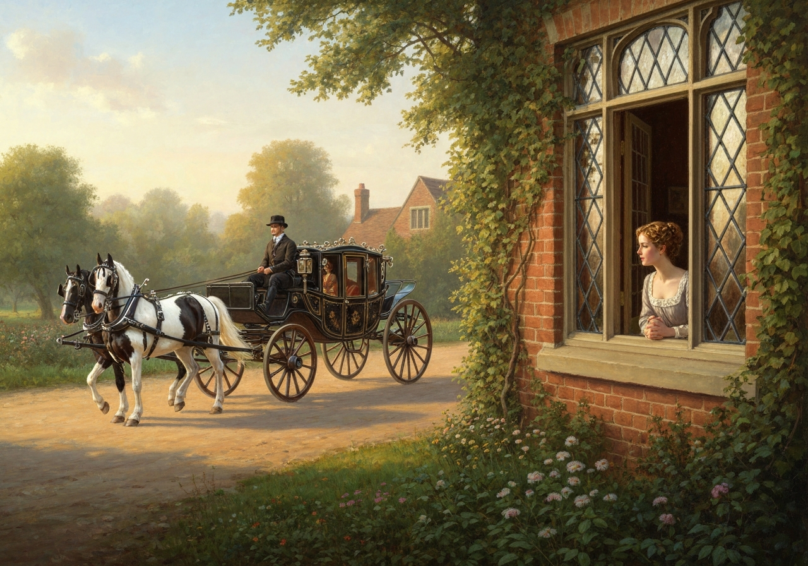

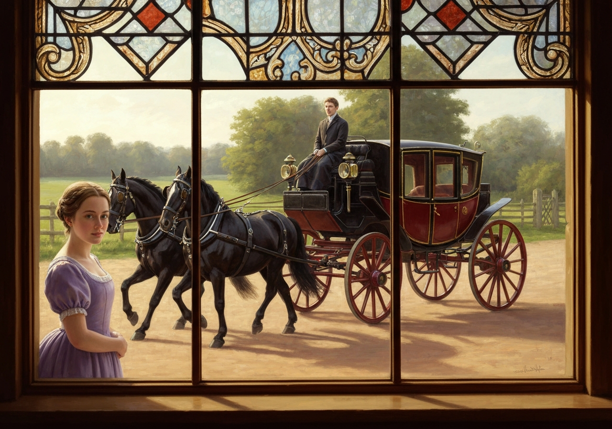
{/* metadata:img-001:end */}

 Elizabeth, immediately recognizing the
livery, guessed what it meant, and imparted no small degree of surprise
to her relations, by acquainting them with the honour which she
expected. Her uncle and aunt were all amazement; and the embarrassment
of her manner as she spoke, joined to the circumstance itself, and many
of the circumstances of the preceding day, opened to them a new idea on
the business. Nothing had ever suggested it before, but they now felt
that there was no other way of accounting for such attentions from such
a quarter than by supposing a partiality for their niece. While these
newly-born notions were passing in their heads, the perturbation of
Elizabeth’s feelings was every moment increasing. She was quite amazed
at her own discomposure; but, amongst other causes of disquiet, she
dreaded lest the partiality of the brother should have said too much in
her favour; and, more than commonly anxious to please, she naturally
suspected that every power of pleasing would fail her.

{/* metadata:analysis-001:start */}
<Callout title="Analysis" variant="explanation">
The chapter opens with Elizabeth's anxious anticipation and her subsequent surprise when Darcy and Georgiana arrive earlier than expected. Her discomposure is rendered with psychological precision: more than commonly anxious to please, she fears that her very eagerness will undermine her. This marks a striking reversal from her earlier dismissive attitude toward Darcy, demonstrating how thoroughly her emotional investment has shifted.
</Callout>
{/* metadata:analysis-001:end */}

She retreated from the window, fearful of being seen; and as she walked
up and down the room, endeavouring to compose herself, saw such looks of
inquiring surprise in her uncle and aunt as made everything worse.

Miss Darcy and her brother appeared, and this formidable introduction
took place.

{/* metadata:img-002:start */}
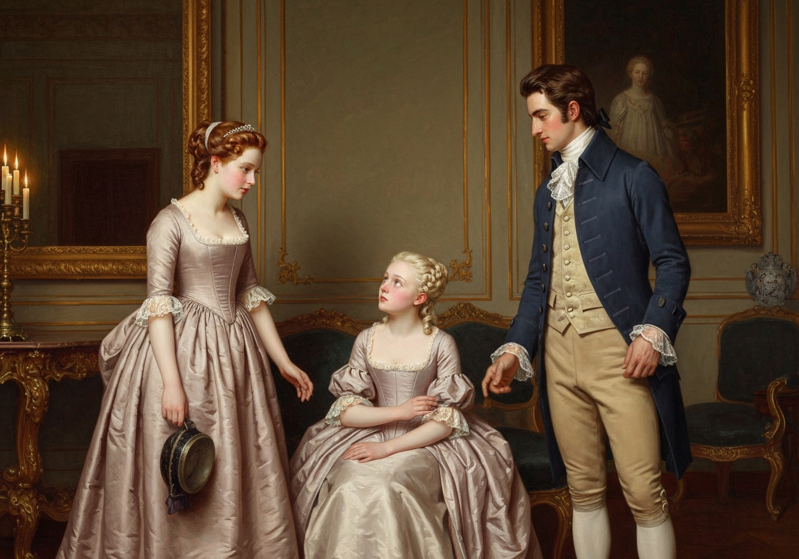

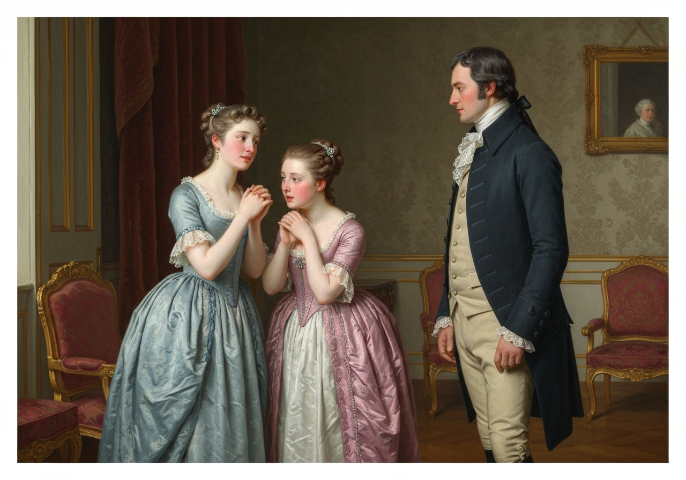
{/* metadata:img-002:end */}

 With astonishment did Elizabeth see that her new
acquaintance was at least as much embarrassed as herself. Since her
being at Lambton, she had heard that Miss Darcy was exceedingly proud;
but the observation of a very few minutes convinced her that she was
only exceedingly shy. {/* metadata:quote-001:start */}
<Callout title="Memorable Quote" variant="note">She found it difficult to obtain even a word from her beyond a monosyllable.</Callout>
{/* metadata:quote-001:end */}

Miss Darcy was tall, and on a larger scale than Elizabeth; and, though
little more than sixteen, her figure was formed, and her appearance
womanly and graceful. She was less handsome than her brother, but {/* metadata:quote-002:start */}
<Callout title="Memorable Quote" variant="note">There was sense and good-humour in her face, and her manners w

{/* metadata:analysis-002:start */}
<Callout title="Analysis" variant="explanation">
Austen masterfully subverts expectations through the characterization of Georgiana Darcy. Where Elizabeth had anticipated meeting a proud young woman modeled after her brother's former disposition, she instead encounters a shy, gentle, and unassuming girl. This contrast highlights how Elizabeth's prejudices had shaped her perception of the Darcy family, and her relief at being wrong signals her growing openness to revising long-held judgments.
</Callout>
{/* metadata:analysis-002:end */}

ere perfectly unassuming and gentle.</Callout>
{/* metadata:quote-002:end */} Elizabeth, who had expected to find in her as
acute and unembarrassed an observer as ever Mr. Darcy had been, was much
relieved by discerning such different feelings.

They had not been long toge

{/* metadata:img-003:start */}
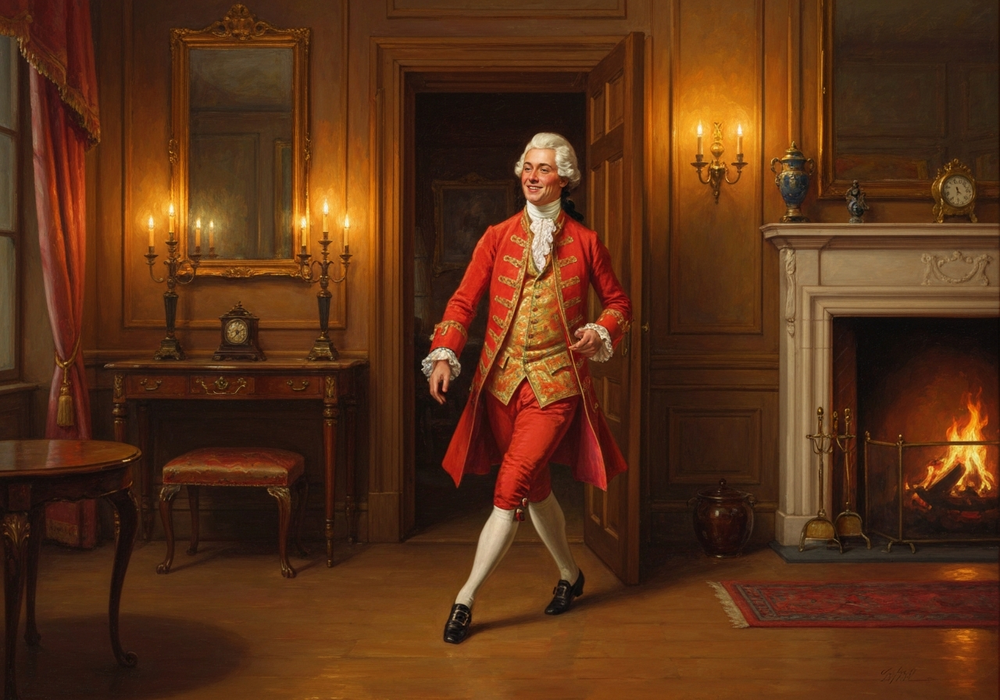

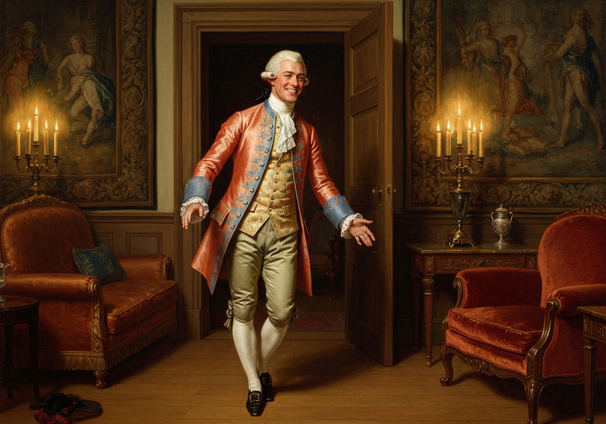
{/* metadata:img-003:end */}

ther before Darcy told her that Bingley was
also coming to wait on her; and she had barely time to express her
satisfaction, and prepare for such a visitor, when Bingley’s quick step
was heard on the stairs, and in a moment he entered the room. {/* metadata:quote-003:start */}
<Callout title="Memorable Quote" variant="note">All Elizabeth's anger against him had been long done away; but had she still felt any, it could hardly have stood its ground against the unaffected cordiality with which he expressed himself on seeing her again.</Callout>
{/* metadata:quote-003:end */} He
inquired in a friendly, though general, way, after her family, and
looked and spoke with the same good-humoured ease that he had ever done.

To Mr. and Mrs. Gardiner he was scarcely a less interesting personage
than to herself. They had long wished to see him. The whole party before
them, indeed, excited a lively attention. The suspicions which had ju

{/* metadata:img-004:start */}
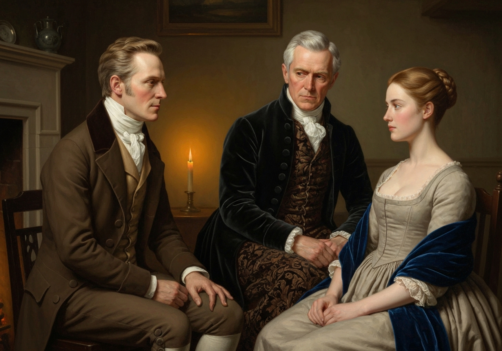

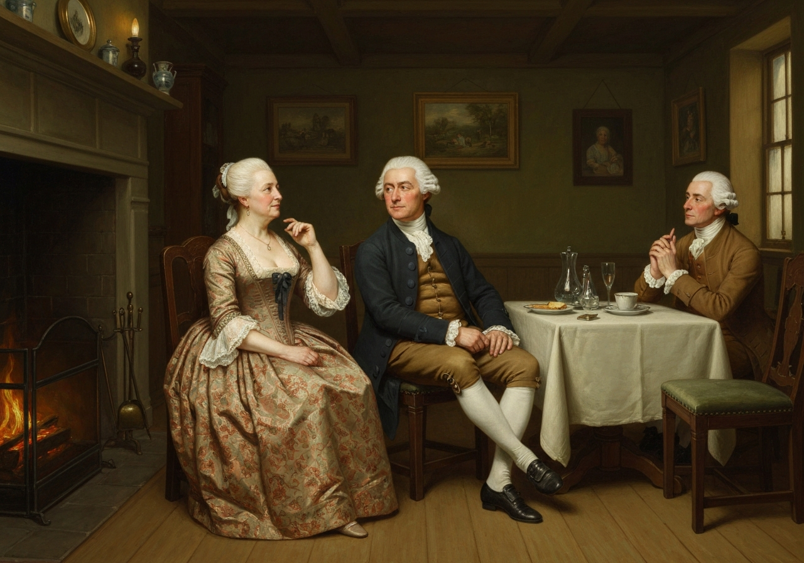
{/* metadata:img-004:end */}

st
arisen of Mr. Darcy and their niece, directed their observation towards
each with an earnest, though guarded, inquiry; and they soon drew from
those inquiries the full conviction that one of them at least knew what
it was to love. Of the lady’s sensations they remained a little in
doubt; but that the gentleman was overflowing with admiration was
evident enough.

Elizabeth, on her side, had much to do. She wanted to ascertain the
feelings of each of her visitors, she wanted to compose her own, and to
make herself agreeable to all; and in the latter object, where she
feared most to fail, she was most sure of success, for those to whom
she endeavoured to give pleasure were pre-possessed in her favour.
Bingley was ready, Georgiana was eager, and Darcy determined, to be
pleased.

[Illustration:

     “To make herself agreeable to all”

[_Copyright 1894 by George Allen._]]

In seeing Bingley, her thoughts naturally flew to her sister; and oh!
how ardently did she long to know whether any of his were directed in a
like manner. Sometimes she could fancy that he talked less than on
former occasions, and once or twice pleased herself with the notion
that, as he looked at her, he was trying to trace a resemblance. But,
though this might be imaginary, she could not be deceived as to his
behaviour to Miss Darcy, who had been set up as a rival to Jane. No
look appeared on either side that spoke particul

{/* metadata:analysis-004:start */}
<Callout title="Analysis" variant="explanation">
Elizabeth's careful observation of Bingley's behavior toward Miss Darcy reveals her protective concern for Jane's romantic prospects. Her relief that no special regard exists between them underscores Austen's exploration of how sisters navigate courtship and marriage within their social network. The small circumstances that denote Bingley's tenderness toward Jane—a tone of real regret, a careful inquiry after the Bennet sisters—are read by Elizabeth with the interpretive intensity of someone who has much at stake in the outcome.
</Callout>
{/* metadata:analysis-004:end */}

ar regard. Nothing
occurred between them that could justify the hopes of his sister. On
this point she was soon satisfied; and two or three little circumstances
occurred ere they parted, which, in her anxious interpretation, denoted
a recollection of Jane, not untinctured by tenderness, and a wish of
saying more that might lead to the mention of her, had he dared. He
observed to her, at a moment when the others were talking together, and
in a tone which had something of real regret, that it “was a very long
time since he had had the pleasure of seeing her;” and, before she could
reply, he added, {/* metadata:quote-004:start */}
<Callout title="Memorable Quote" variant="note">It is above eight months. We have not met since the 26th of November, when we were all dancing together at Netherfield.</Callout>
{/* metadata:quote-004:end */}

Elizabeth was pleased to find his memory so exact; and he afterwards
took occasion to ask her, when unattended to by any of the rest, whether
_all_ her sisters were at Longbourn. There was not much in the question,
nor in the precedin

{/* metadata:analysis-003:start */}
<Callout title="Analysis" variant="explanation">
The arrival of Mr. Bingley serves multiple narrative purposes: it allows Elizabeth to observe his possible lingering feelings for her sister Jane, provides warmth through his characteristic good humour, and creates a foil against which Darcy's more reserved transformation can be measured. Crucially, Elizabeth reads Bingley's manner for signs of Jane's continued place in his affections, finding in small gestures and tones what direct speech cannot convey. Austen uses this triangulated observation to show how social surfaces both conceal and betray interior feeling. The chapter's careful attention to Darcy's changed manners—his civility toward the Gardiners, his freedom from hauteur—is confirmed by Elizabeth's own perception that the improvement had at least outlived one day.
</Callout>
{/* metadata:analysis-003:end */}

g remark; but there was a look and a manner which
gave them meaning.

It was not often that she could turn her eyes on Mr. Darcy himself; but
whenever she did catch a glimpse she saw an expression of general
complaisance, and in all that he said, she heard an accent so far
removed from _hauteur_ or disdain of his companions, as convinced her
that the improvement of manners which she had yesterday witnessed,
however temporary its existence might prove, had at least outl

{/* metadata:analysis-005:start */}
<Callout title="Analysis" variant="explanation">
The most significant development occurs in Elizabeth's internal assessment of Darcy's character transformation. She notes his remarkable civility toward the Gardiners—relations he had previously openly disdained—recognizing that this change demands a thorough adjustment of her former judgments. The contrast with their last lively scene in Hunsford Parsonage is made explicit, and the magnitude of the shift is rendered in terms of astonishment barely contained.
</Callout>
{/* metadata:analysis-005:end */}

ived one
day. When she saw him thus seeking the acquaintance, and courting the
good opinion of people with whom any intercourse a few months ago would
have been a disgrace; when she saw him thus civil, not only to herself,
but to the very relations whom he had openly disdained, and recollected
their last lively scene in Hunsford Parsonage, the difference, the
change was so great, and struck so forcibly on her mind, that she could
har

{/* metadata:img-005:start */}
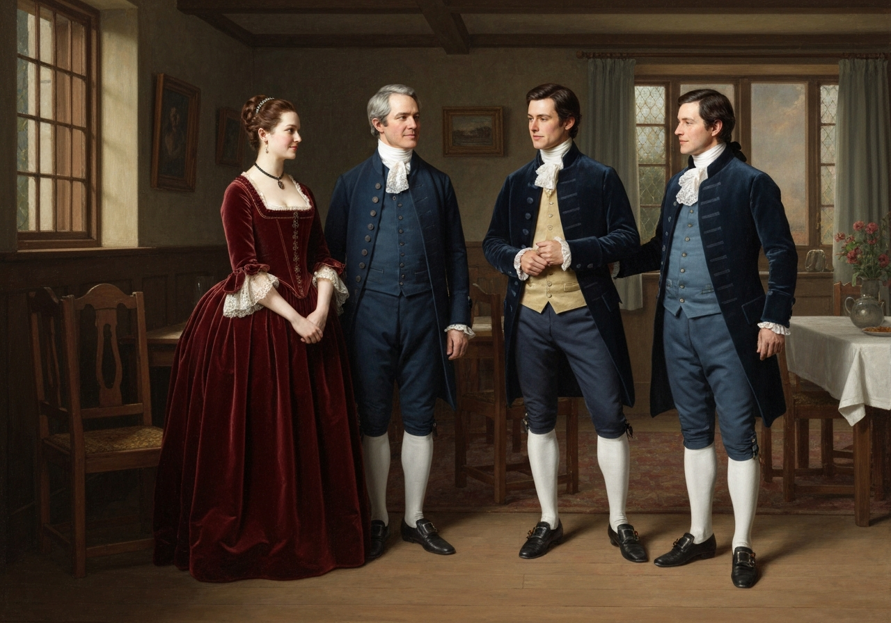

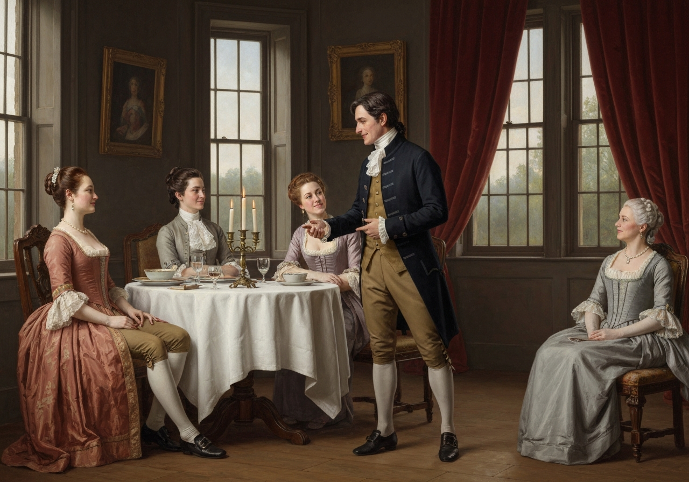
{/* metadata:img-005:end */}

dly restrain her astonishment from being visible. {/* metadata:quote-005:start */}
<Callout title="Memorable Quote" variant="note">Never, even in the company of his dear friends at Netherfield, or his dignified relations at Rosings, had she seen him so desirous to please, so free from self-consequence or unbending reserve.</Callout>
{/* metadata:quote-005:end */} as 

{/* metadata:img-006:start */}
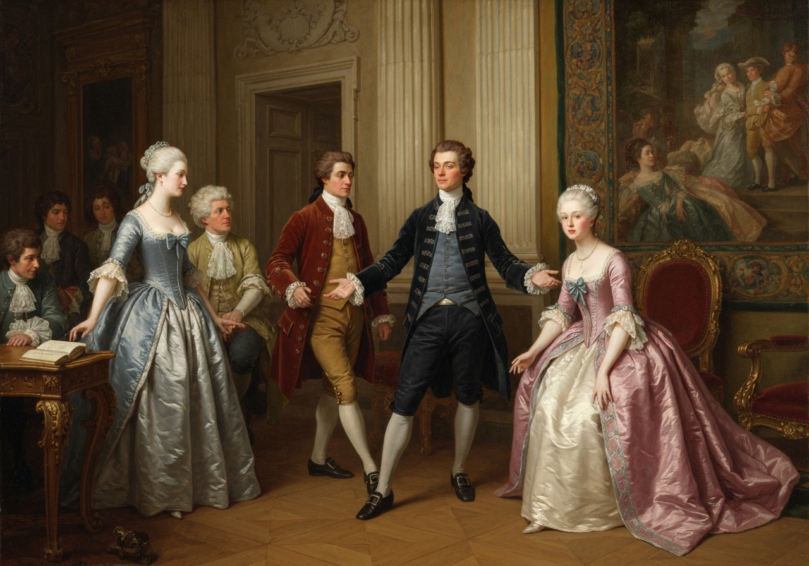

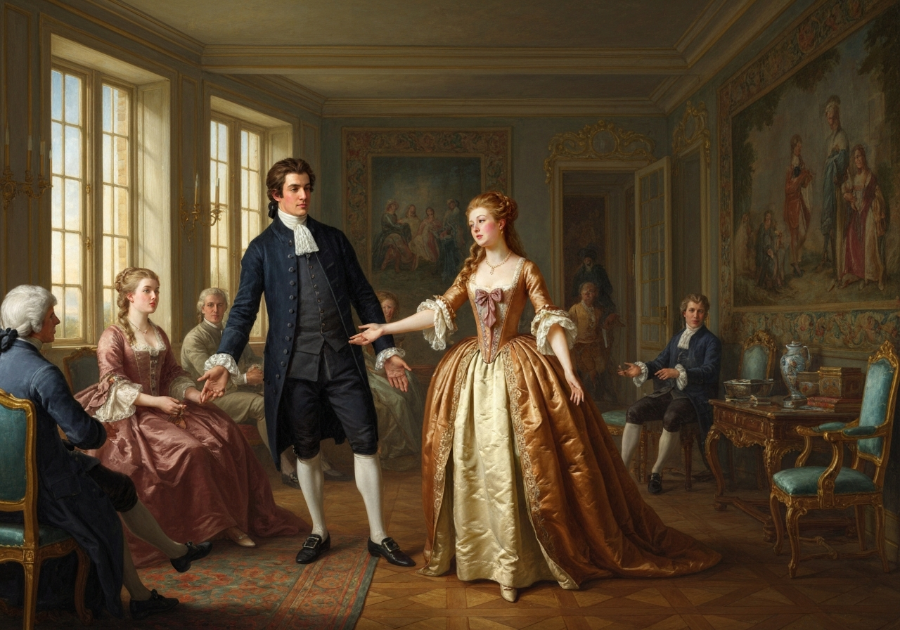
{/* metadata:img-006:end */}

now, when no importance could
result from the success of his endeavours, and when even the
acquaintance of those to whom his attentions were addressed, would draw
down the ridicule and censure of the ladies both of Netherfield and
Rosings.

Their visitors stayed with them above half an hour; and when they arose
to depart, Mr. Darcy called on his sister to join him in expressing
their wish of seeing Mr. and Mrs. Gardiner, and Miss Bennet, to dinner
at Pemberley, before they left the country. Miss Darcy, though with a
diffidence which marked her little in the habit of giving invitations,
readily obeyed. Mrs. Gardiner looked at her niece, desirous of knowing
how _she_, whom the invitation most concerned, felt disposed as to its
acceptance, but Elizabeth had turned away her head. Presuming, however,
that this studied avoidance spoke rather a momentary embarrassment than
any dislike of the proposal, and seeing in her husband, who was fond of
society, a perfect willingness to accept it, she ventured to engage for
her attendance, and the day after the next was fixed on.

Bingley expressed great pleasure in the certainty of seeing Elizabeth
again, having still a great deal to say to her, and many inquiries to
make after all their Hertfordshire friends. Elizabeth, construing all
this into a wish of hearing her speak of her sister, was pleased; and
on this account, as well as some others, found herself, when their
visitors left them, capable of considering the last half hour wit

{/* metadata:analysis-006:start */}
<Callout title="Analysis" variant="explanation">
Mr. and Mrs. Gardiner function as perceptive observers who validate Elizabeth's changed circumstances without pressuring her for explanations. Their recognition that Darcy is very much in love provides external confirmation of Elizabeth's internal realizations, while their discretion preserves her agency. Austen signals their restraint with characteristic economy, noting that they saw much to interest, but nothing to justify inquiry.
</Callout>
{/* metadata:analysis-006:end */}

h some
satisfaction, though while it was passing the enjoyment of it had been
little. Eager to be alone, and fearful of inquiries or hints from her
uncle and aunt, she stayed with them only long enough to hear their
favourable opinion of Bingley, and then hurried away to dress.

But she had no reason to fear Mr. and Mrs. Gardiner’s curiosity; it was
not their wish to force her communication. It was evident that she was
much better acquainted with Mr. Darcy than they had before any idea of;
it was evident that he was very much in love with her. They saw much to
interest, but nothing to justify inquiry.

Of Mr. Darcy it was now a matter of anxiety to think well; and, as far
as their acquaintance reached, there was no fault to find. They could
not be untouched by his politeness; and had they drawn his character
from their own feelings and his servant’s report, without any reference
to any other account, the circle in Hertfordshire to which he was known
would not have recognized it for Mr. Darcy. There was now an interest,
however, in believing the housekeeper; and they soon became sensible
that the authority of a servant, who had known him since he was four
years old, and whose own manners indicated respectability, was not to be
hastily rejected. Neither had anything occurred in the intelligence of
their Lambton friends that could materially lessen its weight. They had
nothing to accuse him of but pride; pride he probably had, and if not,
it would certainly be imputed by the inhabitants of a small market town
where the family did not visit. It was acknowledged, however, that he
was a liberal man, and did much good among the poor.

{/* metadata:img-007:start */}
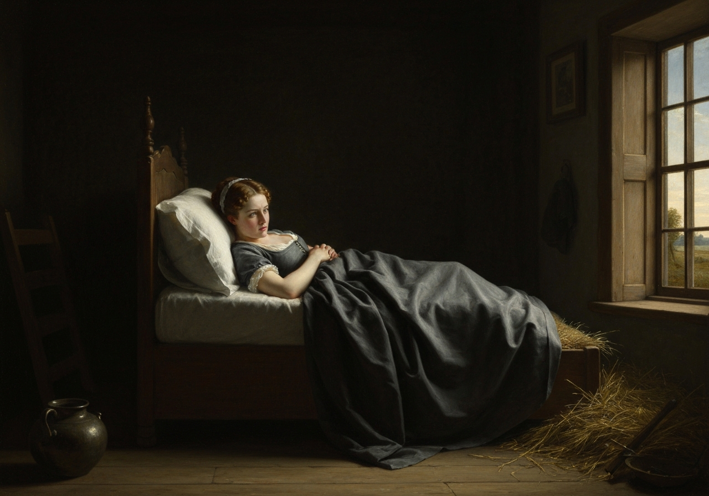

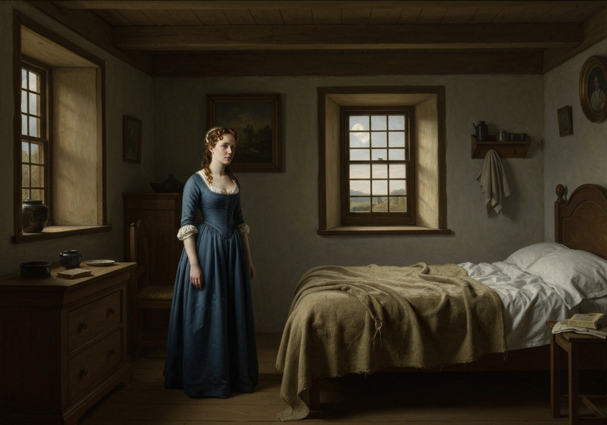
{/* metadata:img-007:end */}

With respect to Wickham, the travellers soon found that he was not held
there in much estimation; for though the chief of his concerns with the
son of his patron were imperfectly understood, it was yet a well-known
fact that, on his quitting Derbyshire, he had left many debts behind
him, which Mr. Darcy afterwards discharged.

As for Elizabeth, her thoughts were at Pemberley this evening more than
the last; and the evening, though as it passed it seemed long, was not
long enough to determine her feelings towards _one_ in that mansion; and
she lay awake two whole hours, endeavouring to make them out. {/* metadata:quote-006:start */}
<Callout title="Memorable Quote" variant="note">She certainly did not hate him. No; hatred had vanished long ago, and she had almost as long been ashamed of ever feeling a dislike against him.</Callout>
{/* metadata:quote-006:end */}
that could be so called. The respect created by the conviction of his
valuable qualities, though at first unwillingly admitted, had for some
time ceased to be repugnant to her feelings; and it was now heightened
into somewhat of a friendlier nature by the testimony so highly in his
favour, and bringing forward his disposition in so amiable a light,
which yesterday had produced. But above all, above respect and esteem,
there was a motive within her of good-will which could not be
overlooked. It was gratitude;--gratitude, not merely for having once
loved her, but for loving her still well enough to forgive all the
petulance and acrimony of her manner in rejecting him, and all the
unjust accusations accompanying her rejection. He who, she had been
persuaded, would avoid her as his greatest enemy, seemed, on this
accidental meeting, most eager to preserve the acquaintance; and
without any indelicate display of regard, or any peculiarity of manner,
where their two selves only were concerned, was soliciting the good
opinion of her friends, and bent on making her known to his sister. Such
a change in a man of so much pride excited not only astonishment but
gratitude--for to love, ardent love, it must be attributed; and, as
such, its impression on her was of a sort to be encouraged, as by no
means unpleasing, though it could not be exactly defined. {/* metadata:quote-007:start */}
<Callout title="Memorable Quote" variant="note">She respected, she esteemed, she was grateful to him, she felt a real interest in his welfare; and she only wanted to know how far she wished that welfare to depend upon herself.</Callout>
{/* metadata:quote-007:end */}

{/* metadata:analysis-007:start */}
<Callout title="Analysis" variant="explanation">
The chapter's conclusion reveals the culmination of Elizabeth's emotional journey: she experiences gratitude not solely for Darcy's continued love, but for his forgiveness of her earlier rejection. This gratitude, combined with respect and esteem, creates the foundation for potential romantic renewal, though Elizabeth remains uncertain of the extent of her own desires. The final question she poses to herself—how far she wishes his welfare to depend upon herself—captures the delicate balance between self-knowledge and romantic possibility that defines the novel's moral architecture.
</Callout>
{/* metadata:analysis-007:end */}

It had been settled in the evening, between the aunt and niece, that
such a striking civility as Miss Darcy’s, in coming to them on the very
day of her arrival at Pemberley--for she had reached it only to a late
breakfast--ought to be imitated, though it could not be equalled, by
some exertion of politeness on their side; and, consequently, that it
would be highly expedient to wait on her at Pemberley the following
morning. They were, therefore, to go. Elizabeth was pleased; though when
she asked herself the reason, she had very little to say in reply.

Mr. Gardiner left them soon after breakfast. The fishing scheme had been
renewed the day before, and a positive engagement made of his meeting
some of the gentlemen at Pemberley by noon.

[Illustration:

     “Engaged by the river”
]
