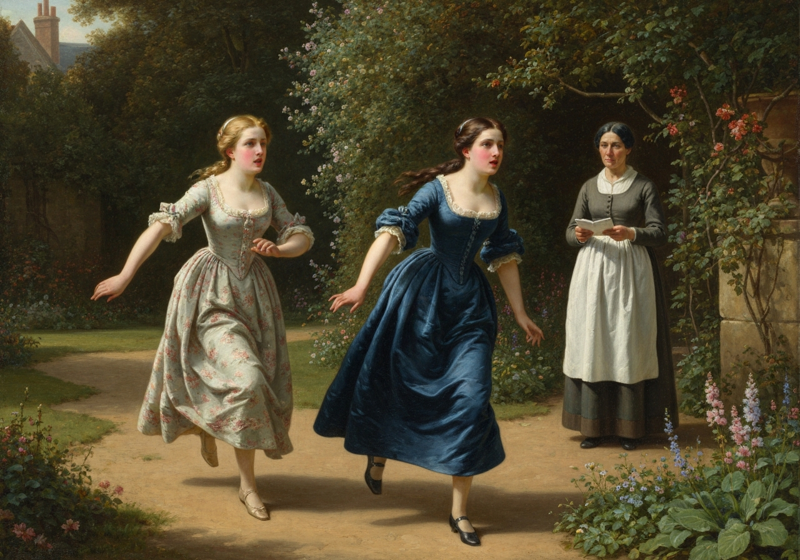
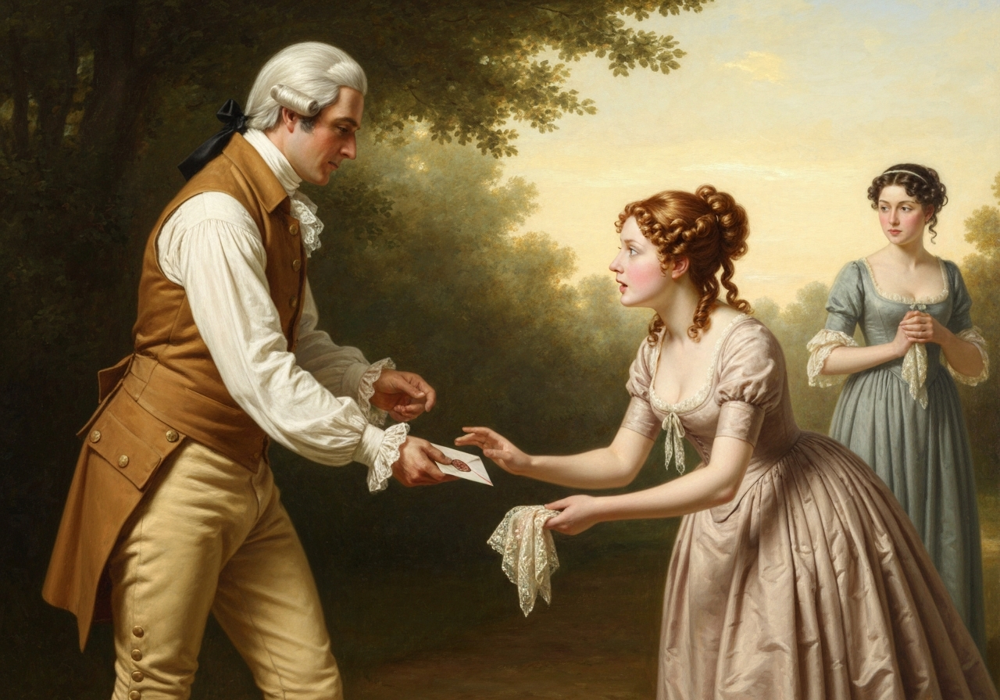
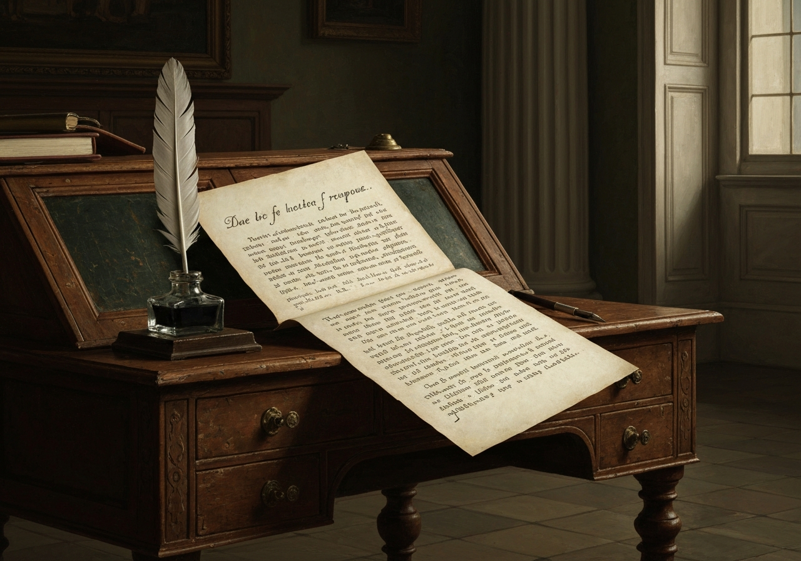
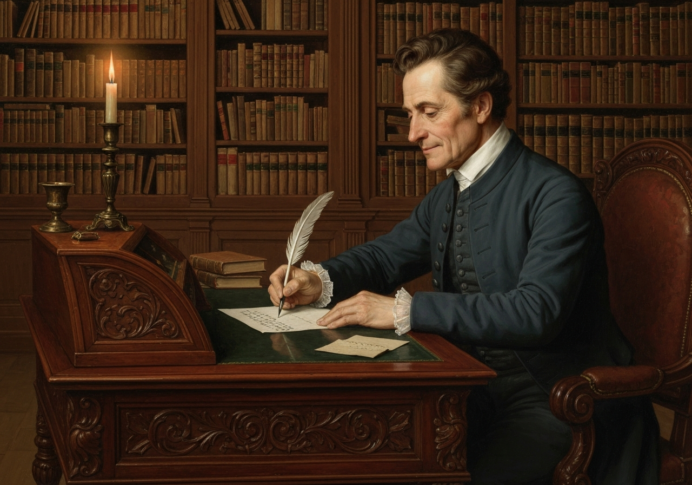
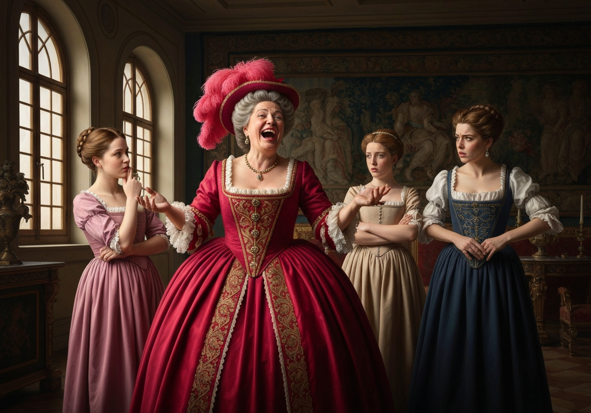
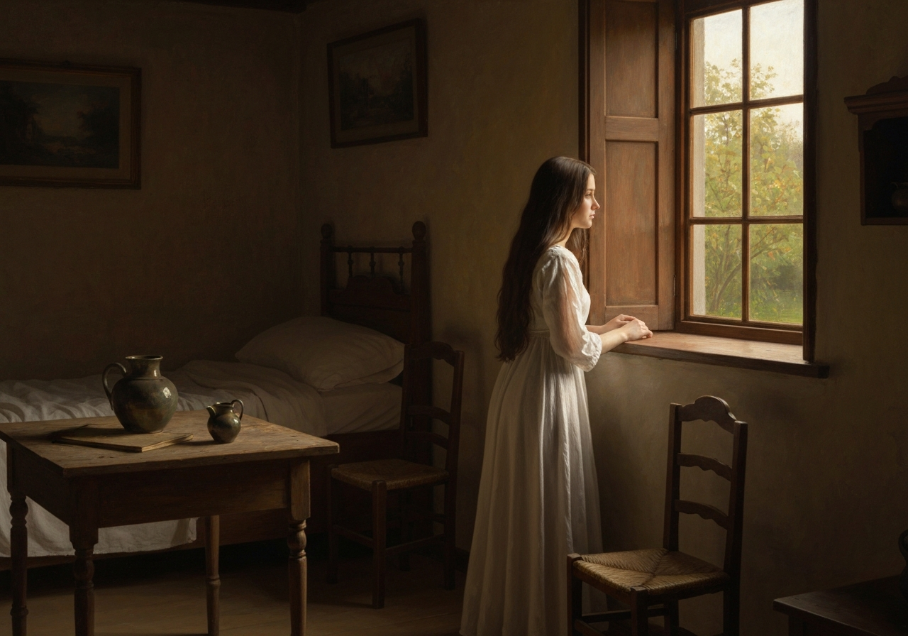

import Callout from '@/components/Callout.astro'

Two days after Mr. Bennet’s return, as Jane and Elizabeth were walking
together in the shrubbery behind the house, they saw the housekeeper
coming towards them, and concluding that she came to call them to their
mother, went forward to meet her; but instead of the expected summons,
when they approached her, she said to Miss Bennet, “I beg your pardon,
madam, for interrupting you, but I was in hopes you might have got some
good news from town, so I took the liberty of coming to ask.”

“What do you mean, Hill? We have heard nothing from town.”

“Dear madam,” cried Mrs. Hill, in great astonishment, “don’t you know
there is an express come for master from Mr. Gardiner? He has been here
this half hour, and master has had a letter.”

{/* metadata:quote_001:start */}
<Callout title="Memorable Quote" variant="note">Away ran the girls, too eager to get in to have time for speech.</Callout>
{/* metadata:quote_001:end */}

{/* metadata:analysis_001:start */}
<Callout title="Analysis" variant="explanation">
This chapter marks a pivotal turning point in the narrative, as the crisis of Lydia's elopement moves toward resolution through Mr. Gardiner's intervention. The chapter opens with the dramatic arrival of an express letter, utilizing the technique of dramatic irony where the housekeeper knows of developments before the family. Austen masterfully controls pacing through the physical action of Jane and Elizabeth running to find their father, building suspense before the letter's contents are revealed.
</Callout>
{/* metadata:analysis_001:end */}

{/* metadata:image_001:start */}

{/* metadata:image_001:end */}

They ran through the vestibule into the breakfast-room; from thence to the
library;--their father was in neither; and they were on the point of
seeking him upstairs with their mother, when they were met by the
butler, who said,--

“If you are looking for my master, ma’am, he is walking towards the
little copse.”

Upon this information, they instantly passed through the hall once more,
and ran across the lawn after their father, who was deliberately
pursuing his way towards a small wood on one side of the paddock.

Jane, who was not so light, nor so much in the habit of running as
Elizabeth, soon lagged behind, while her sister, panting for breath,
came up with him, and eagerly cried out,--

“Oh, papa, what news? what news? have you heard from my uncle?”

“Yes, I have had a letter from him by express.”

“Well, and what news does it bring--good or bad?”

{/* metadata:quote_002:start */}
<Callout title="Memorable Quote" variant="note">“What is there of good to be expected?”</Callout>
{/* metadata:quote_002:end */} said he, taking the letter from
his pocket; “but perhaps you would like to read it.”

Elizabeth impatiently caught it from his hand. Jane now came up.

{/* metadata:image_002:start */}

{/* metadata:image_002:end */}

“Read it aloud,” said their father, “for I hardly know myself what it is
about.”

{/* metadata:image_003:start */}

{/* metadata:image_003:end */}

     /* RIGHT “Gracechurch Street, _Monday, August 2_. */

“My dear Brother,

     “At last I am able to send you some tidings of my niece, and such
     as, upon the whole, I hope will give you satisfaction. Soon after
     you left me on Saturday, I was fortunate enough to find out in what
     part of London they were. {/* metadata:quote_003:start */}
<Callout title="Memorable Quote" variant="note">The particulars I reserve till we meet.</Callout>
{/* metadata:quote_003:end */}
     It is enough to know they are discovered: I have seen them
     both----”

     [Illustration:

“But perhaps you would like to read it”

     [_Copyright 1894 by George Allen._]]

     “Then it is as I always hoped,” cried Jane: “they are married!”

     Elizabeth read on: “I have seen them both. They are not married,
     nor can I find there was any intention of being so; but if you are
     willing to perform the engagements which I have ventured to make on
     your side, I hope it will not be long before they are. All that is
     required of you is, to assure to your daughter, by settlement, her
     equal share of the five thousand pounds, secured among your
     children after the decease of yourself and my sister; and,
     moreover, to enter into an engagement of allowing her, during your
     life, one hundred pounds per annum. These are conditions which,
     considering everything, I had no hesitation in complying with, as
     far as I thought myself privileged, for you. I shall send this by
     express, that no time may be lost in bringing me your answer. You
     will easily comprehend, from these particulars, that Mr. Wickham’s
     circumstances are not so hopeless as they are generally believed to
     be. The world has been deceived in that respect; and I am happy to
     say, there will be some little money, even when all his debts are
     discharged, to settle on my niece, in addition to her own fortune.
     If, as I conclude will be the case, you send me full powers to act
     in your name throughout the whole of this business, I will
     immediately give directions to Haggerston for preparing a proper
     settlement. There will not be the smallest occasion for your coming
     to town again; therefore stay quietly at Longbourn, and depend on
     my diligence and care. Send back your answer as soon as you can,
     and be careful to write explicitly. We have judged it best that my
     niece should be married from this house, of which I hope you will
     approve. She comes to us to-day. I shall write again as soon as
     anything more is determined on. Yours, etc.

“EDW. GARDINER.”

{/* metadata:analysis_002:start */}
<Callout title="Analysis" variant="explanation">
Mr. Gardiner's letter serves as a device for indirect characterization, revealing him as a capable, practical, and generous man who acts decisively on behalf of his brother-in-law's family. The letter's formal structure contrasts sharply with the emotional turmoil it contains, and Austen uses it to provide exposition about the discovery of Lydia and Wickham while omitting compromising details. The phrase "The particulars I reserve till we meet" maintains propriety while heightening intrigue, and the letter's careful financial language underscores the mercenary realities beneath the romantic crisis.
</Callout>
{/* metadata:analysis_002:end */}

“Is it possible?” cried Elizabeth, when she had finished. “Can it be
possible that he will marry her?”

“Wickham is not so undeserving, then, as we have thought him,” said her
sister. “My dear father, I congratulate you.”

“And have you answered the letter?” said Elizabeth.

“No; but it must be done soon.”

Most earnestly did she then entreat him to lose no more time before he
wrote.

“Oh! my dear father,” she cried, “come back and write immediately.
Consider how important every moment is in such a case.”

“Let me write for you,” said Jane, “if you dislike the trouble
yourself.”

“I dislike it very much,” he replied; “but it must be done.”

And so saying, he turned back with them, and walked towards the house.

{/* metadata:image_005:start */}

{/* metadata:image_005:end */}

“And--may I ask?” said Elizabeth; “but the terms, I suppose, must be
complied with.”

{/* metadata:quote_004:start */}
<Callout title="Memorable Quote" variant="note">“Complied with! I am only ashamed of his asking so little.”</Callout>
{/* metadata:quote_004:end */}

“And they _must_ marry! Yet he is _such_ a man.”

“Yes, yes, they must marry. There is nothing else to be done. But there
are two things that I want very much to know:--one is, how much money
your uncle has laid down to bring it about; and the other, how I am ever
to pay him.”

“Money! my uncle!” cried Jane, “what do you mean, sir?”

{/* metadata:quote_005:start */}
<Callout title="Memorable Quote" variant="note">“I mean that no man in his proper senses would marry Lydia on so slight
a temptation as one hundred a year during my life, and fifty after I am
gone.”</Callout>
{/* metadata:quote_005:end */}

“That is very true,” said Elizabeth; “though it had not occurred to me
before. His debts to be discharged, and something still to remain! Oh,
it must be my uncle’s doings! Generous, good man, I am afraid he has
distressed himself. A small sum could not do all this.”

{/* metadata:analysis_003:start */}
<Callout title="Analysis" variant="explanation">
The contrast between Jane and Elizabeth's reactions to the news exemplifies Austen's use of foil characters. Jane immediately assumes the best—"They are married!" and believes Wickham must have genuine regard for Lydia—while Elizabeth remains skeptical and concerned about the financial arrangements. This dichotomy reveals Jane's romantic idealism versus Elizabeth's pragmatic realism, developed throughout the novel. Elizabeth's quick recognition that her uncle must have contributed substantially to the settlement demonstrates her superior understanding of practical realities.
</Callout>
{/* metadata:analysis_003:end */}

“No,” said her father. “Wickham’s a fool if he takes her with a farthing
less than ten thousand pounds: I should be sorry to think so ill of him,
in the very beginning of our relationship.”

{/* metadata:analysis_004:start */}
<Callout title="Analysis" variant="explanation">
Mr. Bennet's response to the situation provides crucial insight into his character evolution. His bitter acknowledgment that he must comply with terms he finds distasteful, combined with his cynical observation that no man in his proper senses would marry Lydia on so slight a temptation, reveals his growing self-awareness regarding his failures as a father. His calculation of the total cost—suggesting Wickham received ten thousand pounds or its equivalent—shows his understanding that his brother-in-law has made significant financial sacrifices on behalf of a family he has long neglected to protect.
</Callout>
{/* metadata:analysis_004:end */}

“Ten thousand pounds! Heaven forbid! How is half such a sum to be
repaid?”

Mr. Bennet made no answer; and each of them, deep in thought, continued
silent till they reached the house. Their father then went to the
library to write, and the girls walked into the breakfast-room.

“And they are really to be married!” cried Elizabeth, as soon as they
were by themselves. “How strange this is! and {/* metadata:quote_006:start */}
<Callout title="Memorable Quote" variant="note">for _this_ we are to be
thankful. That they should marry, small as is their chance of happiness,
and wretched as is his character, we are forced to rejoice!</Callout>
{/* metadata:quote_006:end */} Oh, Lydia!”

“I comfort myself with thinking,” replied Jane, “that he certainly would
not marry Lydia, if he had not a real regard for her. Though our kind
uncle has done something towards clearing him, I cannot believe that ten
thousand pounds, or anything like it, has been advanced. He has children
of his own, and may have more. How could he spare half ten thousand
pounds?”

“If we are ever able to learn what Wickham’s debts have been,” said
Elizabeth, “and how much is settled on his side on our sister, we shall
exactly know what Mr. Gardiner has done for them, because Wickham has
not sixpence of his own. The kindness of my uncle and aunt can never be
requited. Their taking her home, and affording her their personal
protection and countenance, is such a sacrifice to her advantage as
years of gratitude cannot enough acknowledge. By this time she is
actually with them! If such goodness does not make her miserable now,
she will never deserve to be happy! What a meeting for her, when she
first sees my aunt!”

“We must endeavour to forget all that has passed on either side,” said
Jane: “I hope and trust they will yet be happy. His consenting to marry
her is a proof, I will believe, that he is come to a right way of
thinking. Their mutual affection will steady them; and I flatter myself
they will settle so quietly, and live in so rational a manner, as may in
time make their past imprudence forgotten.”

“Their conduct has been such,” replied Elizabeth, “as neither you, nor
I, nor anybody, can ever forget. It is useless to talk of it.”

{/* metadata:analysis_005:start */}
<Callout title="Analysis" variant="explanation">
Elizabeth's interior monologue provides the moral center of the chapter, as she grapples with the pragmatic necessity of the marriage against her knowledge of Wickham's true character. Her lament—"How strange this is! and for THIS we are to be thankful"—expresses the injustice at the novel's heart: that Lydia's moral transgression results in the same outcome that virtuous women seek. Elizabeth's acknowledgment that "we are forced to rejoice" encapsulates the social pressures that constrain women's choices and judge their reputations.
</Callout>
{/* metadata:analysis_005:end */}

It now occurred to the girls that their mother was in all likelihood
perfectly ignorant of what had happened. They went to the library,
therefore, and asked their father whether he would not wish them to make
it known to her. He was writing, and, without raising his head, coolly
replied,--

“Just as you please.”

“May we take my uncle’s letter to read to her?”

“Take whatever you like, and get away.”

Elizabeth took the letter from his writing-table, and they went upstairs
together. Mary and Kitty were both with Mrs. Bennet: one communication
would, therefore, do for all. After a slight preparation for good news,
the letter was read aloud. Mrs. Bennet could hardly contain herself. As
soon as Jane had read Mr. Gardiner’s hope of Lydia’s being soon married,
her joy burst forth, and every following sentence added to its
exuberance. She was now in an irritation as violent from delight as she
had ever been fidgety from alarm and vexation. To know that her daughter
would be married was enough. She was disturbed by no fear for her
felicity, nor humbled by any remembrance of her misconduct.

{/* metadata:image_006:start */}

{/* metadata:image_006:end */}

“My dear, dear Lydia!” she cried: “this is delightful indeed! She will
be married! I shall see her again! She will be married at sixteen! My
good, kind brother! I knew how it would be--I knew he would manage
everything. How I long to see her! and to see dear Wickham too! But the
clothes, the wedding clothes! I will write to my sister Gardiner about
them directly. Lizzy, my dear, run down to your father, and ask him how
much he will give her. Stay, stay, I will go myself. Ring the bell,
Kitty, for Hill. I will put on my things in a moment. My dear, dear
Lydia! How merry we shall be together when we meet!”

Her eldest daughter endeavoured to give some relief to the violence of
these transports, by leading her thoughts to the obligations which Mr.
Gardiner’s behaviour laid them all under.

“For we must attribute this happy conclusion,” she added, “in a great
measure to his kindness. We are persuaded that he has pledged himself to
assist Mr. Wickham with money.”

“Well,” cried her mother, “it is all very right; who should do it but
her own uncle? If he had not had a family of his own, I and my children
must have had all his money, you know; and it is the first time we have
ever had anything from him except a few presents. Well! I am so happy.
In a short time, I shall have a daughter married. {/* metadata:quote_007:start */}
<Callout title="Memorable Quote" variant="note">Mrs. Wickham! How well it sounds!</Callout>
{/* metadata:quote_007:end */} And she was only sixteen last June. My dear Jane, I am in
such a flutter, that I am sure I can’t write; so I will dictate, and you
write for me. We will settle with your father about the money
afterwards; but the things should be ordered immediately.”

She was then proceeding to all the particulars of calico, muslin, and
cambric, and would shortly have dictated some very plentiful orders, had
not Jane, though with some difficulty, persuaded her to wait till her
father was at leisure to be consulted. One day’s delay, she observed,
would be of small importance; and her mother was too happy to be quite
so obstinate as usual. Other schemes, too, came into her head.

“I will go to Meryton,” said she, “as soon as I am dressed, and tell the
good, good news to my sister Philips. And as I come back, I can call on
Lady Lucas and Mrs. Long. Kitty, run down and order the carriage. An
airing would do me a great deal of good, I am sure. Girls, can I do
anything for you in Meryton? Oh! here comes Hill. My dear Hill, have you
heard the good news? Miss Lydia is going to be married; and you shall
all have a bowl of punch to make merry at her wedding.”

{/* metadata:analysis_006:start */}
<Callout title="Analysis" variant="explanation">
Mrs. Bennet's reaction serves as a satirical critique of maternal vanity and social ambition. Her violent transports of joy reveal her complete incapacity for moral reflection, as she immediately fixates on wedding clothes and social announcements, utterly disregarding the circumstances of the marriage. Austen employs hyperbolic characterization to devastating comic effect, culminating in Mrs. Bennet's announcement to the housekeeper: "My dear Hill, have you heard the good news? Miss Lydia is going to be married; and you shall all have a bowl of punch to make merry at her wedding." Her mercenary observation that her brother's money should have been theirs had he not had children of his own further exposes her venal nature.
</Callout>
{/* metadata:analysis_006:end */}

Mrs. Hill began instantly to express her joy. Elizabeth received her
congratulations amongst the rest, and then, sick of this folly, took
refuge in her own room, that she might think with freedom. Poor Lydia’s
situation must, at best, be bad enough; but that it was no worse, she
had need to be thankful. She felt it so; and though, in looking forward,
neither rational happiness, nor worldly prosperity could be justly
expected for her sister, in looking back to what they had feared, only
two hours ago, she felt all the advantages of what they had gained.

{/* metadata:analysis_007:start */}
<Callout title="Analysis" variant="explanation">
The chapter concludes with Elizabeth's retreat to solitude, representing her characteristic need for reflection away from the family's collective noise. Her final assessment—that Lydia's situation "must, at best, be bad enough" but that they must be thankful it is no worse—demonstrates her capacity for rational evaluation rather than blind optimism or despair. This closing moment foreshadows Elizabeth's continued resistance to accepting social forms that mask moral failures, and the final sentence crystallizes her dual vision: she felt all the advantages of what they had gained even while knowing the future held neither rational happiness nor worldly prosperity for her sister.
</Callout>
{/* metadata:analysis_007:end */}

{/* metadata:image_007:start */}

{/* metadata:image_007:end */}
