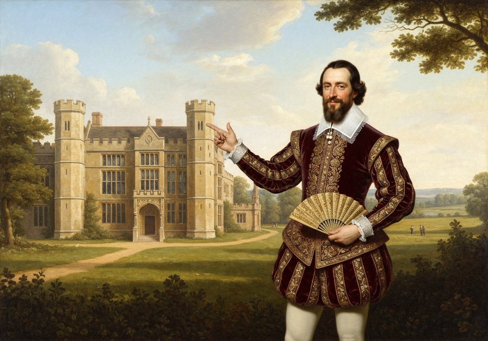
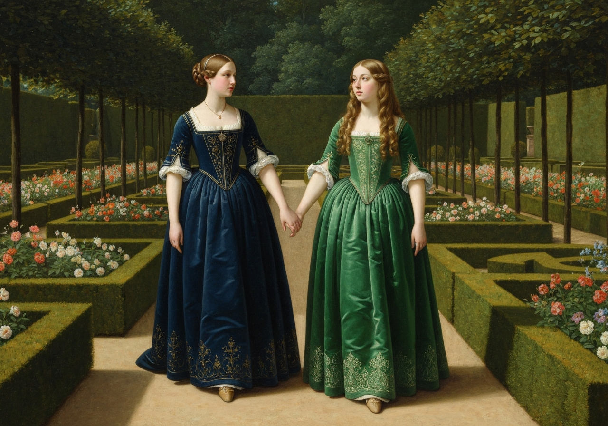
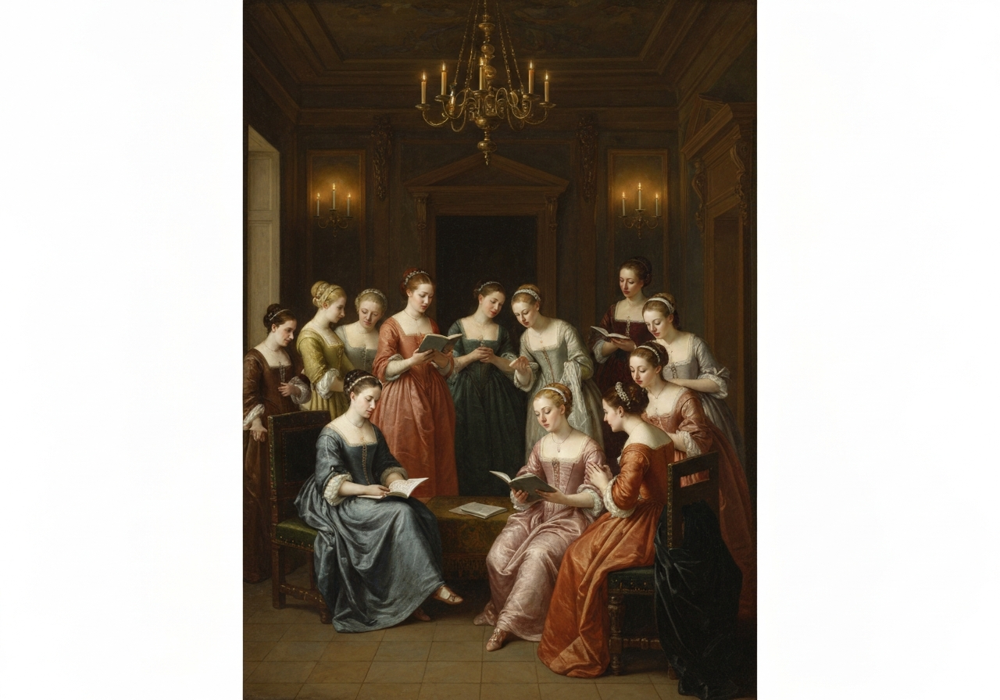
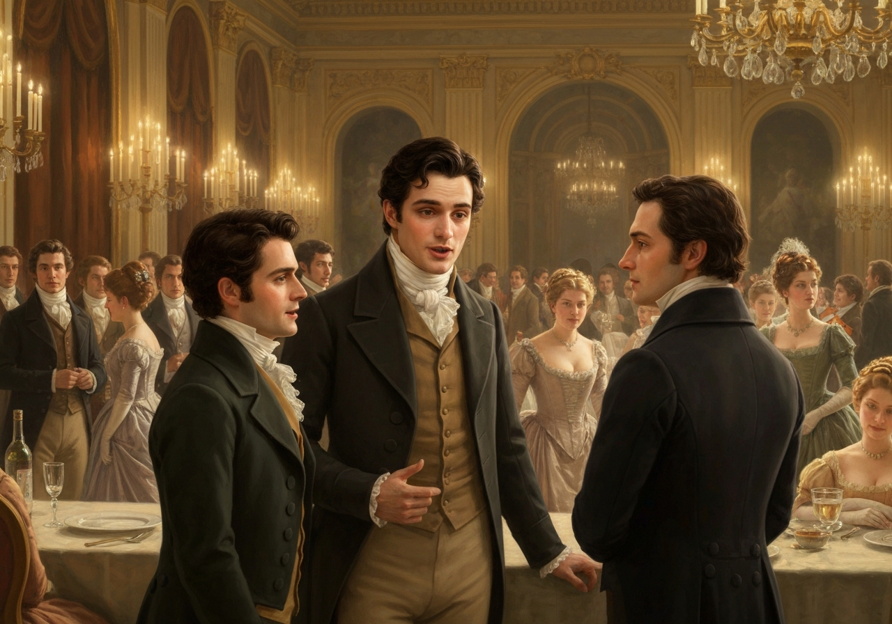
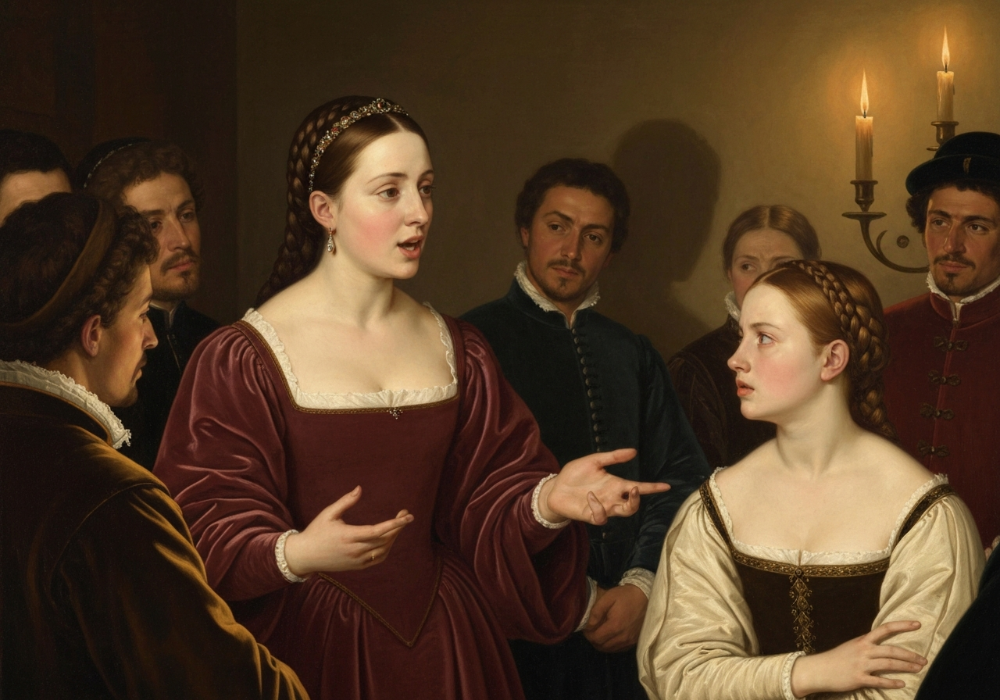
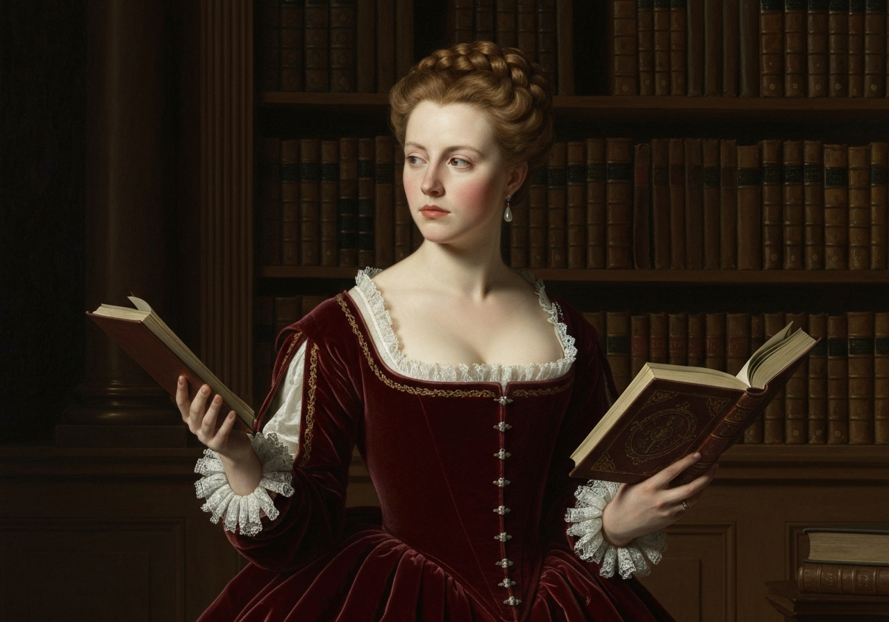
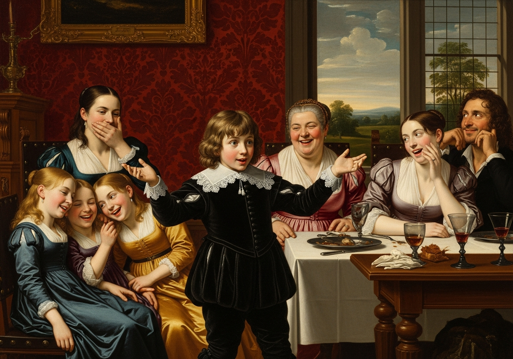

import Callout from '@/components/Callout.astro'

Within a short walk of Longbourn lived a family with whom the Bennets
were particularly intimate. Sir William Lucas had been formerly in trade
in Meryton, where he had made a tolerable fortune, and risen to the
honour of knighthood by an address to the king during his mayoralty. The
distinction had, perhaps, been felt too strongly. It had given him a
disgust to his business and to his residence in a small market town;
and, quitting them both, he had removed with his family to a house about
a mile from Meryton, denominated from that period Lucas Lodge; where he
could think with pleasure of his own importance, and, <!-- metadata:quote-1:start -->
<Callout title="Memorable Quote" variant="note">\n  Unshackled by business, occupy himself solely in being civil to all the world.\n</Callout>
<!-- metadata:quote-1:end -->

<!-- metadata:analysis-1:start -->
<Callout title="Analysis [1]" variant="explanation">
Sir William Lucas's transition from a tradesman to a knight illustrates the fluidity of social status in Meryton. His acquisition of a title has given him a 'disgust' for his former business and a newfound sense of personal importance. Despite this elevation, he maintains an inoffensive and friendly nature that stands in stark contrast to Darcy’s coldness.
</Callout>
<!-- metadata:analysis-1:end -->

<!-- metadata:image-1:start -->
<Callout title="Image [1] Lucas Lodge" variant="example">

</Callout>
<!-- metadata:image-1:end --> For,
though elated by his rank, it did not render him supercilious; on the
contrary, he was all attention to everybody. By nature inoffensive,
friendly, and obliging, his presentation at St. James’s had made him
courteous.

Lady Lucas was a very good kind of woman, not too clever to be a
valuable neighbour to Mrs. Bennet. They had several children. The eldest
of them, a sensible, intelligent young woman, about twenty-seven, was
Elizabeth’s intimate friend.

<!-- metadata:analysis-2:start -->
<Callout title="Analysis [2]" variant="explanation">
Charlotte Lucas is introduced as Elizabeth’s intimate friend and a sensible, intelligent woman of twenty-seven. Her pragmatism allows her to view Darcy’s pride with more objectivity than the Bennets can muster. She represents a grounded social perspective that contrasts with Elizabeth’s more spirited and emotional reactions.
</Callout>
<!-- metadata:analysis-2:end -->

<!-- metadata:image-2:start -->
<Callout title="Image [2] Charlotte and Elizabeth" variant="example">

</Callout>
<!-- metadata:image-2:end -->

That the Miss Lucases and the Miss Bennets should meet to talk over a
ball was absolutely necessary;

<!-- metadata:analysis-3:start -->
<Callout title="Analysis [3]" variant="explanation">
The meeting between the Bennets and Lucases to discuss the ball is described as an 'absolutely necessary' social requirement. This ritual allows the families to compare their 'overhearings' and reinforce their collective social standing. It highlights how the community processes and codifies social experiences through gossip and shared judgment.
</Callout>
<!-- metadata:analysis-3:end -->

<!-- metadata:image-3:start -->
<Callout title="Image [3] The Post-Ball Meeting" variant="example">

</Callout>
<!-- metadata:image-3:end --> and the morning after the assembly
brought the former to Longbourn to hear and to communicate.

“_You_ began the evening well, Charlotte,” said Mrs. Bennet, with civil
self-command, to Miss Lucas. “_You_ were Mr. Bingley’s first choice.”

“Yes; but he seemed to like his second better.”

“Oh, you mean Jane, I suppose, because he danced with her twice. To be
sure that _did_ seem as if he admired her--indeed, I rather believe he
_did_--I heard something about it--but I hardly know what--something
about Mr. Robinson.”

“Perhaps you mean what I overheard between him and Mr. Robinson: did not
I mention it to you? Mr. Robinson’s asking him how he liked our Meryton
assemblies, and whether he did not think there were a great many pretty
women in the room, and _which_ he thought the prettiest? and his
answering immediately to the last question, <!-- metadata:quote-2:start -->
<Callout title="Memorable Quote" variant="tip">\n  Oh, the eldest Miss Bennet, beyond a doubt: there cannot be two opinions on that point.\n</Callout>
<!-- metadata:quote-2:end -->

<!-- metadata:analysis-4:start -->
<Callout title="Analysis [4]" variant="explanation">
Mr. Bingley's immediate and public declaration of Jane's beauty to Mr. Robinson serves to cement her status as the neighborhood's premier 'sweet girl.' This unambiguous admiration is exactly what Mrs. Bennet desires for her daughters' social advancement. It creates a baseline of romantic hope that will drive the plot forward for the next several chapters.
</Callout>
<!-- metadata:analysis-4:end -->

<!-- metadata:image-4:start -->
<Callout title="Image [4] Bingley's Praise overheard" variant="example">

</Callout>
<!-- metadata:image-4:end -->”

“Upon my word! Well, that was very decided, indeed--that does seem as
if--but, however, it may all come to nothing, you know.”

“_My_ overhearings were more to the purpose than _yours_, Eliza,” said
Charlotte. “Mr. Darcy is not so well worth listening to as his friend,
is he? <!-- metadata:quote-3:start -->
<Callout title="Memorable Quote" variant="summary">\n  Poor Eliza! to be only just tolerable.\n</Callout>
<!-- metadata:quote-3:end -->

“I beg you will not put it into Lizzy’s head to be vexed by his
ill-treatment, for he is such a disagreeable man that it would be quite
a misfortune to be liked by him. Mrs. Long told me last night that he
sat close to her for half an hour without once opening his lips.”

“Are you quite sure, ma’am? Is not there a little mistake?” said Jane.
“I certainly saw Mr. Darcy speaking to her.”

“Ay, because she asked him at last how he liked Netherfield, and he
could not help answering her; but she said he seemed very angry at being
spoke to.”

“Miss Bingley told me,” said Jane, “that he never speaks much unless
among his intimate acquaintance. With _them_ he is remarkably
agreeable.”

“I do not believe a word of it, my dear. If he had been so very
agreeable, he would have talked to Mrs. Long. But I can guess how it
was; everybody says that he is eat up with pride, and I dare say he had
heard somehow that Mrs. Long does not keep a carriage, and had to come
to the ball in a hack chaise.”

“I do not mind his not talking to Mrs. Long,” said Miss Lucas, “but I
wish he had danced with Eliza.”

“Another time, Lizzy,” said her mother, “I would not dance with _him_,
if I were you.”

<!-- metadata:quote-4:start -->
<Callout title="Memorable Quote" variant="important">\n  I believe, ma’am, I may safely promise you never to dance with him.\n</Callout>
<!-- metadata:quote-4:end -->

“His pride,” said Miss Lucas, “does not offend _me_ so much as pride
often does, because there is an excuse for it. One cannot wonder that so
very fine a young man, with family, fortune, everything in his favour,
should think highly of himself. <!-- metadata:quote-5:start -->
<Callout title="Memorable Quote" variant="note">\n  If I may so express it, he has a right to be proud.\n</Callout>
<!-- metadata:quote-5:end -->

<!-- metadata:analysis-5:start -->
<Callout title="Analysis [5]" variant="explanation">
Charlotte’s argument that Darcy has a 'right to be proud' given his family and fortune introduces a common Regency sentiment. She suggests that high social status naturally warrants a high opinion of oneself. This perspective challenges Elizabeth’s view that pride is inherently a character failing, regardless of social standing.
</Callout>
<!-- metadata:analysis-5:end -->

<!-- metadata:image-5:start -->
<Callout title="Image [5] Defending Darcy's Pride" variant="example">

</Callout>
<!-- metadata:image-5:end -->

“That is very true,” replied Elizabeth, <!-- metadata:quote-6:start -->
<Callout title="Memorable Quote" variant="important">\n  I could easily forgive his pride, if he had not mortified mine.\n</Callout>
<!-- metadata:quote-6:end -->

<!-- metadata:analysis-6:start -->
<Callout title="Analysis [6]" variant="explanation">
Elizabeth’s admission that she could forgive Darcy’s pride if it had not 'mortified' her own is a key moment of self-reflection. It reveals that her prejudice against him is rooted in personal injury rather than objective character analysis. This vulnerability makes her character more relatable while also establishing her primary character flaw.
</Callout>
<!-- metadata:analysis-6:end -->

“Pride,” observed Mary, who piqued herself upon the solidity of her
reflections, “is a very common failing, I believe. By all that I have
ever read, I am convinced that it is very common indeed; that human
nature is particularly prone to it, and that there are very few of us
who do not cherish a feeling of self-complacency on the score of some
quality or other, real or imaginary. Vanity and pride are different
things, though the words are often used synonymously. A person may be
proud without being vain. <!-- metadata:quote-7:start -->
<Callout title="Memorable Quote" variant="tip">\n  Pride relates more to our opinion of ourselves; vanity to what we would have others think of us.\n</Callout>
<!-- metadata:quote-7:end -->

<!-- metadata:analysis-7:start -->
<Callout title="Analysis [7]" variant="explanation">
Mary Bennet’s philosophical breakdown of pride and vanity serves as the thematic anchor for the novel's title. She distinguishes between one's opinion of oneself (pride) and what one wants others to think (vanity). Her observation, while somewhat pedantic, provides a necessary framework for evaluating the characters' actions.
</Callout>
<!-- metadata:analysis-7:end -->

<!-- metadata:image-6:start -->
<Callout title="Image [6] Mary's Reflection" variant="example">

</Callout>
<!-- metadata:image-6:end -->

“If I were as rich as Mr. Darcy,” cried a young Lucas, who came with his
sisters, “I should not care how proud I was. I would keep a pack of
foxhounds, and drink a bottle of wine every day.”

“Then you would drink a great deal more than you ought,” said Mrs.
Bennet; “and if I were to see you at it, I should take away your bottle
directly.”

<!-- metadata:image-7:start -->
<Callout title="Image [7] The Young Lucas's Dream" variant="example">

</Callout>
<!-- metadata:image-7:end -->

The boy protested that she should not; she continued to declare that she
would; and the argument ended only with the visit.
