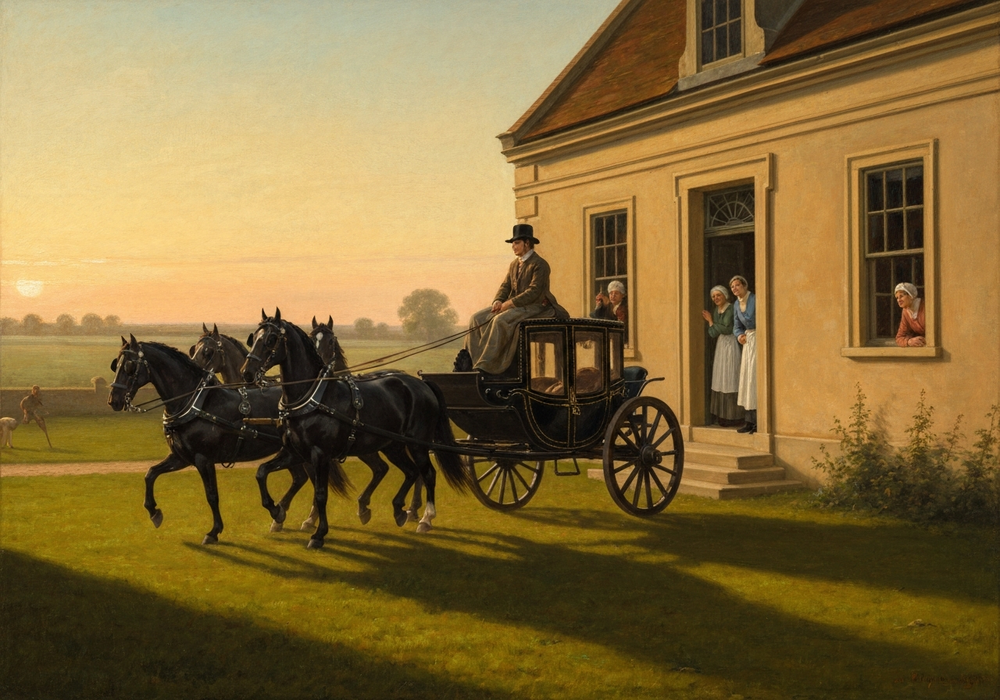
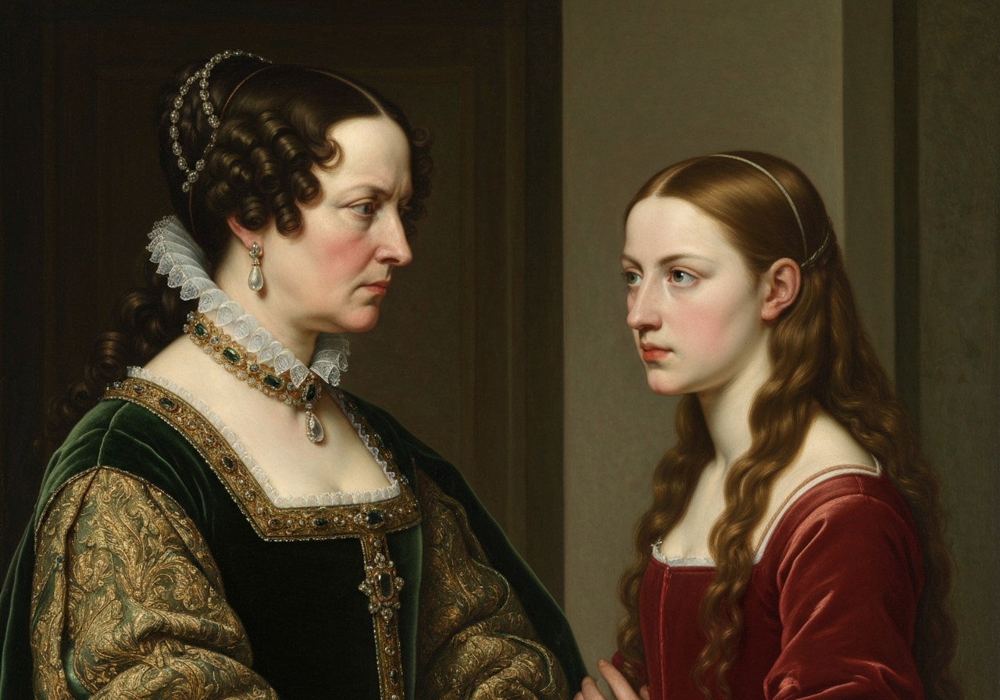
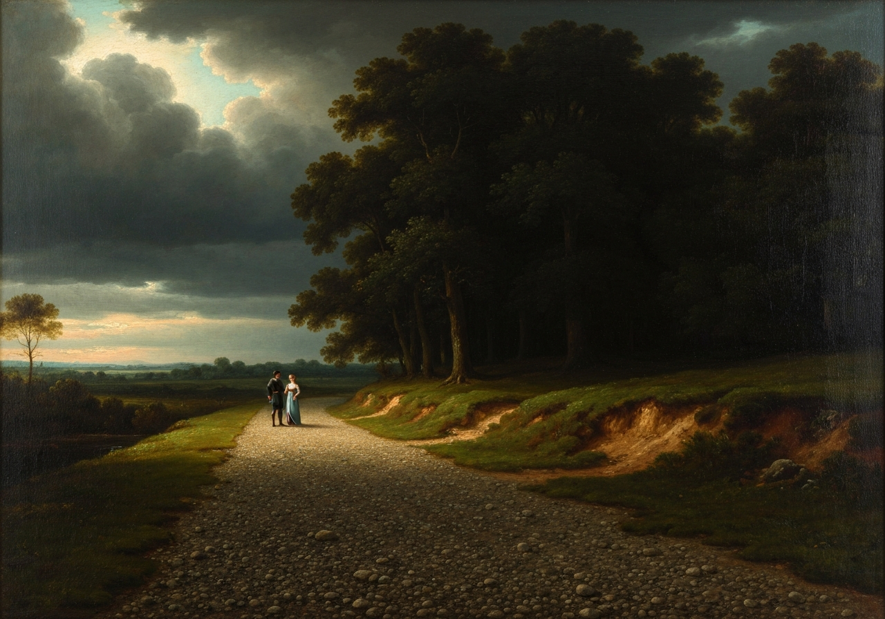
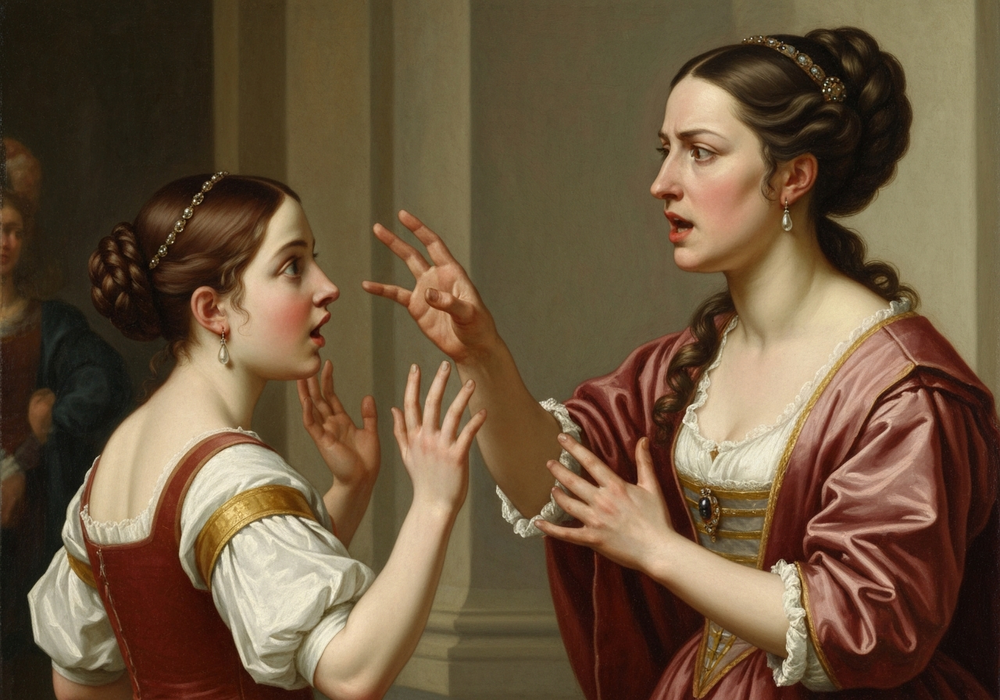
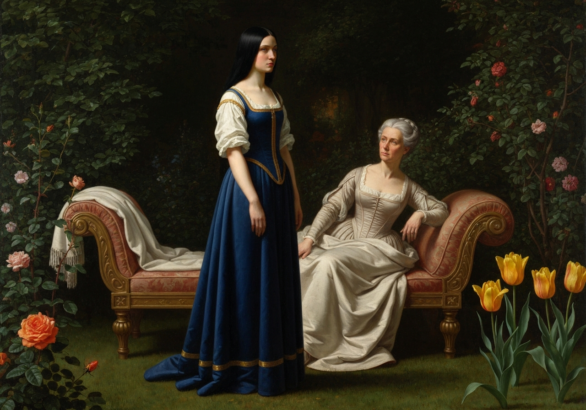
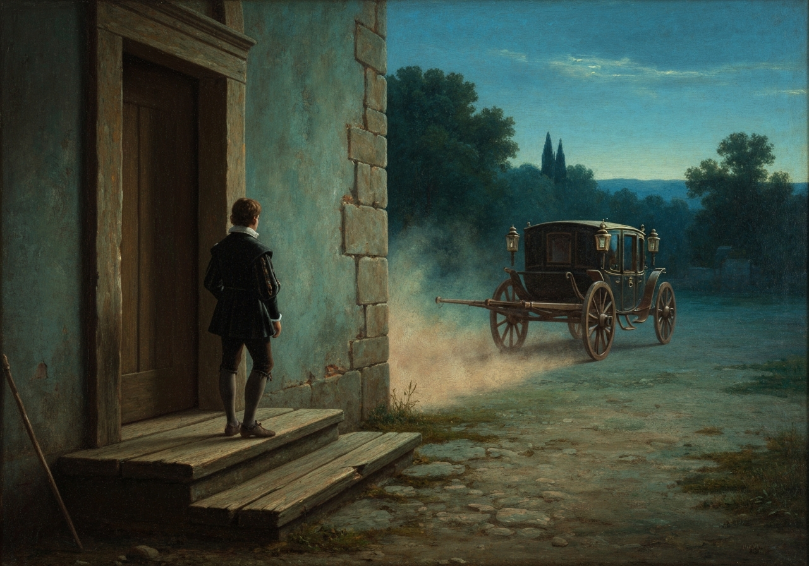
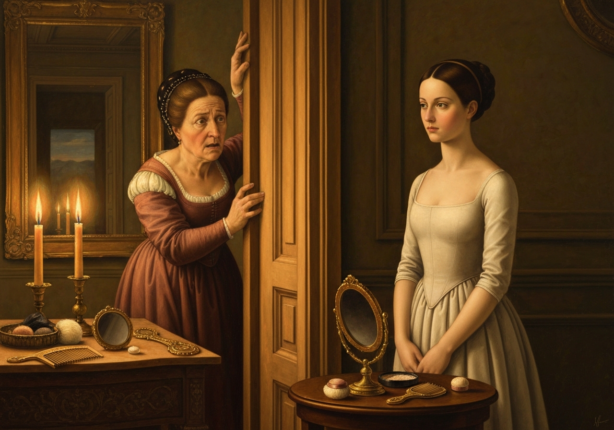

import Callout from '@/components/Callout.astro'

One morning, about a week after Bingley’s engagement with Jane had been
formed, as he and the females of the family were sitting together in the
dining-room, their attention was suddenly drawn to the window by the
sound of a carriage; and they perceived a chaise and four driving up the
lawn.

{/* metadata:quote_01_arrival:start */}
<Callout title="Memorable Quote" variant="note">
It was too early in the morning for visitors; and besides, the
equipage did not answer to that of any of their neighbours.
</Callout>
{/* metadata:quote_01_arrival:end */}

The horses
were post; and neither the carriage, nor the livery of the servant who
preceded it, were familiar to them. As it was certain, however, that
somebody was coming, Bingley instantly prevailed on Miss Bennet to avoid
the confinement of such an intrusion, and walk away with him into the
shrubbery. They both set off; and the conjectures of the remaining three
continued, though with little satisfaction, till the door was thrown
open, and their visitor entered. It was Lady Catherine de Bourgh.

{/* metadata:ip_01_arrival:start */}

{/* metadata:ip_01_arrival:end */}

{/* metadata:analysis_01_arrival:start */}
<Callout title="Analysis" variant="explanation">
The chapter opens with the unprecedented arrival of Lady Catherine de Bourgh's chaise and four, an imposing equipage that signals the gravity of her errand. The early hour and unfamiliar livery create immediate tension among the Bennet household, whose astonishment exceeds even their own expectations. Bingley and Jane's strategic withdrawal into the shrubbery ironically foreshadows the romantic concerns that will dominate the upcoming confrontation.
</Callout>
{/* metadata:analysis_01_arrival:end */}

They were of course all intending to be surprised: but their
astonishment was beyond their expectation; and on the part of Mrs.
Bennet and Kitty, though she was perfectly unknown to them, even
inferior to what Elizabeth felt.

{/* metadata:quote_02_dismissal:start */}
<Callout title="Memorable Quote" variant="note">
She entered the room with an air more than usually ungracious, made no
other reply to Elizabeth’s salutation than a slight inclination of the
head, and sat down without saying a word.
</Callout>
{/* metadata:quote_02_dismissal:end */}

{/* metadata:ip_02_confrontation:start */}

{/* metadata:ip_02_confrontation:end */}

Elizabeth had mentioned her
name to her mother on her Ladyship’s entrance, though no request of
introduction had been made.

Mrs. Bennet, all amazement, though flattered by having a guest of such
high importance, received her with the utmost politeness. After sitting
for a moment in silence, she said, very stiffly, to Elizabeth,--

“I hope you are well, Miss Bennet. That lady, I suppose, is your
mother?”

Elizabeth replied very concisely that she was.

“And _that_, I suppose, is one of your sisters?”

“Yes, madam,” said Mrs. Bennet, delighted to speak to a Lady Catherine.
“She is my youngest girl but one. My youngest of all is lately married,
and my eldest is somewhere about the ground, walking with a young man,
who, I believe, will soon become a part of the family.”

“You have a very small park here,” returned Lady Catherine, after a
short silence.

“It is nothing in comparison of Rosings, my Lady, I dare say; but, I
assure you, it is much larger than Sir William Lucas’s.”

“This must be a most inconvenient sitting-room for the evening in
summer: the windows are full west.”

Mrs. Bennet assured her that they never sat there after dinner; and then
added,--

“May I take the liberty of asking your Ladyship whether you left Mr. and
Mrs. Collins well?”

“Yes, very well. I saw them the night before last.”

Elizabeth now expected that she would produce a letter for her from
Charlotte, as it seemed the only probable motive for her calling. But no
letter appeared, and she was completely puzzled.

Mrs. Bennet, with great civility, begged her Ladyship to take some
refreshment: but Lady Catherine very resolutely, and not very politely,
declined eating anything; and then, rising up, said to Elizabeth,--

“Miss Bennet, there seemed to be a prettyish kind of a little wilderness
on one side of your lawn. I should be glad to take a turn in it, if you
will favour me with your company.”

“Go, my dear,” cried her mother, “and show her Ladyship about the
different walks. I think she will be pleased with the hermitage.”

Elizabeth obeyed; and, running into her own room for her parasol,
attended her noble guest downstairs. As they passed through the hall,
Lady Catherine opened the doors into the dining-parlour and
drawing-room, and pronouncing them, after a short survey, to be
decent-looking rooms, walked on.

{/* metadata:analysis_02_dismissal:start */}
<Callout title="Analysis" variant="explanation">
Lady Catherine's entrance embodies aristocratic arrogance—her 'air more than usually ungracious,' her perfunctory acknowledgment of Elizabeth, and her silent examination of the premises reveal her condescension. As they pass through the hall, she opens the doors of the dining-parlour and drawing-room, subjecting the modest Bennet home to a wordless audit of its social worth. Her criticism of Longbourn's sitting-room and park serve as calculated insults designed to establish social hierarchy before the true purpose of her visit emerges.
</Callout>
{/* metadata:analysis_02_dismissal:end */}

{/* metadata:ip_03_walk:start */}

{/* metadata:ip_03_walk:end */}

Her carriage remained at the door, and Elizabeth saw that her
waiting-woman was in it. They proceeded in silence along the gravel walk
that led to the copse; Elizabeth was determined to make no effort for
conversation with a woman who was now more than usually insolent and
disagreeable.

“How could I ever think her like her nephew?” said she, as she looked in
her face.

As soon as they entered the copse, Lady Catherine began in the following
manner:--

{/* metadata:quote_03_accusation:start */}
<Callout title="Memorable Quote" variant="note">
“You can be at no loss, Miss Bennet, to understand the reason of my
journey hither. Your own heart, your own conscience, must tell you why I
come.”
</Callout>
{/* metadata:quote_03_accusation:end */}

Elizabeth looked with unaffected astonishment.

“Indeed, you are mistaken, madam; I have not been at all able to account
for the honour of seeing you here.”

“Miss Bennet,” replied her Ladyship, in an angry tone, “you ought to
know that I am not to be trifled with. But however insincere _you_ may
choose to be, you shall not find _me_ so.

{/* metadata:quote_04_frankness:start */}
<Callout title="Memorable Quote" variant="note">
My character has ever been
celebrated for its sincerity and frankness; and in a cause of such
moment as this, I shall certainly not depart from it.
</Callout>
{/* metadata:quote_04_frankness:end */}

A report of a most
alarming nature reached me two days ago. I was told, that not only your
sister was on the point of being most advantageously married, but that
_you_--that Miss Elizabeth Bennet would, in all likelihood, be soon
afterwards united to my nephew--my own nephew, Mr. Darcy. Though I
_know_ it must be a scandalous falsehood, though I would not injure him
so much as to suppose the truth of it possible, I instantly resolved on
setting off for this place, that I might make my sentiments known to
you.”

{/* metadata:ip_04_accusation:start */}

{/* metadata:ip_04_accusation:end */}

{/* metadata:analysis_03_accusation:start */}
<Callout title="Analysis" variant="explanation">
The confrontation escalates dramatically when Lady Catherine reveals her intelligence: a report of Elizabeth's impending engagement to Darcy. Elizabeth's coloring with 'astonishment and disdain' demonstrates her genuine surprise while signaling her moral superiority. Lady Catherine's admission that she considers the report 'a scandalous falsehood' yet still journeyed to intervene exposes the depth of her anxiety, as she declares she instantly resolved on setting off for this place, that she might make her sentiments known to you.
</Callout>
{/* metadata:analysis_03_accusation:end */}

“If you believed it impossible to be true,” said Elizabeth, colouring
with astonishment and disdain, “I wonder you took the trouble of coming
so far. What could your Ladyship propose by it?”

“At once to insist upon having such a report universally contradicted.”

“Your coming to Longbourn, to see me and my family,” said Elizabeth
coolly, “will be rather a confirmation of it--if, indeed, such a report
is in existence.”

“If! do you then pretend to be ignorant of it? Has it not been
industriously circulated by yourselves? Do you not know that such a
report is spread abroad?”

“I never heard that it was.”

“And can you likewise declare, that there is no _foundation_ for it?”

“I do not pretend to possess equal frankness with your Ladyship. _You_
may ask questions which _I_ shall not choose to answer.”

“This is not to be borne. Miss Bennet, I insist on being satisfied. Has
he, has my nephew, made you an offer of marriage?”

“Your Ladyship has declared it to be impossible.”

{/* metadata:analysis_04_frankness:start */}
<Callout title="Analysis" variant="explanation">
A battle of rhetorical styles ensues: Lady Catherine deploys her celebrated 'sincerity and frankness' as weapons, demanding explicit answers and invoking familial authority. Elizabeth counters with principled evasion, refusing to submit to interrogation and deflecting each demand with cool precision. The clash between aristocratic entitlement and personal dignity forms the chapter's central dramatic tension, crystallized in Elizabeth's pointed retort: 'Your Ladyship has declared it to be impossible.'
</Callout>
{/* metadata:analysis_04_frankness:end */}

“It ought to be so; it must be so, while he retains the use of his
reason. But _your_ arts and allurements may, in a moment of infatuation,
have made him forget what he owes to himself and to all his family. You
may have drawn him in.”

“If I have, I shall be the last person to confess it.”

“Miss Bennet, do you know who I am? I have not been accustomed to such
language as this. I am almost the nearest relation he has in the world,
and am entitled to know all his dearest concerns.”

“But you are not entitled to know _mine_; nor will such behaviour as
this ever induce me to be explicit.”

“Let me be rightly understood. This match, to which you have the
presumption to aspire, can never take place. No, never. Mr. Darcy is
engaged to _my daughter_. Now, what have you to say?”

“Only this,--that if he is so, you can have no reason to suppose he will
make an offer to me.”

Lady Catherine hesitated for a moment, and then replied,--

“The engagement between them is of a peculiar kind. From their infancy,
they have been intended for each other. It was the favourite wish of
_his_ mother, as well as of hers. While in their cradles we planned the
union; and now, at the moment when the wishes of both sisters would be
accomplished, is their marriage to be prevented by a young woman of
inferior birth, of no importance in the world, and wholly unallied to
the family? Do you pay no regard to the wishes of his friends--to his
tacit engagement with Miss de Bourgh? Are you lost to every feeling of
propriety and delicacy? Have you not heard me say, that from his
earliest hours he was destined for his cousin?”

“Yes; and I had heard it before. But what is that to me? If there is no
other objection to my marrying your nephew, I shall certainly not be
kept from it by knowing that his mother and aunt wished him to marry
Miss de Bourgh. You both did as much as you could in planning the
marriage. Its completion depended on others. If Mr. Darcy is neither by
honour nor inclination confined to his cousin, why is not he to make
another choice? And if I am that choice, why may not I accept him?”

“Because honour, decorum, prudence--nay, interest--forbid it. Yes, Miss
Bennet, interest; for do not expect to be noticed by his family or
friends, if you wilfully act against the inclinations of all. You will
be censured, slighted, and despised, by everyone connected with him.
Your alliance will be a disgrace; your name will never even be mentioned
by any of us.”

“These are heavy misfortunes,” replied Elizabeth. “But the wife of Mr.
Darcy must have such extraordinary sources of happiness necessarily
attached to her situation, that she could, upon the whole, have no cause
to repine.”

“Obstinate, headstrong girl! I am ashamed of you! Is this your gratitude
for my attentions to you last spring? Is nothing due to me on that
score? Let us sit down. You are to understand, Miss Bennet, that I came
here with the determined resolution of carrying my purpose; nor will I
be dissuaded from it. I have not been used to submit to any person’s
whims. I have not been in the habit of brooking disappointment.”

“_That_ will make your Ladyship’s situation at present more pitiable;
but it will have no effect on _me_.”

“I will not be interrupted! Hear me in silence. My daughter and my
nephew are formed for each other. They are descended, on the maternal
side, from the same noble line; and, on the father’s, from respectable,
honourable, and ancient, though untitled, families. Their fortune on
both sides is splendid. They are destined for each other by the voice of
every member of their respective houses; and what is to divide
them?--the upstart pretensions of a young woman without family,
connections, or fortune! Is this to be endured? But it must not, shall
not be! If you were sensible of your own good, you would not wish to
quit the sphere in which you have been brought up.”

“In marrying your nephew, I should not consider myself as quitting that
sphere. He is a gentleman; I am a gentleman’s daughter; so far we are
equal.”

“True. You _are_ a gentleman’s daughter. But what was your mother? Who
are your uncles and aunts? Do not imagine me ignorant of their
condition.”

“Whatever my connections may be,” said Elizabeth, “if your nephew does
not object to them, they can be nothing to _you_.”

“Tell me, once for all, are you engaged to him?”

Though Elizabeth would not, for the mere purpose of obliging Lady
Catherine, have answered this question, she could not but say, after a
moment’s deliberation,--

“I am not.”

Lady Catherine seemed pleased.

“And will you promise me never to enter into such an engagement?”

“I will make no promise of the kind.”

“Miss Bennet, I am shocked and astonished. I expected to find a more
reasonable young woman. But do not deceive yourself into a belief that I
will ever recede. I shall not go away till you have given me the
assurance I require.”

“And I certainly _never_ shall give it. I am not to be intimidated into
anything so wholly unreasonable. Your Ladyship wants Mr. Darcy to marry
your daughter; but would my giving you the wished-for promise make
_their_ marriage at all more probable? Supposing him to be attached to
me, would _my_ refusing to accept his hand make him wish to bestow it on
his cousin? Allow me to say, Lady Catherine, that the arguments with
which you have supported this extraordinary application have been as
frivolous as the application was ill-judged. You have widely mistaken my
character, if you think I can be worked on by such persuasions as these.
How far your nephew might approve of your interference in _his_ affairs,
I cannot tell; but you have certainly no right to concern yourself in
mine. I must beg, therefore, to be importuned no further on the
subject.”

“Not so hasty, if you please. I have by no means done. To all the
objections I have already urged I have still another to add. I am no
stranger to the particulars of your youngest sister’s infamous
elopement. I know it all; that the young man’s marrying her was a
patched-up business, at the expense of your father and uncle. And is
_such_ a girl to be my nephew’s sister? Is _her_ husband, who is the son
of his late father’s steward, to be his brother? Heaven and earth!--of
what are you thinking?

{/* metadata:quote_06_pollution:start */}
<Callout title="Memorable Quote" variant="note">
Are the shades of Pemberley to be thus polluted?”
</Callout>
{/* metadata:quote_06_pollution:end */}

“You can _now_ have nothing further to say,” she resentfully answered.
“You have insulted me, in every possible method. I must beg to return to
the house.”

{/* metadata:analysis_05_tainted_alliance:start */}
<Callout title="Analysis" variant="explanation">
Lady Catherine's rhetorical strategy shifts to character assassination, invoking Lydia's elopement as evidence of the Bennet family's moral contamination. Her horrified invocation—'Are the shades of Pemberley to be thus polluted?'—reveals how property and bloodline transcend individual merit in aristocratic value systems, while simultaneously betraying her fear that Darcy might value love over lineage. Elizabeth's response—that Lady Catherine has insulted her in every possible method—marks the moment the conversation crosses from interrogation into open hostility.
</Callout>
{/* metadata:analysis_05_tainted_alliance:end */}

And she rose as she spoke. Lady Catherine rose also, and they turned
back. Her Ladyship was highly incensed.

“You have no regard, then, for the honour and credit of my nephew!
Unfeeling, selfish girl! Do you not consider that a connection with you
must disgrace him in the eyes of everybody?”

“Lady Catherine, I have nothing further to say. You know my sentiments.”

“You are then resolved to have him?”

“I have said no such thing.

{/* metadata:quote_05_claims:start */}
<Callout title="Memorable Quote" variant="note">
I am only resolved to act in that manner,
which will, in my own opinion, constitute my happiness, without
reference to _you_, or to any person so wholly unconnected with me.”
</Callout>
{/* metadata:quote_05_claims:end */}

{/* metadata:ip_05_defiance:start */}

{/* metadata:ip_05_defiance:end */}

“It is well. You refuse, then, to oblige me. You refuse to obey the
claims of duty, honour, and gratitude. You are determined to ruin him in
the opinion of all his friends, and make him the contempt of the world.”

“Neither duty, nor honour, nor gratitude,” replied Elizabeth, “has any
possible claim on me, in the present instance. No principle of either
would be violated by my marriage with Mr. Darcy. And with regard to the
resentment of his family, or the indignation of the world, if the former
_were_ excited by his marrying me, it would not give me one moment’s
concern--and the world in general would have too much sense to join in
the scorn.”

{/* metadata:analysis_06_defiance:start */}
<Callout title="Analysis" variant="explanation">
Elizabeth's final declaration of autonomy represents a radical assertion of female agency: 'I am only resolved to act in that manner, which will, in my own opinion, constitute my happiness, without reference to you, or to any person so wholly unconnected with me.' She systematically dismantles Lady Catherine's appeals to duty, honor, and gratitude, substituting individual conscience for social obligation. Her further claim that the world in general would have too much sense to join in the scorn against such a marriage underscores her confidence that personal merit can withstand aristocratic censure.
</Callout>
{/* metadata:analysis_06_defiance:end */}

“And this is your real opinion! This is your final resolve! Very well. I
shall now know how to act. Do not imagine, Miss Bennet, that your
ambition will ever be gratified. I came to try you. I hoped to find you
reasonable; but depend upon it I will carry my point.”

In this manner Lady Catherine talked on till they were at the door of
the carriage, when, turning hastily round, she added,--

{/* metadata:quote_07_departure:start */}
<Callout title="Memorable Quote" variant="note">
“I take no leave of you, Miss Bennet. I send no compliments to your
mother. You deserve no such attention. I am most seriously displeased.”
</Callout>
{/* metadata:quote_07_departure:end */}

Elizabeth made no answer; and without attempting to persuade her
Ladyship to return into the house, walked quietly into it herself. She
heard the carriage drive away as she proceeded upstairs.

{/* metadata:ip_06_farewell:start */}

{/* metadata:ip_06_farewell:end */}

Her mother
impatiently met her at the door of her dressing-room, to ask why Lady
Catherine would not come in again and rest herself.

“She did not choose it,” said her daughter; “she would go.”

“She is a very fine-looking woman! and her calling here was prodigiously
civil! for she only came, I suppose, to tell us the Collinses were well.
She is on her road somewhere, I dare say; and so, passing through
Meryton, thought she might as well call on you. I suppose she had
nothing particular to say to you, Lizzy?”

Elizabeth was forced to give in to a little falsehood here; for to
acknowledge the substance of their conversation was impossible.

{/* metadata:ip_07_mother:start */}

{/* metadata:ip_07_mother:end */}

{/* metadata:analysis_07_departure:start */}
<Callout title="Analysis" variant="explanation">
The chapter concludes with dramatic irony: Lady Catherine exits in high dudgeon, having failed utterly in her mission, while Mrs. Bennet remains oblivious to the true significance of the visit. Elizabeth is forced to give in to a little falsehood when her mother presses her for details, since to acknowledge the substance of their conversation was impossible. This necessary deception emphasizes the gap between Elizabeth's interior life of principled resistance and the social performance required by her domestic position.
</Callout>
{/* metadata:analysis_07_departure:end */}
