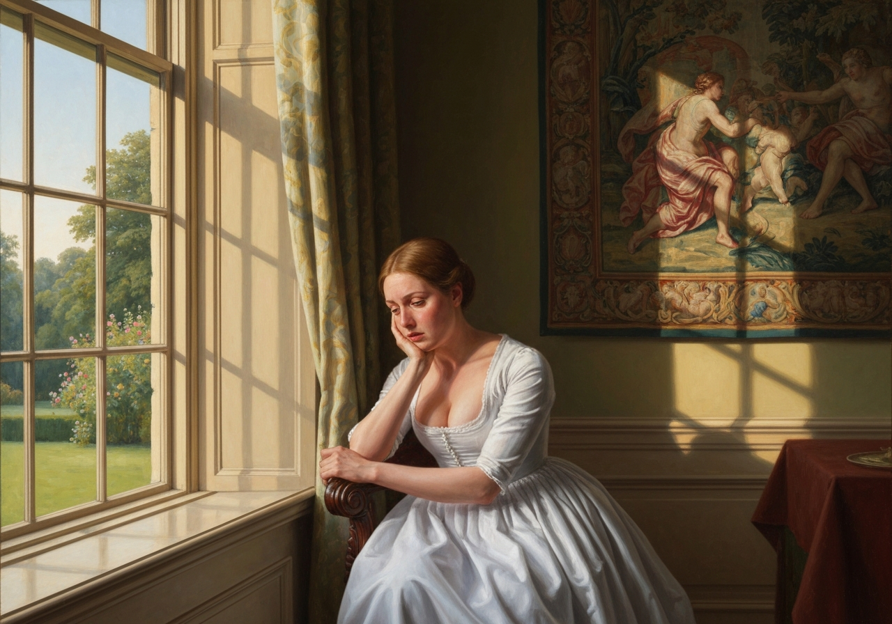
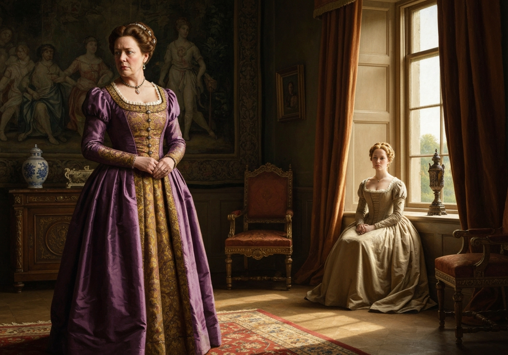
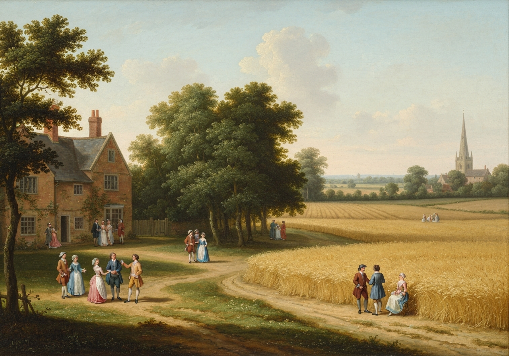
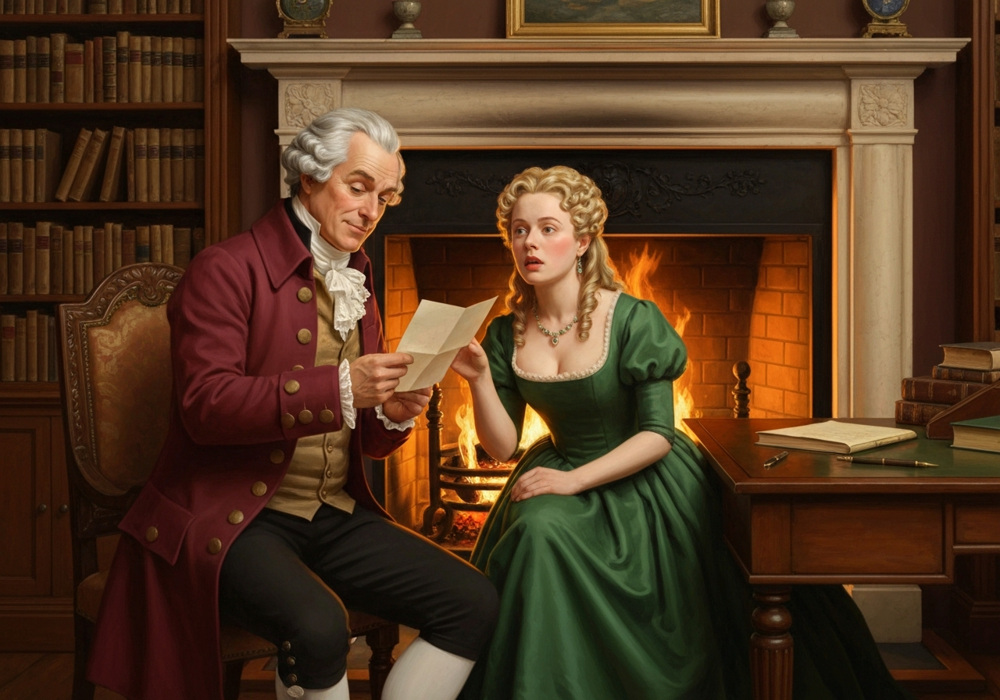
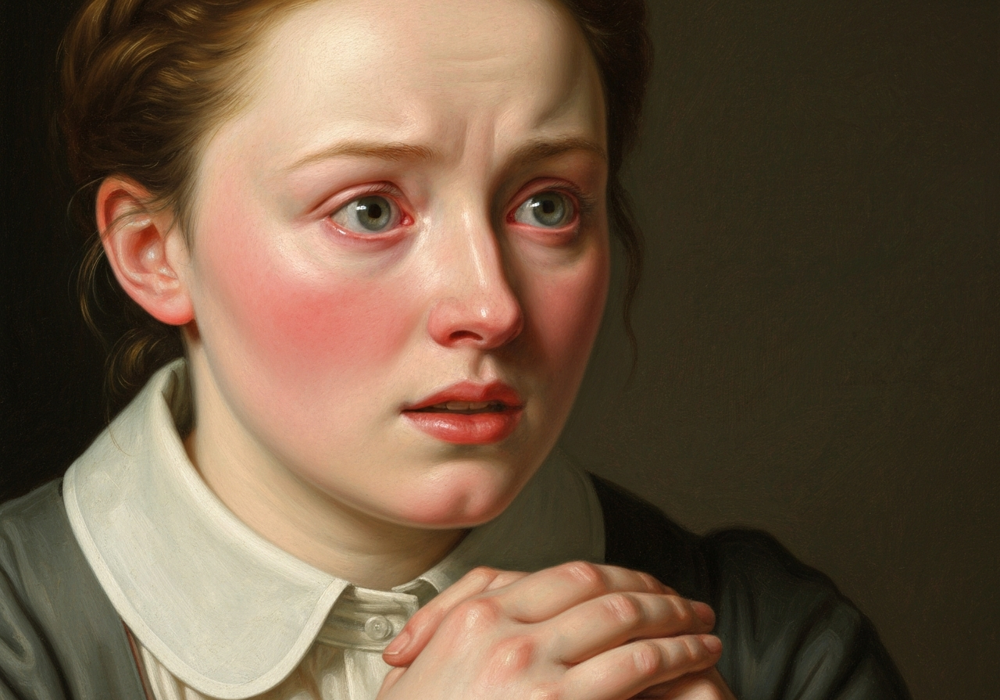
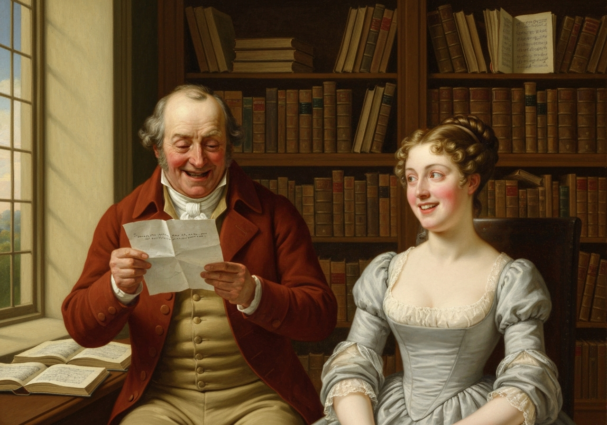
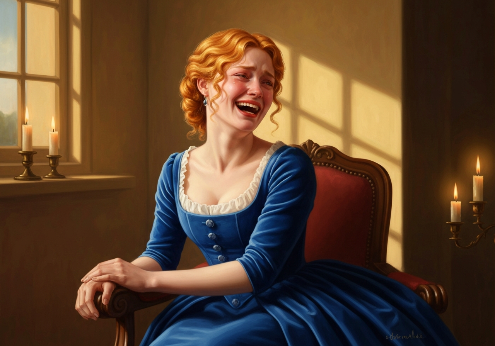

import Callout from '@/components/Callout.astro'

{/* metadata:q1:start */}
<Callout title="Memorable Quote" variant="note">
The discomposure of spirits which this extraordinary visit threw
Elizabeth into could not be easily overcome; nor could she for many
hours learn to think of it less than incessantly.
</Callout>
{/* metadata:q1:end */}

{/* metadata:i2:start */}

{/* metadata:i2:end */}

Lady Catherine, it appeared, had actually taken the trouble of this journey from Rosings
for the sole purpose of breaking off her supposed engagement with Mr. Darcy.

{/* metadata:a1:start */}
<Callout title="Analysis" variant="explanation">
Lady Catherine's unexpected journey from Rosings to Longbourn demonstrates the aristocratic desperation that fuels her meddling. Her willingness to travel merely to prevent an engagement reveals both her overbearing nature and her genuine concern for her nephew's social standing. This physical intrusion into Elizabeth's world marks a pivotal moment where external forces attempt to control the narrative of Elizabeth and Darcy's relationship, highlighting the tension between individual agency and class-based interference in matters of marriage.
</Callout>
{/* metadata:a1:end */}

{/* metadata:i1:start */}

{/* metadata:i1:end */}

{/* metadata:q2:start */}
<Callout title="Memorable Quote" variant="note">
It was a rational scheme, to be sure! but from what the report of
their engagement could originate, Elizabeth was at a loss to imagine;
till she recollected that _his_ being the intimate friend of Bingley,
and _her_ being the sister of Jane, was enough, at a time when the
expectation of one wedding made everybody eager for another, to supply
the idea.
</Callout>
{/* metadata:q2:end */}

She had not herself forgotten to feel that the marriage of her
sister must bring them more frequently together. And her neighbours at
Lucas Lodge, therefore, (for through their communication with the
Collinses, the report, she concluded, had reached Lady Catherine,) had
only set _that_ down as almost certain and immediate which _she_ had
looked forward to as possible at some future time.

{/* metadata:i6:start */}

{/* metadata:i6:end */}

{/* metadata:a5:start */}
<Callout title="Analysis" variant="explanation">
The theme of rumor and misinformation permeates this chapter, as both Lady Catherine and Mr. Collins act upon false reports of an engagement that exists only in the imagination of the community. This reflects Austen's broader commentary on how Regency society's obsession with marriage created a culture where every possible union is scrutinized, discussed, and acted upon by third parties before the principals themselves have settled their affairs. The gossip that travels from Longbourn to Lucas Lodge to Hunsford and back again becomes its own character in the drama.
</Callout>
{/* metadata:a5:end */}

In revolving Lady Catherine’s expressions, however, she could not help
feeling some uneasiness as to the possible consequence of her persisting
in this interference. From what she had said of her resolution to
prevent the marriage, it occurred to Elizabeth that she must meditate an
application to her nephew; and how he might take a similar
representation of the evils attached to a connection with her she dared
not pronounce. She knew not the exact degree of his affection for his
aunt, or his dependence on her judgment, but it was natural to suppose
that he thought much higher of her Ladyship than _she_ could do; and it
was certain, that in enumerating the miseries of a marriage with _one_
whose immediate connections were so unequal to his own, his aunt would
address him on his weakest side.

{/* metadata:q3:start */}
<Callout title="Memorable Quote" variant="note">
With his notions of dignity, he would
probably feel that the arguments, which to Elizabeth had appeared weak
and ridiculous, contained much good sense and solid reasoning.
</Callout>
{/* metadata:q3:end */}

If he had been wavering before, as to what he should do, which had often
seemed likely, the advice and entreaty of so near a relation might
settle every doubt, and determine him at once to be as happy as dignity
unblemished could make him. In that case he would return no more. Lady
Catherine might see him in her way through town; and his engagement to
Bingley of coming again to Netherfield must give way.

{/* metadata:a2:start */}
<Callout title="Analysis" variant="explanation">
Elizabeth's internal anxiety about how Darcy might respond to his aunt's influence reveals her deepening emotional investment in their potential relationship. Despite her previous rejection of his proposal, she now fears losing something she has not yet formally gained. This psychological shift marks Elizabeth's transformation from proud skeptic to vulnerable romantic, demonstrating Austen's nuanced portrayal of how love can alter one's perspective on social barriers that once seemed insurmountable.
</Callout>
{/* metadata:a2:end */}

“If, therefore, an excuse for not keeping his promise should come to his
friend within a few days,” she added, “I shall know how to understand
it. I shall then give over every expectation, every wish of his
constancy.

{/* metadata:q4:start */}
<Callout title="Memorable Quote" variant="note">
If he is satisfied with only regretting me, when he might
have obtained my affections and hand, I shall soon cease to regret him
at all.”
</Callout>
{/* metadata:q4:end */}

The surprise of the rest of the family, on hearing who their visitor had
been, was very great: but they obligingly satisfied it with the same
kind of supposition which had appeased Mrs. Bennet’s curiosity; and
Elizabeth was spared from much teasing on the subject.

The next morning, as she was going down stairs, she was met by her
father, who came out of his library with a letter in his hand.

“Lizzy,” said he, “I was going to look for you: come into my room.”

She followed him thither; and her curiosity to know what he had to tell
her was heightened by the supposition of its being in some manner
connected with the letter he held. It suddenly struck her that it might
be from Lady Catherine, and she anticipated with dismay all the
consequent explanations.

She followed her father to the fireplace, and they both sat down.

{/* metadata:i3:start */}

{/* metadata:i3:end */}

He then said,--

“I have received a letter this morning that has astonished me
exceedingly. As it principally concerns yourself, you ought to know its
contents. I did not know before that I had _two_ daughters on the brink
of matrimony. Let me congratulate you on a very important conquest.”

The colour now rushed into Elizabeth’s cheeks in the instantaneous
conviction of its being a letter from the nephew, instead of the aunt;
and she was undetermined whether most to be pleased that he explained
himself at all, or offended that his letter was not rather addressed to
herself, when her father continued,--

{/* metadata:i4:start */}

{/* metadata:i4:end */}

“You look conscious. Young ladies have great penetration in such matters
as these; but I think I may defy even _your_ sagacity to discover the
name of your admirer. This letter is from Mr. Collins.”

“From Mr. Collins! and what can _he_ have to say?”

“Something very much to the purpose, of course. He begins with
congratulations on the approaching nuptials of my eldest daughter, of
which, it seems, he has been told by some of the good-natured, gossiping
Lucases. I shall not sport with your impatience by reading what he says
on that point. What relates to yourself is as follows:--‘Having thus
offered you the sincere congratulations of Mrs. Collins and myself on
this happy event, let me now add a short hint on the subject of another,
of which we have been advertised by the same authority. Your daughter
Elizabeth, it is presumed, will not long bear the name of Bennet, after
her eldest sister has resigned it; and the chosen partner of her fate
may be reasonably looked up to as one of the most illustrious personages
in this land.’ Can you possibly guess, Lizzy, who is meant by this?

{/* metadata:q5:start */}
<Callout title="Memorable Quote" variant="note">
‘This young gentleman is blessed, in a peculiar way, with everything the
heart of mortal can most desire,--splendid property, noble kindred, and
extensive patronage.
</Callout>
{/* metadata:q5:end */}

Yet, in spite of all these temptations, let me warn
my cousin Elizabeth, and yourself, of what evils you may incur by a
precipitate closure with this gentleman’s proposals, which, of course,
you will be inclined to take immediate advantage of.’ Have you any idea,
Lizzy, who this gentleman is? But now it comes out. ‘My motive for
cautioning you is as follows:--We have reason to imagine that his aunt,
Lady Catherine de Bourgh, does not look on the match with a friendly
eye.’ _Mr. Darcy_, you see, is the man! Now, Lizzy, I think I _have_
surprised you. Could he, or the Lucases, have pitched on any man, within
the circle of our acquaintance, whose name would have given the lie more
effectually to what they related?

{/* metadata:q6:start */}
<Callout title="Memorable Quote" variant="note">
Mr. Darcy, who never looks at any
woman but to see a blemish, and who probably never looked at _you_ in
his life! It is admirable!”
</Callout>
{/* metadata:q6:end */}

{/* metadata:i5:start */}

{/* metadata:i5:end */}

{/* metadata:a3:start */}
<Callout title="Analysis" variant="explanation">
Mr. Collins's letter functions as a comedic mirror to Lady Catherine's intervention, reinforcing the absurdity of the situation through his characteristic blend of obsequiousness and presumption. His attempt to warn Elizabeth against a match that is not actually happening, while simultaneously citing the very gossip that created the misunderstanding, creates a perfect literary irony. The letter satirizes both the clergyman's lack of genuine Christian charity and the overheated imagination of the marriage-obsessed society.
</Callout>
{/* metadata:a3:end */}

Elizabeth tried to join in her father’s pleasantry, but could only force
one most reluctant smile. Never had his wit been directed in a manner so
little agreeable to her.

“Are you not diverted?”

“Oh, yes. Pray read on.”

“‘After mentioning the likelihood of this marriage to her Ladyship last
night, she immediately, with her usual condescension, expressed what she
felt on the occasion; when it became apparent, that, on the score of
some family objections on the part of my cousin, she would never give
her consent to what she termed so disgraceful a match. I thought it my
duty to give the speediest intelligence of this to my cousin, that she
and her noble admirer may be aware of what they are about, and not run
hastily into a marriage which has not been properly sanctioned.’ Mr.
Collins, moreover, adds, ‘I am truly rejoiced that my cousin Lydia’s sad
business has been so well hushed up, and am only concerned that their
living together before the marriage took place should be so generally
known. I must not, however, neglect the duties of my station, or refrain
from declaring my amazement, at hearing that you received the young
couple into your house as soon as they were married. It was an
encouragement of vice; and had I been the rector of Longbourn, I should
very strenuously have opposed it. You ought certainly to forgive them as
a Christian, but never to admit them in your sight, or allow their
names to be mentioned in your hearing.’ _That_ is his notion of
Christian forgiveness! The rest of his letter is only about his dear
Charlotte’s situation, and his expectation of a young olive-branch. But,
Lizzy, you look as if you did not enjoy it. You are not going to be
_missish_, I hope, and pretend to be affronted at an idle report. For
what do we live, but to make sport for our neighbours, and laugh at them
in our turn?”

“Oh,” cried Elizabeth, “I am exceedingly diverted. But it is so
strange!”

“Yes, _that_ is what makes it amusing. Had they fixed on any other man
it would have been nothing; but _his_ perfect indifference and _your_
pointed dislike make it so delightfully absurd! Much as I abominate
writing, I would not give up Mr. Collins’s correspondence for any
consideration. Nay, when I read a letter of his, I cannot help giving
him the preference even over Wickham, much as I value the impudence and
hypocrisy of my son-in-law. And pray, Lizzy, what said Lady Catherine
about this report? Did she call to refuse her consent?”

To this question his daughter replied only with a laugh; and as it had
been asked without the least suspicion, she was not distressed by his
repeating it. Elizabeth had never been more at a loss to make her
feelings appear what they were not.

{/* metadata:a6:start */}
<Callout title="Analysis" variant="explanation">
Elizabeth's forced laughter at her father's questions represents a crucial moment of self-restraint and social performance. Her ability to maintain the facade while suffering inwardly demonstrates both her strength and her isolation. Unlike earlier in the novel when she shared confidences with Jane, Elizabeth now bears her secret alone, unable to reveal her true feelings even to her closest family members. This solitude intensifies the emotional stakes of her situation.
</Callout>
{/* metadata:a6:end */}

{/* metadata:q7:start */}
<Callout title="Memorable Quote" variant="note">
It was necessary to laugh when she
would rather have cried. Her father had most cruelly mortified her by
what he said of Mr. Darcy’s indifference;
</Callout>
{/* metadata:q7:end */}

{/* metadata:i7:start */}

{/* metadata:i7:end */}

{/* metadata:a4:start */}
<Callout title="Analysis" variant="explanation">
Mr. Bennet's cruel mockery of the very possibility of Darcy's interest in Elizabeth represents the painful gap between how Elizabeth perceives their relationship and how the world—including her own father—views it. His certainty that Darcy 'never looked at you in his life' cuts Elizabeth deeply because she now knows it to be untrue. This paternal disbelief functions as a trial by irony, testing Elizabeth's ability to maintain her composure while her inner emotional reality diverges catastrophically from external appearances.
</Callout>
{/* metadata:a4:end */}

and she could do nothing but
wonder at such a want of penetration, or fear that, perhaps, instead of
his seeing too _little_, she might have fancied too _much_.

{/* metadata:a7:start */}
<Callout title="Analysis" variant="explanation">
The chapter's conclusion reveals Elizabeth's haunting doubt about whether she might have 'fancied too much' in believing Darcy still harbored feelings for her. This fear of misplaced confidence echoes her earlier misjudgment of Wickham and represents the psychological cost of her pride. The possibility that her father's assessment might be correct—that Darcy's previous proposal represented a momentary aberration rather than enduring love—creates narrative suspense while deepening our understanding of Elizabeth's vulnerability.
</Callout>
{/* metadata:a7:end */}
