import Callout from '@/components/Callout.astro'

[Illustration]

Instead of receiving any such letter of excuse from his friend, as
Elizabeth half expected Mr. Bingley to do, he was able to bring Darcy
with him to Longbourn before many days had passed after Lady Catherine’s
visit. The gentlemen arrived early; and, before Mrs. Bennet had time to
tell him of their having seen his aunt, of which her daughter sat in
momentary dread, Bingley, who wanted to be alone with Jane, proposed
their all walking out. It was agreed to. Mrs. Bennet was not in the
habit of walking, Mary could never spare time, but the remaining five
set off together.

{/* metadata:A1:start */}
<Callout title="Analysis" variant="explanation">
The chapter opens with Bingley bringing Darcy to Longbourn, creating the opportunity for Elizabeth and Darcy to be alone. Kitty's departure to visit Maria Lucas is the small social accident that finally clears the way for private confession. This arrangement demonstrates how Austen uses the mechanics of Regency social life—group walks, casual partings—to engineer the intimate encounters on which her plots turn.
</Callout>
{/* metadata:A1:end */}

{/* metadata:I1:start */}
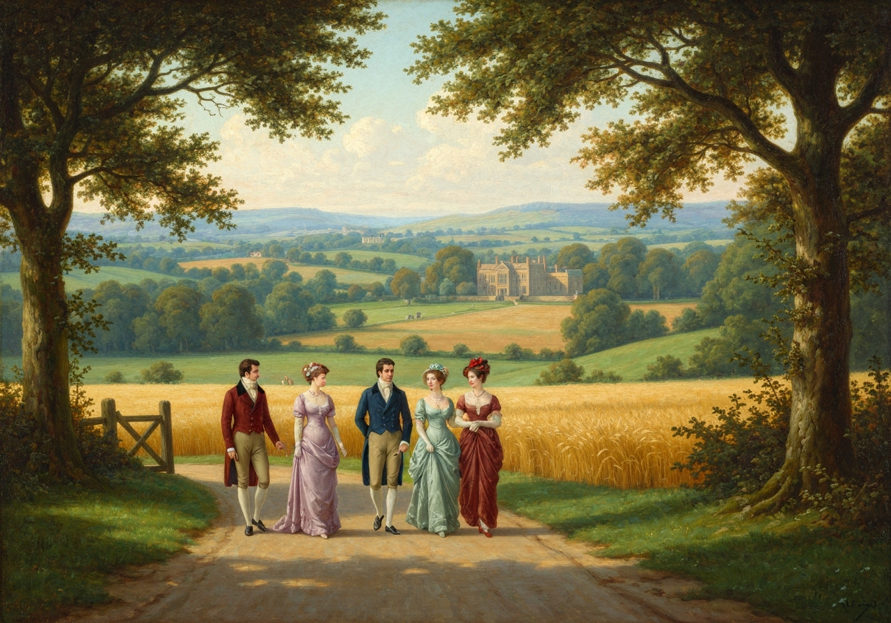

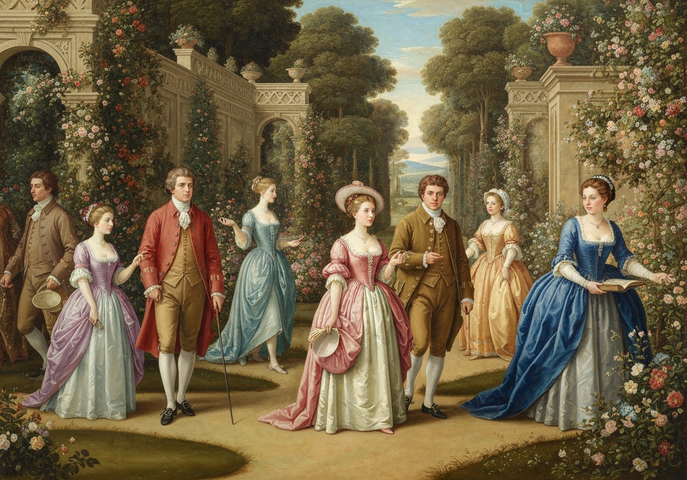
{/* metadata:I1:end */}

 Bingley and Jane, however, soon allowed the others to
outstrip them. They lagged behind, while Elizabeth, Kitty, and Darcy
were to entertain each other. Very little was said by either; Kitty was
too much afraid of him to talk; Elizabeth was secretly forming a
desperate resolution; and, perhaps, he might be doing the same.

They walked towards the Lucases’, because Kitty wished to call upon
Maria; and as Elizabeth saw no occasion for making it a general concern,
when Kitty left them she went boldly on with him alone.

{/* metadata:A2:start */}
<Callout title="Analysis" variant="explanation">
Elizabeth's bold decision to walk alone with Darcy marks a significant shift in her character. Having previously rejected his proposal with passionate indignation, she now takes the initiative to express her gratitude and transformed feelings, showing her growth in humility and self-awareness. The narrator's quiet observation that she 'went boldly on with him alone' encapsulates the courage required to bridge the distance her own pride and prejudice had created.
</Callout>
{/* metadata:A2:end */}

{/* metadata:I2:start */}
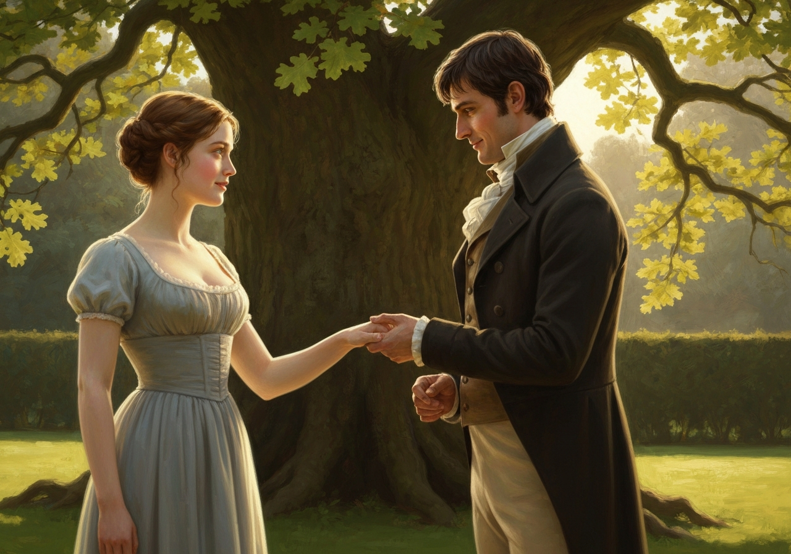

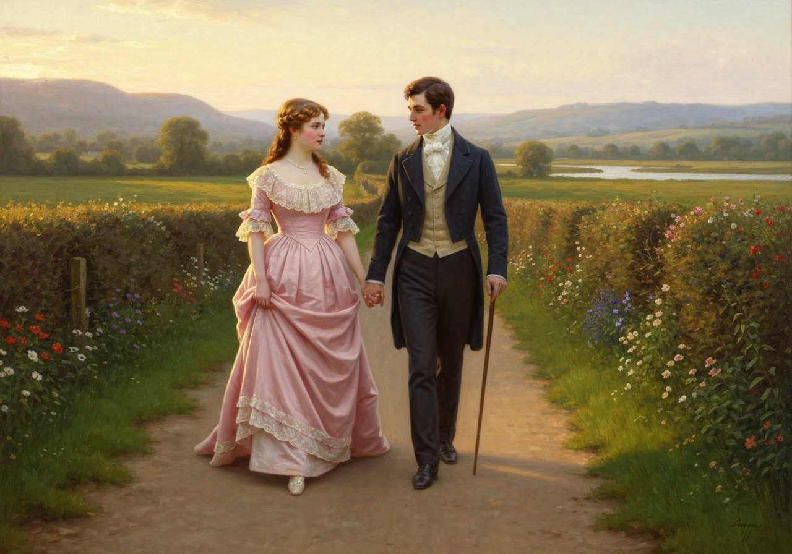
{/* metadata:I2:end */}

 Now was the
moment for her resolution to be executed; and while her courage was
high, she immediately said,--

{/* metadata:Q1:start */}
<Callout title="Memorable Quote" variant="note">Mr. Darcy, I am a very selfish creature, and for the sake of giving relief to my own feelings care not how much I may be wounding yours.</Callout>
{/* metadata:Q1:end */} I
can no longer help thanking you for your unexampled kindness to my poor
sister. Ever since I have known it I have been most anxious to
acknowledge to you how gratefully I feel it. Were it known to the rest
of my family I should not have merely my own gratitude to express.”

“I am sorry, exceedingly sorry,” replied Darcy, in a tone of surprise
and emotion, “that you have ever been informed of what may, in a
mistaken light, have given you uneasiness. I did not think Mrs. Gardiner
was so little to be trusted.”

“You must not blame my aunt. Lydia’s thoughtlessness first betrayed to
me that you had been concerned in the matter; and, of course, I could
not rest till I knew the particulars. Let me thank you again and again,
in the name of all my family, for that generous compassion whi

{/* metadata:I3:start */}
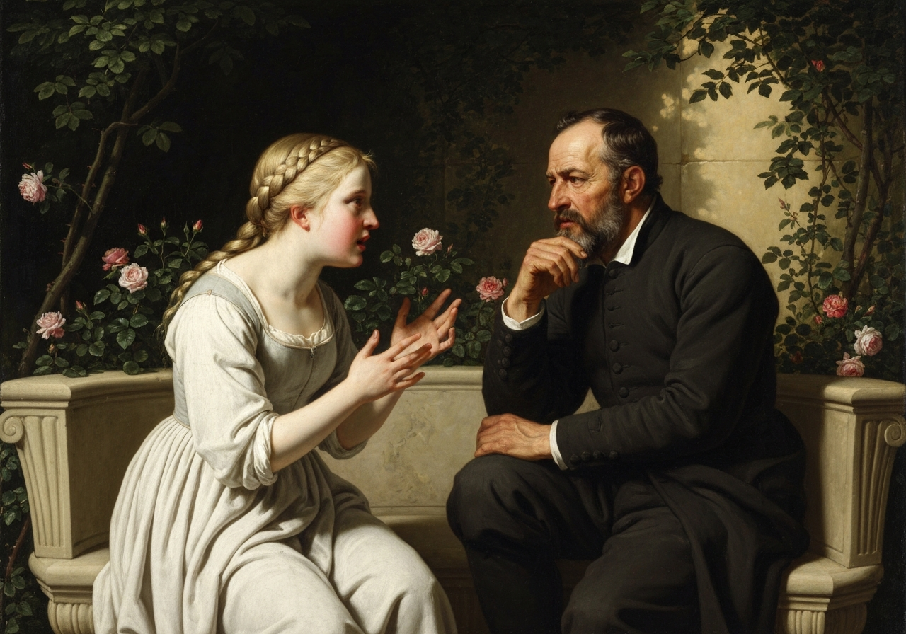

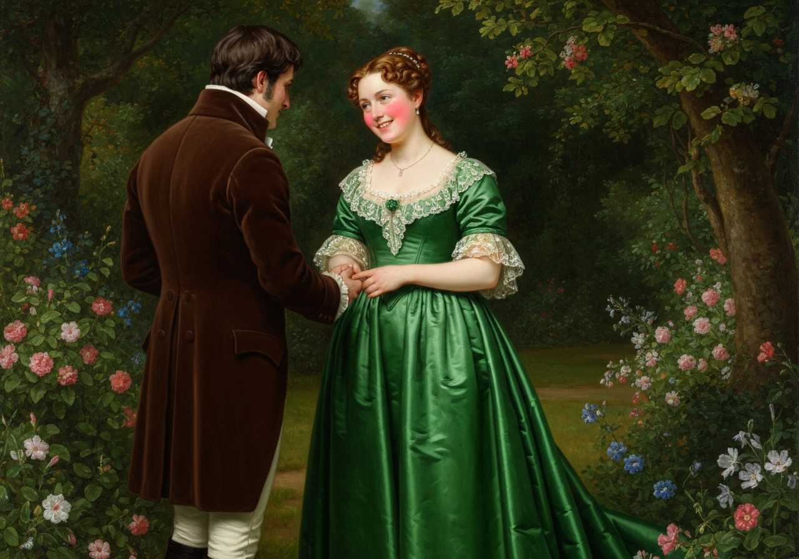
{/* metadata:I3:end */}

ch induced
you to take so much trouble, and bear so many mortifications, for the
sake of discovering them.”

“If you _will_ thank me,” he replied, “let it be for yourself alone.
{/* metadata:Q2:start */}
<Callout title="Memorable Quote" variant="note">If you will thank me, let it be for your

{/* metadata:A3:start */}
<Callout title="Analysis" variant="explanation">
Darcy's confession that his actions regarding Lydia were motivated primarily by his love for Elizabeth rather than family obligation reveals the depth of his devotion. He tells her plainly, 'I believe I thought only of you,' stripping away any pretence of disinterested benevolence. This moment dissolves the last remnant of Elizabeth's prejudice about his pride and selfishness, reframing his entire intervention as an act of love rather than condescension.
</Callout>
{/* metadata:A3:end */}

self alone. That the wish of giving happiness to you might add force to the other inducements which led me on, I shall not attempt to deny.</Callout>
{/* metadata:Q2:end */} But your
_family_ owe me nothing. Much as I respect them, I believe I thought
only of _you_.”

Elizabeth was too much embarrassed to say a word. After a short pause,
her companion added, “You are too generous to trifle with me. If your
feelings are still what they were last April, tell me so at once. {/* metadata:Q3:start */}
<Callout title="Memorable Quote" variant="note">My affections and wishes are unchanged; but one word from you will silence me on this subject for ever.</Callout>
{/* metadata:Q3:end */}

{/* metadata:A4:start */}
<Callout title="Analysis" variant="explanation">
Darcy's vulnerability in admitting his unchanged affections and offering Elizabeth the power to silence h

{/* metadata:I5:start */}
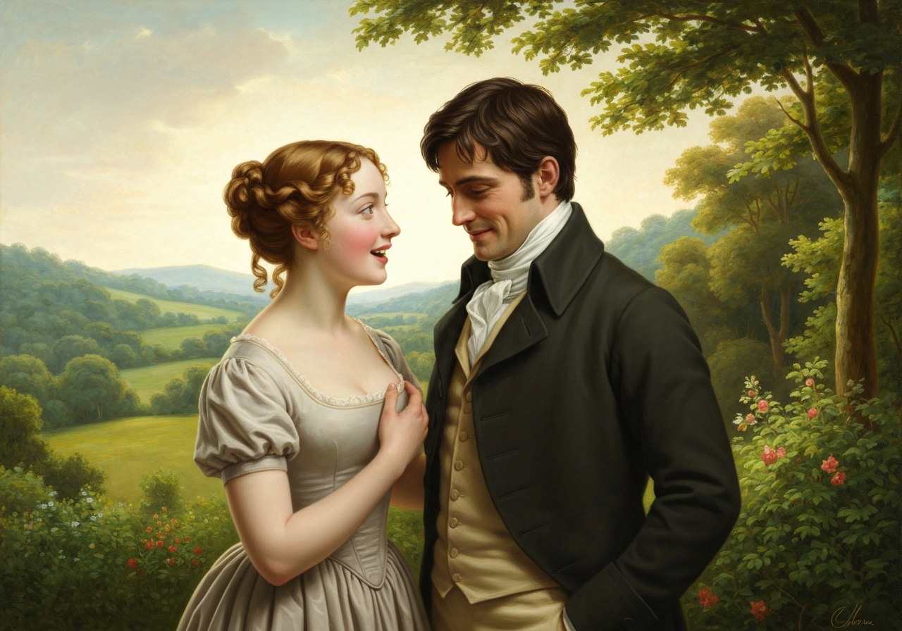

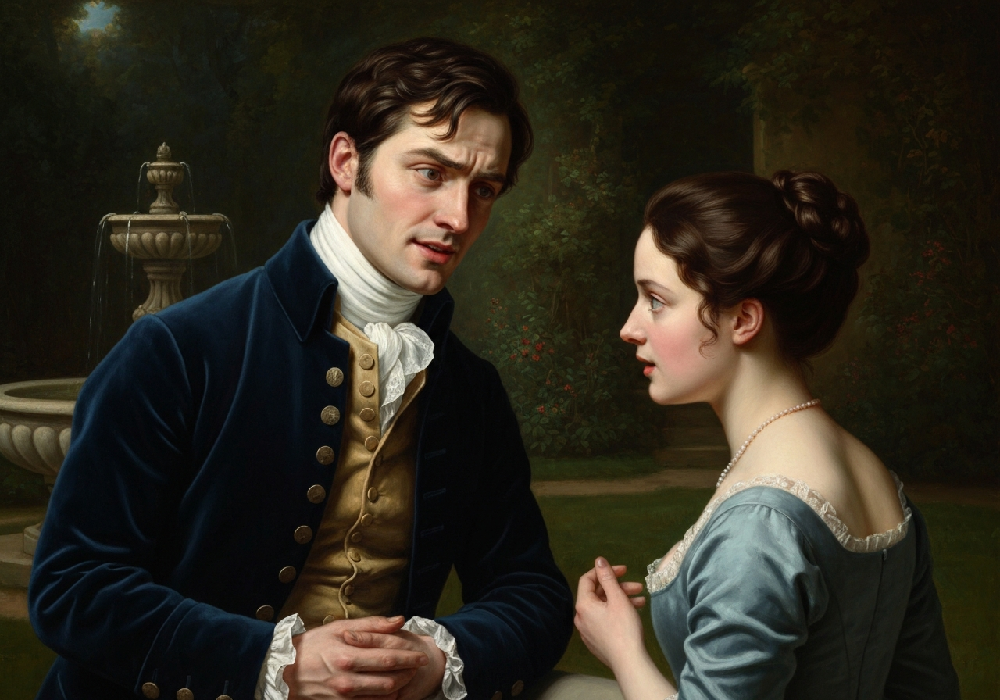
{/* metadata:I5:end */}

im forever demonstrates profound emotional maturity. His phrasing—'one word from you will silence me on this subject for ever'—places all authority in her hands, reversing the power dynamic of his first, imperious proposal. His willingness to risk rejection again shows how Elizabeth's earlier refusal has genuinely humbled him rather than merely wounded his vanity.
</Callout>
{/* metadata:A4:end */}

{/* metadata:I4:start */}
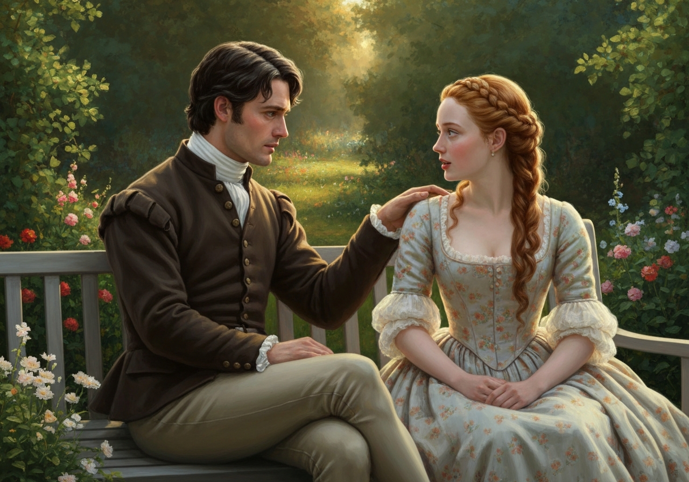

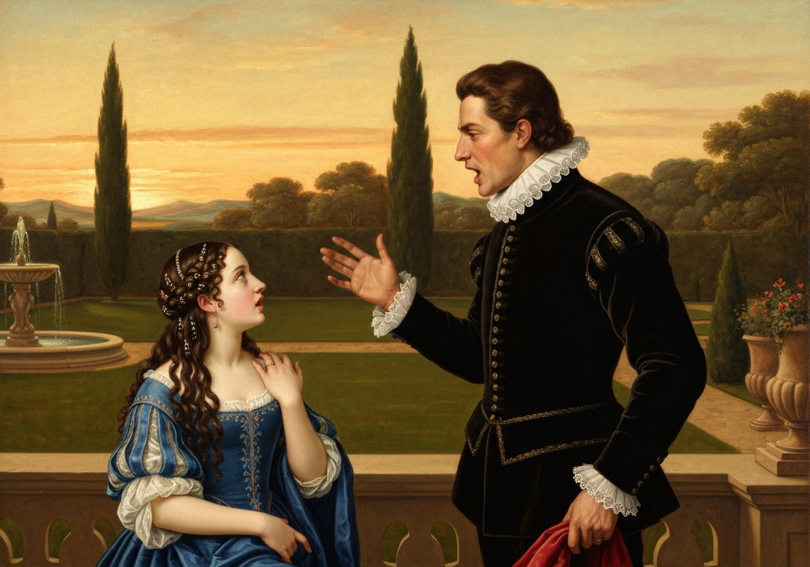
{/* metadata:I4:end */}

Elizabeth, feeling all the more than common awkwardness and anxiety of
his situation, now forced herself to speak; and immediately, though not
very fluently, gave him to understand that her sentiments had undergone
so material a change since the period to which he alluded, as to make
her receive with gratitude and pleasure his present assurances. The
happiness which this reply produced was such as he had probably never
felt before; and he expressed himself on the occasion as sensibly and as
warmly as a man violently in love can be supposed to do. Had Elizabeth
been able to encounter his eyes, she might have seen how well the
expression of heartfelt delight diffused over his face became him: but
though she could not look she could listen; and he told her of feelings
which, in proving of what importance she was to him, made his affection
every moment more valuable.

They walked on without knowing in what direction. There was too much to
be thought, and felt, and said, for attention to any other objects. She
soon learnt that they were indebted for their present good understanding
to the efforts of his aunt, who _did_ call on him in her return through
London, and there relate her journey to Longbourn, its motive, and the
substance of her conversation with Elizabeth; dwelling emphatically on
every expression of the latter, which, in her Ladyship’s apprehension,
peculiarly denoted her perverseness and assurance, in the belief that
such a relation must assist her endeavours to obtain that promise from
her nephew which _she_ had refused to give. But, unluckily for her
Ladyship, its effect had been exactly contrariwise.

“It taught me to hope,” said he, “as I had scarcely ever allowed myself
to hope before. I knew enough of your disposition to be certain, that
had you been absolutely, irrevocably decided against me, you would have
acknowledged it to Lady Catherine frankly and openly.”

Elizabeth coloured and laughed as she replied, “Yes, you know enough of
my _frankness_ to believe me capable of _that_. After abusing you so
abominably to your face, I could have no scruple in abusing you to all
your relations.”

“What did you say of me that I did not deserve? For though your
accusations were ill-founded, formed on mistaken premises, my behaviour
to you at the time had merited the severest reproof. It was
unpardonable. I cannot think of it without abhorrence.”

“We will not quarrel for the greater share of blame annexed to that
evening,” said Elizabeth. “The conduct of neither, if strictly
examined, will be irreproachable; but since then we have both, I hope,
improved in civility.”

“I cannot be so easily reconciled to myself. The recollection of what I
then said, of my conduct, my manners, my expressions during the whole of
it, is now, and has been many months, inexpressibly painful to me. Your
reproof, so well applied, I shall never forget: {/* metadata:Q6:start */}
<Callout title="Memorable Quote" variant="note">Had you behaved in a more gentlemanlike manner. Those were your words. You know not, you can scarcely conceive, how they have tortured me.</Callout>
{/* metadata:Q6:end */} though it was some time, I
confess, before I was reasonable enough to allow their justice.”

“I was certainly very far from expecting them to make so strong an
impression. I had not the smallest idea of their being ever felt in such
a way.”

“I can easily believe it. You thought me then devoid of every proper
feeling, I am sure you did. The turn of your countenance I shall never
forget, as you said that I could not have addressed you in any possible
way that would induce you to accept me.”

“Oh, do not repeat what I then said. These recollections will not do at
all. I assure you that I have long been most

{/* metadata:A5:start */}
<Callout title="Analysis" variant="explanation">
The discussion of Darcy's letter represents a crucial element of their reconciliation, as both characters revisit the painful document that first cracked Elizabeth's prejudice. Elizabeth urges that 'every unpleasant circumstance attending it ought to be forgotten,' offering a philosophy of selective memory as the foundation for their future happiness. Yet Darcy resists easy absolution, insisting that painful recollections have moral weight—a tension that reveals how differently each has processed their shared history.
</Callout>
{/* metadata:A5:end */}

 heartily ashamed of it.”

Darcy mentioned his letter. “Did it,” said he,--“did it _soon_ make you
think better of me? Did you, on reading it, give any credit to its
contents?”

She explained what its effects on her had been, and how gradually all
her former prejudices had been removed.

“I knew,” said he, “that what I wrote must give you pain, but it was
necessary. I hope you have destroyed the letter. There was one part,
especially the opening of it, which I should dread your having the power
of reading again. I can remember some expressions which might justly
make you hate me.”

“The letter shall certainly be burnt, if you believe it essential to the
preservation of my regard; but, though we have both reason to think my
opinions not entirely unalterable, they are not, I hope, quite so easily
changed as that implies.”

“When I wrote that letter,” replied Darcy, “I believed myself perfectly
calm and cool; but I am since convinced that it was written in a
dreadful bitterness of spirit.”

“The letter, perhaps, began in bitterness, but it did not end so. The
adieu is charity itself. But think no more of the letter. The feelings
of the person who wrote and the person who received it are now so widely
different from what they were then, that every unpleasant circumstance
attending it ought to be forgotten. You must learn some of my
philosophy. {/* metadata:Q5:start */}
<Callout title="Memorable Quote" variant="note">Think only of the past as its remembrance gives 

{/* metadata:A6:start */}
<Callout title="Analysis" variant="explanation">
Darcy's candid self-analysis reveals the depth of his transformation. His admission of being 'spoiled by my parents' and his acknowledgment that Elizabeth 'taught me a lesson, hard indeed at first, but most advantageous' demonstrates genuine character evolution rather than mere social adjustment. The speech is remarkable for its specificity: he traces his faults to their origin in childhood indulgence, showing that his reformation is grounded in genuine self-knowledge.
</Callout>
{/* metadata:A6:end */}

you pleasure.</Callout>
{/* metadata:Q5:end */}

{/* metadata:I6:start */}
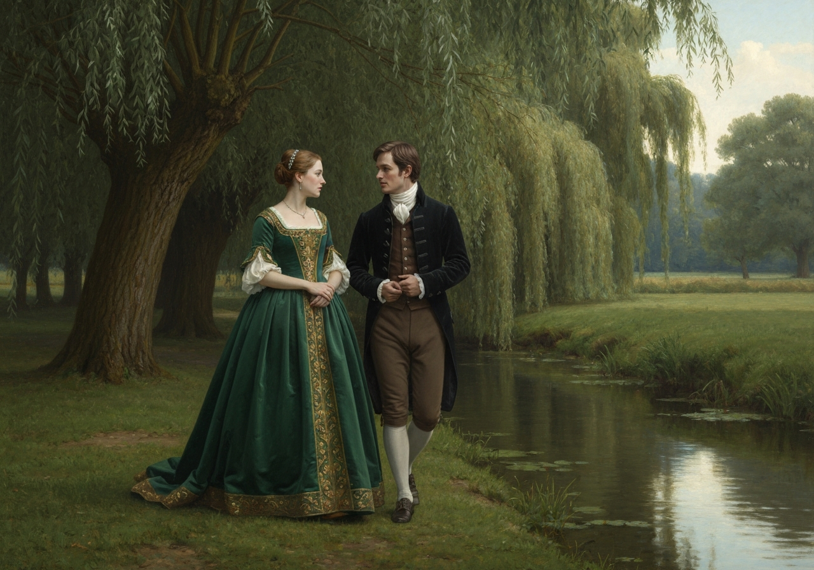

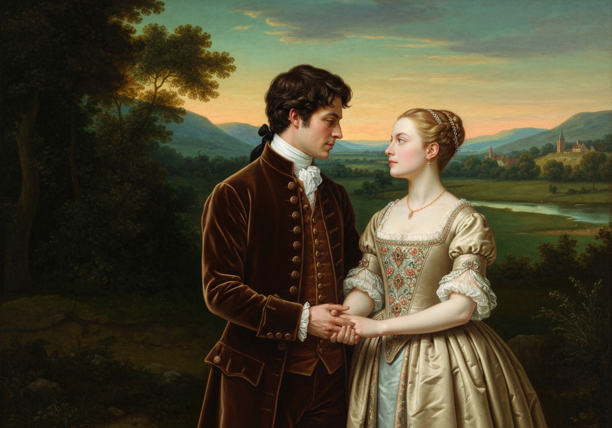
{/* metadata:I6:end */}

“I cannot give you credit for any philosophy of the kind. _Your_
retrospections must be so totally void of reproach, that the contentment
arising from them is not of philosophy, but, what is much better, of
ignorance. But with _me_, it is not so. Painful recollections will
intrude, which cannot, which ought not to be repelled. I have been a
selfish being all my life, in practice, though not in principle. As a
child I was taught what was _right_, but I was not taught to correct my
temper. I was given good principles, but left to follow them in pride
and conceit. Unfortunately an only son (for many years an only _child_),
I was spoiled by my parents, who, though good themselves, (my father
particularly, all that was benevolent and amiable,) allowed, encouraged,
almost taught me to be selfish and overbearing, to care for none beyond
my own family circle, to think meanly of all the rest of the world, to
_wish_ at least to think meanly of their sense and worth compared with
my own. Such I was, from eight to eight-and-twenty; and such I might
still have been but for you, dearest, loveliest Elizabeth! {/* metadata:Q4:start */}
<Callout title="Memorable Quote" variant="note">What do I not owe you! You taught me a lesson, hard indeed at first, but most advantageous. By you, I was properly humbled.</Callout>
{/* metadata:Q4:end */} I came to you without a
doubt of my reception. You showed me how insufficient were all my
pretensions to please a woman worthy of being pleased.”

“Had you then persuaded yourself that I should?”

“Indeed I had. What will you think of my vanity? I believed you to be
wishing, expecting my addresses.”

“My manners must have been in fault, but not intentionally, I assure
you. I never meant to deceive you, but my spirits might often lead me
wrong. How you must have hated me after _that_ evening!”

“Hate you! I was angry, perhaps, at first, but my anger soon began to
take a proper direction.”

“I am almost afraid of asking what you thought of me when we met at
Pemberley. You blamed me for coming?”

“No, indeed, I felt nothing but surprise.”

“Your surprise could not be greater than _mine_ in being noticed by you.
My conscience told me that I deserved no extraordinary politeness, and I
confess that I did not expect to receive _more_ than my due.”

“My object _then_,” replied Darcy, “was to show you, by every civility
in my power, that I was not so mean as to resent the past; and I hoped
to obtain your forgiveness, to lessen your ill opinion, by letting you
see that your reproofs had been attended to. How soon any other wishes
introduced themselves, I can hardly tell, but {/* metadata:Q7:start */}
<Callout title="Memorable Quote" variant="note">I believe in about half an hour after I had seen you.</Callout>
{/* metadata:Q7:end */}

He then told her of Georgiana’s delight in her acquaintance, and of her
disappointment at its sudden interruption; which naturally leading to
the cause of that interruption, she soon learnt that his resolution of
following her from Derbyshire in quest of her sister had been formed
before he quitted the inn, and that his gravity and thoughtfulness there
had arisen from no other struggles than what such a purpose must
comprehend.

She expressed her gratitude again, but it was too painful a subject to
each to be dwelt on farther.

After walking several miles in a leisurely manner, and too busy to know
anything about it, they found at last, on examining their watches, that
it was time to be at home.

“What could have become of Mr. Bingley and Jane?” was a wonder which
introduced the discussion of _their_ affairs. Darcy was delighted with
their engagement; his friend had given him the earliest information of
it.

“I must ask whether you were surprised?” said Elizabeth.

“Not at all. When I went away, I felt that it would soon happen.”

“That is to say, you had given your permission. I guessed as much.” And
though he exclaimed at the term, she found that it had been pretty much
the case.

“On the evening before my going to London,” said he, “I made a
conf

{/* metadata:A7:start */}
<Callout title="Analysis" variant="explanation">
The revelation that Darcy deliberately facilitated Bingley and Jane's reunion serves multiple narrative purposes: it explains his improved relations with Bingley, demonstrates his commitment to Elizabeth's happiness, and shows how he has learned from his past interference. By confessing to Bingley that his earlier meddling was 'absurd and impertinent,' Darcy performs the same act of honest self-reproach he has just offered Elizabeth. The chapter closes with the two couples' fates intertwined, and the simple line 'In the hall they parted' marks the end of their long walk toward mutual understanding.
</Callout>
{/* metadata:A7:end */}

{/* metadata:I7:start */}
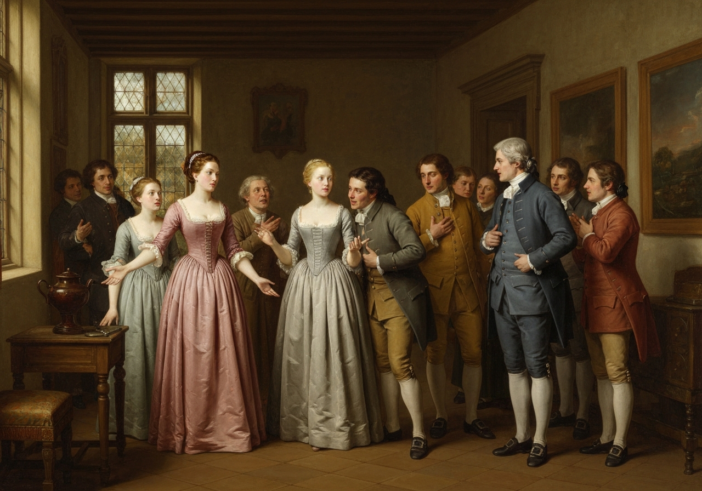

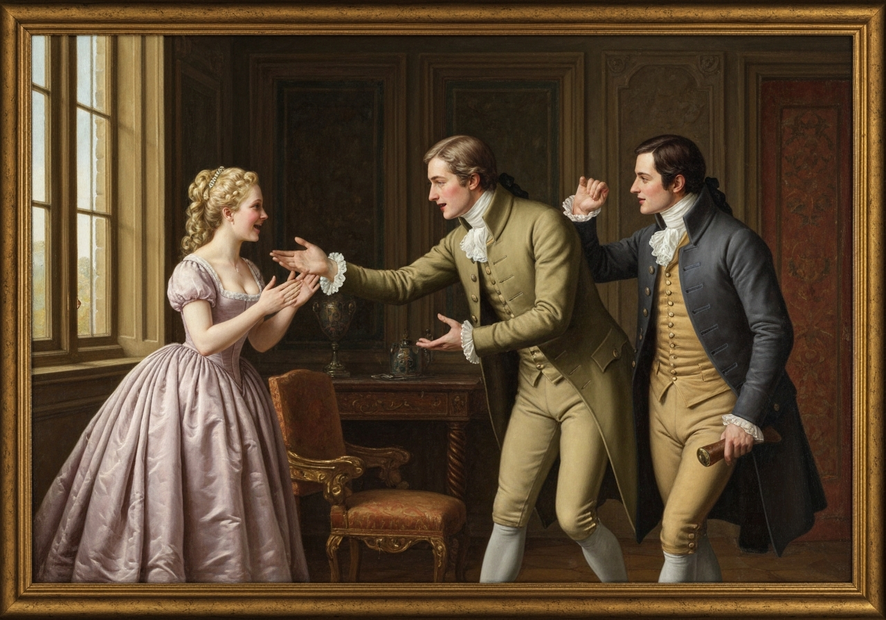
{/* metadata:I7:end */}

ession to him, which I believe I ought to have made long ago. I told
him of all that had occurred to make my former interference in his
affairs absurd and impertinent. His surprise was great. He had never had
the slightest suspicion. I told him, moreover, that I believed myself
mistaken in supposing, as I had done, that your sister was indifferent
to him; and as I could easily perceive that his attachment to her was
unabated, I felt no doubt of their happiness together.”

Elizabeth could not help smiling at his easy manner of directing his
friend.

“Did you speak from your own observation,” said she, “when you told him
that my sister loved him, or merely from my information last spring?”

“From the former. I had narrowly observed her, during the two visits
which I had lately made her here; and I was convinced of her affection.”

“And your assurance of it, I suppose, carried immediate conviction to
him.”

“It did. Bingley is most unaffectedly modest. His diffidence had
prevented his depending on his own judgment in so anxious a case, but
his reliance on mine made everything easy. I was obliged to confess one
thing, which for a time, and not unjustly, offended him. I could not
allow myself to conceal that your sister had been in town three months
last winter, that I had known it, and purposely kept it from him. He was
angry. But his anger, I am persuaded, lasted no longer than he remained
in any doubt of your sister’s sentiments. He has heartily forgiven me
now.”

Elizabeth longed to observe that Mr. Bingley had been a most delightful
friend; so easily guided that his worth was invaluable; but she checked
herself. She remembered that he had yet to learn to be laughed at, and
it was rather too early to begin. In anticipating the happiness of
Bingley, which of course was to be inferior only to his own, he
continued the conversation till they reached the house. In the hall they
parted.

[Illustration:

     “Unable to utter a syllable”

[_Copyright 1894 by George Allen._]]
