import Callout from '@/components/Callout.astro'

[Illustration]

The ladies of Longbourn soon waited on those of Netherfield.

{/* metadata:image-1:start */}
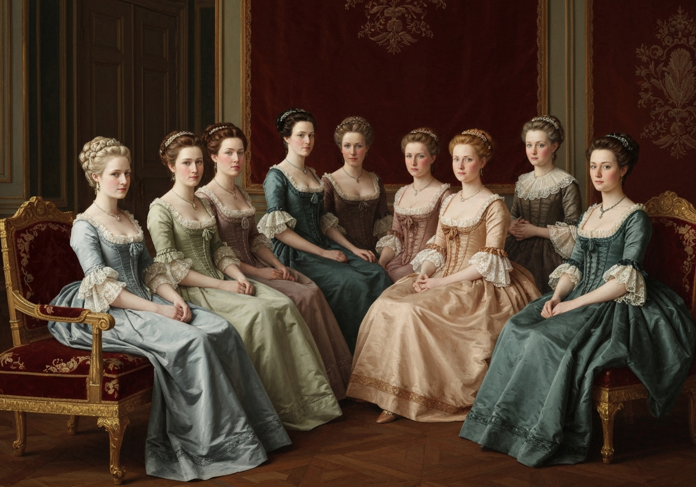

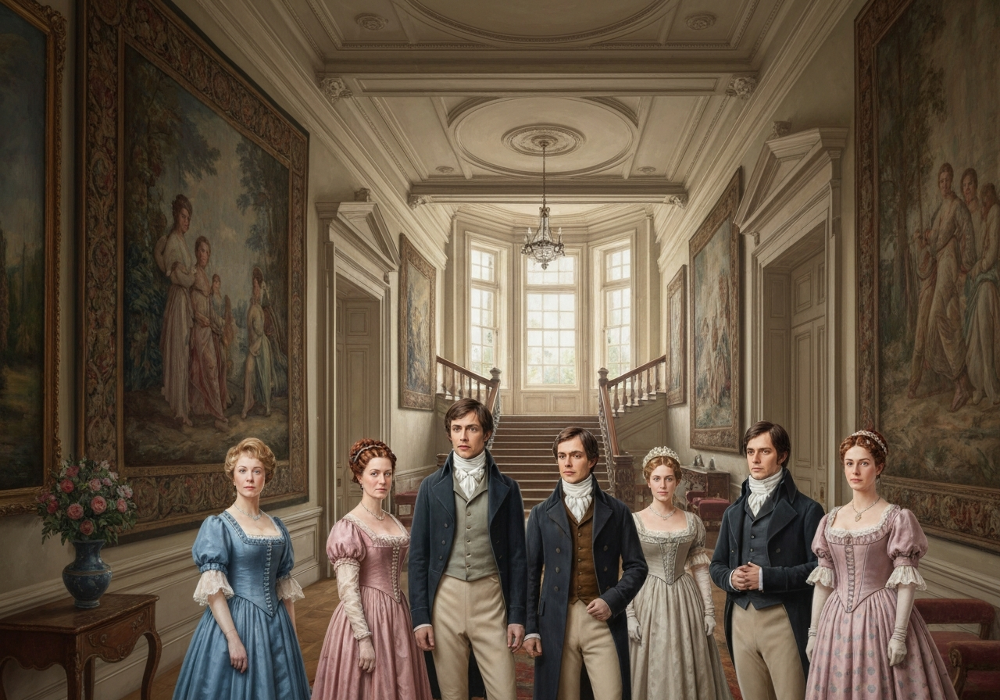
{/* metadata:image-1:end */}

 The visit
was returned in due form. Miss Bennet’s pleasing manners grew on the
good-will of Mrs. Hurst and Miss Bingley; and though the mother was
found to be intolerable, and the younger sisters not worth speaking to,
a wish of being better acquainted with _them_ was expressed towards the
two eldest. By Jane this attention was received with the greatest
pleasure; but Elizabeth still saw superciliousness in their treatment of
everybody, hardly excepting even her sister, and could not like them;
though their kindness to Jane, such as it was, had a value, as arising,
in all probability, from the influence of their brother’s admiration. It
was generally evident, whenever they met, that he _did_ admire her; and
to _her_ it was equally evident that Jane was yielding to the preference
which she had begun to entertain for him from the first, and was in a
way to be very much in love; but she considered with pleasure that it
was not likely to be discovered by the world in general, since Jane
united with great strength of feeling, a composure of temper and an
uniform cheerfulness of manner, which would guard her from the
suspicions of the impertinent. She mentioned this to her friend, Miss
Lucas.

{/* metadata:image-2:start */}
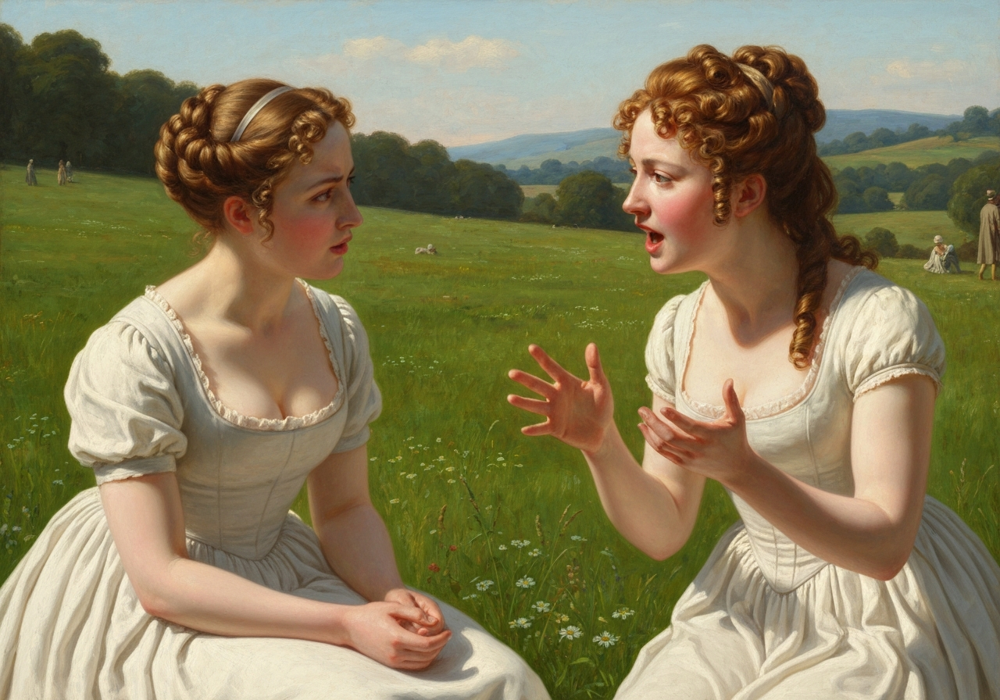

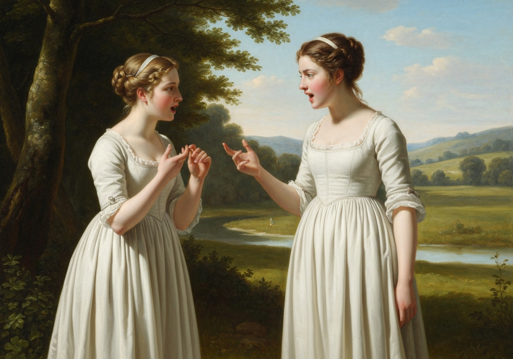
{/* metadata:image-2:end */}

{/* metadata:analysis-1:start */}
<Callout title="Analysis [1]" variant="explanation">
The social dance between the Bennets and the Bingleys begins in earnest. While Jane is warmly received, Elizabeth remains skeptical of the Bingley sisters' supercilious nature, highlighting the divide between genuine affection and social posturing.
</Callout>
{/* metadata:analysis-1:end */}

{/* metadata:quote-1:start */}
<Callout title="Memorable Quote" variant="note">It may, perhaps, be pleasant," replied Charlotte, "to be able to impose on the public in such a case; but it is sometimes a disadvantage to be so very guarded.</Callout>
{/* metadata:quote-1:end */} If a woman conceals her affection with the same skill
from the object of it, she may lose the opportunity of fixing him; and
it will then be but poor consolation to believe the world equally in the
dark. There is so much of gratitude or vanity in almost every
attachment, that it is not safe to leave any to itself. We can all
_begin_ freely--a slight preference is natural enough; but there are
very few of us who have heart enough to be really in love without
encouragement. In nine cases out of ten, a woman had better show _more_
affection than she feels. {/* metadata:quote-2:start */}
<Callout title="Memorable Quote" variant="note">Bingley likes your sister undoubtedly; but he may never do more than like her, if she does not help him on.</Callout>
{/* metadata:quote-2:end */}

{/* metadata:analysis-2:start */}
<Callout title="Analysis [2]" variant="explanation">
Charlotte's advice to Elizabeth reveals a starkly different view of marriage. She argues that a woman must show more affection than she feels to secure a husband, prioritizing social security over romantic character study.
</Callout>
{/* metadata:analysis-2:end */}

“But she does help him on, as much as her nature will allow. If _I_ can
perceive her regard for him, he must be a simpleton indeed not to
discover it too.”

“Remember, Eliza, that he does not know Jane’s disposition as you do.”

“But if a woman is partial to a man, and does not endeavor to conceal
it, he must find it out.”

{/* metadata:analysis-3:start */}
<Callout title="Analysis [3]" variant="explanation">
Elizabeth's confidence in Jane's guarded nature suggests that her feelings might remain hidden from Bingley. This introduces the risk of misunderstanding that Charlotte warns against, setting the stage for future complications.
</Callout>
{/* metadata:analysis-3:end */}

“Perhaps he must, if he sees enough of her. But though Bingley and Jane
meet tolerably often, it is never for many hours together; and as they
always see each other in large mixed parties, it is impossible that
every moment should be employed in conversing together. Jane should
therefore make the most of every half hour in which she can command his
attention. When she is secure of him, there will be leisure for falling
in love as much as she chooses.”

{/* metadata:image-3:start */}
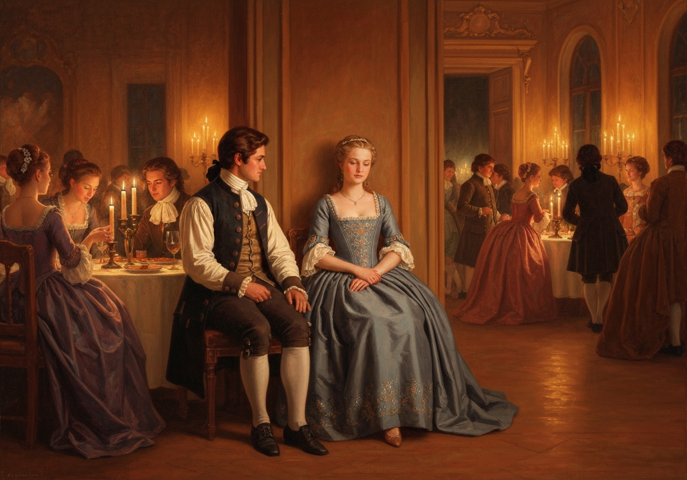

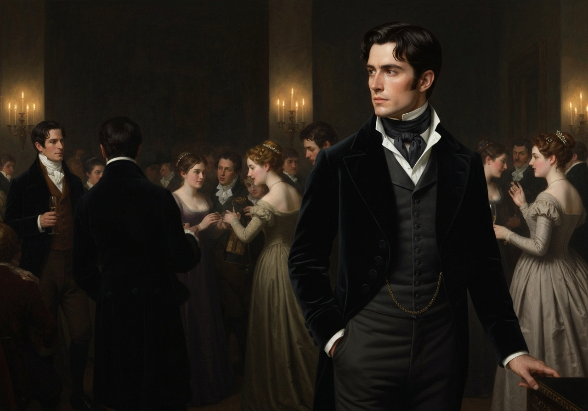
{/* metadata:image-3:end */}

“Your plan is a good one,” replied Elizabeth, “where nothing is in
question but the desire of being well married; and if I were determined
to get a rich husband, or any husband, I dare say I should adopt it. But
these are not Jane’s feelings; she is not acting by design. As yet she
cannot even be certain of the degree of her own regard, nor of its
reasonableness. She has known him only a fortnight. She danced four
dances with him at Meryton; she saw him one morning at his own house,
and has since dined in company with him four times. This is not quite
enough to make her understand his character.”

“Not as you represent it. Had she merely _dined_ with him, she might
only have discovered whether he had a good appetite; but you must
remember that four evenings have been also spent together--and four
evenings may do a great deal.”

“Yes: these four evenings have enabled them to ascertain that they both
like Vingt-un better than Commerce, but with respect to any other
leading characteristic, I do not imagine that much has been unfolded.”

“Well,” said Charlotte, “I wish Jane success with all my heart; and if
she were married to him to-morrow, I should think she had as good a
chance of happiness as if she were to be studying his character for a
twelvemonth. {/* metadata:quote-3:start */}
<Callout title="Memorable Quote" variant="note">Happiness in marriage is entirely a matter of chance.</Callout>
{/* metadata:quote-3:end */} {/* metadata:quote-4:start */}
<Callout title="Memorable Quote" variant="note">If the dispositions of the parties are ever so well known to each other, or ever so similar beforehand, it does not advance their felicity in the least.</Callout>
{/* metadata:quote-4:end */} They always continue to grow sufficiently unlike afterwards to
have their share of vexation; and it is better to know as little as
possible of the defects of the person with whom you are to pass your
life.”

{/* metadata:analysis-4:start */}
<Callout title="Analysis [4]" variant="explanation">
Charlotte's cynical (or perhaps realistic) take on marital happiness suggests that knowing a partner's character beforehand is no guarantee of felicity. This contrasts sharply with Elizabeth's more idealistic and intellectual approach to love.
</Callout>
{/* metadata:analysis-4:end */}

{/* metadata:quote-5:start */}
<Callout title="Memorable Quote" variant="note">You make me laugh, Charlotte; but it is not sound. You know it is not sound, and that you would never act in this way yourself.</Callout>
{/* metadata:quote-5:end */}

Occupied in observing Mr. Bingley’s attention to her sister, Elizabeth
was far from suspecting that she was herself becoming an object of some
interest in the eyes of his friend.

{/* metadata:image-4:start */}
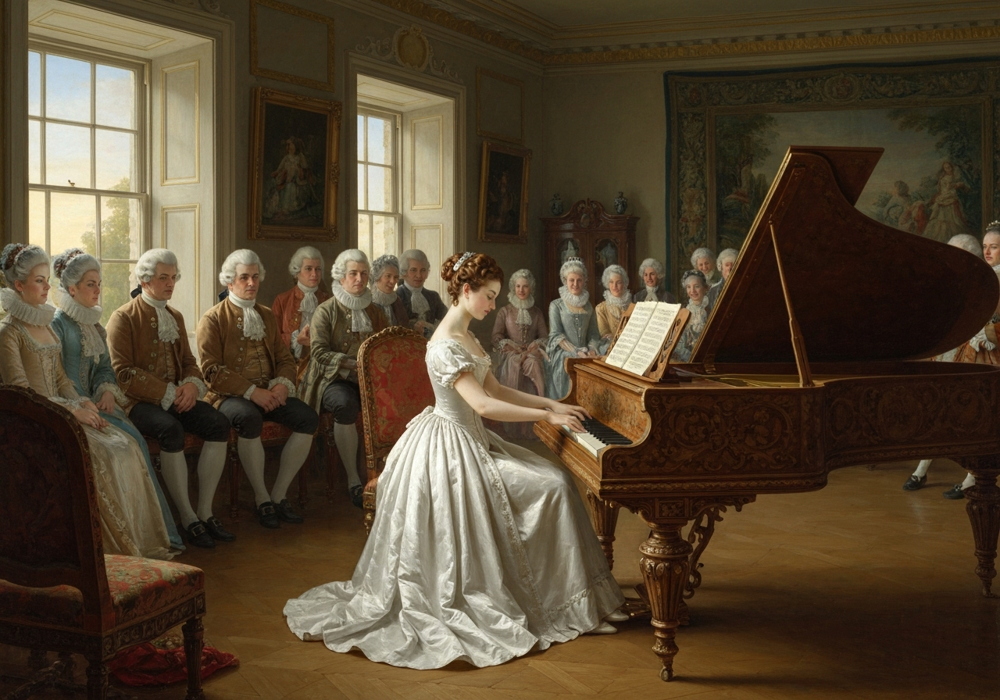

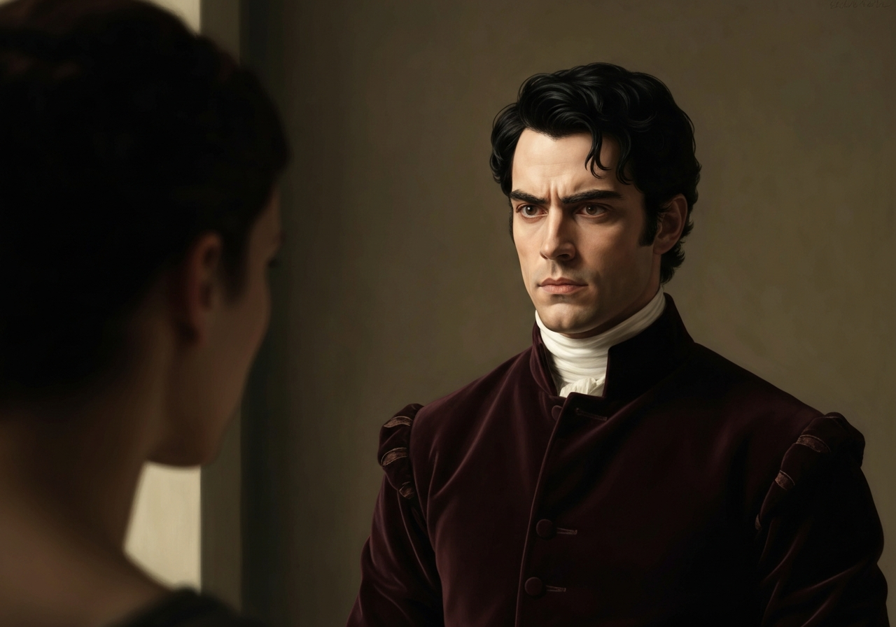
{/* metadata:image-4:end */}

 Mr. Darcy had at first scarcely
allowed her to be pretty: he had looked at her without admiration at the
ball; and when they next met, he looked at her only to criticise. But no
sooner had he made it clear to himself and his friends that she had
hardly a good feature in her face, than he began to find it was rendered
uncommonly intelligent by the beautiful expression of her dark eyes. To
this discovery succeeded some others equally mortifying. Though he had
detected with a critical eye more than one failure of perfect symmetry
in her form, he was forced to acknowledge her figure to be light and
pleasing; and in spite of his asserting that her manners were not those
of the fashionable world, he was caught by their easy playfulness. Of
this she was perfectly unaware: to her he was only the man who made
himself agreeable nowhere, and who had not thought her handsome enough
to dance with.

{/* metadata:image-5:start */}
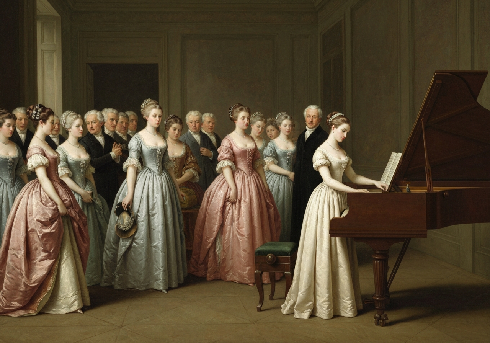

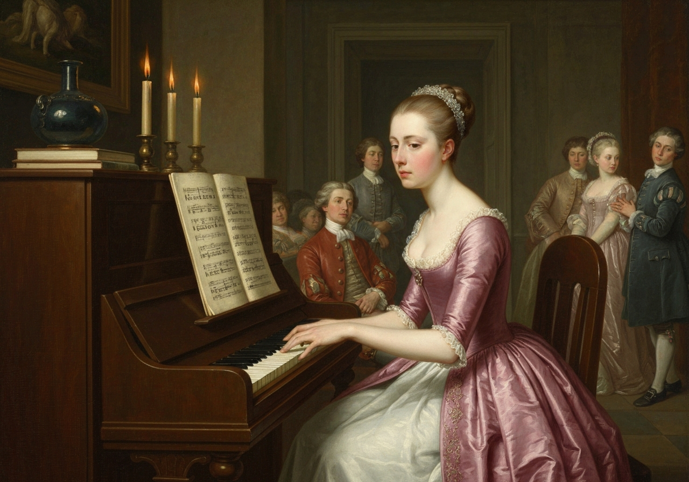
{/* metadata:image-5:end */}

{/* metadata:analysis-5:start */}
<Callout title="Analysis [5]" variant="explanation">
Initially dismissive of Elizabeth, Mr. Darcy finds himself unexpectedly drawn to her 'fine eyes' and the 'play of wit' in her countenance. This shift marks the beginning of his complex attraction to her, despite his prejudices.
</Callout>
{/* metadata:analysis-5:end */}

He began to wish to know more of her; and, as a step towards conversing
with her himself, attended to her conversation with others. His doing so
drew her notice. It was at Sir William Lucas’s, where a large party were
assembled.

“What does Mr. Darcy mean,” said she to Charlotte, “by listening to my
conversation with Colonel Forster?”

“That is a question which Mr. Darcy only can answer.”

“But if he does it any more, I shall certainly let him know that I see
what he is about. He has a very satirical eye, and if I do not begin by
being impertinent myself, I shall soon grow afraid of him.”

[Illustration: “The entreaties of several” [_Copyright 1894 by George
Allen._]]

On his approaching them soon afterwards, though without seeming to have
any intention of speaking, Miss Lucas defied her friend to mention such
a subject to him, which immediately provoking Elizabeth to do it, she
turned to him and said,--

“Did not you think, Mr. Darcy, that I expressed myself uncommonly well
just now, when I was teasing Colonel Forster to give us a ball at
Meryton?”

“With great energy; but it is a subject which always makes a lady
energetic.”

“You are severe on us.”

“It will be _her_ turn soon to be teased,” said Miss Lucas. “I am going
to open the instrument, Eliza, and you know what follows.”

“You are a very strange creature by way of a friend!--always wanting me
to play and sing before anybody and everybody! If my vanity had taken a
musical turn, you would have been invaluable; but as it is, I would
really rather not sit down before those who must be in the habit of
hearing the very best performers.” On Miss Lucas’s persevering, however,
she added, “Very well; if it must be so, it must.” And gravely glancing
at Mr. Darcy, “There is a very fine old saying, which everybody here is
of course familiar with--‘Keep your breath to cool your porridge,’--and
I shall keep mine to swell my song.”

Her performance was pleasing, though by no means capital. After a song
or two, and before she could reply to the entreaties of several that she
would sing again, she was eagerly succeeded at the instrument by her
sister Mary, who having, in consequence of being the only plain one in
the family, worked hard for knowledge and accomplishments, was always
impatient for display.

Mary had neither genius nor taste; and though vanity had given her
application, it had given her likewise a pedantic air and conceited
manner, which would have injured a higher degree of excellence than she
had reached. Elizabeth, easy and unaffected, had been listened to with
much more pleasure, though not playing half so well; and Mary, at the
end of a long concerto, was glad to purchase praise and gratitude by
Scotch and Irish airs, at the request of her younger sisters, who with
some of the Lucases, and two or three officers, joined eagerly in
dancing at one end of the room.

Mr. Darcy stood near them in silent indignation at such a mode of
passing the evening, to the exclusion of all conversation, and was too
much engrossed by his own thoughts to perceive that Sir William Lucas
was his neighbour, till Sir William thus began:--

“What a charming amusement for young people this is, Mr. Darcy! There is
nothing like dancing, after all. I consider it as one of the first
refinements of polished societies.”

“Certainly, sir; and it has the advantage also of being in vogue amongst
the less polished societies of the world: every savage can dance.”

Sir William only smiled. “Your friend performs delightfully,” he
continued, after a pause, on seeing Bingley join the group; “and I doubt
not that you are an adept in the science yourself, Mr. Darcy.”

“You saw me dance at Meryton, I believe, sir.”

“Yes, indeed, and received no inconsiderable pleasure from the sight. Do
you often dance at St. James’s?”

“Never, sir.”

“Do you not think it would be a proper compliment to the place?”

“It is a compliment which I never pay to any place if I can avoid it.”

“You have a house in town, I conclude?”

Mr. Darcy bowed.

“I had once some thoughts of fixing in town myself, for I am fond of
superior society; but I did not feel quite certain that the air of
London would agree with Lady Lucas.”

He paused in hopes of an answer: but his companion was not disposed to
make any; and Elizabeth at that instant moving towards them, he was
struck with the notion of doing a very gallant thing, and called out to
her,--

“My dear Miss Eliza, why are not you dancing? Mr. Darcy, you must allow
me to present this young lady to you as a very desirable partner. You
cannot refuse to dance, I am sure, when so much beauty is before you.”
And, taking her hand, he would have given it to Mr. Darcy, who, though
extremely surprised, was not unwilling to receive it, when she instantly
drew back, and said with some discomposure to Sir William,--

“Indeed, sir, I have not the least intention of dancing. I entreat you
not to suppose that I moved this way in order to beg for a partner.”

Mr. Darcy, with grave propriety, requested to be allowed the honour of
her hand, but in vain.

{/* metadata:image-6:start */}
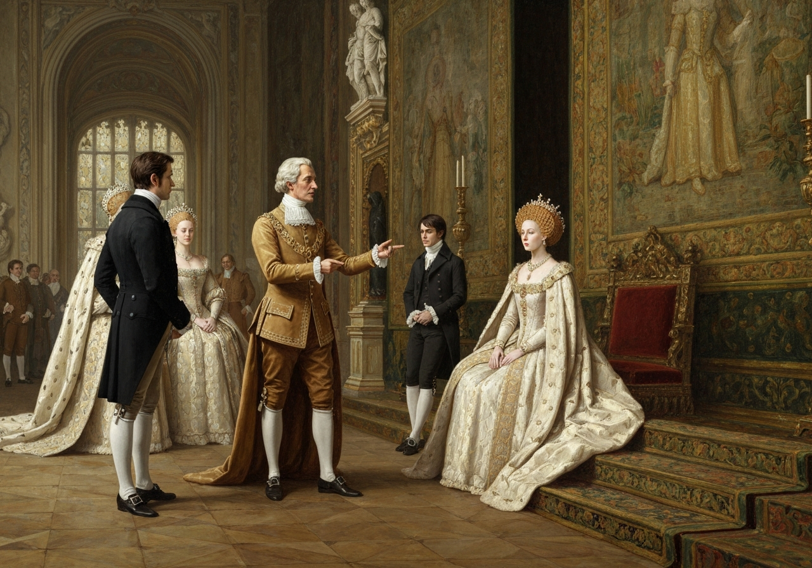

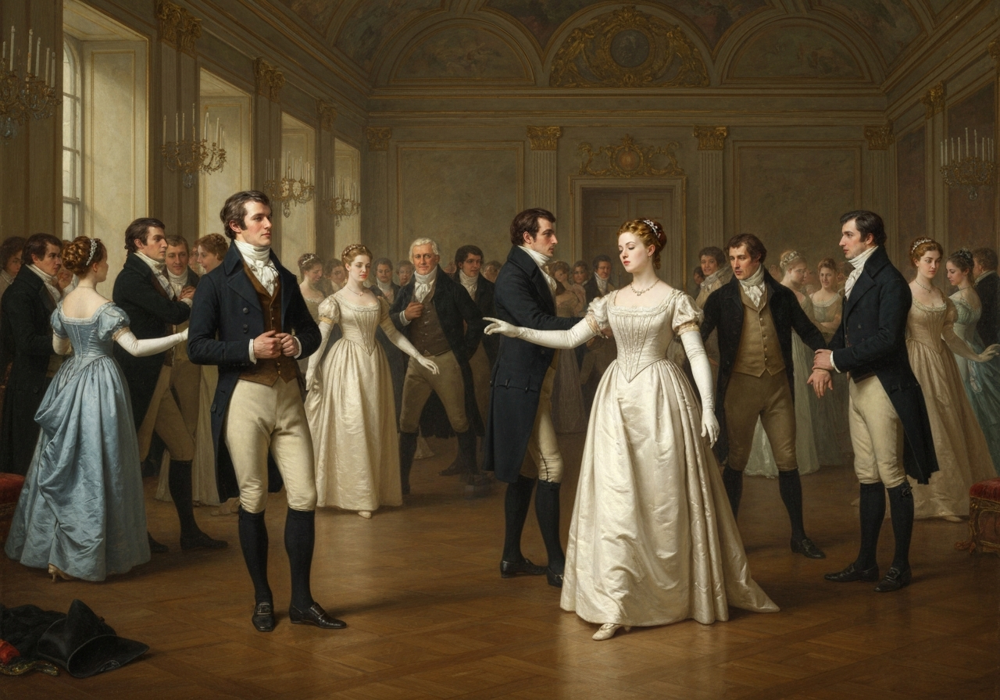
{/* metadata:image-6:end */}

{/* metadata:analysis-6:start */}
<Callout title="Analysis [6]" variant="explanation">
Sir William's attempts to bring Darcy and Elizabeth together through dance highlight the constant social pressure of the Meryton circle. Darcy's refusal to dance, and Elizabeth's witty rejection of the offer, further define their early dynamic.
</Callout>
{/* metadata:analysis-6:end */}

 Elizabeth was determined; nor did Sir William at
all shake her purpose by his attempt at persuasion.

“You excel so much in the dance, Miss Eliza, that it is cruel to deny me
the happiness of seeing you; and though this gentleman dislikes the
amusement in general, he can have no objection, I am sure, to oblige us
for one half hour.”

“Mr. Darcy is all politeness,” said Elizabeth, smiling.

“He is, indeed: but considering the inducement, my dear Miss Eliza, we
cannot wonder at his complaisance; for who would object to such a
partner?”

Elizabeth looked archly, and turned away. Her resistance had not injured
her with the gentleman, and he was thinking of her with some
complacency, when thus accosted by Miss Bingley,--

“I can guess the subject of your reverie.”

“I should imagine not.”

“You are considering how insupportable it would be to pass many
evenings in this manner,--in such society; and, indeed, I am quite of
your opinion. I was never more annoyed! The insipidity, and yet the
noise--the nothingness, and yet the self-importance, of all these
people! What would I give to hear your strictures on them!”

“Your conjecture is totally wrong, I assure you. My mind was more
agreeably engaged. I have been meditating on the very great pleasure
which a pair of fine eyes in the face of a pretty woman can bestow.”

Miss Bingley immediately fixed her eyes on his face, and desired he
would tell her what lady had the credit of inspiring such reflections.
Mr. Darcy replied, with great intrepidity,--

“Miss Elizabeth Bennet.”

{/* metadata:quote-6:start */}
<Callout title="Memorable Quote" variant="note">I am all astonishment. How long has she been such a favourite?--and pray, when am I to wish you joy?</Callout>
{/* metadata:quote-6:end */}

{/* metadata:quote-7:start */}
<Callout title="Memorable Quote" variant="note">A lady's imagination is very rapid; it jumps from admiration to love, from love to matrimony, in a moment.</Callout>
{/* metadata:quote-7:end */}

“Nay, if you are so serious about it, I shall consider the matter as
absolutely settled. You will have a charming mother-in-law, indeed, and
of course she will be always at Pemberley with you.”

He listened to her with perfect indifference, while she chose to
entertain herself in this manner; and as his composure convinced her
that all was safe, her wit flowed along.

{/* metadata:image-7:start */}
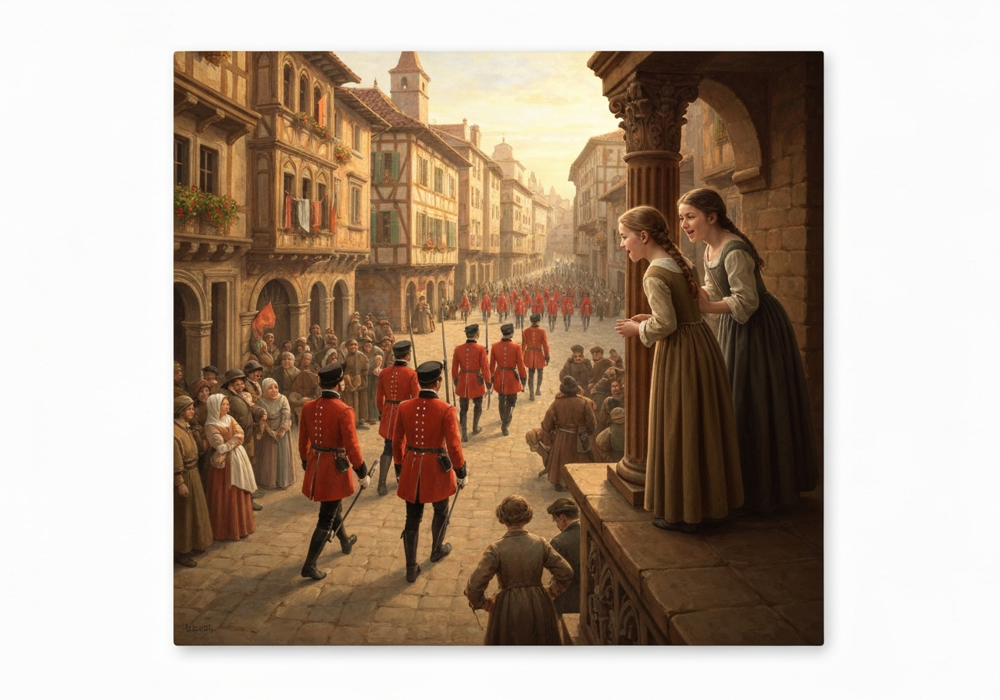

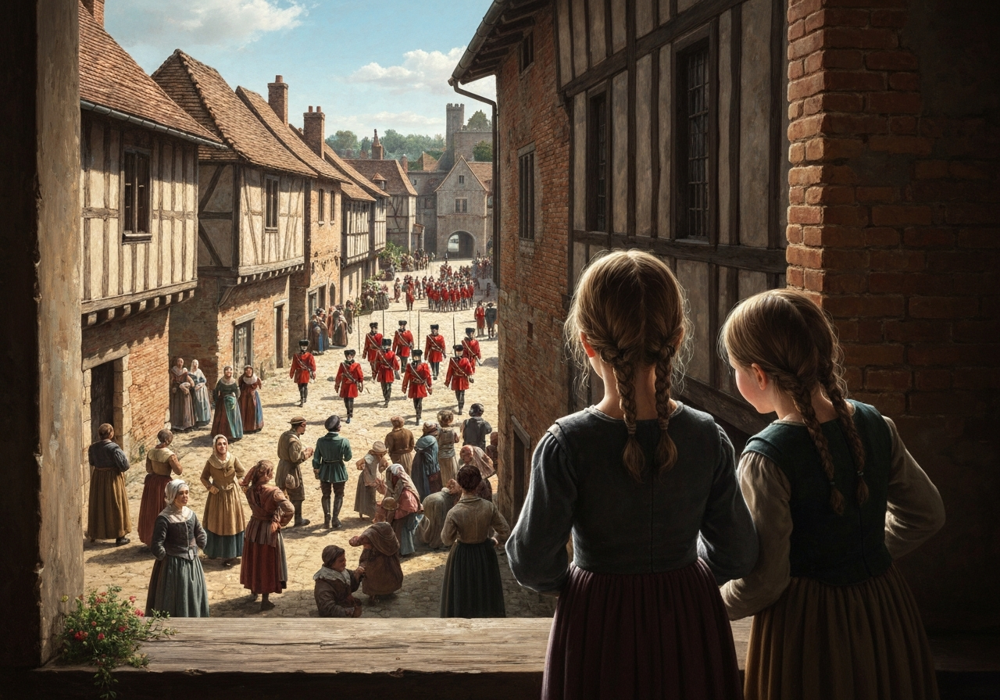
{/* metadata:image-7:end */}

{/* metadata:analysis-7:start */}
<Callout title="Analysis [7]" variant="explanation">
The arrival of the militia in Meryton, and the younger Bennet sisters' obsession with the officers, introduces a layer of frivolous social distraction that contrasts with the more serious romantic developments between the elder sisters and their suitors.
</Callout>
{/* metadata:analysis-7:end */}

[Illustration:

     “A note for Miss Bennet”

[_Copyright 1894 by George Allen._]]
