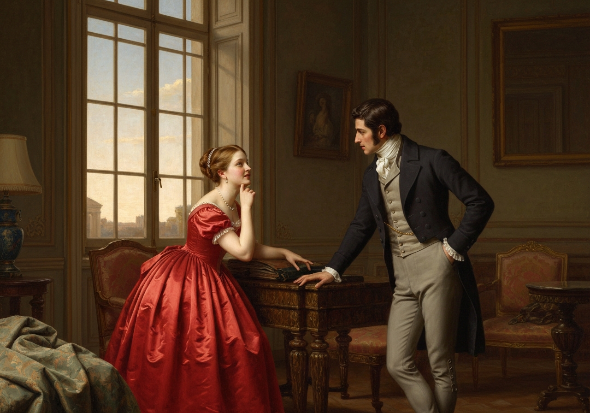
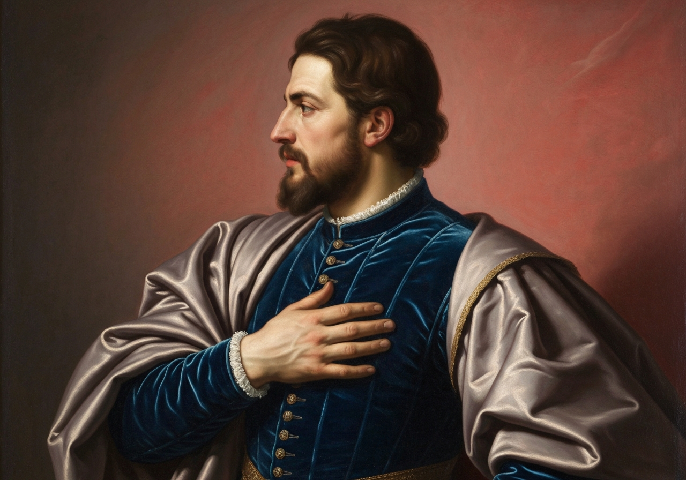
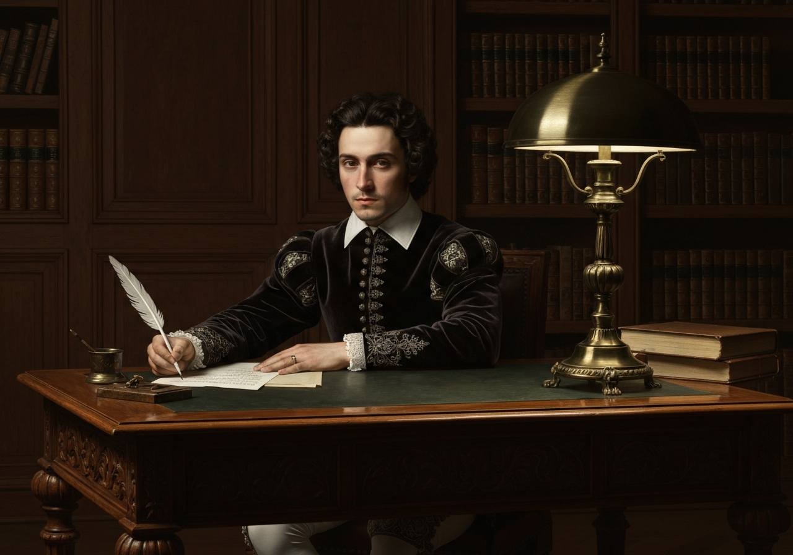
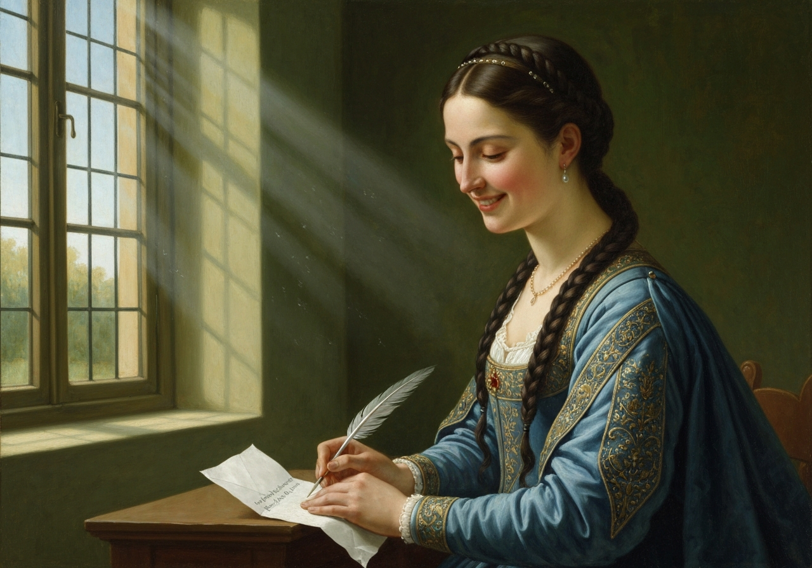
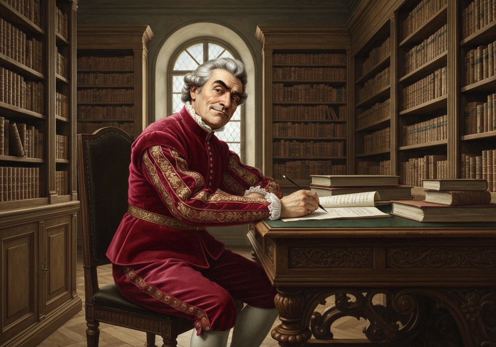
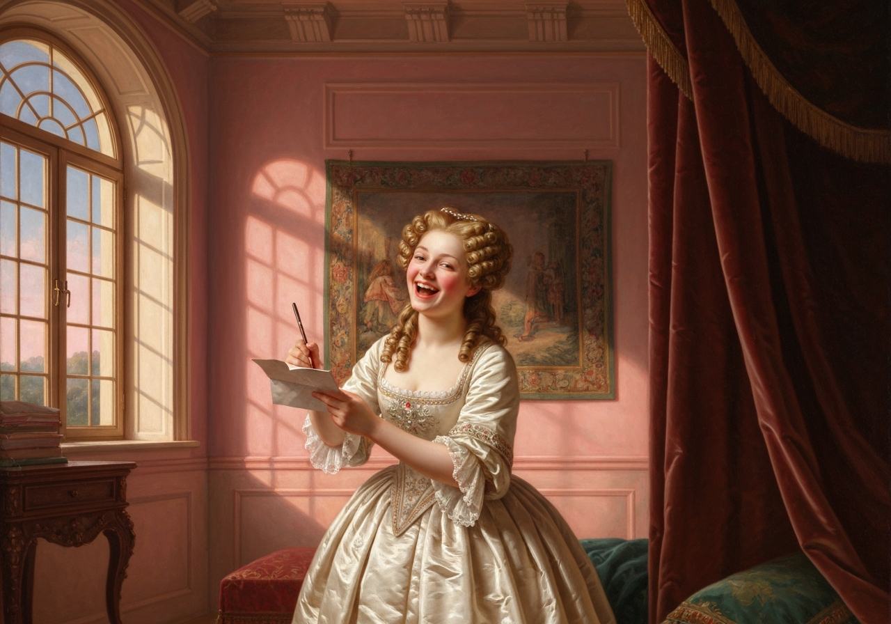
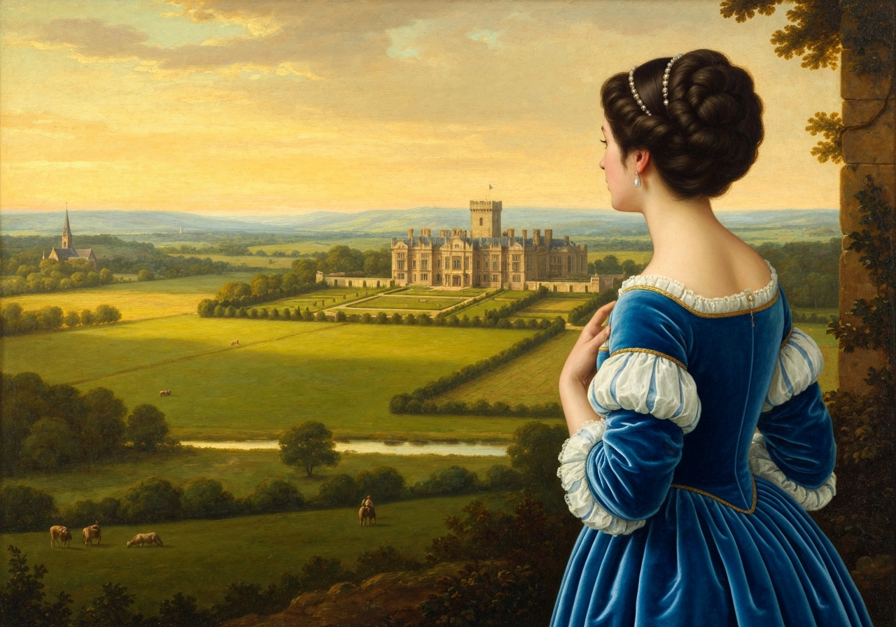

import Callout from '@/components/Callout.astro'

Elizabeth’s spirits soon rising to playfulness again, she wanted Mr.
Darcy to account for his having ever fallen in love with her. “How could
you begin?” said she. “I can comprehend your going on charmingly, when
you had once made a beginning; but what could set you off in the first
place?”

{/* metadata:analysis_001:start */}
<Callout title="Analysis" variant="explanation">
Elizabeth's playful inquiry into what first attracted Darcy to her is one of the novel's most revealing exchanges. Her question—'How could you begin?'—signals a new freedom in their relationship, one in which she can tease without cruelty and he can confess without pride. The scene demonstrates how their engagement has transformed mutual antagonism into genuine intimacy, allowing both characters to revisit their shared history with warmth rather than defensiveness.
</Callout>
{/* metadata:analysis_001:end */}

{/* metadata:image_001:start */}

{/* metadata:image_001:end */}

“I cannot fix on the hour, or the spot, or the look, or the words, which
laid the foundation. It is too long ago.

{/* metadata:quote_001:start */}
<Callout title="Memorable Quote" variant="note">I was in the middle before I knew that I _had_ begun.”</Callout>
{/* metadata:quote_001:end */}

{/* metadata:analysis_002:start */}
<Callout title="Analysis" variant="explanation">
Darcy's admission that he cannot fix on 'the hour, or the spot, or the look, or the words' that laid the foundation of his love is among the most psychologically honest moments in the novel. His confession that 'I was in the middle before I knew that I had begun' suggests that love, for him, was not a deliberate choice but an imperceptible accumulation. This stands in sharp contrast to his earlier pride and rationalism, marking the depth of his transformation.
</Callout>
{/* metadata:analysis_002:end */}

{/* metadata:image_002:start */}

{/* metadata:image_002:end */}

“My beauty you had early withstood, and as for my manners--my behaviour
to _you_ was at least always bordering on the uncivil, and I never spoke
to you without rather wishing to give you pain than not. Now, be
sincere; did you admire me for my impertinence?”

{/* metadata:quote_002:start */}
<Callout title="Memorable Quote" variant="note">“For the liveliness of your mind I did.”</Callout>
{/* metadata:quote_002:end */}

“You may as well call it impertinence at once. It was very little less.
The fact is, that you were sick of civility, of deference, of officious
attention. You were disgusted with the women who were always speaking,
and looking, and thinking for _your_ approbation alone. I roused and
interested you, because I was so unlike _them_. Had you not been really
amiable you would have hated me for it: but in spite of the pains you
took to disguise yourself, your feelings were always noble and just; and
in your heart you thoroughly despised the persons who so assiduously
courted you. There--I have saved you the trouble of accounting for it;
and really, all things considered, I begin to think it perfectly
reasonable.

{/* metadata:quote_003:start */}
<Callout title="Memorable Quote" variant="note">To be sure you know no actual good of me--but nobody thinks of _that_ when they fall in love.”</Callout>
{/* metadata:quote_003:end */}

{/* metadata:analysis_003:start */}
<Callout title="Analysis" variant="explanation">
Elizabeth's theory that Darcy was 'sick of civility, of deference, of officious attention' is a brilliant piece of social analysis delivered with characteristic wit. She identifies the mechanism of his attraction—her difference from the women who courted his approval—and frames it as a compliment to his underlying character. Her conclusion, 'To be sure you know no actual good of me—but nobody thinks of that when they fall in love,' is both self-deprecating and philosophically astute, acknowledging the irrational nature of romantic attachment.
</Callout>
{/* metadata:analysis_003:end */}

“Was there no good in your affectionate behaviour to Jane, while she was
ill at Netherfield?”

“Dearest Jane! who could have done less for her? But make a virtue of it
by all means. My good qualities are under your protection, and you are
to exaggerate them as much as possible; and, in return, it belongs to me
to find occasions for teasing and quarrelling with you as often as may
be; and I shall begin directly, by asking you what made you so unwilling
to come to the point at last? What made you so shy of me, when you
first called, and afterwards dined here? Why, especially, when you
called, did you look as if you did not care about me?”

“Because you were grave and silent, and gave me no encouragement.”

“But I was embarrassed.”

“And so was I.”

“You might have talked to me more when you came to dinner.”

“A man who had felt less might.”

“How unlucky that you should have a reasonable answer to give, and that
I should be so reasonable as to admit it! But I wonder how long you
_would_ have gone on, if you had been left to yourself. I wonder when
you _would_ have spoken if I had not asked you! My resolution of
thanking you for your kindness to Lydia had certainly great effect. _Too
much_, I am afraid; for what becomes of the moral, if our comfort
springs from a breach of promise, for I ought not to have mentioned the
subject? This will never do.”

“You need not distress yourself. The moral will be perfectly fair. Lady
Catherine’s unjustifiable endeavours to separate us were the means of
removing all my doubts. I am not indebted for my present happiness to
your eager desire of expressing your gratitude. I was not in a humour to
wait for an opening of yours. My aunt’s intelligence had given me hope,
and I was determined at once to know everything.”

{/* metadata:quote_004:start */}
<Callout title="Memorable Quote" variant="note">“Lady Catherine has been of infinite use, which ought to make her happy, for she loves to be of use. But tell me, what did you come down to Netherfield for? Was it merely to ride to Longbourn and be embarrassed? or had you intended any more serious consequences?”</Callout>
{/* metadata:quote_004:end */}

{/* metadata:analysis_004:start */}
<Callout title="Analysis" variant="explanation">
The irony of Lady Catherine's role in the lovers' union is savored by Elizabeth with characteristic wit. Darcy confirms that his aunt's 'unjustifiable endeavours to separate us were the means of removing all my doubts,' making her interference the very catalyst that secured the engagement. Elizabeth's observation that 'Lady Catherine has been of infinite use, which ought to make her happy, for she loves to be of use' transforms an act of hostility into a comic gift, underscoring Austen's mastery of ironic reversal.
</Callout>
{/* metadata:analysis_004:end */}

“My real purpose was to see _you_, and to judge, if I could, whether I
might ever hope to make you love me. My avowed one, or what I avowed to
myself, was to see whether your sister was still partial to Bingley, and
if she were, to make the confession to him which I have since made.”

{/* metadata:analysis_005:start */}
<Callout title="Analysis" variant="explanation">
Darcy's disclosure that his real purpose in coming to Netherfield was 'to see you, and to judge, if I could, whether I might ever hope to make you love me' reveals the vulnerability beneath his composed exterior. His secondary avowed purpose—to assess Jane's feelings for Bingley—demonstrates that his sense of responsibility toward his friend persisted even as his own romantic hopes were uncertain. The dual motivation shows a man capable of holding private longing and social duty simultaneously, a mark of genuine moral growth.
</Callout>
{/* metadata:analysis_005:end */}

“Shall you ever have courage to announce to Lady Catherine what is to
befall her?”

“I am more likely to want time than courage, Elizabeth. But it ought to
be done; and if you will give me a sheet of paper it shall be done
directly.”

{/* metadata:image_003:start */}

{/* metadata:image_003:end */}

“And if I had not a letter to write myself, I might sit by you, and
admire the evenness of your writing, as another young lady once did. But
I have an aunt, too, who must not be longer neglected.”

From an unwillingness to confess how much her intimacy with Mr. Darcy
had been overrated, Elizabeth had never yet answered Mrs. Gardiner’s
long letter; but now, having _that_ to communicate which she knew would
be most welcome, she was almost ashamed to find that her uncle and aunt
had already lost three days of happiness, and immediately wrote as
follows:--

“I would have thanked you before, my dear aunt, as I ought to have done,
for your long, kind, satisfactory detail of particulars; but, to say the
truth, I was too cross to write. You supposed more than really existed.
But _now_ suppose as much as you choose; give a loose to your fancy,
indulge your imagination in every possible flight which the subject will
afford, and unless you believe me actually married, you cannot greatly
err. You must write again very soon, and praise him a great deal more
than you did in your last. I thank you again and again, for not going to
the Lakes. How could I be so silly as to wish it! Your idea of the
ponies is delightful. We will go round the park every day.

{/* metadata:quote_005:start */}
<Callout title="Memorable Quote" variant="note">I am the happiest creature in the world. Perhaps other people have said so before, but no one with such justice.</Callout>
{/* metadata:quote_005:end */}

I am happier even than Jane; she
only smiles, I laugh. Mr. Darcy sends you all the love in the world that
can be spared from me. You are all to come to Pemberley at Christmas.
Yours,” etc.

{/* metadata:image_004:start */}

{/* metadata:image_004:end */}

Mr. Darcy’s letter to Lady Catherine was in a different style, and still
different from either was what Mr. Bennet sent to Mr. Collins, in return
for his last.

     /* “Dear Sir, */

     “I must trouble you once more for congratulations. Elizabeth will
     soon be the wife of Mr. Darcy.

{/* metadata:quote_006:start */}
<Callout title="Memorable Quote" variant="note">Console Lady Catherine as well as you can. But, if I were you, I would stand by the nephew. He has more to give.</Callout>
{/* metadata:quote_006:end */}

“Yours sincerely,” etc.

{/* metadata:image_005:start */}

{/* metadata:image_005:end */}

Miss Bingley’s congratulations to her brother on his approaching
marriage were all that was affectionate and insincere. She wrote even to
Jane on the occasion, to express her delight, and repeat all her former
professions of regard. Jane was not deceived, but she was affected; and
though feeling no reliance on her, could not help writing her a much
kinder answer than she knew was deserved.

The joy which Miss Darcy expressed on receiving similar information was
as sincere as her brother’s in sending it. Four sides of paper were
insufficient to contain all her delight, and all her earnest desire of
being loved by her sister.

{/* metadata:image_006:start */}

{/* metadata:image_006:end */}

{/* metadata:analysis_006:start */}
<Callout title="Analysis" variant="explanation">
The chapter's survey of congratulatory letters offers a precise social taxonomy of sincerity. Miss Bingley's congratulations are described as 'all that was affectionate and insincere,' while Georgiana's joy fills four sides of paper with earnest desire to be loved by her new sister. The contrast is pointed: Austen uses the epistolary form not merely as plot mechanism but as a moral register, distinguishing those who feel from those who merely perform feeling.
</Callout>
{/* metadata:analysis_006:end */}

Before any answer could arrive from Mr. Collins, or any congratulations
to Elizabeth from his wife, the Longbourn family heard that the
Collinses were come themselves to Lucas Lodge. The reason of this
sudden removal was soon evident. Lady Catherine had been rendered so
exceedingly angry by the contents of her nephew’s letter, that
Charlotte, really rejoicing in the match, was anxious to get away till
the storm was blown over. At such a moment, the arrival of her friend
was a sincere pleasure to Elizabeth, though in the course of their
meetings she must sometimes think the pleasure dearly bought, when she
saw Mr. Darcy exposed to all the parading and obsequious civility of her
husband. He bore it, however, with admirable calmness. He could even
listen to Sir William Lucas, when he complimented him on carrying away
the brightest jewel of the country, and expressed his hopes of their all
meeting frequently at St. James’s, with very decent composure. If he did
shrug his shoulders, it was not till Sir William was out of sight.

Mrs. Philips’s vulgarity was another, and, perhaps, a greater tax on his
forbearance; and though Mrs. Philips, as well as her sister, stood in
too much awe of him to speak with the familiarity which Bingley’s
good-humour encouraged; yet, whenever she _did_ speak, she must be
vulgar. Nor was her respect for him, though it made her more quiet, at
all likely to make her more elegant. Elizabeth did all she could to
shield him from the frequent notice of either, and was ever anxious to
keep him to herself, and to those of her family with whom he might
converse without mortification; and

{/* metadata:quote_007:start */}
<Callout title="Memorable Quote" variant="note">though the uncomfortable feelings arising from all this took from the season of courtship much of its pleasure, it added to the hope of the future; and she looked forward with delight to the time when they should be removed from society so little pleasing to either, to all the comfort and elegance of their family party at Pemberley.</Callout>
{/* metadata:quote_007:end */}

{/* metadata:analysis_007:start */}
<Callout title="Analysis" variant="explanation">
The chapter's closing reflection on the 'uncomfortable feelings arising from all this' social exposure is quietly profound. Elizabeth endures the vulgarity of Mrs. Philips and the obsequious flattery of Sir William Lucas on Darcy's behalf, shielding him as best she can. The narrator's observation that these discomforts 'added to the hope of the future' transforms present embarrassment into anticipatory pleasure, and the vision of 'all the comfort and elegance of their family party at Pemberley' becomes the chapter's emotional destination.
</Callout>
{/* metadata:analysis_007:end */}

{/* metadata:image_007:start */}

{/* metadata:image_007:end */}
