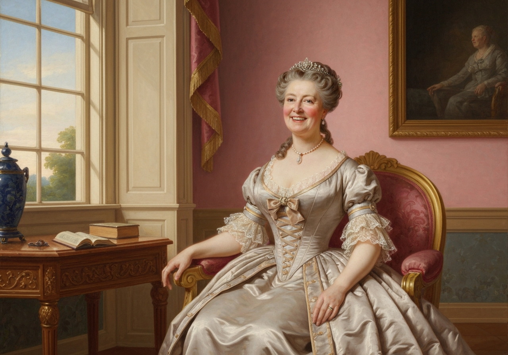
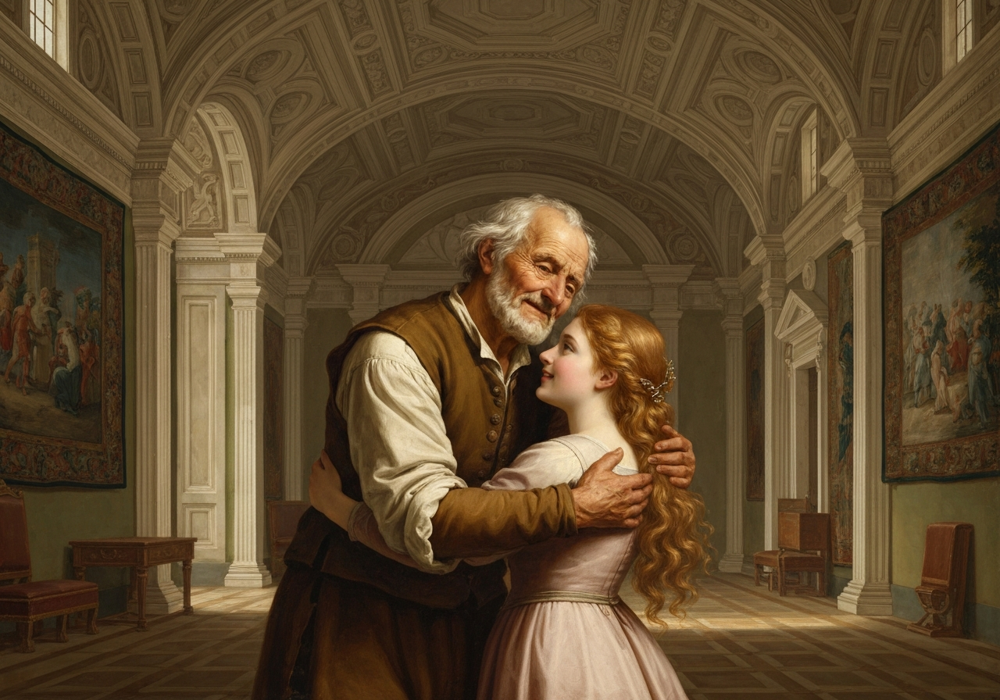
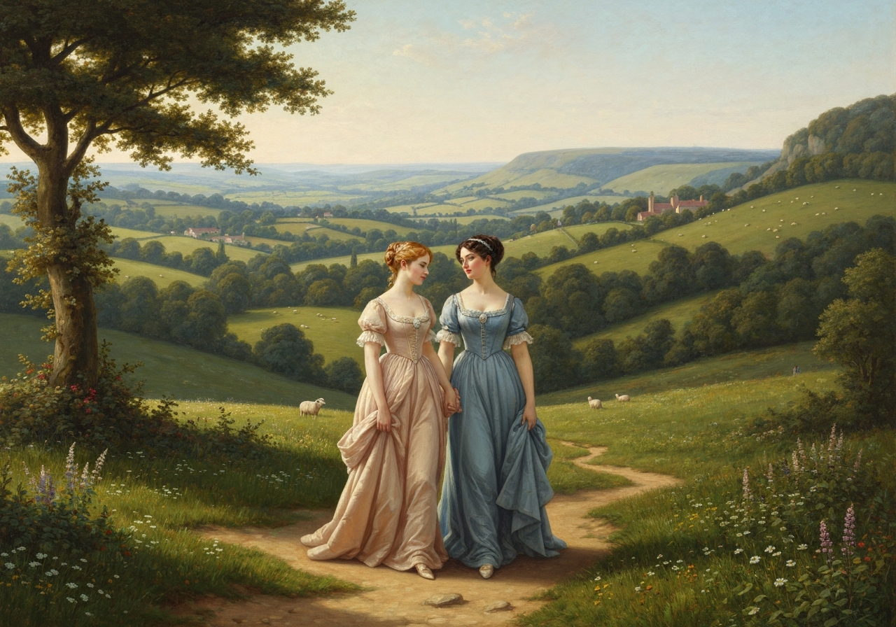
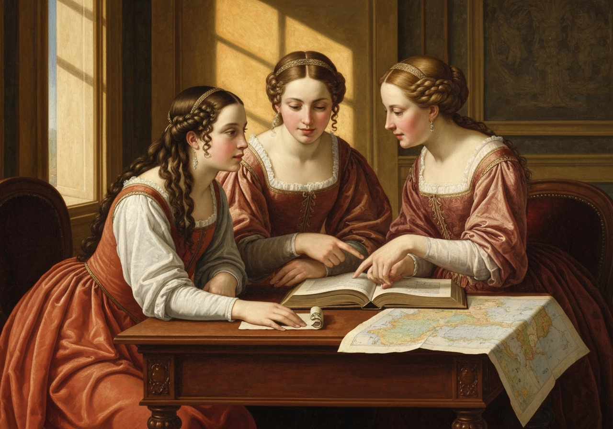
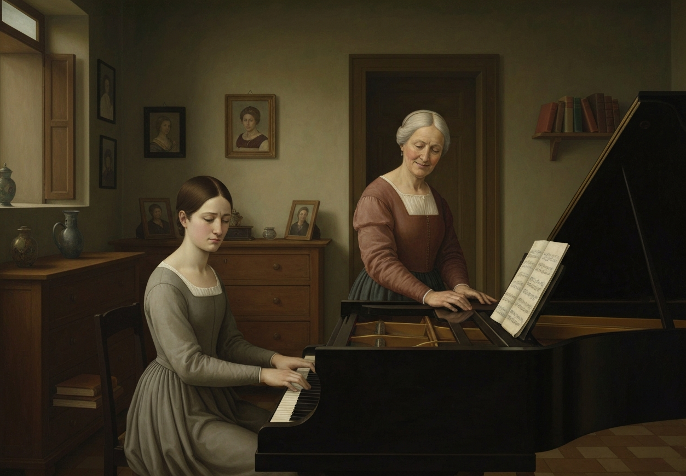
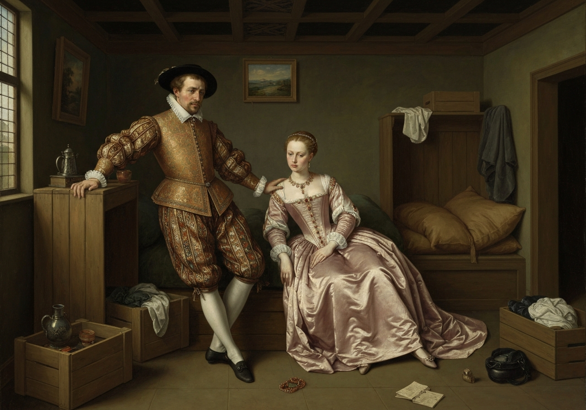
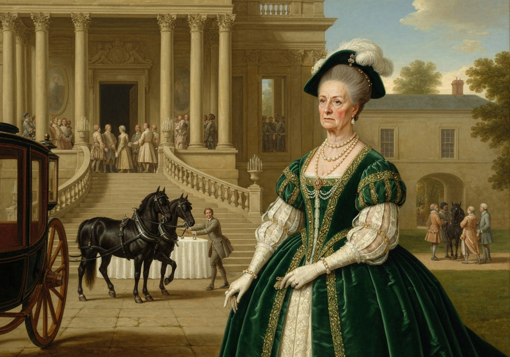

import Callout from '@/components/Callout.astro'

{/* metadata:quote_001:start */}
<Callout title="Memorable Quote" variant="note">Happy for all her maternal feelings was the day on which Mrs. Bennet got rid of her two most deserving daughters.</Callout>
{/* metadata:quote_001:end */}

With what delighted pride she
afterwards visited Mrs. Bingley, and talked of Mrs. Darcy, may be
guessed. I wish I could say, for the sake of her family, that the
accomplishment of her earnest desire in the establishment of so many of
her children produced so happy an effect as to make her a sensible,
amiable, well-informed woman for the rest of her life; though, perhaps,
it was lucky for her husband, who might not have relished domestic
felicity in so unusual a form, that she still was occasionally nervous
and invariably silly.

{/* metadata:analysis_001:start */}
<Callout title="Analysis" variant="explanation">
Mrs. Bennet's maternal pride reaches its zenith as she successfully marries off her two most deserving daughters to wealthy gentlemen. Despite this triumph, Austen's characteristic irony persists—the narrator notes that these happy marriages do not fundamentally transform Mrs. Bennet's character. She remains 'occasionally nervous and invariably silly,' though it is suggested that this consistency may actually serve as a form of domestic stability for Mr. Bennet, who might not have relished domestic felicity in so unusual a form.
</Callout>
{/* metadata:analysis_001:end */}

{/* metadata:image_001:start */}

{/* metadata:image_001:end */}

{/* metadata:quote_002:start */}
<Callout title="Memorable Quote" variant="note">Mr. Bennet missed his second daughter exceedingly; his affection for her drew him oftener from home than anything else could do.</Callout>
{/* metadata:quote_002:end */}

He delighted in
going to Pemberley, especially when he was least expected.

{/* metadata:image_002:start */}

{/* metadata:image_002:end */}

{/* metadata:analysis_002:start */}
<Callout title="Analysis" variant="explanation">
The transformation of Mr. Bennet's relationship with Elizabeth represents one of the novel's most touching character developments. His visits to Pemberley, where he delights in surprising his daughter, reveal a depth of paternal affection that had been somewhat masked by his sardonic wit throughout the novel. Elizabeth has become the daughter he values above all others, and Pemberley has become his sanctuary away from Longbourn, drawing him there especially when he was least expected.
</Callout>
{/* metadata:analysis_002:end */}

Mr. Bingley and Jane remained at Netherfield only a twelvemonth.

{/* metadata:quote_003:start */}
<Callout title="Memorable Quote" variant="note">So near a vicinity to her mother and Meryton relations was not desirable even to _his_ easy temper, or _her_ affectionate heart.</Callout>
{/* metadata:quote_003:end */}

The darling wish of his
sisters was then gratified: he bought an estate in a neighbouring county
to Derbyshire; and Jane and Elizabeth, in addition to every other source
of happiness, were within thirty miles of each other.

{/* metadata:image_003:start */}

{/* metadata:image_003:end */}

{/* metadata:analysis_003:start */}
<Callout title="Analysis" variant="explanation">
The Bingleys' decision to leave Netherfield after only a year demonstrates the practical considerations that affected even the happiest of marriages. Jane's affectionate heart and Bingley's easy temper were not sufficient to overcome the disadvantages of living so near Mrs. Bennet and the Meryton relations. Their removal to Derbyshire, however, provides the consolation of proximity between the two sisters, with Jane and Elizabeth being within thirty miles of each other.
</Callout>
{/* metadata:analysis_003:end */}

Kitty, to her very material advantage, spent the chief of her time with
her two elder sisters.

{/* metadata:quote_004:start */}
<Callout title="Memorable Quote" variant="note">In society so superior to what she had generally known, her improvement was great. She was not of so ungovernable a temper as Lydia; and, removed from the influence of Lydia’s example, she became, by proper attention and management, less irritable, less ignorant, and less insipid.</Callout>
{/* metadata:quote_004:end */}

From the further disadvantage of Lydia’s
society she was of course carefully kept; and though Mrs. Wickham
frequently invited her to come and stay with her, with the promise of
balls and young men, her father would never consent to her going.

{/* metadata:image_004:start */}

{/* metadata:image_004:end */}

{/* metadata:analysis_004:start */}
<Callout title="Analysis" variant="explanation">
Kitty Bennet's improvement represents one of the novel's quieter but significant themes: the influence of environment on character. Removed from Lydia's corrupting example and placed in the superior society of her elder sisters, Kitty becomes less irritable, less ignorant, and less insipid. Mr. Bennet's firm refusal to allow her to visit the Wickhams, despite Lydia's tempting invitations that promised balls and young men, demonstrates his growth as a more responsible parent, and his resolve that he would never consent to her going.
</Callout>
{/* metadata:analysis_004:end */}

{/* metadata:quote_005:start */}
<Callout title="Memorable Quote" variant="note">Mary was the only daughter who remained at home; and she was necessarily drawn from the pursuit of accomplishments by Mrs. Bennet’s being quite unable to sit alone.</Callout>
{/* metadata:quote_005:end */}

Mary was obliged to mix more with the world, but
she could still moralize over every morning visit; and as she was no
longer mortified by comparisons between her sisters’ beauty and her own,
it was suspected by her father that she submitted to the change without
much reluctance.

{/* metadata:image_005:start */}

{/* metadata:image_005:end */}

{/* metadata:analysis_005:start */}
<Callout title="Analysis" variant="explanation">
Mary Bennet's fate offers a sardonic commentary on the limited options available to plain, unmarried women in this society. Obliged to become her mother's companion, she is drawn from her solitary pursuit of accomplishments. However, with her sisters married, she no longer suffers from invidious comparisons of beauty, and her father suspected that she submitted to the change without much reluctance.
</Callout>
{/* metadata:analysis_005:end */}

As for Wickham and Lydia, their characters suffered no revolution from
the marriage of her sisters. He bore with philosophy the conviction that
Elizabeth must now become acquainted with whatever of his ingratitude
and falsehood had before been unknown to her; and, in spite of
everything, was not wholly without hope that Darcy might yet be
prevailed on to make his fortune. The congratulatory letter which
Elizabeth received from Lydia on her marriage explained to her that, by
his wife at least, if not by himself, such a hope was cherished. The
letter was to this effect:--

     /* “My dear Lizzy, */

     “I wish you joy. If you love Mr. Darcy half so well as I do my dear
     Wickham, you must be very happy. It is a great comfort to have you
     so rich; and when you have nothing else to do, I hope you will
     think of us. I am sure Wickham would like a place at court very
     much; and I do not think we shall have quite money enough to live
     upon without some help. Any place would do of about three or four
     hundred a year; but, however, do not speak to Mr. Darcy about it,
     if you had rather not.

“Yours,” etc.

As it happened that Elizabeth had much rather not, she endeavoured in
her answer to put an end to every entreaty and expectation of the kind.
Such relief, however, as it was in her power to afford, by the practice
of what might be called economy in her own private expenses, she
frequently sent them. It had always been evident to her that such an
income as theirs, under the direction of two persons so extravagant in
their wants, and heedless of the future, must be very insufficient to
their support; and whenever they changed their quarters, either Jane or
herself were sure of being applied to for some little assistance towards
discharging their bills. Their manner of living, even when the
restoration of peace dismissed them to a home, was unsettled in the
extreme. They were always moving from place to place in quest of a
cheap situation, and always spending more than they ought.

{/* metadata:quote_006:start */}
<Callout title="Memorable Quote" variant="note">His affection for her soon sunk into indifference: hers lasted a little longer; and, in spite of her youth and her manners, she retained all the claims to reputation which her marriage had given her.</Callout>
{/* metadata:quote_006:end */}

Though Darcy could never
receive _him_ at Pemberley, yet, for Elizabeth’s sake, he assisted him
further in his profession. Lydia was occasionally a visitor there, when
her husband was gone to enjoy himself in London or Bath; and with the
Bingleys they both of them frequently stayed so long, that even
Bingley’s good-humour was overcome, and he proceeded so far as to _talk_
of giving them a hint to be gone.

{/* metadata:image_006:start */}

{/* metadata:image_006:end */}

{/* metadata:analysis_006:start */}
<Callout title="Analysis" variant="explanation">
The portrait of Wickham and Lydia's marriage serves as a cautionary tale about unions founded on passion without prudence. Their characters undergo no transformation; Wickham remains an opportunist counting on Darcy's generosity, while Lydia's letter to Elizabeth brazenly attempts to exploit her sister's new wealth. Their constant financial difficulties, perpetual moves in search of cheaper lodgings, and the eventual cooling of affection reveal the inevitable consequences of their imprudent union, until even Bingley's good-humour was overcome and he proceeded so far as to talk of giving them a hint to be gone.
</Callout>
{/* metadata:analysis_006:end */}

Miss Bingley was very deeply mortified by Darcy’s marriage; but as she
thought it advisable to retain the right of visiting at Pemberley, she
dropped all her resentment; was fonder than ever of Georgiana, almost as
attentive to Darcy as heretofore, and paid off every arrear of civility
to Elizabeth.

Pemberley was now Georgiana’s home; and the attachment of the sisters
was exactly what Darcy had hoped to see. They were able to love each
other, even as well as they intended. Georgiana had the highest opinion
in the world of Elizabeth; though at first she often listened with an
astonishment bordering on alarm at her lively, sportive manner of
talking to her brother. He, who had always inspired in herself a respect
which almost overcame her affection, she now saw the object of open
pleasantry. Her mind received knowledge which had never before fallen in
her way. By Elizabeth’s instructions she began to comprehend that a
woman may take liberties with her husband, which a brother will not
always allow in a sister more than ten years younger than himself.

Lady Catherine was extremely indignant on the marriage of her nephew;
and as she gave way to all the genuine frankness of her character, in
her reply to the letter which announced its arrangement, she sent him
language so very abusive, especially of Elizabeth, that for some time
all intercourse was at an end. But at length, by Elizabeth’s persuasion,
he was prevailed on to overlook the offence, and seek a reconciliation;
and, after a little further resistance on the part of his aunt, her
resentment gave way, either to her affection for him, or her curiosity
to see how his wife conducted herself; and she condescended to wait on
them at Pemberley, in spite of that pollution which its woods had
received, not merely from the presence of such a mistress, but the
visits of her uncle and aunt from the city.

{/* metadata:image_007:start */}

{/* metadata:image_007:end */}

With the Gardiners they were always on the most intimate terms.

{/* metadata:quote_007:start */}
<Callout title="Memorable Quote" variant="note">Darcy, as well as Elizabeth, really loved them; and they were both ever sensible of the warmest gratitude towards the persons who, by bringing her into Derbyshire, had been the means of uniting them.</Callout>
{/* metadata:quote_007:end */}

{/* metadata:analysis_007:start */}
<Callout title="Analysis" variant="explanation">
The chapter closes with multiple reconciliations that underscore the novel's themes of pride humbled and prejudice overcome. Darcy's aunt Lady Catherine, after initial fury, eventually condescends to visit Pemberley, motivated by affection for her nephew and curiosity about Elizabeth. Miss Bingley's mortification at Darcy's marriage forces her to swallow her resentment and practice civility toward Elizabeth. Most significantly, the Gardiners—the aunt and uncle from trade whom Lady Catherine despises—are revealed as the true architects of Elizabeth's happiness, having brought her to Derbyshire where she met Darcy again. This recognition elevates the worth of genuine goodness over aristocratic pride, and both Darcy and Elizabeth remained ever sensible of the warmest gratitude towards the persons who had been the means of uniting them.
</Callout>
{/* metadata:analysis_007:end */}
