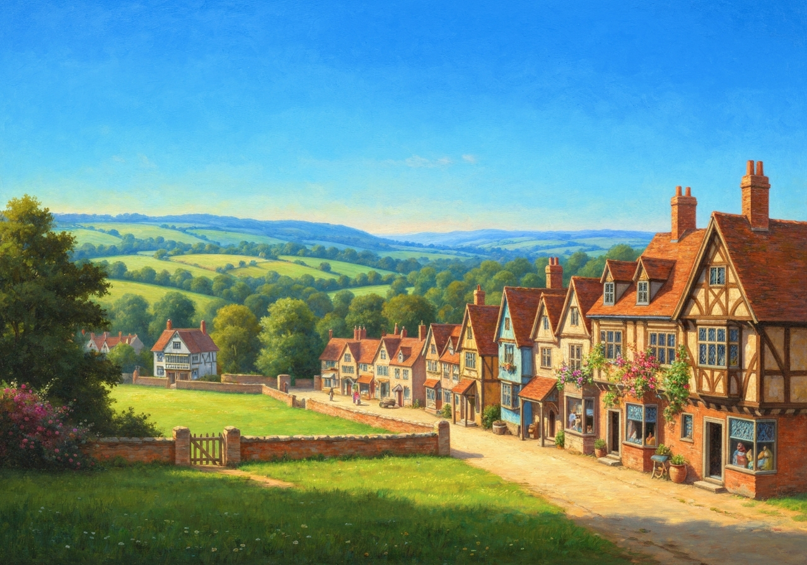
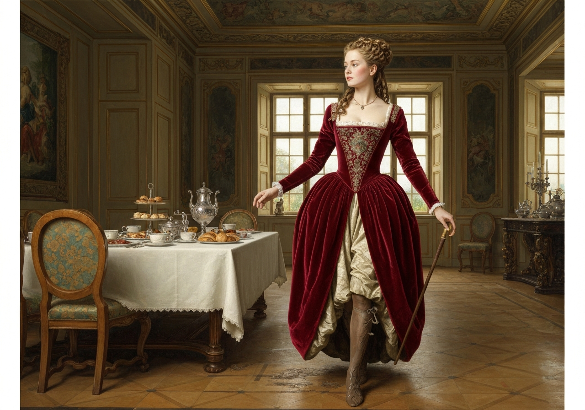
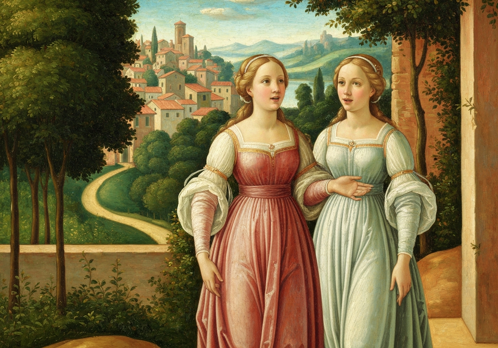
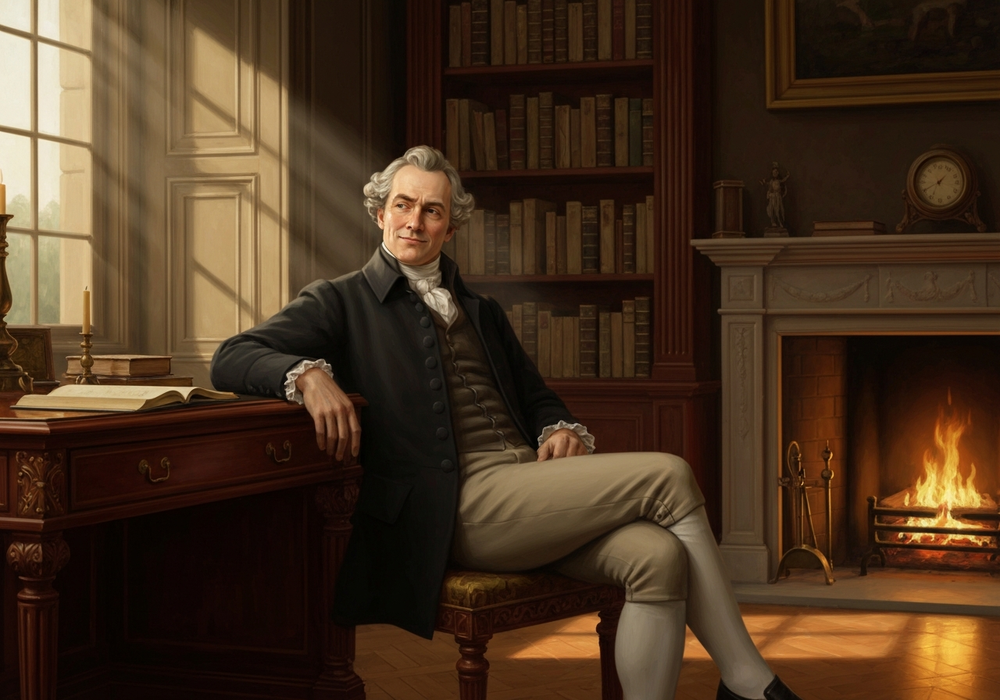
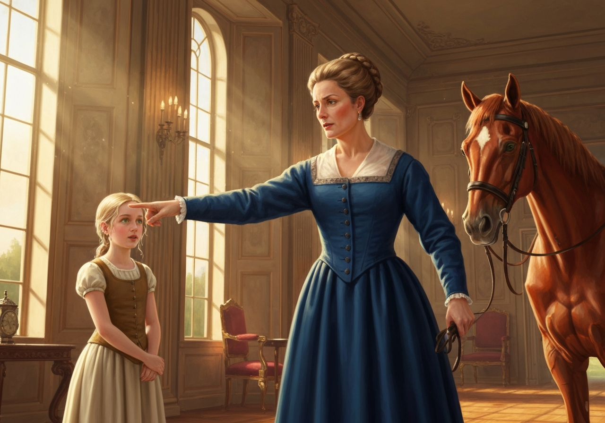
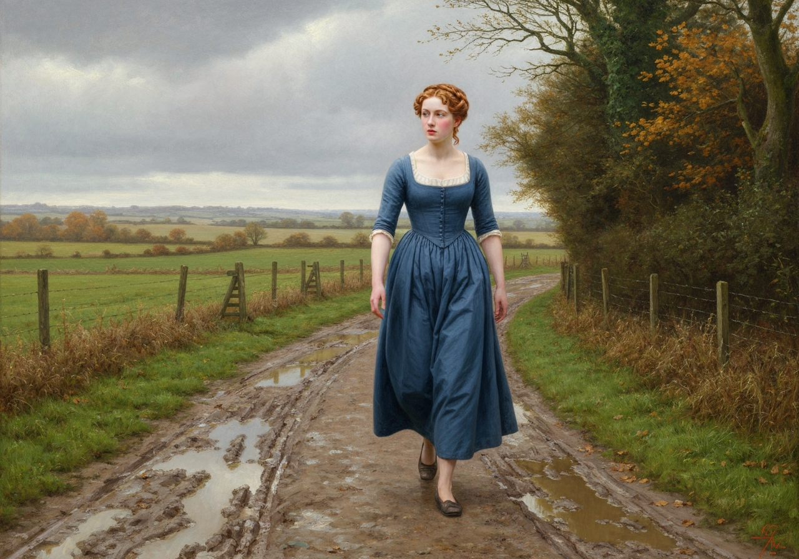
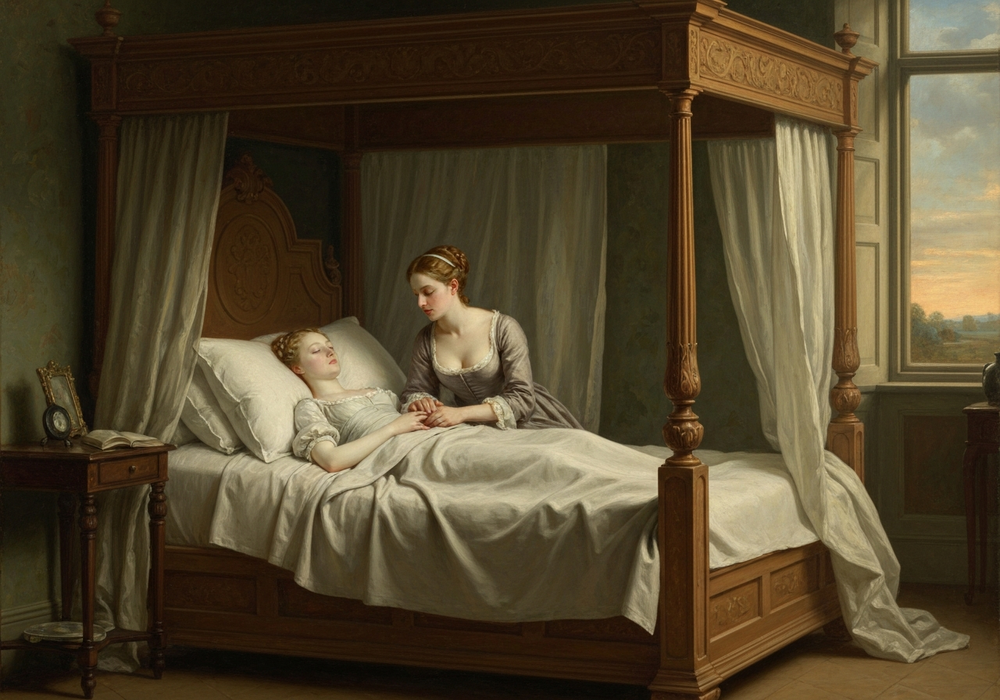

import Callout from '@/components/Callout.astro'

<Callout title="Memorable Quote" variant="note">Mr. Bennet's property consisted almost entirely in an estate of two thousand a year, which, unfortunately for his daughters, was entailed, in default of heirs male, on a distant relation;</Callout>
{/* metadata:quote-001:end */}
and their mother’s fortune, though ample for her situation in life, could but ill supply the deficiency of his.

{/* metadata:image-001:start */}

{/* metadata:image-001:end */}

{/* metadata:analysis-001:start */}
<Callout title="Analysis" variant="explanation">
The chapter opens with a stark exposition of the Bennet family's precarious financial situation, establishing the entailment that threatens the daughters' futures and sets the stage for the urgency behind Mrs. Bennet's marital schemes. The detail that Mrs. Bennet's father was an attorney and left her only four thousand pounds underscores the family's middling social position, caught between gentility and trade. This economic reality gives every maternal maneuver in the chapter a desperate, if comic, logic.
</Callout>
{/* metadata:analysis-001:end */}

Her father had been an attorney in Meryton, and
had left her four thousand pounds.

She had a sister married to a Mr. Philips, who had been a clerk to their
father and succeeded him in the business, and a brother settled in
London in a respectable line of trade.

The village of Longbourn was only one mile from Meryton; a most
convenient distance for the young ladies, who were usually tempted
thither three or four times a week, to pay their duty to their aunt, and
to a milliner’s shop just over the way.
<Callout title="Memorable Quote" variant="note">The two youngest of the family, Catherine and Lydia, were particularly frequent in these attentions: their minds were more vacant than their sisters'and when nothing better offered, a walk to Meryton was necessary to amuse their morning hours and furnish conversation for the evening;</Callout>

{/* metadata:analysis-002:start */}
<Callout title="Analysis" variant="explanation">
Austen masterfully characterizes Kitty and Lydia through their obsession with the militia regiment, contrasting their intellectual vacancy with Elizabeth's discernment while simultaneously mocking the superficial attractions of military uniforms. The narrator's dry observation that 'a walk to Meryton was necessary to amuse their morning hours and furnish conversation for the evening' exposes the poverty of their inner lives with elegant economy. Their inability to value Bingley's fortune over an ensign's scarlet coat signals a comic inversion of the very mercenary logic their mother otherwise champions.
</Callout>
{/* metadata:analysis-002:end */}

and, however bare of
news the country in general might be, they always contrived to learn
some from their aunt. At present, indeed, they were well supplied both
with news and happiness by the recent arrival of a militia regiment in
the neighbourhood; it was to remain the whole winter, and Meryton was
the head-quarters.

{/* metadata:image-006:start */}

{/* metadata:image-006:end */}

Their visits to Mrs. Philips were now productive of the most interesting
intelligence. Every day added something to their knowledge of the
officers’ names and connections. Their lodgings were not long a secret,
and at length they began to know the officers themselves. Mr. Philips
visited them all, and this opened to his nieces a source of felicity
unknown before. They could talk of nothing but officers; and Mr.
Bingley’s large fortune, the mention of which gave animation to their
mother, was worthless in their eyes when opposed to the regimentals of
an ensign.

{/* metadata:image-002:start */}

{/* metadata:image-002:end */}

After listening one morning to their effusions on this subject, Mr.
Bennet coolly observed,--

<Callout title="Memorable Quote" variant="note">From all that I can collect by your manner of talking, you must be two of the silliest girls in the country. I have suspected it some time, but I am now convinced.</Callout>

{/* metadata:image-003:start */}

{/* metadata:image-003:end */}

{/* metadata:analysis-003:start */}
<Callout title="Analysis" variant="explanation">
Mr. Bennet's dry wit serves as the moral counterpoint to his wife's foolishness; his declaration that Kitty and Lydia are 'two of the silliest girls in the country' carries both paternal disappointment and authorial judgment, highlighting the theme of parental negligence. His admission that he has 'suspected it some time' but is 'now convinced' reveals a man who observes his household with sardonic clarity yet does nothing to correct it. This passive irony implicates Mr. Bennet himself in the family's dysfunction, complicating the reader's sympathy for him.
</Callout>
{/* metadata:analysis-003:end */}

Catherine was disconcerted, and made no answer; but Lydia, with perfect
indifference, continued to express her admiration of Captain Carter, and
her hope of seeing him in the course of the day, as he was going the
next morning to London.

“I am astonished, my dear,” said Mrs. Bennet, “that you should be so
ready to think your own children silly. If I wished to think slightingly
of anybody’s children, it should not be of my own, however.”

“If my children are silly, I must hope to be always sensible of it.”

“Yes; but as it happens, they are all of them very clever.”

“This is the only point, I flatter myself, on which we do not agree. I
had hoped that our sentiments coincided in every particular, but I must
so far differ from you as to think our two youngest daughters uncommonly
foolish.”

“My dear Mr. Bennet, you must not expect such girls to have the sense of
their father and mother. When they get to our age, I dare say they will
not think about officers any more than we do.
<Callout title="Memorable Quote" variant="note">I remember the time when I liked a red coat myself very well--and, indeed, so I do still at my heart</Callout>

“Mamma,” cried Lydia, “my aunt says that Colonel Forster and Captain
Carter do not go so often to Miss Watson’s as they did when they first
came; she sees them now very often standing in Clarke’s library.”

Mrs. Bennet was prevented replying by the entrance of the footman with a
note for Miss Bennet; it came from Netherfield, and the servant waited
for an answer. Mrs. Bennet’s eyes sparkled with pleasure, and she was
eagerly calling out, while her daughter read,--

“Well, Jane, who is it from? What is it about? What does he say? Well,
Jane, make haste and tell us; make haste, my love.”

“It is from Miss Bingley,” said Jane, and then read it aloud.

     /* NIND “My dear friend, */

     “If you are not so compassionate as to dine to-day with Louisa and
     me, we shall be in danger of hating each other for the rest of our
     lives; for a whole day’s _tête-à-tête_ between two women can never
     end without a quarrel. Come as soon as you can on the receipt of
     this. My brother and the gentlemen are to dine with the officers.
     Yours ever,

“CAROLINE BINGLEY.”

“With the officers!” cried Lydia: “I wonder my aunt did not tell us of
_that_.”

“Dining out,” said Mrs. Bennet; “that is very unlucky.”

“Can I have the carriage?” said Jane.

“No, my dear, you had better go on horseback, because it seems likely to
rain; and then you must stay all night.”

“That would be a good scheme,” said Elizabeth, “if you were sure that
they would not offer to send her home.”

“Oh, but the gentlemen will have Mr. Bingley’s chaise to go to Meryton;
and the Hursts have no horses to theirs.”

“I had much rather go in the coach.”

“But, my dear, your father cannot spare the horses, I am sure. They are
wanted in the farm, Mr. Bennet, are not they?”

“They are wanted in the farm much oftener than I can get them.”

{/* metadata:image-004:start */}

{/* metadata:image-004:end */}

{/* metadata:analysis-004:start */}
<Callout title="Analysis" variant="explanation">
Mrs. Bennet's transparent manipulation to keep Jane overnight at Netherfield reveals both maternal calculation and Austen's critique of mothers who treat daughters as marital commodities, with the weather itself becoming a conspirator in her matchmaking scheme. Her insistence that Jane ride on horseback because 'it seems likely to rain' is a masterpiece of plausible deniability, and her self-congratulation when the rain arrives—'This was a lucky idea of mine, indeed!'—strips away any pretense of maternal concern. The exchange over the horses, culminating in Mr. Bennet's admission that 'they are wanted in the farm much oftener than I can get them,' shows the whole family colluding, wittingly or not, in the scheme.
</Callout>
{/* metadata:analysis-004:end */}

“But if you have got them to-day,” said Elizabeth, “my mother’s purpose
will be answered.”

<Callout title="Memorable Quote" variant="note">Jane was therefore obliged to go on horseback, and her mother attended her to the door with many cheerful prognostics of a bad day.</Callout>
Her hopes were answered; Jane had not been gone long before it
rained hard. Her sisters were uneasy for her, but her mother was
delighted. The rain continued the whole evening without intermission;
Jane certainly could not come back.

“This was a lucky idea of mine, indeed!” said Mrs. Bennet, more than
once, as if the credit of making it rain were all her own. Till the next
morning, however, she was not aware of all the felicity of her
contrivance. Breakfast was scarcely over when a servant from Netherfield
brought the following note for Elizabeth:--

     /* NIND “My dearest Lizzie, */

     “I find myself very unwell this morning, which, I suppose, is to be
     imputed to my getting wet through yesterday. My kind friends will
     not hear of my returning home till I am better. They insist also on
     my seeing Mr. Jones--therefore do not be alarmed if you should hear
     of his having been to me--and, excepting a sore throat and a
     headache, there is not much the matter with me.

“Yours, etc.”

“Well, my dear,” said Mr. Bennet, when Elizabeth had read the note
aloud, “if your daughter should have a dangerous fit of illness--if she
should die--it would be a comfort to know that it was all in pursuit of
Mr. Bingley, and under your orders.”

“Oh, I am not at all afraid of her dying. People do not die of little
trifling colds. She will be taken good care of. As long as she stays
there, it is all very well. I would go and see her if I could have the
carriage.”

Elizabeth, feeling really anxious, determined to go to her, though the
carriage was not to be had: and as she was no horsewoman, walking was
her only alternative. She declared her resolution.

“How can you be so silly,” cried her mother, “as to think of such a
thing, in all this dirt! You will not be fit to be seen when you get
there.”

<Callout title="Memorable Quote" variant="note">I shall be very fit to see Jane--which is all I want</Callout>

“Is this a hint to me, Lizzy,” said her father, “to send for the
horses?”

“No, indeed. I do not wish to avoid the walk. The distance is nothing,
when one has a motive; only three miles. I shall be back by dinner.”

“I admire the activity of your benevolence,” observed Mary, “but every
impulse of feeling should be guided by reason; and, in my opinion,
exertion should always be in proportion to what is required.”

“We will go as far as Meryton with you,” said Catherine and Lydia.
Elizabeth accepted their company, and the three young ladies set off
together.

“If we make haste,” said Lydia, as they walked along, “perhaps we may
see something of Captain Carter, before he goes.”

In Meryton they parted: the two youngest repaired to the lodgings of one
of the officers’ wives, and
<Callout title="Memorable Quote" variant="note">Elizabeth continued her walk alone, crossing field after field at a quick pace, jumping over stiles and springing over puddles, with impatient activity, and finding herself at last within view of the house, with weary ancles, dirty stockings, and a face glowing with the warmth of exercise.</Callout>

{/* metadata:image-005:start */}

{/* metadata:image-005:end */}

{/* metadata:analysis-005:start */}
<Callout title="Analysis" variant="explanation">
Elizabeth's morning walk through fields and across stiles represents a pivotal character moment—her physical exertion mirrors her energetic spirit, while her indifference to propriety contrasts sharply with the refined ladies at Netherfield who hold her in contempt for her disheveled appearance. The vivid image of her 'crossing field after field at a quick pace, jumping over stiles and springing over puddles, with impatient activity' renders her as a figure of vital, purposeful energy in a world of decorative femininity. Her arrival with 'weary ancles, dirty stockings, and a face glowing with the warmth of exercise' is both a social transgression and a quiet declaration of character.
</Callout>
{/* metadata:analysis-005:end */}

She was shown into the breakfast parlour, where all but Jane were
assembled, and where her appearance created a great deal of surprise.
That she should have walked three miles so early in the day in such
dirty weather, and by herself, was almost incredible to Mrs. Hurst and
Miss Bingley; and Elizabeth was convinced that they held her in contempt
for it. She was received, however, very politely by them; and in their
brother’s manners there was something better than politeness--there was
good-humour and kindness.

{/* metadata:analysis-006:start */}
<Callout title="Analysis" variant="explanation">
The breakfast parlour scene establishes the social dynamics that will drive the narrative: Miss Bingley's and Mrs. Hurst's aristocratic disdain, Mr. Darcy's conflicted admiration, and Mr. Bingley's genuine kindness create a tableau of early nineteenth-century class attitudes. Austen's observation that 'in their brother's manners there was something better than politeness—there was good-humour and kindness' distinguishes Bingley's authentic warmth from the cold civility of his sisters. Mr. Darcy's division between 'admiration of the brilliancy which exercise had given to her complexion' and doubt about the propriety of her coming alone foreshadows the central tension of his character throughout the novel.
</Callout>
{/* metadata:analysis-006:end */}

Mr. Darcy said very little, and Mr. Hurst
nothing at all. The former was divided between admiration of the
brilliancy which exercise had given to her complexion and doubt as to
the occasion’s justifying her coming so far alone. The latter was
thinking only of his breakfast.

Her inquiries after her sister were not very favourably answered. Miss
Bennet had slept ill, and though up, was very feverish, and not well
enough to leave her room. Elizabeth was glad to be taken to her
immediately; and Jane, who had only been withheld by the fear of giving
alarm or inconvenience, from expressing in her note how much she longed
for such a visit, was delighted at her entrance. She was not equal,
however, to much conversation; and when Miss Bingley left them together,
could attempt little beside expressions of gratitude for the
extraordinary kindness she was treated with. Elizabeth silently attended
her.

When breakfast was over, they were joined by the sisters; and Elizabeth
began to like them herself, when she saw how much affection and
solicitude they showed for Jane. The apothecary came; and having
examined his patient, said, as might be supposed, that she had caught a
violent cold, and that they must endeavour to get the better of it;
advised her to return to bed, and promised her some draughts. The advice
was followed readily, for the feverish symptoms increased, and her head
ached acutely. Elizabeth did not quit her room for a moment, nor were
the other ladies often absent; the gentlemen being out, they had in fact
nothing to do elsewhere.

{/* metadata:image-007:start */}

{/* metadata:image-007:end */}

When the clock struck three, Elizabeth felt that she must go, and very
unwillingly said so. Miss Bingley offered her the carriage, and she only
wanted a little pressing to accept it, when Jane testified such concern
at parting with her that Miss Bingley was obliged to convert the offer
of the chaise into an invitation to remain at Netherfield for the
present. Elizabeth most thankfully consented, and a servant was
despatched to Longbourn, to acquaint the family with her stay, and bring
back a supply of clothes.

{/* metadata:analysis-007:start */}
<Callout title="Analysis" variant="explanation">
Jane's illness serves as the narrative device that extends Elizabeth's stay at Netherfield, forcing her into closer proximity with the Bingley circle and setting the stage for the intellectual sparring and romantic tension that will develop between Elizabeth and Mr. Darcy. Elizabeth's vigil—'she did not quit her room for a moment'—demonstrates the depth of sisterly devotion that defines her character and implicitly rebukes the calculating social performances of Miss Bingley and Mrs. Hurst. The chapter closes with Elizabeth's consent to remain at Netherfield, a servant dispatched to Longbourn 'to acquaint the family with her stay, and bring back a supply of clothes,' signaling that what began as a morning errand will become a prolonged and consequential sojourn.
</Callout>
{/* metadata:analysis-007:end */}
