import Callout from '@/components/Callout.astro'

[Illustration]

Elizabeth passed the chief of the night in her sister’s room, and in the
morning had the pleasure of being able to send a tolerable answer to the
inquiries which she very early received from Mr. Bingley by a housemaid,
and some time afterwards from the two elegant ladies who waited on his
sisters. In spite of this amendment, however, she requested to have a
note sent to Longbourn, desiring her mother to visit Jane, and form her
own judgment of her situation. The note was immediately despatched, and
its contents as quickly complied with. Mrs. Bennet, accompanied by her
two youngest girls, reached Netherfield soon after the family breakfast.

{/* metadata:analysis-1:start */}
<Callout title="Analysis [1]" variant="explanation">
Mrs. Bennet's visit to Netherfield reveals her manipulative nature regarding Jane's illness. She deliberately obstructs Jane's return home, prioritizing the proximity to Mr. Bingley over her daughter's immediate comfort. This calculation highlights the desperate social stakes Mrs. Bennet associates with a potential match at Netherfield.
</Callout>
{/* metadata:analysis-1:end */}

Had she found Jane in any apparent danger, Mrs. Bennet would have been
very miserable; but being satisfied on seeing her that her illness was
not alarming, she had no wish of her recovering immediately, as her
restoration to health would probably remove her from Netherfield. She
would not listen, therefore, to her daughter’s proposal of being carried
home; neither did the apothecary, who arrived about the same time, think
it at all advisable. After sitting a little while with Jane, on Miss
Bingley’s appearance and invitation, the mother and three daughters all
attended her into the breakfast parlour.

{/* metadata:image-1:start */}
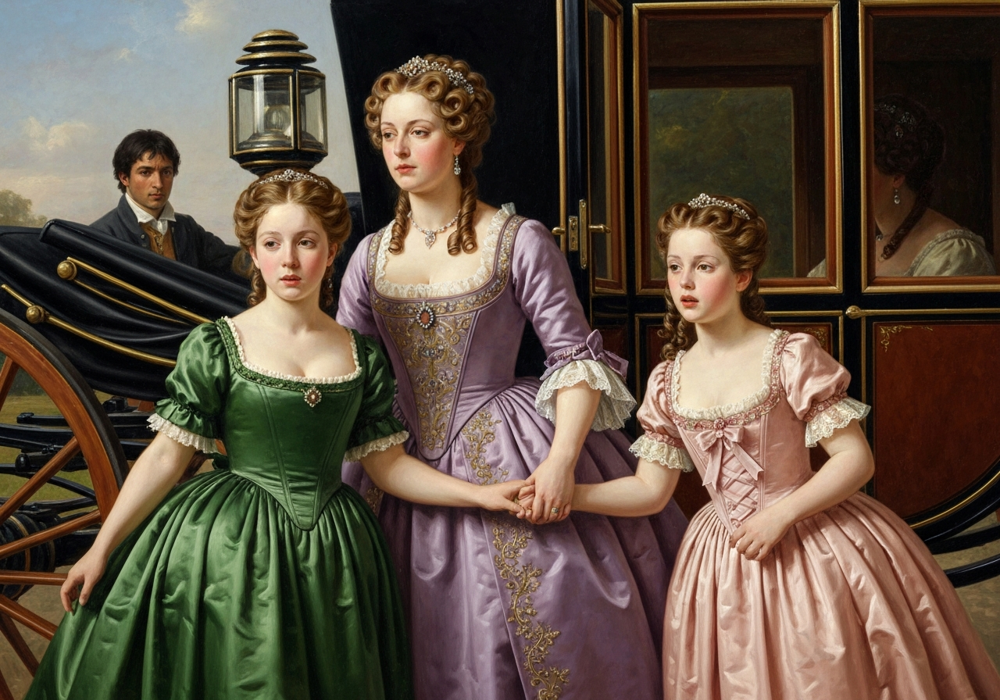

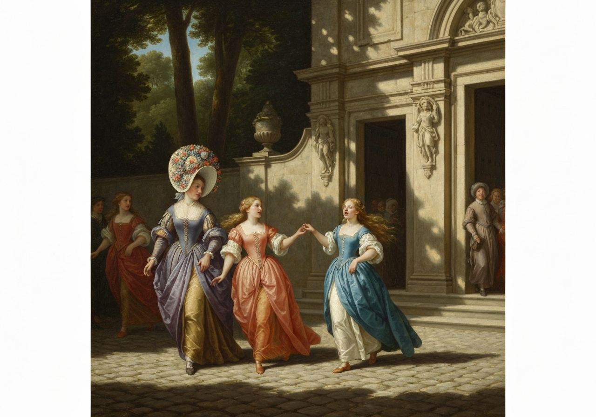
{/* metadata:image-1:end */}

 Bingley met them with hopes
that Mrs. Bennet had not found Miss Bennet worse than she expected.

“Indeed I have, sir,” was her answer. {/* metadata:quote-1:start */}
<Callout title="Memorable Quote" variant="note">“She is a great deal too ill to be moved. Mr. Jones says we must not think of moving her. We must trespass a little longer on your kindness.”</Callout>
{/* metadata:quote-1:end */}

“Removed!” cried Bingley. “It must not be thought of. My sister, I am
sure, will not hear of her removal.”

“You may depend upon it, madam,” said Miss Bingley, with cold civility,
“that Miss Bennet shall receive every possible attention while she
remains with us.”

Mrs. Bennet was profuse in her acknowledgments.

“I am sure,” she added, “if it was not for such good friends, I do not
know what would become of her, for she is very ill indeed, and suffers a
vast deal, though with the greatest patience in the world, which is
always the way with her, for she has, without exception, the sweetest
temper I ever met with. I often tell my other girls they are nothing to
_her_. You have a sweet room here, Mr. Bingley, and a charming prospect
over that gravel walk. I do not know a place in the country that is
equal to Netherfield. You will not think of quitting it in a hurry, I
hope, though you have but a short lease.”

{/* metadata:quote-2:start */}
<Callout title="Memorable Quote" variant="note">“Whatever I do is done in a hurry,” replied he; “and therefore if I should resolve to quit Netherfield, I should probably be off in five minutes.”</Callout>
{/* metadata:quote-2:end */} At present, however, I consider myself as quite fixed here.”

“That is exactly what I should have supposed of you,” said Elizabeth.

“You begin to comprehend me, do you?” cried he, turning towards her.

{/* metadata:image-3:start */}
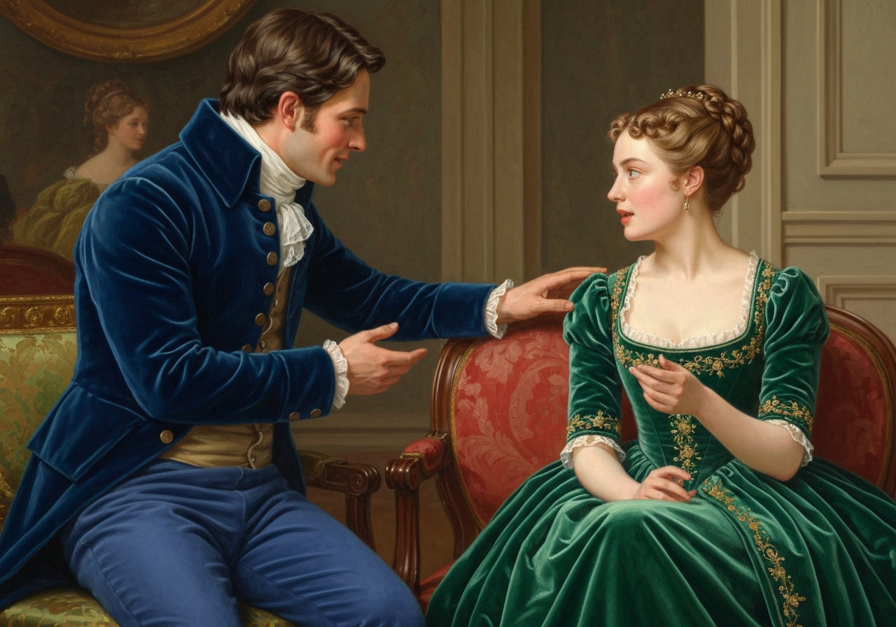

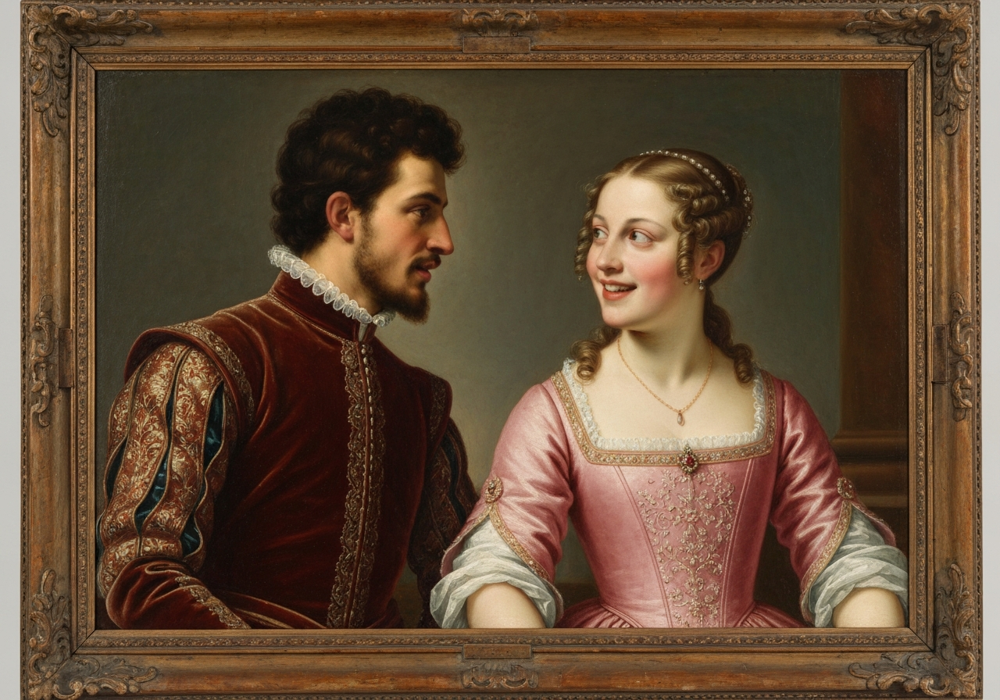
{/* metadata:image-3:end */}

“Oh yes--I understand you perfectly.”

“I wish I might take this for a compliment; but to be so easily seen
through, I am afraid, is pitiful.”

“That is as it happens. It does not necessarily follow that a deep,
intricate character is more or less estimable than such a one as yours.”

“Lizzy,” cried her mother, “remember where you are, and do not run on in
the wild manner that you are suffered to do at home.”

“I did not know before,” continued Bingley, immediately, “that you were
a studier of character. It must be an amusing study.”

“Yes; but intricate characters are the _most_ amusing. They have at
least that advantage.”

{/* metadata:quote-3:start */}
<Callout title="Memorable Quote" variant="note">“The country,” said Darcy, “can in general supply but few subjects for such a study. In a country neighbourhood you move in a very confined and unvarying society.”</Callout>
{/* metadata:quote-3:end */}

{/* metadata:analysis-3:start */}
<Callout title="Analysis [3]" variant="explanation">
The debate regarding the merits of country versus town life serves as a vehicle for character contrast. Mrs. Bennet's defensive and literal-minded responses to Darcy's observations reveal her intellectual limitations. Darcy's preference for 'intricate characters' and variety further distances him from the simpler social circle of Longbourn.
</Callout>
{/* metadata:analysis-3:end */}

“But people themselves alter so much, that there is something new to be
observed in them for ever.”

“Yes, indeed,” cried Mrs. Bennet, offended by his manner of mentioning a
country neighbourhood. “I assure you there is quite as much of _that_
going on in the country as in town.”

Everybody was surprised; and Darcy, after looking at her for a moment,
turned silently away.

{/* metadata:image-2:start */}
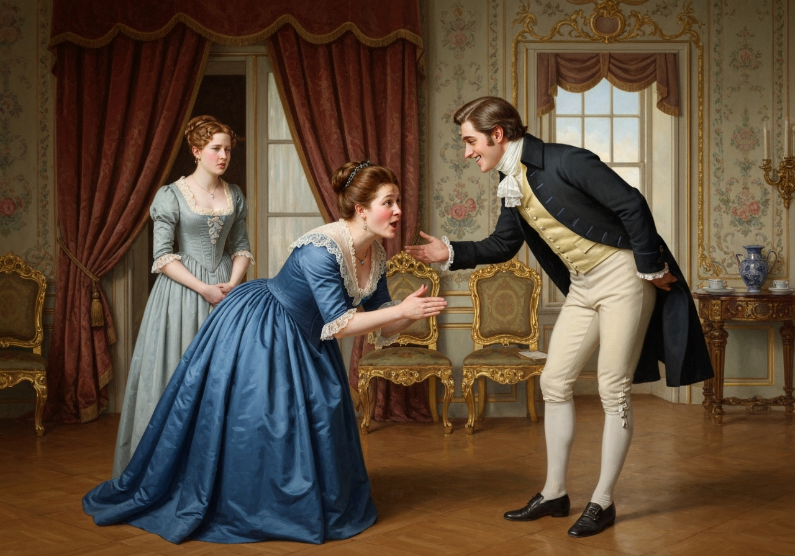

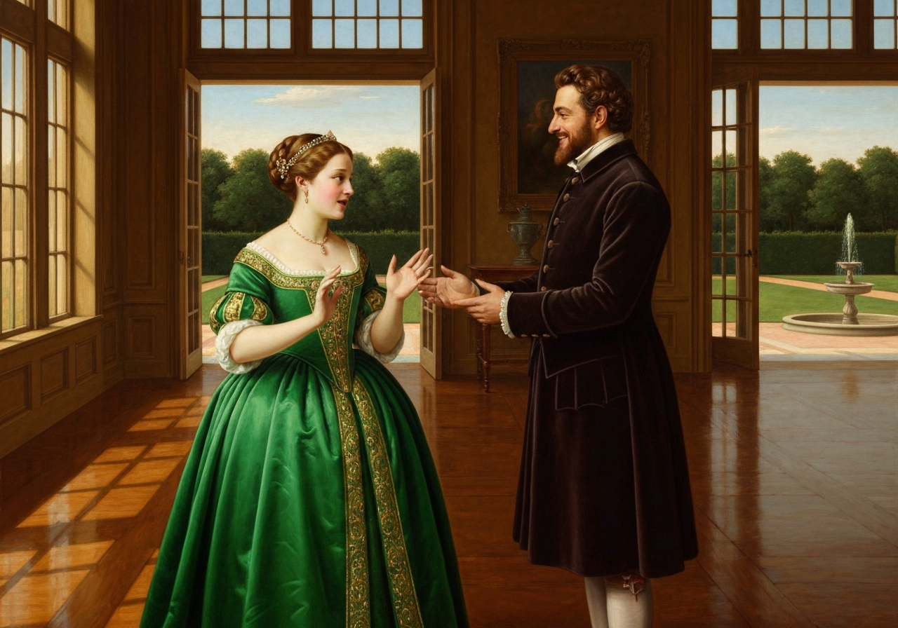
{/* metadata:image-2:end */}

 Mrs. Bennet, who fancied she had gained a complete
victory over him, continued her triumph,--

“I cannot see that London has any great advantage over the country, for
my part, except the shops and public places. The country is a vast deal
pleasanter, is not it, Mr. Bingley?”

{/* metadata:quote-4:start */}
<Callout title="Memorable Quote" variant="note">“When I am in the country,” he replied, “I never wish to leave it; and when I am in town, it is pretty much the same. They have each their advantages, and I can be equally happy in either.”</Callout>
{/* metadata:quote-4:end */}

“Ay, that is because you have the right disposition. But that
gentleman,” looking at Darcy, “seemed to think the country was nothing
at all.”

“Indeed, mamma, you are mistaken,” said Elizabeth, blushing for her
mother.

{/* metadata:analysis-2:start */}
<Callout title="Analysis [2]" variant="explanation">
Throughout the visit, Elizabeth acts as a buffer between her mother's social indelicacy and the Netherfield party. She frequently blushes for Mrs. Bennet's lack of decorum and attempts to redirect the conversation. This role underscores Elizabeth's acute awareness of social standing and her desire to protect her family's reputation.
</Callout>
{/* metadata:analysis-2:end */}

 “You quite mistook Mr. Darcy. He only meant that there was not
such a variety of people to be met with in the country as in town, which
you must acknowledge to be true.”

“Certainly, my dear, nobody said there were; but as to not meeting with
many people in this neighbourhood, I believe there are few
neighbourhoods larger. I know we dine with four-and-twenty families.”

{/* metadata:image-4:start */}
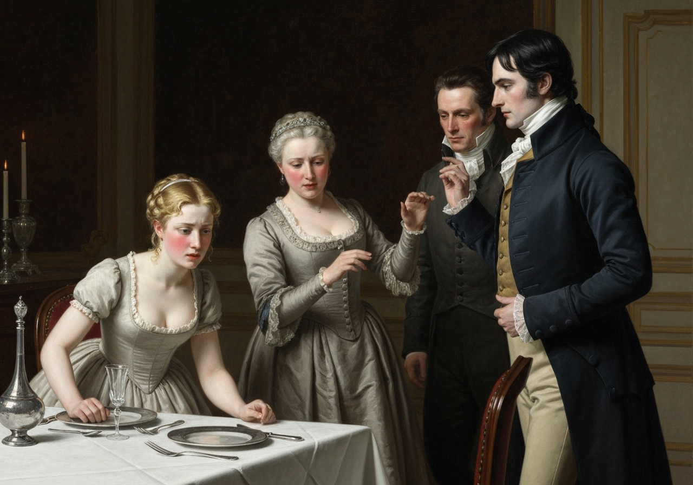

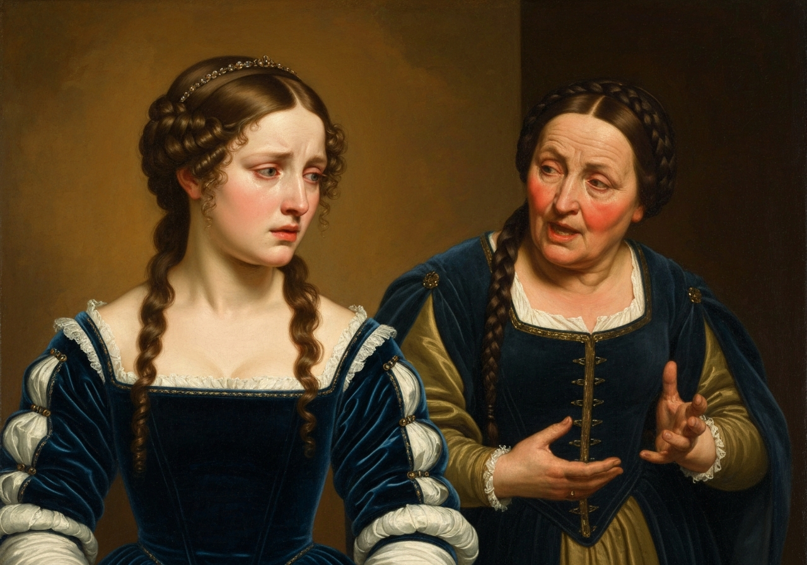
{/* metadata:image-4:end */}

Nothing but concern for Elizabeth could enable Bingley to keep his
countenance.

{/* metadata:analysis-4:start */}
<Callout title="Analysis [4]" variant="explanation">
Mr. Bingley's reaction to Mrs. Bennet's absurdities is characterized by genuine civility and patience. Unlike his sister or Mr. Darcy, he makes a sincere effort to maintain a pleasant atmosphere. His willingness to accommodate the Bennets, even under duress, solidifies his role as a foil to Darcy's austerity.
</Callout>
{/* metadata:analysis-4:end */}

 His sister was less delicate, and directed her eye towards
Mr. Darcy with a very expressive smile. Elizabeth, for the sake of
saying something that might turn her mother’s thoughts, now asked her if
Charlotte Lucas had been at Longbourn since _her_ coming away.

“Yes, she called yesterday with her father. What an agreeable man Sir
William is, Mr. Bingley--is not he? so much the man of fashion! so
genteel and so easy! He has always something to say to everybody. {/* metadata:quote-5:start */}
<Callout title="Memorable Quote" variant="note">“_That_ is my idea of good breeding; and those persons who fancy themselves very important and never open their mouths quite mistake the matter.”</Callout>
{/* metadata:quote-5:end */}

“Did Charlotte dine with you?”

“No, she would go home. I fancy she was wanted about the mince-pies. For
my part, Mr. Bingley, _I_ always keep servants that can do their own
work; _my_ daughters are brought up differently. But everybody is to
judge for themselves, and the Lucases are a very good sort of girls, I
assure you. It is a pity they are not handsome! Not that _I_ think
Charlotte so _very_ plain; but then she is our particular friend.”

“She seems a very pleasant young woman,” said Bingley.

“Oh dear, yes; but you must own she is very plain. Lady Lucas herself
has often said so, and envied me Jane’s beauty. I do not like to boast
of my own child; but to be sure, Jane--one does not often see anybody
better looking. It is what everybody says. I do not trust my own
partiality. When she was only fifteen there was a gentleman at my
brother Gardiner’s in town so much in love with her, that my
sister-in-law was sure he would make her an offer before we came away.
But, however, he did not. Perhaps he thought her too young. However, he
wrote some verses on her, and very pretty they were.”

“And so ended his affection,” said Elizabeth, impatiently. “There has
been many a one, I fancy, overcome in the same way. I wonder who first
discovered the efficacy of poetry in driving away love!”

{/* metadata:quote-6:start */}
<Callout title="Memorable Quote" variant="note">“I have been used to consider poetry as the _food_ of love,” said Darcy.</Callout>
{/* metadata:quote-6:end */}

{/* metadata:image-5:start */}
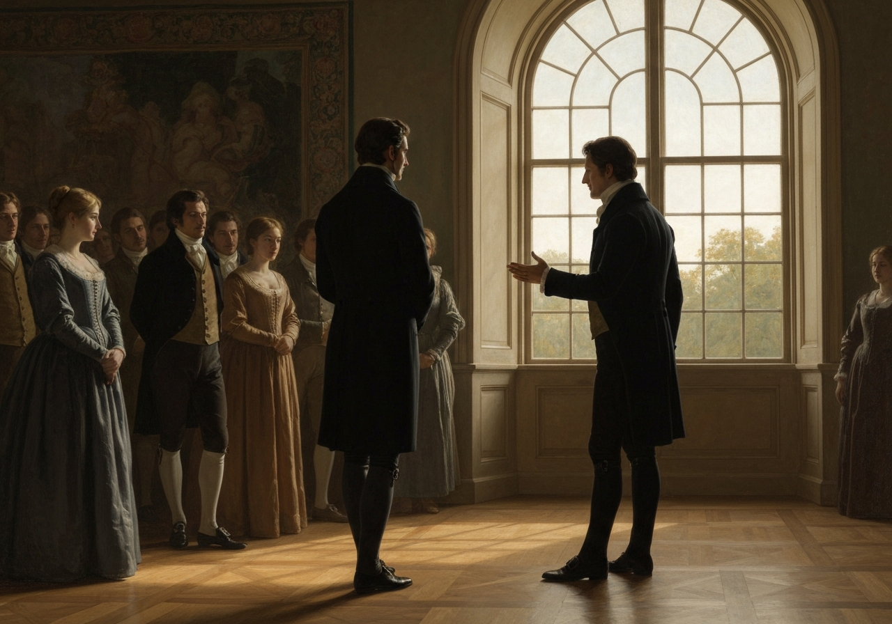

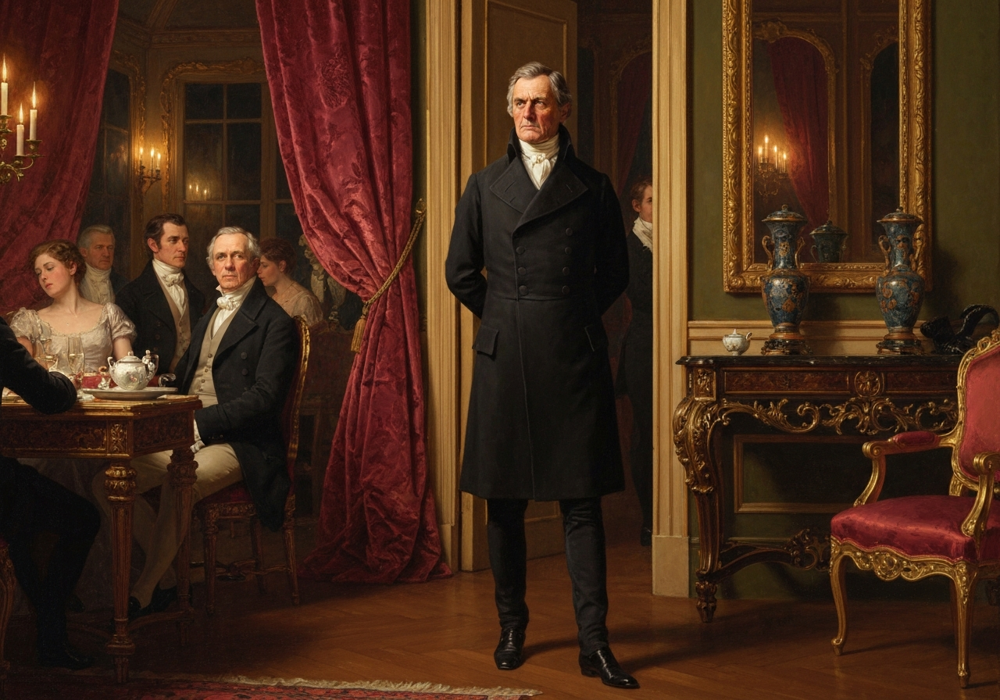
{/* metadata:image-5:end */}

{/* metadata:analysis-6:start */}
<Callout title="Analysis [6]" variant="explanation">
The witty exchange between Elizabeth and Darcy regarding poetry and love provides a glimpse of their intellectual compatibility. Elizabeth's cynical view of sonnets 'starving' a slight inclination contrasts with Darcy's more traditional, yet guarded, perspective. Their banter remains the only high-level intellectual engagement in the room.
</Callout>
{/* metadata:analysis-6:end */}

“Of a fine, stout, healthy love it may. Everything nourishes what is
strong already. But if it be only a slight, thin sort of inclination, I
am convinced that one good sonnet will starve it entirely away.”

Darcy only smiled; and the general pause which ensued made Elizabeth
tremble lest her mother should be exposing herself again. She longed to
speak, but could think of nothing to say; and after a short silence Mrs.
Bennet began repeating her thanks to Mr. Bingley for his kindness to
Jane, with an apology for troubling him also with Lizzy. Mr. Bingley was
unaffectedly civil in his answer, and forced his younger sister to be
civil also, and say what the occasion required. She performed her part,
indeed, without much graciousness, but Mrs. Bennet was satisfied, and
soon afterwards ordered her carriage. Upon this signal, the youngest of
her daughters put herself forward. The two girls had been whispering to
each other during the whole visit; and the result of it was, that the
youngest should tax Mr. Bingley with having promised on his first coming
into the country to give a ball at Netherfield.

Lydia was a stout, well-grown girl of fifteen, with a fine complexion
and good-humoured countenance;

{/* metadata:analysis-5:start */}
<Callout title="Analysis [5]" variant="explanation">
The introduction of Lydia's demands for a ball illustrates the lack of discipline in the younger Bennet sisters. Her 'high animal spirits' and 'natural self-consequence' are presented as results of her mother's indulgence. This foreshadows the later social risks Lydia's unrestrained behavior will pose to the family.
</Callout>
{/* metadata:analysis-5:end */}

 a favourite with her mother, whose
affection had brought her into public at an early age. She had high
animal spirits, and a sort of natural self-consequence, which the
attentions of the officers, to whom her uncle’s good dinners and her
own easy manners recommended her, had increased into assurance. She was
very equal, therefore, to address Mr. Bingley on the subject of the
ball,

{/* metadata:image-6:start */}
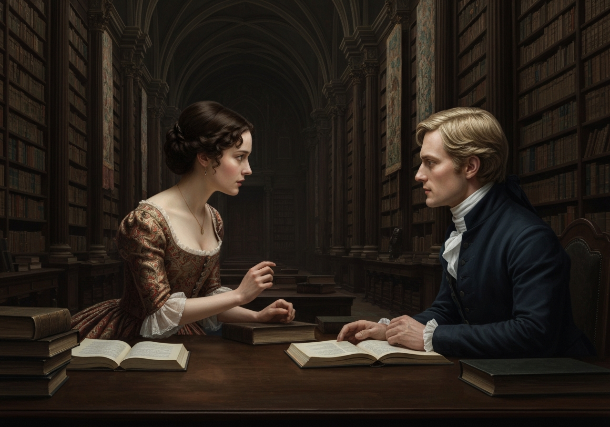

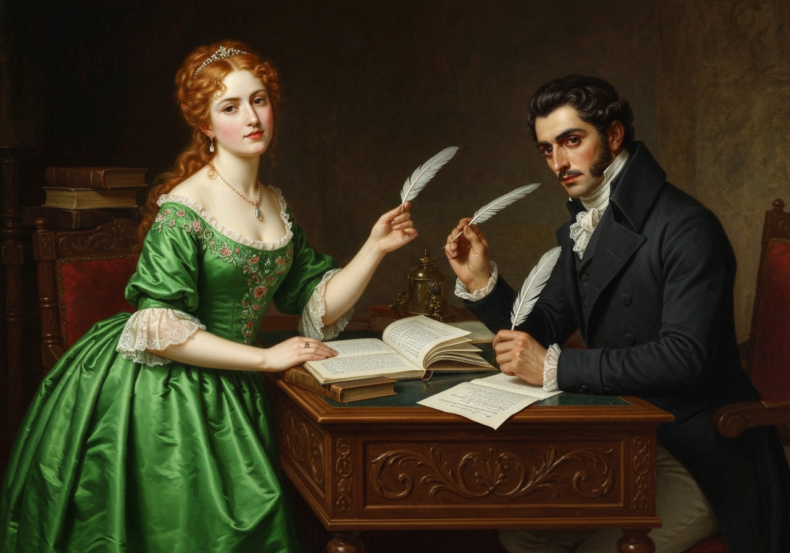
{/* metadata:image-6:end */}

 and abruptly reminded him of his promise; adding, that it would be
the most shameful thing in the world if he did not keep it. His answer
to this sudden attack was delightful to her mother’s ear.

{/* metadata:quote-7:start */}
<Callout title="Memorable Quote" variant="note">“I am perfectly ready, I assure you, to keep my engagement; and, when your sister is recovered, you shall, if you please, name the very day of the ball.”</Callout>
{/* metadata:quote-7:end */} But you would not wish to be dancing while she is ill?”

Lydia declared herself satisfied. “Oh yes--it would be much better to
wait till Jane was well; and by that time, most likely, Captain Carter
would be at Meryton again. And when you have given _your_ ball,” she
added, “I shall insist on their giving one also. I shall tell Colonel
Forster it will be quite a shame if he does not.”

Mrs. Bennet and her daughters then departed,

{/* metadata:image-7:start */}
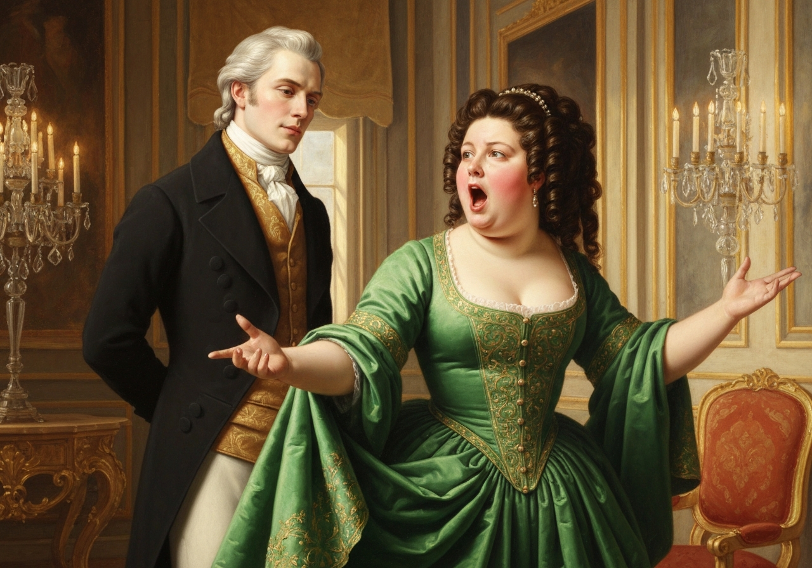

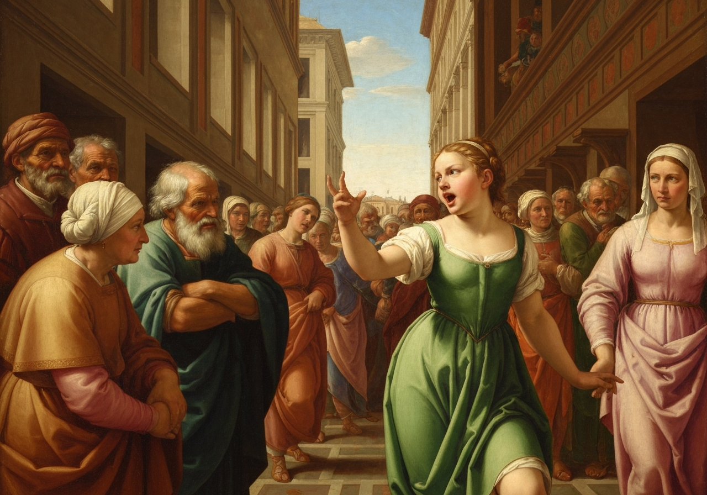
{/* metadata:image-7:end */}

 and Elizabeth returned
instantly to Jane, leaving her own and her relations’ behaviour to the
remarks of the two ladies and Mr. Darcy;

{/* metadata:analysis-7:start */}
<Callout title="Analysis [7]" variant="explanation">
Miss Bingley uses Mrs. Bennet's behavior as ammunition to attack Elizabeth's standing in Darcy's eyes. By mocking the 'fine eyes' of a woman with such embarrassing relations, she attempts to devalue Elizabeth. Darcy's refusal to join the censure suggests his growing, albeit reluctant, admiration is surpassing social prejudice.
</Callout>
{/* metadata:analysis-7:end */}

 the latter of whom, however,
could not be prevailed on to join in their censure of _her_, in spite of
all Miss Bingley’s witticisms on _fine eyes_.

[Illustration]
