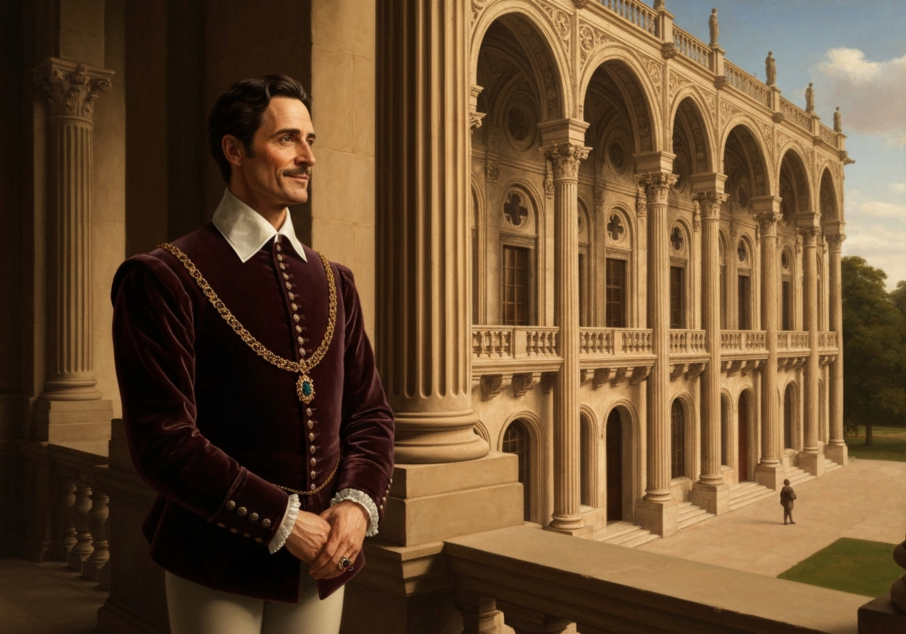
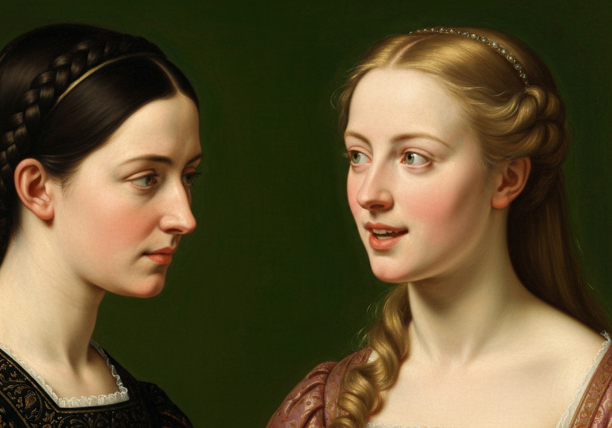
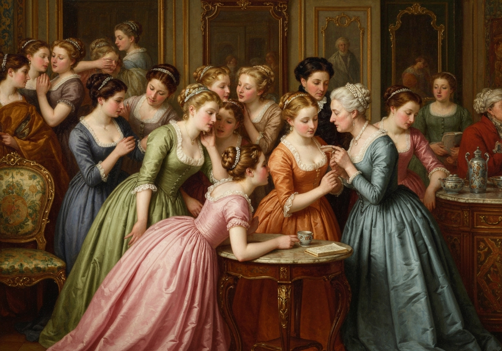
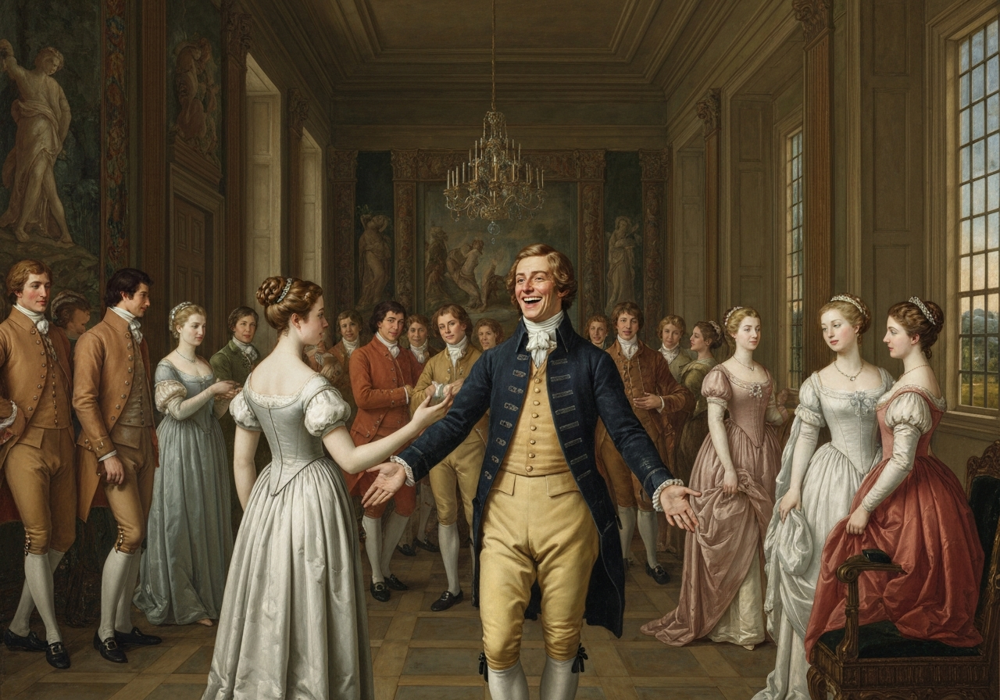
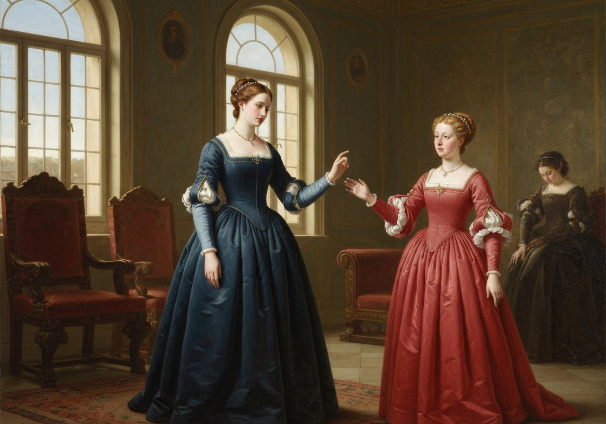
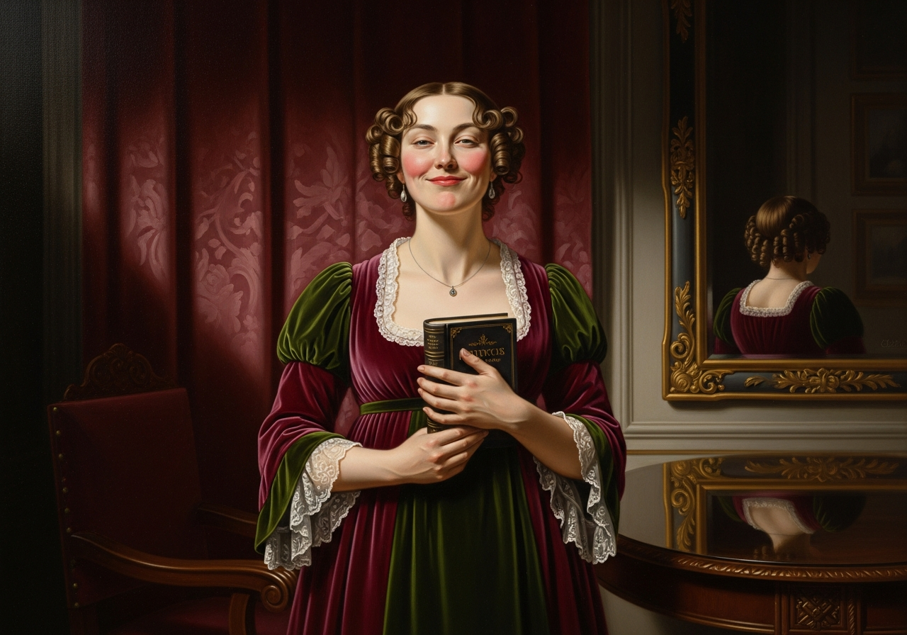
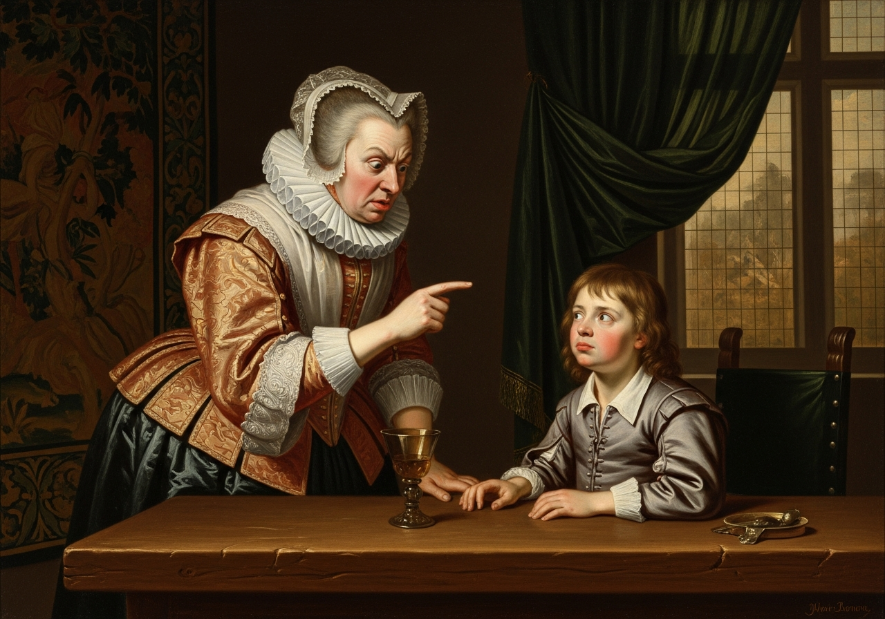

import Callout from '@/components/Callout.astro'

Katika umbali mfupi kutoka Longbourn, kulikuwa na familia ambayo familia ya Bennet ilikuwa na urafiki wa karibu. Sir William Lucas hapo awali alikuwa mfanyabiashara huko Meryton, ambako alipata utajiri mzuri, na alipandishwa cheo na kupewa heshima ya kuwa shujaa kupitia hotuba aliyotoa kwa mfalme wakati wa uhusho wake. Heshima hiyo, labda, ilionekana kuwa kubwa sana. Ilimsababisha kupoteza hamu ya biashara yake na kuishi katika mji mdogo; na, akiacha yote hayo, alihamia na familia yake katika nyumba iliyokuwa umbali wa maili moja kutoka Meryton, ambayo tangu wakati huo iliitwa Lucas Lodge; ambako alikuwa anaweza kufikiria kwa furaha kuhusu umuhimu wake, na,

<Callout title="Memorable Quote" variant="note">
, akiwa hajalazimishwa na biashara, alijitolea kwa bidii kuwa mkarimu kwa kila mtu.
</Callout>

<Callout title="Analysis [1]" variant="explanation">
Mabadiliko ya Sir William Lucas kutoka kwa mfanyabiashara hadi kuwa shujaa yanaonyesha jinsi hali ya kijamii inavyoweza kubadilika huko Meryton. Kupata cheo kumempa 'chuki' kwa biashara yake ya zamani na hisia mpya ya umuhimu wake binafsi. Licha ya kupandishwa cheo hicho, anaendelea kuwa mtu wa kirafiki na mwenye upole, jambo ambalo linatofautiana sana na ubaridi wa Darcy.
</Callout>

Kwa sababu, ingawa alifurahi kwa cheo chake, hilo halikumfanya ajisikie kuwa bora kuliko wengine; badala yake, alikuwa akijitahidi kuwafurahisha wote. Kwa asili, alikuwa mtu wa kirafiki, mwenye upole, na mkarimu, na kuwasilishwa kwake huko St. James's kulimfanya awe mtu wa heshima.

Lady Lucas alikuwa mwanamke mzuri sana, si mwerevu sana kiasi cha kuwa jirani muhimu kwa Bibi Bennet. Walikuwa na watoto kadhaa. Mmoja wao, msichana mchanga mwenye akili, mwenye busara, mwenye umri wa miaka ishirini na saba, alikuwa rafiki wa karibu wa Elizabeth.

<Callout title="Analysis [2]" variant="explanation">
Charlotte Lucas anaanzishwa kama rafiki wa karibu wa Elizabeth na mwanamke mwenye akili na busara mwenye umri wa miaka ishirini na saba. Uangalifu wake unamruhusu kuona kiburi cha Darcy kwa mtazamo wa moja kwa moja zaidi kuliko familia ya Bennet. Anawakilisha mtazamo wa kijamii ambao unalingana na majibu ya Elizabeth, ambayo ni ya hisi na ya kihisia zaidi.
</Callout>

Ni muhimu sana kwamba Miss Lucases na Miss Bennets wakutane ili kuzungumzia kuhusu karamu.

<Callout title="Analysis [3]" variant="explanation">
Mkutano kati ya familia ya Bennet na familia ya Lucas ili kujadili karamu unaelezwa kama mahitaji ya kijamii "ambayo ni muhimu sana". Ibada hii inaruhusu familia hizo kulinganisha "mazungumzo yao" na kuimarisha hali yao ya kijamii. Inaonyesha jinsi jamii inavyoshughulikia na kuweka kanuni za uzoefu wa kijamii kupitia uvumi na hukumu ya pamoja.
</Callout>

na asubuhi baada ya mkusanyiko huo.
aliileta hapo awali Longbourn ili asikie na azungumze.

“_Wewe_ ulianza jioni vizuri, Charlotte,” alisema Bibi Bennet, kwa utulivu na heshima, kwa Miss Lucas. “_Wewe_ ulikuwa chaguo la kwanza la Bwana Bingley.”

“Ndiyo; lakini inaonekana alipenda chaguo lake la pili zaidi.”

“Oh, unamaanisha Jane, nadhani, kwa sababu aliimba naye mara mbili. Hakika, inaonekana kama angependa – kwa kweli, nadhani angependa – nimesikia kitu kuhusu hilo – lakini sijui hasa ni nini – kitu kuhusu Bwana Robinson.”

“Labda unamaanisha kile nilichosikia kati yake na Bwana Robinson: je, sikukuambia? Bwana Robinson alimwuliza jinsi alivyopenda sherehe zetu za Meryton, na kama alidhani kulikuwa na wanawake wengi wazuri katika chumba hicho, na _ni_ yupi aliyemfikiria kuwa mzuri zaidi? Na alijibu mara moja swali la mwisho,

<Callout title="Memorable Quote" variant="note">
Oh, Miss Bennet mkubwa, bila shaka: hakuna maoni mawili kuhusu hilo.
</Callout>

<Callout title="Analysis [4]" variant="explanation">
Tangazo la mara moja na la hadharani la Bwana Bingley kuhusu urembo wa Jane kwa Bwana Robinson hutumikia kuimarisha hadhi yake kama 'msichana mzuri' maarufu katika eneo hilo. Hisia hii isiyo na shaka ni hasa kile ambacho Bibi Bennet anatamani kwa maendeleo ya kijamii ya binti zake. Inaunda msingi wa matumaini ya kimapenzi ambayo yataendeleza hadithi kwa sura kadhaa zijazo.
</Callout>

“Kwa kweli! Naam, hilo lilikuwa wazi sana – inaonekana kama – lakini, hata hivyo, inaweza kuwa hakuna chochote, unajua.”

“_Nilichosikia_ kilikuwa muhimu zaidi kuliko _chako_, Eliza,” alisema Charlotte. “Bwana Darcy haifai kusikilizwa kama rafiki yake, sivyo?”

<Callout title="Memorable Quote" variant="note">
Eliza maskini! kuwa mzuri tu.
</Callout>

“Nakusihi usimwambie Lizzy ili asikasirike kwa sababu ya tabia yake mbaya, kwa sababu yeye ni mtu mbaya sana kiasi kwamba itakuwa jambo baya kuwapendwa na yeye. Bibi Long aliniambia jana usiku kwamba aliketi karibu naye kwa nusu saa bila kufungua midomo yake hata mara moja.”

“Je, una hakika, mama? Je, kuna makosa kidogo?” alisema Jane. “Hakika nilimwona Bwana Darcy akizungumza naye.”

“Ndiyo, kwa sababu alimwuliza mwishowe jinsi alivyopenda Netherfield, na hakuweza kujizuia kujibu; lakini alisema inaonekana alikasirika sana kwa kuwa aliulizwa.”

“Miss Bingley aliniambia,” alisema Jane, “kwamba yeye hazungumzi sana isipokuwa akiwa na marafiki zake wa karibu. Akiwa _nao_, yeye ni rafiki sana.”

“Siamini hata neno moja la hilo, mpenzi wangu. Ikiwa angekuwa rafiki sana, angezungumza na Bibi Long. Lakini naweza kudhania ilikuwa vipi; kila mtu anasema kwamba yeye ana kiburi, na nadhani alikuwa amesikia kwa njia fulani kwamba Bibi Long hana gari, na alilazimika kuja kwenye sherehe kwa gari la kukodisha.”

“Sijali kama hatazungumzi na Bi. Long,” alisema Miss Lucas, “lakini ningependa angecheza na Eliza.”

“Kwa wakati mwingine, Lizzy,” alisema mama yake, “mimi singecheza naye, ikiwa ningekuwa wewe.”

<Callout title="Memorable Quote" variant="note">
Naamini, mama, naweza kuahidi kwa uhakika kwamba sitacheza naye tena.
</Callout>

“Kiburi chake,” alisema Miss Lucas, “hakinisumbui sana kama kiburi kinavyoweza kusumbua, kwa sababu kuna sababu ya kuwa na kiburi. Haiwezi kushangaza kwamba kijana mrembo sana, mwenye familia, utajiri, na kila kitu kinachomfaa, anaweza kujiona yeye ni mtu muhimu.

<Callout title="Memorable Quote" variant="note">
Ikiwa naweza kusema hivyo, ana haki ya kuwa na kiburi.
</Callout>

<Callout title="Analysis [5]" variant="explanation">
Hoja ya Charlotte kwamba Darcy ana ‘haki ya kuwa na kiburi’ kwa sababu ya familia na utajiri wake, inaanzisha hisia ya kawaida ya enzi ya Regency. Anapendekeza kwamba hadhi ya juu ya kijamii inastahili maoni mazuri kuhusu mtu. Mtazamo huu unapinga maoni ya Elizabeth kwamba kiburi ni kasoro ya tabia, bila kujali hadhi ya kijamii.
</Callout>

“Hiyo ni kweli sana,” alijibu Elizabeth.

<Callout title="Memorable Quote" variant="note">
Ningeweza kumsamehe kwa urahisi kiburi chake, ikiwa hakijanishusha heshima yangu.
</Callout>

<Callout title="Analysis [6]" variant="explanation">
Kukubali kwa Elizabeth kwamba angeweza kumsamehe kiburi cha Darcy ikiwa hakijamshusha heshima yake, ni wakati muhimu wa kujitafakari. Inaonyesha kwamba chuki yake dhidi yake inatokana na madhara ya kibinafsi badala ya uchanganuzi wa tabia. Udhaifu huu unafanya tabia yake iwe rahisi kuielewa huku pia inathibitisha kasoro yake kuu.
</Callout>

“Kiburi,” alisema Mary, ambaye alijivunia uimara wa tafakari zake, “ni kasoro ya kawaida sana, nadhani. Kwa yote niliyosoma, nimehakikishwa kwamba ni kasoro ya kawaida; kwamba tabia ya binadamu inaikabili sana, na kwamba kuna wachache kati yetu ambao hawapendi hisia ya kujivunia kwa sababu ya ubora fulani, wa kweli au wa jua. Ujuzi na kiburi ni mambo tofauti, ingawa maneno hayo hutumiwa mara nyingi kwa maana sawa. Mtu anaweza kuwa na kiburi bila kuwa na ujuzi.

<Callout title="Memorable Quote" variant="note">
Kiburi kinahusiana zaidi na maoni yetu kuhusu sisi wenyewe; ujuzi unahusiana na tunachotaka wengine wafikirie kuhusu sisi.
</Callout>

<Callout title="Analysis [7]" variant="explanation">
Uchanganuzi wa kifalsafa wa Mary Bennet kuhusu kiburi na ujuzi hutumika kama msingi wa kimaadili wa jina la riwaya. Anatofautisha kati ya maoni ya mtu kuhusu yeye mwenyewe (kiburi) na kile anachotaka wengine wafikirie (ujuzi). Maoni yake, ingawa ni ya kitaalamu, hutoa mfumo muhimu wa kutathmini matendo ya wahusika.
</Callout>

“Ikiwa ningekuwa tajiri kama Bwana Darcy,” alisema kijana Lucas, ambaye alikuja na dada zake, “hisingelikuwa na wasiwasi kuhusu kuwa na kiburi. Ningeweza kuweka kundi la”
"Mbwa wa uwindaji, na kunywa chupa ya mvinyo kila siku," alisema.

"Basi utanywa zaidi ya inavyopaswa," alisema Bi. Bennet; "na ikiwa nikuona unafanya hivyo, nitachukua chupa yako mara moja."

Mvulana huyo alipinga kwamba asifanye hivyo; aliendelea kusema kwamba angefanya hivyo; na mjadala huo uliisha tu baada ya ziara hiyo.
